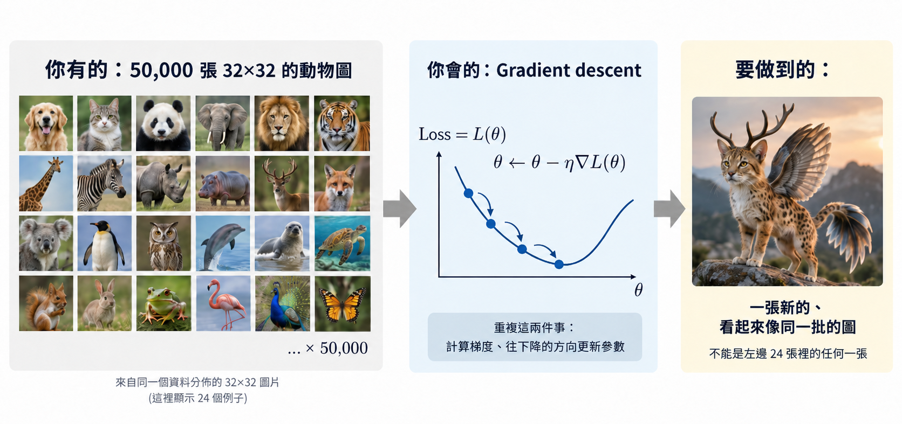
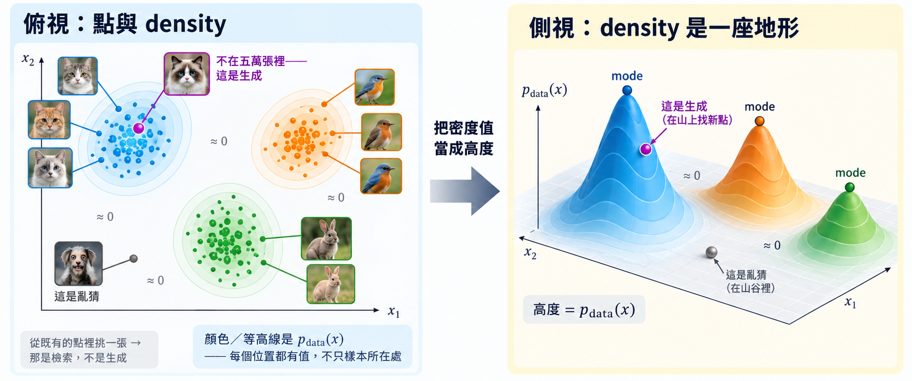

import Objectives from '../../../components/Objectives.astro';
import Prereq from '../../../components/Prereq.astro';
import Question from '../../../components/Question.astro';
import Answer from '../../../components/Answer.astro';
import QuizBlock from '../../../components/QuizBlock.astro';
import Option from '../../../components/Option.astro';
import Explanation from '../../../components/Explanation.astro';
import VizPlan from '../../../components/VizPlan.astro';
import Bridge from '../../../components/Bridge.astro';
import Ref from '../../../components/Ref.astro';
import Details from '../../../components/Details.astro';
import Ask from '../../../components/Ask.astro';
import Remark from '../../../components/Remark.astro';

# 生成到底在學什麼？

<Objectives>
- **把「生成」翻成一個機率的問題。** 說明「生成一張新圖」就是「從看不見的 distribution $p_{\text{data}}$ 再抽一個點」，並分清樣本、mode 與 distribution 的關係。
- **說明直接學密度可能會遇到什麼問題。** 訓練卡在 $Z_\theta$ 的梯度（要估它就得先從 $p_\theta$ 抽樣），取樣則卡在「密度學得近，不代表 score 也學得近」——而取樣真正需要的物件正是 score。
- **說明「換成學一個生成函數（transport map）」的想法，為什麼會把我們推向自己指定路徑。** 沒有配對的 $L_2$ 最佳解是一張平均圖；normalizing flow 把 likelihood 換回來了，但代價是每一步都要可逆、要算得動 log-det——而那個代價是為一個本來就不唯一的選擇付的。
</Objectives>

<Prereq items={frontmatter.prereqs} />

## 一個看起來很簡單的要求

我們手上有五萬張 `32×32` 的圖片。
從過去對機器學習與深度學習的理解，我們已經很熟悉一套基本做法：
定義 loss，然後用梯度下降把它降下來。
現在，突然有人丟給你一個不太一樣的問題：
只靠這些我們已經會的工具，能不能讓模型「生」出一張它從沒看過，卻看起來像是來自同一批資料的新圖片？

**圖：問題長什麼樣。** 這其實就是我們現在面對的問題：手上有一堆樣本，我們會做的事情是透過定義 loss 去做 gradient descent，但最後想得到的，卻是一個看起來像是新的、卻又合理的樣本。

這篇我們想要把這句看起來很直覺的要求，慢慢翻成一個我們真的可以處理的數學問題，並在工程上實作看看。首先我們要先理解：

<Ask>
什麼叫做「生」出一張圖片？ 
以及，什麼又叫做 
「看起來像是來自同一批資料」？
</Ask>

## 「生」一張圖片，與「來自同一批資料」

一張 `32×32` 的彩色 RGB 圖片，總共由 $32\times32\times3=3072$ 個數字構成（RGB 共 3 種顏色）。把每個數字當成一個座標，一張圖就可以被想成 3072 維歐氏空間 $\mathbb R^{3072}$ 裡的**一個點**。

<Remark summary="3072 維空間裡的一個點是什麼意思？">
就是一個由 3072 個數字排成的向量。比較熟悉的例子是 $\mathbb R^3$：一個點就是 $(x_1,x_2,x_3)$ 這樣三個數字，例如 $(1,\,2,\,-0.5)$，可以想成三維空間裡的一個位置。$\mathbb R^{3072}$ 只是把「三個數字」換成「3072 個數字」。
</Remark>

所以，每一張可能出現的 `32×32` RGB 圖片，都對應到這個空間中的某一個點。但這些圖片並不是毫無規律地出現在整個空間裡：真實世界中，某些圖片比較常出現、某些圖片比較少見，還有很大量的點可能對應到的只是一團噪聲，或根本不像合理的圖片。

也就是說，所有可能的資料背後，其實存在著某種 **distribution**：它描述了資料比較可能出現在哪裡、又比較不可能出現在哪裡。我們把這個真實但未知的資料分布記成 $p_{\text{data}}$。

如果把它想成連續分布，$p_{\text{data}}(x)$ 就是它的 **probability density**。不要直接把它理解成「資料剛好出現在 $x$ 這個點的機率」，而比較適合理解成：**資料有多密集地出現在 $x$ 附近**。$p_{\text{data}}(x)$ 越高，代表從這個資料來源中抽樣時，我們越容易看到落在這附近的圖片；越低，則代表這附近的圖片比較少見。

<Remark summary="為什麼不說「機率」？">
在連續空間裡，任何單一個點的機率都是 0；而 $p_{\text{data}}(x)$ 這個值本身甚至可以大於 1，所以它不可能是機率。有意義的是把密度乘上一小塊體積：$p_{\text{data}}(x)\,\mathrm dx$ 才近似「抽一個樣本、它落在 $x$ 附近那一小塊」的機率，而如果把整個空間積分起來，則會等於 1——因為樣本一定會落在空間中的某個位置。
</Remark>

因此，$p_{\text{data}}$ 是一個定義在整個資料空間上的**函數**：空間中的每個位置都有一個 density value。如果我們能把這個值當成高度畫出來，它就像是一片地形——資料常出現的地方是高地，少出現的地方比較低，而局部最密集的位置就是 **mode**。

現在回頭看我們手上的五萬張圖片。這五萬張圖片不是 $p_{\text{data}}$ 本身，而只是從 $p_{\text{data}}$ 中抽出來的五萬個**樣本**；換成幾何的語言，它們就是 $\mathbb R^{3072}$ 裡我們實際觀察到的五萬個點。因為它們來自同一個 $p_{\text{data}}$，所以通常也會反映出背後分布的一部分結構：某些區域的樣本很多，某些區域很少，還有大量區域我們可能一個樣本都沒有看過。

**圖：從樣本到 distribution。** 左邊是俯視：每一團由相似的同一種動物的照片聚集而成，顏色與等高線是 $p_{\text{data}}(x)$——**每個位置都有值，不只樣本所在處**。右邊把密度值當成高度立起來，$p_{\text{data}}$ 就成了一片地形，山峰是 mode、山谷幾乎是零。（真實資料在 $\mathbb R^{3072}$，這裡壓成 2D＋高度只是為了 demo。）

有了這個畫面，「生成」和「看起來像是來自同一批資料」其實就可以一起說清楚了。

所謂**生成**，就是希望再從 $p_{\text{data}}$ 中抽出一個新的點。不是從原本五萬張圖片裡挑一張出來——那比較像是**檢索**——而是產生一個**我們之前沒有看過的新樣本**。

為什麼這個新樣本仍然會「像」原本的資料？因為**它和那五萬張圖片來自同一個 distribution**。$p_{\text{data}}$ 密度高的地方比較容易被抽到，密度低的地方比較不容易，所以抽出來的點大多會落在合理的區域。

但要注意，**我們並沒有一條規則可以直接「禁止」它落在低密度的地方**；只是那些地方本來就比較不容易被抽到而已。

所以，「看起來像是來自同一批資料」更精確地說，就是：

> **這個新的點，也像是從同一個 $p_{\text{data}}$ 裡抽出來的。**

麻煩也正在這裡：**決定資料怎麼生成的是背後的 $p_{\text{data}}$，但我們看不到它**——拿得到的只有從它抽出來的有限樣本。**我們看得到的是五萬個點，真正想知道的卻是產生這些點的那片「地形」。**

<Question id="Q1">
既然「生成」就是「從 $p_{\text{data}}$ 再抽一個」，那最直覺會想到的做法可能呼之欲出：就拿一個神經網路 $p_\theta(x)$ 去逼近 $p_{\text{data}}$，訓練好後再從 $p_\theta$ 抽樣不就好了？但仔細想一下，**這條路會遇到什麼阻礙、卡在哪裡？**

<Answer>
**normalizing constant 帶來的麻煩。** 假設我們直接用一個 energy-based model 來表示資料分布：

$$
p_\theta(x)=\frac{e^{-E_\theta(x)}}{Z_\theta},\qquad
Z_\theta=\int e^{-E_\theta(x)}\,dx .
$$

$Z_\theta$ 的角色是 normalizing constant。一個機率密度函數必須滿足兩個條件：**處處非負**、而且**在整個空間上積分等於 1**；$e^{-E_\theta(x)}$ 自動保證了非負，$Z_\theta$ 則負責把積分壓成 1。

如果我們用最直覺的 maximum likelihood 來訓練，$\log p_\theta(x)=-E_\theta(x)-\log Z_\theta$，把梯度推出來就會看到麻煩：

$$
\nabla_\theta\log p_\theta(x)=-\nabla_\theta E_\theta(x)+\underbrace{\mathbb E_{x'\sim p_\theta}\big[\nabla_\theta E_\theta(x')\big]}_{=\ \nabla_\theta\log Z_\theta}.
$$

值得注意的是，我們其實從來不需要算出 $Z_\theta$ 的**數值**（那是一個 3072 維的積分，硬算當然也不可能）；真正躲不掉的是它的**梯度**，而那一項是一個**對模型自己分布取的期望**——要估它，就得先從 $p_\theta$ 抽樣。所以問題變成：**我們本來只是想訓練一個 distribution，結果訓練過程自己先要求我們會從這個 distribution 抽樣。** 那接著就得問：從 $p_\theta$ 抽樣這件事，到底有多難？

**取樣的困難。** 先假設訓練這一關過了，我們手上已經有一個相當精確的 $p_\theta$。要從它抽樣，標準做法是 Langevin dynamics [10]：

$$
x_{k+1}=x_k+\frac{\eta}{2}\,\nabla_x\log p_\theta(x_k)+\sqrt{\eta}\,\epsilon_k,\qquad \epsilon_k\sim\mathcal N(0,I),
$$

而 $\nabla_x\log p_\theta(x)=-\nabla_x E_\theta(x)$——$Z_\theta$ 對 $x$ 是常數，微分之後就直接消失了。換句話說，**真正做 sampling 的時候，我們甚至不需要知道完整的 density 長什麼樣，只需要知道它往哪個方向增加得最快。** 這個方向資訊 $\nabla_x\log p_\theta(x)$，就是後面一直會看到的 **score**。

但是**density 學得接近，不代表 score 就一定也學得接近。** 想像在一片平緩的地形上鋪一層很細很密的波紋：海拔幾乎沒有變，但每一點的坡度——往哪邊傾、有多陡——卻完全不一樣。

這件事可以直接算出來。把 $\log p$ 加上一道很小的波紋，$\log\tilde p=\log p+0.01\sin(1000x)$（再重新歸一化）。密度的比值到處都在 $e^{\pm0.02}$ 之內，也就是**差不到 2%**；但 score 多出來的那一項是

$$
\nabla_x\log\tilde p-\nabla_x\log p=0.01\times 1000\times\cos(1000x),
$$

最大差到 **10**。密度幾乎一模一樣，坡度可以完全不同——而取樣用的正是坡度。

所以，既然 sampling 真正依賴的是 score，一個更直接的問題就會冒出來：

> **我們能不能不要先學 density，直接把 score 學起來？**

這就是 <Ref to="dma-tweedie-and-score"/> 會走到的主線（score matching [9]）。但在這之前，我們先從另一個角度看同一個問題。
</Answer>
</Question>

## 換一個角度：不學密度，直接學一個能生成樣本的函數？

既然從 $p_{\text{data}}$ 抽樣可能很難，那換個角度：有沒有哪個分布是我們**本來就會抽**的？有——標準 Gaussian $\mathcal N(0,I)$。

<Remark label="符號" summary="為什麼 Gaussian 這麼好抽？">
$\mathcal N(0,I)$ 是 $\mathbb R^{d}$ 上的**標準常態分布**。它之所以「很好抽」，關鍵不是 density 長得簡單，而是**我們知道怎麼直接從它產生樣本**：從電腦本來就很容易產生的 uniform random numbers 出發，經過一個已知的轉換（例如 Box–Muller），就得到一個標準常態樣本。不需要「先從某個地方出發、再一步一步跑到正確的分布」——那才是 MCMC 在做的事。

到了 $d$ 維就更簡單，因為每個座標彼此獨立：

$$
z_i\overset{\text{iid}}{\sim}\mathcal N(0,1),\qquad
p_z(z)=(2\pi)^{-d/2}\exp\!\Big(-\tfrac{1}{2}\|z\|^2\Big).
$$

所以抽一個 $d$ 維樣本，只是直接抽 $d$ 個一維 Gaussian——程式裡的一行 `torch.randn(d)`，背後做的就是這件事。
</Remark>

既然 Gaussian 這麼容易抽，就可以換一個角度想：把 $\mathcal N(0,I)$ 當成一種**隨手可得的原料**——想要多少就抽多少。但我們真正想要的不是 Gaussian noise，而是來自 $p_{\text{data}}$ 的圖片。那問題就變成：

> **能不能找到一台「加工機器」，把這些隨手可得的 Gaussian 原料，變成我們真正想要的資料？**

把這台機器寫成一個函數（function）$G$：先抽一個 $z\sim\mathcal N(0,I)$，再把它丟進 $G$，得到 $x=G(z)$。如果 $G$ 學得夠好，讓大量不同的 $z$ 經過它之後，產生的 $x$ 整體上正好遵循 $p_{\text{data}}$，那生成問題就解決了：

$$
z\sim\mathcal N(0,I)\quad\Longrightarrow\quad G(z)\sim p_{\text{data}}.
$$

生成一個新樣本於是只剩兩件事：**先抽一個很好抽的 $z$，再用 $G$ 把它變成我們真正想要的 $x$。** 用機率的語言說，$G$ 把 $\mathcal N(0,I)$ 這個 distribution **搬成了 $p_{\text{data}}$**——這件事叫做 **pushforward**；而負責搬運的這個 $G$，也常被稱作把 $\mathcal N(0,I)$ 送到 $p_{\text{data}}$ 的 **transport map**（傳輸映射）。

<Remark label="定義" summary="Pushforward">
給一個分布 $p_z$ 和一個（可測）函數 $G$，把每個樣本都送過 $G$ 之後得到的新分布記成 $G_\#p_z$，定義是：對任意集合 $A$，

$$
\big(G_\#p_z\big)(A)\;=\;p_z\big(G^{-1}(A)\big),
$$

也就是「$G(z)$ 落在 $A$ 裡」的機率，等於「$z$ 落在會被 $G$ 送進 $A$ 的那些位置」的機率。等價的寫法是對任意函數 $f$，

$$
\mathbb E_{x\sim G_\#p_z}\big[f(x)\big]=\mathbb E_{z\sim p_z}\big[f(G(z))\big].
$$

於是我們的目標可以一行寫完：**找一個 $G$ 使 $G_\#\mathcal N(0,I)=p_{\text{data}}$。**
</Remark>

那接下來的問題就很直接了：**我們要怎麼學這個 $G$？** 我們手上有 $p_{\text{data}}$ 的樣本、也有 $G(z)$ 的樣本，得從這裡寫出一個對 $\theta$ 可微的 loss。

<Question id="Q2">
手上既然有真實資料 $x$，也有生成出來的 $G(z)$，那用傳統 prediction 的做法不就好了：抽一批 $z$、算出 $G(z)$，再跟資料算 $L_2$：

$$
\mathcal L(\theta)=\mathbb E_{z,\,x}\big\|G_\theta(z)-x\big\|^2 .
$$

**這樣訓練下去會發生什麼事？**

<Answer>
問題在於：$L_2$ 需要**配對**，但這裡沒有人告訴我們哪個 $z$ 該對到哪張圖。$z$ 是我們自己隨手抽的，$x$ 是資料集裡隨手拿的一張，兩者之間本來就沒有任何對應關係。

而如果配對是隨機的，這個 loss 的最佳解可以直接算出來。固定一個 $z$，因為 $x$ 與 $z$ 獨立，

$$
\arg\min_{v}\ \mathbb E_{x}\big\|v-x\big\|^2=\mathbb E[x]
\qquad\Longrightarrow\qquad
G_\theta(z)\equiv\mathbb E_{x\sim p_{\text{data}}}[x]\ \ \text{對所有 } z .
$$

也就是說，**模型的最佳策略是不管拿到什麼 $z$，都輸出同一張「所有訓練圖片的平均」**——一張灰灰的、模糊的四不像。它的 $L_2$ 很低，但完全沒有多樣性，更不是從 $p_{\text{data}}$ 抽出來的樣本。這正是 regression 遇到多解問題時會出現的**回歸到平均**。

再往上看一層，會發現是**目標本身錯位**了：我們真正要的是「$G(z)$ 的分布等於 $p_{\text{data}}$」——一個**分布層級的條件**；而 $L_2$ 問的是「這一個 $G(z)$ 有沒有對上這一張 $x$」——一個**逐樣本的條件**。兩堆樣本可以分布完全相同，隨機抽樣卻沒有任何一對彼此靠近。因此，設計一個逐樣本的 loss 去學一個分布層級的目標，答案自然會塌陷掉。

所以要讓 loss 有意義，只有兩條路：

- 換一個**分布層級的目標**（normalizing flow 的 likelihood、GAN 的判別器、MMD…），也就是下一節要走的方向；
- 或者，**自己把配對定下來**——如果每個 $z$ 都被指定好要變成哪個 $x$（甚至指定整條中間路徑），逐樣本的回歸就重新變得合理。

第二條路正是 diffusion 與 flow matching 的做法，本篇最後的 Q3 會回到這件事。
</Answer>
</Question>

## 第一種答案：Normalizing Flow

上一個問題的結論是：使用逐樣本的 $L_2$ loss 不行，我們需要一個**針對分布的目標**——去測量 $G_\theta(z)$ 產生出來的整體 distribution，和 $p_{\text{data}}$ 到底有多像。

比較直覺的想法是：利用上面 $G_\theta$ 與 $p_\theta$ 的關係，先把 $p_\theta$ 算出來，再拿它跟 $p_{\text{data}}$ 設計成一個 objective。

而這件事真的做得到——因為 $x=G_\theta(z)$、$z\sim\mathcal N(0,I)$，$x$ 的隨機性完全來自 $z$。只要 $G_\theta$ 是**可逆的**、而且夠光滑，change of variables 就能把 $p_\theta(x)$ 寫成 base distribution $p_z$（也就是我們使用的 Gaussian 分布）的 density，再加上一個由 $G_\theta$ 的 Jacobian 決定的修正項：

$$
\log p_\theta(x)=\log p_z\!\big(G_\theta^{-1}(x)\big)+\log\Big|\det\frac{\partial G_\theta^{-1}}{\partial x}(x)\Big| .
$$

很高興的是，右邊每一項都算得出來：我們終於有了一個真的可以拿來比較的 distribution，這時候就可以用那個最自然的訓練原則 maximum likelihood [1, 8]：

$$
\min_\theta\ \mathcal L(\theta)=-\,\mathbb E_{x\sim p_{\text{data}}}\big[\log p_\theta(x)\big].
$$

<Remark summary="什麼是 maximum likelihood？為什麼這樣做有用？">
可以把模型分布 $p_\theta$ 想成一個下注的人。他手上的籌碼總額固定——這對應到

$$
\int p_\theta(x)\,dx=1 .
$$

他要做的，就是把這些籌碼分配到整個資料空間：某些地方押多一點，某些地方押少一點。

接著，我們把手上的五萬張圖片 $x^{(1)},\ldots,x^{(N)}$ 一張一張攤出來，每次都問：「這張圖片出現的位置，你押了多少？」模型在 $x^{(i)}$ 上押的量就是 $p_\theta(x^{(i)})$；取 log 之後的 $\log p_\theta(x^{(i)})$，就是這筆資料對 log-likelihood 的貢獻。

因為籌碼總額固定，模型不能靠「所有地方都押很多」來作弊：押到幾乎不會出現資料的地方，就代表能留給真正資料區域的籌碼變少了。所以想讓 likelihood 變高，模型就必須慢慢把更多的 probability mass 放到資料真正容易出現的地方——直覺上，就是讓 $p_\theta$ 的地形越來越像 $p_{\text{data}}$。

對 $N$ 個獨立樣本來說，

$$
\frac1N\sum_{i=1}^N \log p_\theta\big(x^{(i)}\big)\;\approx\;\mathbb E_{x\sim p_{\text{data}}}\big[\log p_\theta(x)\big],
$$

因此 maximum likelihood 就是在最大化「資料實際出現位置上的平均 log probability」。

而且它確實是一個 distribution-level 的 objective，因為

$$
\mathrm{KL}\big(p_{\text{data}}\,\|\,p_\theta\big)=\mathbb E_{p_{\text{data}}}\big[\log p_{\text{data}}(x)\big]-\mathbb E_{p_{\text{data}}}\big[\log p_\theta(x)\big],
$$

第一項和 $\theta$ 無關，所以最大化 likelihood，就等價於最小化 $\mathrm{KL}(p_{\text{data}}\|p_\theta)$——而它等於 0 的唯一情況，就是兩個分布完全相同（<Ref to="math-kl"/>）。
</Remark>

有了一個要 minimize 的 objective，接下來就可以做 gradient descent 了。實際把它推開來看看長什麼樣——因為 $p_z$ 是 Gaussian，$\log p_z(z)=-\tfrac12\|z\|^2+\text{const}$，所以

$$
\mathcal L(\theta)=\mathbb E_{x\sim p_{\text{data}}}\Big[\tfrac12\big\|G_\theta^{-1}(x)\big\|^2-\log\Big|\det\frac{\partial G_\theta^{-1}}{\partial x}(x)\Big|\Big]+\text{const},
$$

$$
\nabla_\theta\mathcal L(\theta)=\mathbb E_{x\sim p_{\text{data}}}\Big[\underbrace{\tfrac12\nabla_\theta\big\|G_\theta^{-1}(x)\big\|^2}_{\text{倒推}}-\underbrace{\nabla_\theta\log\Big|\det\frac{\partial G_\theta^{-1}}{\partial x}(x)\Big|}_{\text{log-det}}\Big].
$$

也就是說，每看到一張訓練圖片 $x$，要算的就是這兩個 term。這裡有一件事值得注意：loss 裡完全沒有出現「生成」——訓練是把資料**倒推回 $z$**，不是從 $z$ 生成一批再去比較。

而問題也就出在這兩個 term 上：

- 第一項要求我們**真的算得出 $G_\theta^{-1}(x)$**：$G_\theta$ 不能只是理論上可逆，inverse 還得便宜到每一步訓練都算得起。
- 第二項更麻煩：一般 $d\times d$ 矩陣的 determinant 要 $O(d^3)$，$d=3072$ 光算這一項就算不動了，而我們還得對它做反向傳播。

所以 normalizing flow 十年的發展史，反覆做的都是同一個交換：

> **要拿到精確的 likelihood 來當 loss，就得為 $G$ 的每一步付出可逆性與 Jacobian 的代價。**

第一代把代價付在**結構**上：用特殊設計的可逆神經網路層，換到好算的 inverse（反函數 $G_\theta^{-1}$）與 $\det$，但框架和模型能力因此被限制住。第二代把代價付在**解 ODE** 上：讓 $G$ 是任意 vector field 的 ODE 解，表達力鬆綁了，但每個訓練樣本都要來回解一次 ODE。細節放在下面兩個補充，這裡先記住有這兩個困難。

前面卡住的是兩件事：inverse 要算得出來、log-det 要算得起。第一代的做法很直接——既然一般的網路層做不到，那就只用**做得到的那種層**來堆出 $G$。

NICE [2] 與 Real NVP [3] 用的是 coupling layer：把座標切成兩半 $x=(x_a,x_b)$，一半原封不動照抄過去，另一半做 affine transformation，而變換的係數由照抄的那半算出來：

$$
y_a=x_a,\qquad y_b=x_b\odot\exp\big(s(x_a)\big)+t(x_a).
$$

這樣設計有兩個好處。第一，反函數不用另外學：既然 $y_a$ 就是 $x_a$，我們手上永遠有算 $s,t$ 需要的東西，把同一組 $s,t$ 反著用就回去了。第二，Jacobian 是三角矩陣，determinant 只是對角線相乘，所以 $\log|\det|=\sum_i s_i(x_a)$，$O(d)$ 就算完。而 $s,t$ 自己可以是任意網路——它們不需要可逆。

MAF 與 IAF [4] 改用 autoregressive 的結構，拿到的也是同樣的三角 Jacobian；Glow [5] 再加上可逆的 $1\times1$ 卷積把通道打散，讓每一層動到的座標不要每次都一樣。

代價是：每一層只能動一半座標、維度也不能改，單層能做的事情其實很少，要疊很多層才有辦法把一個 Gaussian 慢慢拉成自然圖片的形狀。而且實際上還會看到一個現象——likelihood 的數字很漂亮，但抽出來的樣本常常不夠銳利。

上面那條路的限制，來自「每一層都要可逆」這個要求。Neural ODE [6] 換了一個想法：不要一層一層去設計，而是讓 $G$ 是一條 ODE 走出來的結果。

$$
\frac{dx}{dt}=v_\theta(x,t),\qquad x(0)=z,\quad G(z)=x(1).
$$

意思是：$z$ 是起點，$v_\theta$ 負責告訴每個位置「下一步往哪走」，讓它一路走到 $t=1$，走到的地方就是 $G(z)$。

這樣一來，兩個困難都有了新的答案。反函數不用設計，因為 ODE 只要把時間倒著走就回去了。determinant 也不用算——沿著一條軌跡走的時候，log-density 的變化率其實只是 $v_\theta$ 的 divergence（這件事叫 instantaneous change of variables）：

$$
\frac{d}{dt}\log p_t\big(x(t)\big)=-\nabla\!\cdot v_\theta\big(x(t),t\big),\qquad
\log p_\theta(x)=\log p_z(z)-\int_0^1 \nabla\!\cdot v_\theta\,dt .
$$

FFJORD [7] 就順著這條路走下去：$v_\theta$ 可以是任意網路，而 divergence 也不必真的算完整，用 Hutchinson trace estimator $\nabla\!\cdot v=\mathbb E_\epsilon[\epsilon^\top J_v\epsilon]$ 估一下就好，一次 vector-Jacobian product 就夠。到這裡，表達力的限制算是解除了。

但代價換到了另一個地方：每個訓練樣本都得**解一次 ODE 到 $t=1$、再解一次回來算梯度**（adjoint method），還要沿路估 trace。而且要解幾步不是我們決定的，是 adaptive solver 看情況決定，訓練越久往往還越多步。也就是說，訓練本身變成 simulation-based 的，貴到很難放大。

## 其實有無限多個生成方式

但這裡還有一個更根本的問題：**把 Gaussian 搬成 $p_{\text{data}}$ 的方法通常不只一種。** 可能有很多不同的 $G$，最後都能產生同一個 distribution：

$$
G_\#p_z=p_{\text{data}} .
$$

Maximum likelihood 在意的是最後得到的 $p_\theta$ 有沒有逼近 $p_{\text{data}}$，卻不會告訴我們「中間應該怎麼搬」才是唯一正確的。所以從 transport map 的角度看，**這個問題本身是 underdetermined 的**：終點的 distribution 固定了，但從起點到終點可以有很多條不同的路。

而如果我們又選擇用 normalizing flow 的 exact likelihood 來訓練，就還要額外為自己選的這條路付出計算代價——例如 inverse、Jacobian determinant，或在 continuous normalizing flow 裡反覆解 ODE。

<iframe loading="lazy" src="/personal_website/notes/research_areas/diffusion-models-applications/w3-0-many-maps.html" class="demo-frame" title="太多 G，還是自己定路徑：互動 demo" style="height: 880px; width: 100%; border: none;"></iframe>

**互動 demo：太多 G。** 按「換一組配對」，$t=0$ 的 Gaussian 與 $t=1$ 的目標分布都不會變，變的只有中間那團 $x_t$ 和每顆點走的路。

<Question id="Q3">
回頭想想 Q2：$L_2$ 之所以塌掉，是因為沒有人告訴我們哪個 $z$ 該對到哪張圖。那如果配對是我們自己指定的呢？

**如果我們不讓 likelihood 挑，而是自己先決定「每個 $x$ 要沿哪條路變成噪聲」，會發生什麼事？**

<Answer>
想像要把 A 倉庫的貨搬成 B 倉庫的擺法。哪一箱該搬到哪個位置有無數種方案；沒有人指定的時候，你只能整批搬完再回頭比對像不像——這正是 Q2 卡住的地方。但一旦**先寫好每一箱的搬運路線**，每個箱子在任何時刻都知道下一步該往哪走，搬運就從一個整體評估問題，變成一堆各自獨立的小任務。

回到數學：如果路徑是我們自己定的（例如「把資料一點一點加噪聲，直到變成 $\mathcal N(0,I)$」），那麼路徑上的每個中間點 $x_t$ 都是**已知的**，「它該往哪走」也是已知的。訓練就不需要模擬 ODE、也不需要 likelihood，只要在每個 $t$ 做一個普通的回歸：看到 $x_t$，預測它該往哪走。順帶連「有無限多個 $G$」也一起解決了——路徑一定，$G$ 就定了。

這就是 diffusion model（以及 <Ref week="dma-week-flow-matching"/> 的 flow matching）的起點，也是接下來這兩單元的核心想法：

> **不要一步到位，也不要讓 likelihood 自己挑路。**

我們把 $\mathcal N(0,I)\leftrightarrow p_{\text{data}}$ 之間的路徑先以某種方式定下來，讓每一步都變成一個回歸問題。
</Answer>
</Question>

<Remark summary="另外兩條不在這門課主線上的路：VAE 與 GAN">
其實除了 flow 以外，還有兩條大家很熟悉的路。它們同樣是在回答「$G$ 要怎麼訓練」，只是選擇付出不一樣的代價。

VAE 的想法是：既然 $p_\theta(x)$ 很難直接算，那就不要硬算——引入一個 latent 變數，改成去優化 likelihood 的一個**下界**（也就是 ELBO，見 <Ref to="ml-latent-variables-elbo" mode="title"/>）。這樣拿到的不再是精確的 likelihood，但至少是一個算得動、可以拿來做 gradient descent 的東西。

GAN 則更乾脆，直接放棄 likelihood：既然我們真正在意的只是「兩堆樣本像不像」，那就再訓練一個網路來幫我們評估這件事——這其實就是 Q2 說的那種分布層級目標的另一種做法。

這門課不會展開這兩條，不過 <Ref to="dma-denoising-regression"/> 在推 diffusion 的 loss 時，你會看到 ELBO 的影子。
</Remark>

## 消化一下

<QuizBlock id="w3-0-a">
對 $\mathcal L(\theta)=\mathbb E_{z,\,x}\|G_\theta(z)-x\|^2$（$z$ 與 $x$ 各自獨立隨機抽）做 minimization，如果真的達到最優解，$G_\theta$ 會變成什麼？
<Option correct>不管輸入什麼 $z$，都輸出訓練資料的平均。</Option>
<Option>一個把 $\mathcal N(0,I)$ 正確搬成 $p_{\text{data}}$ 的映射。</Option>
<Option>過度擬合到某幾張訓練圖片。</Option>
<Explanation>
因為 $x$ 與 $z$ 獨立，固定一個 $z$ 時最好的輸出就是 $\mathbb E[x]$，所以 $G_\theta$ 會塌成一張平均圖——$L_2$ 很低，但沒有任何多樣性。問題不在容量、也不是過擬合，而是「逐樣本的 loss ＋ 隨機配對」本身就不是一個分布層級的目標。
</Explanation>
</QuizBlock>

<QuizBlock id="w3-0-b">
Normalizing flow 要求 $G$ 可逆、且 Jacobian determinant 好算。這個要求是為了：
<Option>讓取樣更快。</Option>
<Option>保證把 $\mathcal N(0,I)$ 推到 $p_{\text{data}}$ 的 $G$ 是唯一的。</Option>
<Option correct>讓 $\log p_\theta(x)$ 能用 change of variables 精確寫出，好拿 maximum likelihood 當 loss。</Option>
<Explanation>
取樣本來就只是「抽 $z$ 算 $G(z)$」，跟可逆無關。可逆與好算的 Jacobian 是為了把 $\log p_\theta(x)=\log p_z(G^{-1}(x))+\log|\det \partial G^{-1}/\partial x|$ 每一項都算出來。$G$ 的唯一性根本不成立——這正是 Q3 的出發點。
</Explanation>
</QuizBlock>

<QuizBlock id="w3-0-c">
FFJORD 允許 $v_\theta$ 是任意網路，付出的代價是：
<Option correct>每個訓練樣本都要解一次 ODE 到終點、再解回來算梯度，並沿路估 divergence。</Option>
<Option>Jacobian 必須是三角矩陣。</Option>
<Option>無法計算 likelihood。</Option>
<Explanation>
三角 Jacobian 是 coupling / autoregressive flow 的限制，FFJORD 正是為了解除它。FFJORD 的 likelihood 是精確的（差在 trace 用 Hutchinson 估），代價是訓練變成 simulation-based：ODE 要來回解、步數由 solver 決定，很貴。
</Explanation>
</QuizBlock>

<QuizBlock id="w3-0-d">
「先自己決定每個 $x$ 沿哪條路變成噪聲」這一步，直接消掉了下面哪個困難？
<Option>從 $\mathcal N(0,I)$ 抽樣的成本。</Option>
<Option>網路容量不足。</Option>
<Option correct>「有無限多個 $G$、得靠 likelihood 挑一個」以及挑選時要模擬整條 ODE 的成本。</Option>
<Explanation>
路徑一定，$G$ 就定了，不再需要 likelihood 來挑；而且路徑上每個中間點都是已知的，訓練只剩下逐點回歸，不必模擬。抽 $\mathcal N(0,I)$ 本來就不是困難，網路容量也不是這一步在解的問題。
</Explanation>
</QuizBlock>

<Bridge to="dma-forward-process">
本篇把「生成」翻成「學一個把 $\mathcal N(0,I)$ 搬成 $p_{\text{data}}$ 的 $G$」，然後看到兩件事：逐樣本的 $L_2$ 會塌成一張平均圖，而 normalizing flow 拿到精確 likelihood 的代價是可逆性與 Jacobian。最後我們換了一個想法：自己把路徑定下來，讓每一步都變成回歸。下一篇說明這條路為什麼選「加噪聲」，以及它會把 $x_0$ 帶到哪裡。
</Bridge>

## 參考文獻

1. Papamakarios, G., Nalisnick, E., Rezende, D. J., Mohamed, S., Lakshminarayanan, B. [*Normalizing Flows for Probabilistic Modeling and Inference.*](https://arxiv.org/abs/1912.02762) JMLR 2021.
2. Dinh, L., Krueger, D., Bengio, Y. [*NICE: Non-linear Independent Components Estimation.*](https://arxiv.org/abs/1410.8516) ICLR 2015 workshop.
3. Dinh, L., Sohl-Dickstein, J., Bengio, S. [*Density Estimation using Real NVP.*](https://arxiv.org/abs/1605.08803) ICLR 2017.
4. Papamakarios, G., Pavlakou, T., Murray, I. [*Masked Autoregressive Flow for Density Estimation.*](https://arxiv.org/abs/1705.07057) NeurIPS 2017. （IAF：Kingma, D. P. et al. [*Improved Variational Inference with Inverse Autoregressive Flow.*](https://arxiv.org/abs/1606.04934) NeurIPS 2016.）
5. Kingma, D. P., Dhariwal, P. [*Glow: Generative Flow with Invertible 1×1 Convolutions.*](https://arxiv.org/abs/1807.03039) NeurIPS 2018.
6. Chen, R. T. Q., Rubanova, Y., Bettencourt, J., Duvenaud, D. [*Neural Ordinary Differential Equations.*](https://arxiv.org/abs/1806.07366) NeurIPS 2018.
7. Grathwohl, W., Chen, R. T. Q., Bettencourt, J., Sutskever, I., Duvenaud, D. [*FFJORD: Free-form Continuous Dynamics for Scalable Reversible Generative Models.*](https://arxiv.org/abs/1810.01367) ICLR 2019.
8. Rezende, D. J., Mohamed, S. [*Variational Inference with Normalizing Flows.*](https://arxiv.org/abs/1505.05770) ICML 2015.
9. Hyvärinen, A. [*Estimation of Non-Normalized Statistical Models by Score Matching.*](https://jmlr.org/papers/v6/hyvarinen05a.html) JMLR 2005. （Q1 提到「直接學 score」的出處；<Ref to="dma-tweedie-and-score"/> 會正式使用。）
10. Welling, M., Teh, Y. W. [*Bayesian Learning via Stochastic Gradient Langevin Dynamics.*](https://dl.acm.org/doi/10.5555/3104482.3104568) ICML 2011. （Q1 的 Langevin 更新式。）
