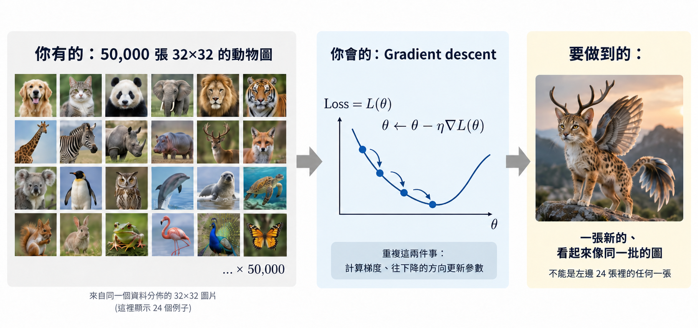
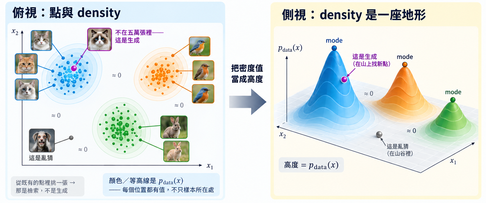

import Objectives from '../../../components/Objectives.astro';
import Prereq from '../../../components/Prereq.astro';
import Question from '../../../components/Question.astro';
import Answer from '../../../components/Answer.astro';
import QuizBlock from '../../../components/QuizBlock.astro';
import Option from '../../../components/Option.astro';
import Explanation from '../../../components/Explanation.astro';
import Bridge from '../../../components/Bridge.astro';
import Ref from '../../../components/Ref.astro';
import Ask from '../../../components/Ask.astro';
import Remark from '../../../components/Remark.astro';

# 生成到底在學什麼？

<Objectives>
- **把「生成」寫成 distribution-level 的目標。** 說出生成不是找回某一筆資料，而是學到一個接近 $p_{\text{data}}$ 的 distribution，讓我們可以再從中抽樣。
- **說出直接學 density 卡在哪裡。** 從 density 必須非負且積分為 1 出發，寫出 energy-based model，並看見 maximum likelihood 的梯度為什麼會要求我們先從 $p_\theta$ 抽樣。
- **說出為什麼要自己造出中間狀態。** 隨機配對的 $L_2$ 會學成平均；normalizing flow 雖然能計算 likelihood，卻要付出可逆性與 log-det 的代價。Forward process 則讓我們可以自己製造 noisy states 與 training pairs。
</Objectives>

<Prereq items={frontmatter.prereqs} />

## 一個看起來很簡單的要求

我們手上有五萬張 `32×32` 的圖片。
從過去對機器學習與深度學習的理解，我們已經很熟悉一套基本做法：
定義 loss，然後用梯度下降把它降下來。
現在，突然有人丟給你一個不太一樣的問題：
只靠這些我們已經會的工具，能不能讓模型「生」出一張它從沒看過，卻看起來像是來自同一批資料的新圖片？

**圖：問題長什麼樣。** 這其實就是我們現在面對的問題：手上有一堆樣本，我們會做的事情是透過定義 loss 去做 gradient descent，但最後想得到的，卻是一個看起來像是新的、卻又合理的樣本。

這篇我們想要把這句看起來很直覺的要求，慢慢翻成一個我們真的可以處理的數學問題，並在工程上實作看看。首先我們要先理解：

<Ask>
什麼叫做「生」出一張圖片？ 
以及，什麼又叫做 
「看起來像是來自同一批資料」？
</Ask>

## 「生」一張圖片，與「來自同一批資料」

一張 `32×32` 的彩色 RGB 圖片，總共由 $32\times32\times3=3072$ 個數字構成（RGB 共 3 種顏色）。把每個數字當成一個座標，一張圖就可以被想成 3072 維歐氏空間 $\mathbb R^{3072}$ 裡的**一個點**。

<Remark summary="3072 維空間裡的一個點是什麼意思？">
就是一個由 3072 個數字排成的向量。比較熟悉的例子是 $\mathbb R^3$：一個點就是 $(x_1,x_2,x_3)$ 這樣三個數字，例如 $(1,\,2,\,-0.5)$，可以想成三維空間裡的一個位置。$\mathbb R^{3072}$ 只是把「三個數字」換成「3072 個數字」。
</Remark>

所以，每一張可能出現的 `32×32` RGB 圖片，都對應到這個空間中的某一個點。但這些圖片並不是毫無規律地出現在整個空間裡：真實世界中，某些圖片比較常出現、某些圖片比較少見，還有很大量的點可能對應到的只是一團噪聲，或根本不像合理的圖片。

也就是說，所有可能的資料背後，其實存在著某種 **distribution**：它描述了資料比較可能出現在哪裡、又比較不可能出現在哪裡。我們把這個真實但未知的資料分布記成 $p_{\text{data}}$。

如果把它想成連續分布，$p_{\text{data}}(x)$ 就是它的 **probability density**。不要直接把它理解成「資料剛好出現在 $x$ 這個點的機率」，而比較適合理解成：**資料有多密集地出現在 $x$ 附近**。$p_{\text{data}}(x)$ 越高，代表從這個資料來源中抽樣時，我們越容易看到落在這附近的圖片；越低，則代表這附近的圖片比較少見。

<Remark summary="為什麼不說「機率」？">
在連續空間裡，任何單一個點的機率都是 0；而 $p_{\text{data}}(x)$ 這個值本身甚至可以大於 1，所以它不可能是機率。有意義的是把密度乘上一小塊體積：$p_{\text{data}}(x)\,\mathrm dx$ 才近似「抽一個樣本、它落在 $x$ 附近那一小塊」的機率，而如果把整個空間積分起來，則會等於 1——因為樣本一定會落在空間中的某個位置。
</Remark>

因此，$p_{\text{data}}$ 是一個定義在整個資料空間上的**函數**：空間中的每個位置都有一個 density value。如果我們能把這個值當成高度畫出來，它就像是一片地形——資料常出現的地方是高地，少出現的地方比較低，而局部最密集的位置就是 **mode**。

現在回頭看我們手上的五萬張圖片。這五萬張圖片不是 $p_{\text{data}}$ 本身，而只是從 $p_{\text{data}}$ 中抽出來的五萬個**樣本**；換成幾何的語言，它們就是 $\mathbb R^{3072}$ 裡我們實際觀察到的五萬個點。因為它們來自同一個 $p_{\text{data}}$，所以通常也會反映出背後分布的一部分結構：某些區域的樣本很多，某些區域很少，還有大量區域我們可能一個樣本都沒有看過。

**圖：從樣本到 distribution。** 左邊是俯視：每一團由相似的同一種動物的照片聚集而成，顏色與等高線是 $p_{\text{data}}(x)$——**每個位置都有值，不只樣本所在處**。右邊把密度值當成高度立起來，$p_{\text{data}}$ 就成了一片地形，山峰是 mode、山谷幾乎是零。（真實資料在 $\mathbb R^{3072}$，這裡壓成 2D＋高度只是為了 demo。）

有了這個畫面，「生成」和「看起來像是來自同一批資料」其實就可以一起說清楚了。

所謂**生成**，就是希望再從 $p_{\text{data}}$ 中抽出一個新的點。不是從原本五萬張圖片裡挑一張出來——那比較像是**檢索**——而是產生一個**我們之前沒有看過的新樣本**。

為什麼這個新樣本仍然會「像」原本的資料？因為**它和那五萬張圖片來自同一個 distribution**。$p_{\text{data}}$ 密度高的地方比較容易被抽到，密度低的地方比較不容易，所以抽出來的點大多會落在合理的區域。

但要注意，**我們並沒有一條規則可以直接「禁止」它落在低密度的地方**；只是那些地方本來就比較不容易被抽到而已。

所以，「看起來像是來自同一批資料」更精確地說，就是：

> **這個新的點，也像是從同一個 $p_{\text{data}}$ 裡抽出來的。**

麻煩也正在這裡：**決定資料怎麼生成的是背後的 $p_{\text{data}}$，但我們看不到它**——拿得到的只有從它抽出來的有限樣本。**我們看得到的是五萬個點，真正想知道的卻是產生這些點的那片「地形」。**

## 如果直接讓神經網路表示 density 呢？

既然「生成」就是從 $p_{\text{data}}$ 再抽一個樣本，最直接的想法自然是：用一個神經網路表示 $p_\theta(x)$，讓它逼近 $p_{\text{data}}$，訓練好後再從 $p_\theta$ 抽樣。

但在寫 loss 之前，這個網路得先輸出一個**合法的 density**。這代表它必須同時滿足兩個要求：

- **每個位置都不能是負的：** $p_\theta(x)\geq 0$；
- **把整個空間積分起來必須等於 1：** $\int p_\theta(x)\,dx=1$。

一般神經網路可以輸出任意實數，所以第一個要求不會自動成立；而且就算我們已經讓每個位置的輸出都是正的，第二個要求仍然不一定成立。因此，我們要分別用數學把這兩個要求補上。

先讓網路輸出一個數值 $E_\theta(x)$，再把 $-E_\theta(x)$ 放進 exponential：

$$
\tilde p_\theta(x)=e^{-E_\theta(x)}>0.
$$

這一步滿足了第一個要求。$E_\theta(x)$ 越低，$x$ 附近的 $\tilde p_\theta(x)$ 就越高；但 $\tilde p_\theta$ 的總量還不一定是 1。於是我們先算出整個空間的總量 $Z_\theta$，再把每個位置都除以它：

$$
Z_\theta=\int \tilde p_\theta(x)\,dx,
\qquad
p_\theta(x)=\frac{\tilde p_\theta(x)}{Z_\theta}.
$$

只要 $Z_\theta$ 有限，這一步就滿足了第二個要求，因為 $\int p_\theta(x)\,dx=1$。**這種先替每個位置指定 energy，再把 energy 轉成 distribution 的模型，叫做 energy-based model** [1]。

<Remark summary="為什麼叫做 energy？">
這個名字來自統計物理。在那裡，一個狀態出現的機率常寫成

$$
p(x)\propto e^{-E(x)}.
$$

能量 $E(x)$ 越低，$e^{-E(x)}$ 就越大，這個狀態也越容易出現。Energy-based model 沿用同一個數學形式：讓神經網路替每個 $x$ 指定一個數值 $E_\theta(x)$，低 energy 代表模型認為這個 $x$ 比較可能，高 energy 則代表比較不可能。

這裡的 energy 不一定是真實世界中的物理能量；它只是模型用來表示「這個 $x$ 和資料有多相符」的一個數值。真正的 probability density，仍要經過 exponential 與 normalization 才會得到。
</Remark>

現在 density 有了，我們可以用 maximum likelihood：讓資料真正出現的位置，在 $p_\theta$ 下有較高的 density。把 negative log-likelihood 寫開，

$$
\mathcal L_{\text{density}}(\theta)
=-\mathbb E_{x\sim p_{\text{data}}}\log p_\theta(x)
=\mathbb E_{x\sim p_{\text{data}}}E_\theta(x)+\log Z_\theta .
$$

第一項會把訓練資料附近的 energy 往下拉。麻煩在第二項：$Z_\theta$ 是對整個 3072 維圖片空間積分，不能只靠手上的五萬張圖片算出來。

不過，真正訓練時需要的不是 $Z_\theta$ 的數值，而是 loss 的 gradient。對上式微分後，

$$
\nabla_\theta\mathcal L_{\text{density}}
=
\mathbb E_{x\sim p_{\text{data}}}\!\left[\nabla_\theta E_\theta(x)\right]
-
\mathbb E_{x'\sim p_\theta}\!\left[\nabla_\theta E_\theta(x')\right].
$$

第一個期望可以用 training data 估計；第二個期望卻是對**模型自己的 distribution** 取平均。要算它，我們得先從目前的 $p_\theta$ 抽出很多 $x'$。於是出現了一個循環：**我們原本想訓練一個能抽樣的 distribution，訓練它的 gradient 卻先要求我們已經會從它抽樣。**

這種「式子寫得出來，但其中的計算無法直接完成」的情況，通常稱為**難以直接計算（intractable）**。Energy-based model 並不是不能訓練；常見方法會用 approximate sampling 來估第二項。只是對我們現在的目標來說，它已經指出第一個困難：**直接學 density，normalization 與 sampling 會綁在一起。**

## 換一個角度：不學密度，直接學一個能生成樣本的函數？

既然直接學一個可抽樣的 density 會遇到上面的循環，那換個角度：有沒有哪個 distribution 是我們**本來就會抽**的？有——標準 Gaussian $\mathcal N(0,I)$。

<Remark label="符號" summary="為什麼 Gaussian 這麼好抽？">
$\mathcal N(0,I)$ 是 $\mathbb R^{d}$ 上的**標準常態分布**。它之所以「很好抽」，關鍵不是 density 長得簡單，而是電腦已經有成熟的方法，可以直接產生標準 Gaussian random numbers；不需要先訓練另一個模型，也不需要在空間裡反覆移動許多步。

到了 $d$ 維就更簡單，因為每個座標彼此獨立：

$$
z_i\overset{\text{iid}}{\sim}\mathcal N(0,1),\qquad
p_z(z)=(2\pi)^{-d/2}\exp\!\Big(-\tfrac{1}{2}\|z\|^2\Big).
$$

所以抽一個 $d$ 維樣本，只是直接抽 $d$ 個一維 Gaussian——程式裡的一行 `torch.randn(d)`，背後做的就是這件事。
</Remark>

既然 Gaussian 這麼容易抽，就可以換一個角度想：把 $\mathcal N(0,I)$ 當成一種**隨手可得的原料**——想要多少就抽多少。但我們真正想要的不是 Gaussian noise，而是來自 $p_{\text{data}}$ 的圖片。那問題就變成：

> **能不能找到一台「加工機器」，把這些隨手可得的 Gaussian 原料，變成我們真正想要的資料？**

把這台機器寫成一個函數（function）$G$：先抽一個 $z\sim\mathcal N(0,I)$，再把它丟進 $G$，得到 $x=G(z)$。如果 $G$ 學得夠好，讓大量不同的 $z$ 經過它之後，產生的 $x$ 整體上正好遵循 $p_{\text{data}}$，那生成問題就解決了：

$$
z\sim\mathcal N(0,I)\quad\Longrightarrow\quad G(z)\sim p_{\text{data}}.
$$

生成一個新樣本於是只剩兩件事：**先抽一個很好抽的 $z$，再用 $G$ 把它變成我們真正想要的 $x$。** 用機率的語言說，$G$ 把 $\mathcal N(0,I)$ 這個 distribution **搬成了 $p_{\text{data}}$**——這件事叫做 **pushforward**；而負責搬運的這個 $G$，也常被稱作把 $\mathcal N(0,I)$ 送到 $p_{\text{data}}$ 的 **transport map**（傳輸映射）。

<Remark label="定義" summary="Pushforward">
給一個分布 $p_z$ 和一個（可測）函數 $G$，把每個樣本都送過 $G$ 之後得到的新分布記成 $G_\#p_z$，定義是：對任意集合 $A$，

$$
\big(G_\#p_z\big)(A)\;=\;p_z\big(G^{-1}(A)\big),
$$

也就是「$G(z)$ 落在 $A$ 裡」的機率，等於「$z$ 落在會被 $G$ 送進 $A$ 的那些位置」的機率。等價的寫法是對任意函數 $f$，

$$
\mathbb E_{x\sim G_\#p_z}\big[f(x)\big]=\mathbb E_{z\sim p_z}\big[f(G(z))\big].
$$

於是我們的目標可以一行寫完：**找一個 $G$ 使 $G_\#\mathcal N(0,I)=p_{\text{data}}$。**
</Remark>

那接下來的問題就很直接了：**我們要怎麼學這個 $G$？** 我們手上有 $p_{\text{data}}$ 的樣本、也有 $G(z)$ 的樣本，得從這裡寫出一個對 $\theta$ 可微的 loss。

<Question id="Q1">
手上既然有真實資料 $x$，也有生成出來的 $G(z)$，那用傳統 prediction 的做法不就好了：抽一批 $z$、算出 $G(z)$，再跟資料算 $L_2$：

$$
\mathcal L(\theta)=\mathbb E_{z,\,x}\big\|G_\theta(z)-x\big\|^2 .
$$

**這樣訓練下去會發生什麼事？**

<Answer>
問題在於：$L_2$ 需要**配對**，但這裡沒有人告訴我們哪個 $z$ 該對到哪張圖。$z$ 是我們自己隨手抽的，$x$ 是資料集裡隨手拿的一張，兩者之間本來就沒有任何對應關係。

而如果配對是隨機的，這個 loss 的最佳解可以直接算出來。固定一個 $z$，因為 $x$ 與 $z$ 獨立，

$$
\arg\min_{v}\ \mathbb E_{x}\big\|v-x\big\|^2=\mathbb E[x]
\qquad\Longrightarrow\qquad
G_\theta(z)\equiv\mathbb E_{x\sim p_{\text{data}}}[x]\ \ \text{對所有 } z .
$$

也就是說，**模型的最佳策略是不管拿到什麼 $z$，都輸出同一張「所有訓練圖片的平均」**——一張灰灰的、模糊的四不像。它的 $L_2$ 很低，但完全沒有多樣性，更不是從 $p_{\text{data}}$ 抽出來的樣本。這正是 regression 遇到多解問題時會出現的**回歸到平均**。

再往上看一層，會發現是**目標本身錯位**了：我們真正要的是「$G(z)$ 的分布等於 $p_{\text{data}}$」——一個**分布層級的條件**；而 $L_2$ 問的是「這一個 $G(z)$ 有沒有對上這一張 $x$」——一個**逐樣本的條件**。兩堆樣本可以分布完全相同，隨機抽樣卻沒有任何一對彼此靠近。因此，設計一個逐樣本的 loss 去學一個分布層級的目標，最後自然只會學到平均。

於是有兩個自然的方向：

- 換一個**分布層級的目標**，直接比較生成出來的整體 distribution 與 $p_{\text{data}}$；
- 或者，**自己把配對定下來**——如果每個 $z$ 都被指定好要變成哪個 $x$（甚至指定整條中間路徑），逐樣本的回歸就重新變得合理。

我們先看第一個方向能走到哪裡，再回來看「自己製造配對」會帶出什麼方法。
</Answer>
</Question>

## 如果 $G_\theta$ 可逆，能不能把 density 算回來？

課堂提問的結論是：隨機配對的 $L_2$ 在比較單一樣本，但我們真正需要的是一個**分布層級的目標**。既然 $G_\theta$ 已經能產生樣本，一個自然的想法是先把它產生的 density $p_\theta(x)$ 算出來，再用 likelihood 訓練。

麻煩是，知道怎麼算 $x=G_\theta(z)$，不代表知道某個 $x$ 的 density。要把 $p_\theta(x)$ 算回來，我們至少得知道這個 $x$ 是由哪一個 $z$ 變來的，以及 $G_\theta$ 在附近把空間拉開或壓縮了多少。

如果 $G_\theta$ **可逆而且夠光滑**，第一件事可以用 $G_\theta^{-1}(x)$ 找回 $z$；第二件事則由 Jacobian determinant 記錄。Change of variables 於是給出

$$
\log p_\theta(x)=\log p_z\!\big(G_\theta^{-1}(x)\big)+\log\Big|\det\frac{\partial G_\theta^{-1}}{\partial x}(x)\Big| .
$$

第一項問的是「倒推回去的 $z$ 在 Gaussian 裡有多常見」；第二項修正 $G_\theta$ 對局部體積造成的改變。**這類用一連串可逆 transformation，把簡單 distribution 變成複雜 distribution 的模型，叫做 normalizing flow** [2, 3]。

只要 inverse 與 log-det 都算得出來，$p_\theta(x)$ 就能直接計算，我們也就能使用 maximum likelihood：

$$
\min_\theta\ \mathcal L(\theta)=-\,\mathbb E_{x\sim p_{\text{data}}}\big[\log p_\theta(x)\big].
$$

<Remark summary="什麼是 maximum likelihood？為什麼這樣做有用？">
可以把模型分布 $p_\theta$ 想成一個下注的人。他手上的籌碼總額固定——這對應到

$$
\int p_\theta(x)\,dx=1 .
$$

他要做的，就是把這些籌碼分配到整個資料空間：某些地方押多一點，某些地方押少一點。

接著，我們把手上的五萬張圖片 $x^{(1)},\ldots,x^{(N)}$ 一張一張攤出來，每次都問：「這張圖片出現的位置，你押了多少？」模型在 $x^{(i)}$ 上押的量就是 $p_\theta(x^{(i)})$；取 log 之後的 $\log p_\theta(x^{(i)})$，就是這筆資料對 log-likelihood 的貢獻。

因為籌碼總額固定，模型不能靠「所有地方都押很多」來作弊：押到幾乎不會出現資料的地方，就代表能留給真正資料區域的籌碼變少了。所以想讓 likelihood 變高，模型就必須慢慢把更多的 probability mass 放到資料真正容易出現的地方——直覺上，就是讓 $p_\theta$ 的地形越來越像 $p_{\text{data}}$。

對 $N$ 個獨立樣本來說，

$$
\frac1N\sum_{i=1}^N \log p_\theta\big(x^{(i)}\big)\;\approx\;\mathbb E_{x\sim p_{\text{data}}}\big[\log p_\theta(x)\big],
$$

因此 maximum likelihood 就是在最大化「資料實際出現位置上的平均 log probability」。

而且它確實是一個 distribution-level 的 objective，因為

$$
\mathrm{KL}\big(p_{\text{data}}\,\|\,p_\theta\big)=\mathbb E_{p_{\text{data}}}\big[\log p_{\text{data}}(x)\big]-\mathbb E_{p_{\text{data}}}\big[\log p_\theta(x)\big],
$$

第一項和 $\theta$ 無關，所以最大化 likelihood，就等價於最小化 $\mathrm{KL}(p_{\text{data}}\|p_\theta)$——而它等於 0 的唯一情況，就是兩個分布完全相同（<Ref to="math-kl"/>）。
</Remark>

這個方法確實解決了「怎麼為整體 distribution 寫 loss」的問題，但條件也很明確。每看到一張 training image $x$，我們都必須算出 $G_\theta^{-1}(x)$，還要計算 Jacobian determinant。一般神經網路通常沒有便宜的 inverse；而一般 $d\times d$ Jacobian 的 determinant 需要 $O(d^3)$ 的計算，在 $d=3072$ 時也很難每一步都做。

因此，normalizing flow 不能直接使用任意神經網路。它必須刻意限制每一層的結構，讓 inverse 與 log-det 都算得動。這是它為精確 likelihood 做的交換：

> **要把 likelihood 精確寫成 loss，就得讓 $G_\theta$ 保持可逆，並讓 Jacobian determinant 容易計算。**

## 同一個終點，可以有很多種搬法

即使最後生成的 distribution 完全相同，把 Gaussian 搬成 $p_{\text{data}}$ 的方法也通常不只一種。很多不同的 $G$，都可能滿足

$$
G_\#p_z=p_{\text{data}} .
$$

想像要把一倉庫的紙箱，重新排成另一個倉庫的樣子。只要最後每個位置上的紙箱數量相同，就算搬運成功；但哪一箱要搬去哪裡、中途要走哪條路，可能有很多種安排。Distribution 只規定最後整批貨物要長成什麼樣子，沒有替每一個起點指定終點。

這就是 transport map 的 **underdetermined**：終點固定了，搬法卻沒有唯一答案。Maximum likelihood 可以判斷最後的 $p_\theta$ 是否接近 $p_{\text{data}}$，但不會替我們指定唯一的配對或路徑；normalizing flow 則為了算這個 likelihood，必須限制 $G_\theta$ 的結構。

<iframe loading="lazy" src="/personal_website/notes/research_areas/diffusion-models-applications/w3-0-many-maps.html" class="demo-frame" title="太多 G，還是自己定路徑：互動 demo" style="height: 880px; width: 100%; border: none;"></iframe>

**互動 demo：終點相同，搬法不只一種。** 按「換一組配對」，$t=0$ 的 Gaussian 與 $t=1$ 的目標 distribution 都不會變；改變的是哪些點被配在一起，以及它們中途怎麼走。

## 如果配對不存在，我們能不能自己製造？

到這裡，我們遇到的困難其實都和「整體」有關：直接學 density，要處理整個空間的 normalization；直接學 $G_\theta$，隨機配對的 $L_2$ 只會學到平均；改用 exact likelihood，又要限制 $G_\theta$ 必須可逆且 log-det 好算。

但課堂提問也留下了一個線索：$L_2$ 本身沒有錯，錯的是我們隨便把 $z$ 和 $x$ 配在一起。**如果 training pairs 是我們自己造出來的，普通的 regression 就可能重新變得有用。**

怎麼造？先不要從 Gaussian 猜它應該變成哪張圖片，而是把方向反過來。Training 時我們手上本來就有乾淨資料 $x_0$；如果我們自己訂一套規則，逐步把它加入 noise，就能親手製造出 $x_1,x_2,\ldots,x_T$。

這很像我們先錄下一段「把紙箱逐步打散」的影片。影片中的每一格怎麼來，我們都知道；因此要學著倒放時，不必一口氣猜完整的搬運方式，而可以先練習：**看到這一格，下一步該怎麼往前一格修正？**

這套由乾淨資料逐步加入 noise 的規則，就是接下來要建立的 **forward process**。它不會讓 reverse direction 自動變簡單，但會提供我們可以直接抽樣的 noisy states，並把原本「一步生成整張圖片」的問題，拆成許多不同 noise levels 上的學習問題。

> **Diffusion 的第一步，不是先猜一個完整的 generator，而是先設計一個能由資料自行製造 training pairs 的 forward process。**

接下來真正要決定的是：noise 該怎麼一步一步加入，才能讓任意時刻的 $x_t$ 都容易產生、最後的 $x_T$ 又變成我們熟悉且容易抽樣的 distribution？

## 消化一下

<QuizBlock id="w3-0-a">
對 $\mathcal L(\theta)=\mathbb E_{z,\,x}\|G_\theta(z)-x\|^2$（$z$ 與 $x$ 各自獨立隨機抽）做 minimization，如果真的達到最優解，$G_\theta$ 會變成什麼？
<Option correct>不管輸入什麼 $z$，都輸出訓練資料的平均。</Option>
<Option>一個把 $\mathcal N(0,I)$ 正確搬成 $p_{\text{data}}$ 的映射。</Option>
<Option>過度擬合到某幾張訓練圖片。</Option>
<Explanation>
因為 $x$ 與 $z$ 獨立，固定一個 $z$ 時最好的輸出就是 $\mathbb E[x]$，所以 $G_\theta$ 會變成一張平均圖——$L_2$ 很低，但沒有任何多樣性。問題不在網路容量，也不是過度擬合，而是「逐樣本的 loss＋隨機配對」本身就沒有描述我們要的 distribution-level 目標。
</Explanation>
</QuizBlock>

<QuizBlock id="w3-0-b">
Normalizing flow 要求 $G$ 可逆、且 Jacobian determinant 好算。這個要求是為了：
<Option>讓取樣更快。</Option>
<Option>保證把 $\mathcal N(0,I)$ 推到 $p_{\text{data}}$ 的 $G$ 是唯一的。</Option>
<Option correct>讓 $\log p_\theta(x)$ 能用 change of variables 精確寫出，好拿 maximum likelihood 當 loss。</Option>
<Explanation>
取樣本來就只是「抽 $z$，再算 $G(z)$」，不需要 inverse。可逆與好算的 Jacobian，是為了把 $\log p_\theta(x)=\log p_z(G^{-1}(x))+\log|\det \partial G^{-1}/\partial x|$ 的每一項都算出來。即使最後的 distribution 相同，$G$ 仍然可能有很多種。
</Explanation>
</QuizBlock>

<QuizBlock id="w3-0-c">
用 energy-based model 的 maximum likelihood 訓練時，gradient 裡最麻煩的是哪一項？
<Option>資料上的 $\mathbb E_{p_{\text{data}}}[\nabla_\theta E_\theta(x)]$，因為 training data 完全看不到。</Option>
<Option correct>模型上的 $\mathbb E_{p_\theta}[\nabla_\theta E_\theta(x)]$，因為估計它需要先從目前的 $p_\theta$ 抽樣。</Option>
<Option>$E_\theta(x)$ 必須永遠大於 0。</Option>
<Explanation>
第一項可以用手上的 training data 估計；energy 本身也不必大於 0，因為 $e^{-E_\theta(x)}$ 一定為正。真正的困難是第二項依賴模型自己的 distribution：我們想把模型訓練到會抽樣，計算 gradient 時卻已經需要從它抽樣。
</Explanation>
</QuizBlock>

<QuizBlock id="w3-0-d">
為什麼 diffusion model 要先設計一條由資料逐步加入 noise 的 forward process？
<Option>因為資料本身沒有 distribution。</Option>
<Option correct>因為這讓我們能從 training data 自己製造不同 noise levels 的 $x_t$，再把一步生成的問題拆成較局部的學習問題。</Option>
<Option>因為 forward process 會自動給出唯一而且精確的 reverse process。</Option>
<Explanation>
Forward process 讓 noisy states 的產生方式由我們掌握，因此能自行構造訓練輸入與對應的 regression target。不過它不會自動給出真正的 reverse conditional；reverse direction 要怎麼學，正是後面幾篇要解決的問題。
</Explanation>
</QuizBlock>

<Bridge to="dma-forward-process">
這一篇先把「生成新樣本」翻成「學會從一個接近 $p_{\text{data}}$ 的 distribution 再抽一個點」。直接學 density，normalization 會讓 training gradient 需要 model samples；直接學 transport map，沒有 pairing 的 $L_2$ 會學成平均；normalizing flow 雖然能使用 exact likelihood，卻必須讓 transformation 可逆、Jacobian determinant 也容易計算。

這些困難留下了一個線索：既然真實資料與 Gaussian noise 之間沒有現成的 pairing，**我們能不能從 training data 出發，自己製造中間狀態與 training pairs？**

DDPM 的答案，是先把方向反過來：從資料出發，一步一步加入 Gaussian noise。下一篇會正式設計這條 forward process，並確認任意時刻的 $x_t$ 是否都能直接產生、最後是否真的會走向容易抽樣的 Gaussian。
</Bridge>

## 參考文獻

1. LeCun, Y., Chopra, S., Hadsell, R., Ranzato, M., Huang, F. [*A Tutorial on Energy-Based Learning.*](http://yann.lecun.com/exdb/publis/pdf/lecun-06.pdf) 2006.
2. Papamakarios, G., Nalisnick, E., Rezende, D. J., Mohamed, S., Lakshminarayanan, B. [*Normalizing Flows for Probabilistic Modeling and Inference.*](https://arxiv.org/abs/1912.02762) JMLR 2021.
3. Rezende, D. J., Mohamed, S. [*Variational Inference with Normalizing Flows.*](https://arxiv.org/abs/1505.05770) ICML 2015.
