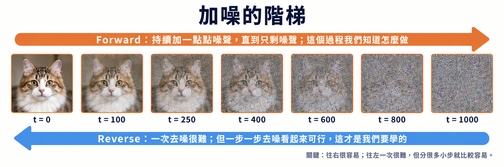

import Objectives from '../../../components/Objectives.astro';
import Prereq from '../../../components/Prereq.astro';
import Ask from '../../../components/Ask.astro';
import Remark from '../../../components/Remark.astro';
import Question from '../../../components/Question.astro';
import Answer from '../../../components/Answer.astro';
import QuizBlock from '../../../components/QuizBlock.astro';
import Option from '../../../components/Option.astro';
import Explanation from '../../../components/Explanation.astro';
import Bridge from '../../../components/Bridge.astro';
import Ref from '../../../components/Ref.astro';

# 指定路徑的方法：Forward Process

<Objectives>
- **DDPM 的 forward process 到底在設計什麼？** 在 DDPM 裡，我們自己選一條逐步加入 Gaussian noise 的路；Markov property 讓每一步只依賴現在，Linear + Gaussian 讓條件分布可以解析計算，而 variance-preserving 與 noise schedule 則決定 signal 如何被 noise 取代。
- **為什麼任意時刻的 $x_t$ 都可以一行抽出來？** Gaussian 的封閉性讓整段遞迴可以收成 $q(x_t\mid x_0)$ 的 closed form；式子裡的 $\epsilon$ 是整段 noise 的合成，不是某一步單獨加入的 noise。這也讓訓練時不必真的走完前面 $t$ 步。
</Objectives>

<Prereq items={frontmatter.prereqs} />

## 有一個方向，我們知道怎麼走

上一篇的結論是：與其直接猜一個生成函數 $G$，不如**先訂好一條路徑**，再沿著這條路徑設計回歸目標，讓模型學會怎麼走。那接下來的問題就是：這條路要怎麼定呢？

直接設計一條「從純噪聲走到一張圖片」的路徑，感覺還是很困難——因為我們根本不知道，一團噪聲（noise）下一步應該變成什麼。

但如果反過來呢？從一張真實圖片出發，每次只加一點點噪聲，這件事我們似乎知道怎麼做：隨機抽一個 Gaussian noise、縮小一點，再加到圖片上。只加一次幾乎看不出差別；再加一點，圖片稍微模糊一些；持續加下去，最後整張圖就會變成幾乎純粹的噪聲。也就是說：**資料 → 噪聲，這條路我們是會做的。**

可以把它想成洗牌。把一副排好的牌每次只稍微洗亂一點，重複很多次之後，牌自然會變得完全隨機——這件事很容易做到。但反過來，要你把一副完全隨機、處於混亂的牌一次排回原本的順序，幾乎無從下手。不過如果問題變成「它剛剛只被弄亂了一點點，我能不能把這一小步修回來？」，事情好像就沒那麼困難了。

Diffusion 的核心想法就是這個：**利用這個我們似乎知道怎麼走的方向，建立一連串很小的破壞步驟，然後去學怎麼把每一小步倒回來。** 原本困難的「從噪聲直接生成圖片」，就被拆成很多步且每一步都比較容易學習的 denoising（去噪）問題。

**圖：加噪的階梯。** 同一張照片一路加噪到純噪聲。**往右每一步都很容易**——抽一個 Gaussian、乘一個小係數、加上去；難的是往左。而我們要學的，就是如何倒回其中的每一步。

有了『一步一步加噪聲這個過程作為我們要走的那條路』這個直覺想法後，接下來就要用數學把這個過程描述清楚。

我們先引入記號來描述這條路上的每一個狀態：$x_0$ 是路的起點，也就是一張從 $p_{\text{data}}$ 抽出來的真實圖片；$x_t$ 是加噪加了 $t$ 步之後的樣子（下標 $t$ 我們也叫它時間）；走完全部 $T$ 步之後的 $x_T$ 就是路的另一端，幾乎是純 noise。所以上一張圖那七格，從左到右就是 $x_0$ 一路走到 $x_T$。

而這條從 $x_0$ 一路加噪到 $x_T$ 的路，就是之後每一篇都會提到的 **forward process**。要記得它是人訂的，不是資料給的——既然是我們自己訂，就有權利挑一條對自己最有利的。

有了記號和名字，我們想先確認三件事情：

<Ask>
這條路的另一端，真的會走到純 noise 嗎？ 
從 $x_0$ 出發，沿著這條路走到時間 $t$ 時，$x_t$ 會變成什麼樣子？ 
如果想要倒著走一步，我們需要知道什麼？又該怎麼做？
</Ask>

前兩個問題這一篇馬上就會回答，而第三個問題中的「需要知道什麼」要等到 <Ref to="dma-denoising-regression"/> 和 <Ref to="dma-tweedie-and-score"/>，而具體該怎麼做則要到 <Ref to="dma-reverse-process"/>。

## 我們希望 forward process 做到的事

前面我們已經有一個粗糙的方向：從真實圖片出發，每次只加一點點 noise，就這樣一路加下去。但「一步一步加噪聲」目前還只是一個模糊的直覺，真正要把它變成一個能用的方法，我們得先問：我們希望 forward process 做到什麼？

第一件事，是這條路的另一端得停在一個我們很會抽樣的分布上（這裡我們會暫時先用 $\mathcal N(0,I)$）。生成的時候我們是倒著走的，總得先有一個起點；如果走完 $T$ 步之後的 $x_T$ 落在一個我們根本不知道怎麼抽的分布上，那想要學「從 noise 倒回圖片」，連起點就不對了。所以「真的會走到純 noise 嗎」不是好奇而已，而是這個方法能不能成立的前提。

第二件事，是我們得算得出走到任意時間 $t$ 時 $x_t$ 會落在哪裡，而且最好不用真的從 $x_0$ 一步一步走過去，如果知道 $q(x_t\mid x_0)$，而且它是某種 Gaussian 分布，那就會很好算。

這裡的 $q(x_t\mid x_0)$ 是一個**條件機率**：$q$ 指的是 forward process 這套加噪程序帶出來的機率，豎線右邊則是「已經給定的條件」。所以整串要讀成「已經知道起點是 $x_0$ 這張真實圖片的情況下，走了 $t$ 步後會落在大概 $x_t$ 的機率」。

而這兩件事其實在問同一個東西：走到底就是走到 $t=T$，所以只要 $q(x_t\mid x_0)$ 寫得出來，另一端長什麼樣子也就跟著知道了。

打個比方。你人在台大，要一路走到屏東——可以走西部：台中 → 台南 → 高雄 → 屏東；也可以繞東部：宜蘭 → 花蓮 → 台東 → 屏東。台大就是起點 $x_0$，每一站就是一個 $x_t$。$q(x_1\mid x_0)$ 說的是「第一步走到台中的可能性有多大、走到宜蘭的可能性又有多大」；而 $q(x_t\mid x_0)$ 說的是「走了 $t$ 段之後，人剛好在某座城市的可能性有多大」——**不管**中間到底走過哪一條路。

問題就在這個「不管中間怎麼走」。一般來說，如果只想知道最後的 $x_t$，就得把所有可能的中間路線全部加總起來：

$$
q(x_t\mid x_0)=\int q(x_1,\dots,x_t\mid x_0)\;\mathrm dx_1\cdots\mathrm dx_{t-1}.
$$

被積的那一項 $q(x_1,\dots,x_t\mid x_0)$ 可以理解成：給定起點是 $x_0$，我們這套加噪程序剛好走出**差不多** $x_1,x_2,\dots,x_t$ 這一條**指定路線**的可能性有多大；而積分就是把中間的 $x_1,\dots,x_{t-1}$ 所有可能都考慮進去、全部累積起來。

看起來很麻煩。所以我們可以反過來問：**能不能故意把這條加噪路徑設計成一條很好算的路？**

## 第一個設計：下一步只看現在

最先可以做的，是讓每一步只依賴上一步，不需要回頭看更早的狀態：

$$
q(x_t\mid x_{t-1},x_{t-2},\dots,x_0)=q(x_t\mid x_{t-1}).
$$

這就讓整個 forward process 成為一條 **Markov chain**。而且這不是我們從資料裡「發現」的性質，是刻意設計出來的：$x_t$ 只從上一個狀態 $x_{t-1}$ 出發，再加入一個新抽的、與過去獨立的 $\epsilon_t$。

<Remark label="補充" summary="Markov chain：過去已成定局，未來只看現在">
一條隨機過程

$$
x_0\rightarrow x_1\rightarrow x_2\rightarrow\cdots\rightarrow x_T
$$

是一條 **Markov chain**，意思是：要預測下一步，只要知道**現在在哪裡**，不需要追問它的過去。一旦知道 $x_{t-1}$，就足以預測 $x_t$；更早的 $x_{t-2},\dots,x_0$ 就算給了，也不會再提供額外的資訊。

這有點像大學的**考試分發**：能不能錄取，看的是你手上那張成績單上的分數；你高中三年是一路穩定、還是最後半年才衝上來，分發的規則完全不看。

不過「跟過去無關」這句話要小心讀：**不是過去不重要，而是過去該留下的東西都已經濃縮在現在這個狀態裡了**，規則只需要讀它。forward process 也是同一件事——$x_{t-1}$ 身上已經帶著前面每一步加進去的 noise，所以再多看 $x_{t-2}$ 也問不出新東西。

寫成數學就是

$$
q(x_t\mid x_{t-1},x_{t-2},\dots,x_0)=q(x_t\mid x_{t-1}).
$$

更詳細的 Markov chain 介紹——定義、transition matrix 與長期行為——可以參考 <Ref to="math-markov-chain"/>。
</Remark>

Markov property 帶來的好處是，一整條指定路線的機率可以拆成很多小段：

$$
q(x_1,\dots,x_t\mid x_0)=\prod_{s=1}^{t}q(x_s\mid x_{s-1}).
$$

回到剛剛的旅程：**一整條路線的可能性，等於把每一段的可能性乘起來。** 先看台大 → 台中的機率，再看「已經到了台中」之後 → 會去台南的機率，依此類推——每一段 $q(x_s\mid x_{s-1})$ 只需要知道上一站。

但這還只解決了一半。

> **路拆得開，不代表我們就會積分，積分結果就會好看。**

我們還需要讓每一小步的形式足夠簡單，使得把中間的狀態消掉之後，$q(x_t\mid x_0)$ 仍然能寫成漂亮的 closed form。

## 第二個設計：Linear + Gaussian

Gaussian 有一個非常方便的性質：**經過線性變換、再加上一個 Gaussian noise，結果仍然是 Gaussian。** 所以如果固定總步數 $T$、選一組很小的 $\beta_1,\dots,\beta_T\in(0,1)$，把每一步都設計成

$$
q(x_t\mid x_{t-1})=\mathcal N\!\big(\sqrt{1-\beta_t}\,x_{t-1},\ \beta_t I\big),
$$

$\mathcal N(\cdot,\cdot)$ 括號裡的兩個位置分別是**平均**和**變異數**，所以這一行是說：$x_t$ 服從一個 Gaussian，中心在「把 $x_{t-1}$ 縮小 $\sqrt{1-\beta_t}$ 倍」的位置，散布的大小是 $\beta_t$。寫成取樣的樣子更好懂，它等價於

$$
x_t=\sqrt{1-\beta_t}\,x_{t-1}+\sqrt{\beta_t}\,\epsilon_t,\qquad \epsilon_t\sim\mathcal N(0,I).
$$

也就是：**把上一個狀態稍微縮小一點，再補上一點新的 Gaussian noise。** 其中 $\beta_t$ 控制第 $t$ 步要加多少 noise。

這一組選擇——Gaussian、線性縮放、係數挑成 $\sqrt{1-\beta_t}$——就是 **DDPM**（denoising diffusion probabilistic models，Ho et al. [2]）的 forward process，也是這門課接下來預設的那一條路。

這條式子中有兩個我們特別設計的地方。

**為什麼要乘 $\sqrt{1-\beta_t}$？** 如果只加噪聲、不縮小，變異數會一路累積到超大然後爆掉——也真的有人這樣設計，叫 **variance-exploding（VE）**（[Song et al., 2021](https://arxiv.org/abs/2011.13456)；<Ref week="dma-week-consistency"/> 就會用到它）。但如果我們考慮用 $\sqrt{1-\beta_t}$ 來縮放，這時候如果假設 $\operatorname{Var}(x_{t-1})=I$，那麼

$$
\operatorname{Var}(x_t)=(1-\beta_t)\,I+\beta_t I=I .
$$

信號縮小多少，噪聲就補上多少，變異數總量剛好不變——因此這種 forward process 叫 **variance-preserving（VP）**。它帶來兩個實際好處：$x_T$ 比較容易落在 $\mathcal N(0,I)$ 附近（我們會抽的那個分布），而且網路的輸入尺度在每個 $t$ 都差不多，不會有的時候很大、有的時候很小。

**為什麼 $\beta_t$ 要小？** 因為每一步的變化小，反向那一步才容易學。這就是「切碎」真正的意思：我們不是要讓模型少做事，而是要讓它每一次只做一件簡單的事。

<Remark label="符號" summary="$\alpha_t$、$\bar\alpha_t$、$\sigma_t$ 與 SNR：四個之後一直會用的量">
往下推導之前，先把記號一次講完：

- $\alpha_t=1-\beta_t$：這一步**留下**多少信號。
- $\bar\alpha_t=\prod_{s=1}^{t}\alpha_s$：從頭到現在**累積留下**多少信號，會從 1 一路遞減到接近 0。
- $\sigma_t^2=1-\bar\alpha_t$：對應累積起來的噪聲強度，兩者永遠滿足 $\bar\alpha_t+\sigma_t^2=1$。
- $\mathrm{SNR}(t)=\bar\alpha_t/(1-\bar\alpha_t)$：signal-to-noise ratio，「還剩多少信號比得上噪聲」。$t$ 越大，SNR 越小。

$\beta_t$ 隨 $t$ 怎麼變，稱為 **schedule**（linear、cosine…）。schedule 一旦定了，$\bar\alpha_t$ 就定了，這條路的「速度」也就定了。
</Remark>

記號齊了，就可以看整條路是怎麼一步一步加出來的——其實就是把上面那一行一直套下去：

$$
\begin{aligned}
x_1&=\sqrt{\alpha_1}\,x_0+\sqrt{1-\alpha_1}\,\epsilon_1,\\
x_2&=\sqrt{\alpha_2}\,x_1+\sqrt{1-\alpha_2}\,\epsilon_2,\\
&\ \ \vdots\\
x_t&=\sqrt{\alpha_t}\,x_{t-1}+\sqrt{1-\alpha_t}\,\epsilon_t .
\end{aligned}
$$

每一行都要等上一行算完才能算，而且每一行都**新抽一個** $\epsilon$。所以照定義，想拿到 $x_t$，就得從 $x_0$ 把這個遞迴老老實實跑 $t$ 次。

## 真的要跑 $t$ 次嗎？

<Question id="Q1">
訓練的時候我們需要很多組 $(x_0,x_t)$ 的配對，而 $t$ 可能是 800。每抽一個訓練樣本都要把上面那個遞迴跑 800 次，這樣訓練根本跑不動。

**有沒有辦法一步就跳到 $x_t$？**

<Answer>
可以，而且關鍵只有一句話：**兩個獨立的 Gaussian 加起來還是 Gaussian，而且變異數相加**（<Ref to="math-gaussian"/>）。

先展開兩步看看。把 $x_{t-1}=\sqrt{\alpha_{t-1}}\,x_{t-2}+\sqrt{1-\alpha_{t-1}}\,\epsilon_{t-1}$ 代進去：

$$
x_t=\sqrt{\alpha_t\alpha_{t-1}}\,x_{t-2}
+\underbrace{\sqrt{\alpha_t(1-\alpha_{t-1})}\,\epsilon_{t-1}+\sqrt{1-\alpha_t}\,\epsilon_t}_{\text{兩個獨立 Gaussian}} .
$$

後面那兩項合起來仍然是一個 Gaussian，變異數是

$$
\alpha_t(1-\alpha_{t-1})+(1-\alpha_t)=1-\alpha_t\alpha_{t-1},
$$

剛好又補成兩個係數平方和等於 1。一路歸納下去就得到我們實作上最常用的那一行：

$$
\boxed{\;q(x_t\mid x_0)=\mathcal N\!\big(\sqrt{\bar\alpha_t}\,x_0,\ (1-\bar\alpha_t)I\big),
\qquad x_t=\sqrt{\bar\alpha_t}\,x_0+\sigma_t\,\epsilon,\quad \sigma_t^2=1-\bar\alpha_t .\;}
$$

於是取一個訓練樣本只要做三件事：**抽一個 $t$、抽一個 $\epsilon\sim\mathcal N(0,I)$、算一次乘法與加法。** 完全不需要跑那 800 步的遞迴。

這一行在說的事情其實很單純：任意時刻的 $x_t$ 就是「**縮小的資料 + 一個 Gaussian noise**」，而且兩個係數的平方和恆為 1。

換個角度看，這一行其實是把資料和一個 noise 用 $(\sqrt{\bar\alpha_t},\ \sqrt{1-\bar\alpha_t})$ 這組係數來做**插值**（interpolation）。而「係數平方和恆為 1」是 VP 這個選擇帶來的限制，不是插值本身要求的——<Ref to="dma-fm-vs-diffusion"/> 會把這組係數換成 $(t,\,1-t)$ 的直線插值（linear interpolation），<Ref to="dma-unified-equation"/> 則考慮最一般的情況，寫成一個把 diffusion、flow matching 都涵蓋進去的通式（general form）。

唯一要特別小心的事：這裡的 $\epsilon$ **不是**任何一步加進去的 $\epsilon_t$，而是把 $t$ 個小小的噪聲合併之後、重新命名的單一 Gaussian 變數；它與 $x_0$ 獨立。下一篇的訓練目標會直接針對它，所以這個區別要記起來。
</Answer>
</Question>

讓這一行成立的正是前面那兩個設計：Markov property 讓整條路能拆成很多簡單的小步驟；Linear + Gaussian 讓這些小步算得出來，且接起來之後仍然是 Gaussian，這使得那個積分有 closed form——於是不必真的去算它或是走 $t$ 次，直接用 $x_t=\sqrt{\bar\alpha_t}\,x_0+\sigma_t\,\epsilon$ 就能算出 $x_t$。少了任何一個部分都不一定能這樣算出來，特別是少了第二個設計，$x_t$ 就不一定會有這樣漂亮的形式。

這一行也回答了第一個問題。把 $t$ 換成 $T$：$q(x_T\mid x_0)=\mathcal N(\sqrt{\bar\alpha_T}\,x_0,(1-\bar\alpha_T)I)$，只要 schedule 讓 $\bar\alpha_T$ 小到幾乎是 0——$x_0$ 的痕跡就被壓到幾乎看不見，而 $1-\bar\alpha_T$ 會趨近於 1，確保 $x_T$ 確實走到了純 noise，因此反過來走真的是從 $\mathcal N(0,I)$ 出發。

<Remark label="補充" summary="$x_T$ 真的等於 $\mathcal N(0,I)$ 嗎？">
嚴格說不等於，只是很接近。$\bar\alpha_T$ 很小但不是 0，所以 $x_T=\sqrt{\bar\alpha_T}\,x_0+\sigma_T\epsilon$ 裡還殘留著一點點資料的痕跡。

而取樣的時候，我們是直接從 $\mathcal N(0,I)$ 出發的——等於把這一點差距當成誤差吃下來，這件事叫 **prior mismatch**。它通常很小（DDPM 的 $\bar\alpha_T\approx 4\times10^{-5}$），但它是真的存在，也是為什麼 schedule 不能設得太「慢」。
</Remark>

## 這條路長什麼樣子

<iframe loading="lazy" src="/personal_website/notes/research_areas/diffusion-models-applications/w3-1-forward.html" class="demo-frame" title="Forward process 加噪滑桿：互動 demo" style="height: 1060px; width: 100%; border: none;"></iframe>

**互動 demo：加噪滑桿。** 拖 $t$ 看 $x_t=\sqrt{\bar\alpha_t}\,x_0+\sigma_t\epsilon$ 怎麼一路變化，右邊同步顯示 $\bar\alpha_t$、$1-\bar\alpha_t$ 與 SNR：資料的形狀先變模糊、再漸漸變成純噪聲（也就是 $\mathcal N(0,I)$）。切換 schedule 會發現兩端完全一樣，只有中間移動的速度不同——你可能會發現 linear 很早就把結構洗掉了，cosine 則把中間段留得久一點，在實務上各有好處。

## 消化一下

<QuizBlock id="w3-1-a">
若 $\operatorname{Var}(x_0)=I$，用 VP forward process 時 $\operatorname{Var}(x_t)$ 是多少？
<Option>$\bar\alpha_t I$</Option>
<Option correct>$I$</Option>
<Option>$(1-\bar\alpha_t)I$</Option>
<Option>$tI$</Option>
<Explanation>
$\operatorname{Var}(x_t)=\bar\alpha_t\operatorname{Var}(x_0)+(1-\bar\alpha_t)I=I$：信號縮小多少、噪聲就補上多少，總量不變。這就是 variance-preserving 這個名字的來源。
</Explanation>
</QuizBlock>

<QuizBlock id="w3-1-b">
關於 $x_t=\sqrt{\bar\alpha_t}\,x_0+\sigma_t\epsilon$ 裡的 $\epsilon$，哪個說法正確？
<Option>它就是第 $t$ 步加進去的那個 $\epsilon_t$。</Option>
<Option>它的變異數是 $\sigma_t^2$。</Option>
<Option correct>它是前 $t$ 步所有小噪聲合併後的單一標準 Gaussian，與 $x_0$ 獨立。</Option>
<Explanation>
$\epsilon\sim\mathcal N(0,I)$，變異數是 $I$；$\sigma_t$ 是乘在外面的係數。它由 $\epsilon_1,\dots,\epsilon_t$ 加權合併而來，不等於任何單獨一步的噪聲。
</Explanation>
</QuizBlock>

<QuizBlock id="w3-1-c">
把所有 $\beta_t$ 都調大十倍（仍落在 $(0,1)$ 內）、$T$ 不變，會發生什麼？
<Option correct>$x_T$ 更接近 $\mathcal N(0,I)$，但每一步的變化更大、反向每一步更難學。</Option>
<Option>$x_T$ 離 $\mathcal N(0,I)$ 更遠。</Option>
<Option>$q(x_t\mid x_0)$ 不再是 Gaussian。</Option>
<Explanation>
$\bar\alpha_T$ 更快趨近 0，終點更乾淨（prior mismatch 更小），但「切碎」的好處被犧牲掉了。schedule 設計就是在這兩件事之間取捨。
</Explanation>
</QuizBlock>

<Bridge to="dma-denoising-regression">
DDPM 的 forward process 已經定下來了。Markov property 與 Linear + Gaussian 不只讓任意 $x_t$ 都能一行抽出來，也讓 training 時可以輕易製造 $(x_0,x_t,\epsilon,t)$ 的配對。

但生成需要的是反方向：看到 $x_t$ 之後，下一步應該從哪個 $x_{t-1}$ 抽樣？真正的 $q(x_{t-1}\mid x_t)$ 牽涉到未知的 data distribution，不能直接計算。

下一篇會利用 training 時多知道的 $x_0$，先處理可以解析計算的 $q(x_{t-1}\mid x_t,x_0)$，再把它變成一個 regression objective，學出 $p_\theta(x_{t-1}\mid x_t)$ 來近似真正的 reverse step。
</Bridge>

## 參考文獻

1. Sohl-Dickstein, J., Weiss, E. A., Maheswaranathan, N., Ganguli, S. [*Deep Unsupervised Learning using Nonequilibrium Thermodynamics.*](https://arxiv.org/abs/1503.03585) ICML 2015. （「加噪再倒回來」這個想法的出處。）
2. Ho, J., Jain, A., Abbeel, P. [*Denoising Diffusion Probabilistic Models.*](https://arxiv.org/abs/2006.11239) NeurIPS 2020. （本篇的 VP forward process 與 linear schedule。）
3. Nichol, A., Dhariwal, P. [*Improved Denoising Diffusion Probabilistic Models.*](https://arxiv.org/abs/2102.09672) ICML 2021. （cosine schedule。）
4. Song, Y., Sohl-Dickstein, J., Kingma, D. P., Kumar, A., Ermon, S., Poole, B. [*Score-Based Generative Modeling through Stochastic Differential Equations.*](https://arxiv.org/abs/2011.13456) ICLR 2021. （VP 與 VE 這兩個名字的出處。）
