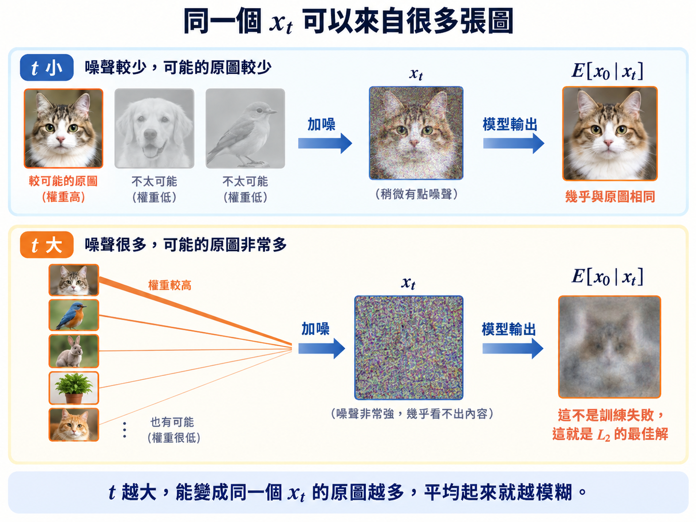

import Objectives from '../../../components/Objectives.astro';
import Prereq from '../../../components/Prereq.astro';
import Ask from '../../../components/Ask.astro';
import Remark from '../../../components/Remark.astro';
import Try from '../../../components/Try.astro';
import Question from '../../../components/Question.astro';
import Answer from '../../../components/Answer.astro';
import QuizBlock from '../../../components/QuizBlock.astro';
import Option from '../../../components/Option.astro';
import Explanation from '../../../components/Explanation.astro';
import Bridge from '../../../components/Bridge.astro';
import Ref from '../../../components/Ref.astro';

# Denoising：倒著走一步，要怎麼學？

<Objectives>
- **把「想從 $q(x_{t-1}\mid x_t)$ 抽樣」改寫成一個可以最小化的目標，並說出為什麼可以把 $x_0$ 放進條件裡。** 寫出那條等價：條件化之後的目標與原來的目標只差一個與參數無關的常數，而且最佳解仍然是原來那個邊際。
- **說出 DDPM 的訓練本質：挑一個固定變異數的 Gaussian 模型族。** 挑完之後 KL 就塌成一個加權的平方誤差，而這個回歸的最佳解是 $\mathbb E[x_0\mid x_t]$。
- **說出不同 prediction parametrization 其實只是在改變學習問題的 weighting。** 寫出 $x_0$-、$\epsilon$-、$v$-prediction 這幾個不同學習物件之間的等價轉換，並解釋它們雖然表達相同資訊，卻會因為不同的 timestep／SNR weighting 得到不同的結果。
</Objectives>

<Prereq items={frontmatter.prereqs} />

## 倒著走一步，如何從 $q(x_{t-1}\mid x_t)$ 抽樣？

上一篇我們已經把前進的路 forward process 給設計好了：知道怎麼從 $x_{t-1}$ 到 $x_t$，而且任意時刻的 $x_t$ 都能用一行公式從 $x_0$ 獲得。現在我們想做的是反過來——手上已有一個 $x_t$，要怎麼退到 $x_{t-1}$，也就是說，要怎麼從 $q(x_{t-1}\mid x_t)$ 抽樣。

<Remark label="複習" summary="為什麼是「從 $q(x_{t-1}\mid x_t)$ 抽樣」，而不是算出一個答案？">
先複習 $q(x_{t-1}\mid x_t)$ 在描述什麼：**給定現在的 $x_t$，退到前一步、落在差不多 $x_{t-1}$ 這個位置的機率密度。**

用上一篇那條從台大到屏東的路線來說：給定現在人在**屏東**，前一站是**高雄**（走西部）還是**台東**（繞東部）？機率會告訴我們每一種可能性有多大，我們就照著它抽一個——抽到高雄或台東都是合理的答案。

為什麼要寫成「分布」而不是「一個答案」？因為加噪那一步真的把資訊丟掉了：很多不同的 $x_{t-1}$ 都可能變成手上這個 $x_t$，而只有分布記得住是哪些、各自多可能。至於拿到這個分布之後**要怎麼用**——每一步真的抽一個，還是每一步都走一個確定的方向——那是另一個問題，<Ref to="dma-reverse-process"/> 會看到兩種做法都成立。
</Remark>

首先我們知道，$x_t$ 是由 $x_{t-1}$ 加了一撮隨機的 Gaussian noise 得到的。所以 $x_t$ 一旦固定，往回看 $x_{t-1}$，會因為那撮 noise 的隨機性而有**一整個範圍的可能**。我們要的就是那個範圍上的機率密度。

<Question id="Q1">
最直覺的想法是把加噪那一步直接反解。既然

$$
x_t=\sqrt{\alpha_t}\,x_{t-1}+\sqrt{\beta_t}\,\epsilon_t ,
$$

那我就抽一個 $\epsilon_t\sim\mathcal N(0,I)$，代進去解出

$$
x_{t-1}=\big(x_t-\sqrt{\beta_t}\,\epsilon_t\big)\big/\sqrt{\alpha_t}
$$

不就好了嗎？反正 noise 本來就是隨機抽的。

**這樣為什麼不行？**

<Answer>
問題出在「$\epsilon_t$ 本來就是隨機抽的」這句話——它在**加噪的時候**成立，在**取樣的時候**不成立。

加噪時，我們先有 $x_{t-1}$，再抽一個「與它無關」的 $\epsilon_t$——這兩個變數確實互相獨立。但在 reverse process 要做 denoise 時，我們手上先有 $x_t$，想要利用 $\epsilon_t$ 決定 $x_{t-1}$；而 $x_t$ 是用當初那個特定的 $\epsilon_t$ 算出來的（現在看不到），因此 $\epsilon_t$ 和 $x_t$ **不是獨立的**：看到 $x_t$，等於看到「它因為 $\epsilon_t$ 而落在哪裡」——這件事本身就帶著關於 $\epsilon_t$ 的資訊。

我們可以透過計算兩者之間的**共變數**（covariance）來證明不獨立這件事。因為 $\epsilon_t$ 與 $x_{t-1}$ 是獨立的，

$$
\operatorname{Cov}(\epsilon_t,\,x_t)
=\operatorname{Cov}\big(\epsilon_t,\ \sqrt{\alpha_t}\,x_{t-1}+\sqrt{\beta_t}\,\epsilon_t\big)
=\sqrt{\beta_t}\,I\;\ne\;0 .
$$

covariance 不是零，就代表有相關；有相關，就不能另外抽一個與 $x_t$ 獨立的 noise 去替代 $\epsilon_t$。

那「不獨立」到底改變了什麼？$\epsilon_t$ 的 **marginal distribution** 仍然是 $\mathcal N(0,I)$，但給定 $x_t$ 之後，$\epsilon_t$ 的分布就變了。所以從 $\mathcal N(0,I)$ 抽一個與 $x_t$ 獨立的 $\epsilon_t$ 代進去，就變成錯的。

回到上一篇的洗牌。你把一副排好的牌洗了一次，然後只看到洗完的樣子——沒看到洗之前。洗牌當然是隨機的，但**你看到的那個結果，本身就透露了那一次是怎麼洗的**：如果洗完之後有幾張還連在一起，那一次顯然沒把那一段拆開。

所以你不能說「反正洗牌是隨機的」，就自己隨便洗一次、再宣稱這樣就把它倒回去了——那樣只會回到一個錯的順序。$\epsilon_t$ 就是那一次洗牌：一旦看到 $x_t$，它就不再是一個可以隨便重抽的東西。

</Answer>
</Question>

所以反解這條路是行不通的。那如果我們老老實實去算 $q(x_{t-1}\mid x_t)$ 呢？

因為我們是知道 $q(x_t\mid x_{t-1})$ 的，這時候就會想要用 Bayes 定理來算 $q(x_{t-1}\mid x_t)$（<Ref to="math-bayes-posterior"/>）：

$$
q(x_{t-1}\mid x_t)=\frac{q(x_t\mid x_{t-1})\,q(x_{t-1})}{q(x_t)} .
$$

分子的 $q(x_t\mid x_{t-1})$ 我們確實會算——那是上一篇自己設計的那一步（<Ref to="dma-forward-process"/>）。但右邊還有 $q(x_{t-1})$ 和 $q(x_t)$：它們是**資料經過加噪之後的 marginal distribution**，也就是「所有真實圖片加噪 $t$ 步之後，長成 $x_t$ 的可能性有多大」。要知道它，就得把每一張真實圖片的貢獻都加總起來——也就是得先知道整個 $p_{\text{data}}$（但很明顯我們不知道）。這種「式子寫得出來、但實際上算不出來」的東西，以下都叫 **不可算（intractable）**。

## 如果算不出來，那可不可以用「學」的？那要怎麼學？

我們先換一個角度想。其實我們本來就沒有打算把所有東西都直接算出來——如果每一個 quantity 都可以直接算，那我們根本就不需要 learning。

所以現在既然真正的 $q(x_{t-1}\mid x_t)$ 不好算，我們可不可以乾脆**學一個東西來逼近它**？例如，用一個 neural network 來參數化一個 conditional distribution $p_\theta(x_{t-1}\mid x_t)$，接下來的目標就很自然了：**想辦法調整 $\theta$，讓 $p_\theta(x_{t-1}\mid x_t)$ 盡可能接近真正的 $q(x_{t-1}\mid x_t)$。**

如果這件事做得到，那我們是不是就不需要真的把 $q(x_{t-1}\mid x_t)$ 算出來了？

問題就從：

> **「這個 distribution 要怎麼算？」**

變成：

> **「我要怎麼設計一個 learning problem，讓 neural network 把它學出來？」**

那就來設計這個 learning problem。第一件事是把「接近」說清楚——也就是寫下一個 loss function。兩個分布之間最常用的那個 loss function 是 **Kullback–Leibler divergence**（<Ref to="math-kl"/>），以下都簡稱 **KL**；而 $x_t$ 本身也是隨機的，所以要對所有可能的 $x_t$ 取平均：

$$
\mathcal J(\theta)=\mathbb E_{q(x_t)}\Big[D_{\mathrm{KL}}\big(q(x_{t-1}\mid x_t)\,\big\|\,p_\theta(x_{t-1}\mid x_t)\big)\Big].
$$

這一行就是最直覺、我們真正想要最小化的東西。好消息是 learning objective 有了，壞消息是裡面那個 $q(x_{t-1}\mid x_t)$ 還是不可算，所以這個 loss 我們似乎還是算不出來，也不知道怎麼求 gradient。

<Question id="Q2">
我們常常在想一個方法的時候、遇到問題就會忘記靜下心來看看我們有什麼？能做什麼？這時不如回頭看一下我們一開始到底有什麼資訊是可以用的——**forward process 給了我們什麼？**

我們在 forward process 建立的是一筆要拿來訓練的資料，我們做的是：抽一張資料集裡的真實圖片 $x_0$、抽一個時間 $t$、抽一個 $\epsilon$，然後一行算出 $x_t$。所以我們其實不是只有 $x_t$，還有創造它的 $(x_0,\epsilon,t)$。

**那這其中有誰可以幫助我們算出 $q(x_{t-1}\mid x_t)$？或是可以有一樣效果的 loss function 呢？**

<Answer>
$x_0$。

寫 $q(x_{t-1}\mid x_t)$ 的時候，我們假裝手上只有 $x_t$，但我們其實還知道它是來自哪一張圖 $x_0$。而那正是卡住的原因：$q(x_{t-1})$ 和 $q(x_t)$ 之所以難算，就是因為它們把**所有可能的 $x_0$ 都考慮進去了**。

既然算不動的原因是「要考慮所有的 $x_0$」，那就先別考慮全部：**把 $x_0$ 也放進條件裡**看看。
</Answer>
</Question>

## 訓練的時候，我們其實多知道一件事

先不要急著看公式。想一下 $x_t$ 是哪裡來的。

訓練的時候，我們先從 dataset 拿一張真正的資料 $x_0$，再自己一步一步加 noise 產生 $x_t$。所以每一個訓練時看到的 $x_t$，我們都知道它原本是哪一張 $x_0$ 變出來的。這件事在我們真的要生成新資料的時候沒有——那時候只有當下的 $x_t$；但在 training 的時候，$x_0$ 一直都藏在我們手上。

那問題來了：如果 $q(x_{t-1}\mid x_t)$ 不可算，多告訴我們原本的 $x_0$，事情會不會變簡單？也就是不要先問

$$
q(x_{t-1}\mid x_t),\qquad\text{而是問}\qquad q(x_{t-1}\mid x_t,x_0).
$$

答案是：會，而且它可以直接算出來。那我們可不可以拿這個「算得出來的東西」來教模型？於是把 training objective 改寫成

$$
\widetilde{\mathcal J}(\theta)=\mathbb E_{p_{\text{data}}(x_0)}\ \mathbb E_{q(x_t\mid x_0)}
\Big[D_{\mathrm{KL}}\big(q(x_{t-1}\mid x_t,x_0)\,\big\|\,p_\theta(x_{t-1}\mid x_t)\big)\Big].
$$

這裡有一個看起來很奇怪的地方：左邊那個拿來當 target 的 $q(x_{t-1}\mid x_t,x_0)$ **看得到 $x_0$**，但右邊我們真正要學的 $p_\theta(x_{t-1}\mid x_t)$ **看不到**。

為什麼？因為 generation 的時候我們根本沒有 $x_0$，模型最後一定只能靠 $x_t$ 往回走。所以 training 時我們可以用 $x_0$ 造一個「比較容易算的 target」，但模型最後仍然只能看到 $x_t$。

這看起來有點像作弊，甚至更嚴重：兩邊條件的東西根本不一樣。我們真的還是在學原本那個 $q(x_{t-1}\mid x_t)$ 嗎？

**是。而且這裡不是 approximation。**

在看證明之前，先想一下為什麼它會成立。固定一個 $x_t$，在整個訓練過程中，它有可能會被**很多張不同的 $x_0$** 給造出來。而每一筆訓練資料都拿出一個不一樣的 $x_0$ 要模型去對齊，但模型只看得到 $x_t$，分不出手上這一筆是哪一張 $x_0$ 來的，所以它只能給一個答案去應付全部——**就是把所有 $x_0$ 各自給出的那個分布，按它們出現的「頻率」平均起來**，而那個平均就會是 $q(x_{t-1}\mid x_t)$。

也就是這個意思：

$$
\mathbb E_{p(x_0\mid x_t)}\big[q(x_{t-1}\mid x_t,x_0)\big]=q(x_{t-1}\mid x_t).
$$

所以兩個 objective 分別是：直接對齊那個算不出來的 $q(x_{t-1}\mid x_t)$，和透過對齊一堆算得出來的 $q(x_{t-1}\mid x_t,x_0)$、再讓模型自己去取平均 $\mathbb E_{p(x_0\mid x_t)}[\,\cdot\,]$，也是去對齊 $q(x_{t-1}\mid x_t)$。

這裡用的雖然是 KL，但和 L2 那種把差距平方起來的距離有類似的性質；以 L2 舉一個 toy example，寫 $\bar a=\frac{a_1+a_2+a_3}{3}$，minimizing $\frac13\big[(x-a_1)^2+(x-a_2)^2+(x-a_3)^2\big]$ 和 minimizing $(x-\bar a)^2$ 會得到一樣的最佳解 $x$，因為兩者之差是一個常數——配方出來就看得到：

$$
\frac13\big[(x-a_1)^2+(x-a_2)^2+(x-a_3)^2\big]
=(x-\bar a)^2
+\underbrace{\frac{(a_1-\bar a)^2+(a_2-\bar a)^2+(a_3-\bar a)^2}{3}}_{\text{不含 }x} .
$$

根據這樣的性質，我們預測會有：

$$
\widetilde{\mathcal J}(\theta)=\mathcal J(\theta)+C
\quad\Longrightarrow\quad
\arg\min_\theta\ \widetilde{\mathcal J}(\theta)=\arg\min_\theta\ \mathcal J(\theta),
$$

其中 $C$ 完全不依賴 $\theta$；而最佳的那個 $p_\theta$——寫成 $p^\star(x_{t-1}\mid x_t)$——正是上面那個平均 $\mathbb E_{p(x_0\mid x_t)}\big[q(x_{t-1}\mid x_t,x_0)\big]$，也就是 $q(x_{t-1}\mid x_t)$。

所以我們只是把一個算不出來的 learning objective，換成一個算得出來、但最佳解完全相同的 objective。模型從來沒有直接拿那個算不出來的 $q(x_{t-1}\mid x_t)$ 作為目標，卻可以透過很多個「知道 $x_0$ 的 training examples」把它學起來。

<Try summary="自己實際推一次：為什麼 $\widetilde{\mathcal J}(\theta)=\mathcal J(\theta)+C$ 是對的？">
我們想證明的是：雖然 training 時改用 $q(x_{t-1}\mid x_t,x_0)$ 當 target，但最後學到的東西，和原本拿 $q(x_{t-1}\mid x_t)$ 當 target 是一樣的。

先固定一個 $x_t$，看這個 KL：

$$
D_{\mathrm{KL}}\big(q(x_{t-1}\mid x_t,x_0)\,\big\|\,p_\theta(x_{t-1}\mid x_t)\big).
$$

把 KL 的定義展開：

$$
\begin{aligned}
&D_{\mathrm{KL}}\big(q(x_{t-1}\mid x_t,x_0)\,\big\|\,p_\theta(x_{t-1}\mid x_t)\big)\\[4pt]
&=\int q(x_{t-1}\mid x_t,x_0)\log q(x_{t-1}\mid x_t,x_0)\,\mathrm dx_{t-1}\\[2pt]
&\quad-\int q(x_{t-1}\mid x_t,x_0)\log p_\theta(x_{t-1}\mid x_t)\,\mathrm dx_{t-1}.
\end{aligned}
$$

先看第一項：

$$
\int q(x_{t-1}\mid x_t,x_0)\log q(x_{t-1}\mid x_t,x_0)\,\mathrm dx_{t-1}.
$$

這裡完全沒有 $\theta$。所以不管之後再對 $x_0$、$x_t$ 取多少次期望，對我們「調整 $\theta$」這件事來說，它都只是一個常數。

因此真正會影響 learning 的，是第二項：

$$
-\int q(x_{t-1}\mid x_t,x_0)\log p_\theta(x_{t-1}\mid x_t)\,\mathrm dx_{t-1}.
$$

現在對「有可能造出這個 $x_t$」的 $x_0$ 取平均：

$$
-\,\mathbb E_{p(x_0\mid x_t)}\Big[\int q(x_{t-1}\mid x_t,x_0)\log p_\theta(x_{t-1}\mid x_t)\,\mathrm dx_{t-1}\Big].
$$

注意 $\log p_\theta(x_{t-1}\mid x_t)$ 只看 $x_t$ 和 $x_{t-1}$，不依賴 $x_0$。所以我們可以先把所有可能的 $x_0$ 平均掉：

$$
-\int\Big[\int q(x_{t-1}\mid x_t,x_0)\,p(x_0\mid x_t)\,\mathrm dx_0\Big]\log p_\theta(x_{t-1}\mid x_t)\,\mathrm dx_{t-1}.
$$

那中括號裡是什麼？

$$
\int q(x_{t-1}\mid x_t,x_0)\,p(x_0\mid x_t)\,\mathrm dx_0 .
$$

它的意思就是：已知現在的 $x_t$，把所有可能的原圖 $x_0$ 都按照 $p(x_0\mid x_t)$ 的機率加權平均。根據 marginalization，這正好就是

$$
q(x_{t-1}\mid x_t).
$$

因此第二項變成

$$
-\int q(x_{t-1}\mid x_t)\log p_\theta(x_{t-1}\mid x_t)\,\mathrm dx_{t-1},
$$

也就是 $q(x_{t-1}\mid x_t)$ 和 $p_\theta$ 的 cross entropy。

而原本的 $D_{\mathrm{KL}}\big(q(x_{t-1}\mid x_t)\,\big\|\,p_\theta(x_{t-1}\mid x_t)\big)$ 展開之後，也只有這個 cross entropy 和 $\theta$ 有關；剩下那個 $q(x_{t-1}\mid x_t)$ 的 entropy 一樣不含 $\theta$。

因此兩個 objective 最後只差一個與 $\theta$ 無關的常數，也就有完全相同的最佳解：

$$
\widetilde{\mathcal J}(\theta)=\mathcal J(\theta)+C
\quad\Longrightarrow\quad
\arg\min_\theta\ \widetilde{\mathcal J}(\theta)=\arg\min_\theta\ \mathcal J(\theta).
$$

而當模型夠有表達能力的時候，最佳的情況就是

$$
p_\theta(x_{t-1}\mid x_t)=q(x_{t-1}\mid x_t).
$$

所以 training 時雖然用了額外知道的 $x_0$，模型最後學到的仍然是我們真正想要的那個 reverse distribution。
</Try>

這個「取平均」的、將不可算變成可以算的技巧，這門課中會反覆看到，以下都叫它 **conditional trick**。它每一次出現的形狀都一樣：**不可算的目標是一個邊際量，而把某個東西放進條件裡之後就算得出來，剩下的平均交給 loss 自己做。** 這一篇用的是 KL 版本；<Ref to="dma-tweedie-and-score"/> 會用到 MSE 版本，而 <Ref week="dma-week-flow-matching"/> 的 conditional flow matching 是速度版本。

## 把 $q(x_{t-1}\mid x_t,x_0)$ 算出來

知道了 learning objective 是可行的之後，我們回過頭來算 $q(x_{t-1}\mid x_t,x_0)$。一樣先用 Bayes：

$$
q(x_{t-1}\mid x_t,x_0)
=\frac{q(x_t\mid x_{t-1},x_0)\,q(x_{t-1}\mid x_0)}{q(x_t\mid x_0)}
=\frac{q(x_t\mid x_{t-1})\,q(x_{t-1}\mid x_0)}{q(x_t\mid x_0)} .
$$

第二個等號用的是 **Markov property**：$q(x_t\mid x_{t-1},x_0)=q(x_t\mid x_{t-1})$——往前走一步只讀現在這個狀態，$x_0$ 知不知道都一樣。至於 $q(x_{t-1}\mid x_0)$ 與 $q(x_t\mid x_0)$ 這兩項，可以注意到它們都多了一個 $x_0$ 的條件，而**這三項全部都是 forward process 裡設計出來的 Gaussian**。

$q(x_t\mid x_{t-1})$ 是 forward process 每往前一步的設計，$q(x_{t-1}\mid x_0)$ 與 $q(x_t\mid x_0)$ 則是我們在 <Ref to="dma-forward-process"/> 最後得到的 closed form（把 $t$ 換成 $t-1$ 就有中間那一條）：

$$
\begin{aligned}
q(x_t\mid x_{t-1})&=\mathcal N\big(\sqrt{\alpha_t}\,x_{t-1},\ \beta_t I\big), &&\text{每一步的設計}\\[2pt]
q(x_{t-1}\mid x_0)&=\mathcal N\big(\sqrt{\bar\alpha_{t-1}}\,x_0,\ (1-\bar\alpha_{t-1})I\big), &&\text{closed form}\\[2pt]
q(x_t\mid x_0)&=\mathcal N\big(\sqrt{\bar\alpha_t}\,x_0,\ (1-\bar\alpha_t)I\big). &&\text{closed form}
\end{aligned}
$$

Bayes 右邊在乘除的是三個**機率密度**，不是三個隨機變數。而 Gaussian 的密度是「$\exp$（一個 $x$ 的二次式）」，把它們乘起來、再除掉一個，只是在指數上把幾個二次式加加減減——加減完還是二次式，所以配方之後出來的仍然是一個 Gaussian。

> **動手算一下：配出來的這個 Gaussian $q(x_{t-1}\mid x_t,x_0)=\mathcal N(\tilde\mu_t,\ \tilde\beta_t I)$，它的變異數會跟 $x_0$ 有關嗎？**

<Try summary="自己配一次方：$\tilde\mu_t$ 和 $\tilde\beta_t$ 是怎麼跑出來的？">
首先 $q(x_{t-1}\mid x_t,x_0)$ 之中，只有 $x_{t-1}$ 是變數，其他兩個是給定的（視為常數），因此我們只要管 $q(x_{t-1}\mid x_0)$ 和 $q(x_t\mid x_{t-1})$ 的乘積，不用理 $q(x_t\mid x_0)$：

$$
q(x_{t-1}\mid x_t,x_0)\ \propto\ q(x_{t-1}\mid x_0)\,q(x_t\mid x_{t-1})
\ \propto\ \exp\Big[-\frac{\|x_t-\sqrt{\alpha_t}\,x_{t-1}\|^2}{2\beta_t}
-\frac{\|x_{t-1}-\sqrt{\bar\alpha_{t-1}}\,x_0\|^2}{2(1-\bar\alpha_{t-1})}\Big].
$$

方括號裡是 $x_{t-1}$ 的一個二次式。把它按次數收好：平方項的係數是

$$
A=\frac{\alpha_t}{\beta_t}+\frac{1}{1-\bar\alpha_{t-1}},
$$

一次項寫成 $-2\,b^\top x_{t-1}$ 的話，

$$
b=\frac{\sqrt{\alpha_t}}{\beta_t}\,x_t+\frac{\sqrt{\bar\alpha_{t-1}}}{1-\bar\alpha_{t-1}}\,x_0 .
$$

於是整個指數是 $-\tfrac{A}{2}\big\|x_{t-1}-b/A\big\|^2$ 再加一個不含 $x_{t-1}$ 的常數，常數可再次無視。對照 Gaussian 的密度公式，直接可以得到 $\tilde\beta_t=1/A$、$\tilde\mu_t=b/A$。

剩下的只是化簡。$A$ 通分之後分子是 $\alpha_t(1-\bar\alpha_{t-1})+\beta_t$，而這裡只需要 <Ref to="dma-forward-process"/> 定義 $\alpha_t$、$\bar\alpha_t$ 時就留下的兩個恆等式——$\alpha_t+\beta_t=1$ 與 $\alpha_t\bar\alpha_{t-1}=\bar\alpha_t$：

$$
\alpha_t-\alpha_t\bar\alpha_{t-1}+\beta_t=(\alpha_t+\beta_t)-\bar\alpha_t=1-\bar\alpha_t ,
$$

所以 $\tilde\beta_t=\dfrac{(1-\bar\alpha_{t-1})\,\beta_t}{1-\bar\alpha_t}$。把它乘進 $b$，兩個分母各自消掉，就是下面那兩個係數。
</Try>

代進去，我們可以推出

$$
q(x_{t-1}\mid x_t,x_0)=\mathcal N\big(\tilde\mu_t(x_t,x_0),\ \tilde\beta_t I\big),
$$

且

$$
\tilde\mu_t=\frac{\sqrt{\bar\alpha_{t-1}}\,\beta_t}{1-\bar\alpha_t}\,x_0
+\frac{\sqrt{\alpha_t}\,(1-\bar\alpha_{t-1})}{1-\bar\alpha_t}\,x_t,
\qquad
\tilde\beta_t=\frac{1-\bar\alpha_{t-1}}{1-\bar\alpha_t}\,\beta_t .
$$

這個分布的平均 $\tilde\mu_t$ 是 $x_0$ 與 $x_t$ 的一個**加權平均**——一邊拉向起點、一邊留在原地，權重只由 forward process 設計的 schedule 決定。變異數 $\tilde\beta_t$ 則**完全不含 $x_0$ 和 $x_t$**，只是 schedule 的一個數字。

## DDPM 的訓練

現在 learning objective 中的 target $q(x_{t-1}\mid x_t,x_0)$ 算得出來了，下一步就是具體的訓練方法了。首先我們注意到

$$
q(x_{t-1}\mid x_t,x_0)=\mathcal N\big(\tilde\mu_t(x_t,x_0),\ \tilde\beta_t I\big)
$$

之中只有 $\tilde\mu_t(x_t,x_0)$ 跟 $x_t$、$x_0$ 有關，$\tilde\beta_t$ 是常數。而 $\tilde\mu_t(x_t,x_0)$ 裡面，模型唯一沒有的就是 $x_0$。因此最直觀的選擇就是：變異數照抄，平均也照抄同一個形狀，只把缺的那一塊換成網路的輸出 $\hat x_\theta(x_t,t)$：

$$
p_\theta(x_{t-1}\mid x_t)=\mathcal N\Big(\tilde\mu_t\big(x_t,\ \hat x_\theta(x_t,t)\big),\ \tilde\beta_t I\Big).
$$

可以特別留意到這個神經網路的 input 是合理的：當下的狀態 $x_t$，跟在第幾步 $t$。（在 <Ref to="dma-reverse-process"/> 我們會討論這樣的假設帶來什麼代價，我們可不可以接受？）

這個選擇讓 learning objective 中的 KL 變成只剩兩個平均之間的距離：

$$
\begin{aligned}
D_{\mathrm{KL}}\big(q(x_{t-1}\mid x_t,x_0)\,\big\|\,p_\theta(x_{t-1}\mid x_t)\big)
&=\frac{1}{2\tilde\beta_t}\Big\|\tilde\mu_t(x_t,x_0)-\tilde\mu_t\big(x_t,\hat x_\theta(x_t,t)\big)\Big\|^2 .
\end{aligned}
$$

最後得到 $L_2$。兩個 Gaussian 的變異數相同，normalizing constant 就一樣、取對數相減會消掉；展開之後 $x_{t-1}$ 的二次項也消掉，剩下的正是兩個平均之間的距離。

而 $\tilde\mu_t$ 對 $x_0$ 是 affine 的，$x_0$ 的係數就是上面那個 $\frac{\sqrt{\bar\alpha_{t-1}}\,\beta_t}{1-\bar\alpha_t}$，所以這個距離立刻化成兩張圖之間的距離：

$$
\Big\|\tilde\mu_t(x_t,x_0)-\tilde\mu_t\big(x_t,\hat x_\theta\big)\Big\|^2=\Big(\frac{\sqrt{\bar\alpha_{t-1}}\,\beta_t}{1-\bar\alpha_t}\Big)^{2}\big\|x_0-\hat x_\theta\big\|^2 .
$$

把它代回去，整個訓練目標就是一個**加權的平方誤差**：

$$
\widetilde{\mathcal J}(\theta)=\mathbb E_{t,\,x_0,\,\epsilon}\Big[w(t)\,\big\|\hat x_\theta(x_t,t)-x_0\big\|^2\Big],
\qquad w(t)=\frac{\bar\alpha_{t-1}\,\beta_t}{2(1-\bar\alpha_t)(1-\bar\alpha_{t-1})},
$$

其中 $x_t=\sqrt{\bar\alpha_t}\,x_0+\sigma_t\epsilon$ 是一行算出來的。沒有對抗、沒有 normalizing constant，就是一個平方誤差——<Ref to="dma-what-are-we-learning"/> 說「路徑自己定，每一步就變成回歸」，指的就是這一行。

在討論 $w(t)$ 之前，應該要有人舉手問：

<Ask>
$L_2$ 不是才剛被我們否決過嗎？<br />
為什麼這一次它就可以了？
</Ask>

<Question id="Q3">
在 <Ref to="dma-what-are-we-learning"/> 我們算過：拿 $L_2$ 去比對資料 $x_0$ 與生成結果 $G_\theta(z)$，最佳解是**一張所有訓練圖片的平均**，模型會直接往它學習。現在這個 loss 也是 $L_2$、也是拿模型輸出 $\hat x_\theta(x_t,t)$ 去比對真實的 $x_0$。

**為什麼這一次不會出問題？**

<Answer>
差別只有一個字：**配對**。

上一次 $z$ 與 $x_0$ 是各自獨立抽的，模型拿到 $z$，但對於它可能跟哪一個 $x_0$ 有關完全沒有線索，所以最佳解是取平均 $\mathbb E_{p_{\text{data}}}[x_0]$，一個與模型輸入無關的常數。但這一次的 $x_t$ 是從某一張特定的 $x_0$ 加噪來的，兩者被 forward process 綁在一起。$L_2$ 的最佳解因此變成一個**條件期望**（<Ref to="math-mse-conditional-expectation"/>）：

$$
\hat x^{\star}(x_t,t)=\mathbb E\big[x_0\mid x_t\big].
$$

它是一個**隨 $x_t$ 改變**的函數，不是常數。$t$ 很小的時候，$x_t$ 幾乎就是 $x_0$，這個條件期望幾乎等於原圖；$t$ 很大的時候，同一個 $x_t$ 可能來自很多張不同的圖，條件期望就是那些圖的加權平均——這時候預測**本來就該**是模糊的。（這件事看下面那張圖會更清楚。）

> **雖然同樣是做 $L_2$ norm minimization，上一次的最佳解是一個常數，而這一次是一個取決於當下 state $x_t$ 的函數。**

其中的差別就來自於模型的輸入和目標 $x_0$ 有沒有被以某種方式配對在一起。可以想像成看視力檢查表上的那個 E，猜它的開口朝上下左右哪一邊：畫面很清楚時，你就直接讀出來；畫面糊到只剩輪廓時，你能給的答案就是以 $1/4$ 的機率盲猜，猜了幾次後就跟給出「所有可能的平均」沒什麼兩樣。

（注意 $w(t)$ 只是每個 $t$ 的權重、不隨 $\hat x_\theta$ 改變，所以它不影響每一個 $t$ 上的最佳解是什麼。）
</Answer>
</Question>

把這個最佳解代回 $p_\theta$，整條鏈就閉合了：模型族裡最好的那個平均——寫成 $\mu^\star$——是

$$
\mu^\star(x_t,t)=\tilde\mu_t\big(x_t,\ \mathbb E[x_0\mid x_t]\big),
$$

也就是真正那個邊際 $q(x_{t-1}\mid x_t)$ 的平均。所以「倒著走一步需要知道什麼」有了完整的答案：**散布是 schedule 給的，中心由 $\mathbb E[x_0\mid x_t]$ 決定，而那一個量就是我們要學的東西。**



**圖：同一個 $x_t$ 可以來自很多張圖。** 上排 $t$ 小，能對上的原圖只有一張，輸出就幾乎是原圖；下排 $t$ 大，很多張圖都可能變成同一個 $x_t$，$L_2$ 的最佳解就是它們的**加權平均**。所以這裡的模糊是正確答案，不是訓練失敗。

## 看一個點怎麼被去噪

<iframe loading="lazy" src="/personal_website/notes/research_areas/diffusion-models-applications/w3-2-posterior.html" class="demo-frame" title="去噪一個點：互動 demo" style="height: 890px; width: 100%; border: none;"></iframe>

**互動 demo：去噪一個點。** 在平面上點一個位置當成 $x_t$，再拖 $t$。每個資料點的大小是它的後驗權重 $p(x_0\mid x_t)\propto\exp\big(-\|x_t-\sqrt{\bar\alpha_t}x_0\|^2/2\sigma_t^2\big)$，箭頭指向 $\mathbb E[x_0\mid x_t]$。$t$ 小的時候只有一兩個點亮著，箭頭幾乎指在原地；$t$ 大的時候整批點都亮，箭頭就指向一個**平均**的位置。

## 學完之後，怎麼真的走回去？

前面我們已經把模型訓練好了。現在假設手上有一個 $x_t$，下一步就是要產生 $x_{t-1}$。

我們前面把 reverse distribution 寫成

$$
p_\theta(x_{t-1}\mid x_t),
$$

而且選擇用 Gaussian 來 parametrize 它。網路負責預測 $\hat x_\theta(x_t,t)$，再把它代回前面推導出的 posterior mean：

$$
x_{t-1}
=
\tilde\mu_t
\big(
x_t,\ \hat x_\theta(x_t,t)
\big)
+
\sqrt{\tilde\beta_t}\,z,
\qquad
z\sim\mathcal N(0,I).
$$

這樣就完成一次 $x_t\to x_{t-1}$。

接下來沒有新的東西：從

$$
x_T\sim\mathcal N(0,I)
$$

開始，重複同樣的步驟，

$$
x_T\to x_{T-1}\to\cdots\to x_1\to x_0,
$$

最後就得到一個 sample。

到這裡，我們已經知道 DDPM **怎麼訓練，也知道訓練完之後怎麼拿來生成**。

不過有一件事我們暫時忽略沒有好好處理：在〈DDPM 的訓練〉那一節中，我們挑一個固定變異數的 Gaussian，並去學它的 mean 來達成 denoise；但真正的 $q(x_{t-1}\mid x_t)$ 是一堆 Gaussian 疊起來的混合，通常不會還是 Gaussian。也就是說，上面生成的方式是有誤差的。

所以還有幾件事沒有仔細討論：

- 這樣一步一步走，和真正的 reverse process 差多少？
- 每一步的 $\sqrt{\tilde\beta_t}\,z$ 一定要加嗎？
- 如果把 timestep 切得越來越細，最後會變成什麼？

這些留到 <Ref to="dma-reverse-process"/> 再處理。

## 同一個 reverse step，不一定要學 $x_0$

由 $x_t=\sqrt{\bar\alpha_t}x_0+\sigma_t\epsilon$ 可知，**知道 $x_t$ 之後，$x_0$ 與 $\epsilon$ 互相決定**：

$$
x_0=\frac{x_t-\sigma_t\epsilon}{\sqrt{\bar\alpha_t}},\qquad
\epsilon=\frac{x_t-\sqrt{\bar\alpha_t}x_0}{\sigma_t}.
$$

所以網路輸出哪一個都可以，另一個用上式換回來。這個「要讓網路去猜哪一個」的選擇叫 **parametrization**，實務上有三種常見的做法。

**$\epsilon$-prediction**（DDPM 原文 [1]）：讓網路去猜那個總噪聲。

$$
\mathcal L_\epsilon=\mathbb E\big[\|\epsilon_\theta(x_t,t)-\epsilon\|^2\big],
\qquad \hat x_0=\frac{x_t-\sigma_t\epsilon_\theta}{\sqrt{\bar\alpha_t}} .
$$

**$x_0$-prediction**：直接輸出 $\hat x_0$，也就是〈DDPM 的訓練〉推出來的那個 loss。

**$v$-prediction** [3]：把 $(\sqrt{\bar\alpha_t},\sigma_t)$ 看成 $(\cos\phi_t,\sin\phi_t)$，定義

$$
v=\sqrt{\bar\alpha_t}\,\epsilon-\sigma_t\,x_0 .
$$

$v$ 是 $(x_0,\epsilon)$ 平面上與 $x_t$ **垂直**的那個方向。它在 $t\to0$ 時像 $\epsilon$、在 $t\to T$ 時像 $-x_0$，兩端都不會退化。這個「兩端都不退化」現在看起來只是好看，要到 <Ref to="dma-progressive-distillation"/> 把步數減到很少的時候才真正派上用場——$v$-prediction 最早就是在那裡被提出來的。

三者之間全是 **affine transformation**，係數只跟 $t$ 有關。也就是說：給定其中一個訓好的網路，另外兩個不用重訓，代數換算就有了。實作那篇會要你親手驗證一次。

<Remark label="符號" summary="為什麼 v 可以看成「垂直方向」？">
因為 $\bar\alpha_t+\sigma_t^2=1$，我們可以寫 $\sqrt{\bar\alpha_t}=\cos\phi_t$、$\sigma_t=\sin\phi_t$。於是

$$
x_t=\cos\phi_t\,x_0+\sin\phi_t\,\epsilon,\qquad
v=\cos\phi_t\,\epsilon-\sin\phi_t\,x_0 .
$$

在以 $x_0$、$\epsilon$ 為兩軸的平面上，$x_t$ 與 $v$ 剛好是**互相垂直的一組座標**——$v$ 就是「沿著 $\phi_t$ 增加的方向」，也就是 $x_t$ 對 $\phi_t$ 的導數。這也是它兩端都不退化的原因：不管 $\phi_t$ 靠近 0 還是 $\pi/2$，垂直方向永遠存在。
</Remark>

## 等價，但不相同：差在加權

把 $\hat x_0$ 與 $\epsilon_\theta$ 的關係代進去，兩個 loss 的關係就出來了：

$$
\|\hat x_0-x_0\|^2=\frac{\sigma_t^2}{\bar\alpha_t}\,\|\epsilon_\theta-\epsilon\|^2
=\frac{1}{\mathrm{SNR}(t)}\,\|\epsilon_\theta-\epsilon\|^2,
\qquad \mathrm{SNR}(t)=\frac{\bar\alpha_t}{1-\bar\alpha_t}.
$$

所以前面推出來的那個加權平方誤差，換到 $\epsilon$ 座標之後也只是換一組權重：

$$
\widetilde{\mathcal J}(\theta)=\mathbb E_t\Big[\tfrac{w(t)}{\mathrm{SNR}(t)}\cdot\big(\text{該 } t \text{ 的 }\epsilon\text{-loss}\big)\Big],
\qquad \frac{w(t)}{\mathrm{SNR}(t)}=\frac{\beta_t}{2\,\alpha_t\,(1-\bar\alpha_{t-1})}.
$$

不同寫法的**最小值點是同一個**（都被同一個條件期望達成）。但在有限容量、有限訓練時間下，它們對不同 $t$ 的重視程度不一樣——而那正是加權在做的事。

這裡就要講 DDPM 原文做的一件事：它**故意把整個 $w(t)$ 丟掉**，直接用均勻加權的 $\epsilon$-MSE，

$$
\mathcal L_{\text{simple}}(\theta)=\mathbb E_{t,\,x_0,\,\epsilon}\big[\|\epsilon_\theta(x_t,t)-\epsilon\|^2\big],
$$

在他們的實驗上這樣效果最好。**所以那五行程式不是原始目標，是原始目標拔掉加權之後的版本。** 一個直覺是：$\epsilon$ 的目標尺度在所有 $t$ 都是 $\mathcal N(0,I)$，網路不必額外學會「在不同 $t$ 輸出不同大小的東西」；而理論上的 $w(t)$ 在 $t$ 小的時候非常大，會把訓練資源全部壓在幾乎沒有噪聲的那一端。

這裡有一個之後一直會用到的觀念：

> **「路徑」與「加權」是兩個獨立的設計軸。**

同一條 forward 路徑，配上不同的加權，就會訓出不同的模型。而加權是**可以改的**——它不影響最佳解，只影響你在有限預算下走到哪裡。<Ref week="dma-week-flow-matching"/> 在比較 flow matching 與 diffusion 時，這個區分會再回來一次：它們的差別有一部分其實只是加權不同。

## 整個訓練就是這五行

```
repeat
  x0 ← 一個 batch 的資料
  t  ← Uniform{1,…,T}
  ε  ← N(0, I)
  xt ← √ᾱ_t · x0 + √(1-ᾱ_t) · ε
  loss ← ‖ε_θ(xt, t) − ε‖²
  梯度下降
```

五行。從「想從一個算不出來的分布抽樣」走到這裡，中間做了一個取捨（固定變異數的 Gaussian 模型族）和一個實務調整（丟掉加權），其餘每一步都是恆等式。

## 消化一下

<QuizBlock id="w3-2-a">
把目標從「$q(x_{t-1}\mid x_t)$ 與 $p_\theta$ 的 KL」換成「$q(x_{t-1}\mid x_t,x_0)$ 與 $p_\theta$ 的 KL、再對 $x_0$ 取平均」，這個換法是什麼？
<Option>一個近似，誤差隨 $\beta_t$ 變小。</Option>
<Option correct>一個恆等式：兩者只差一個與 $\theta$ 無關的常數，最佳解也一樣。</Option>
<Option>一個上界，所以只能保證不會更差。</Option>
<Explanation>
KL 拆成熵與交叉熵之後，熵那一項不含 $\theta$；交叉熵那一項對 $x_0$ 取期望，就把條件分布平均成邊際。所以兩個目標同增同減，最佳解都是 $q(x_{t-1}\mid x_t)$。
</Explanation>
</QuizBlock>

<QuizBlock id="w3-2-b">
這一篇從頭到尾，哪一步才是真正的**取捨**（也就是可能讓我們拿不到真正最佳解的那一步）？
<Option>把 $x_0$ 放進條件裡。</Option>
<Option>用 Bayes 把 $q(x_{t-1}\mid x_t,x_0)$ 配成 Gaussian。</Option>
<Option correct>把 $p_\theta$ 限制成「變異數固定為 $\tilde\beta_t$ 的 Gaussian」。</Option>
<Explanation>
前兩步都是恆等式。真正的最佳解是一堆 Gaussian 的混合，而混合一般不是 Gaussian——所以一旦把模型族限制成單一個 Gaussian，就只能拿到族裡最接近的那一個。
</Explanation>
</QuizBlock>

<QuizBlock id="w3-2-c">
訓好一個 $\epsilon$-prediction 網路之後，想拿到 $\hat x_0$，需要做什麼？
<Option>重新以 $x_0$-prediction 訓練一次。</Option>
<Option correct>代數換算 $\hat x_0=(x_t-\sigma_t\epsilon_\theta)/\sqrt{\bar\alpha_t}$，不需要重訓。</Option>
<Option>對 $\epsilon_\theta$ 做數值積分。</Option>
<Explanation>
三種 parametrization 之間是只依賴 $t$ 的 affine transformation。網路學到的是同一個條件期望，只是換一組座標表示。
</Explanation>
</QuizBlock>

<QuizBlock id="w3-2-d">
DDPM 原文用的 $\mathcal L_{\text{simple}}$ 和這一篇推導出來的目標，關係是什麼？
<Option>兩者完全相同。</Option>
<Option>$\mathcal L_{\text{simple}}$ 是另一個推導的結果，和這裡的目標無關。</Option>
<Option correct>$\mathcal L_{\text{simple}}$ 是把推導出來的 $t$-加權丟掉之後的版本；最佳解相同，但有限預算下訓出來的模型不同。</Option>
<Explanation>
加權不改變每個 $t$ 上的最佳解（都是同一個條件期望），但它決定訓練資源怎麼分配到不同的 $t$。DDPM 原文實測均勻加權更好，這是一個實驗結論，不是推導結論。
</Explanation>
</QuizBlock>

<QuizBlock id="w3-2-e">
把 $t$ 固定在很大的值（噪聲很重）訓練，然後看模型對單一個 $x_t$ 的輸出 $\hat x_0$，會看到什麼？
<Option>一張清楚但錯誤的圖。</Option>
<Option correct>一張偏模糊的圖——因為這時的最佳解是很多張可能原圖的加權平均。</Option>
<Option>模型輸出會發散。</Option>
<Explanation>
最佳解是 $\mathbb E[x_0\mid x_t]$。$t$ 大時後驗很寬，這個期望就是一堆圖的平均，看起來自然模糊。模糊在這裡是**正確**的答案，不是訓練失敗；取樣時靠很多小步把它逐漸變清楚。
</Explanation>
</QuizBlock>

<Bridge to="dma-tweedie-and-score">
我們有一個五行的訓練演算法，也知道它的三種寫法。但核心問題還沒回答：只用 $(x_t,\epsilon)$ 的配對做回歸，憑什麼學到跟**整批資料**有關的東西？下一篇用 Tweedie 公式回答——它會把訓好的 denoiser 和一個叫 score 的量寫成同一件事。
</Bridge>

## 參考文獻

1. Ho, J., Jain, A., Abbeel, P. [*Denoising Diffusion Probabilistic Models.*](https://arxiv.org/abs/2006.11239) NeurIPS 2020. （變分推導、$\epsilon$-prediction 與「丟掉加權」的簡化 loss。）
2. Lai, C.-H., Song, Y., Kim, D., Mitsufuji, Y., Ermon, S. [*The Principles of Diffusion Models.*](https://arxiv.org/abs/2510.21890) 2025, Section 2.2. （本篇的骨架：先用等價定理證明條件化合法，再挑模型族。）
3. Salimans, T., Ho, J. [*Progressive Distillation for Fast Sampling of Diffusion Models.*](https://arxiv.org/abs/2202.00512) ICLR 2022. （$v$-prediction 的出處。）
4. Kingma, D. P., Gao, R. [*Understanding Diffusion Objectives as the ELBO with Simple Data Augmentation.*](https://arxiv.org/abs/2303.00848) NeurIPS 2023. （把「加權」與 ELBO 的關係講清楚。）
