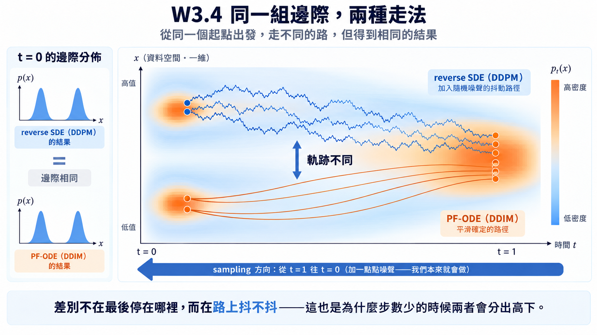

import Objectives from '../../../components/Objectives.astro';
import Prereq from '../../../components/Prereq.astro';
import Ask from '../../../components/Ask.astro';
import Remark from '../../../components/Remark.astro';
import Question from '../../../components/Question.astro';
import Answer from '../../../components/Answer.astro';
import QuizBlock from '../../../components/QuizBlock.astro';
import Option from '../../../components/Option.astro';
import Explanation from '../../../components/Explanation.astro';
import Bridge from '../../../components/Bridge.astro';
import Ref from '../../../components/Ref.astro';

# 從離散步驟到 Forward / Reverse Dynamics

<Objectives>
- **可以往回倒帶一格，為什麼不能直接快轉呢？** Denoiser 告訴我們當下該怎麼往回走，但 DDPM 的 reverse Gaussian 是針對相鄰小步建立的近似；一步跨得越大，真正的 reverse distribution 越不像單一 Gaussian，近似誤差也會跟著放大。
- **如果不能放大原本的一步，還有哪裡可以改？** 回頭檢查 denoising loss 實際看見的資訊，從「marginals 被固定、跨時間的 joint 沒有」推出新的 generative process，最後才得到 deterministic 與跳步取樣。
- **離散公式背後是哪一條運動規則？** 寫出 forward SDE、reverse SDE 與 probability-flow ODE，並分清 score、dynamics 與數值步長各自決定什麼。
</Objectives>

<Prereq items={frontmatter.prereqs} />

## 會倒帶一格，還不等於能快轉

在 <Ref to="dma-denoising-regression">U1.2</Ref> 中，我們已經提過要怎麼生成資料了：從 $x_T\sim\mathcal N(0,I)$ 出發，讓神經網路預測 $\hat x_0$ 或 $\hat\epsilon$，再從 reverse Gaussian 抽出 $x_{t-1}$。但每往回倒帶一格都要呼叫一次網路；原本走了一千步，生成一張圖就得依序跑一千次。難道我們不能快轉它嗎？

<Ask>
<strong>我們已經知道怎麼倒帶一格； 
要怎麼改變播放速度，卻仍然走在正確的 distribution 上？</strong>
</Ask>

先回顧一下 <Ref to="dma-denoising-regression">U1.2</Ref> 中 DDPM 的生成方式：

$$
x_{t-1}=\tilde\mu_t\big(x_t,\ \hat x_\theta(x_t,t)\big)+\sqrt{\tilde\beta_t}\,z,
\qquad z\sim\mathcal N(0,I).
$$

其中，真實的 $q(x_{t-1}\mid x_t)$ 是許多可能來源混在一起形成的 distribution，通常不是公式裡假設的單一 Gaussian。

<Question id="Q1">
既然一格一格走太慢，最直接的做法似乎是：把目標從 $t-1$ 改成一個更早的 $s\ll t$，仍然預測 $\hat x_0$，再用一個 Gaussian 直接抽出 $x_s$。

但真正的大步 reverse distribution 是

$$
q(x_s\mid x_t)
=\int q(x_s\mid x_t,x_0)\,p(x_0\mid x_t)\,\mathrm dx_0,
$$

仍然是許多 Gaussian 按照可能的 $x_0$ 混在一起。

想像同一個模糊的 $x_t$ 可能來自左邊或右邊的 $x_0$。只退一小步時，兩種來路的下一個位置還靠得很近，差異不大；但一次退很多步，左邊的人會走得更左、右邊的人會走得更右，兩個分支就會逐漸拉開。如果只把所有可能的 $x_0$ 換成平均 $\hat x_0=\mathbb E[x_0\mid x_t]$，卻沒有考慮兩條路可能離平均多遠，得到的 distribution 就會和實際情況差很多——而描述這種隨機性的量正是 variance。

**當我們只用一個以 $\hat x_0$ 為中心的 Gaussian 近似時，漏掉的隨機性有多少？只退一小步與一次退很多步，這項 variance 會怎麼改變？**

<Answer>
先把左右兩個可能來源想成在平均值兩側的 $-a$ 與 $+a$。若 reverse mean 裡 $x_0$ 的係數是 $c_{t,s}$，走到 $s$ 時，兩個分支相對於平均的位置就是 $-c_{t,s}a$ 與 $+c_{t,s}a$。它們的平均一直是 0，但 variance 是

$$
\frac{(-c_{t,s}a)^2+(c_{t,s}a)^2}{2}=c_{t,s}^2a^2.
$$

所以只退一小步時，$c_{t,s}$ 很小，兩個分支造成的 variance 也很小；一次退得越遠，$c_{t,s}$ 越大，原本被平均藏起來的差距就會被平方放大。

一般情況也是同一件事。對任意 $s<t$，$q(x_s\mid x_t,x_0)$ 的 mean 對 $x_0$ 是 affine 的。把 $x_0$ 的係數記成 $c_{t,s}$、它自己的 conditional variance 記成 $\tilde\beta_{t\to s}I$，law of total variance 給出

$$
\mathbb E[x_s\mid x_t]
=\tilde\mu_{t\to s}\big(x_t,\mathbb E[x_0\mid x_t]\big),
\qquad
\operatorname{Var}[x_s\mid x_t]
=\tilde\beta_{t\to s}I
+c_{t,s}^2\operatorname{Var}[x_0\mid x_t].
$$

第一式說明：把 $\hat x_0=\mathbb E[x_0\mid x_t]$ 代進去，中心仍然是對的。第二式則把 variance 分成兩部分：$\tilde\beta_{t\to s}I$ 是每個分支自己原有的寬度；$c_{t,s}^2\operatorname{Var}[x_0\mid x_t]$ 是不同分支彼此分開造成的寬度。只抽公式裡的單一 Gaussian，漏掉的正是後面那一項。

相鄰一步時，$c_{t,t-1}=O(\beta_t)$，所以漏掉的 variance 相對於保留項只有 $O(\beta_t)$；步長夠小，這個近似還算合理。一次跨很遠時，$c_{t,s}$ 不再是一個由單步 $\beta_t$ 控制的小量，分支中心可能明顯分開，mixture 甚至會呈現多個峰值。這時用一個以平均為中心的 Gaussian 取代它，就會把樣本推到不同來路之間原本沒有資料的地方。

> **小步時，漏掉的 variance 還小；大步時，不同來路被拉得更開，漏掉的 variance 就可能大到不能忽略。問題不是平均方向突然算錯，而是單一 Gaussian 把本來已經分開的多條路壓回了中間。**
</Answer>
</Question>

所以，想加速不能只是把 DDPM 的相鄰一步硬拉大。既然這條 sampling update 不能直接改，我們得回頭找：**整個方法裡，還有什麼其實沒有被訓練固定？**

<Ask>
訓練 denoiser 時，我們真的讓它看過那一千步怎麼連起來嗎？
</Ask>

## 訓練真的看過整條 Markov chain 嗎？

把 simple denoising loss 再寫一次：

$$
\mathcal L_{\text{simple}}
=\mathbb E_{x_0,t,\epsilon}
\left[\left\|\epsilon_\theta(x_t,t)-\epsilon\right\|^2\right],
\qquad
x_t=\sqrt{\bar\alpha_t}x_0+\sqrt{1-\bar\alpha_t}\,\epsilon.
$$

每次 training 只抽一張 $x_0$、一個 $t$ 與一個 noise，再直接算出 $x_t$。中間的 $x_1,\ldots,x_{t-1}$ 根本沒有算出來，loss 也不知道這條路徑，更不知道它們怎麼和 $x_t$ 連起來。模型實際看到的只有一張張 noisy snapshot：

$$
q(x_t\mid x_0)=\mathcal N\!\left(\sqrt{\bar\alpha_t}x_0,(1-\bar\alpha_t)I\right),
$$

而不是整條完整的路徑 $q(x_{1:T}\mid x_0)$。

想像我們只有散場後十分鐘、二十分鐘與三十分鐘的三張空拍照。每張照片都告訴我們各個街口有多少人，卻沒有替每個人畫線，標出他在三張照片裡分別站在哪裡。原本的 Markov chain 是一種連法，但只看這三張照片，還可能有很多種連法。

這就是可以改的地方：**保留每個時刻的快照，重新決定不同時刻的人如何配對。**

## 快照不變，來路可以重畫

我們想看的，是這些快照之間可以如何重新配對。真正生成時，我們手上只有 $x_t$，所以想 modeling 的其實是

$$
q_\lambda(x_s\mid x_t)
=\int q_\lambda(x_s\mid x_t,x_0)\,p(x_0\mid x_t)\,\mathrm dx_0,
$$

其中，<Ref to="dma-denoising-regression">U1.2</Ref> 與 <Ref to="dma-tweedie-and-score">U1.3</Ref> 已經給了我們 denoiser：它能從 $x_t$ 估計 $\mathbb E[x_0\mid x_t]$，也就是這個 posterior 的平均。現在還缺的是：**假如已知 $x_t$，而且可以偷看 $x_0$，我們該如何走到 $x_s$？** 這正是 $q_\lambda(x_s\mid x_t,x_0)$ 描述的規則。

不同的 $q_\lambda(x_s\mid x_t,x_0)$，就是不同的配對方式。

不過配對不能亂配。要把「快照不變、重新配對」這個直覺化成具體方法，通常得先回頭看看：有哪些限制是我們必須遵守的？

首先，$x_s$ 的 marginal distribution $p_s(x_s)$ 必須保持不變，因為它是我們的 forward process 決定的 noisy snapshot，也是原本 denoiser 在 training 時看到的 distribution。又因為 $p_{\text{data}}(x_0)$ 是固定的，

$$
p_s(x_s)
=\int q(x_s\mid x_0)\,p_{\text{data}}(x_0)\,\mathrm dx_0,
$$

所以只要確保 $q(x_s\mid x_0)$ 不變，$p_s(x_s)$ 就不會改變。換句話說，無論怎麼配，把 $x_t$ 積分掉之後，都必須回到原本的 $s$ 時刻快照：

$$
\int q_\lambda(x_s\mid x_t,x_0)\,q(x_t\mid x_0)\,\mathrm dx_t
=q(x_s\mid x_0).
$$

所以真正要設計的是：**一個能滿足上式，而且給定 $x_0$ 與 $x_t$ 時可以直接抽出 $x_s$ 的 conditional。** 否則只是把原本的問題換了一個名字。

要替不同空拍照中的人配對，最自然的做法是先替每個人找一個可以沿用的標記。給定他的原始位置 $x_0$ 與現在的位置 $x_t$，forward process 當時加入的 noise 可以直接反解出來：

$$
\epsilon_t:=\frac{x_t-\sqrt{\bar\alpha_t}x_0}{\sqrt{1-\bar\alpha_t}}.
$$

$\epsilon_t$ 表示這個樣本相對於「此時應在的位置」，往哪個方向、偏了幾個 noise scale。依照 forward process，$\epsilon_t\sim\mathcal N(0,I)$，而且它在每個時刻的 marginal distribution 都是 standard Gaussian。這讓我們可以直接檢查重新配對後，是否仍滿足上面的 marginal 限制。

我們要讓 $x_s$ 的 noise variance 最後仍是 $1-\bar\alpha_s$。既然 $\epsilon_t$ 已經是 standard Gaussian，最直接的做法就是沿用其中一部分，再用一份新的 Gaussian noise 補足剩下的 variance。

令 $\lambda_{t,s}^2$ 表示要留給新 noise 的 variance，其中 $0\leq\lambda_{t,s}^2\leq1-\bar\alpha_s$；再抽一個與 $\epsilon_t$ 獨立的 $z\sim\mathcal N(0,I)$，定義

$$
x_s
=\sqrt{\bar\alpha_s}x_0
+\sqrt{1-\bar\alpha_s-\lambda_{t,s}^2}\,\epsilon_t
+\lambda_{t,s}z.
$$

第二項用的是從 $x_t$ 反推出來的 Gaussian noise，第三項則是我們另外引入的隨機性。原本 DDPM 的 Markov trajectory 一般沒有 $\epsilon_s=\epsilon_t$ 這個條件；而沿用同一份 noise，是我們現在**重新定義 coupling** 的方式。

因為 $\epsilon_t$ 與 $z$ 是兩個獨立的 standard Gaussian，noise 的總 variance 正好是

$$
\big(1-\bar\alpha_s-\lambda_{t,s}^2\big)I
+\lambda_{t,s}^2I
=(1-\bar\alpha_s)I.
$$

mean 仍是 $\sqrt{\bar\alpha_s}x_0$，variance 也正好符合限制。因此無論 $\lambda_{t,s}$ 怎麼選，對 $x_t$ 積分後都會回到原本的 noisy marginal：

$$
q_\lambda(x_s\mid x_0)
=\mathcal N\!\left(\sqrt{\bar\alpha_s}x_0,(1-\bar\alpha_s)I\right).
$$

另一方面，給定 $x_0$ 與 $x_t$ 時，$\epsilon_t$ 已經確定；此時唯一的 randomness 來自 $z$，所以上面的抽樣式也直接給出

$$
q_\lambda(x_s\mid x_t,x_0)
=\mathcal N\!\left(
\sqrt{\bar\alpha_s}x_0
+\sqrt{1-\bar\alpha_s-\lambda_{t,s}^2}\,
\frac{x_t-\sqrt{\bar\alpha_t}x_0}{\sqrt{1-\bar\alpha_t}},
\ \lambda_{t,s}^2I
\right).
$$

這條新的 forward／inference joint 一般不再是 Markov chain：即使已知 $x_t$，$x_s$ 的 conditional 仍直接依賴 $x_0$。這裡的 **non-Markovian** 指的是我們改了快照之間的配對，不是說生成時網路必須記住全部歷史。

<Remark label="補充" summary="換掉這樣的生成方式後，原本的 denoiser 還能用嗎？還有理論根據嗎？">
能。先把 $x_0=(x_t-\sqrt{1-\bar\alpha_t}\,\epsilon_t)/\sqrt{\bar\alpha_t}$ 代回 conditional 的 mean，並記

$$
c_{t,s}
:=\sqrt{1-\bar\alpha_s-\lambda_{t,s}^2}
-\sqrt{\frac{\bar\alpha_s}{\bar\alpha_t}}\sqrt{1-\bar\alpha_t}.
$$

那麼真實 conditional 與我們使用的 reverse model 分別是

$$
\begin{aligned}
q_\lambda(x_s\mid x_t,x_0)
&=\mathcal N\!\left(
\sqrt{\frac{\bar\alpha_s}{\bar\alpha_t}}x_t
+c_{t,s}\epsilon_t,
\lambda_{t,s}^2I
\right),\\
p_\theta(x_s\mid x_t)
&:=\mathcal N\!\left(
\sqrt{\frac{\bar\alpha_s}{\bar\alpha_t}}x_t
+c_{t,s}\epsilon_\theta(x_t,t),
\lambda_{t,s}^2I
\right).
\end{aligned}
$$

把新的 variational objective 按時間拆開後，每一步和 <Ref to="dma-denoising-regression">U1.2</Ref> 一樣是一個 KL；不含 $\theta$ 的 boundary terms 併入常數 $C$，終點的 reconstruction term 也同樣會化成平方誤差：

$$
J_\lambda(\theta)
=\sum_{t\to s}\mathbb E\!\left[
D_{\mathrm{KL}}\!\left(
q_\lambda(x_s\mid x_t,x_0)
\,\|\,
p_\theta(x_s\mid x_t)
\right)
\right]+C.
$$

KL 兩邊的 Gaussian 有相同的 covariance $\lambda_{t,s}^2I$，mean 只差在放入真實的 $\epsilon_t$，還是網路預測的 $\epsilon_\theta(x_t,t)$。因此

$$
D_{\mathrm{KL}}
=\frac{c_{t,s}^2}{2\lambda_{t,s}^2}
\left\|\epsilon_t-\epsilon_\theta(x_t,t)\right\|^2
=\gamma_{t,s}\left\|\epsilon_t-\epsilon_\theta(x_t,t)\right\|^2.
$$

其中 $\gamma_{t,s}>0$ 只由 schedule 與 $\lambda_{t,s}$ 決定。把所有 timestep 加起來，就得到

$$
J_\lambda(\theta)=\mathcal L_\gamma(\theta)+C.
$$

這就是「這一族 process 的 variational objective 都會化成某組加權 denoising MSE」的簡短證明。（嚴格的 Gaussian KL 證明先取 $\lambda_{t,s}>0$；deterministic 的 $\lambda_{t,s}=0$ 可視為其極限。）

而 <Ref to="dma-tweedie-and-score"/> 已經看過，在理想函數層級，正的 timestep weights 不會改變每個 $t$ 的最佳解。

**訓練固定了每張 noisy snapshot 上的最佳 denoiser，沒有把跨時間的連法一起固定。** 所以只要 $q(x_t\mid x_0)$ 保持不變，就能沿用原本的 denoiser，不必重新訓練。
</Remark>

## 把新的來路倒著走

到目前為止，我們都還在偷看 $x_0$。真正生成時只有 $x_t$，但 <Ref to="dma-tweedie-and-score">U1.3</Ref> 告訴我們，denoiser 可以從目前的 $(x_t,t)$ 估計加入的 noise：

$$
\hat\epsilon_t:=\epsilon_\theta(x_t,t)
\approx\mathbb E[\epsilon_t\mid x_t]
=-\sqrt{1-\bar\alpha_t}\,\nabla\log p_t(x_t).
$$

把 $x_0=(x_t-\sqrt{1-\bar\alpha_t}\,\epsilon_t)/\sqrt{\bar\alpha_t}$ 直接代進上面的 conditional，再用 $\hat\epsilon_t$ 取代看不見的 $\epsilon_t$，就得到

$$
x_s
=\sqrt{\frac{\bar\alpha_s}{\bar\alpha_t}}x_t
+\left(
\sqrt{1-\bar\alpha_s-\lambda_{t,s}^2}
-\sqrt{\frac{\bar\alpha_s}{\bar\alpha_t}}\sqrt{1-\bar\alpha_t}
\right)\hat\epsilon_t
+\lambda_{t,s}z,
\qquad z\sim\mathcal N(0,I).
$$

現在看得很清楚：每一步只需要目前的 $x_t$、網路在這一點給出的 $\hat\epsilon_t$（等價地，score），以及一份可選的 Gaussian noise；不需要真的知道 $x_0$。

這條式子留給我們一個選擇：每一步要加入多少新的 randomness？先確認它確實包含原本的 DDPM。令 $s=t-1$，並取

$$
\lambda_{t,t-1}^2=\tilde\beta_t
=\frac{1-\bar\alpha_{t-1}}{1-\bar\alpha_t}\,\beta_t.
$$

利用 $\bar\alpha_t=\alpha_t\bar\alpha_{t-1}$ 與 $\beta_t=1-\alpha_t$，更新式裡的兩個係數會化成

$$
\begin{aligned}
\sqrt{\frac{\bar\alpha_{t-1}}{\bar\alpha_t}}
&=\frac{1}{\sqrt{\alpha_t}},\\[2pt]
\sqrt{1-\bar\alpha_{t-1}-\tilde\beta_t}
-\frac{\sqrt{1-\bar\alpha_t}}{\sqrt{\alpha_t}}
&=-\frac{\beta_t}{\sqrt{\alpha_t}\sqrt{1-\bar\alpha_t}}.
\end{aligned}
$$

因此一般式變成

$$
x_{t-1}
=\frac{1}{\sqrt{\alpha_t}}
\left(
x_t-\frac{\beta_t}{\sqrt{1-\bar\alpha_t}}\,\hat\epsilon_t
\right)
+\sqrt{\tilde\beta_t}\,z,
$$

正是 <Ref to="dma-denoising-regression">U1.2</Ref> 的 DDPM update。DDPM 的確是這一族配對中的一種，但維持 marginals 並沒有要求我們只能選它。

那如果完全不加入新的 noise 呢？令 $\lambda_{t,s}=0$，更新變成

$$
x_s
=\sqrt{\frac{\bar\alpha_s}{\bar\alpha_t}}x_t
+\left(
\sqrt{1-\bar\alpha_s}
-\sqrt{\frac{\bar\alpha_s}{\bar\alpha_t}}\sqrt{1-\bar\alpha_t}
\right)\hat\epsilon_t.
$$

因為 $\hat\epsilon_t\approx-\sqrt{1-\bar\alpha_t}\,\nabla\log p_t(x_t)$，右邊完全是 $x_t$ 與當下 score 的函數。當 $s$ 與 $t$ 越來越接近，$x_s-x_t$ 就是一小段由目前位置與時間決定的 deterministic movement；連續極限正是後面會看到的 ODE。

這裡不是在用「$t$ 的 noise 預測原本 DDPM 在 $s$ 的 noise」。我們已經換了一個 joint；新的 coupling **定義**同一條 trajectory 在 $s$ 時沿用這份 noise。到達 $x_s$ 後，網路會重新計算 $\hat\epsilon_s$，不會把第一次的預測一路用到底。

此時給定起點 $x_T$，之後的整條路都是確定的；所有 randomness 都集中在最初抽到的 $x_T$。這成了一個 implicit probabilistic model：它告訴我們如何從 latent variable 產生樣本，卻不直接給出 likelihood。**到這一步，Song、Meng 與 Ermon 才把它取名為 Denoising Diffusion Implicit Model，也就是 DDIM。**

有了上面的架構，我們就可以從原本的 $1,\ldots,T$ 中只挑一條較短的 subsequence

$$
0=\tau_0<\tau_1<\cdots<\tau_S=T,
$$

再沿著 $\tau_S\to\tau_{S-1}\to\cdots\to\tau_0$ 生成。

<Remark label="符號" summary="DDIM 的一般式（含 η）長什麼樣？">
文獻常把上面的 $\lambda_{t,s}$ 寫成

$$
\lambda_{t,s}
=\eta\sqrt{\frac{1-\bar\alpha_s}{1-\bar\alpha_t}}
\sqrt{1-\frac{\bar\alpha_t}{\bar\alpha_s}}.
$$

$\eta=0$ 是 deterministic DDIM；走完整的相鄰 schedule 時，$\eta=1$ 會回到 DDPM 的 posterior variance。跳步時，$\eta$ 仍表示這一步保留多少 stochasticity，但那已經不是原本那條逐格 DDPM chain。
</Remark>

## 兩種走法，看得見

<iframe loading="lazy" src="/personal_website/notes/research_areas/diffusion-models-applications/w3-4-samplers.html" class="demo-frame" title="DDPM 與 DDIM 軌跡：互動 demo" style="height: 980px; width: 100%; border: none;"></iframe>

**互動 demo：DDPM 與 DDIM 的軌跡。** 兩邊用**同一個** score（這裡直接用資料算出精確的 score，相當於一個訓到最佳的網路）、**同一組起點**，只有 $\eta$ 不同。把 $\eta$ 從 1 拉到 0，軌跡會從抖動變成光滑，但**終點都落在資料上**——這就是「邊際相同」看起來的樣子。把步數從 200 降到 50、25、10，終點離資料會越來越遠，而 $\eta=0$ 通常掉得慢一些。另外注意 $\eta=0$ 的軌跡明顯是**彎的**，這件事 <Ref week="dma-week-flow-matching"/> 會再拿出來講。

（要提醒的是：這個 demo 的 score 是精確的，所以看不到「網路有誤差時，加回噪聲能把樣本拉回 $p_t$」那一面——那要真的訓練一個網路才看得到，留到 <Ref to="dma-lab-diffusion"/>。）

## 從固定格子走向連續時間

上面的做法雖然已經可以跳步，但走的仍是原本 schedule 上的格子。若想不再受這些格點限制，就得把「distribution 怎麼演化」與「計算時切成幾步」真正分開。

做法就是把 timestep 切得越來越細，讓步長縮到 $0$；進入連續時間後，直接找出背後的 dynamics。

## Forward dynamics：把加噪寫成連續運動

想像把一秒鐘的影片切成 $T$ 格，每一格代表 $\Delta t=1/T$。格子切得越細，每一步加入的 noise 也必須跟著變小；否則步數趨近無限時，總 noise 也會跟著爆掉。因此把原本每一步的 $\beta_t$ 攤到這段時間裡，寫成 $\beta(t)\Delta t$。

<Ref to="dma-forward-process">U1.1</Ref> 的一步 forward transition 就變成

$$
x_{t+\Delta t}
=\sqrt{1-\beta(t)\Delta t}\,x_t
+\sqrt{\beta(t)\Delta t}\,\xi_t,
\qquad \xi_t\sim\mathcal N(0,I),
$$

其中 $\xi_t$ 是這一小步新抽的 noise。當 $\Delta t$ 很小時，利用

$$
\sqrt{1-\beta(t)\Delta t}
=1-\tfrac12\beta(t)\Delta t+O(\Delta t^2),
$$

把 $x_t$ 移到左邊，就得到這一小步實際造成的改變：

$$
x_{t+\Delta t}-x_t
=-\tfrac12\beta(t)x_t\,\Delta t
+\sqrt{\beta(t)}\big(\sqrt{\Delta t}\,\xi_t\big)
+O(\Delta t^2).
$$

這裡的 noise 為什麼是 $\sqrt{\Delta t}$，而不是 $\Delta t$？因為獨立 noise 相加時，是 **variance** 相加：每一步的 variance 是 $\Delta t$，走 $1/\Delta t$ 步後，總 variance 仍是 $1$。如果每一步只乘 $\Delta t$，總 variance 反而會縮到 $0$，隨機性就消失了。

現在把

$$
\Delta W_t:=\sqrt{\Delta t}\,\xi_t,
\qquad \Delta W_t\sim\mathcal N(0,\Delta t\,I).
$$

這就是 Brownian motion 在這一小段時間裡的增量。讓 $\Delta t\to0$，$\Delta W_t$ 寫成 $dW_t$，上面的離散更新就變成 SDE：

$$
dx=-\tfrac12\beta(t)\,x\,dt+\sqrt{\beta(t)}\,dW_t,\qquad t:0\to1 .
$$

第一項是每一小段時間把樣本往原點縮一點，第二項則灌入相應大小的 Gaussian noise。它做的仍是原本的 forward process，只是不再綁在某一組 timestep 上。

一般來說，一條 forward dynamics 會告訴我們兩件事：drift $f_t$ 決定樣本平均往哪裡移動，diffusion $g_t$ 決定每一小段時間注入多少隨機。對這個 variance-preserving process 而言，

$$
f_t=-\tfrac12\beta(t),\qquad g_t=\sqrt{\beta(t)}.
$$

這裡也看得到為什麼 **score 本身還不夠決定 reverse dynamics**。Score 只告訴我們同一個時刻裡，density 往哪個方向增加；它沒有單獨告訴我們 forward process 每單位時間加入多少 noise。反向修正的大小必須同時知道 $g_t$。

## Reverse dynamics：score 怎麼把時間倒過來？

Anderson（1982）[3] 證明了一件很漂亮的事：**把時間倒過來，它仍然是一條 SDE**，而且 drift 裡多出一個 score 項：

$$
dx=\Big[-\tfrac12\beta(t)\,x-\beta(t)\,\nabla\log p_t(x)\Big]dt+\sqrt{\beta(t)}\,d\bar W_t,\qquad t:1\to0 .
$$

這條式子把前面缺的兩塊拼在一起了：forward dynamics 提供原本的 drift 與 noise 強度，U1.3 學到的 score 則告訴反向過程，樣本要往哪裡修正。兩者缺一不可。

Song et al.（2021）[4] 進一步指出：同一條邊際分布路徑還可以由一條**完全沒有隨機項**的 ODE 推動，而且它與上面的 reverse SDE 在每個 $t$ 都有相同的 $p_t$：

$$
\frac{dx}{dt}=-\tfrac12\beta(t)\,x-\tfrac12\beta(t)\,\nabla\log p_t(x)
\qquad\text{(probability-flow ODE)} .
$$

注意 score 前面的係數：SDE 是 $\beta$，ODE 只有 $\tfrac12\beta$。

<Remark label="符號" summary="文獻上寫的是通式：$dy_t=[f_t y_t-g_t^2 s_\theta]dt+g_t d\bar W_t$">
上面三條式子把 DDPM 的 schedule 直接代進去了，所以長得很具體。文獻上（Song et al. [4]、以及本課主要參考 [5] 的 §4.1）通常寫的是**通式**——forward 只要寫成

$$
dx=f_t\,x\,dt+g_t\,dW_t ,
$$

Anderson 的結果就給出對應的反向兩條：

$$
\begin{aligned}
dy_t&=\big[f_t\,y_t-g_t^2\,s_\theta(y_t,t)\big]dt+g_t\,d\bar W_t ,\\[2pt]
\frac{dy_t}{dt}&=f_t\,y_t-\tfrac12\,g_t^2\,s_\theta(y_t,t)\qquad\text{(PF-ODE)} .
\end{aligned}
$$

字母對照：$y_t$ 就是反向跑的那個過程（有些文獻寫 $\bar x(t)$），$s_\theta$ 就是 <Ref to="dma-tweedie-and-score"/> 定義的 $-\epsilon_\theta/\sigma_t$，$\bar W$ 是反向時間的 Wiener process。（最一般的寫法是 $f(x,t)$，允許 drift 對 $x$ 不是線性的；這門課用到的 forward process 都是線性的，所以一律寫成 $f_t\,x$。）

**代回我們的情形**：DDPM 的 forward 是 $f_t=-\tfrac12\beta(t)$、$g_t=\sqrt{\beta(t)}$，所以 $g_t^2=\beta(t)$——代進去就字字對得上上面那兩條。認得通式的好處是：**換一個 schedule、甚至換一整族 forward process，變的只有 $f_t$ 與 $g_t$，這兩條式子的形狀不變。** <Ref week="dma-week-interpolants"/> 就是把 $f_t$、$g_t$ 當成可以調的東西。
</Remark>

<Remark summary="少掉的那一半 score 去哪了？">
關鍵在 Fokker–Planck 方程（<Ref to="math-fokker-planck"/>）：噪聲項對分布造成的擴散 $\tfrac12\beta\,\Delta p_t$ 可以改寫成一個散度的形式

$$
\tfrac12\beta\,\Delta p_t=\nabla\cdot\Big(\tfrac12\beta\,p_t\,\nabla\log p_t\Big),
$$

也就是「擴散」可以被**吸進 drift 裡**，變成一個沿著 $\nabla\log p_t$ 的移動。所以我們可以拿掉噪聲項，同時從 drift 扣掉那一半 score——分布的演化完全一樣，只是每條軌跡不再隨機。

把這個改寫代回 Fokker–Planck，drift 項與擴散項就併成一項：

$$
\partial_t p_t+\nabla\cdot\big(p_t\,u_t\big)=0,\qquad
u_t(x)=-\tfrac12\beta(t)\,x-\tfrac12\beta(t)\,\nabla\log p_t(x) .
$$

那個 $u_t$ 正是上面 PF-ODE 的速度場，而左邊這條方程式有名字：**continuity equation**（<Ref to="math-continuity-equation"/>）。它說的只是**東西不會憑空出現或消失**——$p_t u_t$ 是「流量」，某一點的密度會上升，只能是因為流進來的比流出去的多。

所以「SDE 與 ODE 的邊際相同」不是巧合：把擴散吸進 drift 之後，兩邊滿足的是同一條 continuity equation。<Ref to="dma-flows-and-continuity"/> 會把它反過來用——先指定想要的 $p_t$，再去找推動它的 $u_t$。

這件事之後會被推廣成一整族取樣器（<Ref week="dma-week-interpolants"/>）：噪聲要注入多少，其實是一個**可以調的設定**。
</Remark>

三者的關係整理成一張表：

| | forward SDE | reverse SDE | PF-ODE |
|---|---|---|---|
| 時間方向 | $p_0\to p_T$ | $p_T\to p_0$ | $p_T\to p_0$ |
| 經過的邊際 | $p_t$ | 同一組 $p_t$，反向走 | 同一組 $p_t$，反向走 |
| 單條軌跡 | 隨機 | 隨機 | 確定 |
| 離散對應 | forward 加噪步驟 | DDPM reverse update | deterministic DDIM update |

**圖：同一組邊際，兩種走法。** 兩組軌跡從**同一批起點**出發，上面是 reverse SDE（抖動）、下面是 PF-ODE（光滑）；左側兩個 $t=0$ 的邊際分布看起來一樣。這不表示同一個起點會抵達同一個終點；相同的是整群人的分布，不是個別樣本的路線。

在 variance-preserving diffusion 的連續極限下，可以把 DDPM 的 reverse update 看成 reverse SDE 的一階離散對應；deterministic DDIM 則對應 PF-ODE。精確的數值格式會隨時間與狀態的 parametrization 改變，但概念上的分工不變：**網路提供 score，dynamics 指定怎麼走，數值方法決定用哪些 timestep 把它算出來。**

## Sampler = dynamics + 數值求解

想改變步數，不能只放大相鄰的 DDPM 公式；得先選 reverse dynamics，再選 timestep 與 solver。這時「五十步或一千步」才是數值求解的選擇。

步數減少仍有兩筆不同的誤差：Q1 的 **Gaussian approximation error** 是單一 reverse kernel 對 mixture posterior 的近似，由 $\beta_t$ 控制；**numerical discretization error** 則來自用有限步近似一條連續 dynamics，由 $\Delta t$、軌跡曲率與 solver 決定。兩者都會隨步子變大而惡化，但不是同一件事。

DDPM 與 DDIM 在理想的連續極限可以經過同一組 marginals，不代表有限步品質一定相同。ODE 的主要問題是用直線近似彎曲軌跡；SDE 還有 drift 的離散誤差與隨機擾動，但 score drift 也可能把偏掉的樣本拉回。哪一端較好，要看模型誤差與離散化誤差誰佔上風；<Ref to="dma-lab-diffusion"/> 會直接比較。

DDPM 選 Gaussian noise、Gaussian prior 與特定 schedule，是為了讓 $q(x_t\mid x_0)$ 可解析；它是一套設計，不是唯一的生成路徑。<Ref to="dma-why-not-diffusion"/> 會接著問：若不想讓路徑與起點都被這些選擇綁住，還能怎麼做？

## 消化一下

<QuizBlock id="w3-4-a">
PF-ODE 裡 score 項的係數是 reverse SDE 的一半。這一半去哪了？
<Option>被學習率吸收了。</Option>
<Option correct>在 Fokker–Planck 方程裡，噪聲造成的擴散可以改寫成一個沿 $\nabla\log p_t$ 的 drift；拿掉噪聲的同時也要扣掉那一半 drift，邊際才會不變。</Option>
<Option>因為 ODE 的時間跑得比較快。</Option>
<Explanation>
這是「同一組邊際、兩種走法」的數學核心：噪聲與 score drift 之間可以互換。
</Explanation>
</QuizBlock>

<QuizBlock id="w3-4-b">
為什麼不能把 DDPM 的相鄰 Gaussian 直接放大，用它一次跨過很多 timestep？
<Option>因為 denoiser 只能讀取相鄰的 timestep。</Option>
<Option correct>中心仍可能算對，但不同可能來源造成的 variance 會隨跨度變大；單一 Gaussian 越來越難表示真正的 mixture posterior。</Option>
<Option>因為放大步伐會改變 training loss 的最佳解。</Option>
<Explanation>
小步時，不同來源的下一個位置還很接近，漏掉的 variance 是小量；大步時，分支被拉開，只保留 posterior mean 會把它們壓回中間。
</Explanation>
</QuizBlock>

<QuizBlock id="w3-4-c">
說 DDIM 使用 non-Markovian process，指的是哪一件事？
<Option>生成時，網路每一步都必須讀取完整的 sampling history。</Option>
<Option correct>DDIM 改用一個 non-Markovian 的 forward／inference joint；它保留每個 $q(x_t\mid x_0)$，但重新定義不同時刻之間如何配對。</Option>
<Option>DDIM 的 $q(x_t\mid x_0)$ 不再是 Gaussian。</Option>
<Explanation>
Non-Markovian 指的是跨時間的 forward／inference coupling，不是說 reverse sampler 必須記住整段歷史。單一時刻的 marginals 與 denoising training distribution 都和 DDPM 相同，所以同一個 denoiser 可以沿用。
</Explanation>
</QuizBlock>

<Bridge to="dma-lab-diffusion">
現在同一支 denoiser 已經有不只一種走法，也可以只挑一小段 timestep subsequence。但少走幾步之後，終點變差究竟是 score 沒學準，還是用有限步近似 dynamics 的誤差？<Ref to="dma-lab-diffusion"/> 接著把 learned／exact score 與 DDPM／DDIM 交叉比較，讓這兩種誤差分開出現。
</Bridge>

## 參考文獻

1. Ho, J., Jain, A., Abbeel, P. [*Denoising Diffusion Probabilistic Models.*](https://arxiv.org/abs/2006.11239) NeurIPS 2020. （DDPM 的 reverse sampling update。）
2. Song, J., Meng, C., Ermon, S. [*Denoising Diffusion Implicit Models.*](https://arxiv.org/abs/2010.02502) ICLR 2021. （DDIM 與含 $\eta$ 的一般式、跳步取樣。）
3. Anderson, B. D. O. [*Reverse-time diffusion equation models.*](https://doi.org/10.1016/0304-4149(82)90051-5) Stochastic Processes and their Applications, 1982. （反向 SDE 的來源。）
4. Song, Y., Sohl-Dickstein, J., Kingma, D. P., Kumar, A., Ermon, S., Poole, B. [*Score-Based Generative Modeling through Stochastic Differential Equations.*](https://arxiv.org/abs/2011.13456) ICLR 2021. （probability-flow ODE 與「同一組邊際」的統一觀點。）
5. Lai, C.-H., Song, Y., Kim, D., Mitsufuji, Y., Ermon, S. [*The Principles of Diffusion Models.*](https://arxiv.org/abs/2510.21890) 2025, Section 4.1. （reverse-time SDE 與 PF-ODE 的通式，Equation (4.1.6)。）
