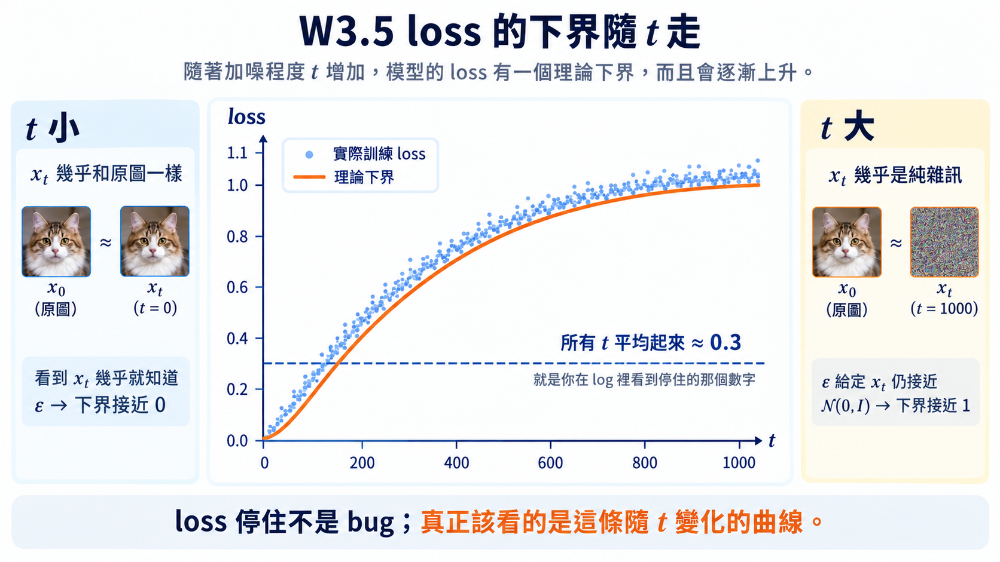

import Objectives from '../../../components/Objectives.astro';
import Prereq from '../../../components/Prereq.astro';
import Ask from '../../../components/Ask.astro';
import Remark from '../../../components/Remark.astro';
import Question from '../../../components/Question.astro';
import Answer from '../../../components/Answer.astro';
import QuizBlock from '../../../components/QuizBlock.astro';
import Option from '../../../components/Option.astro';
import Explanation from '../../../components/Explanation.astro';
import VizPlan from '../../../components/VizPlan.astro';
import Bridge from '../../../components/Bridge.astro';
import Ref from '../../../components/Ref.astro';

# 實作：建立這一週的 Toy

<Objectives>
- **建立之後三週共用的 2D toy 與小 MLP。** 說出為什麼要在這麼小的問題上做——真實的 $p_t$、score、後驗均值全部精確算得出來，網路學得好不好不用猜。
- **親手實作 $\epsilon$-prediction 訓練、DDPM 與 DDIM 取樣，並產出三張圖。** score field、$\hat x_0$ 的換算誤差對 $t$、DDPM／DDIM 軌跡；順手驗一次三種 parametrization 真的等價。
- **看懂「loss 停在某個非零的數字」不是 bug，而是 <Ref to="dma-tweedie-and-score"/> 算出來的地板 $\mathbb E[\operatorname{tr}\operatorname{Var}(\epsilon\mid x_t)]$。** 並知道該看的是它隨 $t$ 的形狀，不是那個平均值。
</Objectives>

<Prereq items={frontmatter.prereqs} />

## 先在淺水區把每件事看清楚

這一週的理論講完了，但還沒有一行程式跑過。接下來要做的，是把整週的東西縮成一個**幾秒就能重跑**的小實驗。

之後三週的理論都要對回同一組實驗，所以這個 toy 值得認真建。選 2D 有三個很實際的好處：

- **有標準答案。** 資料點是有限的，所以 $p_t$ 就是一個混合 Gaussian——真實的 $p_t$、score、後驗均值全部可以**精確算出來**。網路學得好不好不用猜，可以直接比。
- **看得見。** 軌跡、向量場都能直接畫在平面上，不必靠指標想像。
- **跑得快。** 訓練幾秒鐘結束，改一行就能重跑；想試一個念頭不用等半天。

設定：資料是兩個月牙（`sklearn.datasets.make_moons`，$n=2000$，噪聲 0.05），標準化到零均值單位變異數。網路是三層 MLP、寬 128，輸入 $(x_t,t)$，$t$ 用 sinusoidal embedding。$T=1000$，linear schedule $\beta_1=10^{-4}\to\beta_T=0.02$。

<VizPlan id="w3-5-notebook" title="Diffusion 週實作 notebook" type="notebook">
- 單一 notebook，四個 section 對應下面四個步驟；每個 section 給 TODO 骨架與參考解答（折疊）。
- 所有圖用同一組色系與座標範圍。<Ref week="dma-week-flow-matching"/>、<Ref week="dma-week-interpolants"/> 的 notebook 沿用同一份 `toy.py`（資料、網路、schedule、精確 score）。
- 提供 `exact_score(x, t)` 與 `exact_posterior_mean(x, t)` 兩個以混合 Gaussian 精確計算的函數當 ground truth。
</VizPlan>

## 步驟 1：forward 與訓練

```python
def q_sample(x0, t, eps):                 # forward process 的 closed form
    ab = alpha_bar[t][:, None]
    return ab.sqrt() * x0 + (1 - ab).sqrt() * eps

for step in range(n_steps):               # denoising 回歸的五行
    x0  = sample_data(batch)
    t   = torch.randint(1, T + 1, (batch,))
    eps = torch.randn_like(x0)
    xt  = q_sample(x0, t, eps)
    loss = ((model(xt, t) - eps) ** 2).mean()
    loss.backward(); opt.step(); opt.zero_grad()
```

跑起來之後，loss 會在幾百步內從 ~1 掉到 0.3 附近，然後**就停在那裡不動了**。

<Ask>
loss 停住、而且離 0 很遠，<br />
是哪裡寫錯了嗎？
</Ask>

<Question id="Q1">
一般的回歸任務，我們會期待 loss 一路往 0 掉。所以看到它停在 0.3，直覺的下一步是：**把網路加寬、學習率調一調、多訓十倍步數。**

**這樣做 loss 會掉下去嗎？**

<Answer>
不會，而且**一點都不會**——那個 0.3 不是訓練不夠，是理論算得出來的地板。

<Ref to="dma-tweedie-and-score"/> 已經把這條寫出來了：$\epsilon_\theta$ 的最佳解是 $\mathbb E[\epsilon\mid x_t]$，不是訓練時抽到的那一個 $\epsilon$，所以即使訓到最佳，loss 也只會停在**條件變異數**上：

$$
\min_\theta \mathcal L=\mathbb E_{t,x_t}\Big[\operatorname{tr}\operatorname{Var}\big(\epsilon\mid x_t\big)\Big].
$$

加寬網路只會讓你更快走到這條地板，不會穿過它。而且這個下界**隨 $t$ 變**，兩端剛好相反：

- $t$ 很小：$x_t$ 幾乎就是 $x_0$，所以看到 $x_t$ 就幾乎知道 $\epsilon$ 是多少——條件變異數接近 0，loss 下界接近 0。
- $t$ 很大：$x_t$ 幾乎不含 $x_0$ 的資訊，$\epsilon$ 給定 $x_t$ 之後幾乎還是 $\mathcal N(0,I)$——loss 下界接近 1。

把所有 $t$ 平均起來，就是那個停住的非零數字。

> **該看的不是 loss 停在多少，而是它隨 $t$ 長什麼形狀。**

**實作建議：** 把 loss 依 $t$ 分箱畫出來（例如每 100 個 $t$ 一箱），你會看到一條從 ~0 爬到 ~1 的曲線。這條曲線比單一個平均 loss 有用得多——它讓你看得出模型是在哪一段 $t$ 沒學好。
</Answer>
</Question>



**圖：loss 的下界隨 $t$ 走。** 橘線是理論下界（$t$ 小趨近 0、$t$ 大趨近 1），藍點是依 $t$ 分箱的實測值。虛線那個 $\approx 0.3$ 就是你在 log 裡看到「停住」的那個數字——**它是所有 $t$ 平均出來的，不是模型學不動。**

## 步驟 2：畫 score field（圖 a）

在 $[-3,3]^2$ 的網格上，對 $t\in\lbrace 50,300,700,950 \rbrace$ 各畫一張，每張疊兩組箭頭：

- 模型：$-\epsilon_\theta(x,t)/\sigma_t$
- 真值：`exact_score(x, t)`

會看到的事情：$t$ 大時箭頭整片指向原點，$t$ 小時箭頭指向月牙——跟 <Ref to="dma-tweedie-and-score"/> 的 demo 一樣。而模型與真值在**資料密集的地方吻合**，在遠離資料的角落偏差變大，因為那裡幾乎沒有訓練樣本落過。

這個偏差不是無害的，步驟 4 會看到它的後果。

## 步驟 3：三種 parametrization 真的等價嗎？（圖 b）

不重訓。取一批 $(x_t,t)$，只從 $\epsilon_\theta$ 換算：

$$
\hat x_0=\frac{x_t-\sigma_t\epsilon_\theta}{\sqrt{\bar\alpha_t}},
\qquad
\hat v=\sqrt{\bar\alpha_t}\,\epsilon_\theta-\sigma_t\,\hat x_0 ,
$$

先做一件一行就能做完的事：從 $\hat v$ 和 $x_t$ 反解回 $\hat\epsilon$，確認它和原本的 $\epsilon_\theta$ 只差在浮點誤差（$\lesssim10^{-6}$）之內。三種寫法真的是同一個東西，這一步就是 <Ref to="dma-denoising-regression"/> 說的「親手驗證一次」。

驗完之後再拿 $\hat x_0$ 跟 `exact_posterior_mean` 比對，畫出「$\hat x_0$ 的誤差對 $t$」的曲線。

會看到的事情：$t$ 大時誤差被**放大**——因為換算要除以趨近 0 的 $\sqrt{\bar\alpha_t}$。<Ref to="dma-denoising-regression"/> 說三種 parametrization 在數學上等價，這條曲線就是它們**在數值上不等價**的地方；而 $v$ 之所以在兩端都不退化，正是因為它不需要做這種除以趨近 0 的係數的換算。

## 步驟 4：DDPM 與 DDIM 軌跡（圖 c）

```python
def ddim_step(xt, t, s, eta=0.0):
    eps = model(xt, t)
    x0_hat = (xt - sig[t] * eps) / ab[t].sqrt()
    sigma_s = eta * ((1 - ab[s]) / (1 - ab[t]) * (1 - ab[t] / ab[s])).sqrt()
    dir_xt = (1 - ab[s] - sigma_s**2).sqrt() * eps
    return ab[s].sqrt() * x0_hat + dir_xt + sigma_s * torch.randn_like(xt)
```

$\eta=0$ 是 DDIM，$\eta=1$ 是 DDPM——一支函數就夠，這正是 <Ref to="dma-reverse-process"/> 那條一般式。固定 32 個起點 $x_T$，對步數 $\lbrace 10,50,1000 \rbrace$ 各跑一次，把完整軌跡畫出來。

會看到的事情：DDIM 10 步的軌跡是**彎的**，而且終點常常落在月牙外側；1000 步時終點幾乎收在同一組位置，但路徑**仍然是彎的**。這張圖要留好，<Ref week="dma-week-flow-matching"/> 開頭會直接用它。

<Remark summary="這裡和課文 demo 的差別：現在的 score 有誤差了">
<Ref to="dma-reverse-process"/> 的互動 demo 用的是**精確**的 score，所以看不到「網路不準」造成的效果。這裡你手上是一個真的訓出來的網路——它在低密度區會不準（步驟 2 看到的），於是取樣時如果軌跡跑到那些地方，誤差會被進一步放大。

這也是為什麼作業 3 值得做：帶噪聲的取樣器（$\eta \gt 0$）有機會把偏離的樣本拉回當下的 $p_t$，而這件事只有在 score 有誤差時才看得出好處。

> **用精確的 score 看不到加噪聲的好處——那個好處是拿來對付網路誤差的。**
</Remark>

## 作業

1. **Parametrization 等價。** 分別以 $x_0$-、$\epsilon$-、$v$-prediction 訓練三個網路，換算成 $\epsilon$ 之後比較 DDIM 50 步終點的 $W_2$（Wasserstein-2 距離，兩堆樣本之間的距離）。它們應該接近但不相同——說明差異來自 <Ref to="dma-denoising-regression"/> 的哪一節。
2. **加權。** 以 $\epsilon$-prediction 訓練，但把 loss 乘上 $1/\mathrm{SNR}(t)$。比較 score field 在 $t$ 小與 $t$ 大時的誤差分布，跟均勻加權的版本有什麼不同。
3. **把 <Ref to="dma-reverse-process"/> 的判準做成定量版。** 對步數 $\lbrace 5,10,20,50,100,1000 \rbrace$，畫 DDPM（$\eta=1$）與 DDIM（$\eta=0$）終點的 $W_2$ 曲線。**先寫下你的猜測再跑。** 這個 toy 的 score 是精確算出來的，所以照 W3.4 的判準，你應該預期確定性那一端不太會輸；如果你量到相反的結果，先去檢查是不是 score 不夠精確。
4. **（選）Anderson 反向 SDE。** 讀 Anderson 1982 [3] 第 2 節，說明 reverse SDE 的 score 項是從哪一個條件期望冒出來的，並指出它與 <Ref to="dma-tweedie-and-score"/> 的 Tweedie 公式是什麼關係。

## 消化一下

<QuizBlock id="w3-5-a">
訓練 loss 的下界隨 $t$ 怎麼變？
<Option>與 $t$ 無關，是一個常數。</Option>
<Option correct>$t$ 小時接近 0、$t$ 大時接近 1，因為那是 $\epsilon$ 給定 $x_t$ 的條件變異數。</Option>
<Option>$t$ 小時接近 1、$t$ 大時接近 0。</Option>
<Explanation>
$t$ 小時 $x_t$ 幾乎就是 $x_0$，看到 $x_t$ 幾乎就知道 $\epsilon$；$t$ 大時 $x_t$ 幾乎不含 $x_0$ 的資訊，$\epsilon$ 給定 $x_t$ 仍接近 $\mathcal N(0,I)$。把 loss 依 $t$ 分箱畫出來就能看到這條曲線。
</Explanation>
</QuizBlock>

<QuizBlock id="w3-5-b">
步驟 2 發現模型 score 在遠離資料的角落偏差很大。這件事會在哪裡造成問題？
<Option>訓練初期。</Option>
<Option correct>取樣時：如果軌跡因為離散誤差跑到低密度區，那裡的 score 不準，誤差會被進一步放大。</Option>
<Option>不會造成問題，因為那裡本來就沒有資料。</Option>
<Explanation>
這是有限步取樣誤差會累積的機制之一，也是 <Ref week="dma-week-interpolants"/> 要談「自我修正」時的背景。
</Explanation>
</QuizBlock>

<QuizBlock id="w3-5-c">
為什麼同一支 `ddim_step` 函數可以同時當 DDPM 與 DDIM 用？
<Option>因為兩者用不同的網路權重。</Option>
<Option>因為 DDPM 只是 DDIM 的一種 schedule。</Option>
<Option correct>因為兩者都只需要 score，差別只在每一步加回多少噪聲——那就是 $\eta$ 這個參數。</Option>
<Explanation>
訓練只學 score；取樣要不要加噪聲、跳幾步，是取樣器的設計。$\eta=0$ 與 $\eta=1$ 是同一族的兩端。
</Explanation>
</QuizBlock>

<Bridge to="dma-why-not-diffusion">
這一週把「生成」翻成了 denoising 回歸，證明 denoiser 就是 score，並得到 DDPM 與 DDIM 兩種取樣器。留下來的問題有兩個：forward process 一定要是 Gaussian 嗎？DDIM 的軌跡為什麼是彎的？下一週從第一個問題開始。
</Bridge>

## 參考文獻

1. Ho, J., Jain, A., Abbeel, P. [*Denoising Diffusion Probabilistic Models.*](https://arxiv.org/abs/2006.11239) NeurIPS 2020.
2. Song, J., Meng, C., Ermon, S. [*Denoising Diffusion Implicit Models.*](https://arxiv.org/abs/2010.02502) ICLR 2021. （步驟 4 的 `ddim_step` 一般式。）
3. Anderson, B. D. O. [*Reverse-time diffusion equation models.*](https://doi.org/10.1016/0304-4149(82)90051-5) Stochastic Processes and their Applications, 1982. （作業 4。）
