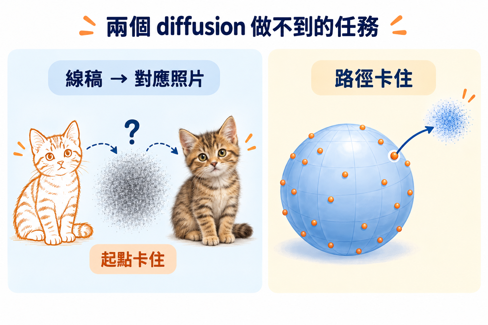

import Objectives from '../../../components/Objectives.astro';
import Prereq from '../../../components/Prereq.astro';
import Ask from '../../../components/Ask.astro';
import Remark from '../../../components/Remark.astro';
import Question from '../../../components/Question.astro';
import Answer from '../../../components/Answer.astro';
import QuizBlock from '../../../components/QuizBlock.astro';
import Option from '../../../components/Option.astro';
import Explanation from '../../../components/Explanation.astro';
import VizPlan from '../../../components/VizPlan.astro';
import Bridge from '../../../components/Bridge.astro';
import Ref from '../../../components/Ref.astro';

# Forward Process 是必要的嗎？

<Objectives>
- **說出 DDPM 的 forward process 同時固定了什麼。** 分清起點、路徑與配對，並指出草圖轉照片、球面資料各卡在哪裡。
- **說出 flow matching 為什麼要改問「想走哪條路」。** 它不是否定 DDPM，而是把原本綁在 Gaussian 加噪裡的選擇拆開。
- **完成 DDPM 與 flow matching 的符號切換。** FM 的 $x_0$ 是起點、$x_1$ 是資料，而且 $(\alpha_t,\sigma_t)$ 不必滿足 $\alpha_t^2+\sigma_t^2=1$。
</Objectives>

<Prereq items={frontmatter.prereqs} />

## DDPM 解得漂亮，也綁得很緊

<Ref week="dma-week-diffusion"/> 走的是 DDPM 的路：選一個逐步加入 Gaussian noise 的 forward process，就一路換到可算的 $q(x_t\mid x_0)$、denoising 回歸、score，以及 reverse SDE／PF-ODE。這條路之所以成功，正是因為 Gaussian 結構讓每一步都能算。

漂亮的地方在於每一環都扣著上一環。但這也意味著：**它們是一起來的。** Tweedie 的證明用到 $q(x_t\mid x_0)$ 是 Gaussian；reverse SDE 的存在用到 forward 是一條 SDE。我們沒有分別挑過這些東西——我們只挑了「加 Gaussian noise」這一個動作，其餘全部跟著被決定了。

換句話說，選擇 Gaussian forward process 的同時，我們也連帶決定了起點、路徑與配對，不能只改其中一項而直接沿用其餘推導。

<Ask>
如果我只想改變其中一項設計， 
剩下的還能不能用？
</Ask>

<Question id="Q1">
考慮兩個生成任務：

1. **草圖 → 照片**：從草圖的分布 $p_A$ 生成照片的分布 $p_B$，兩邊都不是 Gaussian。
2. **球面上的資料**：例如蛋白質的骨架角度，資料本來就住在一個球面上；Gaussian noise 會把點推離球面。

**用 <Ref week="dma-week-diffusion"/> 的框架做這兩件事，會卡在哪裡？**

<Answer>
最直覺的回答是「起點必須是 Gaussian」。這對，但那只是最外層。往下追，可以整理出**三項被同時固定的設計**（這一節還是用 <Ref week="dma-week-diffusion"/> 的慣例：$x_0$ 是資料、$x_T$ 是噪聲。換慣例在本篇最後一節）：

**第一項：起點分布。** forward SDE 有一個平穩分布 $\mathcal N(0,I)$，我們才有地方出發往回走。任務 1 的起點 $p_A$（草圖）不是任何簡單 SDE 的平穩分布，所以連「從哪裡開始」都定不出來。

**第二項：路徑。** $x_0$ 到 $x_T$ 之間的中間分布完全由 $\bar\alpha_t$ 決定，形狀永遠是「縮小的資料 ＋ Gaussian 模糊」。任務 2 想讓中間分布**留在球面上**，這個形狀做不到。

**第三項：配對方式。** 訓練時 $x_0$ 與 $\epsilon$ 是各自獨立抽的。在 <Ref week="dma-week-diffusion"/> 裡這看起來理所當然——噪聲本來就是隨便抽的——但它其實是一個**選擇**，而且這個選擇直接決定了模型要學的東西有多難。

理由 <Ref to="dma-denoising-regression"/> 已經算過了：模型學到的是 $\mathbb E[x_0\mid x_t]$，也就是「**所有可能造出這個 $x_t$ 的 $x_0$**」的加權平均。獨立配對意味著任何 $x_0$ 都可能配上任何噪聲，所以每一個 $x_t$ 背後的候選都很多——那張「$t$ 大的時候輸出是一團模糊」的圖就是這件事的畫面。如果配對可以挑，每個 $x_t$ 的候選就會變少，要學的那個平均也就更銳利。**但本課這套 DDPM 建構沒有把配對留成可獨立選擇的項目。**

Diffusion 把這三件事綑在「加 Gaussian noise」這一個動作裡。

> **flow matching 的動機就是把它們拆開，一個一個拿回設計權。**
</Answer>
</Question>

*圖：固定 Gaussian 起點會卡住成對轉換；Gaussian 加噪路徑也可能把資料推出原本的幾何空間。*

<iframe loading="lazy" src="/personal_website/notes/research_areas/diffusion-models-applications/w4-0-three-knobs.html" class="demo-frame" title="三項設計：互動 demo" style="height: 940px; width: 100%; border: none;"></iframe>

**互動 demo：三項設計。** 三個下拉分別是起點分布、路徑、配對；把它們都選成最上面那一組，就是本課 DDPM 推導採用的組合。拖 $t$ 看中間分布怎麼變——特別試「環形起點」與「配對：依位置排過」。

## 換一個問法

<Ref week="dma-week-diffusion"/> 是從「學一個函數 $G$」出發，再用 forward process 造出訓練配對。這個單元我們把順序反過來：

> **先決定我們想要的中間分布長什麼樣，再問要用什麼速度場，把粒子從起點推到終點。**

這樣問有幾個直接的好處：起點可以是任意分布；中間路徑可以自己設計；而且不需要 SDE、不需要 score、不需要 Tweedie——只需要一條 ODE 和一個回歸目標。

代價當然也有。少了 Gaussian 結構，「條件好算、邊際難算」的困難會以新的樣子回來。<Ref to="dma-conditional-flow-matching"/> 會處理它，用的是 <Ref to="dma-denoising-regression"/> 那個 **conditional trick** 的 velocity 版本。

## 這個單元換一套慣例

從這個單元起改用 flow matching 的慣例。這不是為了折磨人——文獻現在兩套慣例都在用，兩邊都得讀得懂。

| 概念 | <Ref week="dma-week-diffusion"/>（DDPM） | <Ref week="dma-week-flow-matching"/> 起（FM） |
|---|---|---|
| 資料 | $x_0$ | $x_1$ |
| 噪聲／起點 | $x_T$ | $x_0$ |
| 時間方向 | $t:0\to T$，往噪聲走 | $t:0\to1$，往資料走 |
| 中間點 | $x_t=\sqrt{\bar\alpha_t}x_0+\sigma_t\epsilon$ | $x_t=\alpha_t x_1+\sigma_t x_0$ |
| 邊界 | $\bar\alpha_0=1,\ \bar\alpha_T\approx0$ | $\alpha_0=0,\alpha_1=1$；$\sigma_0=1,\sigma_1=0$ |
| 網路學的 | $\epsilon_\theta\approx\mathbb E[\epsilon\mid x_t]$ | $u_\theta\approx$ 速度場 |
| 取樣 | 從 $x_T$ 倒著走 | 從 $x_0$ 順著解 ODE |

兩件最容易出錯的事：

- **FM 的 $x_0$ 是噪聲。** 讀 <Ref week="dma-week-diffusion"/> 的式子時要在腦中對調，不然每個式子都會反過來。
- **FM 的 $(\alpha_t,\sigma_t)$ 不必滿足 $\alpha_t^2+\sigma_t^2=1$。** DDPM 的 VP 路徑滿足這個關係，但 FM 最常用的 $\alpha_t=t,\ \sigma_t=1-t$ 就不滿足——這正是路徑可以被獨立選擇之後的具體差異。

<Remark summary="文獻如何處理這些可獨立選擇的設計？">
把起點、路徑、加噪強度都當成設計變數的那條線，文獻上叫 **stochastic interpolants** [2]；把資料換到球面、流形上的版本叫 **Riemannian flow matching** [3]。這個單元先只讓「路徑」與「配對」可以自由選擇，把最乾淨的情況做完；<Ref week="dma-week-interpolants"/> 會把整族都攤開來。
</Remark>

## 消化一下

<QuizBlock id="w4-0-a">
下列哪一項**不是** diffusion forward process 綁在一起的東西？
<Option>起點分布必須是 Gaussian。</Option>
<Option>中間分布的形狀由 $\bar\alpha_t$ 決定。</Option>
<Option correct>網路必須是 U-Net。</Option>
<Option>訓練時噪聲與資料獨立配對。</Option>
<Explanation>
網路架構跟框架無關，換成 transformer 一樣能訓。另外三項都是「加 Gaussian noise」這個動作的直接後果。
</Explanation>
</QuizBlock>

<QuizBlock id="w4-0-b">
在 FM 的慣例下 $x_t=\alpha_t x_1+\sigma_t x_0$，那 $t=0.9$ 的 $x_t$：
<Option>接近噪聲。</Option>
<Option correct>接近資料。</Option>
<Option>無法判斷。</Option>
<Explanation>
FM 的 $t$ 往資料走，$\alpha_1=1$、$\sigma_1=0$。這與 DDPM 相反，是這個單元最常出錯的地方。
</Explanation>
</QuizBlock>

<QuizBlock id="w4-0-c">
「配對方式」為什麼是一項獨立的設計選擇，而不是隨便一個實作細節？
<Option>因為它會改變起點與終點的分布。</Option>
<Option correct>因為兩端的分布不變，但配對決定了每個樣本走哪條路——也就決定了路徑彎不彎、少步取樣好不好。</Option>
<Option>因為它會讓 loss 不再是 $L_2$。</Option>
<Explanation>
換配對不會動到兩端的分布（<Ref to="dma-what-are-we-learning"/> 的 demo 就是這件事），變的是中間。而中間彎不彎，直接決定了離散化的誤差。
</Explanation>
</QuizBlock>

<Bridge to="dma-flows-and-continuity">
新的問題已經出現了：如果不再沿用 DDPM 的 forward process，我們要怎麼保證自己設計的路真的把 $p_0$ 搬成 $p_1$？下一篇先從最基本的物件開始——一個局部速度場，如何推動一整個分布。
</Bridge>

## 參考文獻

1. Lipman, Y., Chen, R. T. Q., Ben-Hamu, H., Nickel, M., Le, M. [*Flow Matching for Generative Modeling.*](https://arxiv.org/abs/2210.02747) ICLR 2023. （這個單元的主線。）
2. Albergo, M. S., Boffi, N. M., Vanden-Eijnden, E. [*Stochastic Interpolants: A Unifying Framework for Flows and Diffusions.*](https://arxiv.org/abs/2303.08797) 2023. （把這三項設計分開處理的框架。）
3. Chen, R. T. Q., Lipman, Y. [*Flow Matching on General Geometries.*](https://arxiv.org/abs/2302.03660) ICLR 2024. （球面／流形上的版本，對應 Q1 的任務 2。）
