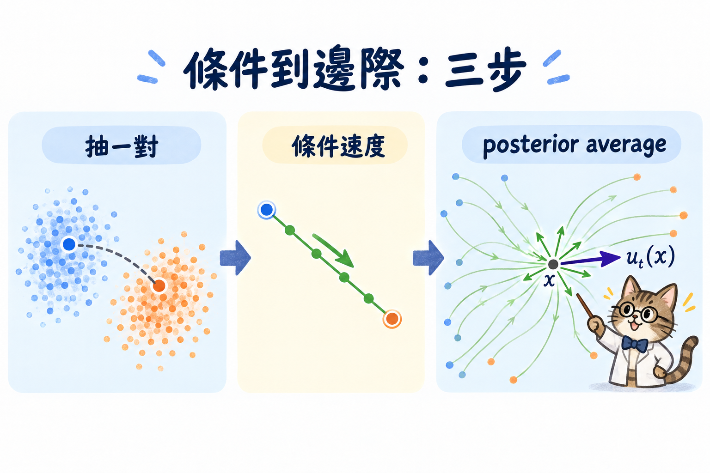

import Objectives from '../../../components/Objectives.astro';
import Prereq from '../../../components/Prereq.astro';
import Ask from '../../../components/Ask.astro';
import Remark from '../../../components/Remark.astro';
import Details from '../../../components/Details.astro';
import Question from '../../../components/Question.astro';
import Answer from '../../../components/Answer.astro';
import QuizBlock from '../../../components/QuizBlock.astro';
import Option from '../../../components/Option.astro';
import Explanation from '../../../components/Explanation.astro';
import VizPlan from '../../../components/VizPlan.astro';
import Bridge from '../../../components/Bridge.astro';
import Ref from '../../../components/Ref.astro';

# 先配對，再平均：Conditional Flow Matching

<Objectives>
- **說出邊際速度場 $u_t$ 為什麼不能直接算。** 我們只有資料樣本，沒有完整的 $p_t$。
- **寫出一組端點的條件路徑與條件速度。** 並解釋 MSE 如何自動取後驗平均。
- **說出 CFM 為什麼可以取代 FM。** 兩者只差與參數無關的常數，因此梯度與最佳解相同。
</Objectives>

<Prereq items={frontmatter.prereqs} />

## 知道要學什麼，卻拿不到答案

上一篇的結論是：要學的東西是**速度場**。那 loss 幾乎是自動的——就是一個回歸：

$$
\mathcal L_{\text{FM}}(\theta)=\mathbb E_{t,\;x\sim p_t}\big[\|u_\theta(x,t)-u_t(x)\|^2\big].
$$

意思是：抽一個時刻 $t$、抽一個那個時刻會出現的位置 $x$，然後要求網路在那裡輸出的速度，跟正確答案一樣。

麻煩就出現在 $u_t(x)$ 這一項——那是「在位置 $x$、時刻 $t$ 的正確速度」，下面會把它精確定義出來。它不是我們手上有的東西：要知道 $x$ 這個位置的正確速度，得先知道整條分布路徑 $p_t$ 長什麼樣，而 $p_t$ 又要有整個 $p_{\text{data}}$ 才定得下來。我們有的只是**五萬個資料點**。

> **要學的目標本身，是一個我們算不出來的量。**

這個處境見過了。<Ref to="dma-denoising-regression"/> 想要的 $q(x_{t-1}\mid x_t)$、<Ref to="dma-tweedie-and-score"/> 想要的 $\nabla\log p_t$，都是同樣寫不出來的邊際量，最後都是靠「條件的量很好算」繞過去的。

<Ask>
一個算不出來的東西，<br />
還能拿它當回歸目標嗎？
</Ask>

## 把一個整體問題切成一堆小任務

<Ref to="dma-what-are-we-learning"/> 的倉庫搬貨可以直接搬過來用。整批貨要「搬得像 B 倉庫的擺法」很難評估，可是一旦**每一箱的搬運路線都先寫好**，每一箱該往哪走就只是查表。

Flow matching 就是照這個順序做的，分三步。

**步驟 1：先抽一組配對。** 抽一個起點 $x_0\sim p_0=\mathcal N(0,I)$、抽一個資料點 $x_1\sim p_{\text{data}}$，把這一對記成 $z=(x_0,x_1)$。兩邊**各自獨立抽**——這是一個選擇，不是必然，<Ref week="dma-week-interpolants"/> 會把它鬆開。

**步驟 2：給定這組配對，把路線寫死。** 例如

$$
x_t=\alpha_t x_1+\sigma_t x_0,\qquad \alpha_0=0,\ \alpha_1=1,\ \sigma_0=1,\ \sigma_1=0 .
$$

邊界條件保證 $t=0$ 時人在 $x_0$、$t=1$ 時人在 $x_1$。給定 $z$，這是一條完全確定的曲線，速度直接微分就有：

$$
u_t(x\mid z)=\dot\alpha_t x_1+\dot\sigma_t x_0 .
$$

這是**條件速度場**。它好算到不需要網路——兩個純量乘兩個向量，加起來就是答案。

<Remark label="符號" summary="alpha 與 sigma 要滿足什麼，不用滿足什麼">
$\alpha_t$ 與 $\sigma_t$ 是我們自己挑的兩條純量函數，唯一的硬性要求是那四個邊界值（$t=0$ 全是噪聲、$t=1$ 全是資料）與可微。

**不需要** $\alpha_t^2+\sigma_t^2=1$。那是 DDPM 的 VP 路徑才有的關係；最常用的 $\alpha_t=t,\ \sigma_t=1-t$ 就不滿足它。
</Remark>

**步驟 3：把配對平均掉。** 一組配對只描述一箱貨；我們要的是整批貨的行為。對 $z$ 積分：

$$
p_t(x)=\int p_t(x\mid z)\,p(z)\,dz,\qquad
u_t(x):=\int u_t(x\mid z)\,\frac{p_t(x\mid z)\,p(z)}{p_t(x)}\,dz
=\mathbb E\big[u_t(x_t\mid z)\ \big|\ x_t=x\big].
$$

用白話說：站在 $x$ 這個位置往外看，會有很多組配對的路線都經過這裡；把它們**在這裡**的速度，按「有多可能是它」加權平均起來，就是邊際速度。權重 $p_t(x\mid z)p(z)/p_t(x)$ 就是後驗 $p(z\mid x_t=x)$，所以離 $x$ 很遠的那些路線權重接近零，不會來干擾。

<Remark label="補充" summary="給定配對的位置是完全確定的，那密度是什麼意思">
取 $z=(x_0,x_1)$ 時，$x_t$ 完全被 $z$ 決定，所以 $p_t(\cdot\mid z)$ 嚴格說是一個 delta。想要一個真正的密度，可以改成只條件在資料點上、取 $z=x_1$：這時

$$
p_t(x\mid x_1)=\mathcal N\big(\alpha_t x_1,\ \sigma_t^2 I\big),\qquad
u_t(x\mid x_1)=\dot\alpha_t x_1+\frac{\dot\sigma_t}{\sigma_t}\big(x-\alpha_t x_1\big).
$$

兩種寫法給出**同一個** $u_t$——由 tower property，先對 $x_0$ 平均再對 $x_1$ 平均，跟一次對 $(x_0,x_1)$ 平均是一樣的。下面的 demo 為了讓權重看得見，把 delta 給了一點寬度。
</Remark>

<Question id="Q1">
既然邊際速度就是一個加權平均，那最直接的做法應該是**先把這個平均估出來**：對每一個 $(x,t)$ 抽很多組配對、算它們的權重、加權平均，拿這個估計值當回歸目標。

**這樣做會遇到什麼？**

<Answer>
先看它到底要算什麼。權重是 $w_i\propto p_t(x\mid z_i)$，這是一個 self-normalized importance sampling：抽 $M$ 組配對，估計值是 $\hat u=\sum_i w_i\,u_t(x\mid z_i)$。

問題在於**有效樣本數**。$w_i$ 由 $\|x-(\alpha_t x_{1,i}+\sigma_t x_{0,i})\|^2$ 決定，而在 $d$ 維裡這個距離的變動是隨 $d$ 累加的，所以權重會集中在極少數幾組配對上——有效樣本數 $1/\sum_i w_i^2$ 迅速掉到個位數，甚至掉到 1。下面的 demo 在 2D 就已經看得到這件事：一個位置真正「有權重」的只有十幾條。要在 $d=3072$ 得到一個堪用的估計，$M$ 得大到不可能。

**這個平均我們根本不需要自己算。**

回頭想想 <Ref to="dma-denoising-regression"/> 的結論——$L_2$ 回歸的最佳解就是條件期望。如果我們把 loss 寫成「拿**條件速度**當目標」：

$$
\mathcal L_{\text{CFM}}(\theta)=\mathbb E_{t,\;z,\;x\sim p_t(\cdot\mid z)}\big[\|u_\theta(x,t)-u_t(x\mid z)\|^2\big],
$$

那它的最小值就是 $\mathbb E[u_t(x_t\mid z)\mid x_t=x]$，而這**正好**是我們要的 $u_t(x)$。目標每一次都只用一組配對算，噪聲很大，但那個噪聲的平均值是對的——回歸會把它平掉。

所以整件事的順序是：不要估平均，**把平均交給 loss**。
</Answer>
</Question>

<iframe loading="lazy" src="/personal_website/notes/research_areas/diffusion-models-applications/w4-2-conditional-average.html" class="demo-frame" title="條件速度疊成邊際速度：互動 demo" style="height: 920px; width: 100%; border: none;"></iframe>

**互動 demo：條件速度疊成邊際速度。** 拖著 $x$ 在圖上走，看有哪幾條配對路線會經過它、它們各自的速度指向哪裡。細箭頭是條件速度（每一條都好算），粗箭頭是加權平均後的邊際速度——注意兩者的**長度比例**，以及「有效參與的條數」這個數字。demo 用的是最簡單的直線路徑 $\alpha_t=t,\ \sigma_t=1-t$，也就是下一篇的主角。

## 為什麼可以拿條件目標代替？

上面那段話裡藏了兩個需要驗證的環節：$u_t$ 真的推得動 $p_t$ 嗎？以及 $\mathcal L_{\text{CFM}}$ 真的能學到 $u_t$ 嗎？

**定理 1（$u_t$ 是對的目標）。** 若每個 $u_t(\cdot\mid z)$ 生成 $p_t(\cdot\mid z)$，則步驟 3 定義的 $u_t$ 生成 $p_t$。

**定理 2（CFM 能學到它）。** $\nabla_\theta\mathcal L_{\text{FM}}=\nabla_\theta\mathcal L_{\text{CFM}}$。

第二個比「最小值相同」更強：梯度處處相同，意思是**連訓練過程中每一步走的方向都一樣**。我們不是在解一個近似問題，而是在跑同一條 gradient descent，只是每一步的目標換成了算得出來的版本。

<Details summary="定理 1 的證明：continuity equation 是線性的">
對每一個 $z$，條件路徑滿足

$$
\partial_t p_t(x\mid z)=-\nabla\cdot\big(p_t(x\mid z)\,u_t(x\mid z)\big).
$$

兩邊乘 $p(z)$ 再對 $z$ 積分。左邊直接得到 $\partial_t p_t(x)$。右邊把散度移到積分外（$\nabla$ 只對 $x$ 作用）：

$$
-\nabla\cdot\int p_t(x\mid z)\,u_t(x\mid z)\,p(z)\,dz=-\nabla\cdot\big(p_t(x)\,u_t(x)\big),
$$

最後一步用的就是 $u_t$ 的定義——它是被定義成「讓這個積分等於 $p_t u_t$」的那個東西。$\square$

關鍵在於 continuity equation 對 $p$ 是**線性**的，所以「每一箱貨各自守恆」加起來就是「整批貨守恆」。

這個證明需要 $p_t(\cdot\mid z)$ 真的是一個密度，所以它走的是上面 `<Remark>` 裡 $z=x_1$ 的那個版本。訓練時用的 $z=(x_0,x_1)$ 版本是它的推論——由 tower property，先對 $x_0$ 平均再對 $x_1$ 平均，跟一次對 $(x_0,x_1)$ 平均得到同一個 $u_t$。
</Details>

<Details summary="定理 2 的證明：展開平方，只有交叉項要處理">
把兩個 loss 都展開成三項。$\|u_\theta\|^2$ 那一項在兩邊完全相同，因為 $\mathcal L_{\text{CFM}}$ 裡 $x$ 的邊際分布正是 $p_t$。不含 $\theta$ 的那一項對梯度沒有貢獻。剩下交叉項：

$$
\mathbb E_{x\sim p_t}\big[u_\theta(x)^\top u_t(x)\big]
=\mathbb E_{x\sim p_t}\Big[u_\theta(x)^\top\,\mathbb E\big[u_t(x_t\mid z)\mid x_t=x\big]\Big]
=\mathbb E_{z,\;x\sim p_t(\cdot\mid z)}\big[u_\theta(x)^\top u_t(x\mid z)\big].
$$

第一個等號是 $u_t$ 的定義，第二個是 tower property。三項逐項相等（或差一個常數），所以梯度相同。$\square$

那個常數也寫得出來：$\mathcal L_{\text{CFM}}-\mathcal L_{\text{FM}}=\mathbb E_{x\sim p_t}\operatorname{tr}\operatorname{Var}\big[u_t(x_t\mid z)\mid x_t=x\big]$，也就是**條件速度繞著邊際速度的變異數**。它不含 $\theta$，所以不影響最小值點；但它讓 $\mathcal L_{\text{CFM}}$ 不會收到 0——和 <Ref to="dma-tweedie-and-score"/> 那個「loss 停在 $\mathbb E[\operatorname{tr}\operatorname{Var}(\epsilon\mid x_t)]$」是同一件事。
</Details>

## 這是 conditional trick 的速度版本

<Ref to="dma-denoising-regression"/> 把這個模式命名成 **conditional trick**，而且證明過它的 KL 版本：把 $x_0$ 放進條件裡，objective 只差一個與參數無關的常數，最佳解仍然是那個算不出來的邊際。這一篇做的是同一件事，只是主角從分布換成了速度場。

三次放在一起看：

| | <Ref to="dma-denoising-regression"/>（KL） | <Ref to="dma-tweedie-and-score"/>（MSE） | 這一篇（velocity） |
|---|---|---|---|
| 想要的邊際量 | $q(x_{t-1}\mid x_t)$ | $\nabla\log p_t(x)$ | $u_t(x)$ |
| 好算的條件量 | $q(x_{t-1}\mid x_t,x_0)$ | $\epsilon$（給定 $(x_0,x_t)$ 就知道） | $u_t(x\mid z)$（給定配對就知道） |
| 放進條件裡的 | $x_0$ | $x_0$ | 配對 $z$ |
| 誰去取平均 | KL 的交叉熵項 | $L_2$ 回歸 | $L_2$ 回歸 |
| 差的那個常數 | 與 $\theta$ 無關 | $\mathbb E[\operatorname{tr}\operatorname{Var}(\epsilon\mid x_t)]$ | $\mathbb E[\operatorname{tr}\operatorname{Var}(u_t(x_t\mid z)\mid x_t)]$ |

（表裡前兩欄用的是 <Ref week="dma-week-diffusion"/> 的慣例——那裡的 $x_0$ 是**資料**；最右欄是本單元的慣例，配對寫成 $z=(x_0,x_1)$，$x_0$ 是**噪聲**。）

> **難算的邊際量 ＋ 好算的條件量 ＋ 一個算得出來的 loss：平均那一步交給 loss 自己做。**

書上（<Ref to="dma-denoising-regression"/> 的參考文獻 [2]）把這三個版本並排稱為 diffusion models 的 *conditional tricks*——**它們不是三個各自獨立的技巧，是同一個策略在三種 objective 上的樣子。** <Ref week="dma-week-interpolants"/> 還會再用一次。

## 訓練只換掉目標那一行

```
repeat
  x1 ← 一個 batch 的資料
  x0 ← N(0, I)
  t  ← Uniform[0, 1]
  xt ← α_t · x1 + σ_t · x0
  loss ← ‖u_θ(xt, t) − (α̇_t · x1 + σ̇_t · x0)‖²
  梯度下降
```

和 <Ref to="dma-denoising-regression"/> 的五行只差目標那一行。**沒有 SDE、沒有 score、沒有 Tweedie，也沒有任何積分要估。**

## 正確，不代表好走

$x_0$ 與 $x_1$ 獨立抽樣時，配對會互相交錯。這不影響正確性：上面的兩個定理只需要端點與條件期望，所以終點仍然是 $p_{\text{data}}$。

代價出在取樣。網路在同一位置只能給一個速度；許多方向在這裡相遇時，它只能輸出平均。demo 裡的粗箭頭因此變短，也不再對齊任何一條條件路線。最後的 ODE 軌跡會彎，步數一少，離散化誤差就出現。

於是問題往前推了一步：**配對既然是我們選的，能不能選得不那麼交錯？** 在回答之前，先把最簡單的直線路徑代進去，看看「條件直線」為什麼仍會長出彎曲的邊際軌跡。



*圖：先抽一組端點並寫出條件速度；再把所有穿過同一位置的相容速度做 posterior average，得到邊際速度。*

## 消化一下

<QuizBlock id="w4-2-a">
邊際速度 $u_t(x)$ 是：
<Option>所有條件速度 $u_t(x\mid z)$ 對 $p(z)$ 的平均。</Option>
<Option correct>所有條件速度對後驗 $p(z\mid x_t=x)$ 的平均——只有「會經過 $x$」的配對才有權重。</Option>
<Option>$p_t$ 的 score。</Option>
<Explanation>
權重是 $p_t(x\mid z)p(z)/p_t(x)$，也就是後驗。對 $p(z)$ 平均是錯的：離 $x$ 很遠的那些路線不該影響 $x$ 這個位置的速度。
</Explanation>
</QuizBlock>

<QuizBlock id="w4-2-b">
定理 2 說 $\nabla_\theta\mathcal L_{\text{FM}}=\nabla_\theta\mathcal L_{\text{CFM}}$。那兩個 loss 的**數值**呢？
<Option>也相同。</Option>
<Option correct>不同：$\mathcal L_{\text{CFM}}$ 大一個常數，就是條件速度繞著邊際速度的變異數。</Option>
<Option>不一定，取決於 $\alpha_t$ 與 $\sigma_t$ 的選擇。</Option>
<Explanation>
展開的三項裡有一項不含 $\theta$，兩邊不一樣但對梯度沒有貢獻。這也解釋了訓練 log 裡的 loss 為什麼停在一個大於零的數字上——跟 <Ref to="dma-lab-diffusion"/> 看到的現象是同一回事。
</Explanation>
</QuizBlock>

<QuizBlock id="w4-2-c">
下列哪一個改動會讓這個框架失效？
<Option>$x_0$ 與 $x_1$ 不獨立抽樣。</Option>
<Option>$p_0$ 不是 Gaussian。</Option>
<Option correct>條件路徑在 $t=1$ 時沒有落在 $x_1$ 上。</Option>
<Explanation>
「獨立抽樣」與「$p_0$ 是 Gaussian」兩個定理都沒有用到，所以換掉它們框架還在（<Ref week="dma-week-interpolants"/> 就是在換這些）。端點不落在 $x_1$ 則會讓 $p_1\neq p_{\text{data}}$，生成出來的東西根本不是資料——端點條件是唯一不能動的那一項。
</Explanation>
</QuizBlock>

<Bridge to="dma-linear-path">
算不出的邊際速度已經能訓練了。現在最自然的嘗試，是把每組端點直接連成直線；但「每條條件路徑都直」真的代表取樣軌跡也直嗎？下一篇用兩條相交的線就能看出答案。
</Bridge>

## 參考文獻

1. Lipman, Y., Chen, R. T. Q., Ben-Hamu, H., Nickel, M., Le, M. [*Flow Matching for Generative Modeling.*](https://arxiv.org/abs/2210.02747) ICLR 2023. （這一篇的主線：條件路徑、CFM loss 與兩個定理。）
2. Albergo, M. S., Vanden-Eijnden, E. [*Building Normalizing Flows with Stochastic Interpolants.*](https://arxiv.org/abs/2209.15571) ICLR 2023. （同一個框架的另一條發展線，把 $(\alpha_t,\sigma_t)$ 當成設計變數。）
3. Tong, A., Fatras, K., Malkin, N., Huguet, G., Zhang, Y., Rector-Brooks, J., Wolf, G., Bengio, Y. [*Improving and Generalizing Flow-Based Generative Models with Minibatch Optimal Transport.*](https://arxiv.org/abs/2302.00482) TMLR 2024. （Q2 提到的「換一組配對」。）
