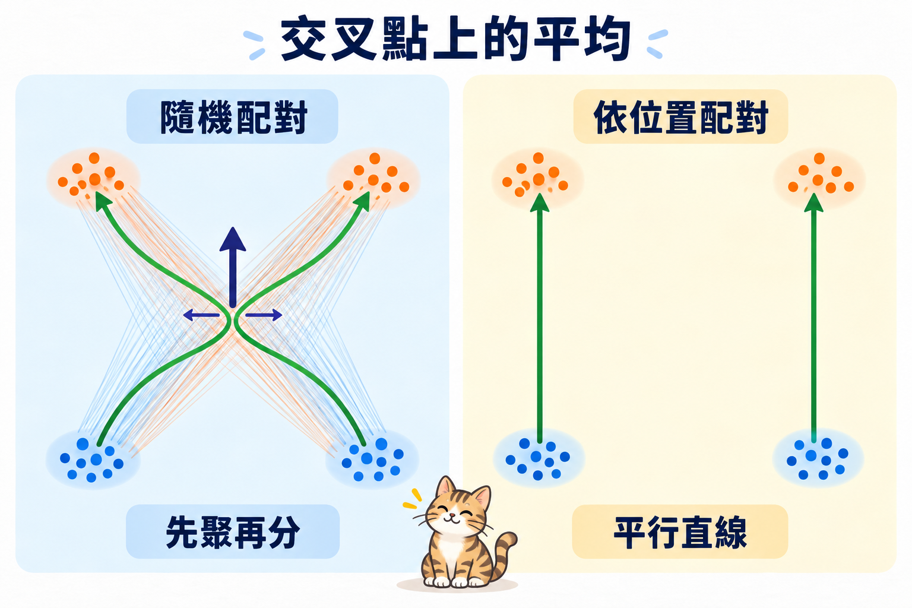

import Objectives from '../../../components/Objectives.astro';
import Prereq from '../../../components/Prereq.astro';
import Ask from '../../../components/Ask.astro';
import Remark from '../../../components/Remark.astro';
import Question from '../../../components/Question.astro';
import Answer from '../../../components/Answer.astro';
import QuizBlock from '../../../components/QuizBlock.astro';
import Option from '../../../components/Option.astro';
import Explanation from '../../../components/Explanation.astro';
import VizPlan from '../../../components/VizPlan.astro';
import Bridge from '../../../components/Bridge.astro';
import Ref from '../../../components/Ref.astro';

# 代入最簡單的一條路：直線插值

<Objectives>
- **寫出直線插值的條件速度與訓練目標。** $x_t=t x_1+(1-t)x_0$，所以目標只是 $x_1-x_0$。
- **用兩組相交配對算出邊際速度。** 說明條件路徑雖直，平均後的 ODE 軌跡仍可能彎。
- **把 velocity MSE 換成 noise MSE。** 看出均勻時間的線性 FM 隱含 $1/t^2$ 權重，和 DDPM 的 $\mathcal L_{\text{simple}}$ 不同。
</Objectives>

<Prereq items={frontmatter.prereqs} />

## 最沒有花招的選法

<Ref to="dma-conditional-flow-matching"/> 的框架可以代任何一對 $(\alpha_t,\sigma_t)$ 進去。最沒有花招的選法是兩點之間走直線：$\alpha_t=t$、$\sigma_t=1-t$。

$$
x_t=t\,x_1+(1-t)\,x_0,\qquad u_t(x\mid x_0,x_1)=x_1-x_0 .
$$

條件速度是一個**常數**——不隨 $t$ 變、也不隨位置變。所以網路的工作被講成了一句很短的話：**看到 $x_t$ 和 $t$，猜出「終點減起點」。**

程式碼上，這只是把 <Ref to="dma-conditional-flow-matching"/> 那五行的目標換掉一行：`target = x1 - x0`。

<Remark label="補充" summary="這條路在文獻裡有三個名字">
同一條線性路徑在三篇論文裡各有講法：rectified flow [1] 從「把軌跡拉直」出發、stochastic interpolants [2] 從「把 $(\alpha_t,\sigma_t)$ 當設計變數」出發、Lipman et al. [3] 稱它為 OT path（在獨立配對下）。

> **它們寫下來的訓練目標是同一個。**

差別在動機與後續怎麼發展，不在這一行式子。
</Remark>

<Ask>
條件路徑每一條都是直線。 
那訓好之後，粒子會走直線嗎？
</Ask>

<Question id="Q1">
有一個聽起來很順的推理：

> 每一條條件路徑都是直的，而邊際速度是這些條件速度的**平均**。一堆直線方向平均起來還是一個方向，所以邊際軌跡當然也是直的。

**這個推理錯在哪？**

<Answer>
錯在「平均起來的那個方向」**不必是其中任何一條在走的方向**。

回到邊際速度的定義：$u_t(x)=\mathbb E[x_1-x_0\mid x_t=x]$。在位置 $x$、時刻 $t$，會有很多組配對的直線正好經過這裡，而它們的方向各不相同——邊際速度是這些方向的平均，不是其中任何一條。

**用兩組配對就能算出來。** 令 $x_0\in\lbrace(-1,-1),(1,-1)\rbrace$、$x_1\in\lbrace(1,1),(-1,1)\rbrace$，配對方式是 $(-1,-1)\to(1,1)$ 與 $(1,-1)\to(-1,1)$，各佔一半。兩條直線都在 $t=\tfrac12$ 經過原點，而它們的條件速度分別是 $(2,2)$ 與 $(-2,2)$。所以

$$
u_{1/2}\big((0,0)\big)=\tfrac12(2,2)+\tfrac12(-2,2)=(0,2).
$$

正上方。這個方向**任何一條條件直線都沒有在走**——水平的分量互相抵消掉了。走到原點的粒子會被推著往上，然後才分岔到左上或右上。

再往下一層，還有一個更硬的理由：<Ref to="dma-flows-and-continuity"/> 說 ODE 的軌跡不能交叉。條件直線會交叉（獨立配對之下幾乎一定會），所以邊際 ODE 的軌跡**不可能**就是那些直線——它只能是一組彼此不交叉的曲線，在分布層面給出同一個 $p_t$。

理解它為什麼不會，是 <Ref week="dma-week-interpolants"/> 整個單元的起點。一句話串起來：**「彎」來自「交叉」，「交叉」來自「隨機配對」。** 這三個詞在 <Ref week="dma-week-interpolants"/> 分別長成 <Ref to="dma-error-theory"/>、<Ref to="dma-rectified-flow"/> 與 <Ref to="dma-minibatch-ot"/>。
</Answer>
</Question>

<iframe loading="lazy" src="/personal_website/notes/research_areas/diffusion-models-applications/w4-3-crossing.html" class="demo-frame" title="交叉、彎曲，與要走幾步：互動 demo" style="height: 940px; width: 100%; border: none;"></iframe>

**互動 demo：交叉、彎曲，與要走幾步。** 起點與資料各是兩團，配對方式是唯一的變數。「隨機配對」下條件直線交出一個 X，邊際軌跡被迫繞開，實測彎曲度約 **1.59**；按「依位置配對」，兩邊各走各的，彎曲度掉到 **1.00**。再切 Euler 步數看終點誤差：隨機配對 4 步差 **1.49**、20 步 **0.26**、200 步才 **0.01**；依位置配對 4 步就只差 **0.03**。兩種配對的 $p_0$ 與 $p_1$ 一模一樣。（這裡的彎曲度是在**四團**的 toy 上量的；<Ref to="dma-fm-vs-diffusion"/> 比較線性與 VP 時用的是**雙月**，兩組數字不要直接對比。）

## 直不直，決定要走幾步

取樣就是解那條 ODE，而我們只能用有限步。最簡單的 Euler 是

$$
x_{t+h}=x_t+h\,u_\theta(x_t,t),
$$

也就是**假設這一段時間內速度不變**——等於拿一條割線去代替真正的軌跡。軌跡本來就是直線時，一步到終點、誤差為零；軌跡越彎，割線和曲線差得越多。

所以「軌跡有多直」不是美學問題，它直接決定**取樣需要幾步**。<Ref to="dma-reverse-process"/> 裡 DDIM 步數少的時候會掉品質，原因也是同一個。demo 裡那組數字就是這件事的量化版本：同樣的兩個分布，只換配對，4 步的誤差差了將近五十倍。

## 換到 $\epsilon$ 座標看，其實不是同一個 loss

把 $x_0$ 改叫 $\epsilon$（在 FM 慣例裡起點就是噪聲），$x_t=t\,x_1+(1-t)\epsilon$。給定 $x_t$ 與 $\epsilon$ 就能反解出 $x_1=(x_t-(1-t)\epsilon)/t$，代回去：

$$
u_t=x_1-\epsilon=\frac{x_t}{t}-\frac{\epsilon}{t}.
$$

網路那一邊也照同一個關係讀：把 $u_\theta$ 寫成 $u_\theta=\dfrac{x_t-\epsilon_\theta}{t}$（這就是「把速度網路當成噪聲網路來看」的意思）。兩式相減，$x_t/t$ 消掉：

$$
\|u_\theta-u_t\|^2=\frac{1}{t^2}\,\|\epsilon_\theta-\epsilon\|^2 .
$$

第一，**學速度和學噪聲仍然是同一件事**，兩者只差一個 affine transformation——這延續 <Ref to="dma-denoising-regression"/> 對三種 parametrization 的討論。（那裡把「預測資料」叫 $x_0$-prediction，因為 diffusion 的慣例裡 $x_0$ 是資料；在本單元的慣例下同一件事要叫 $x_1$-prediction。**這是最容易讀錯的一個術語。**）

第二，注意那個 $1/t^2$。均勻抽 $t$ 的 FM loss，換到 $\epsilon$ 座標之後帶著 $1/t^2$ 的權重；而 $t$ 小是噪聲端，所以**FM 其實把噪聲端看得比均勻的 $\epsilon$-loss 重很多**。

拿它跟 DDPM 比就看得很清楚。<Ref to="dma-denoising-regression"/> 最後那五行跑的是 $\mathcal L_{\text{simple}}$——**均勻**加權的 $\epsilon$-MSE，那是刻意把推導出來的 $w(t)$ 丟掉之後的版本。所以：

| | 換到 $\epsilon$ 座標之後的權重 |
| --- | --- |
| DDPM 實際在跑的 $\mathcal L_{\text{simple}}$ | 均勻（$1$） |
| 線性 FM、均勻抽 $t$ | $1/t^2$，$t$ 小的那一端被放大 |

**兩邊都是 $\epsilon$-MSE，差的就是這個權重。**

> **FM 與 DDPM 的差別不只在路徑（線性 vs VP），還在那個沒有人明說的加權。**

<Ref to="dma-denoising-regression"/> 說過 forward process 與 weighting 可以分開設計，這裡是它最乾淨的例子：兩個模型可以只差加權，訓出來的結果卻不一樣。<Ref to="dma-fm-vs-diffusion"/> 會把這兩軸攤在同一張表上。

*圖：相同端點分布下，隨機配對會在交叉處互相抵消並產生先聚再分的彎路；依位置配對則留下平行直線。*

## 消化一下

<QuizBlock id="w4-3-a">
線性 FM 用均勻的 $t$ 訓練，等價於 $\epsilon$-prediction 配上什麼加權？
<Option>均勻加權。</Option>
<Option correct>$1/t^2$，噪聲端被加重。</Option>
<Option>$t^2$，資料端被加重。</Option>
<Explanation>
由 $u_\theta-u_t=-(\epsilon_\theta-\epsilon)/t$ 直接得到。注意這是 FM 慣例的 $t$：$t$ 小的那一端是噪聲。
</Explanation>
</QuizBlock>

<QuizBlock id="w4-3-b">
在兩條條件直線的交叉點上，邊際速度是什麼？
<Option>其中一條直線的方向。</Option>
<Option correct>經過該點的所有條件直線方向的後驗加權平均。</Option>
<Option>零向量。</Option>
<Explanation>
這就是 <Ref to="dma-conditional-flow-matching"/> 對邊際速度的定義。平均出來的方向通常不屬於任何一條條件直線，這正是彎曲的來源。
</Explanation>
</QuizBlock>

<QuizBlock id="w4-3-c">
下列哪一個改動最直接減少邊際軌跡的彎曲？
<Option>把網路加大。</Option>
<Option>把條件路徑的寬度 $\sigma_{\min}$ 調小。</Option>
<Option correct>換掉 $(x_0,x_1)$ 的配對方式，讓條件直線不要交叉。</Option>
<Explanation>
彎曲的根源是交叉，交叉的根源是配對。網路大小只影響「有沒有學好目標速度場」，不會改變那個目標本身長什麼樣。
</Explanation>
</QuizBlock>

<Bridge to="dma-fm-vs-diffusion">
直線插值沒有自動帶來直軌跡，改寫成 noise prediction 後也不是 DDPM 的均勻 MSE。那兩個框架究竟在哪裡相同、又從哪裡開始分開？下一篇把路徑與回歸目標放到同一組公式裡比較。
</Bridge>

## 參考文獻

1. Liu, X., Gong, C., Liu, Q. [*Flow Straight and Fast: Learning to Generate and Transfer Data with Rectified Flow.*](https://arxiv.org/abs/2209.03003) ICLR 2023. （從「把軌跡拉直」出發的版本；<Ref to="dma-rectified-flow"/> 會細講。）
2. Albergo, M. S., Vanden-Eijnden, E. [*Building Normalizing Flows with Stochastic Interpolants.*](https://arxiv.org/abs/2209.15571) ICLR 2023. （把 $(\alpha_t,\sigma_t)$ 當成可以挑的東西。）
3. Lipman, Y., Chen, R. T. Q., Ben-Hamu, H., Nickel, M., Le, M. [*Flow Matching for Generative Modeling.*](https://arxiv.org/abs/2210.02747) ICLR 2023. （線性路徑在這篇裡叫 OT path。）
