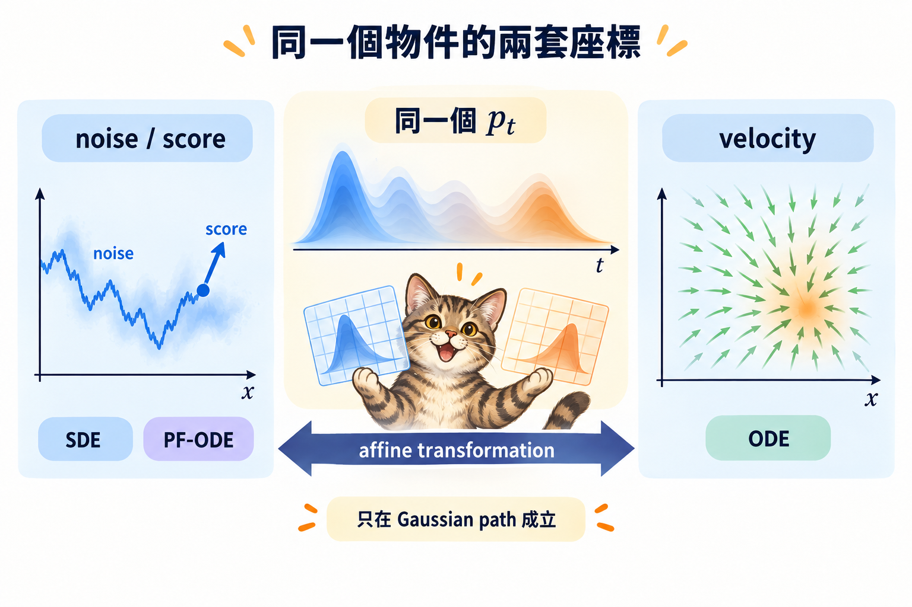

import Objectives from '../../../components/Objectives.astro';
import Prereq from '../../../components/Prereq.astro';
import Ask from '../../../components/Ask.astro';
import Remark from '../../../components/Remark.astro';
import Try from '../../../components/Try.astro';
import Details from '../../../components/Details.astro';
import Question from '../../../components/Question.astro';
import Answer from '../../../components/Answer.astro';
import QuizBlock from '../../../components/QuizBlock.astro';
import Option from '../../../components/Option.astro';
import Explanation from '../../../components/Explanation.astro';
import VizPlan from '../../../components/VizPlan.astro';
import Bridge from '../../../components/Bridge.astro';
import Ref from '../../../components/Ref.astro';

# 把 Flow Matching 和 Diffusion 放在一起看

<Objectives>
- **推導 Gaussian 路徑上 velocity 與 score 的轉換式。** 再把 VP schedule 代入，驗出 DDPM 的 PF-ODE。
- **把 DDPM 與 flow matching 的差異拆成四項。** 起點、路徑、配對與訓練加權要分開比較。
- **判斷一句「兩者等價」究竟保證了什麼。** 同一個 oracle 可以換座標，不代表換路徑後仍能沿用同一個模型。
</Objectives>

<Prereq items={frontmatter.prereqs} />

## 長得不一樣，可能只是座標不同

<Ref week="dma-week-diffusion"/> 用 SDE、score 與 Tweedie；這個單元用 ODE、速度場與回歸。可是只要兩邊採用同一條 Gaussian 路徑，中間點都是「縮小的資料加上 Gaussian noise」。研究上最自然的下一步不是再替方法取名字，而是問：**它們會不會只是在預測同一個東西？**

<Ask>
如果中間分布是同一族， 
那兩邊學的東西是不是同一個？
</Ask>

## 把兩邊的速度場寫進同一個座標

沿用 FM 慣例，起點 $x_0\sim\mathcal N(0,I)$（下面改記成 $\epsilon$，方便和 <Ref week="dma-week-diffusion"/> 對照），條件路徑 $x_t=\alpha_t x_1+\sigma_t\epsilon$。邊際速度是兩個條件期望的組合：

$$
u_t(x)=\dot\alpha_t\,\mathbb E[x_1\mid x_t=x]+\dot\sigma_t\,\mathbb E[\epsilon\mid x_t=x].
$$

這兩個條件期望不是獨立的兩個未知數——把 $x_t=\alpha_t x_1+\sigma_t\epsilon$ 兩邊取條件期望就有 $x=\alpha_t\mathbb E[x_1\mid x]+\sigma_t\mathbb E[\epsilon\mid x]$，所以**知道一個就知道另一個**。用它消去 $\mathbb E[x_1\mid x]$，再代入 <Ref to="dma-tweedie-and-score"/> 的 Tweedie 公式 $\mathbb E[\epsilon\mid x]=-\sigma_t\nabla\log p_t(x)$：

$$
\boxed{\;u_t(x)=\frac{\dot\alpha_t}{\alpha_t}\,x-\sigma_t\Big(\dot\sigma_t-\frac{\dot\alpha_t}{\alpha_t}\sigma_t\Big)\nabla\log p_t(x)\;}
$$

讀法很簡單：**速度場就是「位置」和「score」的線性組合**，而那兩個係數只跟 $t$ 有關，跟資料無關。

<Try summary="代 VP 進去：兩個係數各化簡一次，就是 PF-ODE">
用 <Ref week="dma-week-diffusion"/> 的時間 $\tau$（$\tau=0$ 是資料、$\tau=1$ 是噪聲）寫 VP：$\bar\alpha_\tau=\exp\!\big(-\!\int_0^\tau\beta\big)$，所以 $\alpha_\tau=\sqrt{\bar\alpha_\tau}$、$\sigma_\tau=\sqrt{1-\bar\alpha_\tau}$，而 $\dot{\bar\alpha}_\tau=-\beta\bar\alpha_\tau$。

**第一個係數**：$\dot\alpha_\tau=\dfrac{\dot{\bar\alpha}_\tau}{2\sqrt{\bar\alpha_\tau}}=-\dfrac{\beta}{2}\sqrt{\bar\alpha_\tau}$，所以

$$
\frac{\dot\alpha_\tau}{\alpha_\tau}=-\frac{\beta}{2}.
$$

**第二個係數**：$\dot\sigma_\tau=\dfrac{-\dot{\bar\alpha}_\tau}{2\sqrt{1-\bar\alpha_\tau}}=\dfrac{\beta\bar\alpha_\tau}{2\sigma_\tau}$，代進去：

$$
-\sigma_\tau\Big(\dot\sigma_\tau-\frac{\dot\alpha_\tau}{\alpha_\tau}\sigma_\tau\Big)
=-\sigma_\tau\Big(\frac{\beta\bar\alpha_\tau}{2\sigma_\tau}+\frac{\beta}{2}\sigma_\tau\Big)
=-\frac{\beta}{2}\big(\bar\alpha_\tau+\sigma_\tau^2\big)=-\frac{\beta}{2},
$$

最後一步用的是 VP 的定義 $\bar\alpha_\tau+\sigma_\tau^2=1$。兩個係數都是 $-\beta/2$，所以

$$
\frac{dx}{d\tau}=-\tfrac12\beta(\tau)\,x-\tfrac12\beta(\tau)\,\nabla\log p_\tau(x),
$$

**一字不差就是 <Ref to="dma-reverse-process"/> 的 probability-flow ODE**（生成時 $\tau$ 從 1 積到 0，也就是那裡的時間方向）。
</Try>

所以在「Gaussian 路徑、獨立配對」這個交集上，兩邊是**同一個 ODE**，只差在 parametrization：一個學 $\epsilon$、一個學 $u$，兩者 affine 等價。

> **同一個訓好的 $\epsilon_\theta$，不用重訓就能當速度場用。**

實務上這可以直接兌現：

$$
u_\theta(x,t)=\frac{\dot\alpha_t}{\alpha_t}\big(x-\sigma_t\epsilon_\theta(x,t)\big)+\dot\sigma_t\,\epsilon_\theta(x,t),
$$

然後丟給任何 FM 的 ODE 取樣器解。反過來也成立。

**但要注意一個很容易踩的坑**：這條轉換式裡的 $(\alpha_t,\sigma_t)$ 必須是**模型當初訓練時走的那一條路徑**。拿 VP 訓的 $\epsilon_\theta$ 去配線性路徑的係數，等於要求網路在它沒看過的 $x_t$ 分布上給出正確答案——**換的是座標，不是路徑**。<Ref to="dma-lab-flow-matching"/> 會要你把這件事跑出來對一次，也會要你把踩坑的版本跑一次看它壞成什麼樣子。

<iframe loading="lazy" src="/personal_website/notes/research_areas/diffusion-models-applications/w4-4-two-paths.html" class="demo-frame" title="兩套座標、兩條路徑：互動 demo" style="height: 960px; width: 100%; border: none;"></iframe>

**互動 demo：兩套座標、兩條路徑。** 「兩套座標的差」把上面那個框裡的等式當場驗一次：左式用兩個條件期望算、右式用位置與 score 算，兩者相減的最大值一直停在 $10^{-15}$ 量級——浮點誤差而已。然後切換路徑：**軌跡的形狀立刻不同**，彎曲度與 8 步 Euler 的終點誤差也跟著變。速度場是用資料精確算的，相當於一個訓到最佳的網路。

## 交集之外，兩邊各能動什麼？

同一個交集之外，兩邊能動的東西差很多。整理的時候要分兩層：

- <Ref to="dma-why-not-diffusion"/> 的**三個 forward 設定**——起點分布、路徑、配對。它們決定 $p_t$ 長什麼樣。
- 再加一個**訓練端的設定：加權**。它不改 $p_t$、也不改最佳解，只改「有限預算下先學好哪一段 $t$」。<Ref to="dma-why-not-diffusion"/> 那三個設定沒有涵蓋它，因為它根本不在 forward process 裡。

下面四段就是這四個。其餘的（likelihood 怎麼算、能不能用 SDE 取樣）都是**這四個選完之後的後果**，不是可以獨立選擇的項目。

**路徑。** Diffusion 綁在 VP（或 VE）；FM 的 $(\alpha_t,\sigma_t)$ 任選，例如線性路徑 $(t,\,1-t)$ 就不滿足 $\alpha^2+\sigma^2=1$。中間分布 $p_t$ 不同，速度場、軌跡、彎曲程度就全部不同。

**加權。** <Ref to="dma-linear-path"/> 算過：均勻 $t$ 的線性 FM 等於帶 $1/t^2$ 的 $\epsilon$-loss；DDPM 的均勻 $\epsilon$-loss 換到 FM 座標則是另一種加權。**同一條路徑配不同加權，訓出來的模型就不一樣。** 比較兩個框架的時候這一軸最常被忽略，於是把加權的效果誤記在路徑頭上。

**起點與配對。** Diffusion 的起點必須是 forward SDE 的平穩分布，配對也必然是獨立的。FM 的 $p_0$ 可以是任意分布，$(x_0,x_1)$ 可以是任何耦合——<Ref to="dma-conditional-flow-matching"/> 那兩個定理從頭到尾沒有用到獨立性。這一軸就是 <Ref week="dma-week-interpolants"/> 拉直軌跡的入口。

**Likelihood。** 文獻上 diffusion 有一條從 ELBO 出發的推導，可以得到 likelihood 的下界——但 <Ref week="dma-week-diffusion"/> **沒有走那條路**：<Ref to="dma-denoising-regression"/> 走的是逐步的 KL 加上一條等價定理，每一步都是等式（差一個與參數無關的常數），不是上界。FM 更乾脆，是純回歸，連界都沒有；但因為它是一條 ODE，likelihood 可以沿著軌跡精確算：

$$
\frac{d}{dt}\log p_t(x_t)=-\nabla\cdot u_t(x_t).
$$

> **沿路把「體積被壓縮了多少」累加起來，就是 likelihood。**

這正是 <Ref to="dma-what-are-we-learning"/> 講 normalizing flow 時那個 log-det 代價的連續時間版本，只是現在不必為了它去設計可逆層。

<Remark label="補充" summary="散度那一項在高維要怎麼算">
$\nabla\cdot u_\theta$ 是 Jacobian 的跡。直接算要 $d$ 次反向傳播，$d=3072$ 就不現實。實務上用 Hutchinson 估計：取隨機向量 $v$（例如 Rademacher），則 $\mathbb E_v[v^\top(\partial u_\theta)v]=\nabla\cdot u_\theta$，一次 vector-Jacobian product 就得到一個無偏估計 [4]。

代價是它比 ELBO 貴，而且結果帶噪聲。所以「精確 likelihood」在 FM 裡是做得到但不便宜的事。
</Remark>

| | Diffusion | Flow Matching |
|---|---|---|
| **設定**：起點 | forward SDE 的平穩分布 | 任意 |
| **設定**：路徑 | VP／VE，固定 | 任意 $(\alpha_t,\sigma_t)$ |
| **設定**：配對 | 獨立 | 任意耦合 |
| **設定**：加權 | 由 $\epsilon$-loss 與 schedule 隱含 | 由目標與 $t$ 的分布隱含 |
| 後果：訓練目標的語意 | 逐步 KL ＋ 等價定理（是等式） | 純回歸 |
| 後果：likelihood | 沿 PF-ODE 精確積分 | 沿 ODE 精確積分 |
| 後果：取樣器 | SDE 或 ODE | Gaussian 路徑上兩者皆可（上面那條式子就給出 score）；一般的路徑或耦合只剩 ODE，見 <Ref week="dma-week-interpolants"/> |

<Question id="Q1">
常聽到的說法是：「線性路徑的軌跡比較直，所以少步數就能取樣。」上面的 demo 可以直接量彎曲度。

**這個說法在什麼意義下成立？**

<Answer>
先看量出來的數字。在這個 2D toy、獨立配對、速度場用資料精確算的設定下，雙月的彎曲度（軌跡長 ÷ 起終點直線距離）大約是**線性 2.1、VP 1.5**；換成環形差距更大。8 步 Euler 的終點誤差也是線性比較大。**在這裡，線性路徑反而比較彎。**

原因可以在 $t=0$ 那一瞬間看出來。線性路徑的邊際速度

$$
u_0(x)=\mathbb E[x_1-x_0\mid x_0=x]=\mathbb E[x_1]-x ,
$$

因為獨立配對讓 $x_1$ 和起點無關。也就是說**每一顆粒子一開始都朝資料的平均位置衝**，之後才分岔到各自的 mode——一去一回，當然彎。VP 路徑在 $t=0$ 的 $\dot\sigma_0=0$，那個 $-x$ 的項不存在，起步反而是整片平移。

所以「線性比較直」真正成立的地方是**條件路徑**：給定一組配對，直線插值畫出來就是一條直線，而 VP 的條件軌跡是弧線（$\alpha^2+\sigma^2=1$ 是圓的參數化）。但 <Ref to="dma-linear-path"/> 已經說過，**條件直不等於邊際直**——邊際軌跡是平均出來的，而平均會把交叉的方向抵消掉。

那該相信什麼？相信可以量的東西。把「彎」寫成加速度 $\ddot x_t=\frac{d}{dt}u_t(x_t)$，Euler 每一步的誤差約 $\frac{h^2}{2}\|\ddot x_t\|$，累積起來的全域誤差大致是 $h\int_0^1\|\ddot x_t\|\,dt$。**這個積分就是「彎多少」的定量版**，它等於零時一步 Euler 就是精確解。<Ref to="dma-error-theory"/> 會把這個不等式證出來，<Ref to="dma-rectified-flow"/> 與 <Ref to="dma-minibatch-ot"/> 則給出兩種真正把它壓小的方法——而它們動的都是**配對**那一軸，不是路徑。
</Answer>
</Question>

那些比較是在高維、用訓練出來的網路、而且往往同時換了加權與時間取樣。幾件事會一起改變結論：維度越高，獨立配對造成的方向抵消在單位長度上的影響越小；學出來的場比精確場平滑，彎曲度會被低估；而 $1/t^2$ 那種加權本身就會改變網路在哪一段時間學得好。

這正是上面那四個設定的用處：一個實驗結果要歸因到哪一個，得把其他三個控制住才說得清。上面那個 2D 的反例不是要說線性路徑不好，而是要說**這件事不能用框架的名字來推論。**

*圖：在 Gaussian path 上，noise／score 與 velocity 是描述同一個中間分布 p_t 的兩套 affine 座標。*

## 消化一下

<QuizBlock id="w4-4-a">
想用 <Ref week="dma-week-diffusion"/> 訓好的 $\epsilon_\theta$ 做 FM 式的 ODE 取樣，需要做什麼？
<Option>用 FM 的目標重新訓一次。</Option>
<Option correct>做一次代數轉換得到 $u_\theta$，不必重訓。</Option>
<Option>先估計 $p_t$ 的密度。</Option>
<Explanation>
Gaussian 路徑上速度場是位置與 score 的線性組合，而 score 由 $\epsilon_\theta$ 直接給出。這是這一篇那個框起來的式子最實用的地方。
</Explanation>
</QuizBlock>

<QuizBlock id="w4-4-b">
有人說「FM 比 diffusion 好，因為它的 FID 更低」。最該追問的是什麼？
<Option>網路是不是一樣大。</Option>
<Option correct>比較的時候有沒有把路徑與加權分開控制——差異可能來自加權，而不是框架。</Option>
<Option>有沒有用 EMA。</Option>
<Explanation>
兩者在 Gaussian 路徑上是同一個 ODE，所以差異只能來自那四個設定（起點、路徑、配對、加權）之一。沒有分開控制的比較，說不出是哪一個造成的。
</Explanation>
</QuizBlock>

<QuizBlock id="w4-4-c">
「線性路徑的邊際軌跡是直的」這個說法：
<Option>對，因為條件路徑是直線。</Option>
<Option>對，但只在高維成立。</Option>
<Option correct>不對。條件路徑是直線，邊際軌跡是這些直線方向的平均，在獨立配對下一般是彎的。</Option>
<Explanation>
demo 量得出來：這個 2D toy 裡線性路徑的彎曲度比 VP 還大。要真的把軌跡拉直得動配對那一軸，見 <Ref to="dma-rectified-flow"/>。
</Explanation>
</QuizBlock>

<Bridge to="dma-lab-flow-matching">
公式說同一路徑上的 noise 與 velocity 可以互換，但它也警告我們：換座標不等於換路徑。下一篇沿用同一個 toy，把「可互換」與「不能混用」各跑一次，讓差別不只停在代數上。
</Bridge>

## 參考文獻

1. Song, Y., Sohl-Dickstein, J., Kingma, D. P., Kumar, A., Ermon, S., Poole, B. [*Score-Based Generative Modeling through Stochastic Differential Equations.*](https://arxiv.org/abs/2011.13456) ICLR 2021. （PF-ODE 的來源，也是「速度場是位置與 score 的組合」在 diffusion 這一側的說法。）
2. Lipman, Y., Chen, R. T. Q., Ben-Hamu, H., Nickel, M., Le, M. [*Flow Matching for Generative Modeling.*](https://arxiv.org/abs/2210.02747) ICLR 2023. （FM 這一側，含 Gaussian 路徑下與 diffusion 的對照。）
3. Chen, R. T. Q., Rubanova, Y., Bettencourt, J., Duvenaud, D. [*Neural Ordinary Differential Equations.*](https://arxiv.org/abs/1806.07366) NeurIPS 2018. （沿 ODE 積分散度得到 likelihood 的原始形式。）
4. Grathwohl, W., Chen, R. T. Q., Bettencourt, J., Sutskever, I., Duvenaud, D. [*FFJORD: Free-Form Continuous Dynamics for Scalable Reversible Generative Models.*](https://arxiv.org/abs/1810.01367) ICLR 2019. （用 Hutchinson 估計散度，讓高維也算得動。）
