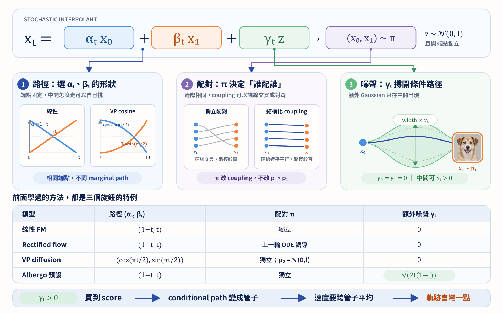

import Objectives from '../../../components/Objectives.astro';
import Prereq from '../../../components/Prereq.astro';
import Ask from '../../../components/Ask.astro';
import Remark from '../../../components/Remark.astro';
import Details from '../../../components/Details.astro';
import Question from '../../../components/Question.astro';
import Answer from '../../../components/Answer.astro';
import QuizBlock from '../../../components/QuizBlock.astro';
import Option from '../../../components/Option.astro';
import Explanation from '../../../components/Explanation.astro';
import Bridge from '../../../components/Bridge.astro';
import Ref from '../../../components/Ref.astro';

# Stochastic Interpolant: 統一 Flow 與 Diffusion

<Objectives>
- **把 reference paths 正式寫成 stochastic interpolant。** 分清端點如何配對、單條 reference path、整條 marginal path 與真正生成時的 trajectory。
- **從同一個 interpolant 導出 velocity、score、ODE 與 SDE。** 說明 Flow Matching 與 diffusion 並不是兩套互不相干的 construction。
- **說出 regression loss 小，究竟保證了什麼。** 在適當條件下，velocity error 控制 ODE 終點的 $W_2$；velocity 與 score error 則控制 SDE 終點的 KL。
</Objectives>

<Prereq items={frontmatter.prereqs} />

在 U2.1 到 U2.3，我們已經把 Flow Matching 的理想情況接起來了：先畫 reference paths，再用 L2 regression 學出 velocity，最後沿著 ODE 把 $p_0$ 搬成 $p_1$。當起點是 Gaussian 時，這個 velocity 還可以和 diffusion 的 denoiser、score 互相換算。

可是實際訓練後，我們拿到的從來不是精確的 $v_t^*$，而只是一個 loss 還不錯的 $v_\theta$。這時真正重要的問題已經不只是「最佳解寫成什麼」，而是：

> **如果每個位置的 velocity 都差一點，最後生成的 distribution 會差多少？**

而且，既然 velocity 與 score 都在描述同一條 $p_t$，我們是不是只能沿著 ODE 走？還是也能用 SDE 走過同一組 marginals，並得到不同的誤差保證？

要回答這些問題，我們需要的不是再多一個方法名稱，而是一套能同時回答四件事的架構：**中間的 $p_t$ 怎麼來、網路要學什麼、生成時可以怎麼走，以及 training error 最後控制了什麼。**

<Ask>
能不能從一個同時涵蓋 Flow 與 Diffusion 的 framework 出發， 
分析它們生成的 distribution 與真實 distribution 之間的誤差是否可控？
</Ask>

## Stochastic Interpolant: 將 reference paths 寫成一個 random process

在 U2.1，給定一組端點 $(x_0,x_1)$ 後，我們建立一條路將它們接起來：

$$
I_t(x_0,x_1)=(1-t)x_0+tx_1
$$

這時的路徑沒有隨機性。但實際上，兩端的 distributions 分別由隨機變數

$$
X_0\sim p_0,\qquad X_1\sim p_1.
$$

表示，$(x_0,x_1)$ 只是其中一組抽樣結果。因此，我們也可以考慮

$$
I_t(X_0,X_1)=(1-t)X_0+tX_1.
$$

現在，每個時刻的 $I_t$ 都是一個隨機變數，而整個 $\{I_t\}_{t\in[0,1]}$ 建構了 $X_0$ 與 $X_1$ 之間的 interpolation。因此，我們稱它為 **stochastic interpolant**。

不過，只知道 $X_0\sim p_0$ 與 $X_1\sim p_1$，還沒有決定它們要如何配成一組。這個配對規則就是 **coupling**，也就是 $(X_0,X_1)$ 的 joint distribution：

$$
(X_0,X_1)\sim\pi.
$$

$\pi$ 在兩端的 marginal distributions 必須分別是 $p_0$ 與 $p_1$。獨立抽一個起點和一個終點是一種 coupling，但不是唯一的選擇。

回到散場的例子，$p_0$ 告訴我們人群原本站在哪裡，$p_1$ 告訴我們最後各個捷運站有多少人；但這兩張分布圖並沒有告訴我們「哪一個人要去哪一站」。$\pi$ 做的就是這件事：決定哪些起點與終點會被配成一組。

但只決定「誰要去哪一站」仍然不夠。同一個人可以直走，也可以繞路；reference path $I_t$ 決定的是：**這一組起點與終點，在時間 $t$ 應該走到哪裡。**

現在想像在時間 $t$ 拍一張空拍照。先按照 $\pi$ 抽出每個人的起點與終點，再用 $I_t$ 算出他們此刻的位置；所有位置形成的 distribution 就是

$$
p_t
=
\operatorname{Law}_{(X_0,X_1)\sim\pi}
\bigl(I_t(X_0,X_1)\bigr).
$$

所以，**$\pi$ 決定哪些端點會配在一起，$I_t$ 決定每組端點中途怎麼走；兩者合在一起，才決定空拍照中的 $p_t$。** 即使 $p_0$ 與 $p_1$ 完全相同，換掉其中任何一個，中間的人群分布都可能改變。

沿用跨年散場的例子，可以把四個容易混在一起的物件分開：

| 物件 | 散場例子 | 數學角色 |
|---|---|---|
| Reference path | 指定某個人的起點與捷運站後，替他畫出的路 | $I_t(x_0,x_1)$ |
| Stochastic interpolant | 隨機抽一個人與目的地後，他在時間 $t$ 的位置 | $I_t(X_0,X_1)$ |
| Marginal path | 在時間 $t$ 拍一張空拍照，看到整群人如何分布 | $p_t=\operatorname{Law}(I_t)$ |
| ODE trajectory | 迷路的人跟著學到的平均人潮後，真正走出的路 | $\frac{dX_t}{dt}=v_t(X_t)$ |

Reference path 是用來製造 training label 的路；stochastic interpolant 是把端點的 randomness 也放進來後的 random process；$p_t$ 是它在每個時刻留下的快照。真正生成時走的則是最後一列，通常不會重走某一條 reference path。

<Remark label="名稱" summary="為什麼 U2 先叫 reference path，到了這裡才叫 stochastic interpolant？">
在 U2，我們先固定一組 $(x_0,x_1)$，只討論怎麼替這一組端點畫路，所以 **reference path** 比較直白。

現在開始把 $(X_0,X_1)$ 當成隨機變數，研究整條 random process 以及它的 marginal distributions，才需要 **stochastic interpolant** 這個正式名稱。兩個名稱描述的是不同層次，不需要把前面的 reference path 全部改名。
</Remark>

## 在 reference path 外，再加入可以控制的 randomness

U2 使用的 $I_t(X_0,X_1)$ 已經是最簡單的 stochastic interpolant。Albergo 等人的架構再多放入一個獨立的 Gaussian random variable $Z$：

$$
\boxed{
I_t
=
\sigma_tX_0+\alpha_tX_1+\gamma_tZ,
\qquad
(X_0,X_1)\sim\pi,\qquad Z\sim\mathcal N(0,I).
}
$$

這裡沿用 U2.3 的時間方向與符號：$t=0$ 是起點、$t=1$ 是終點。因此

$$
\sigma_0=1,\quad \alpha_0=0,
\qquad
\sigma_1=0,\quad \alpha_1=1,
\qquad
\gamma_0=\gamma_1=0.
$$

這是 stochastic interpolant 中最常用、也足以包含 U1 與 U2 的 affine family。更一般的版本可以把前兩項換成任意的 reference map $I_t(X_0,X_1)$；這個單元先把 affine 的情況做清楚。

現在有三件事可以分別決定：

- **Path：** $(\sigma_t,\alpha_t)$ 決定端點的影響力如何隨時間交接。
- **Coupling：** $\pi$ 決定哪一個 $X_0$ 與哪一個 $X_1$ 被配在一起。
- **Extra randomness：** $\gamma_t$ 決定同一組端點之間，允許多大的額外 Gaussian variation。

如果把 reference path 想成一條畫好的路，$\gamma_tZ$ 就像替它加上寬度：$\gamma_t=0$ 時是一條線；$\gamma_t>0$ 時，同一組端點在中途可以落在一條有厚度的通道裡。因為 $\gamma_0=\gamma_1=0$，這份 randomness 不會改變兩端的 distributions。

## U1 與 U2 原來早就在這個架構裡

| 方法 | $(\sigma_t,\alpha_t)$ | $\gamma_t$ | Coupling $\pi$ |
|---|---|---|---|
| Linear Flow Matching | $(1-t,t)$ | $0$ | 獨立或自行選擇 |
| U1 的 VP path | U1 noise schedule 決定 | $0$ | Gaussian $X_0$ 與 data $X_1$ 獨立 |
| Reflow／minibatch OT | $(1-t,t)$ | $0$ | 重新設計配對方式 |
| 一般 affine stochastic interpolant | 自行設計 | $\gamma_t\ge 0$ | 任意 coupling |

DDPM 那一列的 $\gamma_t$ 是 0，並不代表它沒有 noise。U1 中的起點 $X_0$ 本身就是 Gaussian noise；$\gamma_tZ$ 則是**端點之外額外加入的 randomness**，兩者不是同一個東西。

這個表也顯示，stochastic interpolant 不只是在替既有方法換名字。它把 path、coupling 與額外 randomness 分開寫出來，讓我們可以清楚看見：每次修改到底動到了哪一部分。

## 同一個 L2 trick，仍然可以學出 velocity

給定一組 $(X_0,X_1,Z)$，直接對 $I_t$ 微分：

$$
\dot I_t
=
\dot\sigma_tX_0+\dot\alpha_tX_1+\dot\gamma_tZ.
$$

這個 reference velocity 可以直接算，所以和 U2.1 一樣，把 $(I_t,t)$ 當輸入、$\dot I_t$ 當 label：

$$
\mathcal L_v(\theta)
=
\mathbb E\!\left[
\left\|v_\theta(I_t,t)-\dot I_t\right\|^2
\right].
$$

固定 $(x,t)$ 後，L2 regression 仍然會把所有可能經過這裡的 velocities 取平均，因此

$$
v_t^*(x)
=
\mathbb E[\dot I_t\mid I_t=x].
$$

這正是 U2 的 Flow Matching，現在只是 reference velocity 多了 $\dot\gamma_tZ$。接下來省略星號，把這個 optimal velocity 記成 $v_t$。

## 為什麼這個 velocity 真的會走過同一條 $p_t$？

令 $p_t=\operatorname{Law}(I_t)$。對任意 test function $\phi$，沿著 stochastic interpolant 微分：

$$
\begin{aligned}
\frac{\mathrm d}{\mathrm dt}\mathbb E[\phi(I_t)]
&=\mathbb E[\nabla\phi(I_t)\cdot\dot I_t]\\
&=\mathbb E[\nabla\phi(I_t)\cdot v_t(I_t)]\\
&=\int \nabla\phi(x)\cdot v_t(x)p_t(x)\,\mathrm dx.
\end{aligned}
$$

第一行只是 chain rule；第二行用的是 $v_t(x)=\mathbb E[\dot I_t\mid I_t=x]$。最後做一次 integration by parts，就得到

$$
\partial_t p_t+\nabla\cdot(p_tv_t)=0.
$$

這就是 U2.2 的 continuity equation。因此從 $X_0\sim p_0$ 出發，沿著

$$
\frac{\mathrm dX_t}{\mathrm dt}=v_t(X_t)
$$

前進，marginal distribution 會和 stochastic interpolant 的快照一樣，在每個時刻都是 $p_t$，最後抵達 $p_1$。

## 多出來的 Gaussian，還讓我們拿到 score

既然訓練時的 $Z$ 也是已知的，我們也可以用另一個 L2 regression 來預測它：

$$
\mathcal L_Z(\theta)
=
\mathbb E\!\left[
\left\|\eta_\theta(I_t,t)-Z\right\|^2
\right],
\qquad
\eta_t^*(x)=\mathbb E[Z\mid I_t=x].
$$

給定 $(X_0,X_1)$ 後，

$$
I_t\mid X_0,X_1
\sim
\mathcal N\!\left(
\sigma_tX_0+\alpha_tX_1,
\gamma_t^2I
\right).
$$

所以只要 $\gamma_t>0$，就可以沿用 U1.3 的 Tweedie 公式：

$$
\boxed{
\nabla_x\log p_t(x)
=
-\frac{1}{\gamma_t}\,
\mathbb E[Z\mid I_t=x]
=
-\frac{\eta_t^*(x)}{\gamma_t}.
}
$$

直覺上，$\gamma_tZ$ 把每一條 conditional path 撐成一條有厚度的通道；預測「我在通道裡偏離中心多少」，也就告訴我們哪個方向的 density 比較高。

記 $m_t=\sigma_tX_0+\alpha_tX_1$。在固定端點的 conditional Gaussian 中，$I_t-m_t=\gamma_tZ$，因此

$$
\nabla_x\log p_t(x\mid X_0,X_1)
=
-\frac{x-m_t}{\gamma_t^2}
=
-\frac{Z}{\gamma_t}.
$$

再將 conditional score 對端點的 posterior 取平均：

$$
\begin{aligned}
\nabla_x\log p_t(x)
&=
\mathbb E\!\left[
\nabla_x\log p_t(x\mid X_0,X_1)
\mid I_t=x
\right]\\
&=
-\frac{1}{\gamma_t}
\mathbb E[Z\mid I_t=x].
\end{aligned}
$$

和 U1.3 一樣，關鍵仍然是：除以 marginal $p_t(x)$ 之後，積分裡的權重正好變成 posterior。

## 同一條 $p_t$，可以用 ODE 走，也可以用 SDE 走

現在 stochastic interpolant 同時給了我們

$$
v_t(x),\qquad s_t(x):=\nabla_x\log p_t(x).
$$

$v_t$ 已經能用 ODE 推動 $p_t$。但對任意常數 $\varepsilon>0$，我們也可以改走

$$
\boxed{
\mathrm dX_t
=
\big[v_t(X_t)+\varepsilon s_t(X_t)\big]\,\mathrm dt
+\sqrt{2\varepsilon}\,\mathrm dW_t.
}
$$

這條 SDE 的 Fokker–Planck equation 是

$$
\partial_t p_t
=
-\nabla\cdot\big((v_t+\varepsilon s_t)p_t\big)
+\varepsilon\Delta p_t.
$$

因為 $s_tp_t=\nabla p_t$，多出來的兩項正好抵消：

$$
-\nabla\cdot(\varepsilon\nabla p_t)
+\varepsilon\Delta p_t=0.
$$

剩下的仍是 continuity equation。也就是說，**stochastic interpolant 先決定要經過哪些 marginals；ODE 或 SDE 則決定每個樣本要用什麼方式走過它們。** 這就是 Flow 與 Diffusion 在這套架構裡真正共用的部分。

## Loss 變小，最後的 distribution 真的會比較接近嗎？

到這裡為止，我們都假設 $v_t$ 與 $s_t$ 學得完全正確。現在回到開頭真正想問的問題：當網路只有近似值時，training error 能不能控制最後的 distribution error？

答案是可以，但 ODE 與 SDE 自然對應到兩種不同的保證。

### ODE：velocity error 控制 $W_2$

令 $\hat p_1$ 是沿著 learned velocity $v_\theta$ 解 ODE 得到的終點 distribution，並假設 $v_\theta(\cdot,t)$ 是 $L$-Lipschitz。定義整段路上的 velocity error

$$
\mathcal E_v
:=
\int_0^1
\mathbb E_{X_t\sim p_t}
\big[\|v_\theta(X_t,t)-v_t(X_t)\|^2\big]\,\mathrm dt.
$$

這正是 population Flow Matching loss 超過最佳值的部分。在這些條件下，

$$
\boxed{
W_2^2(p_1,\hat p_1)
\le
e^{2L}\mathcal E_v.
}
$$

證明的想法很直接：讓正確 ODE 與 learned ODE 從同一個 $X_0$ 出發，分別得到 $X_t$ 與 $\hat X_t$。兩人的距離滿足

$$
\frac{\mathrm d}{\mathrm dt}\|\hat X_t-X_t\|
\le
L\|\hat X_t-X_t\|
+\|v_\theta(X_t,t)-v_t(X_t)\|.
$$

用 Grönwall inequality 把每一刻的方向誤差累積起來，再平方取平均，就得到

$$
\mathbb E\|\hat X_1-X_1\|^2
\le e^{2L}\mathcal E_v.
$$

而 $(X_1,\hat X_1)$ 本身就是 $p_1$ 與 $\hat p_1$ 的一種 coupling；$W_2$ 會在所有 coupling 裡選搬運成本最小的那一個，所以只可能更小。這裡控制的是**精確解 ODE 時的模型誤差**；numerical solver 造成的離散誤差要另外計算。

### SDE：drift error 直接控制 KL

現在把 exact velocity 與 score 換成網路的近似值，考慮

$$
\mathrm d\hat X_t
=
\big[v_\theta(\hat X_t,t)+\varepsilon s_\theta(\hat X_t,t)\big]\,\mathrm dt
+\sqrt{2\varepsilon}\,\mathrm dW_t,
$$

並把它的 marginal 記成 $\hat p_t$。令

$$
\mathcal E_s
:=
\int_0^1
\mathbb E_{X_t\sim p_t}
\big[\|s_\theta(X_t,t)-s_t(X_t)\|^2\big]\,\mathrm dt.
$$

對兩條 diffusion coefficient 相同、drift 不同的 Fokker–Planck equations，可以算出

$$
\frac{\mathrm d}{\mathrm dt}\mathrm{KL}(p_t\|\hat p_t)
=
\mathbb E_{p_t}[\delta_t\cdot\Delta b_t]
-\varepsilon\mathbb E_{p_t}[\|\delta_t\|^2],
$$

其中 $\delta_t=\nabla\log\hat p_t-\nabla\log p_t$，$\Delta b_t$ 是兩條 SDE 的 drift 差。利用

$$
a\cdot d-\varepsilon\|a\|^2
\le
\frac{\|d\|^2}{4\varepsilon},
$$

再把 $\Delta b_t=(v_\theta-v_t)+\varepsilon(s_\theta-s_t)$ 代入並積分，就得到

$$
\boxed{
\mathrm{KL}(p_1\|\hat p_1)
\le
\frac{1}{2\varepsilon}\mathcal E_v
+\frac{\varepsilon}{2}\mathcal E_s.
}
$$

這條式子把 training 與 generation 接了起來：velocity 和 score 的 L2 errors 不只是容易算的 surrogate，它們真的會控制最後的 likelihood error。

<Remark label="注意" summary="為什麼 ODE 那邊不直接給 KL bound？">
對 deterministic ODE 做相同計算時，不會出現 $-\varepsilon\|\delta_t\|^2$ 這個負項。因此小的 velocity MSE 一般不足以單獨控制 KL，還需要控制 $p_t$ 與 $\hat p_t$ 之間的 Fisher divergence。

所以這裡不是「SDE 比 ODE 正確」：兩者在 exact fields 下都會得到同一條 $p_t$。差別是 fields 不精確時，ODE 很自然地得到 $W_2$ stability；SDE 的 diffusion 則額外提供 KL／likelihood control。
</Remark>

這裡有兩個很容易混在一起的量：$\gamma_t$ 放在 stochastic interpolant 裡，會改變中間的 $p_t$ 與我們能學到的 target；$\varepsilon_t$ 放在 sampling dynamics 裡，在 fields 精確時不改變 $p_t$，只改變每個樣本怎麼走。下面的 demo 先看 $\gamma_t$ 做了什麼；<Ref to="dma-sampler-family" /> 再專門討論 $\varepsilon_t$。

<iframe loading="lazy" src="/personal_website/notes/research_areas/diffusion-models-applications/w5-0-gamma.html" class="demo-frame" title="額外 Gaussian randomness 如何改變 stochastic interpolant" style="height: 950px; width: 100%; border: none;"></iframe>

在 demo 中，起點與終點都是同一個環。選擇對徑配對並把 $\gamma$ 設成 0，中間的所有 reference paths 會同時通過圓心，$t=\tfrac12$ 時整個 distribution 甚至會塌成一個點。提高 $\gamma$ 後，中間會重新出現厚度；但這也改變了整條 marginal path，而不只是替 sampling 隨手加一點 noise。

## 那是不是一律把 $\gamma_t$ 設成正的就好？

<Question id="Q1">
$\gamma_t>0$ 可以讓中間 distribution 有厚度，又能讓我們學到 score。那為什麼不永遠都加入這項 randomness？

<Answer>
因為它解決的是「怎麼得到平滑 density 與 score」，不是「怎麼讓 ODE trajectory 變直」。

$\gamma_tZ$ 提供平滑的 conditional density，讓 score 可以透過 regression 得到；但它也會改變中間的 $p_t$ 與 reference velocities。不同通道互相重疊後，$v_t^*(x)$ 仍要平均多個方向，ODE trajectories 不一定會因此變直。

如果我們只需要 velocity，$\gamma_t=0$ 完全可以訓練。U2 的 Flow Matching 就是這個情況；而當 $X_0$ 本身是獨立 Gaussian 時，還可以像 U2.3 那樣從 $X_0$ 的 conditional mean 換算 score。失去的是上面這個對**任意起點與任意 coupling** 都成立的 $Z$-regression 公式。

所以後面的問題要分開處理：<Ref to="dma-sampler-family" /> 會研究 $\varepsilon_t$ 改變時，誤差修正能力與 numerical cost 如何取捨；U3 則會研究 reference paths 交叉後產生的彎曲，接著再用 reflow 與 minibatch OT 改善 coupling。
</Answer>
</Question>

*圖：path、coupling 與額外 randomness 共同決定 stochastic interpolant，也共同決定中間的 marginal distributions。*

## 快速回顧一下

<QuizBlock id="w5-0-a">
固定一組 $(x_0,x_1)$ 所畫出的 $I_t(x_0,x_1)$，和 $I_t(X_0,X_1)$ 有什麼差別？
<Option correct>前者是一條 reference path；後者因端點也是隨機變數，形成 stochastic interpolant。</Option>
<Option>兩者完全相同，只是大小寫不同。</Option>
<Option>前者是 ODE trajectory，後者是 SDE trajectory。</Option>
<Explanation>
真正生成時的 ODE trajectory 還是另一個物件：它沿著平均後的 $v_t(x)$ 前進，不一定等於某一條 reference path。
</Explanation>
</QuizBlock>

<QuizBlock id="w5-0-b">
為什麼 U1 的 VP path 在表中可以取 $\gamma_t=0$，卻仍然含有 Gaussian noise？
<Option>因為 $\alpha_t$ 本身是 Gaussian。</Option>
<Option correct>因為起點 $X_0$ 本身就是 Gaussian noise；$\gamma_tZ$ 指的是端點之外額外加入的 randomness。</Option>
<Option>因為 velocity field 會自動產生 noise。</Option>
<Explanation>
$X_0$ 與 $Z$ 是不同的 random variables。只有在 diffusion 把起點選成 Gaussian 時，它們看起來才容易被混在一起。
</Explanation>
</QuizBlock>

<QuizBlock id="w5-0-c">
為什麼小的 velocity MSE 對 ODE 可以自然地控制 $W_2$，卻不能直接保證 KL 很小？
<Option>因為 $W_2$ 只適用於 Gaussian。</Option>
<Option correct>$W_2$ 可以用同一起點的兩條 trajectories 建立 coupling；KL 還會受到 density gradient，也就是 Fisher divergence 的影響。</Option>
<Option>因為 ODE 沒有 marginal distribution。</Option>
<Explanation>
逐軌跡距離直接給出一個 Wasserstein 上界；但 KL 比較的是 density ratio，對局部壓縮與展開更敏感。SDE 的 diffusion 項會在 KL 的導數裡提供負的 Fisher divergence，才讓 drift error 足以得到上界。
</Explanation>
</QuizBlock>

<Bridge to="dma-sampler-family">
現在，從一條 stochastic interpolant 出發，我們已經得到 marginal path、velocity、score、ODE、SDE，以及 $W_2$ 與 KL 的誤差保證。KL bound 裡還留著一個可以選的 $\varepsilon$：它越大，velocity error 的代價越小，score error 的代價卻越大。下一篇就來看，$\varepsilon_t$ 改變時，實際的 trajectories、修正能力與 numerical cost 會怎麼變。
</Bridge>

## 參考文獻

1. Albergo, M. S., Boffi, N. M., Vanden-Eijnden, E. [*Stochastic Interpolants: A Unifying Framework for Flows and Diffusions.*](https://arxiv.org/abs/2303.08797) 2023.
2. Albergo, M. S., Vanden-Eijnden, E. [*Building Normalizing Flows with Stochastic Interpolants.*](https://arxiv.org/abs/2209.15571) ICLR 2023.
3. Ma, N., et al. [*SiT: Exploring Flow and Diffusion-Based Generative Models with Scalable Interpolant Transformers.*](https://arxiv.org/abs/2401.08740) ICCV 2023.
4. Benton, J., Deligiannidis, G., Doucet, A. [*Error Bounds for Flow Matching Methods.*](https://arxiv.org/abs/2305.16860) TMLR 2024.（以 velocity 的 L2 approximation error 與 Lipschitz constant 控制 deterministic Flow Matching 的 $W_2$ error。）
