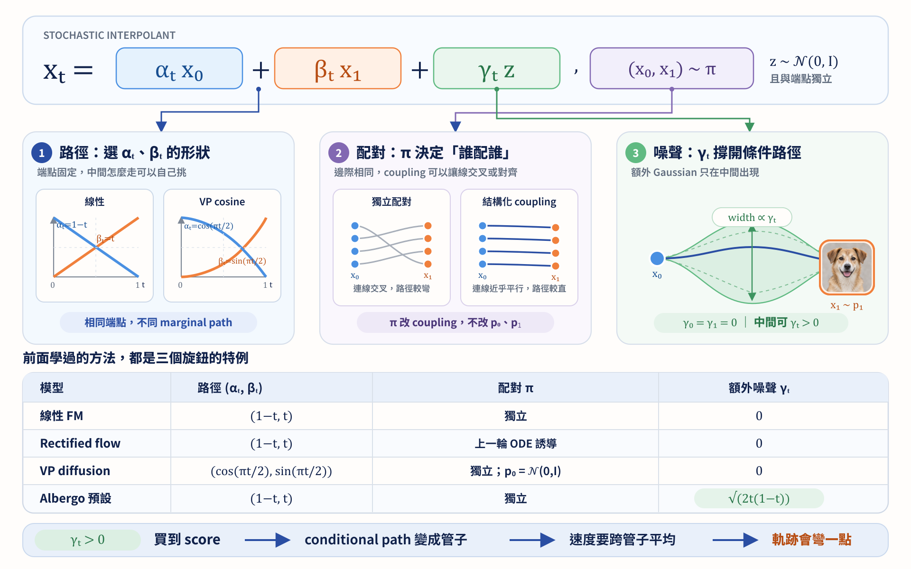

import Objectives from '../../../components/Objectives.astro';
import Prereq from '../../../components/Prereq.astro';
import Ask from '../../../components/Ask.astro';
import Remark from '../../../components/Remark.astro';
import Details from '../../../components/Details.astro';
import Question from '../../../components/Question.astro';
import Answer from '../../../components/Answer.astro';
import QuizBlock from '../../../components/QuizBlock.astro';
import Option from '../../../components/Option.astro';
import Explanation from '../../../components/Explanation.astro';
import Bridge from '../../../components/Bridge.astro';
import Ref from '../../../components/Ref.astro';

# Stochastic Interpolant: 統一 Flow 與 Diffusion

<Objectives>
- **用 stochastic interpolant 描述整條 probability path。** 說明 coupling $\pi$ 如何抽出一組端點、reference path $I_t$ 如何連接它們，以及兩者如何共同決定 $p_t=\operatorname{Law}(X_t)$。
- **從同一個 interpolant 導出 velocity、score、ODE 與 SDE。** 說明 Flow Matching 與 diffusion 並不是兩套互不相干的 construction。
- **說出 regression loss 小，究竟保證了什麼。** 在適當條件下，velocity error 控制 ODE 終點的 $W_2$；velocity 與 score error 則控制 SDE 終點的 KL。
</Objectives>

<Prereq items={frontmatter.prereqs} />

在 U2.1 到 U2.3，我們已經把 Flow Matching 的理想情況接起來了：先畫 reference paths，再用 L2 regression 學出 velocity，最後沿著 ODE 把 $p_0$ 搬成 $p_1$。當起點是 Gaussian 時，這個 velocity 還可以和 diffusion 的 denoiser、score 互相換算。

可是實際訓練後，我們拿到的從來不是精確的 $v_t^*$，而只是一個 loss 還不錯的 $v_\theta$。這時真正重要的問題已經不只是「最佳解寫成什麼」，而是：

> **如果每個位置的 velocity 都差一點，最後生成的 distribution 會差多少？**

而且，既然 velocity 與 score 都在描述同一條 $p_t$，我們是不是只能沿著 ODE 走？還是也能用 SDE 走過同一組 marginals，並得到不同的誤差保證？

要回答這些問題，我們需要的不是再多一個方法名稱，而是一套能同時回答四件事的架構：**中間的 $p_t$ 怎麼來、網路要學什麼、生成時可以怎麼走，以及 training error 最後控制了什麼。**

<Ask>
能不能從一個同時涵蓋 Flow 與 Diffusion 的 framework 出發， 
分析它們生成的 distribution 與真實 distribution 之間的誤差是否可控？
</Ask>

## Stochastic Interpolant: 將 reference paths 寫成一個 random process

在 U2.1，我們先隨意抽出一組端點 $(x_0,x_1)$，再建立 reference path 將它們接起來。其實可以把這個過程寫得更完整一點：先考慮 $x_0$、$x_1$ 本身來自兩個 distributions，

$$
X_0\sim p_0,\qquad X_1\sim p_1.
$$

接下來，如何「抽出一組端點」，對應到的就是 $(X_0,X_1)$ 的 joint distribution：

$$
(X_0,X_1)\sim\pi.
$$

在這裡，我們也稱 $\pi$ 為 **coupling**——也就是將兩端 couple 起來的方法。

<Remark label="補充" summary="Coupling 的嚴謹定義">
給定定義在 $\mathcal X_0$、$\mathcal X_1$ 上的兩個 distributions $p_0$、$p_1$，coupling 是 product space $\mathcal X_0\times\mathcal X_1$ 上的 probability distribution $\pi$，並且對任意 measurable sets $A\subseteq\mathcal X_0$、$B\subseteq\mathcal X_1$，滿足

$$
\pi(A\times\mathcal X_1)=p_0(A),
\qquad
\pi(\mathcal X_0\times B)=p_1(B).
$$

所有符合條件的 $\pi$ 組成 $\Pi(p_0,p_1)$。所以 coupling 可以改變 $X_0$ 與 $X_1$ 之間的關係，但不能改變任何一端原本的 distribution。
</Remark>

我們前面採取的是最直接的做法：獨立分別從 $p_0$、$p_1$ 各抽一個點，

$$
\pi_{\mathrm{ind}}(x_0,x_1)=p_0(x_0)p_1(x_1),
$$

也就是 **independent coupling**。但這不是唯一的選擇。

回到散場的例子，$p_0$ 告訴我們人群原本站在哪裡，$p_1$ 告訴我們最後各個捷運站有多少人。Independent coupling 就像不看位置，隨機替每個人抽一個捷運站；站在象山方向的人可能被配到市政府站，許多人的路便會互相交叉。

但如果我們已經知道每個人的位置，就可以把靠近象山的人優先配到象山站、靠近市政府的人優先配到市政府站，同時維持每個車站原本的人數。兩種方法的 $p_0$ 與 $p_1$ 完全相同，改變的只有「誰和誰配成一組」——也就是 coupling。

有了抽取端點的方法後，我們才替每一組 $(x_0,x_1)$ 建立 reference path。例如，

$$
I_t(x_0,x_1)=(1-t)x_0+tx_1.
$$

先從 $\pi$ 抽出端點，再把抽到的端點放進 $I_t$：

$$
(X_0,X_1)\sim\pi,\qquad X_t=I_t(X_0,X_1).
$$

固定端點後，$I_t(x_0,x_1)$ 是一條沒有隨機性的 reference path；但端點本身是隨機抽出的，所以 $X_t$ 是 random variable，整個 $\{X_t\}_{t\in[0,1]}$ 就叫做 **stochastic interpolant**。

從我們在起點與終點看到的 particles 出發，先按照 $\pi$ 決定每個人要去哪一站，再按照 $I_t$ 算出他們在時間 $t$ 的位置；所有位置形成的 distribution 就是

$$
p_t
=
\operatorname{Law}_{(X_0,X_1)\sim\pi}
\bigl(I_t(X_0,X_1)\bigr)
=\operatorname{Law}(X_t).
$$

所以，**$\pi$ 決定哪些端點會配在一起，$I_t$ 決定每組端點中途怎麼走；兩者合在一起，才決定每個時刻空拍照中的 $p_t$。** 即使 $p_0$ 與 $p_1$ 完全相同，換掉其中任何一個部分，中間的人群分布都可能改變。

沿用跨年散場的例子，可以把幾個容易混在一起的物件分開：

| 物件 | 散場例子 | 數學角色 |
|---|---|---|
| Coupling | 決定哪一個人要去哪一站 | $(X_0,X_1)\sim\pi$ |
| Reference path | 指定某個人的起點與捷運站後，替他畫出的路 | $I_t(x_0,x_1)$ |
| Stochastic interpolant | 隨機抽出一組端點後，他在時間 $t$ 的位置 | $X_t=I_t(X_0,X_1)$ |
| Marginal path | 在時間 $t$ 拍一張空拍照，看到整群人如何分布 | $p_t=\operatorname{Law}(X_t)$ |
| ODE trajectory | 迷路的人跟著學到的平均人潮後，真正走出的路 | $\frac{dY_t}{dt}=v_t(Y_t)$ |

Reference path 是用來製造 training label 的路；stochastic interpolant 是先隨機抽取端點，再沿著 reference path 得到的 random process；$p_t$ 是它在每個時刻留下的快照。真正生成時走的則是最後一列，通常不會重走某一條 reference path。

<Remark label="名稱" summary="為什麼 U2 先叫 reference path，到了這裡才叫 stochastic interpolant？">
在 U2，我們先固定一組 $(x_0,x_1)$，只討論怎麼替這一組端點畫路，所以 **reference path** 比較直白。

現在先用 $\pi$ 隨機抽取 $(X_0,X_1)$，再令 $X_t=I_t(X_0,X_1)$，研究的才是整條 random process 與它的 marginal distributions，因此需要 **stochastic interpolant** 這個正式名稱。兩個名稱描述的是不同層次，不需要把前面的 reference path 全部改名。
</Remark>

## 在 reference path 外，再加入可以控制的 randomness

到這裡，coupling $\pi$ 與 reference path $I_t$ 已經足以定義一條 probability path。但「能接起兩端」不代表中間一定容易學。

回到散場的例子，如果許多 reference paths 在同一個路口交叉，人群可能在某個時刻全擠進一條很窄的巷子。這時 $p_t$ 會變得很尖，甚至塌在低維的區域；附近的 velocity 也可能快速改變，讓神經網路與 numerical solver 都更難處理。

那能不能保留起點與終點，卻讓中間的人群不要擠得那麼尖？Albergo 等人的做法是：在 reference path 外，再加入一個獨立的 Gaussian random variable $Z$，

$$
\boxed{
X_t
=
\sigma_tX_0+\alpha_tX_1+\gamma_tZ,
\qquad
(X_0,X_1)\sim\pi,\qquad Z\sim\mathcal N(0,I).
}
$$

這裡沿用 U2.3 的時間方向與符號：$t=0$ 是起點、$t=1$ 是終點。因此

$$
\sigma_0=1,\quad \alpha_0=0,
\qquad
\sigma_1=0,\quad \alpha_1=1,
\qquad
\gamma_0=\gamma_1=0.
$$

在散場的畫面裡，$\gamma_tZ$ 就像讓每個人在 reference path 周圍保留一點活動空間，而不是所有人都踩在同一條細線上。因為 $\gamma_0=\gamma_1=0$，它不會改變兩端；改變的是中間每一張空拍照。

<Remark label="論文中的結果" summary="加入 $\gamma_tZ$ 有什麼理論與實務上的好處？">
令 $p_t^{(0)}$ 表示沒有額外 noise 時的中間 distribution。因為 $Z$ 是獨立 Gaussian，加入 $\gamma_tZ$ 後會精確得到

$$
p_t^{(\gamma)}
=
p_t^{(0)}*\mathcal N(0,\gamma_t^2I).
$$

也就是把原本的 distribution 做一次 Gaussian smoothing。論文 [1] 在其 regularity assumptions 下證明：當 $\gamma_t>0$ 時，中間的 density 與 velocity field 都會在空間上變得平滑。作者因此指出，生成時所需的 numerical integration 也會比較容易。

後來的研究把這個好處說得更具體：

- **讓 flow 更穩定。** 在一端為 Gaussian 的相關設定中，Gao 等人 [5] 進一步證明了 velocity 的 Lipschitz regularity、flow 的存在與唯一性，以及 source distribution 或 learned velocity 被擾動時的 $W_2$ stability。也就是說，Gaussian smoothing 不只是讓圖看起來比較圓滑；它能直接提供 ODE well-posedness 與誤差控制所需的 regularity。
- **讓有限資料提供更密的 supervision。** 對兩端都是 empirical distribution 的情況，原本每一組資料只畫出一條細線；加上 $\gamma_tZ$ 後，同一組端點會在周圍產生一整片 training points。Su 等人 [7] 證明，Gaussian smoothing 後的 empirical interpolant 與 population interpolant 之間的 $W_1$ 距離不會更大，因此能縮小他們分析的 generalization gap。實驗中，完整的 stochastic-injection 方法在五個 image-to-image tasks 上比 standard Flow Matching 平均改善 13 FID；ablation 也顯示，單獨拿掉 interpolant noise 就會使結果變差。
- **降低某些 deterministic paths 的 memorization。** Reu 等人 [6] 證明，在他們分析的 straight-path setting 中，即使 training paths 彼此交叉，仍可能存在一個記住 training pairings 的 velocity field；在 CelebA 的實驗裡，加入少量 noise 後才恢復 generalization。這說明「每條線都穿過很多地方」不代表 supervision 已經足夠。

這個 Gaussian 還提供了一個訓練時已知的 label $Z$。論文 [1] 進一步證明，它的 conditional expectation 可以直接換成 $p_t$ 的 score；所以下面除了 velocity，我們也能用 L2 regression 學到 score，進而建立 ODE 與 SDE。

不過，這些結果不能簡化成「加入越多 noise 一定越好」。$\gamma_t$ 會改變整條 $p_t$，而且 schedule 與 scale 都要選：Su 等人 [7] 的 ablation 裡，不同 schedule 的差距很大。Bertrand 等人 [8] 也在一端為 Gaussian 的 high-dimensional setting 中發現，把 stochastic regression target 換成 conditional mean 並不會傷害 generalization，有時反而更好。雖然他們研究的不是 $\gamma_tZ$，但這提醒我們：**interpolant smoothing、sampling randomness 與 noisy training target 是三種不同的 randomness，不能混成同一個「noise 有幫助」的理由。**
</Remark>

這是 stochastic interpolant 中最常用、也足以包含 U1 與 U2 的 affine family。更一般的版本可以把前兩項換成任意的 reference map $I_t(X_0,X_1)$；不過下面的內容我們先用 affine 來做說明。

現在有三件事是我們可以設計的：

- **Path：** $(\sigma_t,\alpha_t)$ 決定路徑。
- **Coupling：** $\pi$ 決定哪一個 $X_0$ 與哪一個 $X_1$ 會以多少的機率被配在一起。
- **Extra randomness：** $\gamma_t$ 決定路徑中允許多大的額外 Gaussian variation。

如果把 reference path 想成一條畫好的路，$\gamma_tZ$ 就像替它加上寬度：$\gamma_t=0$ 時是一條線；$\gamma_t>0$ 時，同一組端點在中途可以落在一條有厚度的通道裡。因為 $\gamma_0=\gamma_1=0$，這份 randomness 不會改變兩端的 distributions。

## DDPM、DDIM 與 Flow Matching 都在這個架構裡

先把我們已經看過的方法，放回剛才的三項設計：

| 方法 | Path $(\sigma_t,\alpha_t)$ | Coupling $\pi$ | Extra randomness $\gamma_t$ |
|---|---|---|---|
| Linear Flow Matching | $(1-t,t)$ | $\pi_{\mathrm{ind}}(x_0,x_1)=p_0(x_0)p_1(x_1)$ | $0$ |
| DDPM／DDIM | $(\sigma_t,\alpha_t)$，且 $\sigma_t^2+\alpha_t^2=1$ | $\pi_{\mathrm{ind}}(x_0,x_1)=p_0(x_0)p_1(x_1)$ | $0$ |

<Ref to="dma-flows-and-continuity">U2.1</Ref> 已經介紹過 $(1-t,t)$ 如何畫出 linear path；DDPM／DDIM 的 $\alpha_t$ 是 data amplitude、$\sigma_t$ 是 noise amplitude，兩者如何由 VP noise schedule 得到，則可以回顧 <Ref to="dma-forward-process">U1.1</Ref>。

DDPM 與 DDIM 會放在同一列，是因為這張表記錄的是 stochastic interpolant 如何定義每個時刻的 $p_t$。兩者使用相同的 VP path，只差在最後生成時怎麼 sample。

這一列的 $\gamma_t=0$ 也不表示沒有 noise：$X_0$ 本身已經是 Gaussian noise。$\gamma_tZ$ 是在 $X_0$ 與 $X_1$ 之外，另外加入、用來改變中間 $p_t$ 的 randomness。

所以 stochastic interpolant 統一的，是 **coupling 怎麼配對端點、path 怎麼連接端點，以及中途要不要加入額外 randomness**。同一條 $p_t$ 又能用哪些 dynamics 來生成，我們會在後面繼續推導。

## 同一個 L2 trick，仍然可以學出 velocity

給定一組 $(X_0,X_1,Z)$，直接對 $X_t$ 微分：

$$
\dot X_t
=
\dot\sigma_tX_0+\dot\alpha_tX_1+\dot\gamma_tZ.
$$

這個 reference velocity 可以直接算，所以和 U2.1 一樣，把 $(X_t,t)$ 當輸入、$\dot X_t$ 當 label：

$$
\mathcal L_v(\theta)
=
\mathbb E\!\left[
\left\|v_\theta(X_t,t)-\dot X_t\right\|^2
\right].
$$

固定 $(x,t)$ 後，L2 regression 仍然會把所有可能經過這裡的 velocities 取平均，因此

$$
v_t^*(x)
=
\mathbb E[\dot X_t\mid X_t=x].
$$

這正是 U2 的 Flow Matching，現在只是 reference velocity 多了 $\dot\gamma_tZ$。接下來省略星號，把這個 optimal velocity 記成 $v_t$。

## 為什麼這個 velocity 真的會走過同一條 $p_t$？

這正是 <Ref to="dma-conditional-flow-matching">U2.2</Ref> 已經證過的結論。現在只要把決定 reference path 的 random variables 從 $(X_0,X_1)$ 擴充成 $(X_0,X_1,Z)$，仍然有

$$
v_t(x)=\mathbb E[\dot X_t\mid X_t=x],
\qquad
p_t=\operatorname{Law}(X_t).
$$

因此 $p_t$ 與 $v_t$ 仍然滿足

$$
\partial_t p_t+\nabla\cdot(p_tv_t)=0.
$$

令 $Y_0\sim p_0$，再沿著

$$
\frac{\mathrm dY_t}{\mathrm dt}=v_t(Y_t)
$$

前進，$Y_t$ 的 marginal distribution 就會和 stochastic interpolant $X_t$ 的快照一樣，在每個時刻都是 $p_t$，最後抵達 $p_1$。更嚴謹的 test-function 證明已經放在 U2.2 的補充中。

## 多出來的 Gaussian，讓任意端點也能拿到 score

既然訓練時的 $Z$ 也是已知的，我們也可以用另一個 L2 regression 來預測它：

$$
\mathcal L_Z(\theta)
=
\mathbb E\!\left[
\left\|\eta_\theta(X_t,t)-Z\right\|^2
\right],
\qquad
\eta_t^*(x)=\mathbb E[Z\mid X_t=x].
$$

給定 $(X_0,X_1)$ 後，

$$
X_t\mid X_0,X_1
\sim
\mathcal N\!\left(
\sigma_tX_0+\alpha_tX_1,
\gamma_t^2I
\right).
$$

所以只要 $\gamma_t>0$，就可以沿用 U1.3 的 Tweedie 公式：

$$
\boxed{
\nabla_x\log p_t(x)
=
-\frac{1}{\gamma_t}\,
\mathbb E[Z\mid X_t=x]
=
-\frac{\eta_t^*(x)}{\gamma_t}.
}
$$

直覺上，$\gamma_tZ$ 把每一條 conditional path 撐成一條有厚度的通道；預測「我在通道裡偏離中心多少」，也就告訴我們哪個方向的 density 比較高。

<Remark label="和 U2.3 的關係" summary="如果 $X_0$ 已經是 Gaussian，velocity 不是本來就和 score 有關嗎？">
沒錯。在 <Ref to="dma-linear-path">U2.3</Ref> 中，$X_0\sim\mathcal N(0,I)$、$\gamma_t=0$，所以原本的 Gaussian 起點就已經給出

$$
\mathbb E[X_0\mid X_t=x]
=-\sigma_t\nabla_x\log p_t(x).
$$

而 optimal velocity 可以寫成

$$
\begin{aligned}
v_t^*(x)
&=\frac{\dot\alpha_t}{\alpha_t}x
+\left(\dot\sigma_t-
\frac{\dot\alpha_t}{\alpha_t}\sigma_t\right)
\mathbb E[X_0\mid X_t=x]\\
&=\frac{\dot\alpha_t}{\alpha_t}x
-\sigma_t\left(\dot\sigma_t-
\frac{\dot\alpha_t}{\alpha_t}\sigma_t\right)
\nabla_x\log p_t(x).
\end{aligned}
$$

所以 U2.3 中 velocity 會和 score 連起來，是因為它們都可以從同一個 conditional mean $\mathbb E[X_0\mid X_t=x]$ 得到。

但現在我們允許 $p_0$、$p_1$ 都是任意 distributions，端點不一定有 Gaussian 可以利用。加入獨立的 $Z$，等於重新放入一個已知的 Gaussian direction，讓同一個 identity 變成

$$
\mathbb E[Z\mid X_t=x]
=-\gamma_t\nabla_x\log p_t(x).
$$

因此這不是另一個新的 trick，而是把 U2.3 用在 Gaussian 起點上的方法，推廣到任意兩個端點。若 $X_0$ 本來就已經是 independent Gaussian，單純為了取得 score 並不需要再加入 $Z$；此時 $\gamma_tZ$ 的主要作用是改變並平滑中間的 probability path。

不過在任意端點的情況下，從 $Z$ 得到 score，並不代表 score 就足以決定 velocity：$v_t^*$ 還同時平均了 $X_0$ 與 $X_1$ 的貢獻，所以一般仍要分別學 velocity 與 score。
</Remark>

記 $m_t=\sigma_tX_0+\alpha_tX_1$。在固定端點的 conditional Gaussian 中，$X_t-m_t=\gamma_tZ$，因此

$$
\nabla_x\log p_t(x\mid X_0,X_1)
=
-\frac{x-m_t}{\gamma_t^2}
=
-\frac{Z}{\gamma_t}.
$$

再將 conditional score 對端點的 posterior 取平均：

$$
\begin{aligned}
\nabla_x\log p_t(x)
&=
\mathbb E\!\left[
\nabla_x\log p_t(x\mid X_0,X_1)
\mid X_t=x
\right]\\
&=
-\frac{1}{\gamma_t}
\mathbb E[Z\mid X_t=x].
\end{aligned}
$$

和 U1.3 一樣，關鍵仍然是：除以 marginal $p_t(x)$ 之後，積分裡的權重正好變成 posterior。

## 同一條 $p_t$，可以用 ODE 走，也可以用 SDE 走

現在 stochastic interpolant 同時給了我們

$$
v_t(x),\qquad s_t(x):=\nabla_x\log p_t(x).
$$

$v_t$ 已經能用 ODE 推動 $p_t$。若選定 $\varepsilon>0$，我們可以先把 velocity 與 score 合成新的 drift：

$$
\boxed{
b_t^\varepsilon(x)
:=
v_t(x)+\varepsilon s_t(x).
}
$$

這個 drift 不一定要先訓練兩支 networks 再相加。利用

$$
s_t(x)
=-\frac{1}{\gamma_t}\mathbb E[Z\mid X_t=x],
$$

可以直接得到

$$
b_t^\varepsilon(x)
=
\mathbb E\!\left[
\dot X_t-\frac{\varepsilon}{\gamma_t}Z
\,\middle|\,X_t=x
\right],
\qquad \gamma_t>0.
$$

所以固定 $\varepsilon$ 後，只要讓一支 network 對 $\dot X_t-\varepsilon Z/\gamma_t$ 做 L2 regression：

$$
\mathcal L_b(\theta)
=
\mathbb E\!\left[
\left\|
b_\theta(X_t,t)
-\left(\dot X_t-\frac{\varepsilon}{\gamma_t}Z\right)
\right\|^2
\right].
$$

這個 objective 的最佳解就是 $b_t^\varepsilon$。接著用它作為 SDE 的 drift：

$$
\boxed{
\mathrm dY_t
=
b_t^\varepsilon(Y_t)\,\mathrm dt
+\sqrt{2\varepsilon}\,\mathrm dW_t.
}
$$

在 <Ref to="dma-conditional-flow-matching">U2.2</Ref> 中，ODE 對應的 continuity equation 告訴我們 density $p_t$ 會怎麼改變。SDE 也有對應的 density evolution equation，稱為 **Fokker–Planck equation**：

$$
\begin{aligned}
\partial_t p_t
&=-\nabla\cdot\bigl(b_t^\varepsilon p_t\bigr)
+\varepsilon\Delta p_t\\
&=-\nabla\cdot\bigl((v_t+\varepsilon s_t)p_t\bigr)
+\varepsilon\Delta p_t.
\end{aligned}
$$

<Remark label="補充" summary="Fokker–Planck equation 從哪裡來？">
對任意 smooth test function $\phi$，Itô's lemma 給出

$$
\frac{\mathrm d}{\mathrm dt}\mathbb E[\phi(Y_t)]
=
\mathbb E\!\left[
\nabla\phi(Y_t)\cdot b_t^\varepsilon(Y_t)
+\varepsilon\Delta\phi(Y_t)
\right].
$$

把 expectation 寫成對 density $p_t$ 的積分，再做 integration by parts：

$$
\begin{aligned}
\frac{\mathrm d}{\mathrm dt}\int\phi(x)p_t(x)\,\mathrm dx
&=\int
\left[
\nabla\phi\cdot b_t^\varepsilon
+\varepsilon\Delta\phi
\right]p_t\,\mathrm dx\\
&=\int\phi(x)
\left[
-\nabla\cdot(b_t^\varepsilon p_t)
+\varepsilon\Delta p_t
\right]\mathrm dx.
\end{aligned}
$$

因為這對任意 $\phi$ 都成立，括號裡就是 $\partial_t p_t$。和 U2.2 的 test-function 證明相比，多出來的 $\varepsilon\Delta p_t$ 正是 Brownian motion 對 density 造成的擴散。
</Remark>

因為 $s_tp_t=\nabla p_t$，多出來的兩項正好抵消：

$$
-\nabla\cdot(\varepsilon\nabla p_t)
+\varepsilon\Delta p_t=0.
$$

剩下的仍是 continuity equation。也就是說，**stochastic interpolant 先決定要經過哪些 marginals $p_t$；ODE 或 SDE 則決定每個樣本要用什麼方式去走過這些 marginals。** 這就是 Flow 與 Diffusion 在這套架構裡真正共用的部分。

<Remark label="補充" summary="$\varepsilon$ 也可以隨時間改變">
上面先用常數 $\varepsilon$ 讓式子保持簡單。更一般地，可以選任意只隨時間改變的 $\varepsilon_t\ge 0$：

$$
\mathrm dY_t
=
\bigl[v_t(Y_t)+\varepsilon_t s_t(Y_t)\bigr]\,\mathrm dt
+\sqrt{2\varepsilon_t}\,\mathrm dW_t.
$$

因為 $\varepsilon_t$ 不依賴位置 $x$，Fokker–Planck equation 中仍然有

$$
-\nabla\cdot(\varepsilon_t s_t p_t)
+\varepsilon_t\Delta p_t
=0.
$$

所以在 fields 精確、連續時間也精確求解時，任意 $\varepsilon_t$ 都會經過同一條 $p_t$。它改變的是 trajectories，以及模型與 numerical errors 出現後，偏差會如何累積。
</Remark>

<Remark label="實作" summary="什麼時候才需要同時預測 velocity 與 score？">
如果只使用一個固定 $\varepsilon$，直接學 $b_t^\varepsilon$ 就夠了。若希望同一個模型可以切換 ODE、使用不同 $\varepsilon$ 的 SDE，或分別分析 velocity 與 score error，才需要同時取得 $v_t$ 與 $s_t$；實作上可以共用一個 backbone，再接兩個 output heads。

一般不能只學 score，因為 score 只描述當下 density 的形狀，沒有決定整條 $p_t$ 隨時間移動的方向。U1 的 diffusion model 是特例：forward dynamics 已知，而且 Gaussian endpoint 讓 velocity 可以由 score 換算，所以只訓練 score／noise prediction 就足夠。
</Remark>

## Loss 變小，最後的 distribution 真的會比較接近嗎？

到這裡為止，我們都假設 $v_t$ 與 $s_t$ 學得完全正確。現在回到開頭真正想問的問題：當網路只有近似值時，training error 能不能控制最後的 distribution error？

答案是可以，但 ODE 與 SDE 自然對應到兩種不同的保證。

### ODE：velocity error 控制 $W_2$

令 $\hat p_1$ 是沿著 learned velocity $v_\theta$ 解 ODE 得到的終點 distribution，並假設 $v_\theta(\cdot,t)$ 是 $L$-Lipschitz。定義整段路上的 velocity error

$$
\mathcal E_v
:=
\int_0^1
\mathbb E_{X_t\sim p_t}
\big[\|v_\theta(X_t,t)-v_t(X_t)\|^2\big]\,\mathrm dt.
$$

這正是 population Flow Matching loss 超過最佳值的部分。在這些條件下，

$$
\boxed{
W_2^2(p_1,\hat p_1)
\le
e^{2L}\mathcal E_v.
}
$$

證明的想法很直接：讓正確 ODE 與 learned ODE 從同一個起點出發，分別得到 $Y_t$ 與 $\hat Y_t$。兩人的距離滿足

$$
\frac{\mathrm d}{\mathrm dt}\|\hat Y_t-Y_t\|
\le
L\|\hat Y_t-Y_t\|
+\|v_\theta(Y_t,t)-v_t(Y_t)\|.
$$

用 Grönwall inequality 把每一刻的方向誤差累積起來，再平方取平均，就得到

$$
\mathbb E\|\hat Y_1-Y_1\|^2
\le e^{2L}\mathcal E_v.
$$

而 $(Y_1,\hat Y_1)$ 本身就是 $p_1$ 與 $\hat p_1$ 的一種 coupling；$W_2$ 會在所有 coupling 裡選搬運成本最小的那一個，所以只可能更小。這裡控制的是**精確解 ODE 時的模型誤差**；numerical solver 造成的離散誤差要另外計算。

### SDE：drift error 直接控制 KL

現在把 exact velocity 與 score 換成網路的近似值，考慮

$$
\mathrm d\hat Y_t
=
\big[v_\theta(\hat Y_t,t)+\varepsilon s_\theta(\hat Y_t,t)\big]\,\mathrm dt
+\sqrt{2\varepsilon}\,\mathrm dW_t,
$$

並把它的 marginal 記成 $\hat p_t$。令

$$
\mathcal E_s
:=
\int_0^1
\mathbb E_{X_t\sim p_t}
\big[\|s_\theta(X_t,t)-s_t(X_t)\|^2\big]\,\mathrm dt.
$$

對兩條 diffusion coefficient 相同、drift 不同的 Fokker–Planck equations，可以算出

$$
\frac{\mathrm d}{\mathrm dt}\mathrm{KL}(p_t\|\hat p_t)
=
\mathbb E_{p_t}[\delta_t\cdot\Delta b_t]
-\varepsilon\mathbb E_{p_t}[\|\delta_t\|^2],
$$

其中 $\delta_t=\nabla\log\hat p_t-\nabla\log p_t$，$\Delta b_t$ 是兩條 SDE 的 drift 差。利用

$$
a\cdot d-\varepsilon\|a\|^2
\le
\frac{\|d\|^2}{4\varepsilon},
$$

再把 $\Delta b_t=(v_\theta-v_t)+\varepsilon(s_\theta-s_t)$ 代入並積分，就得到

$$
\boxed{
\mathrm{KL}(p_1\|\hat p_1)
\le
\frac{1}{2\varepsilon}\mathcal E_v
+\frac{\varepsilon}{2}\mathcal E_s.
}
$$

這條式子把 training 與 generation 接了起來：velocity 和 score 的 L2 errors 不只是容易算的 surrogate，它們真的會控制最後的 likelihood error。

<Remark label="注意" summary="為什麼 ODE 那邊不直接給 KL bound？">
對 deterministic ODE 做相同計算時，不會出現 $-\varepsilon\|\delta_t\|^2$ 這個負項。因此小的 velocity MSE 一般不足以單獨控制 KL，還需要控制 $p_t$ 與 $\hat p_t$ 之間的 Fisher divergence。

所以這裡不是「SDE 比 ODE 正確」：兩者在 exact fields 下都會得到同一條 $p_t$。差別是 fields 不精確時，ODE 很自然地得到 $W_2$ stability；SDE 的 diffusion 則額外提供 KL／likelihood control。
</Remark>

這裡有兩個很容易混在一起的量：$\gamma_t$ 放在 stochastic interpolant 裡，會改變中間的 $p_t$ 與我們能學到的 target；$\varepsilon_t$ 放在 sampling dynamics 裡，在 fields 精確時不改變 $p_t$，只改變每個樣本怎麼走。下面的 demo 先看 $\gamma_t$ 做了什麼；$\varepsilon_t$ 對 finite-step sampling 的影響，則留到實作課再量。

<iframe loading="lazy" src="/personal_website/notes/research_areas/diffusion-models-applications/w5-0-gamma.html" class="demo-frame" title="額外 Gaussian randomness 如何改變 stochastic interpolant" style="height: 950px; width: 100%; border: none;"></iframe>

在 demo 中，起點與終點都是同一個環。選擇對徑配對並把 $\gamma$ 設成 0，中間的所有 reference paths 會同時通過圓心，$t=\tfrac12$ 時整個 distribution 甚至會塌成一個點。提高 $\gamma$ 後，中間會重新出現厚度；但這也改變了整條 marginal path，而不只是替 sampling 隨手加一點 noise。

## 那是不是一律把 $\gamma_t$ 設成正的就好？

<Question id="Q1">
$\gamma_t>0$ 可以讓中間 distribution 有厚度，又能讓我們學到 score。那為什麼不永遠都加入這項 randomness？

<Answer>
因為它解決的是「怎麼得到平滑 density 與 score」，不是「怎麼讓 ODE trajectory 變直」。

$\gamma_tZ$ 提供平滑的 conditional density，讓 score 可以透過 regression 得到；但它也會改變中間的 $p_t$ 與 reference velocities。不同通道互相重疊後，$v_t^*(x)$ 仍要平均多個方向，ODE trajectories 不一定會因此變直。

如果我們只需要 velocity，$\gamma_t=0$ 完全可以訓練。U2 的 Flow Matching 就是這個情況；而當 $X_0$ 本身是獨立 Gaussian 時，還可以像 U2.3 那樣從 $X_0$ 的 conditional mean 換算 score。失去的是上面這個對**任意起點與任意 coupling** 都成立的 $Z$-regression 公式。

所以後面的問題要分開處理：U3 會先研究 reference paths 交叉後產生的彎曲，接著用 reflow 與 minibatch OT 改善 coupling；<Ref to="dma-lab-interpolants" /> 再實際比較 $\varepsilon_t$ 改變時，誤差修正能力與 numerical cost 如何取捨。
</Answer>
</Question>

*圖：path、coupling 與額外 randomness 共同決定 stochastic interpolant，也共同決定中間的 marginal distributions。*

## 快速回顧一下

<QuizBlock id="w5-0-a">
固定一組 $(x_0,x_1)$ 所畫出的 $I_t(x_0,x_1)$，和 $X_t=I_t(X_0,X_1)$ 有什麼差別？
<Option correct>前者是一條 reference path；後者先從 coupling 抽出隨機端點，因此形成 stochastic interpolant。</Option>
<Option>兩者完全相同，只是大小寫不同。</Option>
<Option>前者是 ODE trajectory，後者是 SDE trajectory。</Option>
<Explanation>
真正生成時的 ODE trajectory 還是另一個物件：它沿著平均後的 $v_t(x)$ 前進，不一定等於某一條 reference path。
</Explanation>
</QuizBlock>

<QuizBlock id="w5-0-b">
為什麼 U1 的 VP path 在表中可以取 $\gamma_t=0$，卻仍然含有 Gaussian noise？
<Option>因為 $\alpha_t$ 本身是 Gaussian。</Option>
<Option correct>因為起點 $X_0$ 本身就是 Gaussian noise；$\gamma_tZ$ 指的是端點之外額外加入的 randomness。</Option>
<Option>因為 velocity field 會自動產生 noise。</Option>
<Explanation>
$X_0$ 與 $Z$ 是不同的 random variables。只有在 diffusion 把起點選成 Gaussian 時，它們看起來才容易被混在一起。
</Explanation>
</QuizBlock>

<QuizBlock id="w5-0-c">
為什麼小的 velocity MSE 對 ODE 可以自然地控制 $W_2$，卻不能直接保證 KL 很小？
<Option>因為 $W_2$ 只適用於 Gaussian。</Option>
<Option correct>$W_2$ 可以用同一起點的兩條 trajectories 建立 coupling；KL 還會受到 density gradient，也就是 Fisher divergence 的影響。</Option>
<Option>因為 ODE 沒有 marginal distribution。</Option>
<Explanation>
逐軌跡距離直接給出一個 Wasserstein 上界；但 KL 比較的是 density ratio，對局部壓縮與展開更敏感。SDE 的 diffusion 項會在 KL 的導數裡提供負的 Fisher divergence，才讓 drift error 足以得到上界。
</Explanation>
</QuizBlock>

<Bridge to="dma-fm-vs-diffusion">
現在，從一條 stochastic interpolant 出發，我們已經得到 marginal path、velocity、score、ODE、SDE，以及 $W_2$ 與 KL 的誤差保證。但這些結果只保證 distribution 走得到，還沒有回答少走幾步時會不會走得準。U3 接下來要回到 trajectory 本身：即使每一條 reference path 都是直線，平均後的 velocity 為什麼仍可能讓人繞路？
</Bridge>

## 參考文獻

1. Albergo, M. S., Boffi, N. M., Vanden-Eijnden, E. [*Stochastic Interpolants: A Unifying Framework for Flows and Diffusions.*](https://arxiv.org/abs/2303.08797) 2023.
2. Albergo, M. S., Vanden-Eijnden, E. [*Building Normalizing Flows with Stochastic Interpolants.*](https://arxiv.org/abs/2209.15571) ICLR 2023.
3. Ma, N., et al. [*SiT: Exploring Flow and Diffusion-Based Generative Models with Scalable Interpolant Transformers.*](https://arxiv.org/abs/2401.08740) ICCV 2023.
4. Benton, J., Deligiannidis, G., Doucet, A. [*Error Bounds for Flow Matching Methods.*](https://arxiv.org/abs/2305.16860) TMLR 2024.（以 velocity 的 L2 approximation error 與 Lipschitz constant 控制 deterministic Flow Matching 的 $W_2$ error。）
5. Gao, Y., Huang, J., Jiao, Y. [*Gaussian Interpolation Flows.*](https://www.jmlr.org/papers/v25/23-1515.html) JMLR 2024.（證明 Gaussian interpolation velocity 的 Lipschitz regularity、flow 的存在唯一性，以及 $W_2$ stability。）
6. Reu, T., Dromigny, S., Bronstein, M., Vargas, F. [*Gradient Variance Reveals Failure Modes in Flow-Based Generative Models.*](https://arxiv.org/abs/2510.18118) NeurIPS 2025.（deterministic straight-path training 的 memorization 結果；noise 改善 generalization 的部分為實驗觀察。）
7. Su, S., Zhang, Y., Zhou, L., Ranganath, R., Yeung-Levy, S. [*Three Forms of Stochastic Injection for Improved Distribution-to-Distribution Generative Modeling.*](https://arxiv.org/abs/2510.06634) arXiv preprint, 2025.（分析 stochastic interpolant 如何增加有限資料下的 supervision coverage，並提供 $W_1$ 與 image-to-image experiments。）
8. Bertrand, Q., Gagneux, A., Massias, M., Emonet, R. [*On the Closed-Form of Flow Matching: Generalization Does Not Arise from Target Stochasticity.*](https://proceedings.neurips.cc/paper_files/paper/2025/hash/0ca819b3e8126e19a008c38cd0c371ea-Abstract-Conference.html) NeurIPS 2025.（區分 noisy regression target 與 interpolant randomness，避免把不同來源的 stochasticity 混為一談。）
