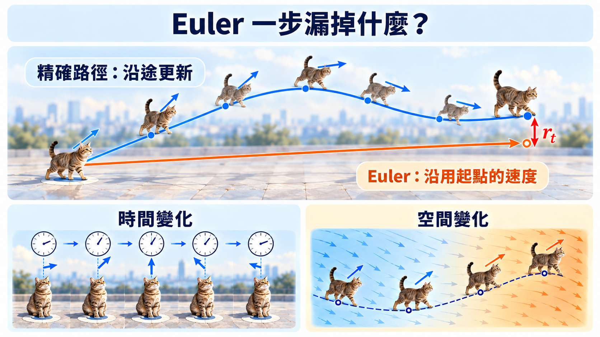
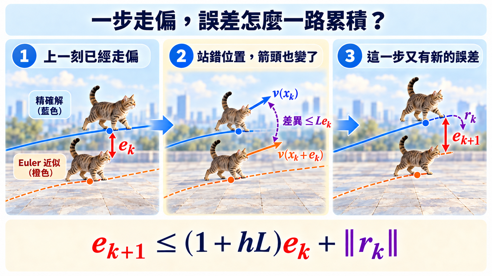

import Objectives from '../../../components/Objectives.astro';
import Prereq from '../../../components/Prereq.astro';
import Ask from '../../../components/Ask.astro';
import Remark from '../../../components/Remark.astro';
import Details from '../../../components/Details.astro';
import Question from '../../../components/Question.astro';
import Answer from '../../../components/Answer.astro';
import QuizBlock from '../../../components/QuizBlock.astro';
import Option from '../../../components/Option.astro';
import Explanation from '../../../components/Explanation.astro';
import VizPlan from '../../../components/VizPlan.astro';
import Bridge from '../../../components/Bridge.astro';
import Ref from '../../../components/Ref.astro';

# Euler 漏掉的 velocity 變化，要怎麼量？

<Objectives>
- **把 trajectory 上的 velocity 變化寫成可以計算的量。** 定義沿著 ODE trajectory 感受到的 acceleration $a_t(x_t)=\partial_t v_t(x_t)+(v_t\cdot\nabla)v_t(x_t)$。
- **從一步誤差推到終點誤差。** 寫出 Euler 的積分餘項，說明步長 $h$ 與加速度積分如何共同控制 finite-step error。
- **分清 reference path 與真正要量的 ODE trajectory。** Reference paths 都是直線，不代表 learned velocity 產生的 trajectories 也有零加速度。
</Objectives>

<Prereq items={frontmatter.prereqs} />

在 <Ref to="dma-fm-vs-diffusion"/> 裡，我們看到 Euler 每走一步，只在起點詢問一次 velocity，接著便假設這一小段的**方向與速度都不會改變**。如果方向轉了，原本的箭頭會帶我們走偏；即使沿著直線前進，只要中途加速或減速，照著舊速度走也會走過頭或走不夠遠。

所以真正要量的不是 geometric curvature，而是：**Euler 忽略了多少 velocity 變化？它累積之後，又會讓終點偏掉多少？**

<Ask>
Velocity 沿 trajectory 改變了多少，能不能寫成一個數？ 
而且那個數真的壓住誤差嗎？
</Ask>

<iframe loading="lazy" src="/personal_website/notes/research_areas/diffusion-models-applications/w5-2-curvature.html" class="demo-frame" title="Euler 步數如何改變 trajectory 與終點：互動 demo" style="height: 720px; width: 100%; border: none;"></iframe>

**互動 demo：同一個起點、同一個 velocity field，只改 Euler 步數。** 拖動黃色起點，再用滑桿調整 Euler 步數。細切的 reference trajectory 不會改變；Euler 每一步只重新確認一次方向，所以步數太少時會直接切過彎曲的路段，終點也會跟著偏離。

## Euler 一步漏掉了什麼？

考慮一個 ground-truth ODE trajectory：

$$
\frac{\mathrm d x_t}{\mathrm d t}=v_t(x_t).
$$

從 $t$ 走到 $t+h$ 的精確位移是

$$
x_{t+h}=x_t+\int_t^{t+h}v_\tau(x_\tau)\,\mathrm d\tau.
$$

Euler 把整段 velocity 都換成在 $t$ 時刻的 $v_t(x_t)$，因此走到 $x_t+h\,v_t(x_t)$。

但這還沒有告訴我們，它和精確解差在哪裡。我們直接把沿著 trajectory 感受到的 acceleration 記成

$$
a_s(x_s):=\frac{\mathrm d}{\mathrm ds}v_s(x_s).
$$

從 $t$ 到任意的中間時刻 $\tau$，velocity 的改變就是這段時間累積的 acceleration：

$$
v_\tau(x_\tau)
=v_t(x_t)+\int_t^\tau \frac{\mathrm d}{\mathrm ds}v_s(x_s)\,\mathrm ds
=v_t(x_t)+\int_t^\tau a_s(x_s)\,\mathrm ds.
$$

把它代回精確位移，再交換兩個積分的順序：

$$
\begin{aligned}
x_{t+h}
&=x_t+h\,v_t(x_t)
+\int_t^{t+h}\int_t^\tau a_s(x_s)\,\mathrm ds\,\mathrm d\tau\\
&=x_t+h\,v_t(x_t)
+\int_t^{t+h}(t+h-s)\,a_s(x_s)\,\mathrm ds.
\end{aligned}
$$

最後那個積分，就是 Euler 這一步沒有算到的部分。它的大小滿足

$$
\left\|x_{t+h}-x_t-hv_t(x_t)\right\|
\le h\int_t^{t+h}\|a_\tau(x_\tau)\|\,\mathrm d\tau.
$$

所以我們要量的，是沿著 trajectory 前進時，velocity 改變得有多快。把 $a_t(x_t)$ 用 chain rule 展開：

$$
a_t(x_t)=\frac{\mathrm d}{\mathrm d t}v_t(x_t)=\underbrace{\partial_t v_t(x_t)}_{\text{場自己在變}}+\underbrace{\big(v_t\cdot\nabla\big)v_t(x_t)}_{\text{粒子換位置了}} .
$$

第一項問的是：站在同一個位置，velocity field 有沒有隨時間改變？第二項問的是：即使場沒有變，粒子走到另一個位置後，看到的 velocity 是否不同？兩個來源加起來，就是粒子實際感受到的加速度。

<Remark label="補充" summary="Acceleration 和 geometric curvature 不一樣">
令 $\rho_t=\left\|\frac{\mathrm d x_t}{\mathrm d t}\right\|$ 是移動速度的大小，$T_t$ 是 trajectory 的單位切線方向，$s$ 是弧長。Geometric curvature 定義成

$$
\kappa_t=\left\|\frac{\mathrm dT_t}{\mathrm ds}\right\|,
$$

它量的是方向**隨弧長**改變多快，不是隨時間轉得多快。Acceleration 則可以拆成

$$
a_t(x_t)
=\frac{\mathrm d\rho_t}{\mathrm dt}T_t
+\rho_t^2\kappa_tN_t.
$$

其中 $N_t$ 是 trajectory 轉彎方向的單位法向量。第一項來自加速或減速，第二項才來自 trajectory 轉彎。因此直線 trajectory 雖然有 $\kappa_t=0$，只要速度大小仍在改變，$a_t(x_t)$ 就不會是零。Euler error 用到的是完整的 acceleration，不是只有 curvature。
</Remark>

只有當 trajectory 是**等速直線**時，$a_t(x_t)=0$，Euler 才不會漏掉任何 velocity 變化，從任意時刻一步走到終點也會精確。

*圖：Euler 沿用起點的 velocity 走完整步；精確路徑則會沿途更新。這個改變可能來自 velocity field 自己隨時間變化，也可能來自粒子移動到不同位置。*

## 一步的誤差怎麼一路帶到終點？

如果第一步走偏，第二步就不只要承受新的 Euler 誤差；我們還會站在錯的位置，查到不同的 velocity。把時間切成 $t_k=kh$，並將 Euler 在 $t_k$ 的位置記成 $\hat x_{t_k}$。兩條 trajectory 在這一刻相差

$$
e_k:=\|x_{t_k}-\hat x_{t_k}\|.
$$

上面已經推得，精確 trajectory 的第 $k$ 步可以寫成

$$
x_{t_{k+1}}
=x_{t_k}+h\,v_{t_k}(x_{t_k})+r_k,
$$

其中 Euler 漏掉的 local remainder 是

$$
r_k=\int_{t_k}^{t_{k+1}}(t_{k+1}-s)a_s(x_s)\,\mathrm ds,\qquad
\|r_k\|\le h\int_{t_k}^{t_{k+1}}\|a_s(x_s)\|\,\mathrm ds.
$$

Euler 自己走的則是

$$
\hat x_{t_{k+1}}
=\hat x_{t_k}+h\,v_{t_k}(\hat x_{t_k}).
$$

兩條式子相減：

$$
x_{t_{k+1}}-\hat x_{t_{k+1}}
=(x_{t_k}-\hat x_{t_k})
+h\big(v_{t_k}(x_{t_k})-v_{t_k}(\hat x_{t_k})\big)
+r_k.
$$

右邊三項分別是：上一刻已經累積的錯位、因為站錯位置而查到的 velocity 差，以及這一步新漏掉的變化。要控制第二項，我們需要假設 $v_t$ 對位置是 $L$-Lipschitz。

<Remark label="補充" summary="$L$-Lipschitz：原本的 input 離得越近，function output 也不會突然差太多">
對任意時刻 $t$ 與兩個位置 $x,y$，如果

$$
\|v_t(x)-v_t(y)\|\le L\|x-y\|,
$$

我們就說 $v_t$ 對位置是 $L$-Lipschitz。這裡 function 的 input 是位置 $x$，output 是 velocity $v_t(x)$。想像地圖上的每個位置都有一支 velocity 箭頭：兩個人只相距 $\delta$，他們看到的箭頭最多相差 $L\delta$。$L$ 越小，附近的箭頭變化得越平順；$L$ 越大，走偏一點就可能查到很不一樣的方向與速度。

這裡限制的是**同一個時刻、不同位置**的 velocity 差；沿時間產生的 velocity 變化，已經包含在 local remainder $r_k$ 裡。
</Remark>

因此，當兩條 trajectory 在 $t_k$ 相差 $e_k$ 時，第二項最多是 $hLe_k$，所以

$$
e_{k+1}\le(1+hL)e_k+\|r_k\|.
$$

*圖：上一刻的錯位會讓下一步在不同位置查到 velocity；舊誤差可能被 flow 放大，再加上這一步新產生的 local remainder。*

現在把這個 recurrence 從 $e_0=0$ 一路展開到 $N=1/h$：

$$
\begin{aligned}
e_N
&\le \sum_{k=0}^{N-1}(1+hL)^{N-1-k}\|r_k\|\\
&\le e^L h\sum_{k=0}^{N-1}
\int_{t_k}^{t_{k+1}}\|a_s(x_s)\|\,\mathrm ds\\
&=e^L h\int_0^1\|a_t(x_t)\|\,\mathrm dt.
\end{aligned}
$$

第二行用的是 $(1+hL)^N\le e^L$。它就是 Grönwall inequality 在這個離散 recurrence 裡的樣子：前面的錯位可能被後續 flow 放大，但在時間區間 $[0,1]$ 上，放大倍數最多收進 $e^L$。

因此，對每一條從同一起點出發的 trajectory，

$$
\boxed{
\|x_1-\hat x_1\|
\le e^L h\int_0^1\|a_t(x_t)\|\,\mathrm dt
}
$$

這條式子把三個因素分開了：

- **$h$ 是我們把時間切得多細。** 步數加倍時，Euler error 會以一階速度下降。
- **加速度積分量的是這條 trajectory 沿途累積了多少 velocity 變化。** 方向改變、加速與減速都會算進去；它越大，同樣步長下漏掉的變化通常越多。
- **$e^L$ 是 velocity field 會不會把小偏差放大的程度。** 兩條 trajectory 的加速度積分相同，場比較陡的那一條仍可能更難積分。

> **對 Euler 而言，真正要量的是沿著 ODE trajectory 累積的 velocity 變化 $\int_0^1\|a_t(x_t)\|\,\mathrm dt$，不是 geometric curvature。**

上面的推導暫時假設我們拿得到 $v_t$。但真正生成時使用的是學到的 $v_\theta$，還要再用 Euler 離散它。因此，終點和目標 $p_1$ 的距離其實有兩個來源：

1. **Modeling error：** $v_\theta$ 和理想的 $v_t$ 不完全相同；
2. **Discretization error：** 即使 $v_\theta$ 已經固定，Euler 也只是在近似它的 continuous ODE。

讓三條路徑從同一個 $X_0\sim p_0$ 出發：

$$
\frac{\mathrm dX_t}{\mathrm dt}=v_t(X_t),\qquad
\frac{\mathrm d\widetilde X_t}{\mathrm dt}=v_\theta(\widetilde X_t,t),\qquad
\widehat X_{t_{k+1}}
=\widehat X_{t_k}+h\,v_\theta(\widehat X_{t_k},t_k).
$$

$X_1$ 是理想 ODE 的終點，$\widetilde X_1$ 是把 learned ODE **精確解完**的終點，$\widehat X_1$ 才是實際用 Euler 得到的終點。將它們的 distributions 分別記成

$$
X_1\sim p_1,\qquad
\widetilde X_1\sim\widetilde p_1,\qquad
\widehat X_1\sim\widehat p_1.
$$

$W_2$ 會在所有 couplings 中尋找平均平方距離最小的一個：

$$
W_2^2(q,r)
=\inf_{\Gamma\in\Pi(q,r)}
\mathbb E_{(Y,\widehat Y)\sim\Gamma}
\|Y-\widehat Y\|^2.
$$

我們讓三條路徑使用相同的 $X_0$，便為每一對終點提供了一個合法 coupling。接著用 $W_2$ 的 triangle inequality 把問題拆開：

$$
\underbrace{W_2(p_1,\widehat p_1)}_{\text{最後真正看到的 gap}}
\le
\underbrace{W_2(p_1,\widetilde p_1)}_{\text{modeling error}}
+
\underbrace{W_2(\widetilde p_1,\widehat p_1)}_{\text{discretization error}}.
$$

### 第一項：$v_\theta$ 和 $v_t$ 的誤差

先定義 <Ref to="dma-unified-equation"/> 看過的 population velocity error：

$$
\mathcal E_v
:=\int_0^1
\mathbb E_{X_t\sim p_t}
\big[\|v_\theta(X_t,t)-v_t(X_t)\|^2\big]\,\mathrm dt.
$$

假設 $v_\theta$ 對位置是 $L$-Lipschitz。比較從同一個 $X_0$ 出發的 $X_t$ 與 $\widetilde X_t$，在 learned velocity 中加減 $v_\theta(X_t,t)$：

$$
\begin{aligned}
\frac{\mathrm d}{\mathrm dt}\|\widetilde X_t-X_t\|
&\le
\|v_\theta(\widetilde X_t,t)-v_t(X_t)\|\\
&\le
\underbrace{\|v_\theta(\widetilde X_t,t)-v_\theta(X_t,t)\|}_{\le L\|\widetilde X_t-X_t\|}
+\underbrace{\|v_\theta(X_t,t)-v_t(X_t)\|}_{\text{velocity prediction error}}.
\end{aligned}
$$

把 prediction error 記成

$$
\delta_t:=\|v_\theta(X_t,t)-v_t(X_t)\|.
$$

Grönwall inequality 把它沿時間累積到終點：

$$
\|\widetilde X_1-X_1\|
\le e^L\int_0^1\delta_t\,\mathrm dt.
$$

將兩邊平方、取 expectation，再用 Cauchy–Schwarz inequality，

$$
\begin{aligned}
\mathbb E\|\widetilde X_1-X_1\|^2
&\le e^{2L}\,
\mathbb E\left[\left(\int_0^1\delta_t\,\mathrm dt\right)^2\right]\\
&\le e^{2L}\int_0^1\mathbb E[\delta_t^2]\,\mathrm dt
=e^{2L}\mathcal E_v.
\end{aligned}
$$

而 $(X_1,\widetilde X_1)$ 是 $p_1$ 與 $\widetilde p_1$ 的一組 coupling，所以

$$
W_2(p_1,\widetilde p_1)
\le e^L\sqrt{\mathcal E_v}.
$$

這一項即使把 ODE 解得再精確也不會消失；它來自模型沒有完全學到 $v_t$。

### 第二項：Euler 對 learned ODE 的誤差

現在把 $v_\theta$ 當成已經固定的 velocity field，將上面的 Euler 推導原封不動地套到它。令

$$
\widetilde a_t(\widetilde X_t)
:=\frac{\mathrm d}{\mathrm dt}v_\theta(\widetilde X_t,t),\qquad
\widetilde A(X_0)
:=\int_0^1\|\widetilde a_t(\widetilde X_t)\|\,\mathrm dt.
$$

同樣讓精確 learned ODE 與 Euler 使用相同的 $X_0$。把前面的 pathwise bound 代入 $W_2$ 定義：

$$
\begin{aligned}
W_2^2(\widetilde p_1,\widehat p_1)
&\le\mathbb E\|\widetilde X_1-\widehat X_1\|^2\\
&\le e^{2L}h^2\mathbb E[\widetilde A(X_0)^2],
\end{aligned}
$$

也就是

$$
W_2(\widetilde p_1,\widehat p_1)
\le e^L h
\Big(\mathbb E[\widetilde A(X_0)^2]\Big)^{1/2}.
$$

這一項會隨步長 $h$ 縮小；它才是本篇正在分析的 finite-step error。

把兩項合起來：

$$
\boxed{
W_2(p_1,\widehat p_1)
\le e^L
\left[
\sqrt{\mathcal E_v}
+h\Big(\mathbb E[\widetilde A(X_0)^2]\Big)^{1/2}
\right].
}
$$

所以，**把 trajectory 變直、把步數增加，只能壓低 discretization error；如果 $v_\theta$ 本身沒有學準，終點仍然會留下 modeling error。** 反過來，training loss 很小也不代表少步生成一定準，因為 Euler 還可能漏掉 learned trajectory 沿途的 velocity 變化。

這些 coupling 都使用相同的 $X_0$，因此只提供 $W_2$ 的上界。$W_2$ 可以在所有 couplings 裡另找更便宜的配對，所以 $W_2$ 很小時，逐條 trajectory 的誤差仍不一定小；這正是 <Ref to="dma-what-are-we-learning"/> Q2 的那個坑。

## 消化一下

<QuizBlock id="w5-2-a">
Euler 誤差上界裡，哪一個量直接記錄 trajectory 沿途的 velocity 變化？
<Option>Lipschitz 常數 $L$。</Option>
<Option correct>$\int_0^1\|a_t(x_t)\|\,dt$。</Option>
<Option>步長 $h$。</Option>
<Explanation>
$L$ 是速度場的正則性、$h$ 是計算預算；加速度積分才直接累積 trajectory 上的 velocity 變化。等速直線時它是零，但沿直線加速或減速時仍不會是零。
</Explanation>
</QuizBlock>

<QuizBlock id="w5-2-b">
$(v_t\cdot\nabla)v_t$ 這一項在說什麼？
<Option>速度場隨時間的變化。</Option>
<Option correct>粒子移動到新位置之後，看到的速度和原位置的差。</Option>
<Option>速度場的散度。</Option>
<Explanation>
這是 material derivative 的空間項。即使速度場完全不隨 $t$ 變，只要它在空間上不均勻，粒子照樣會加速。
</Explanation>
</QuizBlock>

<QuizBlock id="w5-2-c">
下列哪一句正確？
<Option>只要 reference paths 是直線，Euler 一步就精確。</Option>
<Option correct>Euler error 要看 learned ODE trajectory 的加速度，而不是 reference path 的加速度。</Option>
<Option>只要步長固定，velocity field 的正則性不會影響誤差。</Option>
<Explanation>
Reference paths 只提供 regression labels。真正生成時跟隨的是 conditional expectation 形成的 velocity field，它沿 trajectory 仍可能不斷改變。
</Explanation>
</QuizBlock>

<QuizBlock id="w5-2-d">
兩個 velocity fields 的加速度積分相同，但其中一個的 $C_L$ 大很多。哪一個結論最合理？
<Option>兩者 Euler error 一定相同。</Option>
<Option correct>$C_L$ 較大的 field 可能把相同的局部偏差放得更大。</Option>
<Option>加速度積分已經包含 $C_L$，所以不必分開。</Option>
<Explanation>
誤差上界同時包含步長、加速度積分與 field 的穩定性。加速度積分不是唯一決定 finite-step error 的量。
</Explanation>
</QuizBlock>

<Bridge to="dma-rectified-flow">
現在問題已經很具體：想讓 Euler 用少量步數也走得準，就要讓 learned velocity 沿著 trajectory 少一點變化。

<Ref to="dma-fm-vs-diffusion"/> 顯示，這些轉向經常來自 reference paths 的交叉與平均。那我們能不能利用已經訓好的 ODE，重新產生一組比較不容易互相打架的配對？
</Bridge>

## 參考文獻

1. Hairer, E., Nørsett, S. P., Wanner, G. [*Solving Ordinary Differential Equations I: Nonstiff Problems.*](https://link.springer.com/book/10.1007/978-3-540-78862-1) Springer. （Euler 的局部／全域誤差與 Grönwall 論證的標準參考。）
2. Liu, X., Gong, C., Liu, Q. [*Flow Straight and Fast: Learning to Generate and Transfer Data with Rectified Flow.*](https://arxiv.org/abs/2209.03003) ICLR 2023. （把「軌跡有多直」當成要優化的量，下一篇的主線。）
