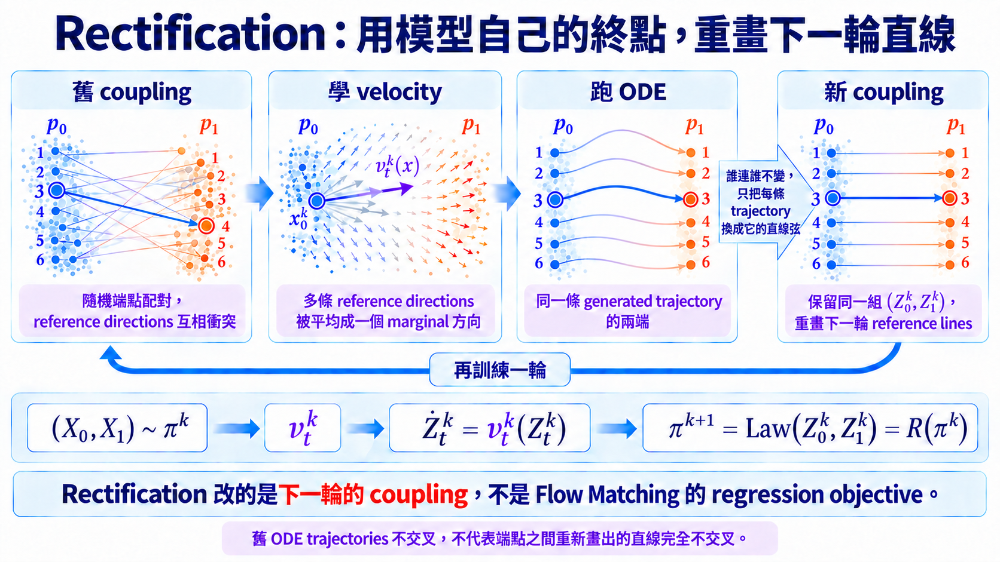

import Objectives from '../../../components/Objectives.astro';
import Prereq from '../../../components/Prereq.astro';
import Ask from '../../../components/Ask.astro';
import Remark from '../../../components/Remark.astro';
import Details from '../../../components/Details.astro';
import Question from '../../../components/Question.astro';
import Answer from '../../../components/Answer.astro';
import QuizBlock from '../../../components/QuizBlock.astro';
import Option from '../../../components/Option.astro';
import Explanation from '../../../components/Explanation.astro';
import VizPlan from '../../../components/VizPlan.astro';
import Bridge from '../../../components/Bridge.astro';
import Ref from '../../../components/Ref.astro';

# 拉直（一）：讓模型自己生出配對

<Objectives>
- **寫出一輪 rectification。** 從舊配對學速度、跑 ODE，再把同一起點與新終點當成下一輪配對。
- **說出 rectification 保證什麼。** 在理想 velocity 與精確 ODE 下，新配對保留兩端 marginals，而且不增加任何凸 transport cost。
- **分清 straightness 的保證與限制。** 前 $K$ 輪中至少有一輪的 $S+V$ 降到 $O(1/K)$；這不代表每輪單調改善，也不代表最後得到 OT coupling。
</Objectives>

<Prereq items={frontmatter.prereqs} />

## 能不能讓已經學到的路，教下一輪走得更直？

<Ref to="dma-error-theory"/> 把少步取樣的問題寫成了一個具體目標：讓 learned velocity 沿著 ODE trajectory 少一點變化。<Ref to="dma-fm-vs-diffusion"/> 也給了第一個線索：reference paths 交叉得越嚴重，同一個位置要平均的速度越不一致，learned velocity 就越容易沿途改變。

那配對可以從哪裡來？想像散場後，我們已經讓每個人照目前的導航走過一次。現在起點與實際抵達的位置都有了；與其再隨機替他指定一個終點，不如把**同一個人的起點與終點重新配在一起**，再畫一條直線作為下一輪的 reference path。

在數學上，這條「已經走過的路」就是目前模型產生的 ODE trajectory，而 ODE trajectories 在解唯一時不會相交。把它們的兩端配回去，得到的 reference paths 通常會比原本的獨立配對整齊。

<Ask>
能不能拿模型自己的取樣結果， 
當成下一輪訓練的配對？
</Ask>

## 把模型產生的端點配回去

給一個 coupling $(X_0,X_1)\sim\pi$；第一輪通常從獨立配對開始。接著做三件事：

1. 照 <Ref to="dma-fm-vs-diffusion"/> 的直線插值 $X_t=(1-t)X_0+tX_1$，得到邊際速度 $v_t(x)=\mathbb E[X_1-X_0\mid X_t=x]$。
2. 解 ODE $\dot Z_t=v_t(Z_t)$、$Z_0=X_0$，走到 $t=1$ 得到 $Z_1$。
3. 把 $(Z_0,Z_1)$ 當成**新的**耦合：$\pi'=\mathsf R(\pi)$。

這個「學 velocity、跑 ODE、把兩端配回去」的運算叫 **rectification**。把輸出的 coupling 再送回下一輪，$\pi^{k+1}=\mathsf R(\pi^k)$，就是 **reflow**。

$\mathsf R$ 的輸入與輸出都是 coupling。它沒有改 Flow Matching 的 objective；改的是下一輪要從哪些 $(X_0,X_1)$ 製造 reference paths。

## 為什麼新的端點還能拿來訓練？

新的配對如果改掉了終點 distribution，下一輪就會開始學錯資料。因此第一個要檢查的不是直不直，而是它仍不仍然連接 $p_0$ 與 $p_1$。

**（一）保留 marginals。** $Z_0\sim p_0$ 是定義；在理想 velocity 與精確 ODE 下，<Ref to="dma-conditional-flow-matching"/> 已經證明 $Z_t$ 與 reference process $X_t$ 在每個時刻都有相同的 marginal，所以 $Z_1\sim p_1$。因此 $\mathsf R(\pi)$ 仍然是 $p_0$ 與 $p_1$ 的合法 coupling，可以送進下一輪。

**（二）不增運輸成本。** 對任何凸函數 $c$，

$$
\mathbb E\big[c(Z_1-Z_0)\big]\ \le\ \mathbb E\big[c(X_1-X_0)\big].
$$

取 $c(a)=\|a\|^2$ 時，意思就是：**新配對兩端的平均位移平方不會比舊配對更大。**

$Z_1-Z_0=\int_0^1 v_t(Z_t)\,dt$，而 $v_t(Z_t)=\mathbb E[X_1-X_0\mid X_t=Z_t]$。

先對時間用 Jensen（$c$ 是凸的，$\int_0^1\cdot\,dt$ 是一個平均）：

$$
c\Big(\int_0^1 v_t(Z_t)\,dt\Big)\ \le\ \int_0^1 c\big(v_t(Z_t)\big)\,dt .
$$

再對條件期望用 Jensen：$c(\mathbb E[X_1-X_0\mid X_t])\le\mathbb E[c(X_1-X_0)\mid X_t]$。最後取期望，並用 $Z_t$ 與 $X_t$ 同分布（性質一的推論）把兩邊接起來：

$$
\mathbb E\big[c(Z_1-Z_0)\big]\le\int_0^1\mathbb E\big[c(X_1-X_0)\big]\,dt=\mathbb E\big[c(X_1-X_0)\big].\qquad\square
$$

兩次 Jensen 各對付一個「取平均」：一次是沿時間平均，一次是對後驗平均。

**（三）產生有結構的 coupling。** $Z_t$ 是 ODE 的解；在解唯一時，兩條 trajectories 不會在同一時間、同一位置相交後再分開。因此 $(Z_0,Z_1)$ 不再是任意配對，而是同一條 ODE trajectory 的兩端。

不過，下一輪訓練使用的是兩端之間重新畫出的**直線**，不是原本那條彎曲 trajectory。這些直線弦仍可能互相交叉，所以一次 rectification 不一定就會完全拉直。

<iframe loading="lazy" src="/personal_website/notes/research_areas/diffusion-models-applications/w5-3-reflow.html" class="demo-frame" title="Reflow：讓模型自己生出配對：互動 demo" style="height: 1060px; width: 100%; border: none;"></iframe>

**互動 demo：reflow 一輪一輪看。** 按 0 → 1 → 2 → 3。第 0 輪的配對直線交錯成一團，ODE 軌跡明顯彎；第 1 輪之後，reference directions 的 disagreement $V$ 從約 1.4 掉到 0.03，1 步 Euler 的誤差從約 1.4 掉到 0.1，transport cost 則從約 4.0 掉到 0.6。這組 toy 裡第一輪就吃掉大部分改善；終點分布的距離則一直在 0.01 以下。

## Reflow 真的會越來越直嗎？

先把 flow 的 straightness 寫成一個數。對 rectification 產生的 ODE process $Z_t$，定義

$$
S(Z)=\int_0^1\mathbb E\big[\|(Z_1-Z_0)-\dot Z_t\|^2\big]\,\mathrm dt.
$$

這裡比較的是：粒子此刻的 velocity $\dot Z_t$，和從起點直達終點所需的固定 velocity $Z_1-Z_0$，相差多少。$S(Z)=0$ 時，每一條 ODE trajectory 都以固定速度走直線，因此一步 Euler 就能精確走到 $Z_1$。

論文還需要另一個量，來描述下一輪 reference lines 在同一個位置給出的方向是否一致：

$$
V(\pi)=\int_0^1\mathbb E\!\left[
\left\|(X_1-X_0)-\mathbb E[X_1-X_0\mid X_t]\right\|^2
\right]\mathrm dt.
$$

它正是 velocity regression 在理想最佳解下仍剩下的 conditional variance：同一個 $X_t$ 附近如果有很多不同方向，$V(\pi)$ 就大；方向完全一致時，它就是零。

Liu et al. [1] 對 reflow 證明

$$
\sum_{k=0}^{K}\Big(S(Z^{k+1})+V(\pi^k)\Big)
\le \mathbb E_{\pi^0}\|X_1-X_0\|^2.
$$

右邊是一個固定的初始預算，左邊則把每一輪剩下的「trajectory 不直」與「reference directions 不一致」加起來。因此前 $K$ 輪中，至少有一輪滿足 $S+V=O(1/K)$。

這個保證說的是「前 $K$ 輪中至少有一輪」，**不是每一輪的 $S$ 都一定單調下降**，也沒有說最後一定得到某個指定成本下的 OT coupling。

<Remark label="補充" summary="straightness 和加速度積分怎麼連起來">
$S(Z)$ 與 <Ref to="dma-error-theory"/> 的 $\int\|a_t(Z_t)\|\,dt$ 不是同一個公式，但它們共享同一個「等速直線」的情況。

$S(Z)=0$ 時 $\dot Z_t=Z_1-Z_0$ 是一個**不隨 $t$ 變**的常向量，於是

$$
a_t(Z_t)=\frac{\mathrm d}{\mathrm d t}v_t(Z_t)=\frac{\mathrm d}{\mathrm d t}(Z_1-Z_0)=0 ,
$$

加速度積分也會是零。反過來在一般情況下，兩個數值不必一致：$S$ 比較當下 velocity 與端點位移，加速度積分則量沿途累積了多少 velocity 變化——方向改變、加速與減速都包含在內。Reflow 的定理直接控制的是 $S+V$；它如何影響 finite-step error，還要接上 <Ref to="dma-error-theory"/> 的分析。
</Remark>

## 理論沒有替實際模型保證什麼？

上面的性質是在**理想 velocity、精確 ODE solution** 下成立的。真正實作 reflow 時，第 $k$ 輪的配對來自第 $k-1$ 輪學到的 neural velocity，再經過 numerical solver 產生終點；模型誤差與 finite-step error 都會一起進入下一輪訓練資料。上面 demo 使用精確場，因此顯示的是理想情況，不是每次重訓都會複製的改善幅度。

此外，不增加 convex transport cost 並不等於找到 OT。Rectification 同時不增加所有凸成本，卻沒有針對其中一個指定成本做最佳化；除了特殊情況，reflow 的極限不必是二次成本的 optimal coupling。

<Question id="Q1">
ODE trajectories 在解唯一時不會互相交叉。既然 reflow 把同一條 trajectory 的起點與終點配在一起，**為什麼一次 rectification 之後還可能不夠直？**

<Answer>
因為下一輪並不沿著原本的 ODE trajectories 訓練，而是只保留它們的端點，再重新畫直線：

$$
I_t=(1-t)Z_0+tZ_1.
$$

兩條彎曲的 ODE trajectories 可以互不相交，但連接各自端點的兩條弦仍然可能相交。到了交叉處，下一輪的 optimal velocity 又得平均不同方向，所以新的 ODE trajectory 仍可能轉彎。

Rectification 做的是把原本「隨機抓的端點」換成「同一條 ODE trajectory 的兩端」。這通常已經會大幅減少交叉，卻不保證一次就把 $V(\pi)$ 壓到零；因此才有把輸出再送回去的 reflow。
</Answer>
</Question>

*圖：Rectification 是一個迴圈。從配對學出速度場、跑 ODE 取得新終點，再用新配對重訓，交叉的軌跡便逐輪拉直。*

## 消化一下

<QuizBlock id="w5-3-a">
Rectification 為什麼保邊際？
<Option>因為它是線性運算。</Option>
<Option correct>因為 $Z_1$ 是由生成 $p_t$ 的速度場積分到 $t=1$ 得到的，所以 $Z_1\sim p_1$。</Option>
<Option>因為它假設 $\pi$ 已經是 OT。</Option>
<Explanation>
這是 <Ref to="dma-conditional-flow-matching"/> 定理 1 的直接應用。沒有這條性質，$\mathsf R(\pi)$ 就不能再當配對餵回去，整個迭代也就不存在。
</Explanation>
</QuizBlock>

<QuizBlock id="w5-3-b">
$S(Z)=0$ 代表什麼？
<Option>端點 coupling 一定是 OT。</Option>
<Option correct>沿每一條 ODE trajectory，當下 velocity 都等於端點位移，所以一步 Euler 精確。</Option>
<Option>$p_0=p_1$。</Option>
<Explanation>
**直不等於最省。** $S=0$ 只代表 ODE trajectories 是等速直線，transport cost 不一定是指定成本下的最小值。
</Explanation>
</QuizBlock>

<QuizBlock id="w5-3-c">
為什麼一次 rectification 之後，新的 reference lines 仍可能交叉？
<Option>因為 ODE trajectories 本身會在同一時刻交叉。</Option>
<Option correct>因為下一輪連的是 trajectories 的兩端；不交叉的曲線，其端點弦仍可能相交。</Option>
<Option>因為 rectification 改掉了 $p_1$。</Option>
<Explanation>
Reflow 保留的是端點 coupling，不是整條舊 trajectory。重新畫出的直線仍可能有交叉，所以可能需要下一輪再調整。
</Explanation>
</QuizBlock>

<QuizBlock id="w5-3-d">
關於 demo 顯示的數字，下列哪一句**不對**？
<Option>第一輪的改善遠大於後面幾輪。</Option>
<Option>終點分布與資料的距離幾乎沒有變大。</Option>
<Option correct>因為 demo 用的是精確算出來的場，所以實際訓練也會得到同樣的改善幅度。</Option>
<Explanation>
精確場等於「網路完美、取樣無誤差」，所以 demo 顯示的是**上限**。實際上每一輪的配對都帶著上一輪的模型誤差與數值誤差，這正是實務上只做一到兩輪的原因。
</Explanation>
</QuizBlock>

<Bridge to="dma-minibatch-ot">
Reflow 證明了改配對確實能拉直，但每次都要先訓模型、跑完整條 ODE，還會把上一輪誤差帶進新資料。能不能跳過這個迴圈，在每個 batch 當下就選一組比較不交錯的配對？下一篇把問題直接寫成 OT。
</Bridge>

## 參考文獻

1. Liu, X., Gong, C., Liu, Q. [*Flow Straight and Fast: Learning to Generate and Transfer Data with Rectified Flow.*](https://arxiv.org/abs/2209.03003) ICLR 2023. （rectification 運算、三個性質、straightness 與 $O(1/K)$ 的收斂。）
2. Liu, X., et al. [*InstaFlow: One Step is Enough for High-Quality Diffusion-Based Text-to-Image Generation.*](https://arxiv.org/abs/2309.06380) ICLR 2024. （把 reflow 推到文字生圖上、真的做到一步。）
3. Esser, P., et al. [*Scaling Rectified Flow Transformers for High-Resolution Image Synthesis.*](https://arxiv.org/abs/2403.03206) ICML 2024. （大規模用線性路徑訓練的實務細節；注意它並沒有做 reflow 迭代。）
