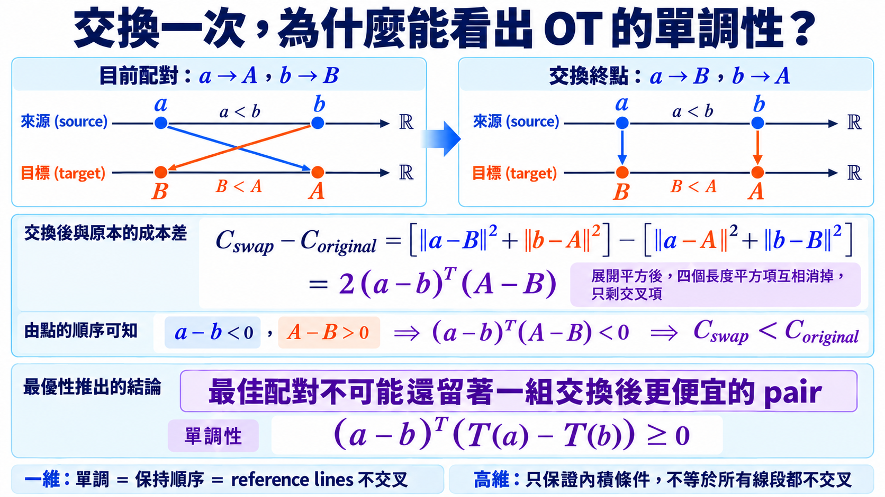

import Objectives from '../../../components/Objectives.astro';
import Prereq from '../../../components/Prereq.astro';
import Ask from '../../../components/Ask.astro';
import Remark from '../../../components/Remark.astro';
import Details from '../../../components/Details.astro';
import Question from '../../../components/Question.astro';
import Answer from '../../../components/Answer.astro';
import QuizBlock from '../../../components/QuizBlock.astro';
import Option from '../../../components/Option.astro';
import Explanation from '../../../components/Explanation.astro';
import VizPlan from '../../../components/VizPlan.astro';
import Bridge from '../../../components/Bridge.astro';
import Ref from '../../../components/Ref.astro';

# 拉直（二）：不依靠反覆訓練，能不能用別的方法決定好的 coupling？

<Objectives>
- **用交換兩個終點的計算推出 OT 單調性。** 分清一維的零交叉與高維的單調條件。
- **寫出 minibatch OT-CFM 的訓練步驟。** 在 batch 內解指派並重排資料，其餘 CFM 不變。
- **分清 marginals 正確與 coupling 最佳。** 小 batch 仍保留兩端 distributions，但只在 batch 內最佳；高維時還要確認選用的距離是否真的有辨別力。
</Objectives>

<Prereq items={frontmatter.prereqs} />

## Reflow 的迴圈可以省掉嗎？

<Ref to="dma-rectified-flow"/> 先訓練模型、解完整條 ODE，再用新的端點重訓。這會產生比較有結構的 coupling，但每一輪都要重新取樣與訓練，而且上一輪的模型誤差也會一起進入新配對。

如果目標只是讓 reference directions 少一點衝突，一個更直接的想法是：**在 training 當下，看著這一批起點與終點，立刻替它們找一組比較合理的配對。**

「合理」需要一個可以計算的標準。沿用 <Ref to="dma-what-are-we-learning"/> 的搬貨問題，最自然的第一個選擇是讓配對後的總位移平方最小，也就是 optimal transport（OT）。

<Ask>
讓總位移最小的 coupling，<br />
也會讓 reference directions 少一點互相打架嗎？
</Ask>

## 交換一次就看出來了

在一維裡，答案就是「會」；到了高維，更精確的結論叫做**單調性**。理由只需要交換兩個終點。

假設某個配對把 $a$ 送到 $A$、把 $b$ 送到 $B$。如果**交換終點**（$a\to B$、$b\to A$），二次成本的變化是

$$
\big(\|a-B\|^2+\|b-A\|^2\big)-\big(\|a-A\|^2+\|b-B\|^2\big)=2\,(a-b)^\top(A-B).
$$

（展開之後 $\|a\|^2,\|b\|^2,\|A\|^2,\|B\|^2$ 全部消掉，只剩交叉項。）

所以：**如果 $(a-b)^\top(A-B) \lt 0$，交換一定更省。** 一個最佳的配對不可能還有這種可以改進的對，於是它必須滿足

$$
(a-b)^\top\big(T(a)-T(b)\big)\ \ge\ 0\qquad\text{對所有配對成立}.
$$

這就是**單調**。在一維，單調等於依照位置順序配對，reference lines 不會交叉。高維裡沒有同一條左右順序可以使用，因此單調不等於「所有線段都不相交」；它只保證不存在上面那種交換後立刻變便宜的兩組配對。

<Remark label="補充" summary="Brenier 定理說了什麼">
在 $p_0$ 有密度、二次成本的條件下，OT 耦合其實是一個**確定映射** $X_1=T(X_0)$，而且 $T=\nabla\varphi$ 是某個凸函數的梯度。凸函數的梯度天生單調，這是上面那個不等式的另一種來源。

</Remark>

在二次成本、regularity 條件成立，而且真的拿得到全域 OT map 時，線性 interpolation 會形成 dynamic OT 的 constant-speed paths。這些 paths 可以直接由對應的 velocity field 產生，因此一步 Euler 就能精確走完。

但真實資料量很大。若直接在 $n$ 個起點與 $n$ 個終點之間建立成本矩陣，再解完整的指派問題，儲存與計算都會隨 $n$ 快速成長。我們需要一個只看小部分樣本的近似。

## 只在目前的 batch 裡配對

Tong 等人的 OT-CFM [1] 與 Pooladian 等人的 multisample FM [2] 採用的做法是：**只在目前的 batch 裡解 OT。**

```
repeat
  x1 ← B 個資料樣本
  x0 ← B 個噪聲樣本
  C  ← 成本矩陣  C[i,j] = ‖x0[i] − x1[j]‖²
  σ  ← 解指派問題  argmin_σ Σ_i C[i, σ(i)]     # scipy.optimize.linear_sum_assignment
  x1 ← x1[σ]                                    # 重排，讓 x0[i] 對到 x1[σ(i)]
  之後與 conditional flow matching 完全相同：抽 t、算 xt、target = x1 − x0
```

和原本 CFM 相比，真正新增的是「解指派」與「依指派重排終點」兩步。常見的精確指派演算法成本約為 $O(B^3)$；batch 較大時，可以改用 Cuturi 的 Sinkhorn 近似 [3]。

<iframe loading="lazy" src="/personal_website/notes/research_areas/diffusion-models-applications/w5-4-batch-ot.html" class="demo-frame" title="Batch 內解一次 OT：互動 demo" style="height: 970px; width: 100%; border: none;"></iframe>

**互動 demo：batch 內解一次 OT。** 從「獨立」按到「192（全域）」，這組 2D toy 裡的線段交叉比例約為 **20% → 9% → 4% → 1.4% → 0.6%**，1 步 Euler error 約為 **1.5 → 0.77 → 0.41 → 0.21 → 0.08**。Batch 越大，每個起點可以比較的候選終點越多；改善逐漸變小，但不會在某個固定 batch size 突然結束。

> **OT 配對真正保證的是「單調」，不是「不交叉」。**

一維的單調等於零交叉；高維只保證上面的內積條件，不能直接推出「零交叉」。Demo 顯示的是這個 2D toy 裡交叉比例也跟著下降。

## 兩端 distributions 沒變，差別在中間怎麼連

Batch 內重排只是一個**置換**：$x_0$ 與 $x_1$ 的樣本集合都沒有變，只有誰和誰配在一起。因此每個 batch 的兩端 empirical marginals 都保持不變；把抽 batch 的隨機性一起考慮後，$\pi_B$ 仍然是 $p_0$ 與 $p_1$ 的合法 coupling。理想 CFM velocity 最後仍會抵達 $p_1$。

和全域 OT 的差別在 coupling：一個 batch 裡的 $x_0$ 只能選同一批中的 $x_1$。Batch 小時候選者少，reference directions 仍可能互相衝突；在適當條件下，batch size 增加時才會逐漸接近全域 OT construction。

所以，minibatch OT 不是要改變終點 distribution，而是希望減少 reference velocities 的衝突，讓 learned velocity 沿 trajectory 少一點變化。若加速度積分因此變小，同一個 solver、同樣的步長下，finite-step error 的上界也會跟著下降；但 solver 本身的階數並沒有改變。

這一點和 reflow 不同：minibatch OT 不必先用上一輪 neural ODE 產生終點，因此不會把上一輪模型與 solver 的誤差寫進配對。

## reflow 與 minibatch OT，差在哪？

| | Reflow | Minibatch OT |
|---|---|---|
| 改配對的時機 | 訓完一輪之後 | 每個 batch 當下 |
| 額外計算 | 整輪 ODE 取樣 ＋ 重訓 | 每 batch 一次 $O(B^3)$ 指派 |
| 實作中的終點 | 受上一輪模型與 solver 誤差影響 | batch 內只是置換，不會因配對改變 |
| 理論保證 | 前 $K$ 輪至少一輪有 $S+V=O(1/K)$；不一定是 OT | 適當條件下，coupling size 增加時接近 OT construction |
| 對模型的依賴 | 新配對來自上一輪 neural ODE | 配對只依賴目前 batch 與成本函數 |
| 高維的困難 | 要重新訓練與取樣 | 成本使用的距離可能失去辨別力 |

<Question id="Q1">
Minibatch OT 的效果取決於成本矩陣能不能分出「比較適合的終點」。到了高維，**直接使用 Euclidean distance 時，為什麼這件事可能變難？**

<Answer>
一個重要的警訊是高維距離集中。先看最容易算的例子：取兩個獨立的 $x_0,x_1\sim\mathcal N(0,I_d)$，則

$$
\mathbb E\|x_0-x_1\|^2=2d,\qquad \operatorname{Var}\big(\|x_0-x_1\|^2\big)=8d .
$$

所以相對標準差是 $\sqrt{8d}/(2d)=\sqrt{2/d}$——**$d$ 越大，所有兩兩距離越接近同一個值**。$d=2$ 時是 100%，$d=3072$ 時只剩 2.5%。

在這個例子裡，$d$ 越大，所有兩兩距離就越接近同一個值。成本矩陣如果接近常數，「最佳指派」和「隨機指派」的差距自然會縮小。

這不是說所有高維資料都一定如此；真實資料不會是兩組獨立 Gaussian，而且資料通常集中在較低維的結構上。它真正提醒我們的是：**minibatch OT 是否有效，不只取決於 batch size，也取決於成本函數有沒有表達我們在意的相似性。**

- 若 raw pixel distance 幾乎沒有辨別力，可以改在較有語意的 representation space 定義成本。
- Batch size 增加會提供更多候選者，但如果成本本身分不出好壞，單純加大 batch 也不會自動解決問題。

這也是 reflow 與 minibatch OT 的另一個差別：reflow 用 neural ODE 產生 coupling；minibatch OT 則把所有判斷交給指定的 cost。
</Answer>
</Question>



*圖：交換一次，就看出單調。在一維，交叉配對交換終點後會更短；高維對應的必要條件是 $(a-b)^\top(A-B)\ge0$。*

## 消化一下

<QuizBlock id="w5-4-a">
OT 配對為什麼是單調的？
<Option>因為 OT 耦合是獨立的。</Option>
<Option correct>因為交換任何一對終點會讓成本改變 $2(a-b)^\top(A-B)$，所以最佳解不可能存在 $(a-b)^\top(A-B) \lt 0$ 的對。</Option>
<Option>因為 OT 只在一維成立。</Option>
<Explanation>
一行展開就得到那個差值，剩下的是「最佳解沒有可改進的地方」。Brenier 定理（$T=\nabla\varphi$、凸函數梯度）是同一件事的另一種說法。
</Explanation>
</QuizBlock>

<QuizBlock id="w5-4-b">
用很小的 $B$（例如 $B=4$）做 minibatch OT 訓練，終點分布會怎樣？
<Option>偏離 $p_1$，因為配對不是全域最佳。</Option>
<Option correct>仍然是 $p_1$。只是 learned velocity 通常比大 $B$ 時變化得更劇烈，少步取樣的誤差比較大。</Option>
<Option>塌到少數幾個點上。</Option>
<Explanation>
batch 內重排是一個置換，兩邊的樣本集合都沒動，所以保邊際。$B$ 影響的是 reference velocities 的衝突，以及 learned velocity 沿 trajectory 的變化，不是兩端的 distributions。
</Explanation>
</QuizBlock>

<QuizBlock id="w5-4-c">
高維時，直接用 Euclidean distance 做 minibatch OT 可能變弱，這個 Gaussian toy 提醒我們檢查什麼？
<Option>指派問題太貴。</Option>
<Option correct>兩兩距離可能集中，讓成本矩陣難以分辨哪些終點更適合。</Option>
<Option>高維下 OT 不存在。</Option>
<Explanation>
在兩端都是 independent Gaussian 的例子裡，相對標準差是 $\sqrt{2/d}$。這不是所有資料的定理，而是一個提醒：要檢查成本函數在使用的 representation 裡是否有辨別力。
</Explanation>
</QuizBlock>

<QuizBlock id="w5-4-d">
下列哪一句話同時對 reflow 與 minibatch OT 都成立？
<Option>兩者都需要多訓一輪。</Option>
<Option>兩者的極限都是全域 OT。</Option>
<Option correct>兩者都重新設計 coupling，並繼續用直線 interpolation 製造 training paths。</Option>
<Explanation>
Reflow 要多訓一輪、minibatch OT 不用；reflow 的保證也不是收斂到全域 OT。共同點是它們都從 coupling 下手，減少同一位置附近互相衝突的 reference directions。
</Explanation>
</QuizBlock>

<Bridge to="dma-shared-techniques">
Reflow 與 minibatch OT 都在修改 coupling，希望讓 learned ODE trajectory 更接近等速直線。但實際模型的 velocity 仍可能沿途改變，而且我們也不一定有重新訓練模型的條件。

如果 trajectory 已經固定，下一個能改的就是解 ODE 的方法：**同樣只能詢問有限次 neural velocity，能不能比 Euler 更準，並且在方向或速度大小快速改變時自己縮小步長？**
</Bridge>

## 參考文獻

1. Tong, A., Fatras, K., Malkin, N., Huguet, G., Zhang, Y., Rector-Brooks, J., Wolf, G., Bengio, Y. [*Improving and Generalizing Flow-Based Generative Models with Minibatch Optimal Transport.*](https://arxiv.org/abs/2302.00482) TMLR 2024. （OT-CFM；這一篇的主線。）
2. Pooladian, A.-A., Ben-Hamu, H., Domingo-Enrich, C., Amos, B., Lipman, Y., Chen, R. T. Q. [*Multisample Flow Matching: Straightening Flows with Minibatch Couplings.*](https://arxiv.org/abs/2304.14772) ICML 2023. （同一個想法的另一條線，含 batch size 的分析。）
3. Cuturi, M. [*Sinkhorn Distances: Lightspeed Computation of Optimal Transport.*](https://arxiv.org/abs/1306.0895) NeurIPS 2013. （batch 太大時用的熵正則化近似。）
