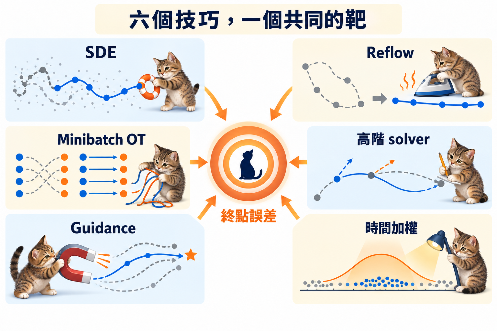

import Objectives from '../../../components/Objectives.astro';
import Prereq from '../../../components/Prereq.astro';
import Ask from '../../../components/Ask.astro';
import Remark from '../../../components/Remark.astro';
import Details from '../../../components/Details.astro';
import Question from '../../../components/Question.astro';
import Answer from '../../../components/Answer.astro';
import QuizBlock from '../../../components/QuizBlock.astro';
import Option from '../../../components/Option.astro';
import Explanation from '../../../components/Explanation.astro';
import VizPlan from '../../../components/VizPlan.astro';
import Bridge from '../../../components/Bridge.astro';
import Ref from '../../../components/Ref.astro';

# 共用技巧：guidance、高階 solver、時間加權

<Objectives>
- **寫出 classifier-free guidance 的 score／velocity 形式。** 說出 $w>1$ 是刻意改變生成動力，不是更精確地取樣原條件分布。
- **用 NFE 比較 Euler、Heun 與 DPM-Solver。** 說出高階方法降低哪一項誤差，又多付幾次網路評估。
- **分清時間取樣與 loss weighting。** 沒有 importance correction 時會改 objective；有 correction 時只改 Monte Carlo estimator。
</Objectives>

<Prereq items={frontmatter.prereqs} />

## 路徑決定了，有限預算還能花在哪裡？

配對與路徑決定「理想上要走哪裡」，但真正生成時還有三種常見需求：條件要更明顯、步數要更少、有限訓練預算要放在更有用的時刻。它們分別帶出 guidance、solver 與時間取樣。

在 Gaussian 路徑上，score 與 velocity 只是兩套座標，所以同一個技巧不必解釋兩次；<Ref to="dma-error-theory"/> 的誤差式則讓我們看出，每個選擇究竟改了哪一項成本。

<Ask>
這三個技巧在三份不同的論文裡、用三套不同的語言寫， 
有沒有一個說法可以一次講完？
</Ask>

## Classifier-free guidance

條件生成的做法是學 $u_t(x\mid c)$（或 $s_t(x\mid c)$），訓練時以一定機率把條件 $c$ 換成空條件 $\varnothing$，讓**同一個網路**同時學到條件與無條件兩個版本。取樣時把兩者外推：

$$
\tilde s_t(x\mid c)=s_t(x\mid\varnothing)+w\big(s_t(x\mid c)-s_t(x\mid\varnothing)\big),\qquad
\tilde u_t(x\mid c)=u_t(x\mid\varnothing)+w\big(u_t(x\mid c)-u_t(x\mid\varnothing)\big).
$$

這兩式在 Gaussian 路徑下是**同一件事**：<Ref to="dma-linear-path"/> 說 $u$ 是 $x$ 與 $s$ 的線性組合、係數只依賴 $t$，而線性組合和線性外推可以交換順序。$w=1$ 是普通的條件生成，$w \gt 1$ 才叫 guidance。

麻煩的是 $w \gt 1$ 時它生成的**不是** $p_t(\cdot\mid c)$。$\tilde s_t$ 對應的是

$$
\propto p_t(x\mid c)^{w}\,p_t(x\mid\varnothing)^{1-w}
$$

正規化之後的分布——把條件分布**銳化**。但要小心一步：$\tilde s_t$ 是這一族分布的 score，不代表 $\tilde u_t$ 會把 $p_0$ 搬成這一族。一個速度場要生成某條邊際路徑，得滿足那條路徑的 continuity equation（<Ref to="dma-sampler-family"/> 那兩行證明檢查的正是這件事）；$\tilde u_t$ 只是兩個速度的線性外推，沒有理由滿足它。所以 $w \gt 1$ 跑出來的終點，**既不是 $p_1(\cdot\mid c)$、也不是那個銳化的分布**。

> **$w=1$ 已經是正確答案了。$w \gt 1$ 是刻意把分布改掉，換一個「更像那一類」的樣子。**

<iframe loading="lazy" src="/personal_website/notes/research_areas/diffusion-models-applications/w5-5-guidance.html" class="demo-frame" title="Guidance 買到什麼、付了什麼：互動 demo" style="height: 940px; width: 100%; border: none;"></iframe>

**互動 demo：guidance 買到什麼、付了什麼。** 把 $w$ 從 0 推到 8，四個數字會一起說同一件事。「終點分布與該類資料的距離」在 **$w=1$ 時最小**（0.01～0.03），$w=4$ 約 0.4、$w=8$ 約 0.8；同時終點的散布 $\sigma$ 從約 1.1 縮到 0.57——**多樣性是被換掉的**。曲率積分在 $w \gt 2$ 之後大致隨 $w$ 線性成長（約 3.5 → 5.8 → 10.5），把步數切到 8 就會看到分布誤差跟著上去（$w=1$ 的 0.011 → $w=4$ 的 0.018）。

**用曲率看 guidance。** 差向量 $u(\cdot\mid c)-u(\cdot\mid\varnothing)$ 在低密度區和中段的 $t$ 變化最劇烈，乘上 $w$ 之後 $\partial_t\tilde u+(\tilde u\cdot\nabla)\tilde u$ 大約也放大 $w$ 倍。<Ref to="dma-error-theory"/> 的積分變大，同樣步數的誤差就變大。這解釋了實務上兩個常見現象：**guidance 越強需要越多步**，以及**少步數搭配高 guidance 特別容易出現過飽和與結構崩壞**。

<Remark label="補充" summary="常見的補救做法在做什麼">
文獻上的補救幾乎都是在壓那個積分：只在中段的 $t$ 開 guidance、讓 $w$ 隨 $t$ 變化（前後小、中間大）、或對 guidance 的輸出做 rescale。

有一件事要小心：**如果 $w(t)$ 是突然開關的，那兩個切換點本身會製造巨大的 $\|\ddot x\|$**，積分反而更大。這也是為什麼實務上用的是平滑的窗，而不是硬切。
</Remark>

## 高階 solver

Euler 用 $u_t(x_t)$ 一個值走完一步，誤差 $\propto h\int\|\ddot x\|$。二階方法改用兩次評估去估這一步裡的**平均速度**。Heun：

$$
\tilde x=x_t+h\,u_t(x_t),\qquad x_{t+h}=x_t+\frac h2\big(u_t(x_t)+u_{t+h}(\tilde x)\big).
$$

全域誤差變成 $\lesssim C h^2\int\|\dddot x_t\|\,dt$。讀法是：**階數換成二、代價是被積函數升成三階導數。** <Ref to="dma-lab-flow-matching"/> 那張 log-log 圖量到的 $-2$ 就是這件事。

但每一步要兩次網路評估。取樣成本一般用 **NFE**（number of function evaluations，網路被叫幾次）來算，所以在**相同 NFE** 下比較，Heun 的步長是 Euler 的兩倍。軌跡夠光滑的時候還是划算；軌跡彎得不規律（$\dddot x$ 大，例如高 guidance）的時候好處就縮水。

DPM-Solver [3] 用的是 <Ref to="dma-linear-path"/> 的 Gaussian 線性結構。既然

$$
u_t=\frac{\dot\alpha_t}{\alpha_t}\,x+\Big(\dot\sigma_t-\frac{\dot\alpha_t}{\alpha_t}\sigma_t\Big)\epsilon_\theta(x,t),
$$

那第一項是**線性**的，可以精確積分（換成 $\log$-SNR 當自變數之後更乾脆）；只有 $\epsilon_\theta$ 那一項需要數值近似。

等於說：**先把已經知道的彎曲扣掉，剩下要近似的部分本來就更直。** 通用的 Heun 對這個線性部分一樣要用近似，白花了精度。

這和這個單元的兩種拉直，剛好是同一個目標的三種做法：
- <Ref to="dma-rectified-flow"/>：改**配對**，讓真正的軌跡變直。
- <Ref to="dma-minibatch-ot"/>：也是改配對，但在訓練當下改。
- DPM-Solver：不改軌跡，改**用什麼座標去看它**——在那個座標裡它比較直。

## 時間取樣與加權

這一軸本課已經碰過兩次，先把它們並排：

| 出處 | 那裡的權重 |
| --- | --- |
| <Ref to="dma-denoising-regression"/> 推出來的目標 | $w(t)=\dfrac{\bar\alpha_{t-1}\beta_t}{2(1-\bar\alpha_t)(1-\bar\alpha_{t-1})}$，換到 $\epsilon$ 座標是 $\dfrac{\beta_t}{2\alpha_t(1-\bar\alpha_{t-1})}$ |
| DDPM 實際在跑的 $\mathcal L_{\text{simple}}$ | **均勻**——那是把上面整個 $w(t)$ 刻意丟掉的結果 |
| <Ref to="dma-fm-vs-diffusion"/> 的線性 FM、均勻抽 $t$ | 換到 $\epsilon$ 座標是 $1/t^2$ |

（第一列沿用 <Ref week="dma-week-diffusion"/> 的**離散**記號：$\alpha_t=1-\beta_t$、$\bar\alpha_t=\prod_{s\le t}\alpha_s$。它和本篇其他地方那個連續時間的 $\alpha_t$——$x_t=\alpha_tx_0+\sigma_t\epsilon$ 裡的振幅，在 VP 下等於 $\sqrt{\bar\alpha_t}$——不是同一個東西。）

所以「加權」一直都在，只是常常沒被寫出來。更精確地說，要先分兩種情況。若直接抽 $t\sim q(t)$ 並平均 loss，$q(t)$ 會和 parametrization 一起改變每個 noise level 的**有效權重**，也就是改變 objective。若原本想保留權重 $w(t)$，改從 $q(t)$ 抽樣後乘回 $w(t)/q(t)$，那只是 importance sampling：objective 不變，改的是梯度估計的變異數。

$$
\int w(t)\,\ell(t)\,dt
=\mathbb E_{t\sim q}\!\left[\frac{w(t)}{q(t)}\ell(t)\right].
$$

白話說：**不補權重，改抽樣就是改題目；補回去，才只是換一種比較省樣本的算法。**

那哪一段 $t$ 最值得花訓練預算？**兩端都太容易。** $t\approx0$ 時 $x_t$ 幾乎就是噪聲，速度幾乎是常數 $\mathbb E[x_1]-x_0$；$t\approx1$ 時 $x_t$ 幾乎就是 $x_1$，去噪幾乎是恆等映射。困難全部在**中段**——那裡 $p_t$ 的結構正在形成、條件直線交叉最密、速度場最彎。

要注意這是一個**訓練難度**的論證，不是誤差分布的論證：<Ref to="dma-error-theory"/> 給的是整段的積分 $\int_0^1\|\ddot x_t\|\,\mathrm dt$，本課沒有量過它沿 $t$ 怎麼分配。所以「把預算放中段」是一個實務上有效、但本課沒有證的選擇。

實務做法：

- **SD3** [5] 對線性 FM 用 logit-normal 的 $t$（中段密度高）。
- **EDM** [2] 對 $\log\sigma$ 用一個正態分布。
- **Kingma & Gao** [4] 證明許多常見加權其實都等價於「對 $\log\mathrm{SNR}$ 加一個權重函數」，不同論文的差別只在那個函數的形狀。上面那張表的三列，就是這個函數的三種形狀（<Ref to="dma-denoising-regression"/> 已經做過同一個換算，用的也是這一篇）。

最後這一條把散在 <Ref to="dma-denoising-regression"/>、<Ref to="dma-fm-vs-diffusion"/> 和這裡的三處加權討論收成一句話：

> **沒有 importance correction 時，選 $t$ 的分布就是選 $\log\mathrm{SNR}$ 上的權重；有 correction 時，改的是估計效率，不是 objective。**

回到 <Ref to="dma-lab-flow-matching"/> 作業 2 問的那個二選一（換 $t$ 的分布，動的是 log-log 線的**斜率**還是**高度**）：答案是**高度**。斜率是取樣器的階數，換訓練時的 $t$ 分布動不了它；動的是同一個步數下的誤差水準。

<Question id="Q1">
把這個單元的技巧排在一起，會發現它們動的是不同的設定，但衝的是同一個量。

**如果只能挑一個技巧來改善「10 步取樣的品質」，該挑哪一個？為什麼其他的不行？**

<Answer>
沒有一個技巧在所有情況都先贏。先把它們攤開，看目前是哪種誤差佔上風：

| 技巧 | 動的設定 | 對誤差的影響 |
|---|---|---|
| ODE → SDE（$\varepsilon \gt 0$） | 取樣器 | 加自我修正，代價是每一步都注入噪聲 |
| Reflow | 配對 | 壓 $\int\|\ddot x\|$，代價是重訓與失去多樣性 |
| Minibatch OT | 配對 | 壓 $\int\|\ddot x\|$，邊際精確 |
| 高階 solver | 取樣器 | $h$ 換成 $h^2$，但被積函數升階、每步兩倍 NFE |
| Guidance | 速度場 | **放大** $\int\|\ddot x\|$，需要更多步 |
| 時間加權 | 訓練時的 $t$ 分布 | 把模型容量放在曲率大的 $t$ |

若精確向量場的 10 步結果就很差，主因是離散化；這時改配對或 reflow 直接壓曲率，通常最有效，高階 solver 則在軌跡夠光滑時再省一截。若精確場走得好、學到的模型卻偏離，問題是模型誤差；時間加權可能更重要，SDE 的修正也可能在只有 10 步時就值得用。Guidance 則是在改任務本身，強度越大，通常越需要替 solver 留更多預算。

所以答案不是固定選項，而是一個診斷順序：**先用精確場或高精度解把模型誤差與離散化誤差分開，再選直接作用在主因上的方法。** 本課 toy 裡精確場已知、曲率又是主因，因此會優先選 minibatch OT 或 reflow；換到真實模型，排序可能改變。
</Answer>
</Question>

*圖：六個技巧，一個共同的靶。它們分別改動配對、取樣器、速度場或訓練權重，最後都要用終點誤差衡量得失。*

## 消化一下

<QuizBlock id="w5-5-a">
CFG 在 score 座標與速度座標下等價，理由是什麼？
<Option>兩者都是用 MSE 訓練的。</Option>
<Option correct>Gaussian 路徑下 $u$ 是 $x$ 與 $s$ 的線性組合、係數只依賴 $t$，所以線性外推可以交換順序。</Option>
<Option>CFG 只作用在 $t=1$。</Option>
<Explanation>
就是 <Ref to="dma-linear-path"/> 那個框起來的轉換式。如果路徑不是 Gaussian（$\gamma=0$ 而 $p_0$ 又不是 Gaussian），score 根本不存在，就只能在速度座標做。
</Explanation>
</QuizBlock>

<QuizBlock id="w5-5-b">
Heun 相對 Euler 的優勢在什麼情況下會消失？
<Option>步數很多的時候。</Option>
<Option correct>軌跡的三階導數很大時（例如高 guidance）：$h^2\int\|\dddot x\|$ 未必小於 $h\int\|\ddot x\|$，而且每一步要兩倍 NFE。</Option>
<Option>網路很小的時候。</Option>
<Explanation>
高階方法賭的是軌跡夠光滑。**彎本身不是問題，「彎得不規律」才是。**
</Explanation>
</QuizBlock>

<QuizBlock id="w5-5-c">
訓練時把 $t$ 集中在中段的理由是什麼？
<Option>中段的 loss 數值最大。</Option>
<Option correct>若不做 importance correction，這會把有效訓練權重移到中段；它是常見的實務選擇，不是曲率定理自動推出的結論。</Option>
<Option>兩端的資料太少。</Option>
<Explanation>
抽樣分布與加權必須一起看：不補 $1/q(t)$ 就會改 objective，補回去則只改估計變異數。本課沒有推導逐時刻的曲率分布，所以不能把「中段最好」當成定理。
</Explanation>
</QuizBlock>

<QuizBlock id="w5-5-d">
根據 demo 量到的數字，關於 guidance 下列哪一句**不對**？
<Option>$w=1$ 時終點分布最接近該類別的資料。</Option>
<Option>$w$ 越大，終點的散布越小。</Option>
<Option correct>$w$ 越大，終點分布越接近該類別的真實分布，只是需要更多步。</Option>
<Explanation>
恰好相反。$w \gt 1$ 瞄準的是被**刻意銳化**的 $p_t(\cdot\mid c)^w p_t(\cdot\mid\varnothing)^{1-w}$——而正文說過，實際跑出來的連它都不是。demo 量到「終點分布與該類資料的距離」在 $w=1$ 最小、之後單調變大。多步數只會讓你更精確地解那條被改掉的 ODE。
</Explanation>
</QuizBlock>

<Bridge to="dma-lab-interpolants">
現在每個方法都對應到一個可檢查的量：配對改曲率、solver 改離散化階數、$\varepsilon_t$ 改修正與噪聲的平衡、時間取樣改訓練權重。最後一篇把它們放回同一個 toy，先分辨誤差來源，再看哪個選擇真的有效。
</Bridge>

## 參考文獻

1. Ho, J., Salimans, T. [*Classifier-Free Diffusion Guidance.*](https://arxiv.org/abs/2207.12598) 2022. （CFG 的原始形式。）
2. Karras, T., Aittala, M., Aila, T., Laine, S. [*Elucidating the Design Space of Diffusion-Based Generative Models.*](https://arxiv.org/abs/2206.00364) NeurIPS 2022. （二階取樣器、$\log\sigma$ 上的時間分布、stochasticity schedule。）
3. Lu, C., Zhou, Y., Bao, F., Chen, J., Li, C., Zhu, J. [*DPM-Solver: A Fast ODE Solver for Diffusion Probabilistic Model Sampling in Around 10 Steps.*](https://arxiv.org/abs/2206.00927) NeurIPS 2022. （把線性部分精確積分。）
4. Kingma, D. P., Gao, R. [*Understanding Diffusion Objectives as the ELBO with Simple Data Augmentation.*](https://arxiv.org/abs/2303.00848) NeurIPS 2023. （各種加權都等價於 $\log\mathrm{SNR}$ 上的一個權重函數。）
5. Esser, P., et al. [*Scaling Rectified Flow Transformers for High-Resolution Image Synthesis.*](https://arxiv.org/abs/2403.03206) ICML 2024. （logit-normal 的時間取樣。）
