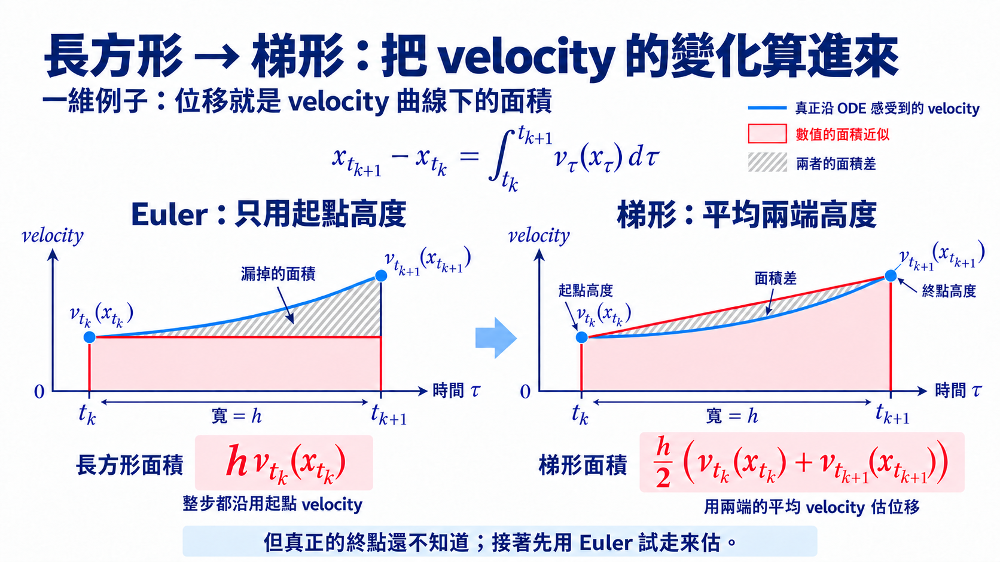

import Objectives from '../../../components/Objectives.astro';
import Prereq from '../../../components/Prereq.astro';
import Ask from '../../../components/Ask.astro';
import Details from '../../../components/Details.astro';
import Question from '../../../components/Question.astro';
import Answer from '../../../components/Answer.astro';
import QuizBlock from '../../../components/QuizBlock.astro';
import Option from '../../../components/Option.astro';
import Explanation from '../../../components/Explanation.astro';
import Bridge from '../../../components/Bridge.astro';
import Ref from '../../../components/Ref.astro';

# 少看幾次方向，還能走得準嗎？

<Objectives>
- **從 Euler 漏掉的 acceleration 推出 Heun。** 寫出 predictor–corrector update，並說明它為什麼把 global error 從 $O(h)$ 改成 $O(h^2)$。
- **用 NFE 比較不同 solvers 的成本。** 每次呼叫 neural velocity 都算 1 NFE；固定計算預算時，方法的階數與每一步的 NFE 必須一起比較。
- **說出 adaptive solver 如何決定步長。** 用同一段路的兩種近似估計 local error，在 velocity 變化大的地方縮小步長，穩定時再放大。
</Objectives>

<Prereq items={frontmatter.prereqs} />

在 <Ref to="dma-error-theory">U3.1</Ref> 中，我們看到 Euler 的 finite-step error 來自一步之內被忽略的 velocity 變化。<Ref to="dma-rectified-flow">U3.2</Ref> 與 <Ref to="dma-minibatch-ot">U3.3</Ref> 選擇修改 coupling，希望讓 learned ODE trajectory 更接近等速直線。

但如果模型已經訓好了，velocity field 也就固定了。這時候我們不能再重新安排 reference paths，能改的是**怎麼近似這條 ODE**。

沿用前面的導航例子：假設路線已經固定，但手機只剩下一點電，我們只能打開地圖看幾次方向。每次看完都可以往前走一段；問題是，這幾次查詢應該怎麼用，才不會在轉彎處走過頭？

回到精確更新：

$$
x_{t+h}=x_t+\int_t^{t+h}v_\tau(x_\tau)\,\mathrm d\tau.
$$

右邊的積分需要知道整段路上的 velocity，但我們手上只有 neural network $v_\theta(x,t)$，只能在選定的位置與時間逐次詢問。每呼叫一次網路取得 velocity，算一次 **network function evaluation（NFE）**。Numerical solver 在做的事情，就是好好安排這些 queries，用有限的資訊去近似我們想要算的積分。那麼：

<Ask>
如果只能查詢固定次數的 neural velocity， 
要怎麼使用這些 queries，才能比 Euler 走得更準？
</Ask>

## Review：Euler 一步只看一個方向

Euler 在一步的起點詢問一次：

$$
x_{t+h}^{\mathrm E}=x_t+h\,v_t(x_t).
$$

它把整段積分近似成一個長方形：寬是 $h$，高是起點 velocity。每一步只花 **1 NFE**，但也等於假設接下來這一小段的方向與速度大小都不變。若把 $[0,1]$ 平均切成 $M$ 步，便需要 $M$ NFE，步長是 $h=1/M$。

<Ref to="dma-error-theory"/> 已經得到，在 regularity 條件下，它的全域誤差會受到

$$
h\int_0^1\|a_t(x_t)\|\,\mathrm dt
$$

控制。Velocity 沿 trajectory 越穩定，這個近似越準；方向或速度大小改得越快，就必須把 $h$ 縮小。但縮小 $h$ 代表多走幾步，也就要花更多 NFE。

## 只看起點不夠，能不能也看一下終點？

<Ref to="dma-error-theory">U3.1</Ref> 已經把沿 trajectory 感受到的 acceleration 記成 $a_t(x_t)=\frac{\mathrm d}{\mathrm dt}v_t(x_t)$。將精確解在 $t$ 附近做 Taylor expansion：

$$
x_{t+h}
=x_t+h\,v_t(x_t)
+\frac{h^2}{2}a_t(x_t)
+O(h^3).
$$

Euler 只留下前兩項，漏掉的正是 $\frac{h^2}{2}a_t(x_t)$。但真的要使用這一項，就得知道 acceleration。**有沒有辦法不直接計算 acceleration，卻稍微捕捉到 velocity 在這一步裡改變了多少？**

Acceleration 描述的就是 velocity 如何改變。因此，除了起點的方向，我們可以在這一步的終點再問一次：如果前後兩支箭頭差很多，代表這一段的 velocity 確實改變得很快。

從積分的角度也可以看到同一件事。Euler 用起點的 velocity 畫一個長方形來近似積分；如果 velocity 在這一小段裡逐漸改變，用起點與終點兩個高度畫出的**梯形**，通常會更接近曲線下面的面積。也就是使用兩者的平均 velocity：

$$
x_{t+h}
\approx x_t+\frac h2\left(v_t(x_t)+v_{t+h}(x_{t+h})\right).
$$

**圖：從長方形改成梯形。** 藍線是沿 ODE trajectory 感受到的 velocity，紅色區域是位移的近似，灰色斜線是兩者的面積差。這裡先假設兩端高度已知。

不過，真正的 $x_{t+h}$ 正是我們還在計算的答案，現在還不能拿它來問 velocity。最直接的處理方式，是先用 Euler 試走一次，得到一個預測終點：

$$
\widetilde x_{t+h}=x_t+h\,v_t(x_t).
$$

接著在 $\widetilde x_{t+h}$ 再問一次方向，最後用起點與預測終點的平均 velocity 修正這一步：

$$
x_{t+h}^{\mathrm H}
=x_t+\frac h2\left(v_t(x_t)+v_{t+h}(\widetilde x_{t+h})\right).
$$

前一個式子只是 predictor，後一個式子才是 corrector；這個做法稱為 **Heun method**。沿用導航的例子，就是先照目前方向試走到下一個位置，在那裡再看一次導航；如果前後方向不同，便不讓整步都跟著第一支箭頭走。

### 為什麼兩個 velocity 的平均能補到 acceleration？

在 trajectory 夠平滑時，預測終點的 velocity 可以展開成

$$
v_{t+h}(\widetilde x_{t+h})
=v_t(x_t)+h\,a_t(x_t)+O(h^2).
$$

也就是說，起點與預測終點的 velocity 相差大約 $h\,a_t(x_t)$。把它放回剛才的梯形更新：

$$
\begin{aligned}
x_{t+h}^{\mathrm H}
&=x_t+\frac h2\left(v_t(x_t)+v_{t+h}(\widetilde x_{t+h})\right)\\
&=x_t+h\,v_t(x_t)+\frac{h^2}{2}a_t(x_t)+O(h^3).
\end{aligned}
$$

Heun 因此補回了 Euler 漏掉的二次項。在 trajectory 夠平滑時，Euler 每一步的 local error 是 $O(h^2)$，累積約 $1/h$ 步後得到 $O(h)$ 的 global error；Heun 的 local error 是 $O(h^3)$，所以 global error 變成 $O(h^2)$：

$$
\text{Euler global error}=O(h),
\qquad
\text{Heun global error}=O(h^2).
$$

Karras 等人 [1] 在 diffusion sampling 中採用了這類二階修正。不過，Heun 每一步要 **2 NFE**。如果總預算只有 $M$ 次網路呼叫，Euler 可以走 $M$ 步，Heun 通常只能走 $M/2$ 步。因此實務比較應該固定 NFE，而不是讓兩者走一樣多步。

## 每一段都走一樣大步，可能把 queries 用錯地方

Euler 與剛才的 Heun 都把時間切成等長的小段。但導航次數有限時，直路每隔幾公尺就重新確認方向很浪費；接近轉彎處，隔太久才看一次又容易走過頭。更自然的做法是：velocity 穩定時走大步，變化明顯時再縮小步長。

麻煩是，我們事先不知道哪一段變化比較大。最簡單的判斷方法，是從同一個 $x_t$ 出發，分別算「一個大步」與「兩個半步」：

$$
\begin{aligned}
x_{\mathrm{full}}&=x_t+h\,v_t(x_t),\\
x_{\mathrm{half}}&=x_t+\frac h2v_t(x_t),\\
x_{\mathrm{two}}&=x_{\mathrm{half}}+\frac h2v_{t+h/2}(x_{\mathrm{half}}).
\end{aligned}
$$

為什麼兩個結果的差可以拿來判斷？沿用剛才的 Taylor expansion，可以算出

$$
x_{\mathrm{two}}-x_{\mathrm{full}}
=\frac{h^2}{4}a_t(x_t)+O(h^3).
$$

所以兩者的差雖然不是真實誤差本身，卻會隨這一段的 velocity 變化一起增大。若 $\|x_{\mathrm{two}}-x_{\mathrm{full}}\|$ 小於事先設定的 **tolerance**——也就是我們願意接受的 local discrepancy——就接受這一步，下一步還可以放大 $h$；若差距太大，就拒絕這次更新、縮小 $h$ 再算。

這就是 **adaptive step size** 的基本想法。注意，前面介紹的 Heun 本身仍是固定步長；「用 Heun」與「步長會不會自動調整」是兩個不同的選擇。不過，Heun 的 Euler predictor $\widetilde x_{t+h}$ 與 corrector $x_{t+h}^{\mathrm H}$ 已經給了同一步的兩種近似，因此也可以用

$$
\left\|x_{t+h}^{\mathrm H}-\widetilde x_{t+h}\right\|
$$

當成 local error signal，再依照差距放大或縮小下一步。更一般的 embedded Runge–Kutta methods 也會共用一組 velocity evaluations，同時計算兩個不同階數的近似；Dormand–Prince method [2] 就是常見的例子。Adaptive solver 不需要預先知道哪裡會轉彎、加速或減速，但估計誤差本身也會花 NFE，而且不同樣本可能需要不同步數。

<iframe loading="lazy" src="/personal_website/notes/research_areas/diffusion-models-applications/w5-5-solvers.html" class="demo-frame" title="Euler、Heun 與 adaptive solver 如何分配 velocity queries：互動 demo" style="height: 820px; width: 100%; border: none;"></iframe>

**互動 demo：先固定 NFE，再比較 Euler 與 Heun。** 兩者在同一個平滑的二維旋轉 field 上使用完全相同的 NFE 預算；Heun 每一步需要兩次查詢，所以只能走一半的步數。切到 Adaptive 後，demo 改用 Euler predictor 與 Heun corrector 的差調整步長，在 velocity 變化明顯的區段留下較密的節點。

<Question id="Q1">
Heun 是二階方法，Euler 只有一階。**如果兩者都只能使用 20 NFE，Heun 是否一定比較準？**

<Answer>
不一定。階數說的是 $h\to0$ 時誤差下降的速度，不是任何步數下的固定排名。

固定 20 NFE 時，Euler 可以走 20 步，Heun 通常只能走 10 步。Heun 雖然用兩次 velocity 估出較好的平均方向，但它每一步跨得也更大。當 trajectory 夠平滑、二階誤差常數不大時，Heun 通常會佔優；如果 velocity 在一步內變化得很不規則，高階導數很大，這個優勢可能縮小。

所以比較 solver 要同時寫清楚：**總 NFE、誤差階數，以及 velocity 沿 trajectory 是否足夠平滑。** 只說「二階比一階好」，少算了每一步的成本與不同問題的誤差常數。
</Answer>
</Question>

## 如果 ODE 有一部分可以精確算，就不必全部一起近似

Euler、Heun 與 adaptive Runge–Kutta 都把右邊的 velocity field 當成一個 black-box function。不過 <Ref to="dma-linear-path">U2.3</Ref> 的 Gaussian path 會產生一種特別的 semilinear structure：

$$
\frac{\mathrm dx_t}{\mathrm dt}
=A(t)x_t+B(t)\,\epsilon_\theta(x_t,t),
$$

其中 $A(t),B(t)$ 是 noise schedule 決定的已知係數；第一項對 $x_t$ 是線性的，第二項才包含需要 NFE 的 neural network。對任意 $s<t$，這條 ODE 可以精確改寫成

$$
\begin{aligned}
x_t
&=e^{\int_s^t A(r)\,\mathrm dr}x_s\\
&\quad+\int_s^t
e^{\int_\tau^t A(r)\,\mathrm dr}
B(\tau)\,\epsilon_\theta(x_\tau,\tau)
\,\mathrm d\tau.
\end{aligned}
$$

第一行是可以直接算出的 linear evolution；numerical solver 真正需要近似的，只剩第二行包含 $\epsilon_\theta$ 的積分。Lu 等人提出的 **DPM-Solver** [3] 就沿著這個想法，再把時間換成 log-SNR，對 neural term 建立高階近似。**能精確處理的部分先算完，有限的 NFE 才不會花在重複近似已知結構上。**

令

$$
m(t)=\exp\!\left(-\int_s^t A(r)\,\mathrm dr\right).
$$

把 ODE 兩邊乘上 $m(t)$。因為 $m'(t)=-A(t)m(t)$，product rule 會讓 linear term 抵消：

$$
\frac{\mathrm d}{\mathrm dt}\bigl(m(t)x_t\bigr)
=m(t)B(t)\epsilon_\theta(x_t,t).
$$

從 $s$ 積分到 $t$，再除回 $m(t)$，就是正文的 exact update。這個動作通常叫做 integrating factor，或 variation-of-constants formula。

這個優勢不會自動延伸到任意 Flow Matching path。只有當 ODE 真的具有可以解析處理的結構時，專用 solver 才能利用它；否則仍要回到 Heun 或 adaptive Runge–Kutta 這類 general-purpose methods。

## Solver 走得再準，也只是在解目前這個 field

Solver 只負責更準確地積分目前這條 learned ODE。若 $v_\theta$ 和理想的 $v_t$ 不同，即使把 numerical step size 縮到幾乎為零，我們得到的也只是 **$v_\theta$ 所定義之 ODE 的精確 trajectory**，不會自動回到 $v_t$ 原本應該產生的 probability path。

所以生成誤差至少要分成兩層：一層是模型學到的 field 不準，另一層才是用有限 NFE 解這個 field 所產生的 solver error。<Ref to="dma-error-theory">U3.1</Ref> 的 $W_2$ 補充已經把這兩項分開；Heun、adaptive solver 與 DPM-Solver 改善的是後者，不能替前者補回正確方向。

> **固定 learned field 之後，solver 決定的是我們能多準地走完它，不是這個 field 本身對不對。**

## 快速回顧一下

<QuizBlock id="w5-5-a">
比較兩個 ODE solvers 的 sampling cost 時，為什麼要看 NFE，而不能只看步數？
<Option>因為每一步的時間長度一定不同。</Option>
<Option correct>因為不同 solver 每一步可能呼叫不同次 neural network；Heun 一步通常是 2 NFE。</Option>
<Option>因為 NFE 會改變 training objective。</Option>
<Explanation>
真正昂貴的通常是 neural velocity evaluation。固定步數比較 Euler 與 Heun，會讓 Heun 使用兩倍的模型呼叫，並不是相同計算預算。
</Explanation>
</QuizBlock>

<QuizBlock id="w5-5-b">
Adaptive solver 如何知道某一段應該縮小步長？
<Option>先知道真正的 ODE solution。</Option>
<Option correct>比較同一段的兩種近似；差距大時，表示 local error 可能太大。</Option>
<Option>只看當下 velocity 的長度。</Option>
<Explanation>
Velocity 很大不代表變化快。Adaptive method 會使用 step doubling 或 embedded Runge–Kutta pair，比較同一段的兩種近似，再決定接受、放大或拒絕這一步。
</Explanation>
</QuizBlock>

<QuizBlock id="w5-5-c">
DPM-Solver 為什麼能比一般 black-box solver 多利用一層資訊？
<Option>它重新訓練了一個更直的 coupling。</Option>
<Option correct>Diffusion ODE 有半線性結構；它把線性部分解析積分，只近似 neural network 所在的 nonlinear integral。</Option>
<Option>它把 ODE 換成了 SDE。</Option>
<Explanation>
它沒有修改訓練好的模型，而是使用 diffusion ODE 已知的結構減少本來不必要的 discretization error。
</Explanation>
</QuizBlock>

<QuizBlock id="w5-5-d">
下列哪一項是 solver 無法自行修正的？
<Option>積分步長太大造成的 finite-step error。</Option>
<Option>固定步長在直路上浪費太多 evaluations。</Option>
<Option correct>Neural velocity 本身和理想的 velocity field 不同。</Option>
<Explanation>
Solver 只能更準地積分給定的 field。Field 本身學錯時，高精度 solver 不會自動把它變回正確的 probability path。
</Explanation>
</QuizBlock>

<Bridge to="dma-lab-interpolants">
現在我們有兩條減少 discretization error 的路：修改 coupling，讓 velocity 沿 trajectory 少一點變化；或保留現有 field，改用更高階、會調整步長的 solver，把有限 NFE 放在真正需要的地方。

<Ref to="dma-lab-interpolants">U3.5</Ref> 會把 coupling、acceleration integral、Euler／Heun 與 sampling error 放回同一個 toy。先判斷誤差來自 field 還是 solver，再決定要拉直 trajectory、換 solver，還是回頭改善模型。
</Bridge>

## 參考文獻

1. Karras, T., Aittala, M., Aila, T., Laine, S. [*Elucidating the Design Space of Diffusion-Based Generative Models.*](https://arxiv.org/abs/2206.00364) NeurIPS 2022. （Diffusion sampling 中使用二階修正，並以 NFE 比較計算成本。）
2. Dormand, J. R., Prince, P. J. [*A Family of Embedded Runge–Kutta Formulae.*](https://doi.org/10.1016/0771-050X(80)90013-3) Journal of Computational and Applied Mathematics, 1980. （用共享 evaluations 的不同階數近似估計 local error。）
3. Lu, C., Zhou, Y., Bao, F., Chen, J., Li, C., Zhu, J. [*DPM-Solver: A Fast ODE Solver for Diffusion Probabilistic Model Sampling in Around 10 Steps.*](https://arxiv.org/abs/2206.00927) NeurIPS 2022. （把 linear part 解析積分，只對 neural term 做高階近似。）
