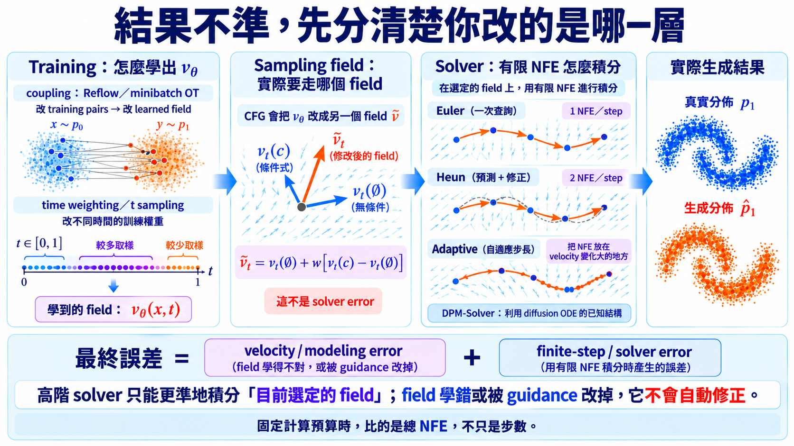

import Objectives from '../../../components/Objectives.astro';
import Prereq from '../../../components/Prereq.astro';
import Ask from '../../../components/Ask.astro';
import Remark from '../../../components/Remark.astro';
import Details from '../../../components/Details.astro';
import Question from '../../../components/Question.astro';
import Answer from '../../../components/Answer.astro';
import QuizBlock from '../../../components/QuizBlock.astro';
import Option from '../../../components/Option.astro';
import Explanation from '../../../components/Explanation.astro';
import Bridge from '../../../components/Bridge.astro';
import Ref from '../../../components/Ref.astro';

# 少看幾次方向，還能走得準嗎？

<Objectives>
- **用 NFE 比較 Euler 與 Heun。** 分清 solver 的階數、每一步需要的 neural velocity evaluations，以及固定計算預算下真正能走幾步。
- **說出 adaptive solver 如何調整步長。** 用「一大步」與「兩個半步」的差估計 local error，在方向快速變化時縮小步長。
- **分清 solver error 與 velocity error。** Solver 只能更準地積分目前的 field；guidance 會改變 field，training weighting 則會改變它如何被學出來。
</Objectives>

<Prereq items={frontmatter.prereqs} />

<Ref to="dma-rectified-flow"/> 與 <Ref to="dma-minibatch-ot"/> 都選擇回頭修改 coupling，希望讓 learned ODE trajectory 更接近等速直線。但如果模型已經訓好了，或是 velocity 沿 trajectory 仍會改變，我們就只能處理另一件事：**在有限次詢問 velocity 的預算裡，怎麼把 ODE 解得更準？**

回到精確更新：

$$
x_{t+h}=x_t+\int_t^{t+h}v_\tau(x_\tau)\,\mathrm d\tau.
$$

Numerical solver 的工作，就是用有限次 $v_\theta(x,t)$ 的計算來近似這個積分。每呼叫一次 neural network 取得 velocity，算一次 **network function evaluation（NFE）**；所以比較取樣速度時，不能只數步數，也要數每一步呼叫了幾次網路。

<Ask>
如果只能詢問有限次 velocity， 
這些詢問應該放在哪裡，才能走得更準？
</Ask>

## Euler：問一次，就沿同一個方向走到底

Euler 在一步的起點詢問一次：

$$
x_{t+h}^{\mathrm E}=x_t+h\,v_t(x_t).
$$

它把整段積分近似成一個長方形：寬是 $h$，高是起點 velocity。每一步只花 **1 NFE**，但也等於假設接下來這一小段的方向與速度大小都不變。

<Ref to="dma-error-theory"/> 已經得到，在 regularity 條件下，它的全域誤差會受到

$$
h\int_0^1\|a_t(x_t)\|\,\mathrm dt
$$

控制。Velocity 沿 trajectory 越穩定，這個近似越省；方向或速度大小改得越快，就必須把 $h$ 縮小。

## Heun：先試走，再把兩次方向平均

如果不想整步都相信起點方向，一個自然的做法是：先用 Euler 預測會走到哪裡，再到預測終點詢問一次 velocity。

$$
\widetilde x_{t+h}=x_t+h\,v_t(x_t),
$$

$$
x_{t+h}^{\mathrm H}
=x_t+\frac h2\left(v_t(x_t)+v_{t+h}(\widetilde x_{t+h})\right).
$$

這就是 **Heun method**。它不再把整段當成同一個方向，而是用起點與預測終點的平均 velocity 近似積分。直覺上就像走到下一個街口前，先看一次導航；預測抵達後再看一次，最後用兩次資訊修正這一步。

在 trajectory 夠平滑時，Euler 是一階方法，Heun 是二階方法：

$$
\text{Euler global error}=O(h),
\qquad
\text{Heun global error}=O(h^2).
$$

但 Heun 每一步要 **2 NFE**。如果總預算只有 $M$ 次網路呼叫，Euler 可以走 $M$ 步，Heun 通常只能走 $M/2$ 步。因此實務比較應該固定 NFE，而不是讓兩者走一樣多步。

## 不要每一段都切成一樣長

固定步長還有一個浪費：velocity 幾乎不變與快速改變的區段，都被切成同樣大小。更自然的做法是，在方向與速度大小都穩定時走大步；發現這一段變化太大時，再退回來改走小步。

最簡單的誤差訊號，可以用 Euler 的 **step doubling** 看見。從同一個 $x_t$ 出發，分別算一個大步與兩個半步：

$$
\begin{aligned}
x_{\mathrm{full}}&=x_t+h\,v_t(x_t),\\
x_{\mathrm{half}}&=x_t+\frac h2v_t(x_t),\\
x_{\mathrm{two}}&=x_{\mathrm{half}}+\frac h2v_{t+h/2}(x_{\mathrm{half}}).
\end{aligned}
$$

如果 $\|x_{\mathrm{two}}-x_{\mathrm{full}}\|$ 很小，表示這一段的 velocity 沒有改太多，可以接受這一步，下一步甚至走大一點；如果兩者差很多，就拒絕大步、縮小 $h$ 再算一次。這就是 **adaptive step size** 的基本想法。

Adaptive solver 不需要先知道哪裡會轉彎、加速或減速。它只是每走一段就比較兩種近似，讓 local error 留在設定的 tolerance 內。代價是估計誤差本身也要花 NFE，而且不同樣本可能需要不同步數。

<Question id="Q1">
Heun 是二階方法，Euler 只有一階。**如果兩者都只能使用 20 NFE，Heun 是否一定比較準？**

<Answer>
不一定。階數說的是 $h\to0$ 時誤差下降的速度，不是任何步數下的固定排名。

固定 20 NFE 時，Euler 可以走 20 步，Heun 通常只能走 10 步。Heun 雖然用兩次 velocity 估出較好的平均方向，但它每一步跨得也更大。當 trajectory 夠平滑、二階誤差常數不大時，Heun 通常會佔優；如果 velocity 在一步內變化得很不規則，高階導數很大，這個優勢可能縮小。

所以比較 solver 要同時寫清楚三件事：**總 NFE、誤差階數，以及控制誤差常數的 trajectory regularity。** 只說「二階比一階好」，少算了每一步的成本。
</Answer>
</Question>

## Diffusion ODE 還有一個可以利用的結構

Euler、Heun 與 adaptive Runge–Kutta 都可以拿來解一般 ODE。不過 <Ref to="dma-linear-path"/> 的 Gaussian path 會產生一種特別的半線性結構：

$$
\frac{\mathrm dx_t}{\mathrm dt}
=a(t)x_t+b(t)\,\epsilon_\theta(x_t,t).
$$

第一項對 $x_t$ 是線性的，第二項才包含複雜的 neural network。DPM-Solver [3] 的想法是：**線性部分可以解析積分，就不要連它一起近似；只把 NFE 花在剩下的 nonlinear term。** 再換到 log-SNR 當時間變數後，就能對 neural term 建立高階近似。

一般 solver 只把右邊當成一個 black-box function，因此線性項 $a(t)x_t$ 也會產生 discretization error。DPM-Solver 先使用 variation-of-constants formula，把線性部分精確算掉：

$$
x_t=\text{精確的線性演化}+\int \text{已知係數}\times\epsilon_\theta(x_\tau,\tau)\,\mathrm d\tau.
$$

真正需要數值近似的只剩後面的積分。這也是它和 reflow 的差別：reflow 改 training coupling，讓 trajectory 本身更直；DPM-Solver 不改模型，而是利用 diffusion ODE 已知的 algebraic structure 減少 solver error。

這個優勢並不會自動延伸到任意 Flow Matching path。只有當 ODE 真的具有可以解析處理的結構時，專用 solver 才能把它拿來省誤差。

## Solver 解得更準，不代表生成目標一定更對

Solver 只負責更準確地解目前這條 ODE。如果 neural velocity 本身估錯了，或是我們刻意換了一個 field，再高階的 solver 也只會更準確地走那條被改過的路。

Classifier-free guidance（CFG）就是後者。條件模型與無條件模型分別給出 $v_t(x\mid c)$ 與 $v_t(x\mid\varnothing)$；sampling 時使用

$$
\widetilde v_t(x\mid c)
=v_t(x\mid\varnothing)
+w\big(v_t(x\mid c)-v_t(x\mid\varnothing)\big).
$$

$w=1$ 是原本的 conditional velocity；$w>1$ 則把兩者的差向量繼續往外延伸，**刻意改變了 velocity field**。它可能讓條件特徵更明顯，也可能讓 field 沿時間與空間變化得更快，因此同樣 NFE 下更難積分。

<iframe loading="lazy" src="/personal_website/notes/research_areas/diffusion-models-applications/w5-5-guidance.html" class="demo-frame" title="Guidance 如何同時改變生成分布與 ODE geometry" style="height: 940px; width: 100%; border: none;"></iframe>

**互動 demo：guidance 改的不只是條件強度。** 增加 $w$ 時，這組 toy 的終點分布變窄，trajectory 的加速度積分也上升。這不是一條對所有模型都成立的單調定律；它要顯示的是：guidance 先改了 field，solver 才負責近似這個新 field。

<Remark label="補充" summary="時間取樣與 loss weighting 改的是 training objective，還是 estimator？">
訓練時的 $t$ 分布也不屬於 solver。令每個時刻的 loss 為 $\ell(t)$，原本想最佳化

$$
\int_0^1 w(t)\,\ell(t)\,\mathrm dt.
$$

如果改從 $t\sim q(t)$ 抽樣，而且直接平均 $\ell(t)$，那麼 $q(t)$ 會變成新的有效 weighting，objective 也跟著改變。若乘回 importance correction，

$$
\int_0^1 w(t)\ell(t)\,\mathrm dt
=\mathbb E_{t\sim q}\!\left[\frac{w(t)}{q(t)}\ell(t)\right],
$$

objective 才保持不變，改的只是 Monte Carlo estimator 的變異數。Diffusion 文獻常把這些 weight 改寫成 log-SNR 上的函數 [4]；SD3 的 logit-normal sampling [5] 則是把更多 training samples 放在中間時刻。

所以要分清楚：**solver 安排 sampling 時的 NFE；時間抽樣安排 training 時不同 $t$ 得到多少權重。**
</Remark>

*圖：修改 coupling 會改 trajectory，修改 solver 會改積分誤差，guidance 與時間 weighting 則會改 velocity field 或 training objective。它們最後都會影響有限 NFE 下的結果，但動的不是同一個位置。*

## 快速回顧一下

<QuizBlock id="w5-5-a">
比較兩個 ODE solvers 的 sampling cost 時，為什麼要看 NFE，而不能只看步數？
<Option>因為每一步的時間長度一定不同。</Option>
<Option correct>因為不同 solver 每一步可能呼叫不同次 neural network；Heun 一步通常是 2 NFE。</Option>
<Option>因為 NFE 會改變 training objective。</Option>
<Explanation>
真正昂貴的通常是 neural velocity evaluation。固定步數比較 Euler 與 Heun，會讓 Heun 使用兩倍的模型呼叫，並不是相同計算預算。
</Explanation>
</QuizBlock>

<QuizBlock id="w5-5-b">
Adaptive solver 如何知道某一段應該縮小步長？
<Option>先知道真正的 ODE solution。</Option>
<Option correct>比較同一段的一大步與兩個小步；差距大時，表示 local error 可能太大。</Option>
<Option>只看當下 velocity 的長度。</Option>
<Explanation>
Velocity 很大不代表變化快。Adaptive method 需要比較兩個不同精度的近似，才能估計這一步漏掉了多少變化。
</Explanation>
</QuizBlock>

<QuizBlock id="w5-5-c">
DPM-Solver 為什麼能比一般 black-box solver 多利用一層資訊？
<Option>它重新訓練了一個更直的 coupling。</Option>
<Option correct>Diffusion ODE 有半線性結構；它把線性部分解析積分，只近似 neural network 所在的 nonlinear integral。</Option>
<Option>它把 ODE 換成了 SDE。</Option>
<Explanation>
它沒有修改訓練好的模型，而是使用 diffusion ODE 已知的結構減少本來不必要的 discretization error。
</Explanation>
</QuizBlock>

<QuizBlock id="w5-5-d">
下列哪一項是 solver 無法自行修正的？
<Option>積分步長太大造成的 finite-step error。</Option>
<Option>固定步長在直路上浪費太多 evaluations。</Option>
<Option correct>Neural velocity 本身學錯，或 guidance 已經刻意把 field 改掉。</Option>
<Explanation>
Solver 只能更準地積分給定的 field。Field 本身錯了或被換掉時，高精度 solver 不會自動把它變回正確的 probability path。
</Explanation>
</QuizBlock>

<Bridge to="dma-lab-interpolants">
現在有兩條減少 finite-step error 的路：修改 coupling，讓 velocity 沿 trajectory 少一點變化；或保留現有 field，改用更高階、會調整步長的 solver，把有限 NFE 放在真正需要的地方。

最後一篇會把 coupling、加速度積分、Euler／Heun 與 sampling error 放回同一個 toy。先判斷誤差來自 field 還是 solver，再決定該拉直、換 solver，還是回頭改善模型。
</Bridge>

## 參考文獻

1. Ho, J., Salimans, T. [*Classifier-Free Diffusion Guidance.*](https://arxiv.org/abs/2207.12598) 2022. （CFG 的原始形式。）
2. Karras, T., Aittala, M., Aila, T., Laine, S. [*Elucidating the Design Space of Diffusion-Based Generative Models.*](https://arxiv.org/abs/2206.00364) NeurIPS 2022. （二階取樣器、$\log\sigma$ 上的時間分布、stochasticity schedule。）
3. Lu, C., Zhou, Y., Bao, F., Chen, J., Li, C., Zhu, J. [*DPM-Solver: A Fast ODE Solver for Diffusion Probabilistic Model Sampling in Around 10 Steps.*](https://arxiv.org/abs/2206.00927) NeurIPS 2022. （把線性部分解析積分，只對 neural term 做高階近似。）
4. Kingma, D. P., Gao, R. [*Understanding Diffusion Objectives as the ELBO with Simple Data Augmentation.*](https://arxiv.org/abs/2303.00848) NeurIPS 2023. （各種 weighting 與 $\log\mathrm{SNR}$ 權重函數的關係。）
5. Esser, P., et al. [*Scaling Rectified Flow Transformers for High-Resolution Image Synthesis.*](https://arxiv.org/abs/2403.03206) ICML 2024. （logit-normal 的時間取樣。）
