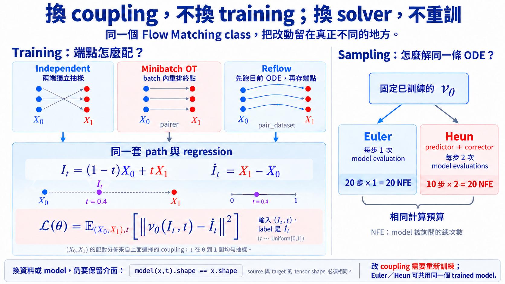

import Objectives from '../../../components/Objectives.astro';
import Prereq from '../../../components/Prereq.astro';
import Ask from '../../../components/Ask.astro';
import Remark from '../../../components/Remark.astro';
import Question from '../../../components/Question.astro';
import Answer from '../../../components/Answer.astro';
import QuizBlock from '../../../components/QuizBlock.astro';
import Option from '../../../components/Option.astro';
import Explanation from '../../../components/Explanation.astro';
import Bridge from '../../../components/Bridge.astro';
import Ref from '../../../components/Ref.astro';

# 實作：換了資料與模型，前面的方法還能沿用嗎？

<Objectives>
- **寫出可以換 model、資料與 reference path 的 Flow Matching class。** 只要新的 model 仍接受 $(x,t)$ 並輸出相同 shape 的 velocity，就能沿用同一套 training code。
- **把 Reflow 與 minibatch OT 寫成兩種 coupling。** Minibatch OT 在每個 batch 重新排列終點；Reflow 則先用目前的 ODE 產生新的端點配對，再重新訓練 model。
- **在相同 NFE 下比較 Euler 與 Heun。** Euler 每步詢問一次 velocity，Heun 每步詢問兩次；比較 sampling 結果時，要先讓兩邊使用相同次數的 model evaluations。
</Objectives>

<Prereq items={frontmatter.prereqs} />

在 <Ref to="dma-rectified-flow">U3.2</Ref> 與 <Ref to="dma-minibatch-ot">U3.3</Ref> 中，我們改變起點與終點的 coupling，希望 learned ODE trajectory 更接近等速直線。到了 <Ref to="dma-shared-techniques">U3.4</Ref>，我們不再修改 training，而是在 sampling 時改用 Heun，更準確地近似同一條 ODE。

現在要把這些方法真正寫進程式裡，問題就出現了：如果每換一個 coupling、model 或 solver，都重新寫一套 training loop，我們很快就會分不清楚**哪些步驟本來就一樣，哪些才是這個方法真正改動的地方。**

<Ask>
能不能把共同的 Flow Matching training 寫成同一個 class，<br />
換問題時，只替換真的不同的部分？
</Ask>

## 這份程式會跑出什麼？

我們仍然使用熟悉的二維 toy：起點是 Gaussian，終點是 two moons。完整範例可以從這裡下載：

[下載 U3.5：Flow Matching、Reflow、Minibatch OT 與 Heun（.py）](/personal_website/notes/notebooks/diffusion-models-applications/dma-u3-flow-matching-reflow-ot.py)

先安裝需要的 packages：

```bash
pip install torch numpy scipy matplotlib
```

再執行：

```bash
python dma-u3-flow-matching-reflow-ot.py
```

程式會先用 independent coupling 訓練一個 baseline，接著分別用 Reflow 與 minibatch OT 改變 coupling，最後輸出 `u3_5_results.png`。同一張圖也會固定 baseline model，比較相同 NFE 下的 Euler 與 Heun。這樣我們可以分開看見：**改 coupling 影響學到的 ODE；改 solver 則影響我們怎麼近似它。**

如果想先用較短的訓練確認環境與程式是否正常，可以執行：

```bash
python dma-u3-flow-matching-reflow-ot.py --steps 100 --reflow-pairs 1000 --eval-samples 500
```

## 換一個 model，需要重寫 Flow Matching 嗎？

二維 toy 使用 MLP，但換成影像資料後，我們可能會使用 U-Net；其他問題又可能需要完全不同的架構。如果 model 被直接寫死在 `FlowMatching` 裡，每換一次資料，就得連 training code 一起改掉。

比較自然的做法，是先在 class 外建立 model，再把它傳進 `FlowMatching`：

```python
model = VelocityMLP(data_dim=2, hidden_dim=128)
device = "cuda" if torch.cuda.is_available() else "cpu"

fm = FlowMatching(
    model=model,
    source_sampler=sample_gaussian,
    target_sampler=sample_two_moons,
    device=device,
)
```

`FlowMatching` 對 model 的要求可以寫成：

```python
model(x, t).shape == x.shape
```

也就是給定目前的位置 `x` 與時間 `t`，model 要回傳一個與 `x` shape 相同的 velocity。二維點使用 `VelocityMLP`；若 `x` 是影像，就可以換成接受 `(image,t)` 的 U-Net。**Model 變了，但 Flow Matching 仍然在學同一個物件 $v_\theta(x,t)$。**

資料也用同樣的方式從外面傳進來。`source_sampler(batch_size, device)` 與 `target_sampler(batch_size, device)` 只要回傳 shape 相同的 tensors，就能換成其他 distributions 或 datasets。

<Remark label="程式介面" summary="哪些部分可以獨立替換？">
完整程式留下四個可以替換的部分：

- `model`：近似 $v_t(x)$ 的 neural network；
- `source_sampler`、`target_sampler`：決定 $p_0$ 與 $p_1$；
- `path`：給定 $(x_0,x_1,t)$，回傳 $I_t$ 與 $\dot I_t$；
- `pairer` 或 `pair_dataset`：決定一個 $x_0$ 應該和哪個 $x_1$ 配在一起。

這篇使用 linear path，但也可以傳入另一個 `path` function。換到新的問題時，我們只要先確認改變的是資料、model、path 還是 coupling，再替換對應的部分。
</Remark>

## Training 時，真正需要的是哪兩個量？

不論 model 長什麼樣子，Flow Matching 的 training step 都需要同一組資料：reference path 在時間 $t$ 的位置 $I_t$，以及這個位置對應的 reference velocity $\dot I_t$。以 linear path 為例：

```python
def linear_path(x0, x1, t):
    tau = t.reshape(t.shape[0], *([1] * (x0.ndim - 1)))
    xt = (1 - tau) * x0 + tau * x1
    reference_velocity = x1 - x0
    return xt, reference_velocity
```

`tau` 被 reshape 成可以和 `x0` broadcast 的形狀。因此，只要兩端的 shape 相同，這段程式不只可以處理 `[batch,2]` 的二維點，也可以處理 `[batch,channels,height,width]` 的影像。

拿到 $(I_t,\dot I_t)$ 後，training step 就和 <Ref to="dma-flows-and-continuity">U2.1</Ref> 的 objective 完全一樣：

```python
x0, x1 = self._draw_pairs(
    batch_size,
    pairer=pairer,
    pair_dataset=pair_dataset,
)
t = torch.rand(batch_size, device=self.device)
xt, reference_velocity = self.path(x0, x1, t)

prediction = self.model(xt, t)
loss = F.mse_loss(prediction, reference_velocity)

self.optimizer.zero_grad(set_to_none=True)
loss.backward()
self.optimizer.step()
```

Independent coupling、minibatch OT 與 Reflow 都使用這個 MSE loss。三者真正不同的是：`_draw_pairs` 會抽出哪一組 $(x_0,x_1)$，也就是 training 時使用哪一個 coupling。

## 先從 independent coupling 出發

先看我們在 U2 使用的情況。如果沒有傳入 `pairer` 或 `pair_dataset`，程式會分別從 $p_0$ 與 $p_1$ 獨立抽樣：

```python
baseline = FlowMatching(
    model=VelocityMLP(),
    source_sampler=sample_gaussian,
    target_sampler=sample_two_moons,
)

baseline.fit(steps=2500, batch_size=256)
```

這就是 U2 使用的 linear Conditional Flow Matching [1]。下面要實作的 Reflow 與 minibatch OT 都保留相同的 path 與 loss，**只改變這些端點如何被配在一起。**

## Minibatch OT 改了哪一行？

<Ref to="dma-minibatch-ot">U3.3</Ref> 的做法是：仍然先從 $p_0$ 與 $p_1$ 各抽一批點，但在畫 reference paths 之前，先重新排列終點，讓這個 batch 的搬運距離平方總和最小。這個動作可以獨立寫成 `pairer`：

```python
def minibatch_ot_pair(x0, x1):
    from scipy.optimize import linear_sum_assignment

    flat_x0 = x0.detach().flatten(1)
    flat_x1 = x1.detach().flatten(1)
    cost = torch.cdist(flat_x0, flat_x1).square().cpu().numpy()
    rows, cols = linear_sum_assignment(cost)

    rows = torch.as_tensor(rows, device=x0.device)
    cols = torch.as_tensor(cols, device=x1.device)
    return x0[rows], x1[cols]
```

`flatten(1)` 讓每個 sample 先攤平成一個向量，再用完整的 Euclidean distance 計算 cost。因此，二維點與影像 tensors 都能使用同一段程式。不過 cost matrix 的大小是 $B\times B$；batch 越大，需要的記憶體與 assignment 計算也會一起增加。

Training 時，只要把這個 `pairer` 傳進原本的 `fit`：

```python
batch_ot = FlowMatching(
    model=VelocityMLP(),
    source_sampler=sample_gaussian,
    target_sampler=sample_two_moons,
)

batch_ot.fit(
    steps=2500,
    batch_size=128,
    pairer=minibatch_ot_pair,
)
```

每一步仍然重新從 $p_0,p_1$ 抽樣；`pairer` 只把目前 batch 裡的終點重新排列，沒有增加或刪掉任何樣本。因此兩端的 empirical marginals 不變，改變的是中間會畫出哪些 reference paths。

## Reflow 的配對要從哪裡來？

Reflow [2] 需要的配對不是在 batch 裡解 assignment 得到的。按照 <Ref to="dma-rectified-flow">U3.2</Ref> 的做法，我們要先抽一批起點，讓它們沿著目前學到的 ODE 走到終點：

```python
reflow_pairs = baseline.make_reflow_dataset(
    n_samples=20000,
    batch_size=1024,
    n_steps=50,
    solver="heun",
)
```

這裡得到的是

$$
(X_0,Z_1^{(1)}),\qquad
\frac{\mathrm dZ_t^{(1)}}{\mathrm dt}
=v_t^{(0)}(Z_t^{(1)}).
$$

每個起點與它實際抵達的終點，會被存成一組新的 pair。接著我們建立一個**新的 model**，在這些端點之間重新畫直線，再做一次 Flow Matching：

```python
reflow = FlowMatching(
    model=VelocityMLP(),
    source_sampler=sample_gaussian,
    target_sampler=sample_two_moons,
)

reflow.fit(
    steps=2500,
    batch_size=256,
    pair_dataset=reflow_pairs,
)
```

這一次，`pair_dataset` 取代了原本的 independent sampling；objective、path 與 optimizer 都維持不變。若要再做一輪 Reflow，就讓 `reflow` 產生下一組 pairs，再訓練一個新的 model。

<Remark label="實作提醒" summary="產生 Reflow pairs 時為什麼使用較細的 Heun？">
理論上的 rectification 使用目前 ODE 的精確終點；實作時只能用 numerical solver 近似。若產生 pairs 時走得太粗，solver error 也會跟著進入下一輪 training data。

範例使用 50 步 Heun 產生 pairs，並不是 Reflow 規定要使用 Heun，而是希望產生配對時的 numerical error 不要成為主要差異。實際使用時，可以逐漸增加 solver steps，檢查得到的 endpoints 是否已經不再明顯改變。
</Remark>

## Sampling 時，要怎麼公平比較 Euler 與 Heun？

Coupling 決定 training 時使用哪些 reference paths；sampling 時，我們還要決定怎麼近似學到的 ODE。`integrate` 支援 Euler 與 Heun：

```python
if solver == "euler":
    x = x + h * v0
else:
    predicted = x + h * v0
    v1 = self.model(predicted, t1)
    x = x + 0.5 * h * (v0 + v1)
```

Euler 每一步詢問一次 model；Heun 先做 predictor，再在預測終點詢問一次，因此每一步需要 2 NFE。若兩邊的預算都是 20 NFE，應該比較：

```python
x_euler = baseline.integrate(x0, n_steps=20, solver="euler")
x_heun  = baseline.integrate(x0, n_steps=10, solver="heun")
```

如果兩者都走 20 步，實際上比較的是 20 NFE 與 40 NFE。這時即使 Heun 的結果比較好，我們也無法判斷原因是 solver 的近似更準，還是它多詢問了 20 次 model。



**圖：改 coupling 與改 solver，是不同的程式改動。** 左邊改的是 training pairs：minibatch OT 用 `pairer` 重排目前 batch，Reflow 用 `pair_dataset` 保存目前 ODE 產生的端點配對；三者共用相同的 path 與 velocity regression。右邊固定 trained model，只改積分方法；Euler 20 步與 Heun 10 步同樣使用 20 NFE。圖中的配對與路徑是示意，不是實測結果。

<Question id="Q1">
如果要把這份程式從 two moons 換到影像資料，**只更換 `target_sampler` 就夠了嗎？**

<Answer>
不夠。至少要一起確認三個介面：

1. `source_sampler` 與 `target_sampler` 必須回傳相同 shape，例如 `[batch,3,32,32]`；
2. 外部傳入的 model 必須接受 `(x,t)`，並輸出和影像相同 shape 的 velocity；
3. 記憶體是否允許 minibatch OT 建立 $B\times B$ cost matrix。

`FlowMatching.fit`、Reflow 的 fixed-pair training 與 Euler／Heun integration 不必因為資料從二維點換成影像而重寫。真正需要換的是資料與 model；minibatch OT 的 batch size 則要依計算成本重新選擇。
</Answer>
</Question>

## 快速回顧一下

<QuizBlock id="w5-6-a">
Independent coupling 與 minibatch OT 的 training code，真正不同的是哪一部分？
<Option>Flow Matching 的 L2 objective。</Option>
<Option correct>抽出兩批端點後，是否先用 `pairer` 重新排列配對。</Option>
<Option>使用的 ODE solver。</Option>
<Explanation>
兩者都使用相同的 linear path 與 velocity regression。Minibatch OT 改的是 batch 內的 coupling，不是 loss 或 sampling solver。
</Explanation>
</QuizBlock>

<QuizBlock id="w5-6-b">
Reflow 為什麼需要建立一個新的 model？
<Option>舊 model 無法使用 Heun。</Option>
<Option correct>新的 coupling 會產生新的 reference paths 與 regression targets，需要重新學對應的 marginal velocity。</Option>
<Option>Reflow 必須更換 target distribution。</Option>
<Explanation>
Reflow 保留兩端 distributions，但改變誰和誰配在一起。Training data 已經不同，不能把同一個已訓練 model 當成新一輪結果。
</Explanation>
</QuizBlock>

<QuizBlock id="w5-6-c">
Euler 20 步與 Heun 20 步是不是相同計算預算？
<Option>是，因為兩者都走 20 步。</Option>
<Option correct>不是；Euler 是 20 NFE，Heun 通常是 40 NFE。</Option>
<Option>只有資料維度大於二時才不同。</Option>
<Explanation>
比較 neural ODE sampling cost 要數 model evaluations。固定 20 NFE 時，應比較 Euler 20 步與 Heun 10 步。
</Explanation>
</QuizBlock>

## 把二維 toy 換成自己的問題

1. 把 `sample_two_moons` 換成另一個二維 distribution，觀察哪些程式完全不需要改動。
2. 把 `VelocityMLP` 換成自己的 model，並保留 `model(x,t).shape == x.shape` 這個介面。
3. 改變 minibatch OT 的 batch size，記錄 training time 與 Euler sampling 的結果。
4. 再做一輪 Reflow，分開記錄「產生 pairs」與「重新 training」各自需要的時間。

<Bridge to="dma-discrete-data">
現在我們把 U3 的兩條方法真正寫進了程式：Reflow 與 minibatch OT 改變 coupling，Euler 與 Heun 則改變 sampling 時使用的 numerical solver。Model、資料與 reference path 都從外面傳入，所以換問題時，不需要把整套 Flow Matching 重新寫一次。

下一個單元會拿掉這個前提。Token 沒有可以直接相加的中間位置，也不能沿著一支連續 velocity 移動；我們要重新問，離散資料的 path、velocity 與 sampling 分別應該換成什麼。
</Bridge>

## 參考文獻

1. Lipman, Y., et al. [*Flow Matching for Generative Modeling.*](https://arxiv.org/abs/2210.02747) ICLR 2023. （Linear Conditional Flow Matching。）
2. Liu, X., Gong, C., Liu, Q. [*Flow Straight and Fast: Learning to Generate and Transfer Data with Rectified Flow.*](https://arxiv.org/abs/2209.03003) ICLR 2023. （Rectification 與 Reflow。）
3. Tong, A., et al. [*Improving and Generalizing Flow-Based Generative Models with Minibatch Optimal Transport.*](https://arxiv.org/abs/2302.00482) TMLR 2024. （Minibatch OT coupling。）
4. Karras, T., Aittala, M., Aila, T., Laine, S. [*Elucidating the Design Space of Diffusion-Based Generative Models.*](https://arxiv.org/abs/2206.00364) NeurIPS 2022. （Heun sampling 與 NFE 比較。）
