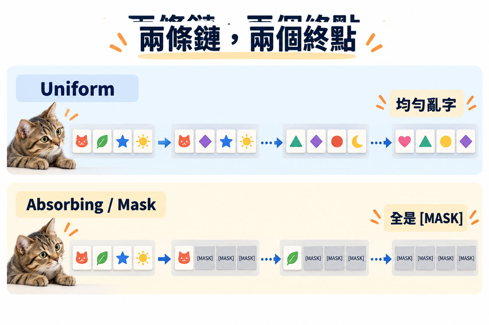

import Objectives from '../../../components/Objectives.astro';
import Prereq from '../../../components/Prereq.astro';
import Ask from '../../../components/Ask.astro';
import Remark from '../../../components/Remark.astro';
import Question from '../../../components/Question.astro';
import Answer from '../../../components/Answer.astro';
import QuizBlock from '../../../components/QuizBlock.astro';
import Option from '../../../components/Option.astro';
import Explanation from '../../../components/Explanation.astro';
import VizPlan from '../../../components/VizPlan.astro';
import Details from '../../../components/Details.astro';
import Bridge from '../../../components/Bridge.astro';
import Ref from '../../../components/Ref.astro';

# 資料是 Token 的時候，噪聲是什麼？

<Objectives>
- **指出 Gaussian diffusion 搬到 token 時壞在哪裡。** 分清哪些推導需要連續空間，哪些只需要已知的 Markov forward process。
- **設計一條離散 forward chain。** 說出 uniform 與 absorbing／mask 兩種選擇如何破壞資訊，以及各自走向什麼終點分布。
- **分清狀態離散與時間離散。** Token 是離散狀態；forward process 仍可用離散時間或連續時間描述。
</Objectives>

<Prereq items={frontmatter.prereqs} />

## Token 沒有「半個字」

前三個單元的資料一直是一堆 $\mathbb R^d$ 裡的點：一張圖是 3072 個實數，一個 toy 樣本是平面上的一個座標。這個單元把資料換掉。

一句話是一串 token：`我 / 今天 / 想 / 吃 / …`，每個位置從一個大小 $K$ 的字典裡選一個。一段蛋白質是二十種胺基酸排成的序列。一個分子是原子種類加上「哪兩個原子之間有鍵」的 0/1 表。這些資料有一個共同點：**它們是類別，不是數值。** 兩個 token 之間沒有「中間」——「想」和「吃」的平均不是一個字。

於是 <Ref week="dma-week-diffusion"/> 的第一步就出問題了。那個單元的起點是「把 $x_0$ 一點一點加 Gaussian noise，直到變成 $\mathcal N(0,I)$」。對一串 token，$x_0+\sigma\epsilon$ 根本不是一個合法的物件。

先別急著找替代品，先**盤點**一次：前三個單元的框架裡，哪些東西真的用到了「狀態是連續的」，哪些只是用到了「forward process 是一條我們自己寫好的、邊際好算的鏈」。盤點完會發現，壞掉的比想像中少。

## 盤點：哪些壞了，哪些還活著

回頭看 <Ref week="dma-week-diffusion"/> 的骨架：

1. **自己定一條從資料到噪聲的路徑**（<Ref to="dma-forward-process"/>）——用到的是「路徑已知、每個中間點 $x_t$ 的分佈 $q(x_t\mid x_0)$ 有 closed form」。
2. **在每個 $t$ 做回歸，預測 $x_0$（或 $\epsilon$）**（<Ref to="dma-denoising-regression"/>）——用到的是「MSE 的最小值是 conditional expectation」。
3. **denoiser 就是 score**（<Ref to="dma-tweedie-and-score"/>）——用到的是 Tweedie 公式，而 Tweedie 用到 Gaussian 的密度對 $x$ 可微。
4. **反向過程是 SDE 或 ODE**（<Ref to="dma-reverse-process"/>）——用到的是 $\nabla\log p_t$ 這個梯度。

第 3、4 點用到的東西——**gradient**、**score**、**ODE**——在離散空間裡都不存在：類別之間沒有方向，沒有「往密度高的方向走一小步」這件事。這兩塊是真的壞了，<Ref week="dma-week-discrete-ii"/> 會用另一種語言把它們重建回來。

第 1、2 點沒有壞。「自己定一條已知的路徑」不需要狀態連續，只需要一條 **Markov chain**：從 $x_0$ 出發，每一步按一個已知的規則隨機換掉一些 token，$T$ 步後到達一個簡單的終點分佈。「在每個 $t$ 做回歸」也還活著，只是 MSE 換成類別上的 cross-entropy——回歸的目標從 $\mathbb E[x_0\mid x_t]$ 換成 $p(x_0\mid x_t)$ 這個條件分佈本身。<Ref to="dma-denoising-regression"/> 那個 **conditional trick**——條件好算、邊際難算，而回歸自動取後驗平均——在這裡一字不改地成立。

所以這個單元的任務比重新發明一個框架小得多：**把「加噪聲」換成一條離散的 Markov chain，然後看回歸目標長什麼樣。**

<Ask>
兩個 token 之間沒有「中間」。 
那「加一點噪聲」該換成什麼？
</Ask>

<Question id="Q1">
「加噪聲」在離散空間上該換成什麼？請先自己想兩三種候選，並為每一種回答：$T$ 步之後的終點分佈是什麼？$q(x_t\mid x_0)$ 算得出來嗎？

<Answer>
會被想到的候選大致有這幾類：隨機把 token 換成字典裡任意一個、把 token 換成一個特殊符號 `[MASK]`、隨機刪掉 token、把 token 先變成 embedding 加 Gaussian noise 再 round 回去、隨機交換相鄰 token 的位置。

把它們過一遍，會整理出兩個原則。**第一，forward 必須是一條我們完全知道的 Markov chain，而且 $q(x_t\mid x_0)$ 要有 closed form**——否則訓練時做不出 $(x_t, x_0)$ 配對，<Ref to="dma-forward-process"/> 那個「隨便挑一個 $t$ 就能直接抽 $x_t$」的便利就沒了。「隨機刪掉」讓序列長度變化，「交換位置」的多步邊際很難寫，這兩個候選在這裡出局。**第二，終點分佈必須簡單到可以直接抽樣**，這是取樣的起點。

剩下兩個標準選擇：

- **Uniform**：每一步，每個 token 以機率 $\beta_t$ 被換成字典裡**均勻隨機**的一個（可能換回自己）。終點是每個位置獨立均勻的分佈。這是連續世界裡「加 Gaussian noise 直到變成 $\mathcal N(0,I)$」最直接的類比 [1, 2]。
- **Absorbing / mask**：字典多加一個符號 `[MASK]`。每一步，每個還沒被遮的 token 以機率 $\beta_t$ 變成 `[MASK]`；一旦變成 `[MASK]` 就**永遠留在那裡**。終點是整串全部 `[MASK]`——一個確定的狀態 [1]。

「embedding 加 Gaussian noise 再 round」是第三條路（Diffusion-LM [3] 走過），它把問題丟回連續空間，於是前三個單元的工具都能用。代價是 round 這一步：噪聲小的時候 round 回原字、噪聲大的時候 round 到隨機字，中間幾乎沒有「介於兩個字之間」的有意義狀態，模型花大量容量在學 embedding 的幾何而不是語言本身。在語言上，mask 的表現長期壓過這條路。這門課接下來只走前兩條。
</Answer>
</Question>

## 一個容易混的詞

到這裡要停下來釐清一個詞。這個單元的標題是 **discrete diffusion**，「discrete」說的是**狀態空間**是離散的：$x_t$ 的每個位置是 $K$ 個類別之一。

它**不是**在說時間離散。<Ref week="dma-week-diffusion"/> 的 DDPM 走 $T=1000$ 步，時間也是離散的，但每個 $x_t$ 是 $\mathbb R^d$ 裡的點，狀態連續。反過來，<Ref week="dma-week-discrete-ii"/> 會把這個單元的 Markov chain 換成連續時間的版本——時間連續，狀態依然離散。四種組合都存在：

| | 狀態連續 | 狀態離散 |
|---|---|---|
| **時間離散** | DDPM（<Ref to="dma-reverse-process"/>） | D3PM、masked diffusion（本單元） |
| **時間連續** | SDE / ODE（<Ref to="dma-reverse-process"/>、<Ref to="dma-sampler-family"/>） | CTMC、SEDD、discrete FM（<Ref week="dma-week-discrete-ii"/>） |

這張表值得記住，因為它同時說明了本單元和下一個單元的分工：本單元在左下→右上這條對角線上做翻譯——把時間離散、狀態連續的 DDPM 翻成時間離散、狀態離散的版本，讓你先在熟悉的結構裡接受「離散噪聲」；下一個單元再把時間變連續，重建 score 與 sampler 的語言。

<iframe loading="lazy" src="/personal_website/notes/research_areas/diffusion-models-applications/w6-0-noising.html" class="demo-frame" title="逐 token 加噪聲：uniform 與 mask：互動 demo" style="height: 810px; width: 100%; border: none;"></iframe>

**互動 demo：逐 token 加噪聲。** 同一句話、同一個 $t$，上排走 uniform、下排走 absorbing。兩排被動過的格數大致相同（都是機率 $\bar\alpha_t$ 存活），差別在動過之後長什麼樣。往右拖 $t$ 會看到 absorbing **沒有格子復原**——那就是「吸收態」的意思。點任一個格子，下方長條圖會顯示該位置的 $q(x_t\mid x_0)$：uniform 從一根柱子慢慢攤成一片均勻，absorbing 永遠只有兩根。

## 為什麼 mask 值得特別看

兩條鏈裡，absorbing 看起來像是比較「偷懶」的那一條——它連噪聲都不是隨機字，只是把字蓋起來。但它有一個 uniform 沒有的性質：**在任何 $t$，$x_t$ 裡沒被遮的 token 一定就是 $x_0$ 的原字**。看到一個沒被遮的位置，你就確定知道它的答案；不確定的資訊全部集中在被遮的位置。

這件事會讓下一篇之後的數學大幅簡化：回歸目標只需要對被遮的位置預測，loss 塌成一個加了時間權重的 masked cross-entropy——也就是 BERT [4] 的 masked language modeling，多了「遮多少比例是隨機的、而且要對所有比例都學會」這一層。MaskGIT [5] 在影像 token 上、之後一系列 masked diffusion language model 在文字上，走的都是這條線。

代價也有，而且和 <Ref to="dma-sampler-family"/> 那個「ODE 沒有自我修正」的觀察是同一件事：被遮的 token 一旦被還原，就**永遠固定**，之後的步驟沒有機會改它。這個單元先只給直覺，<Ref week="dma-week-discrete-ii"/> 有了 rate 的語言之後會把它量化。

*圖：兩條鏈，兩個終點。Uniform 會把 token 推向均勻的亂字；absorbing 則把不確定性集中到同一個 `[MASK]` 吸收態。*

## 先消化一下

<QuizBlock id="w6-0-a">
「discrete diffusion」裡的 discrete 指的是：
<Option>取樣走的步數是有限的整數步。</Option>
<Option correct>每個 $x_t$ 的狀態空間是有限個類別，token 之間沒有「中間值」。</Option>
<Option>模型的參數是量化過的。</Option>
<Explanation>
DDPM 走 $T$ 步、時間也是離散的，但狀態在 $\mathbb R^d$ 裡連續。discrete diffusion 說的是狀態離散；時間可以離散（本單元）也可以連續（下一個單元）。
</Explanation>
</QuizBlock>

<QuizBlock id="w6-0-b">
下列哪一項是 <Ref week="dma-week-diffusion"/> 的框架裡**真的**依賴「狀態連續」的環節？
<Option>「自己先定一條已知的路徑，讓每個中間點的分佈有 closed form」。</Option>
<Option>「在每個 $t$ 做回歸，回歸的最小值是 conditional expectation」。</Option>
<Option correct>「denoiser 就是 score，反向過程沿著 $\nabla\log p_t$ 走」。</Option>
<Explanation>
已知路徑只需要一條 Markov chain；回歸只需要一個可以最小化的 loss（MSE 或 cross-entropy）。只有 score 與 ODE 需要 gradient，而類別之間沒有方向。這兩塊要等下一個單元用 rate 與比值重建。
</Explanation>
</QuizBlock>

<QuizBlock id="w6-0-c">
「隨機刪掉一些 token」為什麼不適合當 forward process？
<Option>因為刪掉的 token 再也拿不回來。</Option>
<Option correct>因為序列長度會變，多步之後 $q(x_t\mid x_0)$ 沒有好用的 closed form，訓練時做不出 $(x_t,x_0)$ 配對。</Option>
<Option>因為終點分佈不是均勻的。</Option>
<Explanation>
「拿不回來」本身不是問題——absorbing 的 `[MASK]` 也拿不回來，卻是最好用的鏈之一。問題在於刪除讓位置對應消失、長度改變，邊際分佈不好寫；而「終點是什麼」對刪除來說反而很簡單（空串）。
</Explanation>
</QuizBlock>

<QuizBlock id="w6-0-d">
Absorbing（mask）鏈相對於 uniform 鏈，下面哪個描述是對的？
<Option>它的終點分佈比較複雜。</Option>
<Option>它每一步都可能把已經被遮的 token 換回原字。</Option>
<Option correct>在任何 $t$，沒被遮的 token 一定是 $x_0$ 的原字，所有不確定性都集中在被遮的位置。</Option>
<Explanation>
absorbing 的終點是一個確定狀態（全 `[MASK]`），比 uniform 簡單；被遮的 token 永遠留在 `[MASK]`，不會換回來。正因為沒被遮的位置就是答案，回歸只需要對被遮的位置做，loss 才會塌成 masked cross-entropy。
</Explanation>
</QuizBlock>

<Bridge to="dma-d3pm">
「加噪聲」已經被換成已知的 Markov chain，但訓練還需要像 DDPM 一樣直接抽任意時刻的 $x_t$。下一篇把兩條鏈寫成 transition matrix，問同一個關鍵問題：$q(x_t\mid x_0)$ 還能不能一步算出來？
</Bridge>

## 參考文獻

1. Austin, J., Johnson, D. D., Ho, J., Tarlow, D., van den Berg, R. [*Structured Denoising Diffusion Models in Discrete State-Spaces.*](https://arxiv.org/abs/2107.03006) NeurIPS 2021.（D3PM：uniform 與 absorbing 兩條鏈的出處。）
2. Hoogeboom, E., Nielsen, D., Jaini, P., Forré, P., Welling, M. [*Argmax Flows and Multinomial Diffusion: Learning Categorical Distributions.*](https://arxiv.org/abs/2102.05379) NeurIPS 2021.（uniform 鏈的另一個獨立出處。）
3. Li, X. L., Thickstun, J., Gulrajani, I., Liang, P., Hashimoto, T. B. [*Diffusion-LM Improves Controllable Text Generation.*](https://arxiv.org/abs/2205.14217) NeurIPS 2022.（Q1 提到的「embedding 加 Gaussian noise 再 round」路線。）
4. Devlin, J., Chang, M.-W., Lee, K., Toutanova, K. [*BERT: Pre-training of Deep Bidirectional Transformers for Language Understanding.*](https://arxiv.org/abs/1810.04805) NAACL 2019.
5. Chang, H., Zhang, H., Jiang, L., Liu, C., Freeman, W. T. [*MaskGIT: Masked Generative Image Transformer.*](https://arxiv.org/abs/2202.04200) CVPR 2022.
