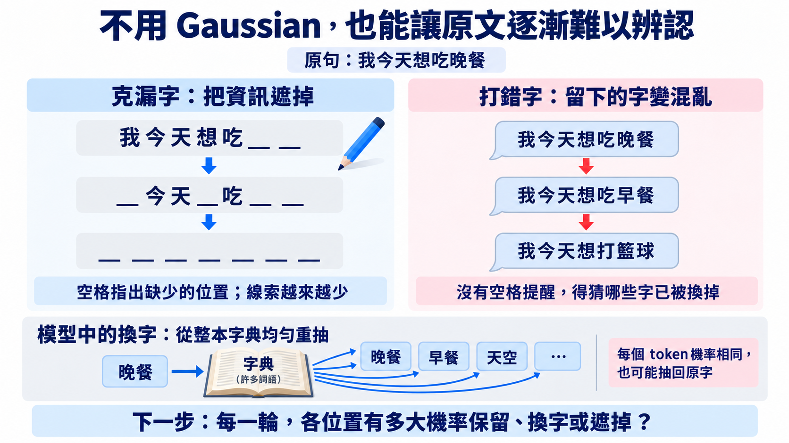
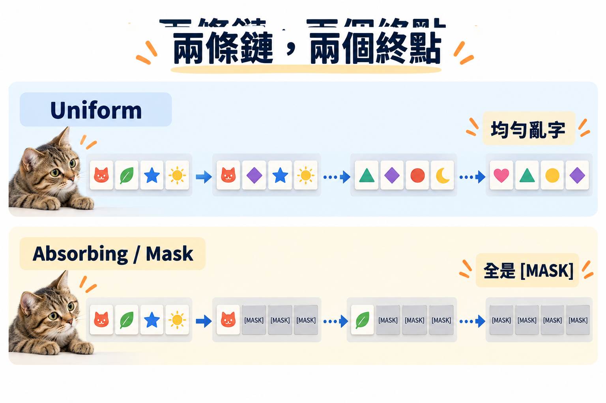

import Objectives from '../../../components/Objectives.astro';
import Prereq from '../../../components/Prereq.astro';
import Ask from '../../../components/Ask.astro';
import Remark from '../../../components/Remark.astro';
import Question from '../../../components/Question.astro';
import Answer from '../../../components/Answer.astro';
import QuizBlock from '../../../components/QuizBlock.astro';
import Option from '../../../components/Option.astro';
import Explanation from '../../../components/Explanation.astro';
import Details from '../../../components/Details.astro';
import Bridge from '../../../components/Bridge.astro';
import Ref from '../../../components/Ref.astro';

# 資料是 Token 的時候，噪聲是什麼？

<Objectives>
- **說出 token 的 noise 要怎麼設計。** 用替換與遮蔽破壞資訊，而不是對 token 編號加 Gaussian。
- **用 transition matrix 算出 $q(x_t\mid x_0)$。** 寫出 uniform 與 absorbing 兩條 chain，並利用投影矩陣的性質算出累積轉移。
- **分清 conditional 與 marginal distribution。** 每個位置獨立加噪，不代表整句話的 $p_t$ 也會獨立。
</Objectives>

<Prereq items={frontmatter.prereqs} />

## 如果資料是一句話呢？

前面我們把一張圖想成 $\mathbb R^d$ 裡的一個點，再逐步加入 Gaussian noise。但一句話是「我／今天／想／吃／……」這樣的一串 token，每個位置從字典裡選一個類別。「想」和「吃」的平均不是一個字；就算給它們編號，對編號加一點 noise 也沒有相同的意義。

回想 <Ref to="dma-forward-process"/>，Gaussian 幫我們做到的是：**先自己造出 noisy snapshot，再讓模型學怎麼回去。** 那麼，換成 token 後，能不能保留這個策略，只換掉破壞資訊的方法？

<Ask>
不能加一點 Gaussian noise， 
我們還可以怎麼讓一句話逐漸看不出原文？
</Ask>

想想以前做過的克漏字。「我今天想吃＿ ＿」還留著不少線索，我們可以猜空格裡可能是什麼；但如果變成「＿今天＿吃＿ ＿」，就更難猜了，可能會有很多種可能，像是「我今天想吃晚餐」、「他今天要吃火鍋」或「你今天不吃早餐」。若最後整句都遮掉，就只剩一排空格。所以其實**不用對字加 Gaussian noise，我們也可以逐步拿掉／模糊原文的資訊。**

另一個經驗是收到朋友打錯字的訊息。本來想說「我今天想吃晚餐」，卻因為輸入法選錯，變成「我今天想吃早餐」。只錯一個詞時，我們還能大概理解就是想吃飯；但若更多位置都選錯，就越來越難猜原本想說什麼。例如再變成「我今天想打籃球」。

**和克漏字不同，這次沒有空格提醒我們哪裡被動過，留下的字本身直接變混亂。**

要用這個想法造出 noisy snapshot，我們可以把換字方式簡化：被選中的位置都從整本字典均勻重抽，每個 token 被抽到的機率相同，而不限制在輸入法的候選字裡。像「晚餐」除了可能變成「早餐」，也可能變成完全不相關的「天空」。

那麼，要讓一句話一步一步變得更難辨認，我們得先決定：**每一輪，每個位置有多大的機率保留、換字，或被遮掉？** 接下來的數學，就是把這些操作發生的機率寫下來。

*圖：空格告訴我們哪裡缺少資訊；換字則沒有這個提示。從整本字典均勻重抽，是把生活中的打錯字簡化成可抽樣的 corruption 規則。*

## 每一步：保留、換字，或遮掉

把原句記成 $x_0=(x_0^1,\ldots,x_0^L)$，$L$ 是位置數，字典裡有 $K$ 個 token。先只看「晚餐」這個位置：下一步它可能保留、換成其他字，或被遮掉。我們要記錄的，就是每種結果的機率。

用 $Q_t(i,j)$ 記錄「第 $t$ 步從字 $i$ 變成字 $j$」的機率。把現在的字 $i$ 排成一列、下一步可能的結果 $j$ 排成一欄，就得到一張機率表。每個元素非負，每一列加起來是 $1$；這就是 **transition matrix（轉移矩陣）**。

我們可以選擇讓每個位置各自按這條規則抽樣。給定現在整句 $x_{t-1}$，下一句 $x_t$ 的 conditional probability 就是各位置轉移機率的乘積：

$$
q(x_t\mid x_{t-1})
=\prod_{\ell=1}^L Q_t(x_{t-1}^\ell,x_t^\ell).
$$

Austin 等人的 **D3PM** [1] 就把這類 corruption 寫成離散狀態上的 Markov chain。下面先把剛才的換字與遮蔽各寫成一條規則。

<Remark label="補充" summary="Markov：下一步只需要現在的狀態">
這裡的 Markov property 是
$$
q(x_t\mid x_{0:t-1})=q(x_t\mid x_{t-1}).
$$
**知道現在之後，要算下一步就不必再回頭查整段歷史。** 更完整的定義見 <Ref to="math-markov-chain"/>。這個假設在定義 forward chain；神經網路仍然可以看整句 $x_t$，利用不同位置之間的關係。
</Remark>

剛才從「訊息打錯字」想到的換字規則，可以選擇每步以機率 $1-\beta_t$ 保留原字，以機率 $\beta_t$ 從字典均勻重抽。這就是 **uniform corruption**：

$$
Q_t=(1-\beta_t)I+\beta_t P,
\qquad P=\frac1K\mathbf1\mathbf1^\top.
$$

重抽仍可能抽回原字，所以實際「換成別的字」的機率是 $\beta_t(K-1)/K$。

克漏字的做法則是多加一個符號 $m=\texttt{[MASK]}$，表示這個位置已經變成空格。每步以機率 $\beta_t$ 遮掉；已經被遮掉的位置就留在 $m$。這就是 **absorbing corruption**：

$$
Q_t=(1-\beta_t)I+\beta_t P,
\qquad P=\mathbf1 e_m^\top.
$$

這次矩陣大小是 $(K+1)\times(K+1)$，$e_m$ 是指向 MASK 的 one-hot vector。$P$ 的每一列都把機率送到 $m$；因此 $Q_t(m,m)=1$，$m$ 稱為 **absorbing state（吸收態）**。

<iframe loading="lazy" src="/personal_website/notes/research_areas/diffusion-models-applications/w6-0-noising.html" class="demo-frame" title="Token 的替換與遮蔽" style="height: 810px; width: 100%; border: none;"></iframe>

## Training 需要真的走完前面那些步嗎？

不需要。和 <Ref to="dma-denoising-regression"/> 一樣，我們想直接抽出 $x_t$，而不是先算 $x_1,\ldots,x_{t-1}$。要做到這件事，只需要把前面的轉移乘起來：

$$
\bar Q_t=Q_1Q_2\cdots Q_t,
\qquad
q(x_t^\ell=j\mid x_0^\ell=i)=\bar Q_t(i,j).
$$

兩種 corruption 的 $P$ 都滿足 $P^2=P$：均勻重抽一次或兩次，結果都均勻；送到 MASK 一次或兩次，結果也相同。於是

$$
\begin{aligned}
(aI+(1-a)P)(bI+(1-b)P)
&=abI+(1-ab)P,\\
\bar Q_t
&=\bar\alpha_t I+(1-\bar\alpha_t)P,\\
\bar\alpha_t&=\prod_{r=1}^t(1-\beta_r).
\end{aligned}
$$

所以 uniform 的 snapshot 是「以 $\bar\alpha_t$ 保留原字，否則均勻重抽」；absorbing 則是「以 $\bar\alpha_t$ 保留原字，否則遮掉」。**一張資料、一個 $t$，就能直接造出訓練用的 $x_t$。**

*圖：Uniform 逐漸得到均勻的亂字；absorbing 逐漸走向全 MASK。若 $\bar\alpha_T=0$，兩者的終點都可以直接抽樣。*

<Question id="Q1">
我們每個位置都獨立加噪，所以 noisy sentence 的各個位置也一定互相獨立嗎？

<Answer>
不一定。固定同一張 $x_0$ 時，加噪的隨機性是獨立的：
$$
q(x_t\mid x_0)=\prod_\ell q(x_t^\ell\mid x_0^\ell).
$$
但把原句平均掉之後，
$$
p_t(x_t)=\sum_{x_0}p_{\mathrm{data}}(x_0)
\prod_\ell q(x_t^\ell\mid x_0^\ell),
$$
各個位置共享的是**同一句原文**。原文中的語法、語意或 parity constraint，仍可能造成位置之間的相依。就像每個字各自被塗黑，不代表「我想吃」會變成三個互不相關的字。
</Answer>
</Question>

## 快速回顧一下

<QuizBlock id="w6-0-a">
對 token 編號加 Gaussian noise，主要的問題是什麼？
<Option>Gaussian 無法抽樣。</Option>
<Option correct>編號只是類別的名稱；數值的距離與平均不必有語意。</Option>
<Option>Token 一定不能用連續時間描述。</Option>
<Explanation>我們要改的是狀態之間如何轉移，不是把任意編號當成連續座標。</Explanation>
</QuizBlock>

<QuizBlock id="w6-0-b">
Absorbing chain 中已經到達 MASK 的 token：
<Option correct>之後的 forward steps 仍然是 MASK。</Option>
<Option>下一步一定恢復原字。</Option>
<Option>下一步均勻換成任意字。</Option>
<Explanation>MASK 的那一列只有 $Q_t(m,m)=1$，這就是吸收態。</Explanation>
</QuizBlock>

<QuizBlock id="w6-0-c">
為什麼兩條 chain 的累積轉移都能寫成 $\bar\alpha_t I+(1-\bar\alpha_t)P$？
<Option>因為所有 Markov chains 都有相同的 closed form。</Option>
<Option correct>因為這裡的 $P^2=P$，矩陣相乘後仍保留同一種形式。</Option>
<Option>因為神經網路學會了矩陣乘法。</Option>
<Explanation>Closed form 來自我們選擇的 forward 結構；一般 transition matrices 不一定有這個簡化。</Explanation>
</QuizBlock>

<Bridge to="dma-d3pm">
現在我們可以直接造出 noisy snapshot，也知道最後會走到哪個可抽樣的分布。那麼，看到 $x_t$ 後要怎麼回到上一格？下一篇從 Bayes 算出 reverse posterior，再看看 Gaussian 世界的 denoising MSE，在 MASK 世界會變成什麼 loss。
</Bridge>

## 參考文獻

1. Austin, J. et al. [*Structured Denoising Diffusion Models in Discrete State-Spaces.*](https://arxiv.org/abs/2107.03006) NeurIPS 2021.
