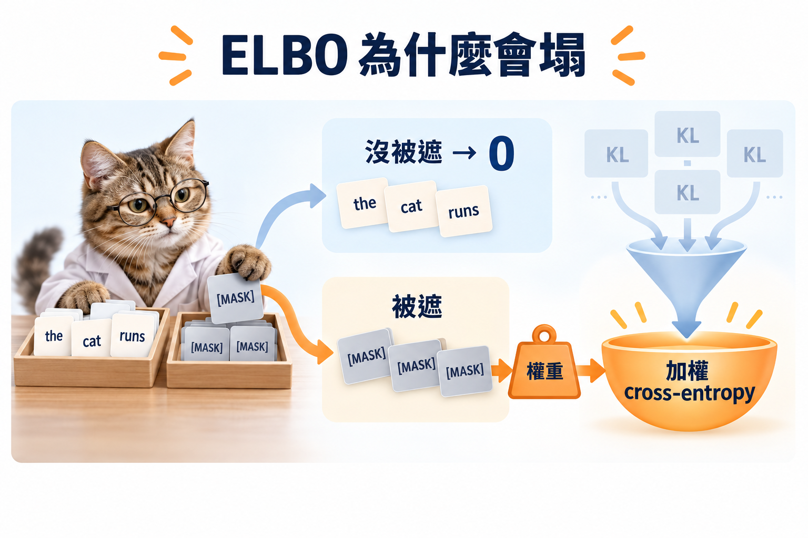

import Objectives from '../../../components/Objectives.astro';
import Prereq from '../../../components/Prereq.astro';
import Ask from '../../../components/Ask.astro';
import Remark from '../../../components/Remark.astro';
import Question from '../../../components/Question.astro';
import Answer from '../../../components/Answer.astro';
import QuizBlock from '../../../components/QuizBlock.astro';
import Option from '../../../components/Option.astro';
import Explanation from '../../../components/Explanation.astro';
import Details from '../../../components/Details.astro';
import Bridge from '../../../components/Bridge.astro';
import Ref from '../../../components/Ref.astro';

# 看到 MASK 之後，要學什麼才能生成？

<Objectives>
- **用 Bayes 算出離散 reverse posterior。** 分清已知 $x_0$ 的 conditional，與生成時不知道 $x_0$ 的 reverse distribution。
- **推導 absorbing diffusion 的 weighted masked cross-entropy。** 說出未遮位置為什麼沒有 KL，被遮位置的時間權重又從哪裡來。
- **把 denoiser 接成取樣器。** 寫出從 $t$ 到 $s$ 的翻開機率，並指出逐位置抽樣還留下哪個問題。
</Objectives>

<Prereq items={frontmatter.prereqs} />

## Forward 會算了，回去呢？

在 <Ref to="dma-discrete-data"/>，我們已經能把一句話逐步遮成全 MASK。生成時只要反過來：從全 MASK 出發，慢慢補出一串字。但「補出一個合理的字」還不是完整的生成規則；我們也要決定**這一步翻開哪些位置，以及其他位置要不要繼續保留 MASK。**

和 <Ref to="dma-denoising-regression"/> 一樣，先考慮可以偷看原文 $x_0$ 的情況。若位置 $\ell$ 的原字是 $k$，現在看到 $j$，Bayes 給出

$$
q(x_{t-1}^\ell=i\mid x_t^\ell=j,x_0^\ell=k)
=\frac{\bar Q_{t-1}(k,i)Q_t(i,j)}
{\bar Q_t(k,j)}.
$$

分子是「先走到 $i$，再變成 $j$」的機率；分母把所有可能的 $i$ 加起來。這是一個可以直接算的 **categorical posterior**，對應到 DDPM 裡的 conditional Gaussian。

<Ask>
可是生成時沒有原文 $x_0$。 
我們還能把這個好算的 posterior 用起來嗎？
</Ask>

## 網路先猜原字，再接回已知的規則

讓網路看整句 $x_t$，對每個位置輸出
$$
f_\theta^\ell(k\mid x_t,t)
\approx p(x_0^\ell=k\mid x_t).
$$
**Cross-entropy 要學的是原字的 conditional distribution，不是把幾個字的編號取平均。** 用這個預測替可能的原字加權，就能建構 reverse kernel：
$$
p_\theta^\ell(i\mid x_t,t)
=\sum_k q(i\mid x_t^\ell,x_0^\ell=k)
f_\theta^\ell(k\mid x_t,t).
$$
這是 $x_0$-parameterization 的想法：未知的資料關係交給 denoiser，已知的轉移由 forward chain 算。Austin 等人 [1] 在 D3PM 中採用這個策略；本篇以下使用 absorbing chain，式子會簡化很多。

<Remark label="補充" summary="哪些原字可以放進 posterior？">
上式只對 $\bar Q_t(k,x_t^\ell)>0$ 的候選 $k$ 定義。對 absorbing chain，若看見一個非 MASK 的字，原字只能就是它；我們直接複製輸入。若看見 MASK，所有原字都可以成為候選。一般 D3PM 也可以用已知 joint weights 再正規化來參數化 reverse kernel；不同寫法不能在零機率事件上直接相除。
</Remark>

## Absorbing 的 posterior 只有兩個選擇

如果 $x_t^\ell\neq m$，它從來沒有被遮掉，上一格必定是同一個字。如果 $x_t^\ell=m$，上一格可能已經是 MASK，也可能這一步才被遮掉。令
$$
w_t=\frac{\bar\alpha_{t-1}-\bar\alpha_t}{1-\bar\alpha_t}.
$$
分子是「到 $t-1$ 還保留、在 $t$ 被遮掉」的機率；分母是「在 $t$ 已被遮掉」的機率。因此
$$
q(x_{t-1}^\ell\mid x_t^\ell=m,x_0^\ell)
=(1-w_t)\delta_m+w_t\delta_{x_0^\ell}.
$$
模型則把最後那個原字換成預測的分布：
$$
p_\theta^\ell(\cdot\mid x_t,t)
=(1-w_t)\delta_m+w_t f_\theta^\ell(\cdot\mid x_t,t).
$$

## ELBO 怎麼變成 cross-entropy？

<Ref to="dma-denoising-regression"/> 已經看過 negative ELBO 的分解。離散資料的結構相同：除了終點的 prior KL，還有每一步的 reverse KL，以及最後回到 $x_0$ 的 reconstruction loss：
$$
\begin{aligned}
L_{\mathrm{VLB}}={}&C_T
+\sum_{t=2}^T\mathbb E\,D_{\mathrm{KL}}
\bigl(q(x_{t-1}\mid x_t,x_0)\,\|\,p_\theta(x_{t-1}\mid x_t)\bigr)\\
&+\mathbb E[-\log p_\theta(x_0\mid x_1)].
\end{aligned}
$$
其中 $C_T$ 不含 $\theta$。我們的 forward conditional 逐位置獨立，模型的 reverse kernel 也採用逐位置的 categorical outputs，所以這個 KL 可以拆成各位置的和。

現在代入 absorbing posterior。未遮的位置兩邊都複製原字，KL 是 $0$。被遮的位置，在 MASK 上的機率同為 $1-w_t$；只有原字那一項留下：
$$
\begin{aligned}
D_{\mathrm{KL}}(q\|p_\theta)
&=(1-w_t)\log\frac{1-w_t}{1-w_t}
+w_t\log\frac{w_t}{w_t f_\theta^\ell(x_0^\ell\mid x_t,t)}\\
&=w_t[-\log f_\theta^\ell(x_0^\ell\mid x_t,t)].
\end{aligned}
$$
令 $\bar\alpha_0=1$，則 $w_1=1$，reconstruction term 也能放進同一個和式：
$$
L_{\mathrm{VLB}}
=C_T+\sum_{t=1}^T\mathbb E
\left[w_t\sum_{\ell:x_t^\ell=m}
-\log f_\theta^\ell(x_0^\ell\mid x_t,t)\right].
$$
**原本要比較兩個 reverse distributions 的 KL，在這條 chain 上變成只對被遮位置計算的 weighted cross-entropy。** Sahoo 等人的 **MDLM** [2] 使用相同的 absorbing 結構，並在連續時間下寫出這個 objective。

*圖：未遮位置直接複製；被遮位置的 MASK 項相消，只留下原字的 cross-entropy 與已知時間權重。*

<Remark label="補充" summary="換掉權重，最佳 denoiser 會變嗎？">
固定 $(x_t,t)$，cross-entropy 的理想最佳解是 $f^\ell=p(x_0^\ell\mid x_t)$。正的 timestep weights 不改變這個逐輸入的最佳解；但有限容量的網路會共享參數，權重仍可能影響訓練結果。若換掉 ELBO 權重，新的 training loss 本身不再是同一個 likelihood bound；同一個 reverse model 仍可以用原本的 ELBO 評估。
</Remark>

## 從全 MASK 逐步補回來

Sampling 不必沿用所有 training timesteps。對 $s<t$，同樣的 Bayes 計算給出
$$
w_{t,s}=\frac{\bar\alpha_s-\bar\alpha_t}{1-\bar\alpha_t}.
$$
已填的字不動；每個 MASK 以機率 $w_{t,s}$ 翻開，翻成哪個字則按 $f_\theta^\ell(\cdot\mid x_t,t)$ 抽樣。再讓網路看更新後的句子，繼續下一步。

<iframe loading="lazy" src="/personal_website/notes/research_areas/diffusion-models-applications/w6-2-sampling.html" class="demo-frame" title="從全 MASK 逐步生成" style="height: 810px; width: 100%; border: none;"></iframe>

<Question id="Q1">
假設 denoiser 已經精確學到每個位置的 $p(x_0^\ell\mid x_t)$。那我們能不能一次把所有 MASK 都獨立填完，保證得到正確的整句 distribution？

<Answer>
還不能。它給的是**每個位置各自的 conditional marginal**；整句話還可能有共同的限制。譬如只有「00」和「11」兩種原文，各位置的機率都各半，但獨立抽樣還會產生「01」和「10」。

上面的 $w_{t,s}$ 精確決定了逐位置翻開的機率；把同時翻開的字獨立抽出來，卻是另一個假設。下一篇會把這個差別獨立拿出來看。
</Answer>
</Question>

## 快速回顧一下

<QuizBlock id="w6-1-a">
已知 $x_0$ 時，離散 reverse posterior 的來源是：
<Option>對 token 編號微分。</Option>
<Option correct>已知的 forward transitions，加上 Bayes。</Option>
<Option>模型額外預測一個 Gaussian。</Option>
<Explanation>$\bar Q_{t-1}(k,i)Q_t(i,j)$ 是 joint weight，除以 $\bar Q_t(k,j)$ 就是 posterior。</Explanation>
</QuizBlock>

<QuizBlock id="w6-1-b">
Absorbing loss 為什麼只計算 MASK 位置？
<Option>其他位置和整句話完全無關。</Option>
<Option correct>未遮位置的 conditional posterior 與複製輸入的 model kernel 相同，KL 為零。</Option>
<Option>每個字的 posterior 都均勻。</Option>
<Explanation>未遮字仍是網路推測其他位置時的重要 context，只是那一格不需要再學怎麼恢復。</Explanation>
</QuizBlock>

<QuizBlock id="w6-1-c">
一次獨立填完所有 MASK 的問題是：
<Option>每個位置的機率一定算錯。</Option>
<Option correct>各位置機率都對，也可能漏掉它們之間的 joint dependence。</Option>
<Option>一定需要改用 Gaussian noise。</Option>
<Explanation>Conditional marginals 不等於 conditional joint；模型誤差與這個抽樣假設要分開看。</Explanation>
</QuizBlock>

<Bridge to="dma-factorization-error">
現在 training loss 與 sampling 都有了。但即使每個位置都預測正確，一次填很多字仍可能組成不合法的句子。下一篇用一個只有 0、1 的例子，看清楚這個誤差到底從哪一步進來。
</Bridge>

## 參考文獻

1. Austin, J. et al. [*Structured Denoising Diffusion Models in Discrete State-Spaces.*](https://arxiv.org/abs/2107.03006) NeurIPS 2021.
2. Sahoo, S. S. et al. [*Simple and Effective Masked Diffusion Language Models.*](https://arxiv.org/abs/2406.07524) NeurIPS 2024.
