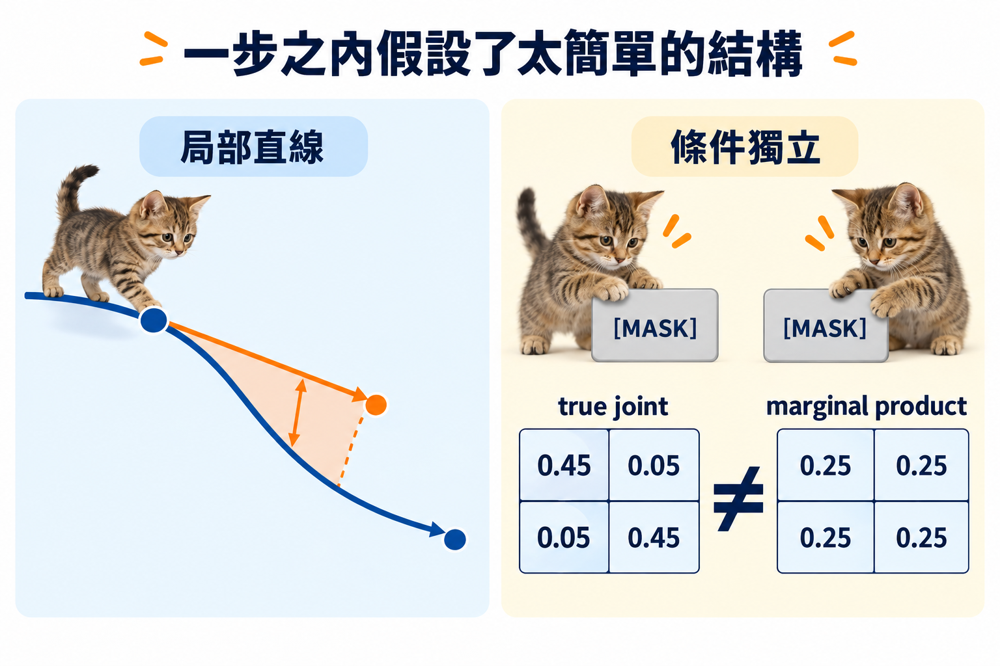

import Objectives from '../../../components/Objectives.astro';
import Prereq from '../../../components/Prereq.astro';
import Ask from '../../../components/Ask.astro';
import Remark from '../../../components/Remark.astro';
import Question from '../../../components/Question.astro';
import Answer from '../../../components/Answer.astro';
import QuizBlock from '../../../components/QuizBlock.astro';
import Option from '../../../components/Option.astro';
import Explanation from '../../../components/Explanation.astro';
import VizPlan from '../../../components/VizPlan.astro';
import Details from '../../../components/Details.astro';
import Bridge from '../../../components/Bridge.astro';
import Ref from '../../../components/Ref.astro';

# 因子化誤差：離散世界的曲率

<Objectives>
- **說出同時翻開多格隱含的獨立假設。** 並在 parity toy 上算出完美 marginal 仍會產生多少非法序列。
- **把 factorization error 寫成 KL。** 比較真正的 conditional joint 與各位置 conditional marginal 的乘積，並說出它何時為零。
- **對照離散與連續的少步誤差。** 連續模型怕曲率，離散模型怕相依 token 被拆開生成；autoregressive 則用速度換掉這項誤差。
</Objectives>

<Prereq items={frontmatter.prereqs} />

<Ask>
上一篇說步數可以壓到 8 步、甚至 1 步。 
那同時翻開很多格，代價是什麼？
</Ask>

## 每格都猜對，不代表整句合理

上一篇結尾留了一個問題：步數越少、每步同時翻開的格子越多，會出什麼問題？先把「網路給的是什麼」說精確。

網路看到 $x_t$，對**每個**被遮的位置 $\ell$ 輸出一個分佈 $p_\theta(x_0^\ell\mid x_t)$。這是一個 **marginal**——「在看到 $x_t$ 的前提下，位置 $\ell$ 單獨來看是哪個字的機率」。它沒有告訴我們位置 $\ell$ 和位置 $\ell'$ **一起**會是什麼；網路沒有輸出任何 joint。

取樣時如果這一步只翻開一個位置，marginal 就是我們需要的全部。但如果同時翻開一組位置 $S$，我們實際上是從

$$
\prod_{\ell\in S}p_\theta(x_0^\ell\mid x_t)
$$

抽樣。而正確的目標是 conditional joint $p(x_0^S\mid x_t)$。兩者相等的條件是：**給定 $x_t$，$S$ 裡的位置彼此 conditionally independent。** 語言裡這幾乎從不成立——「今天想吃 `[MASK]` `[MASK]`」的兩個空格，「牛肉／麵」和「壽／司」各自都合理，「牛肉／司」不合理，而 marginal 的乘積會以不小的機率生出它。

這就是同時翻開多個 token 的全部代價：**用乘積代替了 joint，忽略了條件相依。**

<Question id="Q1">
既然如此，最省事的做法——一步把所有 token 全部翻開——會壞到什麼程度？請先在下面這個小例子上算：長度 8 的 0/1 序列，資料分佈是所有**偶數個 1** 的序列（共 128 條，均勻）。假設網路是完美的（輸出的 marginal 就是真實的 conditional marginal），從全 `[MASK]` 出發一步翻開全部，得到合法序列的機率是多少？如果改成每步翻開一個、走 8 步呢？每步翻開兩個、走 4 步呢？

<Answer>
從全 `[MASK]` 出發，每個位置的真實 marginal 都是 $\tfrac12$（偶數 parity 的序列裡每個位置是 0 或 1 的機率各半）。一步翻開全部，就是從 $\{0,1\}^8$ 均勻抽一條，落在偶數 parity 的機率是 **$\tfrac12$**。一半的樣本不合法。

每步翻開一個、走 8 步：前 7 個位置的 marginal 依然各是 $\tfrac12$（少於 8 個已知的位置時，剩下的位置仍可以配成任一 parity），第 8 個位置的 conditional 是**確定的**——它必須把 parity 補成偶數。完美的網路會輸出一個機率 1 的 marginal，合法率 **1**。

每步翻開兩個、走 4 步：前三步都沒問題（任何少於 8 個位置的子集，joint 就是均勻的乘積），但**最後一步**同時翻開最後兩個位置——它們的 conditional joint 只允許兩種組合（01 或 10，或 00 與 11，取決於前六個的 parity），marginal 的乘積卻允許四種。合法率 **$\tfrac12$**。

把三個數字放在一起會看到這個例子想說的事：誤差**不是**由步數均勻地決定，它出現在「同時翻開的位置之間存在條件相依」的那一步。parity 的相依全部藏在最後一個自由度上，所以只有最後一步翻開超過一個位置時才會出錯；真實語言的相依散在各處（相鄰字、主謂一致、括號配對），所以每一步都會漏一點。**步數越少、每步翻開越多，漏掉的相依越多。**
</Answer>
</Question>

## 把誤差寫成一個數

上面的例子可以寫成一般式。在某一步，模型從 $x_t$ 同時翻開位置集合 $S$。這一步應該抽的是 $p(x_0^S\mid x_t)$，實際抽的是 $\prod_{\ell\in S}p(x_0^\ell\mid x_t)$（先假設網路完美，只看因子化本身的代價）。兩者之間的差距：

$$
\mathrm{FE}(S\mid x_t)\;=\;\mathrm{KL}\Big(p(x_0^S\mid x_t)\;\Big\|\;\prod_{\ell\in S}p(x_0^\ell\mid x_t)\Big).
$$

這個量在資訊理論裡叫 **total correlation**（多變數版本的 mutual information）：它衡量一組變數「合起來看」比「分開看」多知道多少。它 $\ge0$，且**等於零若且唯若 $S$ 裡的位置在給定 $x_t$ 下 conditionally independent**。$|S|=1$ 時它恆為零——一次翻開一個位置永遠沒有因子化誤差。

整個取樣程序的因子化誤差，是每一步這個量的和（對每步的 $x_t$ 取期望）。parity 例子裡，前面各步的 $\mathrm{FE}$ 都是零，最後一步翻開兩個位置時 $\mathrm{FE}=\log 2$——正好對應「一半樣本不合法」。

取樣程序真正生成的分佈是把每一步的乘積分佈串起來得到的 $\tilde p(x_0)$。用 chain rule 把 $\log\frac{p(x_0)}{\tilde p(x_0)}$ 沿著翻開的順序拆開，每一步貢獻的正是 $\log\frac{p(x_0^{S}\mid x_t)}{\prod_\ell p(x_0^\ell\mid x_t)}$，取期望就是上面的 KL。所以 $\mathrm{KL}(p\,\|\,\tilde p)=\sum_{\text{steps}}\mathbb E\,\mathrm{FE}(S\mid x_t)$——**生成分佈與真實分佈的差距，就是所有步的因子化誤差之和**（網路完美時）。

這個誤差**不在訓練 loss 裡**。<Ref to="dma-masked-diffusion"/> 的 ELBO 是對「每步翻開一個位置」的鏈算的（$T\to\infty$ 時每步幾乎只翻開零或一個位置），它的最小值是完美的 marginal。因子化誤差純粹是取樣時「一步走太大」造成的——這和 <Ref to="dma-error-theory"/> 的情形一模一樣：訓練目標是精確的速度場，Euler 誤差是離散化造成的。

<iframe loading="lazy" src="/personal_website/notes/research_areas/diffusion-models-applications/w6-3-parity.html" class="demo-frame" title="marginal 的乘積 vs 真實的 joint：互動 demo" style="height: 810px; width: 100%; border: none;"></iframe>

**互動 demo：marginal 的乘積 vs 真實的 joint。** 就是上面那個 parity 例子，只是把兩張表並排畫出來。按 $k=1$：每一步只翻開一格，$\mathrm{FE}$ 一直是 **0**，跑 1000 次的合法率 **100%**。按 $k=2$ 或更大：$\mathrm{FE}$ 在前面幾步還是 0，**只有最後那一步跳到 $\log 2\approx0.693$**，合法率掉到 **50%** 上下（實測 $k=2$ 是 49.8%、$k=4$ 是 48.3%、$k=8$ 是 52.6%）。$k=8$ 時兩張表會畫成一排細柱：真實 joint 的 256 個組合裡只有 **128 個機率不是 0**，marginal 的乘積卻 **256 個都有值**。

## 這是離散世界的曲率

把這一篇和 <Ref to="dma-error-theory"/> 並排，會看到同一個結構：

| | 連續（<Ref week="dma-week-interpolants"/>） | 離散（本單元） |
|---|---|---|
| 訓練學到的物件 | 精確的速度場 $u_t(x)$ | 精確的 marginal $p(x_0^\ell\mid x_t)$ |
| 一步走太大時假設了什麼 | 軌跡在這一步內是**直線** | 這一步翻開的位置**條件獨立** |
| 誤差的來源 | 曲率 $\int\|\ddot x_t\|\,dt$ | 條件相依（total correlation） |
| 何時為零 | 軌跡是直線 | 每步只翻開一個位置 |
| 減少誤差的做法 | 多走幾步；拉直軌跡（reflow、OT 配對）；高階 solver | 多走幾步；挑「相依弱」的位置先翻（信心排序）；顯式建模相依 |

這張表是這個單元最重要的一張。它說的是：**有限步取樣的誤差，在兩個世界裡都來自「一步之內假設了太簡單的結構」。** 連續世界假設直線，離散世界假設獨立。<Ref to="dma-rectified-flow"/>、<Ref to="dma-minibatch-ot"/> 在連續世界做的「拉直」，在離散世界沒有直接對應——沒有「直的配對」這回事——所以離散世界減少誤差的手段目前主要落在最後一行的後兩項：MaskGIT [3] 用信心排序挑位置；近期的工作（例如 Discrete Copula Diffusion [4]）則試著在取樣時補回相依的結構。這條線還在發展中。

## 那不如直接用 autoregressive？

表格最後一列還說了另一件事。「每步只翻開一個位置」在因子化誤差上是零，而它就是 **autoregressive**（AR）模型的做法——只是 AR 固定從左到右，masked diffusion 每步隨機挑一個位置。Ou et al. [1] 與更早的 ARDM [2] 都指出：absorbing diffusion 學到的 $p(x_0^\ell\mid x_t)$ 是乾淨資料的所有 conditional，所以每步翻一個的 masked diffusion 就是一個**任意順序**的 AR 模型。

於是兩者的取捨可以講得很乾脆：

- **AR**：一次一個 token，固定順序，factorization 精確、沒有因子化誤差；代價是 $L$ 個 token 要 $L$ 次網路呼叫，**無法平行**。
- **Masked diffusion**：任意順序，一步可以翻開很多個、**可以平行**，$L/k$ 次呼叫；代價是每步翻開的位置之間的因子化誤差。此外它天生能做填空（雙向 context），AR 需要額外設計。

這是 <Ref to="dma-error-theory"/> 那個「步數 vs 誤差」的取捨換了一套詞。Zheng et al. [5] 提醒了一件實務上的事：比較 masked diffusion 與 AR 的 perplexity 時，若取樣步數不夠、或類別抽樣的數值實作不精確，會把因子化誤差誤讀成別的東西；比較時要把「每步翻開幾個」當成明確的實驗變數。

*圖：逐格揭露會讓後一步看見更新後的 context；同時揭露多格若把 joint 拆成 marginals，就可能違反 parity 約束。*

## 先消化一下

<QuizBlock id="w6-3-a">
Masked diffusion 一步同時翻開位置集合 $S$，等價於假設：
<Option>$S$ 裡的位置在資料分佈下互相獨立。</Option>
<Option correct>給定當前的 $x_t$，$S$ 裡的位置彼此 conditionally independent。</Option>
<Option>網路對 $S$ 裡每個位置的 marginal 都是正確的。</Option>
<Explanation>
關鍵字是「給定 $x_t$」——已翻開的 context 會消掉一部分相依，剩下的才是問題。marginal 正確與否是另一個獨立的誤差來源（模型誤差）；即使 marginal 完美，因子化誤差仍在。
</Explanation>
</QuizBlock>

<QuizBlock id="w6-3-b">
Parity toy 裡，每步翻開兩個、走 4 步的合法率是 $\tfrac12$，而不是比一步全翻開好。這說明：
<Option>步數對誤差沒有影響。</Option>
<Option correct>因子化誤差出現在「同時翻開的位置有條件相依」的那一步；parity 的相依全藏在最後一個自由度，所以只要最後一步翻開超過一個位置，就會漏掉它。</Option>
<Option>網路不夠好。</Option>
<Explanation>
這個例子刻意讓相依集中在最後。真實語言的相依散在各處，步數增加會逐步減少漏掉的相依，曲線是漸變的（<Ref to="dma-lab-discrete-time"/> 的 Markov toy 會把這條曲線畫出來）。網路在這個例子裡假設是完美的。
</Explanation>
</QuizBlock>

<QuizBlock id="w6-3-c">
連續世界的有限步誤差來自曲率，離散世界的來自因子化。兩者共同的結構是：
<Option>兩者都可以靠增加網路容量消除。</Option>
<Option>兩者都在訓練 loss 裡被最小化。</Option>
<Option correct>兩者都是「一步之內假設了太簡單的結構」——直線／條件獨立——而訓練目標本身是精確的，誤差只在取樣時一步走太大才出現。</Option>
<Explanation>
訓練學到的是精確的速度場或精確的 marginal；誤差是離散化造成的，不在 loss 裡，也不是容量問題。這正是為什麼兩個世界都有「步數 vs 品質」的曲線。
</Explanation>
</QuizBlock>

<QuizBlock id="w6-3-d">
「每步只翻開一個位置」的 masked diffusion 與 autoregressive 模型的關係是：
<Option>兩者完全不同，因為 masked diffusion 有時間變數。</Option>
<Option correct>它就是一個任意順序的 autoregressive 模型——學到的是同一組 conditional distribution，只是翻開的順序隨機而非固定從左到右。</Option>
<Option>masked diffusion 在這個設定下仍有因子化誤差。</Option>
<Explanation>
$|S|=1$ 時 total correlation 恆為零。差別只剩順序（任意 vs 固定）與呼叫次數（相同，都是 $L$ 次）；masked diffusion 的優勢——平行——正是在 $|S|>1$ 時才出現，代價也在那時才出現。
</Explanation>
</QuizBlock>

<Bridge to="dma-absorbing-vs-uniform">
Factorization error 解釋了為什麼少步會錯，卻沒有回答錯了之後能不能補救。Absorbing chain 把翻開的字固定；uniform chain 則允許任何字再次改動。下一篇比較這兩種走法，看看「可以反悔」會買到什麼、又犧牲什麼。
</Bridge>

## 參考文獻

1. Ou, J., Nie, S., Xue, K., Zhu, F., Sun, J., Li, Z., Li, C. [*Your Absorbing Discrete Diffusion Secretly Models the Conditional Distributions of Clean Data.*](https://arxiv.org/abs/2406.03736) ICLR 2025.（absorbing diffusion 學到的是乾淨資料的 conditional；與任意順序 AR 的關係。）
2. Hoogeboom, E., Gritsenko, A. A., Bastings, J., Poole, B., van den Berg, R., Salimans, T. [*Autoregressive Diffusion Models.*](https://arxiv.org/abs/2110.02037) ICLR 2022.（ARDM：任意順序 AR 與 absorbing diffusion 的等價。）
3. Chang, H., Zhang, H., Jiang, L., Liu, C., Freeman, W. T. [*MaskGIT: Masked Generative Image Transformer.*](https://arxiv.org/abs/2202.04200) CVPR 2022.（信心排序的平行解碼。）
4. Liu, A., Liu, O., Van den Broeck, G. [*Discrete Copula Diffusion.*](https://arxiv.org/abs/2410.01949) ICLR 2025.（把平行解碼漏掉的相依顯式補回。）
5. Zheng, K., Chen, Y., Mao, H., Liu, M.-Y., Zhu, J., Zhang, Q. [*Masked Diffusion Models are Secretly Time-Agnostic Masked Models and Exploit Inaccurate Categorical Sampling.*](https://arxiv.org/abs/2409.02908) ICLR 2025.（比較 MDM 與 AR 時的實驗陷阱。）
6. Sahoo, S. S. et al. [*Simple and Effective Masked Diffusion Language Models.*](https://arxiv.org/abs/2406.07524) NeurIPS 2024.
