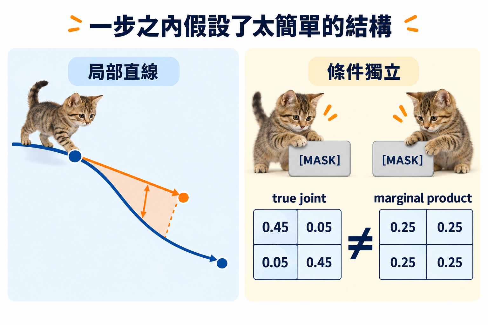

import Objectives from '../../../components/Objectives.astro';
import Prereq from '../../../components/Prereq.astro';
import Ask from '../../../components/Ask.astro';
import Remark from '../../../components/Remark.astro';
import Question from '../../../components/Question.astro';
import Answer from '../../../components/Answer.astro';
import QuizBlock from '../../../components/QuizBlock.astro';
import Option from '../../../components/Option.astro';
import Explanation from '../../../components/Explanation.astro';
import Details from '../../../components/Details.astro';
import Bridge from '../../../components/Bridge.astro';
import Ref from '../../../components/Ref.astro';

# 每格都猜對，整句話就會對嗎？

<Objectives>
- **用 parity 說明 marginal 正確不等於 joint 正確。** 算出一次獨立填完與逐格填入時，各自的合法率。
- **寫出 factorization error 比較的兩個 distributions。** 它量的是 conditional joint 與 conditional marginals 的乘積，而不是網路預測誤差。
- **說明步長為什麼會影響這個誤差。** 同一步填越多格，可能漏掉更多相依；但不是所有資料都隨步數單調改善。
</Objectives>

<Prereq items={frontmatter.prereqs} />

## 問題可能不在網路

在 <Ref to="dma-d3pm"/>，每個 MASK 都有一個原字的預測分布。我們可以一次呼叫網路，平行填入很多字；這看起來比一格一格生成快得多。但一句話的合理性不是每個字各自合理就夠了：前面選了「一隻」，後面接「貓」或「桌子」，結果並不一樣。

先把網路誤差拿掉，假設我們已經知道**精確的 conditional marginal**。這樣一次填很多格，問題還會存在嗎？

## 只有 0、1，就能看出差別

考慮長度 $L=3$ 的 bit 序列。資料只有偶數 parity，也就是 $1$ 的數量為偶數：
$$
p_0(000)=p_0(011)=p_0(101)=p_0(110)=\frac14.
$$
從全 MASK 看，每一格的 $0$、$1$ 機率都是 $\tfrac12$。如果把三格獨立抽出來，八種序列都會出現，合法率只有 $\tfrac12$。

但若先填前兩格，再讓網路看更新後的 context，最後一格就被 parity 決定了。例如前兩格是 $01$，最後一格只能是 $1$。這樣逐格使用精確 conditional，合法率是 $1$。

<Ask>
各格的機率都算對了， 
那一次填完時，到底漏掉了什麼？
</Ask>

## 漏掉的是同一步裡的相依

令 $A$ 是已看見的位置，$B$ 是這一步要填的位置。真正需要的是
$$
p(x_0^B\mid x_0^A),
$$
逐位置抽樣卻使用
$$
\prod_{\ell\in B}p(x_0^\ell\mid x_0^A).
$$
兩者的 KL 就是這裡的 **factorization error（因子化誤差）**：
$$
\mathrm{FE}(A,B)
=\mathbb E_{x_0^A}D_{\mathrm{KL}}
\left(p(x_0^B\mid x_0^A)
\,\middle\|\,
\prod_{\ell\in B}p(x_0^\ell\mid x_0^A)\right).
$$
它比較的是「一起填時應該怎麼搭配」與「各自填時的乘積」。Zheng 等人 [1] 也將平行 decoding 視為重用舊預測的近似；這裡用精確 conditional marginals，把同一步漏掉的相依單獨量出來。

在全 MASK 的 parity 例子，真實 joint 對四種合法序列各給 $\tfrac14$，乘積分布則各給 $\tfrac18$，所以
$$
\mathrm{FE}(\varnothing,\{1,2,3\})
=4\cdot\frac14\log\frac{1/4}{1/8}
=\log2.
$$
**即使模型已經完美，這個誤差仍然存在。**

<iframe loading="lazy" src="/personal_website/notes/research_areas/diffusion-models-applications/w6-3-parity.html" class="demo-frame" title="Parity 的 joint 與獨立填字" style="height: 810px; width: 100%; border: none;"></iframe>

<Remark label="補充" summary="每個 head 獨立抽樣，不代表網路只能看一個字">
Transformer 的每個 output head 可以看整句 context，學到的位置機率也可以完全正確。因子化發生在**同一步怎麼抽出多個 token**：它們還沒看見彼此剛抽出的答案。問題不是 attention 看不到其他位置，而是 conditional marginals 不能替代 conditional joint。
</Remark>

<Question id="Q1">
在 parity toy 裡，先填很多格，最後只剩一格；或者每一步都填得很少，但最後還有兩格一起填。哪一種能保證合法？這表示「步數越多一定越好」嗎？

<Answer>
用精確 conditional 時，**最後只剩一格**就能補對 parity；前面怎麼填都還有合法的 completion。若最後兩格一起獨立填，它們的 marginals 仍各半，合法率只有 $\tfrac12$。

因此這個例子看的是「最後剩下的相依有沒有被一起拆掉」，不是步數本身。增加步數通常讓同時填的格數變少，但不能不看實際的 reveal schedule，就宣稱每次加一步都一定改善。
</Answer>
</Question>

*圖：逐格填時，下一格會看見前一格的結果；同時獨立填時，這批 token 之間的限制可能被漏掉。*

先固定一個與資料無關的 reveal partition $B_1,\ldots,B_N$，令 $A_n$ 是第 $n$ 步前已填的位置。假設所有 conditional marginals 都精確，生成分布為
$$
\hat p_0(x)=\prod_{n=1}^N\prod_{\ell\in B_n}
p(x^\ell\mid x^{A_n}).
$$
真實資料可以按相同順序用 chain rule 分解：
$$
p_0(x)=\prod_{n=1}^N p(x^{B_n}\mid x^{A_n}).
$$
把兩者代入 KL，先拆開 log，再對已填位置取期望：
$$
\begin{aligned}
D_{\mathrm{KL}}(p_0\|\hat p_0)
&=\mathbb E_{p_0}\sum_n
\log\frac{p(x^{B_n}\mid x^{A_n})}
{\prod_{\ell\in B_n}p(x^\ell\mid x^{A_n})}\\
&=\sum_n\mathrm{FE}(A_n,B_n).
\end{aligned}
$$
若 reveal order 本身隨機，這個等式先對**固定的 order**成立；把 order 平均掉後，由 KL 的凸性，terminal KL **不超過**各 order 的 KL 平均。若順序還依賴模型信心，就要另外分析那個選擇規則，不能直接沿用等式。

## 快速回顧一下

<QuizBlock id="w6-3-a">
Factorization error 可以在什麼情況下仍存在？
<Option>只有網路沒訓練好時。</Option>
<Option correct>Conditional marginals 完全正確，但同一步獨立填入相依的多個位置時。</Option>
<Option>只有 uniform corruption 才會發生。</Option>
<Explanation>它來自 joint 的分解假設，不是 marginal 預測不準。</Explanation>
</QuizBlock>

<QuizBlock id="w6-3-b">
Parity toy 最後只剩一格時，精確 conditional 為什麼能補對？
<Option correct>已填位置決定了最後一個 bit，posterior 是確定的。</Option>
<Option>因為網路一定看過同一個 training pair。</Option>
<Option>因為最後一步沒有隨機性就一定正確。</Option>
<Explanation>確定性來自資料的 parity constraint；一般資料的最後一格不必是確定的。</Explanation>
</QuizBlock>

<QuizBlock id="w6-3-c">
為什麼縮小 reveal batch 常常有幫助？
<Option>因為它會自動消除模型誤差。</Option>
<Option correct>先填的結果能進入下一步 context，較少相依被拆在同一步。</Option>
<Option>因為 token 變成連續數值。</Option>
<Explanation>它改善抽樣方式，仍不能保證有限網路的預測也精確。</Explanation>
</QuizBlock>

<Bridge to="dma-absorbing-vs-uniform">
少填幾格可以讓下一步看見更多 context，但 absorbing sampler 還有另一個限制：剛才填錯的字，之後不會再碰它。如果要給模型修改的機會，我們該換一條 forward chain，還是可以只改生成時的規則？
</Bridge>

## 參考文獻

1. Zheng, K. et al. [*Masked Diffusion Models are Secretly Time-Agnostic Masked Models and Exploit Inaccurate Categorical Sampling.*](https://arxiv.org/abs/2409.02908) 2024.
