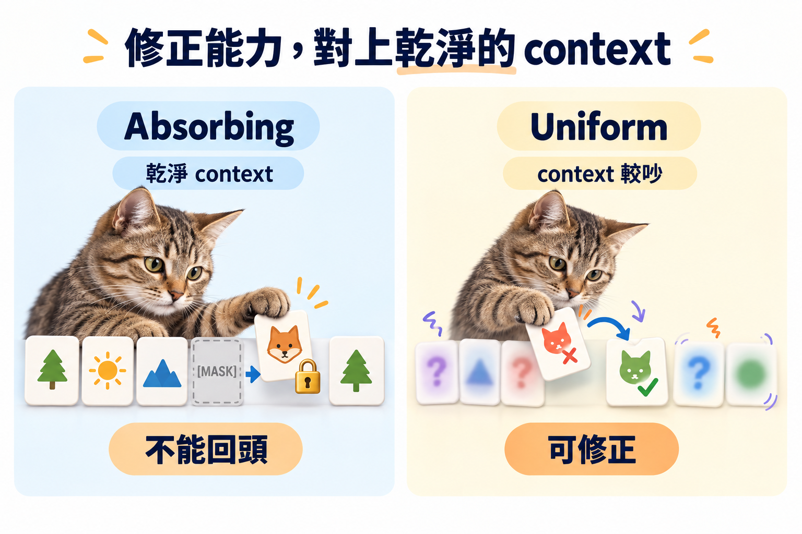

import Objectives from '../../../components/Objectives.astro';
import Prereq from '../../../components/Prereq.astro';
import Ask from '../../../components/Ask.astro';
import Remark from '../../../components/Remark.astro';
import Question from '../../../components/Question.astro';
import Answer from '../../../components/Answer.astro';
import QuizBlock from '../../../components/QuizBlock.astro';
import Option from '../../../components/Option.astro';
import Explanation from '../../../components/Explanation.astro';
import VizPlan from '../../../components/VizPlan.astro';
import Details from '../../../components/Details.astro';
import Bridge from '../../../components/Bridge.astro';
import Ref from '../../../components/Ref.astro';

# Absorbing 與 Uniform：翻錯的字能不能改？

<Objectives>
- **比較 absorbing 與 uniform 的反向取樣。** 前者翻開後固定，後者允許任何 token 再次改動。
- **把兩條鏈對到 ODE／SDE 的取捨。** 一邊保留乾淨 context 但不修正，另一邊能修正卻持續擾動樣本。
- **解釋 absorbing 為何常在實務上更好。** `[MASK]` 明確標出未知位置；這也暴露出 remasking 想解的缺口。
</Objectives>

<Prereq items={frontmatter.prereqs} />

<Ask>
如果第三步就把一個字填錯了， 
後面還有機會改回來嗎？
</Ask>

## 反向的時候，兩條鏈差在哪？

前兩篇一直盯著 absorbing 鏈，因為它的數學最乾淨。現在把 uniform 鏈拉回來並排，看反向取樣時兩者的行為差在哪。

**Absorbing。** 每一步只對仍是 `[MASK]` 的位置做事：翻開一些、留一些。已翻開的位置，posterior 說「機率 1 保持原字」，反向過程**碰都不會碰**。所以如果第 2 步在某個位置翻出了一個不對的字——比方說因子化誤差讓兩個空格填成了「牛肉／司」——之後的 6 步只能在這個錯字**旁邊**繼續填，沒有任何一步能把「司」換掉。錯誤留下來，而且會影響後面：其他位置的 marginal 是以這個錯字為 context 算的。

**Uniform。** 每一步，posterior $q(x_{t-1}\mid x_t,x_0)\propto(x_tQ_t^{\!\top})\odot(x_0\bar Q_{t-1})$ 對**每個**位置都有可能給出與 $x_t$ 不同的字：因為 forward 每步都可能把任何字換成任何字，反向每步也就可能把任何字換成任何字。一個在早期被填錯的位置，之後的步驟仍有機會把它換成更合理的字。反向的 uniform 鏈有**自我修正**的能力。

這和 <Ref to="dma-sampler-family"/> 講的 ODE 與 SDE 是同一組對比。ODE 取樣器沒有噪聲、沒有修正，每步的誤差直接累積到終點；SDE 取樣器每步注入噪聲、再由 score 項把樣本拉回 $p_t$，早期的偏離會被後面修掉。Absorbing 像 ODE，uniform 像 SDE。

<iframe loading="lazy" src="/personal_website/notes/research_areas/diffusion-models-applications/w6-4-correction.html" class="demo-frame" title="翻錯的字，之後改得回來嗎：互動 demo" style="height: 800px; width: 100%; border: none;"></iframe>

**互動 demo：翻錯的字，之後改得回來嗎。** 兩排是同一條長度 16 的 0/1 序列（資料：相鄰格以機率 0.9 相同），網路是**精確算出來的** conditional marginal（前向後向），所以看到的全部是兩條鏈本身的差別。按「植入一個錯誤」再一路走完：**absorbing 那排的紅框永遠不變**，uniform 那排常常在後面幾步被改掉、變成綠框。跑 200 次的修正率實測是 absorbing **0.0%**、uniform **62%～67%**。代價在「視角」那顆按鈕——打開它就看到 uniform 的 $x_t$ 裡噪聲字和原字**長得一模一樣**，那些虛線框是讀者看得到、模型看不到的。

## 那為什麼實務上 absorbing 比較好？

照上面的說法，uniform 能修正、absorbing 不能，uniform 應該更好。但 D3PM [1] 在文字上的實驗、以及之後 SEDD [2] 用連續時間重做的比較，都是 **absorbing 的 perplexity 明顯更好**。原因在 demo 的第二個面板裡：

**uniform 鏈的 $x_t$ 裡，噪聲字和原字長得一模一樣。** 模型看到「今天想吃壽貓」，得先判斷「貓」是噪聲還是原文的一部分（也許這句本來就在講貓），然後才能決定要不要改。每一步、每個位置都要做這個判斷，而判斷會錯——它可能把原字當噪聲改掉，也可能把噪聲當原字留下。修正能力是有了，但修正本身會引入新的錯誤。

absorbing 鏈把這個判斷**完全拿掉**：`[MASK]` 一眼可辨，沒被遮的字一定是對的（就 forward 而言）。模型的全部容量都用在「這個空格該填什麼」上。所有的不確定性集中在一種符號上，而不是散在字典的每個字裡。

所以兩條鏈的取捨是：**修正能力**（uniform 有、absorbing 沒有）對上 **乾淨的 context**（absorbing 有、uniform 沒有）。經驗上第二項更重要——至少在語言上、在目前的模型規模下。這和 <Ref to="dma-reverse-process"/> 的判準——**模型誤差與離散化誤差誰佔上風**——不完全對應。SDE 多加的噪聲修得動模型誤差，但它自己會帶進離散化誤差，而後者隨步數變小；uniform 付的手續費不是「每步的噪聲」，而是「每步都要重新判斷什麼是噪聲」，這個代價**不隨步數變小**，所以它不會在步數多的那一端自己消失。

<Remark label="補充" summary="demo 的修正率是上限，不是實際模型拿得到的">
上面 demo 的網路是用前向後向**精確算**出來的，所以它在判斷「哪些字是噪聲」這件事上不會犯錯——量到的 62%～67% 是 uniform 修正能力的**上限**。

真實模型會在這個判斷上犯錯，而錯的兩種方式都有代價：把原字當噪聲改掉（破壞已經對的部分）、把噪聲當原字留下（錯字留到最後）。所以實驗上 uniform 拿到的淨好處遠小於這個上限，甚至是負的——這正是 D3PM 與 SEDD 都量到 absorbing 更好的原因。
</Remark>

<Question id="Q1">
有沒有辦法**兩個都要**——保留 `[MASK]` 帶來的乾淨 context，又讓早期填錯的字有機會被改？請用這個單元的語言描述你會怎麼設計 forward chain。

<Answer>
直覺的設計是：在 absorbing 鏈上**加一點「回到 `[MASK]`」的機會**——一個已經翻開的字，以某個小機率被重新遮起來，之後再重填。這樣噪聲仍然只有一種符號（context 依然乾淨），但錯字不再永遠固定；重新被遮的位置會用當時更完整的 context 重新填一次。

這個想法叫 **remasking**，近期的工作（例如 ReMDM [3]）正是這麼做的。但要把它做對，有幾件事得說清楚：重新遮的機率該是多少？它會不會改變每個 $t$ 的邊際分佈 $q(x_t\mid x_0)$、進而讓訓好的模型不再適用？「每步翻開的比例」和「每步重遮的比例」之間該怎麼平衡？這些問題用本單元離散時間、transition matrix 的語言答起來很笨拙——每個問題都要重新算一次矩陣連乘。

下一個單元換一種語言：連續時間，用 **rate** 描述「每單位時間有多少機率從一個狀態流到另一個狀態」。在那個語言裡，remasking 只是在 absorbing 過程上多加一個 rate，而它對應到的正是 <Ref to="dma-sampler-family"/> 那個「訓練噪聲與取樣噪聲是兩個設定」裡取樣器的 $\varepsilon$。答案會變得很短。
</Answer>
</Question>

*圖：Absorbing 保留乾淨 context，代價是已生成 token 不能回頭；uniform 能修正，卻讓 context 持續帶噪。*

## 先消化一下

<QuizBlock id="w6-4-a">
Absorbing 鏈的反向取樣不能修正已翻開的 token，這件事對應連續世界的：
<Option correct>ODE 取樣器：沒有噪聲注入、沒有把樣本拉回 $p_t$ 的機制，每步誤差直接累積。</Option>
<Option>SDE 取樣器：每步注入噪聲。</Option>
<Option>高階 solver：用更多評估減少每步誤差。</Option>
<Explanation>
「翻開就固定」與「ODE 軌跡一旦偏離就沿著錯的軌跡走到底」是同一件事：沒有機制回頭。SDE 的 score 項提供修正，那對應 uniform 鏈每步都能改字。
</Explanation>
</QuizBlock>

<QuizBlock id="w6-4-b">
Uniform 鏈雖然能修正，實務上 perplexity 卻通常比 absorbing 差。主要原因是：
<Option>uniform 的終點分佈太複雜，取樣起點不好抽。</Option>
<Option correct>uniform 的 $x_t$ 裡噪聲字與原字無法區分，模型每步每個位置都得先判斷「這是不是噪聲」，判斷會錯、修正本身會引入新錯誤；absorbing 把所有不確定性集中在 `[MASK]` 上。</Option>
<Option>uniform 鏈的 $\bar Q_t$ 沒有 closed form。</Option>
<Explanation>
uniform 的終點是每個位置獨立均勻，很好抽；$\bar Q_t$ 也有 closed form（<Ref to="dma-d3pm"/>）。問題在 context 不乾淨：修正能力的代價是每一步都在猜哪些字該改。
</Explanation>
</QuizBlock>

<QuizBlock id="w6-4-c">
「Remasking」的設計想同時保留兩條鏈的優點。它保留的分別是：
<Option correct>absorbing 的乾淨 context（噪聲只有 `[MASK]` 一種符號）與 uniform 的修正能力（已翻開的字有機會被重遮、重填）。</Option>
<Option>absorbing 的少步數與 uniform 的 closed form $\bar Q_t$。</Option>
<Option>uniform 的乾淨 context 與 absorbing 的修正能力。</Option>
<Explanation>
乾淨 context 屬於 absorbing、修正能力屬於 uniform，remasking 在 absorbing 鏈上加「回到 `[MASK]`」的機會，兩者兼得。它是否改變邊際、機率該怎麼定，要等下一個單元的 rate 語言才好回答。
</Explanation>
</QuizBlock>

<Bridge to="dma-lab-discrete-time">
現在有兩個分開的問題：一次翻太多造成 factorization error，完全不能反悔又會累積早期錯誤。實作篇用 parity 與 Markov toy 把兩者拆開量，避免只看最後品質卻不知道錯從哪裡來。
</Bridge>

## 參考文獻

1. Austin, J., Johnson, D. D., Ho, J., Tarlow, D., van den Berg, R. [*Structured Denoising Diffusion Models in Discrete State-Spaces.*](https://arxiv.org/abs/2107.03006) NeurIPS 2021.（文字上 absorbing 優於 uniform 的實驗。）
2. Lou, A., Meng, C., Ermon, S. [*Discrete Diffusion Modeling by Estimating the Ratios of the Data Distribution.*](https://arxiv.org/abs/2310.16834) ICML 2024.（SEDD：連續時間下 absorbing 與 uniform 的比較。）
3. Wang, G., Schiff, Y., Sahoo, S. S., Kuleshov, V. [*Remasking Discrete Diffusion Models with Inference-Time Scaling.*](https://arxiv.org/abs/2503.00307) 2025.（ReMDM：在 absorbing 鏈上加 remasking。）
4. Campbell, A., Benton, J., De Bortoli, V., Rainforth, T., Deligiannidis, G., Doucet, A. [*A Continuous Time Framework for Discrete Denoising Models.*](https://arxiv.org/abs/2205.14987) NeurIPS 2022.（下一個單元的連續時間語言。）
