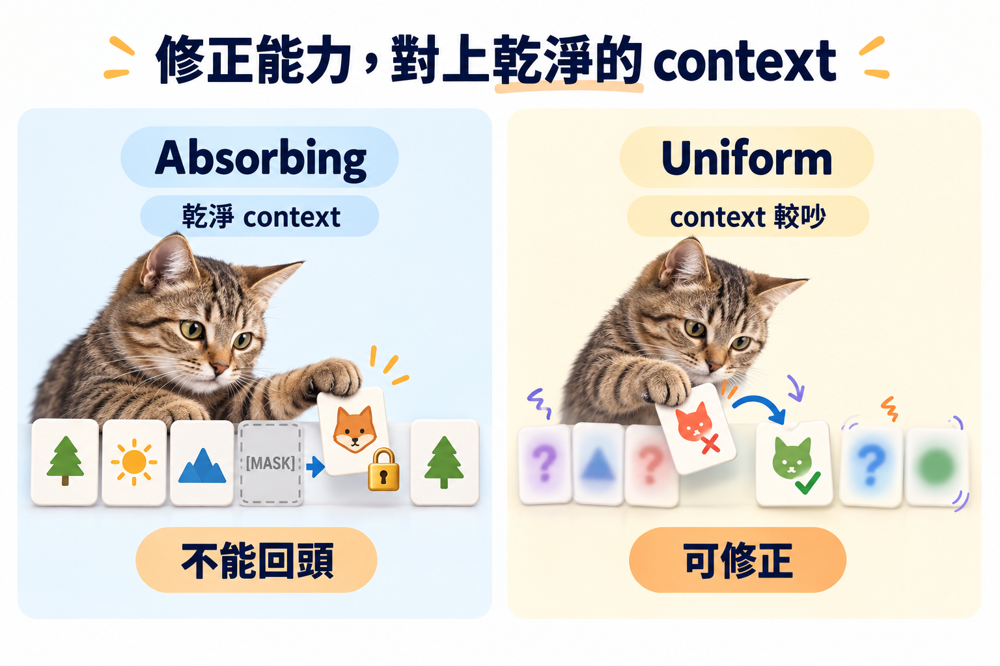

import Objectives from '../../../components/Objectives.astro';
import Prereq from '../../../components/Prereq.astro';
import Ask from '../../../components/Ask.astro';
import Remark from '../../../components/Remark.astro';
import Question from '../../../components/Question.astro';
import Answer from '../../../components/Answer.astro';
import QuizBlock from '../../../components/QuizBlock.astro';
import Option from '../../../components/Option.astro';
import Explanation from '../../../components/Explanation.astro';
import Details from '../../../components/Details.astro';
import Bridge from '../../../components/Bridge.astro';
import Ref from '../../../components/Ref.astro';

# 填錯的字，可以再改嗎？

<Objectives>
- **比較 absorbing 與 uniform 的生成規則。** 前者保留已填字，後者允許再換字；有修改的機會，不代表一定能改對。
- **說出 remasking 想保留與改變的東西。** 保留原本的 noisy marginals，同時讓已填字可以遮回去重選。
- **從每步機率引出 rate。** 分清「這一小步發生的機率」與「每單位時間發生多快」，讓規則不綁在步數上。
</Objectives>

<Prereq items={frontmatter.prereqs} />

## 前面填的字，也可能需要後面的字才能判斷

在 <Ref to="dma-factorization-error"/>，我們看到一次填很多字可能漏掉相依。多走幾步能讓模型參考更新後的 context，但 absorbing sampler 有一件事做不到：**已經填入的字不會再修改。**

想像寫訊息時，你先打了「明天晚上見」，寫到後面才發現約的是下午。人可以回頭改「晚上」；absorbing sampler 卻只會補空格，不能碰已經寫好的部分。

<Ask>
能不能保留「知道哪裡缺字」的好處， 
又讓模型有機會回頭修改？
</Ask>

## 先看原本兩條 chain

Absorbing 的好處是，training snapshot 中所有非 MASK 的字都來自原文，模型清楚知道哪裡缺資訊。但生成時可見的字是模型自己填的，**不保證正確**；原本的 reverse kernel 仍然把它們固定住。

Uniform 則不同：每個字都可能被替換，所以 reverse kernel 允許已見的字再改。但它也沒有 MASK 來標明「這格不知道」；模型必須同時判斷哪些字可信、哪些需要換掉。Austin 等人的 D3PM [1] 包含這兩種 forward 設計，並沒有因此給出「能換字就一定比較好」的保證。

<iframe loading="lazy" src="/personal_website/notes/research_areas/diffusion-models-applications/w6-4-correction.html" class="demo-frame" title="已填字能不能修改" style="height: 800px; width: 100%; border: none;"></iframe>

*這裡比較的是取樣器有沒有修改通道；toy 中的改善幅度不代表任何一條 chain 在所有資料上都比較好。*

*圖：Absorbing training 保留原文 context，但生成時已填字仍可能錯；uniform 允許再換字，同時也讓模型面對持續帶噪的 context。*

## 不換 training snapshots，可以只改生成規則嗎？

回想 <Ref to="dma-reverse-process"/> 與 <Ref to="dma-unified-equation"/>：同一組 marginals，未必只能用同一種 dynamics 走過去。這裡也可以問相同的問題：保留 absorbing 定義的
$$
q_t(x_t^\ell\mid x_0^\ell)
=\bar\alpha_t\delta_{x_0^\ell}
+(1-\bar\alpha_t)\delta_m,
$$
但在生成時加入「字 $\to$ MASK」的轉移，之後再讓 denoiser 重選。

這個操作叫 **remasking**。Wang 等人的 ReMDM [3] 建構了保留原本 conditional marginals 的 remasking process。不過現在還不能只說「隨機遮回去就好」：遮回去會讓 MASK 變多，**我們還需要補多少翻開的機會，才能維持原本的分布？**

## 要說修改多少，先決定時間的單位

如果說「每步用 $1\%$ 的機率遮回去」，走十步或一千步，累積效果就不一樣。想像導航每隔一分鐘與每隔十分鐘提醒你一次；即使每次提醒的機率相同，一小時內收到提醒的頻率也不同。

所以我們改問：**每單位時間，一個已填字被遮回去多快？** 用 $\sigma_t$ 表示這個 rate，短短一段 $h$ 的轉移機率就是
$$
\Pr(\text{字}\to m\text{ in }[t,t+h])
=\sigma_t h+o(h).
$$
Rate 的單位是 $1/\text{時間}$；$h$ 才是取樣器這一步走多久。$\sigma_t=2$ 不是機率 $2$，而是很小的 $h=0.01$ 內，轉移機率約為 $0.02$。

Campbell 等人 [2] 用 **continuous-time Markov chain（CTMC）** 描述 discrete diffusion，把這種局部 rate 與計算時的步長分開。**狀態仍然是 token，連續的是時間，不是字。**

<Remark label="補充" summary="不是一定要連續時間，才能 remask">
離散時間也能設計保留 marginals 的 remasking kernel，ReMDM [3] 就有這樣的建構。引入 rate 是為了方便描述「單位時間改多少」與驗證分布如何變化；不是因為修改 transition matrix 必然讓所有 closed forms 消失。
</Remark>

<Question id="Q1">
若只在 absorbing sampler 加入「字 $\to$ MASK」，原本要經過的 marginals 還會相同嗎？

<Answer>
一般不會。原本每個時刻的 MASK 比例是 $1-\bar\alpha_t$；多遮回去卻不增加翻開的機會，MASK 會累積得更多。只讓某個 token 多一條轉移還不夠，我們必須檢查**整個 distribution 的淨流入與淨流出**。下一篇先建立計算這件事的方程式，之後再推導要補上的 rate。
</Answer>
</Question>

## 快速回顧一下

<QuizBlock id="w6-4-a">
Absorbing 生成時，非 MASK 的字：
<Option>一定來自正確原文。</Option>
<Option correct>可能填錯，但原本的 sampler 不會再修改它。</Option>
<Option>每一步都會均勻重抽。</Option>
<Explanation>Training 的可見字來自資料；sampling 的可見字則來自模型，兩種情境不能混在一起。</Explanation>
</QuizBlock>

<QuizBlock id="w6-4-b">
Rate $\sigma_t=2$ 的意思是：
<Option>轉移機率為 $2$。</Option>
<Option correct>短時間 $h$ 內，轉移機率約為 $2h$。</Option>
<Option>每一步都轉移兩次。</Option>
<Explanation>Rate 是頻率；機率還要乘上時間長度，且這是一個小步近似。</Explanation>
</QuizBlock>

<QuizBlock id="w6-4-c">
加入 remasking 後，要保留原本的 marginals，還需要：
<Option>只檢查每一列機率加起來是 $1$。</Option>
<Option correct>檢查新增的相反轉移如何配平 probability flow。</Option>
<Option>重新把 token 編號改成連續數值。</Option>
<Explanation>合法的 sampler 不必經過指定的 $p_t$；分布的演化也要一致。</Explanation>
</QuizBlock>

<Bridge to="dma-ctmc">
我們想加的修改已經有了單位：每條可能的轉移，一小段時間內發生多快。那這些局部 rate 合起來，會讓各個狀態的機率怎麼增加或減少？下一篇用流入、流出的守恆，把它寫成 forward equation。
</Bridge>

## 參考文獻

1. Austin, J. et al. [*Structured Denoising Diffusion Models in Discrete State-Spaces.*](https://arxiv.org/abs/2107.03006) NeurIPS 2021.
2. Campbell, A. et al. [*A Continuous Time Framework for Discrete Denoising Models.*](https://arxiv.org/abs/2205.14987) NeurIPS 2022.
3. Wang, G. et al. [*Remasking Discrete Diffusion Models with Inference-Time Scaling.*](https://arxiv.org/abs/2503.00307) 2025.
