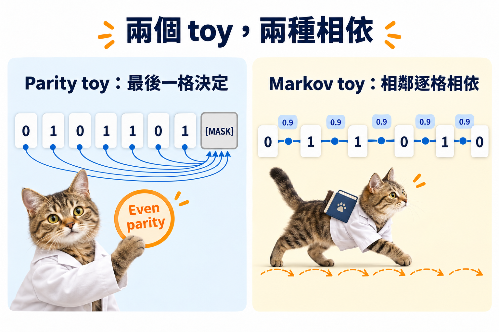

import Objectives from '../../../components/Objectives.astro';
import Prereq from '../../../components/Prereq.astro';
import Ask from '../../../components/Ask.astro';
import Remark from '../../../components/Remark.astro';
import Question from '../../../components/Question.astro';
import Answer from '../../../components/Answer.astro';
import QuizBlock from '../../../components/QuizBlock.astro';
import Option from '../../../components/Option.astro';
import Explanation from '../../../components/Explanation.astro';
import Details from '../../../components/Details.astro';
import Bridge from '../../../components/Bridge.astro';
import Ref from '../../../components/Ref.astro';

# 實作 A：每格機率都對，整串還會錯嗎？

<Objectives>
- **建立可以完整列舉的離散資料。** 用偶數 parity 序列算精確 conditional，不把網路預測當標準答案。
- **比較 joint 與逐位置獨立抽樣。** 固定同一張 noisy snapshot，只改填字方式，量出合法率的差別。
- **分開模型誤差與 factorization error。** 先用 oracle，再把自己訓練的 denoiser 放進相同評估。
</Objectives>

<Prereq items={frontmatter.prereqs} />

## 怎麼確定錯的是網路，還是抽樣？

<Ref to="dma-factorization-error"/> 說，即使每格的 conditional marginal 都正確，一起獨立填完仍可能出錯。要驗證這件事，最直接的方法就是選一個小到可以列出所有合法資料的問題，先把網路拿掉。

這次使用長度 $L=8$ 的 bit 序列，資料是全部 $128$ 條偶數 parity，均勻抽樣。只有「$1$ 的數量必須是偶數」這個限制；所以任何結果都能直接檢查。

[下載實作 A notebook：Discrete diffusion 與 factorization error](/personal_website/notes/notebooks/diffusion-models-applications/dma-w6-lab.ipynb)

Notebook 需要 NumPy 與 Matplotlib，依序執行 cells。程式使用完整列舉的 conditional probabilities；訓練自己的模型是最後的延伸練習。

## 第一步：找出這張 snapshot 可能的原文

令 $x_t$ 中的 MASK 用 $-1$ 表示。程式先留下所有與可見字相容的資料，再計算每個位置的 $0$、$1$ 比例：

| 函式 | 計算的物件 |
| --- | --- |
| <code>compatible_states(xt)</code> | 所有與 $x_t$ 相容的合法原文 |
| <code>exact_conditional(xt)</code> | 每個位置的 $p(x_0^\ell=0\mid x_t)$、$p(x_0^\ell=1\mid x_t)$ |
| <code>sample_joint(xt)</code> | 從相容原文中抽一整串 |
| <code>sample_factorized(xt)</code> | 按各位置 conditional marginal，獨立填入 MASK |

因為資料均勻、absorbing 的同一個 mask pattern 對所有相容原文有相同機率，相容原文的 posterior 也均勻。這就是列舉能直接給出正確 conditional 的原因。

## 第二步：只換抽樣方式

固定被遮的格數，先從真實資料造出 snapshot，再分別用 joint 與 factorized sampler 填完。對每個設定重複抽樣，量「$1$ 的數量為偶數」的比例。

你應該看到：joint 始終只抽合法資料；只剩一格 MASK 時，factorized 也能補對；但兩格以上一起填時，factorized 的合法率約為 $\tfrac12$。**這個差別不可能來自網路，因為兩邊都沒有使用網路。**

*圖：本次先用全域 parity 檢查相依；延伸到 Markov toy 時，相依則分布在相鄰位置。*

<Question id="Q1">
如果 factorized sampler 的合法率只有 $\tfrac12$，把訓練資料增加十倍，這個實验會改善嗎？

<Answer>
不會。這裡已經使用真實資料分布算出的精確 conditional marginals，沒有 estimation error 可以改善。要改的是抽樣規則，例如先填一部分、重新計算 conditional，再填剩下的部分；或用能表達 joint dependence 的抽樣方式。這是 <Ref to="dma-factorization-error"/> 的結構性誤差。
</Answer>
</Question>

## 第三步：把誤差來源分開記錄

Notebook 另檢查 forward MASK 比例是否跟 $1-\bar\alpha_t=t$ 一致。它回答的是 snapshot 有沒有造對，不是 joint reverse 有沒有抽對。

下面的 Markov toy demo 再把 conditional prediction 人為往均勻分布拉一點，模擬可調整的模型誤差。固定每步填字數，比較不同 prediction errors；再固定 prediction error，比較每步填幾格。

<iframe loading="lazy" src="/personal_website/notes/research_areas/diffusion-models-applications/w6-5-decompose.html" class="demo-frame" title="分開比較 prediction error 與平行填字誤差" style="height: 760px; width: 100%; border: none;"></iframe>

*Demo 的「模型誤差」是明確設定的 surrogate，不是實際訓練結果。切換率是摘要統計量，不等於整個 distribution 的 KL。*

## 延伸練習

1. 把資料改成「$1$ 的數量可被 $3$ 整除」，同時修改合法性判斷。不同 MASK 數量下，哪些位置 marginals 看不出 joint constraint？
2. 將一次填完改成每次只填一格，每次都重新查 conditional。確認偶數 parity 的合法率如何改變。
3. 訓練自己的 denoiser：輸入 token sequence 與時間，輸出每位置 logits；用 <Ref to="dma-d3pm"/> 的 masked cross-entropy。先比較 logits 的 conditional KL，再放入相同 sampler 比較合法率。這兩個評估分別檢查預測與生成。
4. 換成相鄰 bit 有相依的 Markov toy，觀察每步填字數的影響。不要只記步數，也記每步實際填幾格、seed 與抽樣數。

## 快速回顧一下

<QuizBlock id="w6-5-a">
本 notebook 的 conditional probabilities 來自：
<Option>訓練好的 Transformer。</Option>
<Option correct>列舉所有與可見字相容的合法原文。</Option>
<Option>對 token 編號取平均。</Option>
<Explanation>這讓我們可以先排除模型誤差，只比較抽樣假設。</Explanation>
</QuizBlock>

<QuizBlock id="w6-5-b">
同一張 snapshot，joint 與 factorized sampler 的差別是：
<Option>Forward mask probability 不同。</Option>
<Option correct>前者抽整串相容原文；後者獨立抽各位置，可能漏掉相依。</Option>
<Option>前者使用更多 training data。</Option>
<Explanation>Conditional marginals 的來源相同，差在它們怎麼組成一次抽樣。</Explanation>
</QuizBlock>

<QuizBlock id="w6-5-c">
Forward MASK 比例正確，能證明什麼？
<Option>生成的整串資料一定正確。</Option>
<Option correct>這個 snapshot 統計量符合指定 schedule；reverse joint 還需要另外檢查。</Option>
<Option>Factorization error 為零。</Option>
<Explanation>Forward snapshot、預測準確度與 reverse sampling 是不同層次。</Explanation>
</QuizBlock>

<Bridge to="dma-lab-ctmc">
現在我們已經能把平行填字的誤差單獨量出來。下一次實作把同一個問題寫成 rates，比較小時間近似造成的偏差，再真的把已填字遮回去重選，看看修改的機會在有限步下有什麼效果。
</Bridge>

## 參考文獻

1. Austin, J. et al. [*Structured Denoising Diffusion Models in Discrete State-Spaces.*](https://arxiv.org/abs/2107.03006) NeurIPS 2021.
2. Sahoo, S. S. et al. [*Simple and Effective Masked Diffusion Language Models.*](https://arxiv.org/abs/2406.07524) NeurIPS 2024.
