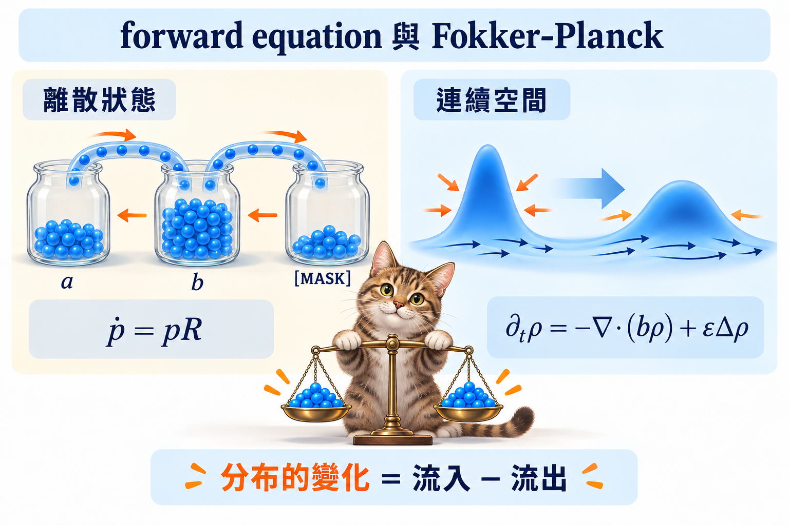

import Ask from '../../../components/Ask.astro';
import Remark from '../../../components/Remark.astro';
import Question from '../../../components/Question.astro';
import Answer from '../../../components/Answer.astro';
import Objectives from '../../../components/Objectives.astro';
import Prereq from '../../../components/Prereq.astro';
import QuizBlock from '../../../components/QuizBlock.astro';
import Option from '../../../components/Option.astro';
import Explanation from '../../../components/Explanation.astro';
import Details from '../../../components/Details.astro';
import Bridge from '../../../components/Bridge.astro';
import Ref from '../../../components/Ref.astro';

# 一個 token 跳多快，整個分布就怎麼變？

<Objectives>
- **寫出 rate matrix 與短時間轉移的關係。** 非對角元素是跳轉 rate，對角元素記錄總流出，整列和為零。
- **從流入減流出推導 forward equation。** 把每個狀態的機率想成人數，而不是把 rate 誤認成機率。
- **接回離散時間的 noise schedule。** 對 $R_t=\beta_t(P-I)$ 算出 conditional transition，分清 rate、保留機率與步長。
</Objectives>

<Prereq items={frontmatter.prereqs} />

## Rate 有了，要怎麼知道 distribution 會變成什麼？

在 <Ref to="dma-absorbing-vs-uniform"/>，我們想用 rate 描述每單位時間修改多少。接下來不能只盯著一個 token 跳去哪裡；和 <Ref to="dma-conditional-flow-matching"/> 一樣，我們要知道的是**整群樣本的 distribution 怎麼變。**

想像三個房間之間有門，每個房間現在有一些人。每個人通過某扇門的頻率是一個 rate；但這扇門每秒有多少人經過，還要乘上原房間有多少人。某個房間的人數增加或減少，就看所有門的流入減流出。

## Rate matrix：每扇門的轉移頻率

用 $R_t(i,j)$ 表示從狀態 $i$ 跳到 $j$ 的 rate。對 $i\neq j$，
$$
\Pr(x_{t+h}=j\mid x_t=i)=hR_t(i,j)+o(h).
$$
若總流出 rate 是 $\sum_{j\neq i}R_t(i,j)$，留在 $i$ 的機率就是
$$
\Pr(x_{t+h}=i\mid x_t=i)
=1-h\sum_{j\neq i}R_t(i,j)+o(h).
$$
所以定義
$$
R_t(i,i)=-\sum_{j\neq i}R_t(i,j),
\qquad Q_{t\to t+h}=I+hR_t+o(h).
$$
**Rate matrix 的每列和為 $0$，不是 $1$；$I+hR_t$ 才是短時間的 transition approximation。** Campbell 等人 [1] 用這套 CTMC 語言建構 continuous-time discrete diffusion。

<Remark label="定義" summary="CTMC：離散狀態，連續時間">
Continuous-time Markov chain 的狀態可以是有限個 token，但跳躍發生的時間不必落在整數格子。給定現在的狀態，未來的轉移由當下與之後的 rates 決定；不需要查更早的路徑。若總流出 rate 是常數 $\lambda$，等待下一次跳躍的時間是 $\mathrm{Exp}(\lambda)$。更詳細的定義見 <Ref to="math-ctmc"/>。
</Remark>

## Forward equation：機率的流入減流出

令 $p_t(i)$ 是時刻 $t$ 在狀態 $i$ 的機率。從 $i$ 流向 $j$ 的 probability flow 是
$$
p_t(i)R_t(i,j).
$$
因此狀態 $j$ 的變化是
$$
\frac{d p_t(j)}{dt}
=\underbrace{\sum_{i\neq j}p_t(i)R_t(i,j)}_{\text{流入}}
-\underbrace{p_t(j)\sum_{k\neq j}R_t(j,k)}_{\text{流出}}.
$$
把第二項改用對角元素，就得到
$$
\frac{d p_t(j)}{dt}=\sum_i p_t(i)R_t(i,j),
\qquad
\frac{d p_t}{dt}=p_tR_t.
$$
這裡 $p_t$ 是 row vector。這條式子叫 **Kolmogorov forward equation**；它和 continuity equation 一樣在講質量守恆，只是流量沿離散狀態之間的邊移動。

<iframe loading="lazy" src="/personal_website/notes/research_areas/diffusion-models-applications/w7-1-ctmc.html" class="demo-frame" title="Rate 與流入減流出" style="height: 800px; width: 100%; border: none;"></iframe>

*圖：Forward equation、continuity equation 與 Fokker–Planck 都描述 probability 如何流動；離散狀態用求和，連續空間用微分算子。*

## 原本的兩條 forward chain，現在怎麼寫？

把 <Ref to="dma-discrete-data"/> 的一步機率改成短時間 $\beta_t h$：
$$
Q_{t\to t+h}
=I+h\beta_t(P-I)+o(h).
$$
所以兩條 chain 都有 $R_t=\beta_t(P-I)$，只是 $P$ 不同。現在 $\beta_t$ 是 **rate**，不是離散時間的那個一步 corruption probability。

令 $\alpha_t$ 是連續時間的保留機率；這裡沿用 diffusion 的時間方向，$t=0$ 是資料、$t=1$ 是 noise。令 $B_t=\int_0^t\beta_r\,dr$，由 $P^2=P$，
$$
Q_{0\to t}
=\exp(B_t(P-I))
=e^{-B_t}I+(1-e^{-B_t})P.
$$
因此
$$
\alpha_t=e^{-B_t},
\qquad
\beta_t=-\frac{\dot\alpha_t}{\alpha_t}.
$$
$\dot\alpha_t$ 表示 $\alpha_t$ 對時間的導數。這就是前面 $\bar\alpha_t$ 的連續時間版本：uniform 得到「保留或均勻重抽」；absorbing 得到「保留或 MASK」。

因為所有時刻的 $R_t$ 都是同一個矩陣 $P-I$ 的倍數，彼此 commute。把
$$
Q_t=\alpha_t I+(1-\alpha_t)P
$$
代入 $\frac{dQ_t}{dt}=Q_tR_t$，利用 $P^2=P$，會得到 $\dot\alpha_t=-\beta_t\alpha_t$。配上 $\alpha_0=1$，解就是上面的 exponential。

一般 time-dependent rate matrices 未必 commute，不能直接寫成 $\exp(\int R_tdt)$；應解矩陣的 forward equation。

<Remark label="補充" summary="線性保留率，為什麼 rate 會發散？">
若選 $\alpha_t=1-t$，則 $\beta_t=1/(1-t)$。越接近 $t=1$，剩下未遮的字越少，要讓它們在終點全部遮完，rate 就會變大。公式在 $0<t<1$ 使用；端點需用極限或直接指定全 MASK，不能把無限 rate 當有限步機率。有限 rate 的小步誤差分析也不能直接套到這個端點。
</Remark>

<Question id="Q1">
Rate matrix 有負的對角元素，是不是不合法？若某狀態總流出 rate 是 $4$，可以直接取 $h=1$，把 $I+hR$ 當 transition matrix 嗎？

<Answer>
負的對角元素在記錄機率減少，不是負機率。但 $I+hR$ 的對角會是 $1-4h$，所以 $h=1$ 會得到 $-3$，不能拿來抽樣。小步近似至少要滿足 $h\sum_{j\neq i}R(i,j)\leq1$；即使元素都非負，它仍只是近似，不代表把一整段時間內的多次跳躍都算準了。
</Answer>
</Question>

## 快速回顧一下

<QuizBlock id="w7-1-a">
Rate matrix 的一列總和是：
<Option>$1$。</Option>
<Option correct>$0$。</Option>
<Option>該位置的 token 數。</Option>
<Explanation>對角元素等於其他元素總和的負值；真正的 transition matrix 才有列和 $1$。</Explanation>
</QuizBlock>

<QuizBlock id="w7-1-b">
從 $i$ 流到 $j$ 的 probability flow 是：
<Option>$R_t(i,j)$。</Option>
<Option correct>$p_t(i)R_t(i,j)$。</Option>
<Option>$p_t(j)R_t(i,j)$。</Option>
<Explanation>Rate 乘上來源狀態的機率，才是整群樣本的流量。</Explanation>
</QuizBlock>

<QuizBlock id="w7-1-c">
令 $\alpha_t$ 是保留機率，absorbing forward rate 是：
<Option>$-\dot\alpha_t$。</Option>
<Option correct>$-\dot\alpha_t/\alpha_t$。</Option>
<Option>$\alpha_t/(1-\alpha_t)$。</Option>
<Explanation>單位時間減少的保留機率為 $-\dot\alpha_t$；除以仍保留的比例，才得到每個尚未遮掉的字的 rate。</Explanation>
</QuizBlock>

<Bridge to="dma-concrete-score">
現在我們知道 forward rates 怎麼把資料推向 noise。生成卻要把時間倒過來：若現在在 $x$，下一次應該跳到哪個 $y$、跳多快？下一篇再用 Bayes 反推這條 rate，看看離散世界需要學的 score 是什麼。
</Bridge>

## 參考文獻

1. Campbell, A. et al. [*A Continuous Time Framework for Discrete Denoising Models.*](https://arxiv.org/abs/2205.14987) NeurIPS 2022.
