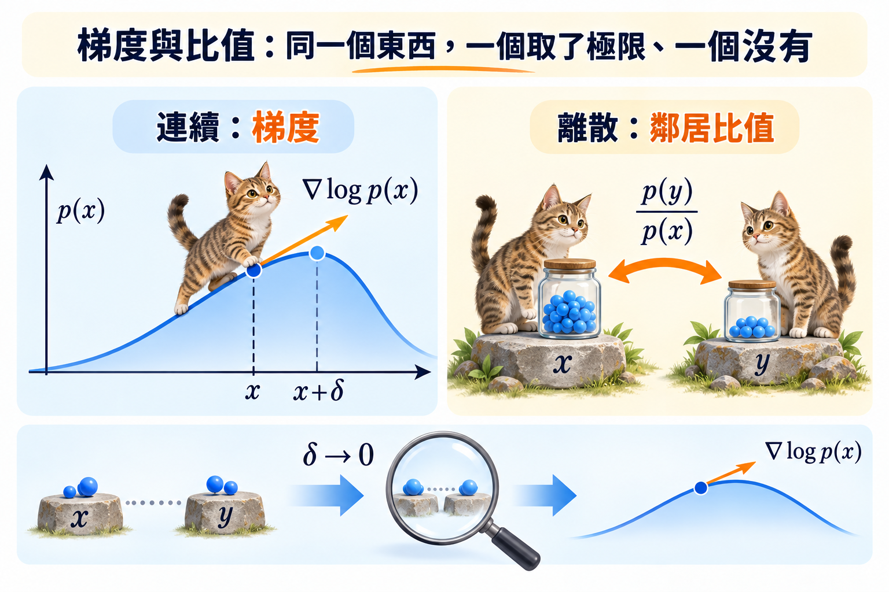

import Ask from '../../../components/Ask.astro';
import Remark from '../../../components/Remark.astro';
import Objectives from '../../../components/Objectives.astro';
import Prereq from '../../../components/Prereq.astro';
import Question from '../../../components/Question.astro';
import Answer from '../../../components/Answer.astro';
import QuizBlock from '../../../components/QuizBlock.astro';
import Option from '../../../components/Option.astro';
import Explanation from '../../../components/Explanation.astro';
import Details from '../../../components/Details.astro';
import Bridge from '../../../components/Bridge.astro';
import Ref from '../../../components/Ref.astro';

# 時間倒過來，Rate 需要學什麼？

<Objectives>
- **用 Bayes 推導 reverse rate。** 寫出它等於反向那條 forward edge 的 rate，乘上 marginal probability ratio。
- **把難算的 marginal ratio 換成可算的 conditional target。** 說明 posterior average 與 support 條件，並連回前面的 conditional trick。
- **在 absorbing chain 上換算 ratio 與 denoiser。** 推出 MASK 的翻開 rate，分清它與 forward masking rate 的差別。
</Objectives>

<Prereq items={frontmatter.prereqs} />

## Forward 的門會開，倒著走該怎麼開？

<Ref to="dma-ctmc"/> 已經用 $R_t$ 決定資料怎麼逐漸被破壞。但生成時，我們站在 noisy state $x$，不知道先前的人從哪裡來。就像 <Ref to="dma-tweedie-and-score"/> 的散場例子：**知道往外走的規則，還不等於知道這個街口該怎麼往回走。**

令 $\bar R_t(x,y)$ 表示生成時從 $t$ 退向 $t-h$ 的 rate。對 $y\neq x$，先用 Bayes：
$$
\Pr(x_{t-h}=y\mid x_t=x)
=\frac{p_{t-h}(y)\Pr(x_t=x\mid x_{t-h}=y)}{p_t(x)}.
$$
Forward 的短時間轉移是 $hR_t(y,x)+o(h)$，且 $p_{t-h}(y)=p_t(y)+o(1)$。除以 $h$ 再取極限：
$$
\bar R_t(x,y)=R_t(y,x)\frac{p_t(y)}{p_t(x)}.
$$
**Forward rate 已知；未知的部分是兩個狀態的機率比。** Campbell 等人 [3] 用這個時間反轉公式建構 discrete denoising models。

## 離散 score 是比值，不是對 token 編號微分

連續空間的 score $\nabla\log p_t(x)$ 告訴我們附近哪裡密度比較高。離散空間沒有「朝某個字移動一點點」，所以先保留一個有限的比較：
$$
s_t(x)_y=\frac{p_t(y)}{p_t(x)}.
$$
這個 ratio 回答「$y$ 比 $x$ 多可能多少」，也不需要 normalizing constant：分子與分母的常數會相消。Meng 等人 [2] 提出 **concrete score** 的離散比較觀點；Lou、Meng 與 Ermon 的 **SEDD** [1] 直接學這些正比值。

<Remark label="符號" summary="Concrete score 有兩種常見寫法">
原始 concrete score matching 常用 $(p_t(y)-p_t(x))/p_t(x)$，也就是本篇 ratio 減 $1$。本篇跟隨 SEDD 使用 $p_t(y)/p_t(x)$，方便直接乘進 reverse rate。兩者資訊相同，但公式中的常數不能混用。
</Remark>

在逐位置 corruption 下，forward 一次只改一個 token，所以只需要 $y=x^{(\ell\to v)}$ 這些鄰居的 ratio，不必輸出 $K^L$ 個序列的機率。

<iframe loading="lazy" src="/personal_website/notes/research_areas/diffusion-models-applications/w7-2-ratios.html" class="demo-frame" title="鄰居之間的 probability ratios" style="height: 890px; width: 100%; border: none;"></iframe>

## 可是整個 $p_t$ 算不出來，Label 從哪裡來？

我們可以直接抽 training pair $(x_0,x_t)$，而 $q_t(x_t\mid x_0)$ 已知。先看看 conditional ratio 的 posterior average：
$$
\begin{aligned}
\mathbb E\left[\frac{q_t(y\mid x_0)}{q_t(x\mid x_0)}
\,\middle|\,x_t=x\right]
&=\sum_{x_0}\frac{q_t(y\mid x_0)}{q_t(x\mid x_0)}
\frac{q_t(x\mid x_0)p_0(x_0)}{p_t(x)}\\
&=\frac{\sum_{x_0}q_t(y\mid x_0)p_0(x_0)}{p_t(x)}\\
&=\frac{p_t(y)}{p_t(x)}.
\end{aligned}
$$
第一步用 Bayes，第二步把相同的 conditional 機率約掉。這和 <Ref to="dma-denoising-regression"/>、<Ref to="dma-flows-and-continuity"/> 是相同的策略：**用好算的 conditional target 訓練，最佳解再替我們平均成難算的 marginal object。**

<Remark label="補充" summary="這個約分要有什麼條件？">
我們在 $p_t(x)>0$ 的位置使用 ratio，且要求分子有質量的原文也能產生 $x$：
$$
q_t(y\mid x_0)>0\ \Longrightarrow\ q_t(x\mid x_0)>0.
$$
這樣求和才不會漏掉 denominator 為零的原文。Uniform corruption 在內部時間有完整 support；absorbing 則對 reverse 所需的 MASK $\to$ 字鄰居成立。不能對任意兩個離散狀態，不檢查 support 就直接套公式。
</Remark>

令 $a=q_t(y\mid x_0)/q_t(x_t\mid x_0)$，讓 $s_\theta(x_t,t)_y>0$。SEDD 的 denoising score entropy [1]，忽略不含 $\theta$ 的項後，是
$$
L_{\mathrm{DSE}}
=\mathbb E_{t,x_0,x_t}\sum_{y\neq x_t}w_t(x_t,y)
\left[s_\theta(x_t,t)_y-a\log s_\theta(x_t,t)_y\right].
$$
固定 $(x_t,t,y)$，令 $r=\mathbb E[a\mid x_t]$。平均後的 scalar loss 是 $s-r\log s$；微分得到 $1-r/s$，因此 $r>0$ 時最小值在 $s=r$。若 $r=0$，最小值在非負邊界 $s=0$，正值參數化可逼近它。

關鍵是 $a$ 只在線性的 $-a\log s$ 中出現，因此 posterior average 正好留下 marginal ratio。取 $w_t(x,y)=R_t(y,x)$，就對 reverse 需要的 edges 加權；在相應的 CTMC likelihood bound 中，還要保留常數與 prior term，不能直接把任意加權的 loss 當成 likelihood。

## 原本的 masked denoiser，其實已經給了 ratio

令 $x^\ell=m$，$y=x^{(\ell\to v)}$。固定 $x_0$ 後，其餘位置的 conditional 因子約掉，只剩
$$
\frac{q_t(y\mid x_0)}{q_t(x\mid x_0)}
=\frac{\alpha_t}{1-\alpha_t}\mathbf1[x_0^\ell=v].
$$
取 posterior average，得到
$$
s_t(x)_y
=\frac{\alpha_t}{1-\alpha_t}p(x_0^\ell=v\mid x_t=x).
$$
因此 <Ref to="dma-d3pm"/> 的 denoiser 可以直接換成 ratio：
$$
s_\theta(x,t)_y
=\frac{\alpha_t}{1-\alpha_t}f_\theta^\ell(v\mid x,t).
$$
再乘上 forward masking rate $\beta_t=-\dot\alpha_t/\alpha_t$：
$$
\bar R_t(x,x^{(\ell\to v)})
=\frac{-\dot\alpha_t}{1-\alpha_t}
p(x_0^\ell=v\mid x_t=x).
$$
所以一個 MASK 的總翻開 rate 是 $-\dot\alpha_t/(1-\alpha_t)$，翻成哪個字則按 denoiser 的 categorical distribution 抽樣。**Ratio 與 masked posterior，在這條 chain 上是同一份資訊的兩種寫法。**

*圖：連續空間用局部梯度比較密度；離散空間則比較鄰居的機率比。*

<Question id="Q1">
Forward masking rate 是 $-\dot\alpha_t/\alpha_t$，reverse reveal rate 卻是 $-\dot\alpha_t/(1-\alpha_t)$。為什麼分母不同？

<Answer>
兩者要搬動相同的 probability mass，但來源群體不同。Forward 從比例 $\alpha_t$ 的未遮字出發，每單位時間遮掉 $-\dot\alpha_t$；reverse 從比例 $1-\alpha_t$ 的 MASK 出發，補回相同的量。因此分別除以「仍未遮」與「已被遮」的比例，得到各自的每個 token rate。
</Answer>
</Question>

## 快速回顧一下

<QuizBlock id="w7-2-a">
Reverse rate 中需要學的部分是：
<Option>$R_t(y,x)$。</Option>
<Option correct>$p_t(y)/p_t(x)$。</Option>
<Option>Token 編號的導數。</Option>
<Explanation>Forward edge 已知，資料分布造成的相對機率才未知。</Explanation>
</QuizBlock>

<QuizBlock id="w7-2-b">
Conditional ratio 能當作 target，關鍵是：
<Option correct>它在適當 support 條件下的 posterior average，正好是 marginal ratio。</Option>
<Option>每一張 training pair 都有相同 ratio。</Option>
<Option>所有 $p_t$ 都是 uniform。</Option>
<Explanation>網路平均很多可能的原文，不是只記住某一組 pair。</Explanation>
</QuizBlock>

<QuizBlock id="w7-2-c">
Absorbing chain 的 MASK $\to v$ ratio 是：
<Option>$f^\ell(v\mid x,t)$。</Option>
<Option correct>$\alpha_t f^\ell(v\mid x,t)/(1-\alpha_t)$。</Option>
<Option>Forward rate $\beta_t$。</Option>
<Explanation>Posterior 要乘上 snapshot 中保留與遮蔽機率的比。</Explanation>
</QuizBlock>

<Bridge to="dma-remasking">
我們已經算出原本 MASK 翻成字的 rate，也知道它由 denoiser 決定。那麼，如果再加一條「字 $\to$ MASK」的轉移，翻開 rate 要補多少，才能讓每個時刻的 $p_t$ 都不變？下一篇直接算這兩個方向的流量。
</Bridge>

## 參考文獻

1. Lou, A., Meng, C., Ermon, S. [*Discrete Diffusion Modeling by Estimating the Ratios of the Data Distribution.*](https://arxiv.org/abs/2310.16834) ICML 2024.
2. Meng, C. et al. [*Concrete Score Matching: Generalized Score Matching for Discrete Data.*](https://arxiv.org/abs/2211.00802) NeurIPS 2022.
3. Campbell, A. et al. [*A Continuous Time Framework for Discrete Denoising Models.*](https://arxiv.org/abs/2205.14987) NeurIPS 2022.
