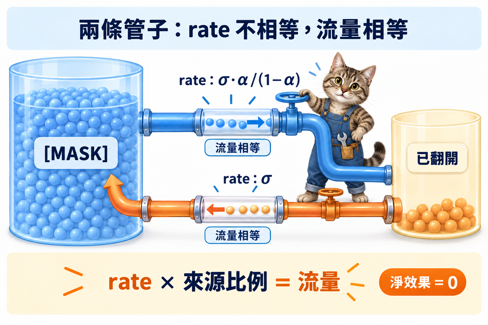

import Ask from '../../../components/Ask.astro';
import Remark from '../../../components/Remark.astro';
import Objectives from '../../../components/Objectives.astro';
import Prereq from '../../../components/Prereq.astro';
import Question from '../../../components/Question.astro';
import Answer from '../../../components/Answer.astro';
import QuizBlock from '../../../components/QuizBlock.astro';
import Option from '../../../components/Option.astro';
import Explanation from '../../../components/Explanation.astro';
import VizPlan from '../../../components/VizPlan.astro';
import Details from '../../../components/Details.astro';
import Bridge from '../../../components/Bridge.astro';
import Ref from '../../../components/Ref.astro';

# Remasking：取樣器多一條管子

<Objectives>
- **用 rate 寫出 remasking。** 讓已翻開的位置以 $\sigma_t$ 回到 `[MASK]`。
- **推導保持 $p_t$ 不變的補償流量。** 說明 unmask rate 為何必須同時增加 $\sigma_t\alpha_t/(1-\alpha_t)$。
- **把 remasking 對到 Langevin 修正。** 它是取樣時加入的隨機性，能修正錯誤，也會增加有限步成本。
</Objectives>

<Prereq items={frontmatter.prereqs} />

<Ask>
「翻開就固定」在 rate 的語言裡，是一根流量為零的管子。 
把那個閥門打開一點，會壞掉什麼？
</Ask>

## 先把反向鏈畫出來

上一篇算出 absorbing 鏈的反向 rate。固定一個位置 $\ell$，反向鏈（時間從 1 走回 0）只有一種管子：從 `[MASK]` 流向某個字 $v$，rate 是

$$
\bar R_t(\texttt{[MASK]}\to v)=u_t\;p_\theta(x_0^\ell=v\mid x_t),\qquad u_t:=\frac{-\dot\alpha_t}{1-\alpha_t}.
$$

$u_t$ 是「一個被遮位置每單位時間翻開的比例」，翻成哪個字按 $p_\theta$ 分配。從字回到 `[MASK]` 的管子**不存在**——forward 沒有 `[MASK]`→字的流量，反向就沒有字→`[MASK]` 的流量。這就是「翻開就固定」在 rate 語言裡的樣子：不是規定，是一根 rate 為零的管子。

<Ref to="dma-why-continuous-time"/> 的提議是：**把這根管子的閥門打開一點。** 現在可以精確地說它是什麼——對每個已翻開的位置，加一條回到 `[MASK]` 的管子，rate 記成 $\sigma_t\ge0$，單位 1/時間。這叫 **remasking**。

<Remark label="符號" summary="這一篇借走了兩個字母：u 與 sigma">
兩個字母在別處有別的意思，這裡要換掉：

- **$u_t$**（沒有括號）是「一個被遮位置每單位時間翻開的比例」，一個純量的 rate。前面幾個單元的 $u_t(x)$（**帶括號**）是邊際速度場（<Ref to="dma-flows-and-continuity"/>）——看有沒有吃一個位置就分得出來。
- **$\sigma_t$** 在這裡是重遮的 rate，單位 1/時間、沒有上界。<Ref week="dma-week-diffusion"/> 的 $\sigma_t$ 是 Gaussian noise 的**振幅**（$x_t=\sqrt{\bar\alpha_t}x_0+\sigma_t\epsilon$），恆在 $[0,1]$ 之間。兩者除了字母之外沒有關係。
</Remark>

只做這一件事會壞掉一樣東西。反向鏈的邊際本來沿著 forward 的 $p_t$ 往回走（上一篇的驗證）；多一條把質量倒回 `[MASK]` 的管子，`[MASK]` 的比例會比 $1-\alpha_t$ 高，$x_t$ 的分佈變了，網路面對的是它沒訓過的輸入。<Ref to="dma-why-continuous-time"/> 的第 2 個小問題——會不會動到邊際——現在有了正面的答案：會。但也有補救。

<Question id="Q1">
在 absorbing 的反向鏈上加一條「回到 `[MASK]`」的 rate $\sigma_t$。**這對應 <Ref to="dma-sampler-family"/> 那一族取樣器裡的哪個設定？** 順著那個對應，能不能推出「加了 $\sigma_t$ 但邊際 $p_t$ 不變」的條件？

<Answer>
常見的答案會先分成「訓練時的 $\gamma_t$」與「取樣時的 $\varepsilon_t$」兩種，也有一種說法是「這是把 absorbing 變成 uniform」。第三個答案值得先處理：uniform 的修正能力來自 **forward chain**——訓練時 $x_t$ 裡就有被換掉的字，模型學的是「哪些字是噪聲」；remasking 沒有動 forward，訓練分佈裡從來沒有「被重遮的字」這種東西，所以它不是 uniform。

答案是 **$\varepsilon_t$：取樣器的噪聲。** 對照 <Ref to="dma-sampler-family"/> 那一族

$$
dX_t=\big[b_t+\varepsilon_t s_t\big]dt+\sqrt{2\varepsilon_t}\,dW_t ,
$$

$\varepsilon_t$ 那兩項是一組：$\sqrt{2\varepsilon_t}\,dW_t$ 把樣本往外推（加噪聲），$\varepsilon_t s_t\,dt$ 把它沿 score 拉回來；用 Fokker–Planck 驗證，兩項對邊際的淨效果為零。remasking 是同一個結構：$\sigma_t$ 把已翻開的字**推回** `[MASK]`（加噪聲），要補一個把它**再翻開**的流量（拉回），兩者對邊際的淨效果為零。

推條件的方法也和那裡一樣：寫下邊際的方程式、要求它不變。固定位置 $\ell$，令 $m_t:=P(x_t^\ell=\texttt{[MASK]})=1-\alpha_t$（它就是 forward 給的邊際，也是我們要守住的東西）。反向鏈往回走時（用 $s=1-t$ 當往回走的時間），`[MASK]` 比例的變化率是**流出減流入**：

$$
\frac{dm}{ds}=-\,u'_t\,m_t+\sigma_t\,(1-m_t),
$$

$u'_t$ 是（可能需要調整的）翻開 rate，第二項是已翻開的字（比例 $1-m_t$）以 rate $\sigma_t$ 回來。沒有 remasking 時 $u'_t=u_t$、$\sigma_t=0$，這條式子給的正是 $dm/ds=-u_tm_t$，也就是 forward 邊際倒著走。要邊際不變，右邊必須等於原來的 $-u_tm_t$：

$$
-u'_t m_t+\sigma_t(1-m_t)=-u_tm_t
\quad\Longrightarrow\quad
\boxed{\;u'_t=u_t+\sigma_t\,\frac{1-m_t}{m_t}=u_t+\sigma_t\,\frac{\alpha_t}{1-\alpha_t}.\;}
$$

讀法：**倒回 `[MASK]` 的流量 $\sigma_t(1-m_t)$，必須由多翻開的流量 $(u'_t-u_t)\,m_t$ 一比一補回來。** 兩條管子的流量相等、方向相反，邊際一格都不動。

還有一個條件藏在「翻開時填什麼字」裡：多翻開的那部分也要按 $p_\theta(x_0^\ell\mid x_t)$ 填。這樣才能保證不只 `[MASK]` 的比例不變，翻開的字在給定其他位置下的分佈也不變（Details 有論證）。而 $p_\theta$ 正是訓好的網路——**訓練端什麼都不用改**。這就是 $\varepsilon_t$ 那個設定的全部性質：只動取樣器、邊際不變、共用網路。
</Answer>
</Question>

把整句的反向鏈寫成 CTMC，狀態是整個 $x_t$。原本的反向 generator $\bar R_t$ 滿足 $p_t\bar R_t=-\dot p_t$（上一篇的驗證）。remasking 版本的 generator 是 $\bar R'_t=\bar R_t+\Sigma_t$，其中 $\Sigma_t$ 包含兩類非對角元素：(a) 對每個已翻開的位置 $\ell$，$x\to x^{(\ell\to\texttt{[MASK]})}$ 的 rate $\sigma_t$；(b) 對每個被遮的位置 $\ell$，$x\to x^{(\ell\to v)}$ 的**額外** rate $\sigma_t\frac{\alpha_t}{1-\alpha_t}\,p(x_0^\ell=v\mid x_t=x)$。要證明 $p_t\Sigma_t=0$，也就是 (a) 與 (b) 的流量在每個狀態上抵消。

看任一個「位置 $\ell$ 被遮」的狀態 $x$ 與它「位置 $\ell$ 是字 $v$」的鄰居 $y$。(a) 從 $y$ 流到 $x$ 的流量是 $p_t(y)\,\sigma_t$；(b) 從 $x$ 流到 $y$ 的流量是 $p_t(x)\,\sigma_t\frac{\alpha_t}{1-\alpha_t}\,p(x_0^\ell=v\mid x_t=x)$。上一篇算過 $p_t(y)/p_t(x)=\frac{\alpha_t}{1-\alpha_t}p(x_0^\ell=v\mid x_t=x)$，所以兩股流量**逐對相等**。每一對鄰居之間的淨流量為零，$p_t\Sigma_t=0$，於是 $p_t\bar R'_t=p_t\bar R_t=-\dot p_t$。✓

這個論證要求 (a) 的 rate $\sigma_t$ **不依賴被重遮的是哪個字**（否則 $y$ 端的流量會隨 $v$ 變，無法與 (b) 逐對相等）。「按信心低的字優先重遮」這種 heuristic（MaskGIT [4] 式）就違反了這一點——它有用，但邊際會偏，不在這一族裡。ReMDM [1] 討論了幾種 $\sigma_t$ 的 schedule（依 $t$ 變、依信心變），並指出哪些保持邊際、哪些不。

也注意 (b) 的形狀：它就是原本的翻開 rate 乘上一個常數 $\sigma_t/u_t\cdot\frac{\alpha_t}{1-\alpha_t}$，所以實作上只是把翻開的 rate 整體放大，不需要任何新的網路輸出。

## 這條管子要付什麼？

有了對應，<Ref to="dma-sampler-family"/> 與 <Ref to="dma-error-theory"/> 對 $\varepsilon_t$ 說過的每一句話都可以直接搬過來。

**修正的機制。** 一個在早期翻錯的字，以 rate $\sigma_t$ 有機會被遮回去；重新翻開時，網路看到的 context 比第一次完整，$p_\theta$ 更準。這正是 Langevin 項「偏離的樣本被 score 拉回 $p_t$」的離散版——不同的是這裡沒有「偏離多遠」的度量，只有「對或錯」，修正是離散的。

**每一步多出來的誤差。** $\varepsilon>0$ 的 SDE 每步注入 $\sqrt{2\varepsilon h}$ 的噪聲，離散化後這本身是誤差來源。remasking 也一樣，而且有兩個來源：(1) 每次重翻開都要再呼叫一次網路，網路的誤差再進來一次；(2) 用有限的 $\Delta t$ 走時，一步內同時重翻開的多個位置之間是**獨立抽**的——<Ref to="dma-factorization-error"/> 的因子化誤差在每次重填時都會再付一次。$\sigma_t$ 越大、$\Delta t$ 越大，這兩項越大。

**$\sigma$ 划不划算，取決於現在最大的誤差是哪一種。** 下面的 demo 量的是一個乾淨的 toy——網路是查表算出來的、沒有誤差，所以唯一的誤差來源是「一步翻開太多格」的因子化誤差（<Ref to="dma-factorization-error"/>）。在那個設定下，**步數少的時候 $\sigma>0$ 反而有用**（$N=8$ 的切換率從 0.14–0.15 掉到 0.13 左右），因為 remasking 等於拿預算去換 context；步數多的時候一點空間也沒有（$N=32$、$N=128$ 本來就已經貼在資料的 0.10）。

這和「連續世界步數多時 SDE 佔優」的圖像**不一樣**，差別在誤差的來源。ReMDM [1] 把他們看到的現象叫 **inference-time scaling**：同一個訓好的 masked diffusion 模型，多花取樣預算、開 $\sigma_t$，品質會繼續上升。那是在真實語言模型上量的——純 absorbing 在步數超過序列長度之後就飽和了（每步翻開不到一個字，再多步也沒有東西可改），而剩下的誤差是**網路在 context 不完整時猜錯**，那正是 remasking 修得動的東西。乾淨 toy 上沒有那一項，所以看不到同一條曲線。

$\sigma_t$ 該怎麼隨 $t$ 變是開放問題，和 $\varepsilon_t$ 一樣；常見做法是在中段較大——那裡翻開的字多、context 又還不完整，錯誤最多也最值得修。

<iframe loading="lazy" src="/personal_website/notes/research_areas/diffusion-models-applications/w7-3-remasking.html" class="demo-frame" title="remasking 強度對樣本品質：互動 demo" style="height: 970px; width: 100%; border: none;"></iframe>

**互動 demo：$\sigma$ 到底幫不幫得上忙。** 資料是 Markov toy（$L=16$、相鄰格以 0.9 相同，切換率真值 0.10），$p_\theta$ 用前向後向**精確**算；橫軸是常數 remasking 強度 $\sigma$、縱軸是樣本的切換率，三條線是三種步數。$\sigma=0$ 那一端就是上一個單元的 masked diffusion：$N=8$ 約 0.14–0.15，$N=32$ 與 $N=128$ 已經貼在 0.10。往右推 $\sigma$，**只有 $N=8$ 明顯下降**（到 0.13 左右，最佳 $\sigma$ 落在 0.25～1），另兩條沒有空間。每個點只有 300 條樣本，數字每次跑都會動一點，要看的是三條線的高低關係。另外兩個開關：「中段較大」的鐘形 $\sigma_t$ 與「有誤差的網路」——後者的結果寫在下面那則補充裡。邊際不變這件事 demo 沒有畫，<Ref to="dma-lab-ctmc"/> 的第一題就是實際去量它。

<Remark label="補充" summary="remasking 修得動哪一種錯，修不動哪一種">
demo 裡有一個「有誤差的網路」開關（把 $p_\theta$ 往均勻分布拉 0.1）。打開它，三條線整體往上抬，而且 **$\sigma$ 補不回來**：最佳 $\sigma$ 常常就是 0。

理由是重填的時候用的還是同一個偏掉的網路。remasking 給的好處只有一個——**第二次填的時候 context 比第一次完整**。所以它修得動「因為旁邊還是 `[MASK]`，所以猜錯」這一種錯（<Ref to="dma-factorization-error"/> 的因子化誤差就屬於這一類），修不動「網路對這個 context 本來就估偏了」那一種。$\varepsilon_t$ 在連續世界也是這樣：Langevin 項把樣本拉回 $p_t$，但那個 $p_t$ 是**網路認為的** $p_t$。
</Remark>

## 兩個設定，現在分開了

<Ref to="dma-absorbing-vs-uniform"/> 把 absorbing / uniform 對到 ODE / SDE，並說這個對應「不完全」——uniform 的代價是每步都要重新判斷什麼是噪聲，而且這個代價不隨步數變小。現在可以說清楚為什麼不完全：**uniform 的修正能力是訓練噪聲**（forward chain 裡的隨機替換），**remasking 的修正能力是取樣噪聲**（反向鏈裡的 $\sigma_t$）。<Ref to="dma-sampler-family"/> 的 Q1 說這是兩個獨立的設定：訓練噪聲決定 $p_t$ 長什麼樣、以及你能學到什麼；取樣噪聲決定你怎麼走。而取樣噪聲正是這門課數到現在的**第五個設定**——<Ref to="dma-fm-vs-diffusion"/> 的起點、路徑、配對都在 reference process 裡，訓練加權則在 objective 裡；$\varepsilon_t$ 是第一個完全不碰訓練的。remasking 就是它的離散版。

在連續世界裡 diffusion 的 Gaussian noise 同時扮演了兩個角色（起點分佈是 Gaussian、天然有 score），所以設定分不分開不那麼顯眼。在離散世界裡兩者的差別很明顯：uniform 把噪聲放進訓練分佈，模型必須學會分辨噪聲字（context 不乾淨）；remasking 把噪聲放進取樣器，訓練分佈裡只有 `[MASK]`（context 乾淨），而修正能力照樣有。**<Ref to="dma-absorbing-vs-uniform"/> 的問題「能不能兩個都要」，答案是可以，而且理由就是兩個設定本來就是分開的。**

同樣的設定在其他語言裡也出現：Campbell et al. [2] 在 discrete flow matching 的取樣器裡加一個「stochasticity」參數 $\eta$，做法是把 forward rate 與它的反向配對加進生成 rate（一對流量相反、淨效果為零的管子）——與這裡的 $(\sigma_t,\ \sigma_t\frac{\alpha_t}{1-\alpha_t})$ 是同一個構造；Gat et al. [3] 的 corrector sampling 亦然。下一篇會看到這些名字之間的關係。

*圖：兩邊的 rate 可以不同；真正要配平的是「rate × 來源比例」形成的流量，兩股相反流量相等時邊際不變。*

## 先消化一下

<QuizBlock id="w7-3-a">
只在 absorbing 反向鏈上加一條「字→`[MASK]`」的 rate $\sigma_t$、其他不動，會發生什麼？
<Option>邊際不變，因為 $\sigma_t$ 很小。</Option>
<Option correct>每個 $t$ 的 `[MASK]` 比例會高於 $1-\alpha_t$，$x_t$ 的分佈偏離訓練分佈，網路面對它沒見過的輸入。</Option>
<Option>鏈變成 uniform 鏈。</Option>
<Explanation>
多一股倒回 `[MASK]` 的流量卻沒有補回來的翻開流量，$dm/ds$ 就不再是 forward 邊際倒著走。$\sigma_t$ 小只是偏得少，不是不偏。它也不是 uniform——訓練分佈裡沒有「被重遮的字」，forward 完全沒動。
</Explanation>
</QuizBlock>

<QuizBlock id="w7-3-b">
Remasking 保持邊際的條件 $u'_t=u_t+\sigma_t\frac{\alpha_t}{1-\alpha_t}$，讀成白話是：
<Option correct>倒回 `[MASK]` 的流量 $\sigma_t(1-m_t)$ 與多翻開的流量 $(u'_t-u_t)m_t$ 相等、方向相反，淨效果為零。</Option>
<Option>翻開的 rate 必須等於重遮的 rate。</Option>
<Option>$\sigma_t$ 必須小於 $u_t$。</Option>
<Explanation>
相等的是**流量**（rate 乘上來源的比例），不是 rate 本身：重遮作用在 $1-m_t$ 的已翻開位置，補償的翻開作用在 $m_t$ 的被遮位置，所以 rate 差一個 $\frac{1-m_t}{m_t}=\frac{\alpha_t}{1-\alpha_t}$ 的因子。$\sigma_t$ 在連續時間裡沒有上界；有限步的實作裡才會因為「一步的機率不能超過 1」出現上限。
</Explanation>
</QuizBlock>

<QuizBlock id="w7-3-c">
在一個**網路沒有誤差**的 toy 上量 remasking，最可能看到的是：
<Option>步數越多，$\sigma>0$ 的好處越大。</Option>
<Option correct>只有步數少的時候 $\sigma>0$ 有明顯好處；步數多的時候純 absorbing 已經到底，$\sigma$ 沒有空間。</Option>
<Option>$\sigma$ 在所有步數上都幫不了忙，因為邊際沒變。</Option>
<Explanation>
網路沒有誤差時，唯一的誤差來源是「一步翻開太多格」的因子化誤差（<Ref to="dma-factorization-error"/>）。remasking 讓位置有機會在 context 更完整的時候被重填，正好對付它——所以步數少時有用（實測切換率 0.14–0.15 掉到 0.13 左右），步數多時因子化誤差本來就小，沒有東西可修。「步數越多越划算」是 ReMDM 在真實模型上的觀察，那裡剩下的誤差是網路猜錯。最後一個選項把「邊際不變」誤讀成「什麼都沒變」：邊際不變說的是連續時間下 $p_t$ 這條路徑不變，不是有限步的樣本品質不變。
</Explanation>
</QuizBlock>

<QuizBlock id="w7-3-d">
「remasking 保留了 absorbing 的乾淨 context，又有 uniform 的修正能力」——這件事之所以可能，根本原因是：
<Option>remasking 的網路比 uniform 的網路大。</Option>
<Option correct>修正能力可以來自取樣器（$\sigma_t$）而不必來自 forward chain；訓練噪聲與取樣噪聲是兩個獨立的設定，uniform 把噪聲放在前者、remasking 放在後者。</Option>
<Option>因為 `[MASK]` 是吸收態。</Option>
<Explanation>
<Ref to="dma-sampler-family"/> Q1 的結論在離散世界裡變得特別明顯：訓練分佈裡只有 `[MASK]`（context 乾淨），修正由取樣器提供。`[MASK]` 是吸收態這件事本身正是「不能修正」的來源，是 remasking 要繞開的，不是它的理由。
</Explanation>
</QuizBlock>

<Bridge to="dma-discrete-flow-matching">
目前的生成器都是先選 forward chain，再把它反轉。Flow matching 曾經把順序倒過來：先選容易監督的條件路徑，再讓後驗平均產生邊際動力。下一篇問同一招能否搬到 token，以及沒有直線可走時，「配對」還會改變什麼。
</Bridge>

## 參考文獻

1. Wang, G., Schiff, Y., Sahoo, S. S., Kuleshov, V. [*Remasking Discrete Diffusion Models with Inference-Time Scaling.*](https://arxiv.org/abs/2503.00307) 2025.（ReMDM：一族保持邊際的 remasking 取樣器、$\sigma_t$ 的 schedule、inference-time scaling。）
2. Campbell, A., Yim, J., Barzilay, R., Rainforth, T., Jaakkola, T. [*Generative Flows on Discrete State-Spaces: Enabling Multimodal Flows and Applications to Protein Co-Design.*](https://arxiv.org/abs/2402.04997) ICML 2024.（取樣器的 stochasticity 參數 $\eta$：同一個構造。）
3. Gat, I., Remez, T., Shaul, N., Kreuk, F., Chen, R. T. Q., Synnaeve, G., Adi, Y., Lipman, Y. [*Discrete Flow Matching.*](https://arxiv.org/abs/2407.15595) NeurIPS 2024.（corrector sampling。）
4. Chang, H., Zhang, H., Jiang, L., Liu, C., Freeman, W. T. [*MaskGIT: Masked Generative Image Transformer.*](https://arxiv.org/abs/2202.04200) CVPR 2022.（依信心重遮的 heuristic；不保持邊際。）
5. Campbell, A., Benton, J., De Bortoli, V., Rainforth, T., Deligiannidis, G., Doucet, A. [*A Continuous Time Framework for Discrete Denoising Models.*](https://arxiv.org/abs/2205.14987) NeurIPS 2022.（連續時間反向鏈與 predictor–corrector 取樣。）
