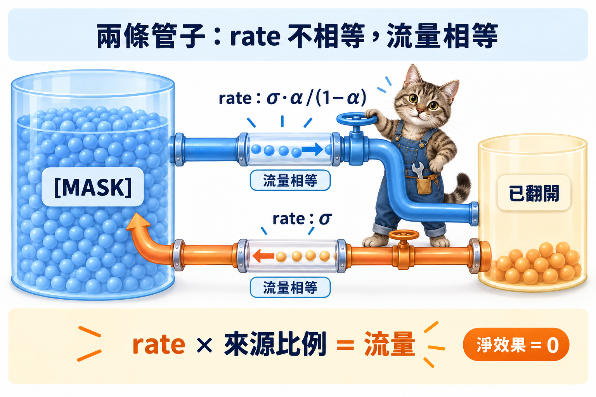

import Ask from '../../../components/Ask.astro';
import Remark from '../../../components/Remark.astro';
import Objectives from '../../../components/Objectives.astro';
import Prereq from '../../../components/Prereq.astro';
import Question from '../../../components/Question.astro';
import Answer from '../../../components/Answer.astro';
import QuizBlock from '../../../components/QuizBlock.astro';
import Option from '../../../components/Option.astro';
import Explanation from '../../../components/Explanation.astro';
import Details from '../../../components/Details.astro';
import Bridge from '../../../components/Bridge.astro';
import Ref from '../../../components/Ref.astro';

# 遮回去重選，還能保留同一個分布嗎？

<Objectives>
- **從修改錯字的需求建立 remasking rate。** 寫出字回到 MASK 的頻率，並算出需要增加多少 reveal rate。
- **用逐邊的 probability flow 證明 marginals 不變。** 不只檢查 MASK 比例，而是檢查整個序列分布的流入與流出。
- **分清理論保留與實際改善。** 相同 denoiser 可以沿用；有限模型、有限步 sampler 的品質仍要測量。
</Objectives>

<Prereq items={frontmatter.prereqs} />

## 如果想修改，就先把那個位置空出來

<Ref to="dma-absorbing-vs-uniform"/> 留下的問題是：後面的 context 已經更完整，前面填錯的字卻不能改。最直接的想法，就是偶爾把一個已填字遮回 MASK，讓模型再看一次更新後的句子，重新決定。

但 <Ref to="dma-concrete-score"/> 也提醒我們，原本的 reveal rate 已經決定了一條特定的 $p_t$。只多遮字，MASK 就會變多。

<Ask>
遮回去重選的機會可以增加， 
原本每個時刻的 distribution 也能保留嗎？
</Ask>

## 遮多少，就要補多少流量

先只看一個位置。時刻 $t$ 的未遮比例是 $\alpha_t$，MASK 比例是 $1-\alpha_t$。令每個已填字以 rate $\sigma_t\geq0$ 遮回去，新增的總 masking flow 就是
$$
\sigma_t\alpha_t.
$$
若要配平這股 flow，每個 MASK 的額外 reveal rate 應為
$$
\frac{\sigma_t\alpha_t}{1-\alpha_t}.
$$
因為來源 MASK 的比例乘上這個 rate，正好也是 $\sigma_t\alpha_t$。

加上原本的 reveal rate，新的總翻開頻率是
$$
\frac{-\dot\alpha_t+\sigma_t\alpha_t}{1-\alpha_t}.
$$
翻成哪個字，仍然使用同一個 posterior denoiser。於是對位置 $\ell$：
$$
\begin{aligned}
\text{字}\to m &: \quad \sigma_t,\\
m\to v &: \quad
\frac{-\dot\alpha_t+\sigma_t\alpha_t}{1-\alpha_t}
f_\theta^\ell(v\mid x_t,t).
\end{aligned}
$$
$\sigma_t=0$ 就回到原本只翻開、不回頭的 sampler。Wang 等人的 **ReMDM** [1] 建構保留 absorbing marginals 的 remasking family；這裡用 rate 的形式理解其連續時間版本。

*圖：兩邊的來源比例不同，所以 rate 不必相同；來源比例乘上 rate 形成的 flow，才是要配平的量。*

## MASK 比例相同，整句分布也相同嗎？

只檢查 MASK 比例還不夠。我們也要確保各種字、各種 context 的機率都沒有被改動。

令 $x^\ell=m$，$y=x^{(\ell\to v)}$。<Ref to="dma-concrete-score"/> 已經給出
$$
p_t(y)
=p_t(x)\frac{\alpha_t}{1-\alpha_t}
p(x_0^\ell=v\mid x_t=x).
$$
在理想 denoiser 下，新增的兩股相反 flow 為
$$
\begin{aligned}
y\to x &: \quad p_t(y)\sigma_t,\\
x\to y &: \quad
p_t(x)\frac{\sigma_t\alpha_t}{1-\alpha_t}
p(x_0^\ell=v\mid x_t=x).
\end{aligned}
$$
兩者正好相等。**這不是只讓全體 MASK 的數量平衡，而是每一對「同一個 context 下的 MASK 與字」都逐邊平衡。** 所以每個完整序列的新增淨流量都是零，forward equation 裡的 $p_t$ 演化不變。

令 $C_t$ 是新增的 remasking 與 compensating reveal rates，對角元素仍取負的總流出。上面的等式就是
$$
p_t(x)C_t(x,y)=p_t(y)C_t(y,x).
$$
對所有鄰居求和：
$$
(p_tC_t)(x)
=\sum_{y\neq x}
\left[p_t(y)C_t(y,x)-p_t(x)C_t(x,y)\right]=0.
$$
因此原 reverse generator $\bar R_t$ 換成 $\bar R_t+C_t$ 後，$p_t$ 在倒著走時的演化完全相同。在正確初始分布、理想 posterior 與可適當定義的精確 CTMC 下，仍經過原本的 marginals。端點有發散 rate 時，需要使用極限或另外指定端點轉移。

## 沿用網路，不代表每一種設定都會更好

Training snapshot 沒有改，模型仍在預測 $p(x_0^\ell\mid x_t)$，所以可以沿用原本的 masked denoiser。但有限模型不一定估對 posterior，實作也會把 rate 切成有限步；上面的 exact cancellation 不會自動替這些誤差消失。

Remasking 給早期答案再次被更新的機會，論文 [1] 觀察到增加取樣計算可以改善生成結果；**它不是保證所有資料、所有步數與所有 $\sigma_t$ 都一定改善。** 我們要在相同計算預算下比較，而不是只看多走幾輪後的結果。

<iframe loading="lazy" src="/personal_website/notes/research_areas/diffusion-models-applications/w7-3-remasking.html" class="demo-frame" title="比較 remasking 強度與有限步結果" style="height: 970px; width: 100%; border: none;"></iframe>

*Demo 使用 toy 的 conditional probabilities。觀察 rate 強度與步數一起改變時的結果；曲線是有限步實驗，不是新增 rate 保留 marginals 的證明。*

<Question id="Q1">
如果把新 MASK reveal rate 也直接設成 $\sigma_t$，讓兩個方向的 rates 一樣，分布就會不變嗎？

<Answer>
不會。兩股 flow 分別是 $\sigma_t\alpha_t$ 與 $\sigma_t(1-\alpha_t)$，一般不相等。要保留分布，還需要對每個字按它在這個 context 下的 posterior 分配 reveal flow。**相同 rate 不等於相同 flow；相同總 MASK 比例也不等於相同整句 distribution。**
</Answer>
</Question>

## 快速回顧一下

<QuizBlock id="w7-3-a">
加入 rate $\sigma_t$ 的 remasking 後，每個 MASK 需要增加的總 reveal rate 是：
<Option>$\sigma_t$。</Option>
<Option correct>$\sigma_t\alpha_t/(1-\alpha_t)$。</Option>
<Option>$\sigma_t(1-\alpha_t)/\alpha_t$。</Option>
<Explanation>額外 masking flow 是 $\sigma_t\alpha_t$，要除以 reveal 的來源比例 $1-\alpha_t$。</Explanation>
</QuizBlock>

<QuizBlock id="w7-3-b">
完整 marginals 不變的證明用到：
<Option>只看 MASK 比例相同。</Option>
<Option correct>每一對相反轉移的新增 probability flow 相等。</Option>
<Option>網路輸出每列和為 $1$。</Option>
<Explanation>逐邊的 detailed balance 讓每個序列狀態的新增淨流量都是零。</Explanation>
</QuizBlock>

<QuizBlock id="w7-3-c">
可以沿用原 denoiser，表示：
<Option>Remasking 不需要額外計算。</Option>
<Option correct>Prediction target 不變，但修改與重選仍需取樣計算，也可能有模型與有限步誤差。</Option>
<Option>任意強度都保證提升品質。</Option>
<Explanation>不必重新訓練與取樣一定改善，是兩件不同的事。</Explanation>
</QuizBlock>

<Bridge to="dma-discrete-flow-matching">
我們已經能改生成時的 rate，卻一直沿用 absorbing 或 uniform 的 forward snapshots。回想 Flow Matching：能不能先選端點怎麼配、再決定中間的 probability path，最後才找出走過它的 dynamics？下一篇把這個建構搬到 token，只是連續速度要換成跳躍 rate。
</Bridge>

## 參考文獻

1. Wang, G., Schiff, Y., Sahoo, S. S., Kuleshov, V. [*Remasking Discrete Diffusion Models with Inference-Time Scaling.*](https://arxiv.org/abs/2503.00307) 2025.
