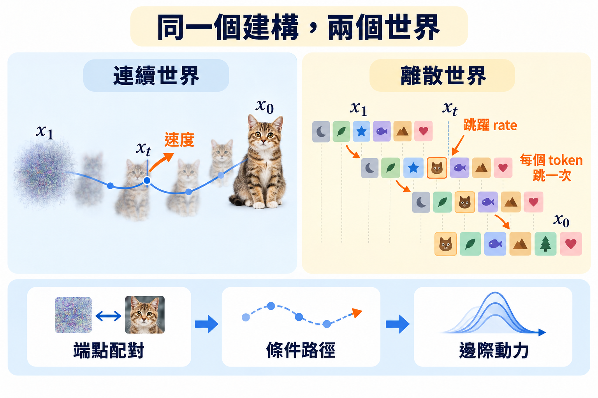

import Ask from '../../../components/Ask.astro';
import Remark from '../../../components/Remark.astro';
import Objectives from '../../../components/Objectives.astro';
import Prereq from '../../../components/Prereq.astro';
import Question from '../../../components/Question.astro';
import Answer from '../../../components/Answer.astro';
import QuizBlock from '../../../components/QuizBlock.astro';
import Option from '../../../components/Option.astro';
import Explanation from '../../../components/Explanation.astro';
import VizPlan from '../../../components/VizPlan.astro';
import Details from '../../../components/Details.astro';
import Bridge from '../../../components/Bridge.astro';
import Ref from '../../../components/Ref.astro';

# Discrete Flow Matching：條件路徑、Rate 與配對

<Objectives>
- **寫出逐 token 的條件路徑與條件 rate。** 認出 absorbing／uniform 是 source distribution 不同的特例。
- **證明 conditional flow matching 的離散版。** 條件 rate 的後驗平均生成邊際路徑，只是 continuity equation 換成 forward equation。
- **說出離散空間裡配對還控制什麼。** 沒有幾何直線可拉直，但資料與 source 的對齊方式仍會改變學習難度。
</Objectives>

<Prereq items={frontmatter.prereqs} />

<Ask>
兩個字之間沒有中點。 
那 flow matching 的「條件路徑」在離散空間裡是什麼？
</Ask>

## 換一個起點

到目前為止，反向過程都是「先定 forward chain，再把它倒過來」——<Ref to="dma-d3pm"/> 倒 posterior、<Ref to="dma-concrete-score"/> 倒 rate。<Ref week="dma-week-flow-matching"/> 在連續世界做過另一件事：不從 forward SDE 出發，直接**寫下每一對端點之間的條件路徑**，微分得到條件速度，再證明邊際速度是條件速度的後驗平均。那個建構把「路徑」的設計權從 Gaussian noise 手上拿回來。

離散世界能不能做同一件事？可以，而且做完會發現：$x_1$ 取全 `[MASK]` 就是 absorbing、取均勻隨機字就是 uniform，兩條鏈變成同一個框架的兩個特例；更重要的是，它讓 <Ref to="dma-why-not-diffusion"/> 說的「起點可以不是噪聲」在離散世界也成立。這就是 discrete flow matching（DFM），Gat et al. [1] 與 Campbell et al. [2] 在 2024 年各自提出。

<Remark label="符號" summary="這一篇的時間方向和論文原文相反">
本單元和上一個單元一樣：$t=0$ 是資料、$t=1$ 是噪聲，所以下面 $x_0\sim p_{\text{data}}$、$x_1\sim p_{\text{noise}}$。Gat et al. [1] 的原文把 source 放在 $t=0$、資料放在 $t=1$——式子長得一模一樣，只是 $x_0$ 與 $x_1$ 的角色互換，讀論文時對照即可。

另外 $\kappa_t$ 和前兩篇的 $\alpha_t$ 是互補的：$\kappa_t$ 是「已經變成 $x_1$ 的機率」、$\alpha_t$ 是「還是原字的機率」，所以 $\kappa_t=1-\alpha_t$。代進式子的時候不要記錯方向。
</Remark>

## 一個 token 怎麼從噪聲走到資料

先看一個 token。給定端點 $(x_0,x_1)$（兩個字），連續世界的直線插值 $(1-t)x_0+tx_1$ 在這裡沒有意義——兩個字之間沒有中點。但**機率**可以插值：

$$
p_t(x\mid x_0,x_1)=(1-\kappa_t)\,\delta_{x_0}(x)+\kappa_t\,\delta_{x_1}(x),\qquad \kappa_0=0,\ \kappa_1=1,\ \kappa_t\text{ 單調遞增}.
$$

$\delta_{x_0}$ 是集中在 $x_0$ 的 one-hot 分佈。讀法：在時刻 $t$，這個 token 以機率 $1-\kappa_t$ 還是 $x_0$、以機率 $\kappa_t$ 已經變成 $x_1$，**沒有第三種可能**。畫面是一枚只翻一次的硬幣：token 從 $x_0$ 出發，在某個隨機時刻跳到 $x_1$，之後不再動；$\kappa_t$ 是「到 $t$ 為止已經跳了」的機率。

整句 $L$ 個 token 各自獨立地做這件事，$p_t(x\mid x_0,x_1)=\prod_\ell p_t(x^\ell\mid x_0^\ell,x_1^\ell)$。

**它就是上一個單元的兩條鏈。** 取 $\kappa_t=1-\alpha_t$：
- $x_1=$ 全 `[MASK]`（一個確定的狀態）：token 以機率 $\alpha_t$ 是原字、$1-\alpha_t$ 是 `[MASK]`——absorbing 的 $\bar Q_t$。
- $x_1\sim$ 每個位置獨立均勻：token 以機率 $\alpha_t$ 是原字、$1-\alpha_t$ 是均勻隨機字——uniform 的 $\bar Q_t$。

<Ref to="dma-d3pm"/> 那句「$\bar Q_t=\bar\alpha_t I+(1-\bar\alpha_t)\times$終點」在這裡變成定義本身。而 $x_1$ 也可以是別的東西：一個混合（一部分位置 mask、一部分均勻）、或者根本不是噪聲——是另一個分佈的樣本。

## 條件 rate：一行

條件路徑要由一條 CTMC 生成，它的 rate 是什麼？forward 方向（$x_0\to x_1$）token 只有一種跳法：從 $x_0$ 跳到 $x_1$（若 $x_0\ne x_1$）。「還沒跳」的機率是 $1-\kappa_t$，它的衰減率就是 rate 乘上自己：$\frac{d}{dt}(1-\kappa_t)=-\text{rate}\cdot(1-\kappa_t)$，所以

$$
R_t(x_0\to x_1\mid x_0,x_1)=\frac{\dot\kappa_t}{1-\kappa_t}.
$$

代 $\kappa_t=1-\alpha_t$ 得 $-\dot\alpha_t/\alpha_t=\beta_t$，正是 <Ref to="dma-ctmc"/> 算出的 forward rate。✓

生成方向（從 $x_1$ 回到 $x_0$，時間往回走）也只有一種跳法：從 $x_1$ 跳回 $x_0$。往回走時「還在 $x_1$」的機率是 $\kappa_t$，它隨往回走的時間衰減的速率是 $\dot\kappa_t$，所以

$$
\bar R_t(x_1\to x_0\mid x_0,x_1)=\frac{\dot\kappa_t}{\kappa_t}.
$$

代 absorbing：$\frac{-\dot\alpha_t}{1-\alpha_t}$——<Ref to="dma-remasking"/> 的 $u_t$。✓ 兩個方向都不需要任何網路，是端點決定的常數（對 $t$ 的函數）。這對應 <Ref to="dma-conditional-flow-matching"/> 的「條件速度好算到不需要網路」。

<iframe loading="lazy" src="/personal_website/notes/research_areas/diffusion-models-applications/w7-4-token-path.html" class="demo-frame" title="DFM 的逐 token 條件路徑：互動 demo" style="height: 870px; width: 100%; border: none;"></iframe>

**互動 demo：一個 token 的條件路徑。** 六根柱子是六個位置，下半是起點的字（高度 $1-\kappa_t$）、上半是終點的字（高度 $\kappa_t$）；拖 $t$，質量就從下半流到上半，而且**六根完全同步**——條件路徑是逐 token 各自獨立的。按「抽一條軌跡」，每個位置各抽一個跳躍時刻，同一個 $t$ 之下就有些跳了、有些還沒，而且**每個位置只跳一次**，這就是條件路徑的全部內容。下方兩條 rate 把兩端的發散畫出來：$\kappa_t=t$ 時，$t=0.1$ 的 forward rate 是 1.11、生成 rate 是 10.00，$t=0.9$ 剛好反過來（10.00 / 1.11）——實作上兩端都要 clamp。換成 $\kappa_t=1-\cos(\pi t/2)$，同一個 $t=0.4$ 的 $\kappa$ 從 0.400 變成 0.191、生成 rate 從 2.50 變成 4.83。把起點按鈕換到「另一句話」，這個框架就直接是**序列到序列**，一個 `[MASK]` 都不需要。

## 條件目標平均起來，還是對的嗎？

現在對端點取平均。$(x_0,x_1)\sim\pi$（暫時獨立：$\pi=p_{\text{data}}\otimes p_{\text{noise}}$），邊際

$$
p_t(x)=\sum_{x_0,x_1}p_t(x\mid x_0,x_1)\,\pi(x_0,x_1),\qquad
\bar R_t(x\to y):=\mathbb E\big[\bar R_t(x\to y\mid x_0,x_1)\ \big|\ x_t=x\big].
$$

**敘述。** 若每組 $(x_0,x_1)$ 的條件 rate $\bar R_t(\cdot\mid x_0,x_1)$ 生成條件路徑 $p_t(\cdot\mid x_0,x_1)$，則上面定義的 $\bar R_t$ 生成邊際路徑 $p_t$。

**證明。** forward equation 對 $p$ 是**線性**的。對每組 $(x_0,x_1)$ 有 $\dot p_t(y\mid x_0,x_1)=\sum_x p_t(x\mid x_0,x_1)\,\bar R_t(x\to y\mid x_0,x_1)$（生成方向的時間；符號按方向調整）。兩邊乘 $\pi(x_0,x_1)$、對端點求和：

$$
\dot p_t(y)=\sum_x\sum_{x_0,x_1}p_t(x\mid x_0,x_1)\,\pi(x_0,x_1)\,\bar R_t(x\to y\mid x_0,x_1)
=\sum_x p_t(x)\underbrace{\sum_{x_0,x_1}\frac{p_t(x\mid x_0,x_1)\pi(x_0,x_1)}{p_t(x)}\bar R_t(x\to y\mid x_0,x_1)}_{=\ \bar R_t(x\to y)}.
$$

最後一步用了 $\bar R_t$ 的定義。$\square$

把它和 <Ref to="dma-conditional-flow-matching"/> 定理 1 的證明並排：那裡是「continuity equation 對 $p$ 線性 → 對 $z$ 積分 → 用 $u_t$ 的定義」；這裡是「forward equation 對 $p$ 線性 → 對 $(x_0,x_1)$ 求和 → 用 $\bar R_t$ 的定義」。**逐字相同，只換了方程式。** 還要順手檢查一件連續版不用檢查的事：後驗平均出來的 $\bar R_t$ 是不是合法的 rate matrix？是——非對角是非負數的平均，仍非負；列和是零的平均，仍為零。

連續版的定理 2 說：用條件速度當 MSE 目標，梯度與用邊際速度相同。離散版要學的是 $\bar R_t(x\to y)$，而條件 rate 的形狀很特別：對 mask source，$\bar R_t(x\to y\mid x_0,x_1)=\frac{\dot\kappa_t}{\kappa_t}\,\mathbb 1[y=x^{(\ell\to x_0^\ell)}]$——「位置 $\ell$ 被遮時，以 rate $\dot\kappa_t/\kappa_t$ 跳回 $x_0^\ell$」。對這個指示函數取後驗平均：

$$
\bar R_t\big(x\to x^{(\ell\to v)}\big)=\frac{\dot\kappa_t}{\kappa_t}\,p\big(x_0^\ell=v\ \big|\ x_t=x\big).
$$

邊際 rate 完全由 $x_0$ 的逐位置 posterior 決定，而 posterior 的自然回歸 loss 是 cross-entropy——與 <Ref to="dma-masked-diffusion"/> 相同（Gat et al. 稱之為 probability denoiser）。所以離散版「定理 2」的內容是：**用 $x_0^\ell$ 當 cross-entropy 的目標，網路收斂到 $p(x_0^\ell\mid x_t)$，代進上式就是邊際 rate。** 論證仍是 tower property：cross-entropy 的最小值是條件分佈，就像 MSE 的最小值是條件期望。

對一般的 source（例如均勻），條件 rate 是 $\frac{\dot\kappa_t}{\kappa_t}\mathbb 1[x^\ell=x_1^\ell]\mathbb 1[v=x_0^\ell]$，後驗平均後是 $\frac{\dot\kappa_t}{\kappa_t}\,p(x_0^\ell=v,\ x_1^\ell=x^\ell\mid x_t=x)$——多了一個「$x_t^\ell$ 是不是還是噪聲字」的判斷，這正是 <Ref to="dma-absorbing-vs-uniform"/> 說 uniform 的 context 不乾淨的地方，現在它是式子裡的一個 joint posterior。

## 這個框架多給了什麼

把 absorbing 與 uniform 寫成同一個式子的兩個特例，本身只是整理。DFM 真正多出來的是三件事：

1. **source 任意。** $x_1$ 不必是噪聲。<Ref to="dma-why-not-diffusion"/> 說 FM 的動機之一是「從分佈 A 生成分佈 B」；DFM 讓它在 token 上成立——source 可以是一句翻譯的原文、一段要修補的程式、一張圖的 token。
2. **schedule 與 source 可以逐位置不同。** 每個位置有自己的 $\kappa_t^\ell$、自己的 source 分佈——例如一部分位置走 mask、一部分走 uniform 的混合路徑（Gat et al. 的實驗顯示這種混合對某些任務有幫助）。
3. **取樣器的 stochasticity。** 上一篇說的 $\eta$（Campbell et al.）與 corrector（Gat et al.）：在生成 rate 上加一對流量相反的管子，邊際不變。

第 1 點把我們帶到 <Ref to="dma-fm-vs-diffusion"/> 遺留的設定。

<Question id="Q1">
<Ref to="dma-unified-equation"/> 把設計拆成路徑、配對與訓練噪聲。這裡的路徑是 $\kappa_t$，也沒有獨立的 $\gamma_t z$；還留下配對 $\pi(x_0,x_1)$。

**Token 之間沒有幾何直線可拉直，那麼把獨立配對換成別的配對，還有什麼作用？**

<Answer>
常見的答案分三類：「有，用 Hamming 距離做 OT 配對」、「沒有，因為離散空間沒有直線」、「要看 source 是什麼」。第三類是對的起點。

**mask source：沒有東西可以配對。** $x_1$ 是全 `[MASK]`，一個確定的狀態。$\pi$ 只能是 $p_{\text{data}}\otimes\delta_{\text{all-mask}}$，配對設定根本不存在。這是 absorbing 鏈的另一個乾淨之處。

**uniform source：可以配對，但拉直的意義沒了。** 連續世界裡配對之所以重要，是 <Ref to="dma-fm-vs-diffusion"/> Q1 那條鏈：獨立配對 → 條件直線交叉 → 邊際速度是交叉處的平均 → 軌跡彎 → Euler 有限步誤差大；OT 配對讓直線不交叉、軌跡變直、$\int\|\ddot x\|dt$ 變小。離散世界裡這條鏈的每一環都換了東西：條件路徑不是直線而是「每個 token 跳一次」；「交叉」沒有定義（沒有 ODE 軌跡，只有跳躍）；有限步誤差的來源不是曲率而是 <Ref to="dma-factorization-error"/> 的因子化——**一步內同時跳的多個位置被獨立抽**。而因子化誤差取決於**給定 $x_t$ 下各位置之間的條件相依**，這是資料分佈本身的性質；換配對改變的是「哪個噪聲配哪個資料」，改不了資料裡「牛肉」和「麵」的相依。所以「配對 → 拉直 → 少步」這條路在離散世界沒有對應。

（有一個粗糙的類比：用 Hamming 距離把 $x_0$ 配給「和它重疊最多」的 $x_1$，需要跳的 token 變少，每步同時跳的位置也少一點。但這同時讓噪聲字帶有 $x_0$ 的資訊——「還是原字」與「噪聲剛好等於原字」不再可分——沒有像 OT 配對那樣的定理支持它是好事，而且就我所知也沒有像 minibatch OT 那樣的系統性研究。這裡只當一個提示，不當結論。）

**配對真正留下的意義：對齊。** 當 source 不是噪聲而是另一個分佈時，$\pi$ 是**成對資料**——原文與譯文、草稿與修訂、一張圖的 caption 與 token。這時 $\pi$ 不是為了拉直而選的，是任務本身給的：它告訴模型「這個 $x_1$ 該變成哪個 $x_0$」。<Ref to="dma-why-not-diffusion"/> 說 FM 拿回了路徑設計權、可以做 A→B；DFM 把同一件事帶到 token 上，而配對是 A→B 裡「哪個 A 對哪個 B」的那個資訊。Campbell et al. [2] 的 protein co-design 就是這種用法的例子：結構（連續、用 FM）與序列（離散、用 DFM）成對生成，兩條路徑共用一個網路。

所以答案是：**拉直的意義消失，對齊的意義留下。** <Ref to="dma-fm-vs-diffusion"/> Q1 的「交叉」在離散世界的化身是因子化誤差，而它不歸配對管，歸「每步翻開幾個」與 <Ref to="dma-remasking"/> 的取樣器管。
</Answer>
</Question>

*圖：連續與離散 flow matching 都由端點配對、條件路徑與後驗平均三步構成；差別在中間用速度場還是跳躍 rate。*

## 先消化一下

<QuizBlock id="w7-4-a">
DFM 的條件路徑 $p_t(x\mid x_0,x_1)=(1-\kappa_t)\delta_{x_0}+\kappa_t\delta_{x_1}$，用一句話描述一個 token 的行為是：
<Option>在 $x_0$ 與 $x_1$ 之間來回切換，切換頻率由 $\kappa_t$ 決定。</Option>
<Option correct>從 $x_0$ 出發，在某個隨機時刻跳到 $x_1$ 之後不再動；$\kappa_t$ 是「到 $t$ 為止已經跳了」的機率。</Option>
<Option>以 $\kappa_t$ 的比例混合成一個「介於兩者之間」的字。</Option>
<Explanation>
路徑只有兩個可能的值，沒有中間字；而「以機率 $1-\kappa_t$ 還是 $x_0$」隨 $t$ 單調下降，對應的是一次性的跳躍而不是來回切換（來回切換的 CTMC 會有 $x_1\to x_0$ 的 forward rate，這裡沒有）。
</Explanation>
</QuizBlock>

<QuizBlock id="w7-4-b">
「邊際 rate 是條件 rate 的後驗平均」的證明，與 <Ref to="dma-conditional-flow-matching"/> 定理 1 的證明相比：
<Option>需要額外處理 rate matrix 的非線性。</Option>
<Option>只在 absorbing 鏈上成立。</Option>
<Option correct>逐字相同——都只用到「分佈演化方程式對 $p$ 是線性的」這一點；差別只是 continuity equation 換成 forward equation，積分換成求和。</Option>
<Explanation>
線性是唯一用到的性質，兩條方程式都有。對任何 source 分佈與任何 $\kappa_t$ 都成立。唯一多出來的檢查是後驗平均後的矩陣仍是合法 rate matrix，而這由「非負的平均非負、零的平均為零」直接給出。
</Explanation>
</QuizBlock>

<QuizBlock id="w7-4-c">
用 mask 當 source 時，配對設定 $\pi(x_0,x_1)$：
<Option>對應 OT 配對，可以拉直路徑。</Option>
<Option correct>不存在——$x_1$ 是一個確定的狀態（全 `[MASK]`），$\pi$ 只能是 $p_{\text{data}}$ 與一個點的乘積。</Option>
<Option>決定哪些位置先被遮。</Option>
<Explanation>
配對需要 source 有隨機性才有東西可配。哪些位置先被遮由每個位置的跳躍時刻（也就是 $\kappa_t$）決定，與 $\pi$ 無關。
</Explanation>
</QuizBlock>

<QuizBlock id="w7-4-d">
<Ref to="dma-fm-vs-diffusion"/> Q1 說「彎曲來自交叉，交叉來自配對」。這條因果鏈在離散世界裡：
<Option>完全照搬：換配對可以減少因子化誤差。</Option>
<Option>不存在任何對應。</Option>
<Option correct>「有限步誤差」那一端的對應是因子化誤差，但它取決於資料在給定 $x_t$ 下的條件相依，不由配對控制；配對留下的意義是成對資料（A→B）的對齊。</Option>
<Explanation>
連續世界的有限步誤差由軌跡幾何（曲率）決定、幾何由配對決定；離散世界的有限步誤差由「同時翻開的位置之間的相依」決定，那是資料分佈的性質。配對在 source 不是噪聲時（翻譯、修補、多模態）仍然重要，只是理由變成對齊而不是拉直。
</Explanation>
</QuizBlock>

<Bridge to="dma-discrete-applications">
離散生成現在也能拆成三個問題：中間怎麼破壞資訊、網路預測什麼、取樣器如何安排跳轉。下一篇用這三個問題讀語言、蛋白質與圖模型，看看不同應用真正改動的是哪一部分。
</Bridge>

## 參考文獻

1. Gat, I., Remez, T., Shaul, N., Kreuk, F., Chen, R. T. Q., Synnaeve, G., Adi, Y., Lipman, Y. [*Discrete Flow Matching.*](https://arxiv.org/abs/2407.15595) NeurIPS 2024.（逐 token 條件路徑、probability denoiser、混合 source、corrector sampling。）
2. Campbell, A., Yim, J., Barzilay, R., Rainforth, T., Jaakkola, T. [*Generative Flows on Discrete State-Spaces: Enabling Multimodal Flows and Applications to Protein Co-Design.*](https://arxiv.org/abs/2402.04997) ICML 2024.（CTMC 版的 flow matching、stochasticity $\eta$、連續與離散共用框架。）
3. Lipman, Y., Chen, R. T. Q., Ben-Hamu, H., Nickel, M., Le, M. [*Flow Matching for Generative Modeling.*](https://arxiv.org/abs/2210.02747) ICLR 2023.（連續版定理 1、2。）
4. Sahoo, S. S. et al. [*Simple and Effective Masked Diffusion Language Models.*](https://arxiv.org/abs/2406.07524) NeurIPS 2024.（mask source 下 DFM 與 MDLM 的等價。）
5. Tong, A., Fatras, K., Malkin, N., Huguet, G., Zhang, Y., Rector-Brooks, J., Wolf, G., Bengio, Y. [*Improving and Generalizing Flow-Based Generative Models with Minibatch Optimal Transport.*](https://arxiv.org/abs/2302.00482) TMLR 2024.（連續世界的配對設定，Q1 的對照。）
