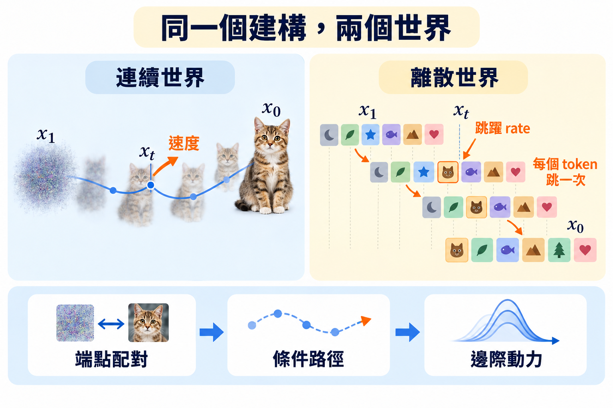

import Ask from '../../../components/Ask.astro';
import Remark from '../../../components/Remark.astro';
import Objectives from '../../../components/Objectives.astro';
import Prereq from '../../../components/Prereq.astro';
import Question from '../../../components/Question.astro';
import Answer from '../../../components/Answer.astro';
import QuizBlock from '../../../components/QuizBlock.astro';
import Option from '../../../components/Option.astro';
import Explanation from '../../../components/Explanation.astro';
import Details from '../../../components/Details.astro';
import Bridge from '../../../components/Bridge.astro';
import Ref from '../../../components/Ref.astro';

# Token 之間不能走直線，還能 Flow Matching 嗎？

<Objectives>
- **為配好的離散端點建立 conditional probability path。** Token 不能做數值插值，但可以改變位於兩端的機率。
- **從 conditional rate 得到 marginal rate。** 用 posterior average 與 cross-entropy 接回 Flow Matching 的 conditional trick。
- **分清相同 snapshots 與相同 trajectories。** 對回 absorbing、uniform 的邊際路徑，再辨認語言、蛋白質與圖生成中的設計。
</Objectives>

<Prereq items={frontmatter.prereqs} />

## 先決定中途要有多少人，然後才決定怎麼搬

<Ref to="dma-remasking"/> 顯示，同一條 probability path 不只一種走法。那我們能不能像 <Ref to="dma-flows-and-continuity"/> 一樣，先給一組端點，再直接設計中間路徑？

想像把「貓」換成「狗」。我們不能走到「半隻貓、半隻狗」這個 token，但可以說：在時間 $t$，有一部分樣本仍是「貓」，其他已經換成「狗」。**離散的 interpolation，可以插在機率上，而不是插在 token 編號上。**

Gat 等人的 **Discrete Flow Matching（DFM）** [1] 系統化了這個建構；Campbell 等人的 discrete generative flows [2] 也從可設計的 probability paths 與 rates 出發。

## 先配端點，再選跳過去的時機

本篇維持這個單元的方向：$t=0$ 是 data，$t=1$ 是可抽樣的 source，生成倒著走。這與 U2 及 DFM 原論文常用的方向相反；我們要學的目標仍是資料端 $x_0$。

先抽端點 $(x_0,x_1)\sim\pi$。$\pi$ 是 coupling，兩端 marginals 分別為 $p_0$ 與 $p_1$，定義可回顧 <Ref to="dma-unified-equation"/>。再選遞增的 $\kappa_t$，滿足 $\kappa_0=0,\kappa_1=1$，令每個位置的 conditional path 為
$$
q_t(x^\ell\mid x_0,x_1)
=(1-\kappa_t)\delta_{x_0^\ell}(x^\ell)
+\kappa_t\delta_{x_1^\ell}(x^\ell).
$$
在固定端點下，各位置獨立抽樣；對整組端點平均後得到
$$
p_t(x)=\sum_{x_0,x_1}\pi(x_0,x_1)
\prod_\ell q_t(x^\ell\mid x_0,x_1).
$$
一種具體的 conditional process 是：每個位置抽一次跳躍時間，累積機率為 $\kappa_t$；跳之前是 $x_0^\ell$，跳之後是 $x_1^\ell$。若兩端相同，那格就不用改。

<iframe loading="lazy" src="/personal_website/notes/research_areas/diffusion-models-applications/w7-4-token-path.html" class="demo-frame" title="離散端點之間的 probability interpolation" style="height: 870px; width: 100%; border: none;"></iframe>

## 假如知道兩端，倒著走的 rate 很容易算

現在時間從 $t$ 退回 $t-h$。已跳到 source 的比例是 $\kappa_t$，這一小段要退回的比例約為 $\dot\kappa_t h$。所以每個這樣的 token，其退回 rate 是 $\dot\kappa_t/\kappa_t$。

固定端點，若目前位置 $\ell$ 的字是 $x^\ell$，要跳到不同的 $v$，conditional reverse rate 可寫成
$$
\bar R_t^{\mathrm{cond}}
(x,x^{(\ell\to v)}\mid x_0,x_1)
=\frac{\dot\kappa_t}{\kappa_t}\mathbf1[x_0^\ell=v],
\qquad v\neq x^\ell.
$$
只會跳回那格的 data endpoint。若已經是原字，所有不同的 $v$ 都得到 rate $0$。

但真正生成時，我們不知道 $x_0$。和 U2 的 reference velocity 一樣，對所有可能的端點取 posterior average：
$$
\begin{aligned}
\bar R_t(x,x^{(\ell\to v)})
&=\mathbb E[\bar R_t^{\mathrm{cond}}\mid x_t=x]\\
&=\frac{\dot\kappa_t}{\kappa_t}
p(x_0^\ell=v\mid x_t=x).
\end{aligned}
$$
**連續 Flow Matching 平均 reference velocities；這裡平均 conditional rates。** 在相應的 well-posed dynamics 下，這個 marginal rate 會生成同一條 $p_t$ [1]。

每組端點的 conditional distribution 在倒著走時，都滿足以 $\bar R_t^{\mathrm{cond}}$ 為 generator 的 forward equation。對 $\pi$ 求和後，從狀態 $x$ 到 $y$ 的 flow 為
$$
\begin{aligned}
&\sum_{x_0,x_1}
\pi(x_0,x_1)q_t(x\mid x_0,x_1)
\bar R_t^{\mathrm{cond}}(x,y\mid x_0,x_1)\\
&\qquad=p_t(x)\,
\mathbb E[\bar R_t^{\mathrm{cond}}(x,y\mid x_0,x_1)\mid x_t=x].
\end{aligned}
$$
Bayes 把端點的 weights 收成 posterior，於是平均後的流入減流出，正是 $p_t$ 的演化。這是 <Ref to="dma-conditional-flow-matching"/> 證明的離散求和版本；不是要求每條生成 trajectory 都沿原本配好的 conditional path。

## 我們其實已經會訓練這個物件

Training 時端點都已知，可以直接抽 $x_t$，再用 data endpoint 作 label：
$$
L_{\mathrm{DFM}}
=\mathbb E_{t,(x_0,x_1)\sim\pi,x_t}
\sum_\ell-\log f_\theta^\ell(x_0^\ell\mid x_t,t).
$$
固定輸入後，cross-entropy 的理想最佳解就是 $p(x_0^\ell\mid x_t)$，代回上面的 rate 即可。**Training 不用先模擬完整的跳躍過程；只要抽出當下的 conditional snapshot。**

<Remark label="補充" summary="Coupling 會影響什麼？">
兩端各自的分布相同，配對不同，$p_t$ 與 endpoint posterior 仍可能不同，所以 coupling 可能影響 target uncertainty 與生成誤差。離散 token 沒有 U3 中的幾何直線，不能直接把 continuous reflow 的 straightness 定理照搬過來；但也不能因此說 coupling 對離散學習完全沒有影響。
</Remark>

## 回頭看，它和 masked diffusion 差在哪裡？

若 source 是全 MASK，取 $\kappa_t=1-\alpha_t$，conditional path 就是
$$
q_t(x^\ell\mid x_0)
=\alpha_t\delta_{x_0^\ell}
+(1-\alpha_t)\delta_m.
$$
Reverse rate 也回到
$$
\bar R_t(x,x^{(\ell\to v)})
=\frac{-\dot\alpha_t}{1-\alpha_t}
p(x_0^\ell=v\mid x_t=x).
$$
這正是 <Ref to="dma-concrete-score"/> 的 masked diffusion。若 source 改成與資料獨立的 uniform tokens，把 $x_1$ 平均掉，也會得到 uniform corruption 的 conditional snapshots。

不過 uniform 的原 forward chain 可以反覆重抽；上面設計的 conditional process 只在端點間跳一次。**Snapshots 一樣，不表示 trajectory law 或 reverse generator 一樣。** 這和 DDPM、DDIM 共用 marginals、卻重新設計 coupling 的差別相同。

*圖：兩者都先配端點、設計 conditional path，再取 posterior average；連續狀態平均速度，離散狀態平均跳躍 rate。*

## 換成真實資料，要看哪幾個設計？

不用先記每個模型名稱。先問：狀態是什麼、中間怎麼破壞或插值、模型預測什麼、最後怎麼抽樣？

| 例子 | 狀態與 probability path | 學習與生成 |
| --- | --- | --- |
| MDLM [3] | 語言 token，absorbing masking | 預測原字，按 reveal probabilities 逐步填入 |
| Multiflow [2] | 蛋白質的離散序列與連續結構 | 同時學離散 rates 與連續 dynamics，做 sequence–structure co-design |
| DiGress [4] | Graph 的 node、edge 類別逐步 corruption | 預測乾淨圖的類別，再用 reverse transitions 生成 |

圖上的類別合法，不代表分子化學限制必定滿足；序列與結構一起生成，也不等於所有生物性質都有保證。應用仍要選擇適合任務的模型、條件與評估。

<Question id="Q1">
如果 data 與 source 的 token 不在同一個連續空間，DFM 還能定義 interpolation 嗎？

<Answer>
可以，只要兩端可放在同一個離散 state space。Conditional path 是兩個 point masses 的**機率混合**，不是對 token 做數值平均。若任務還要求「這一張輸入對應哪一張輸出」，例如保留指定蛋白質結構，則要把需要保留的資訊作為 condition；只保證兩端的 marginal transport 不等於保證逐筆對應符合任務。
</Answer>
</Question>

## 快速回顧一下

<QuizBlock id="w7-4-a">
離散 conditional interpolation 改變的是：
<Option>Token 編號的中間值。</Option>
<Option correct>樣本位於兩個端點的機率。</Option>
<Option>字典大小一定逐步增加。</Option>
<Explanation>任何時刻抽出的仍是合法的離散 token。</Explanation>
</QuizBlock>

<QuizBlock id="w7-4-b">
Conditional rate 要怎麼變成 marginal rate？
<Option correct>對給定目前狀態後，所有可能端點的 posterior 取平均。</Option>
<Option>只選最接近的 endpoint。</Option>
<Option>對不同字的編號取平均。</Option>
<Explanation>這個平均把各 conditional probability flows 組成 $p_t$ 的整體流量。</Explanation>
</QuizBlock>

<QuizBlock id="w7-4-c">
兩個 processes 的 $q_t(x_t\mid x_0)$ 相同，表示：
<Option>所有跨時間的配對與 trajectories 都相同。</Option>
<Option correct>每個時刻的 snapshots 相同；不同時刻如何連起來仍可能不同。</Option>
<Option>必須用相同的 finite-step sampler。</Option>
<Explanation>Marginals、joint process 與 numerical sampler 是不同層次。</Explanation>
</QuizBlock>

<Bridge to="dma-lab-discrete-time">
這個單元從 token 的加噪與去噪，走到可設計的 probability paths 與 rates。接下來用兩次實作檢查它們：先把網路誤差拿掉，觀察平行填字漏掉的相依；再比較 rate 的有限步取樣，以及加入修改機會後的結果。
</Bridge>

## 參考文獻

1. Gat, I. et al. [*Discrete Flow Matching.*](https://arxiv.org/abs/2407.15595) NeurIPS 2024.
2. Campbell, A. et al. [*Generative Flows on Discrete State-Spaces: Enabling Multimodal Flows with Applications to Protein Co-Design.*](https://arxiv.org/abs/2402.04997) ICML 2024.
3. Sahoo, S. S. et al. [*Simple and Effective Masked Diffusion Language Models.*](https://arxiv.org/abs/2406.07524) NeurIPS 2024.
4. Vignac, C. et al. [*DiGress: Discrete Denoising Diffusion for Graph Generation.*](https://arxiv.org/abs/2209.14734) ICLR 2023.
