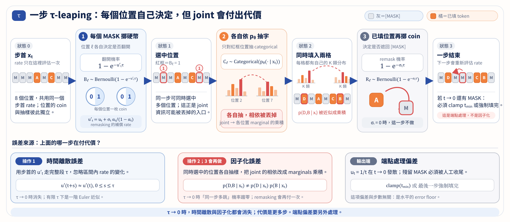

import Ask from '../../../components/Ask.astro';
import Remark from '../../../components/Remark.astro';
import Question from '../../../components/Question.astro';
import Answer from '../../../components/Answer.astro';
import Objectives from '../../../components/Objectives.astro';
import Prereq from '../../../components/Prereq.astro';
import QuizBlock from '../../../components/QuizBlock.astro';
import Option from '../../../components/Option.astro';
import Explanation from '../../../components/Explanation.astro';
import Details from '../../../components/Details.astro';
import Bridge from '../../../components/Bridge.astro';
import Ref from '../../../components/Ref.astro';

# 實作 B：Rate 取樣、Remasking 與比值

<Objectives>
- **比較 closed-form reveal 與 frozen-rate 近似。** 不混入 endpoint completion，先量每個時刻的 MASK 比例。
- **實作真的會修改已填字的 remasking。** 寫出有限步的遮回與補償機率，分清 conditional snapshot 保留與生成時的因子化。
- **驗證 absorbing ratio 與 weighted cross-entropy 的換算。** 用同一個 toy 算兩邊，不靠模型名稱判斷它們是否相關。
</Objectives>

<Prereq items={frontmatter.prereqs} />

## 同一條路，換成 Rate 來走會差多少？

<Ref to="dma-lab-discrete-time"/> 已經把平行抽字的問題分開量出來。本次加入時間近似：只拿現在的 rate 走一整段，會不會和 closed-form 的 snapshot probabilities 有差？再加入 remasking，讓前面已填的字也能修改。

[下載實作 B notebook：Rate、remasking 與 absorbing ratios](/personal_website/notes/notebooks/diffusion-models-applications/dma-w7-lab.ipynb)

程式需要 NumPy 與 Matplotlib，沿用完整列舉的 bit toy。這次資料設成 **$99\%$ 偶數 parity、$1\%$ 奇數 parity**，讓所有完整序列都有正機率；有限步抽出不理想的組合後，posterior 仍有定義。它不是上一個 notebook 的純偶數資料。

## 第一步：先只檢查 MASK 比例

選 $\alpha_t=1-t$。<Ref to="dma-concrete-score"/> 的 reverse reveal rate 是 $1/t$；從 $t$ 退到 $s=t-h$，closed-form 的翻開機率為
$$
w_{t,s}=\frac{\alpha_s-\alpha_t}{1-\alpha_t}
=\frac ht.
$$
若把步首 rate $1/t$ 凍結在整段 $h$，則翻開機率為
$$
1-e^{-h/t}.
$$
這是 **frozen-rate 的 $\tau$-leaping 型近似**：一段時間內不再更新 rates 與 context。兩者在 $h\to0$ 時有相同一階項，但有限 $h$ 不相同。

Notebook 先停在 $t=0.02$，不把最後補完混進實驗。畫出不同步數的 MASK 比例，與目標 $1-\alpha_t=t$ 比較；closed-form 那條則檢查是否在 Monte Carlo 誤差內一致。

<iframe loading="lazy" src="/personal_website/notes/research_areas/diffusion-models-applications/w7-6-tauleap.html" class="demo-frame" title="比較 snapshot probabilities 與 frozen-rate 取樣" style="height: 1000px; width: 100%; border: none;"></iframe>

*Demo 使用純偶數 parity，另比較最後填完後的合法率；notebook 的第一張圖只看內部時間的 MASK 比例。兩者測量的物件不同。*

<Question id="Q1">
既然 closed-form 的 reveal probability 更直接，為什麼還要學 rate sampling？

<Answer>
因為新設計不一定有好算的整段 transition。例如 rate 依賴當下完整 context，或加入新的修改規則時，一整段時間內可能多次改變狀態與 rates。Rate sampler 可以只使用當下的局部轉移資訊。

但在本例，closed form 精確的是「各位置是否翻開」的機率；把翻開的字獨立抽出來，仍有 <Ref to="dma-factorization-error"/> 的問題。時間近似與因子化不能混成同一個誤差。
</Answer>
</Question>

*圖：凍結 rates、平行抽字與端點補完是不同操作，評估時要分開檢查。*

## 第二步：Remasking 不只是晚一點才填字

依信心先保留一些新字、其餘留著 MASK，不一定真的會修改**已經保留的字**。本 notebook 則明確加入遮回操作。

對 $t>s$，若可見字以機率 $r$ 遮回去，固定原文時，原本可見的比例 $\alpha_t$ 變成 $\alpha_t(1-r)$。為了到達 $\alpha_s$，每個 MASK 的翻開機率應滿足
$$
\alpha_t(1-r)+(1-\alpha_t)a=\alpha_s.
$$
解出
$$
a=\frac{\alpha_s-\alpha_t+r\alpha_t}{1-\alpha_t}.
$$
因此 $r$ 還要滿足 $0\leq r\leq(1-\alpha_s)/\alpha_t$，才能讓 $a\leq1$。程式以 rate-inspired 的 $r=1-e^{-\sigma(t-s)}$ 為起點，再套用這個限制；這是有限步 kernel，**不是把所有機率直接寫成 rate 乘步長**。這類保留 conditional marginals 的設計見 ReMDM [2]。

先給定真實 $x_0$，翻開時填原字，檢查新的 MASK 比例是否為 $1-\alpha_s$。接著改用 posterior marginals 抽新字，比較不同 steps 與 $\sigma$ 的合法率；這時仍有平行抽字的因子化誤差。

<Remark label="補充" summary="為什麼需要所有轉移都用更新前的狀態？">
這一步同時決定哪些原 MASK 翻開、哪些原可見字遮回。若先修改陣列，再用修改後的 MASK 判斷第二個操作，剛填的字也可能立刻被遮掉；那就不是上式描述的 kernel。Notebook 先保存舊的 mask pattern，再一次更新。
</Remark>

## 第三步：把模型誤差另外加進來

程式把精確的 token=1 posterior 往 $\tfrac12$ 拉：
$$
\tilde f^\ell=(1-\epsilon)f^\ell+\epsilon\frac12.
$$
$\epsilon=0$ 是 oracle，其他值是可控的 prediction surrogate，不是訓練好的 neural network。固定 steps，比較不同 remasking 強度；再固定 $\sigma$，改變 $\epsilon$。

不要預設每條線都單調改善。記錄 remasking 在哪些計算預算下有幫助，哪些設定反而更差；理想 rate 的 marginal-preservation theorem，不能直接當作 finite-step quality guarantee。

## 第四步：Ratio 和 denoiser，真的只差係數嗎？

選一張只剩一個 MASK 的 $x$，把它填成 $v$ 得到 $y$。程式分別直接列舉 $p_t(y)/p_t(x)$，以及計算
$$
\frac{\alpha_t}{1-\alpha_t}
p(x_0^\ell=v\mid x_t=x),
$$
用 assertion 比較兩者。

最後令 $s_\theta(v)=\alpha_t f_\theta(v)/(1-\alpha_t)$，檢查 SEDD [3] 的 absorbing denoising score entropy 與 weighted CE：比較兩組不同預測的 **loss 差值**，確認不含參數的常數相消後，兩者一致。完整推導可回顧 <Ref to="dma-concrete-score"/>。

## 延伸練習

1. 固定 steps，比較 $\sigma=0,2,5$；增加修改頻率是否每次都更好？
2. 把 prediction surrogate 換成自己的 masked model，保留相同介面與評估。記錄 seed、模型規模、posterior queries 與抽樣數。
3. 換成其他具有正機率 support 的相依資料，重新測量；不要只用 MASK 比例判定完整 distribution 正確。
4. 改回純偶數 parity 時，記錄哪些 generated contexts 的真 posterior 沒有定義。這些 off-support states 不能當作 oracle 自動提供了正確答案。

## 快速回顧一下

<QuizBlock id="w7-6-a">
$1-e^{-h/t}$ 與 $h/t$ 的關係是：
<Option>對任意步長都相同。</Option>
<Option correct>小步時一階一致；前者凍結 rate，有限步時有時間近似。</Option>
<Option>前者一定沒有因子化誤差。</Option>
<Explanation>是否精確計算 reveal probability，與字之間怎麼 joint 抽樣，是兩件事。</Explanation>
</QuizBlock>

<QuizBlock id="w7-6-b">
有限步 remasking 中，補償機率 $a$ 的來源是：
<Option>任意多填幾格。</Option>
<Option correct>讓 $\alpha_t(1-r)+(1-\alpha_t)a=\alpha_s$。</Option>
<Option>要求兩邊轉移機率相同。</Option>
<Explanation>來源比例乘上轉移機率，才是被搬動的 probability mass。</Explanation>
</QuizBlock>

<QuizBlock id="w7-6-c">
檢查 SEDD 與 CE 的換算，為什麼比較兩組預測的 loss 差值？
<Option>為了讓模型更容易訓練。</Option>
<Option correct>兩種寫法可能相差不含參數的常數；差值把它消掉。</Option>
<Option>因為兩者永遠完全相等，包含所有常數。</Option>
<Explanation>Training gradient 或最佳解一致，不代表報出的原始 loss 數字必須相同。</Explanation>
</QuizBlock>

<Bridge to="dma-learn-the-map">
我們現在能從連續速度或離散 rates 建立生成過程，也看過有限步的近似與修改方式。但每一步仍要計算模型的預測。如果想把整段生成濃縮成一次預測，除了改「怎麼走」，能不能直接學「走完會到哪裡」？下一個單元從這個問題出發。
</Bridge>

## 參考文獻

1. Campbell, A. et al. [*A Continuous Time Framework for Discrete Denoising Models.*](https://arxiv.org/abs/2205.14987) NeurIPS 2022.
2. Wang, G. et al. [*Remasking Discrete Diffusion Models with Inference-Time Scaling.*](https://arxiv.org/abs/2503.00307) 2025.
3. Lou, A., Meng, C., Ermon, S. [*Discrete Diffusion Modeling by Estimating the Ratios of the Data Distribution.*](https://arxiv.org/abs/2310.16834) ICML 2024.
