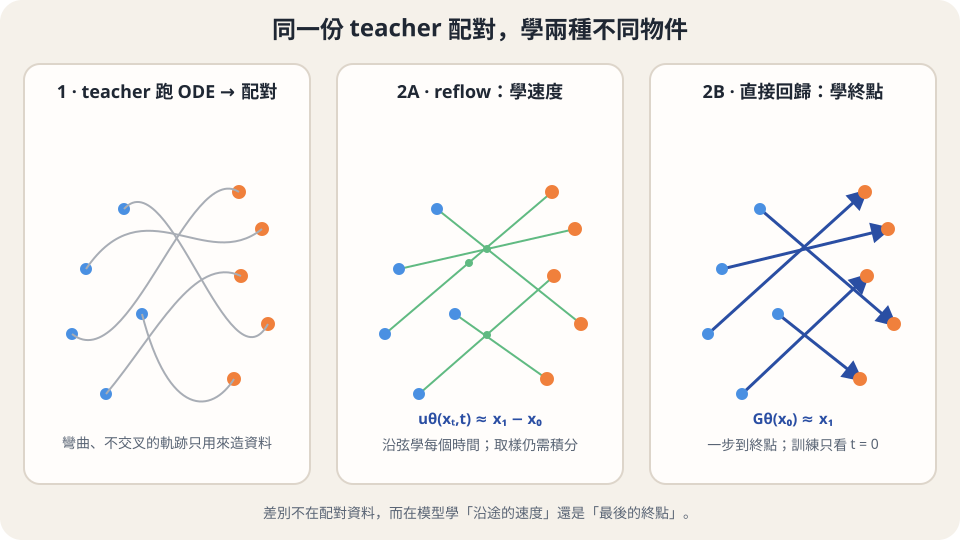

import Objectives from '../../../components/Objectives.astro';
import Prereq from '../../../components/Prereq.astro';
import Question from '../../../components/Question.astro';
import Answer from '../../../components/Answer.astro';
import QuizBlock from '../../../components/QuizBlock.astro';
import Option from '../../../components/Option.astro';
import Explanation from '../../../components/Explanation.astro';
import VizPlan from '../../../components/VizPlan.astro';
import Details from '../../../components/Details.astro';
import Bridge from '../../../components/Bridge.astro';
import Ref from '../../../components/Ref.astro';

# 不走了，直接學那一步

<Objectives>
- **說出速度場路線的一步天花板。** 用曲率積分解釋：只要軌跡還有彎，一步 Euler 就仍有誤差。
- **說出直接學 flow map 的做法與代價。** 分析 teacher 造 ODE 配對後回歸終點，並與 <Ref to="dma-rectified-flow"/> 的 reflow 對照。
- **在兩套時間座標間翻譯。** 分清 FM 的「噪聲 $\to$ 資料」與本單元 $t=0$ 為資料、$t$ 大為噪聲的慣例。
</Objectives>

<Prereq items={frontmatter.prereqs} />

## 路已經拉直，為什麼一步還是不準？

<Ref to="dma-error-theory"/> 把三個單元的主線收在一條不等式上：Euler 取樣的全域誤差 $\lesssim C_L\,h\int_0^1\|\ddot x_t\|\,dt$。步長 $h$ 是預算，積分是軌跡有多彎。<Ref to="dma-rectified-flow"/> 與 <Ref to="dma-minibatch-ot"/> 接著做了一件事：改配對，把積分壓小。<Ref to="dma-lab-interpolants"/> 的圖 b 上，四個模型落在一條斜線上——積分小的，同樣步數誤差就小。

現在把這條斜線往左看到底。積分**恰好是零**只有一種情形：所有粒子沿等速直線走，$S(\pi)=0$。reflow 迭代的極限逼近它，但每一輪都在累積上一輪的模型誤差，實務上一到兩輪就停；停下來的時候積分還不是零。而只要它不是零，$h=1$——一步——就一定有誤差，不等式只告訴你誤差有多小，沒有辦法讓它消失。

這就像導航已經替你挑了一條很直的路，但你仍得沿路開過去；把彎道變少，不等於車子能瞬間出現在終點。前三個單元都是**先學速度場、再用數值方法積分它**，一步生成在這條路上只能逼近。既然真正要的是「從噪聲到資料」，問題應該反過來問：

> **能不能不學速度場，直接學那個映射？**

## 要學的物件叫什麼

用 <Ref week="dma-week-flow-matching"/> 的語言說清楚要學的東西。速度場 $u_t$ 定義了一個 ODE，ODE 的解把時刻 $s$ 的點送到時刻 $t$ 的點，這個「送」的動作是一個映射，記成 $\psi_{s\to t}$：$\psi_{s\to t}(x_s)=x_t$。<Ref to="dma-flows-and-continuity"/> 叫它 **flow map**。生成一張圖，就是算一次 $\psi_{0\to1}$——把 $x_0\sim\mathcal N(0,I)$ 送到 $x_1$。

前三個單元從來沒有直接碰過 $\psi_{0\to1}$。我們學的是 $u_t$，然後靠 Euler 一步一步**近似**它：$N$ 步 Euler 就是 $N$ 個「假設這一小段是直線」的映射疊起來。誤差來自每一段其實不是直線。

所以新目標是：**用一個網路 $G_\theta$ 直接逼近 $\psi_{0\to1}$。** 它的輸入是一個噪聲，輸出是一張圖，中間不積分任何東西。這就是 <Ref to="dma-what-are-we-learning"/> 一開始想要的那個 $G$——只是這次我們已經知道它該等於什麼：一個具體的、由 PF-ODE 決定的映射，而不是無限多個合法 $G$ 中隨便一個。這一點很重要，馬上會用到。

<Question id="Q1">
我們手上有一個訓好的 FM（或 diffusion）模型，可以跑 ODE。**最笨、最直接的做法是什麼？它哪裡好、哪裡不好？**

<Answer>
最直覺的做法幾乎只有一個：用 teacher 跑 ODE，從 $x_0$ 算到 $x_1=\psi_{0\to1}(x_0)$，收集一大堆 $(x_0,x_1)$ 配對，然後訓一個網路做回歸 $G_\theta(x_0)\approx x_1$。這確實就是最早的做法（Luhman & Luhman [1]），值得認真分析，因為它把這個單元所有方法要解決的問題都攤在桌上了。

**好的地方，而且比想像中好。** 回歸的目標是 MSE，<Ref to="dma-tweedie-and-score"/> 說 MSE 的最小值是 conditional expectation $\mathbb E[x_1\mid x_0]$。<Ref to="dma-what-are-we-learning"/> 提醒過，如果一個 $x_0$ 可以對到很多個 $x_1$，回歸會輸出它們的平均、變成一團糊。但這裡不會：**$\psi_{0\to1}$ 是 ODE 的解，一個起點對到一個終點**，$\mathbb E[x_1\mid x_0]$ 就是 $\psi_{0\to1}(x_0)$ 本身。沒有 mode averaging。這件事的來源是 <Ref to="dma-flows-and-continuity"/> 的「ODE 軌跡不交叉」，也是 <Ref to="dma-rectified-flow"/> 的第三個性質——同一個事實。

**不好的地方一：資料太貴。** 每一筆訓練配對都要 teacher 跑幾十到上百步 ODE。想學好一個 $G_\theta$ 需要的配對數量和訓練一個生成模型差不多，等於要用 teacher 生成整個資料集一次。

**不好的地方二：學生只看過 $t=0$。** 訓練資料只有 $(x_0,x_1)$，中間的 $x_t$ 完全沒出現。這在兩個地方付出代價：學生沒辦法多步取樣（它只會從純噪聲出發），而且它要學的映射是整條 ODE 疊起來的那個版本——<Ref to="dma-shared-techniques"/> 說中段 $t$ 是最難學的一段，直接回歸終點等於把整段都塞進一個網路裡。

**不好的地方三：這只是蒸餾。** 學生的上限是 teacher；teacher 的誤差、teacher 用的取樣步數造成的離散誤差，全部進入配對。這個單元後面會問：能不能不要 teacher？

把三個「不好」記下來。接下來三篇分別對付它們：<Ref to="dma-progressive-distillation"/> 用「逐輪減半」省掉事先生成資料；<Ref to="dma-consistency-function"/> 把要學的物件從「$t=0$ 到終點」改成「任何 $t$ 到終點」；<Ref to="dma-cd-vs-ct"/> 拿掉 teacher。
</Answer>
</Question>

## 這件事我們其實做過

停一下，回頭看 <Ref to="dma-rectified-flow"/>。reflow 的第一步是什麼？「用模型自己的 ODE 生成配對 $(X_0,Z_1)$」。這和 Q1 的做法**一模一樣**：都是 teacher 跑 ODE、收集起點與終點。差別只在拿到配對之後做什麼：

| | 配對怎麼來 | 拿配對學什麼 | 產物 |
|---|---|---|---|
| Reflow（<Ref to="dma-rectified-flow"/>） | teacher 跑 ODE | 重訓 FM：$u_\theta(x_t,t)\approx x_1-x_0$，$x_t$ 是配對的直線插值 | 一個更直的速度場，還是要積分 |
| 直接回歸終點 [1] | teacher 跑 ODE | $G_\theta(x_0)\approx x_1$ | 一個一步映射 |

reflow 學的是**速度**，所以產物仍然是要積分的東西，只是軌跡直了、需要的步數少了；直接回歸學的是**終點**，產物本身就是一步。兩者的訓練資料完全相同。而 reflow 做兩輪就接近直線這件事，換到這個角度說就是：**一個配對不交叉的 FM，它的一步 Euler 就幾乎是 $\psi_{0\to1}$**。所以 reflow×2 本身就是一個不錯的一步生成器——<Ref to="dma-lab-consistency"/> 會把它和這個單元的方法放在同一張圖上比。

這個對照給了一個很有用的座標：這個單元的所有方法，都可以問「配對從哪裡來、學速度還是學終點、要不要 teacher」三個問題。

**圖：同一份配對，兩種用法。** reflow 與直接回歸終點都用 teacher 的 ODE 造配對；前者在整條弦上學速度場，後者直接學起點到終點。差別不在資料，而在學的物件。

## 切換時間方向

接下來三篇要跟著 Consistency Models 原文 [4] 與 EDM [5] 的慣例走，那套慣例的時間方向和 <Ref week="dma-week-flow-matching"/>、<Ref week="dma-week-interpolants"/> **相反**：$t=0$ 是資料、$t$ 大是噪聲，和 <Ref week="dma-week-diffusion"/> 的 DDPM 方向相同。這是認知負荷不是數學難度，所以花半頁把它一次講清楚，之後不再回頭。

**本單元的 forward process** 用 EDM 的 variance-exploding（VE）形式：

$$
x_t=x_0+t\,\epsilon,\qquad \epsilon\sim\mathcal N(0,I),\quad t\in[0,T],
$$

$x_0\sim p_{\text{data}}$ 是乾淨資料，噪聲的標準差**就是** $t$ 本身（沒有 $\sqrt{\bar\alpha_t}$ 這種縮放）。$T$ 取得夠大（原文用 $T=80$，資料標準化到單位尺度），使 $x_T\approx T\epsilon$ 幾乎是純噪聲；取樣時從 $\mathcal N(0,T^2I)$ 出發。這條路徑的好處是每個係數都是 $1$ 或 $t$，接下來所有式子裡不會有 schedule 的符號。

**本單元的 PF-ODE。** 對這條路徑，probability-flow ODE 是

$$
\frac{dx_t}{dt}=-t\,\nabla\log p_t(x_t)=\mathbb E[\epsilon\mid x_t],
$$

第二個等號是 <Ref to="dma-tweedie-and-score"/> 的 Tweedie 公式在 VE 座標下的樣子——denoiser 預測的 $\mathbb E[\epsilon\mid x_t]$ 就是速度，方向是「往噪聲走」。生成是把這條 ODE 從 $t=T$ 解到 $t=0$。（推導放在下面的展開框。）

**與 FM 座標的對照。** 把 FM 的時間記成 $s\in[0,1]$（$s=0$ 噪聲、$s=1$ 資料），線性路徑 $x^{\text{FM}}_s=s\,x_{\text{data}}+(1-s)\,\epsilon$。兩邊除以 $s$：$x^{\text{FM}}_s/s=x_{\text{data}}+\frac{1-s}{s}\,\epsilon$，右邊正是本單元的 $x_t$，只要令 $t=\frac{1-s}{s}$。所以兩套座標描述的是**同一族分佈**，只差一個時間重參數化與一個尺度——<Ref to="dma-fm-vs-diffusion"/> 說的「同一物件、不同座標」。

| | <Ref week="dma-week-diffusion"/>（DDPM） | <Ref week="dma-week-flow-matching"/>–<Ref week="dma-week-interpolants"/>（FM） | 本單元（EDM / CM） |
|---|---|---|---|
| 資料在哪一端 | $t=0$ | $s=1$ | $t=0$ |
| 噪聲在哪一端 | $t=T$ | $s=0$ | $t=T$（$T=80$） |
| 中間點 | $\sqrt{\bar\alpha_t}\,x_0+\sigma_t\epsilon$ | $s\,x_1+(1-s)\,x_0$ | $x_0+t\,\epsilon$ |
| ODE 的速度 | 由 $\epsilon_\theta$ 組成 | $u_s=\mathbb E[x_1-x_0\mid x_s]$ | $\mathbb E[\epsilon\mid x_t]=-t\nabla\log p_t$ |
| 一步映射的目標 | — | $\psi_{0\to1}$：噪聲 $\to$ 資料 | $f(x_t,t)=x_0$：任何 $t$ $\to$ 資料 |
| 對照 | — | $t=\tfrac{1-s}{s}$，$x_t=x^{\text{FM}}_s/s$ | — |

最後一列先預告了下一篇要定義的物件：本單元學的映射寫成 $f(x_t,t)$，吃「任何一個時刻的任何一點」、吐「這條軌跡在 $t=0$ 的終點」。$\psi_{0\to1}$ 只是它在 $t=T$ 這一片的特例。

**$\psi_{s\to t}$ 的下標沿用 FM 慣例**（$0$ 是噪聲、$1$ 是資料），本篇前半與下面的 quiz 都是這樣用；換到本單元慣例，同一個映射寫成 $f(\cdot,T)$。混用一個記號不理想，但改寫 flow map 的下標會和 <Ref to="dma-flows-and-continuity"/> 對不上，所以留著並在這裡標明。

$x_t=x_0+t\epsilon$ 的邊際 $p_t$ 是 $p_{\text{data}}$ 與 $\mathcal N(0,t^2I)$ 的 convolution，其變異數以 $\frac{d}{dt}t^2=2t$ 的速率增加，對應的 forward SDE 是 $dx=\sqrt{2t}\,dW$（drift 為零）。<Ref to="dma-reverse-process"/> 的 PF-ODE 公式（那裡的 drift 記成 $\mu$，別和本單元的映射 $f$ 混在一起）$\frac{dx}{dt}=\mu-\tfrac12 g^2\nabla\log p_t$ 代入 $\mu=0$、$g^2=2t$，得 $\frac{dx}{dt}=-t\nabla\log p_t(x)$。

Tweedie：對 $p_t(x)=\int\mathcal N(x;x_0,t^2I)\,p_{\text{data}}(x_0)\,dx_0$ 取 $\nabla_x\log$，得 $\nabla\log p_t(x)=-\frac{x-\mathbb E[x_0\mid x_t=x]}{t^2}$；而 $x-x_0=t\epsilon$，所以 $\nabla\log p_t(x_t)=-\frac{\mathbb E[\epsilon\mid x_t]}{t}$，即 $\mathbb E[\epsilon\mid x_t]=-t\nabla\log p_t(x_t)$。兩式合起來就是正文的 ODE。

用 <Ref to="dma-fm-vs-diffusion"/> 的一般式也能到同一個地方：取 $\alpha_t=1$（$x_0$ 的係數）、$\sigma_t=t$，$u_t=\dot\alpha_t\,\mathbb E[x_0\mid x_t]+\dot\sigma_t\,\mathbb E[\epsilon\mid x_t]=\mathbb E[\epsilon\mid x_t]$。

從下一篇起，「$x_0$」永遠是資料、「$t$ 小」永遠是乾淨端。如果讀到某個式子覺得方向怪，回來查這張表。

## 先消化一下

<QuizBlock id="w8-0-a">
「直接學 flow map」與「先學速度場再積分」的根本差別是：
<Option>前者不需要訓練資料。</Option>
<Option correct>前者的輸出本身就是終點，不經過任何數值積分，所以沒有「每一段假設是直線」的離散誤差；後者即使軌跡很直，只要曲率積分不是零，一步就有誤差。</Option>
<Option>前者學到的映射比較多樣。</Option>
<Explanation>
兩者都要訓練資料。「多樣性」不是差別——ODE 誘導的映射是確定的，兩者學的都是同一個 $\psi_{0\to1}$。差別是有沒有離散化這一步：學速度場的路上，一步生成只能是曲率積分趨近零的極限；直接學映射則把離散誤差整個繞掉，代價換成別的（接下來幾篇會看到）。
</Explanation>
</QuizBlock>

<QuizBlock id="w8-0-b">
Q1 的直接回歸法用 MSE 訓練 $G_\theta(x_0)\approx x_1$，卻**不會**出現「多個答案被平均成一團糊」的問題。原因是：
<Option>MSE 對這種問題本來就不會平均。</Option>
<Option>teacher 用的是 SDE 取樣，樣本夠多樣。</Option>
<Option correct>配對由 teacher 的 ODE 產生，一個 $x_0$ 只對到一個 $x_1$，$\mathbb E[x_1\mid x_0]$ 就是 $\psi_{0\to1}(x_0)$ 本身，沒有東西可以被平均掉。</Option>
<Explanation>
MSE 的最小值是 conditional expectation，這是通則；會不會糊取決於條件分佈是不是一個點。teacher 若用 SDE 取樣，同一個 $x_0$ 會對到不同的 $x_1$，那才會平均成糊——所以這個做法必須用 ODE 造配對。這是 ODE 軌跡不交叉的直接後果。
</Explanation>
</QuizBlock>

<QuizBlock id="w8-0-c">
Reflow 與「直接回歸終點」的關係是：
<Option correct>訓練資料完全相同（都是 teacher 的 ODE 配對），差別在拿配對學速度（產物仍要積分）還是學終點（產物是一步映射）。</Option>
<Option>reflow 不需要 teacher，直接回歸需要。</Option>
<Option>兩者學到的是不同的映射。</Option>
<Explanation>
reflow 的第一步就是用模型自己的 ODE 造配對，那個模型就是 teacher。兩者的配對一樣、極限上學到的映射也一樣（都是 ODE 誘導的耦合）；差別只在中間物件：速度場需要積分、終點映射不需要。
</Explanation>
</QuizBlock>

<QuizBlock id="w8-0-d">
本單元用 $x_t=x_0+t\epsilon$。在這套座標下，PF-ODE 的速度 $\frac{dx_t}{dt}$ 等於：
<Option>$-\mathbb E[\epsilon\mid x_t]$，因為生成是往資料走。</Option>
<Option correct>$\mathbb E[\epsilon\mid x_t]=-t\nabla\log p_t(x_t)$；生成時把 $t$ 從 $T$ 往 $0$ 解，走的是它的反方向。</Option>
<Option>$\mathbb E[x_0\mid x_t]$。</Option>
<Explanation>
ODE 的速度定義是「$t$ 增加時 $x_t$ 怎麼變」，而 $t$ 增加是往噪聲走，方向是 $\epsilon$ 的條件平均。生成是把同一條 ODE 倒著解，不需要另外寫一個負號版本的方程。$\mathbb E[x_0\mid x_t]$ 是 denoiser 的另一個座標，與速度差一個 affine transformation，本身不是速度。
</Explanation>
</QuizBlock>

<Bridge to="dma-progressive-distillation">
直接回歸 flow map 不必積分，而且 ODE 配對是一對一，不會被 MSE 平均成模糊答案；問題是每筆資料都要 teacher 先走完整條路。能不能別先走完全程，只讓學生一次模仿 teacher 的兩小步？<Ref to="dma-progressive-distillation"/> 從這個問題出發。
</Bridge>

## 參考文獻

1. Luhman, E., Luhman, T. [*Knowledge Distillation in Iterative Generative Models for Improved Sampling Speed.*](https://arxiv.org/abs/2101.02388) 2021.（Q1 的直接回歸法。）
2. Liu, X., Gong, C., Liu, Q. [*Flow Straight and Fast: Learning to Generate and Transfer Data with Rectified Flow.*](https://arxiv.org/abs/2209.03003) ICLR 2023.（reflow 的配對來自 ODE。）
3. Salimans, T., Ho, J. [*Progressive Distillation for Fast Sampling of Diffusion Models.*](https://arxiv.org/abs/2202.00512) ICLR 2022.（下一篇。）
4. Song, Y., Dhariwal, P., Chen, M., Sutskever, I. [*Consistency Models.*](https://arxiv.org/abs/2303.01469) ICML 2023.（本單元時間方向與符號的來源。）
5. Karras, T., Aittala, M., Aila, T., Laine, S. [*Elucidating the Design Space of Diffusion-Based Generative Models.*](https://arxiv.org/abs/2206.00364) NeurIPS 2022.（EDM：$x_t=x_0+t\epsilon$ 的 VE 形式與 $T=80$。）
