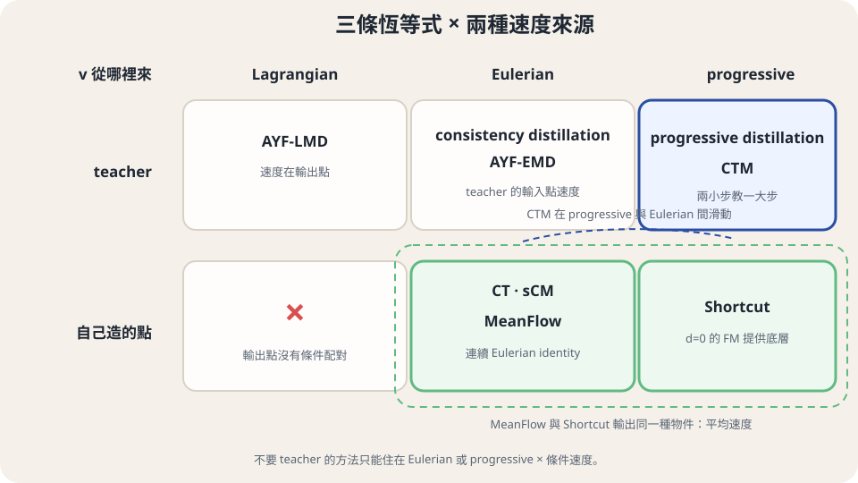

import Objectives from '../../../components/Objectives.astro';
import Prereq from '../../../components/Prereq.astro';
import QuizBlock from '../../../components/QuizBlock.astro';
import Option from '../../../components/Option.astro';
import Explanation from '../../../components/Explanation.astro';
import VizPlan from '../../../components/VizPlan.astro';
import Bridge from '../../../components/Bridge.astro';
import Remark from '../../../components/Remark.astro';
import Ref from '../../../components/Ref.astro';
import Question from '../../../components/Question.astro';
import Answer from '../../../components/Answer.astro';

# Shortcut 與 Align Your Flow：同一張表的其他格子

<Objectives>
- **寫出 Shortcut 的兩步合成條件。** 將它辨認成平均速度座標下的 progressive 恆等式，並說明 $d=0$ 如何接回 flow matching。
- **比較 Shortcut 與 MeanFlow。** 說出不用 JVP 換來的階梯式 bootstrapping 與誤差累積。
- **定位 AYF 與 CTM。** 判斷兩者使用哪一條恆等式、速度訊號又從哪裡來。
</Objectives>

<Prereq items={frontmatter.prereqs} />

## 同一個輸出，換一條恆等式

上一篇 MeanFlow 把網路輸出定成平均速度 $u(z,r,t)$，用 Eulerian 恆等式訓練。<Ref to="dma-flow-map-matching"/> 的表上還有第三條恆等式——progressive，兩小步等於一大步。**如果輸出一樣是平均速度，但改用 progressive 恆等式，會長什麼樣？** 那就是 Shortcut model。

## Shortcut：兩個 $d$ 步的平均等於一個 $2d$ 步

Shortcut model（Frans et al. [1]）的網路是 $s_\theta(x_t,t,d)$，第三個輸入是**步長** $d$：從 $x_t$ 往資料端跳 $d$ 這麼長的時間，落點是

$$
x_{t+d}=x_t+d\;s_\theta(x_t,t,d).
$$

對照上一篇的記號，$s(x,t,d)$ 就是 $u(x,\,r{=}t{+}d,\,t)$——同一個平均速度，只是第三個輸入從「目標時刻」換成「時間差」。

Progressive 恆等式說 $\psi_{t\to t+2d}=\psi_{t+d\to t+2d}\circ\psi_{t\to t+d}$。用平均速度寫：一大步的位移 $2d\cdot s(x_t,t,2d)$ 等於兩小步位移的和 $d\cdot s(x_t,t,d)+d\cdot s(x'_{t+d},t+d,d)$，其中 $x'_{t+d}=x_t+d\,s(x_t,t,d)$ 是走完第一小步的位置。兩邊除以 $2d$：

$$
\boxed{\;s(x_t,t,2d)=\tfrac12\Big[s(x_t,t,d)+s\big(x'_{t+d},\,t+d,\,d\big)\Big]\;}
$$

讀法很直白：**大步的平均速度，是兩個小步平均速度的平均。** 這條式子裡完全沒有 $v$——和 <Ref to="dma-flow-map-matching"/> 說的一樣，progressive 恆等式本身不含速度場，動力學要從最小的一步進來。Shortcut 的最小一步是 $d=0$：

$$
s(x_t,t,0)=v(x_t,t)\quad\Longrightarrow\quad \mathcal L_{d=0}=\big\|s_\theta(x_t,t,0)-(x_1-x_0)\big\|^2 ,
$$

就是 <Ref to="dma-conditional-flow-matching"/> 的 flow matching 損失，條件速度照用——這是 <Ref to="dma-denoising-regression"/> 的 **conditional trick**，而且這裡 $v$ 是被回歸的目標、不乘在任何含 $\theta$ 的東西上，所以沒有上一篇展開框裡那個陷阱。

訓練把兩種樣本混在一個 batch 裡：大部分（原文約四分之三）是 $d=0$ 的 FM 樣本，其餘是 self-consistency 樣本——抽一個 $d$，用網路自己算右邊、stop-gradient、當成 $s_\theta(x_t,t,2d)$ 的目標。步長取離散的網格 $d\in\{0,\tfrac1{128},\tfrac1{64},\dots,\tfrac12,1\}$，$t$ 也落在對應的格點上；每一級 $2d$ 的目標由 $d$ 那一級提供，資訊從 FM 底層一級一級往上 **bootstrap**。取樣時選一個 $d$，走 $1/d$ 步；$d=1$ 就是一步。

<iframe loading="lazy" src="/personal_website/notes/research_areas/diffusion-models-applications/week-9/w9-3-1.html" class="demo-frame" title="Shortcut bootstrap 階梯與誤差傳遞：互動 demo" style="height: 870px; width: 100%; border: none;"></iframe>

**互動 demo：Shortcut 的階梯。** 選取步長層級並注入底層誤差，看兩個半步如何教一個大步、誤差如何逐級上傳；MeanFlow 對照把離散階梯換成連續的 $(t,r)$ 區域。

## Shortcut 與 MeanFlow 並排

兩者輸出同一個物件，值得把差別說乾脆：

| | Shortcut | MeanFlow |
|---|---|---|
| 輸出 | 平均速度 $s(x,t,d)$ | 平均速度 $u(z,r,t)$ |
| 恆等式 | progressive（兩個 $d$ 步 = 一個 $2d$ 步） | Eulerian（$u=v-(t-r)\tfrac{du}{dt}$） |
| 動力學從哪進來 | $d=0$ 的 FM 樣本 | 每個樣本裡顯式的 $v$（條件速度） |
| 需要 JVP | 否，多一次前向算 $x'$ 處的 $s$ | 是，一次 JVP |
| 步長 | 離散網格、2 的冪 | 任意 $(r,t)$ |
| 誤差結構 | 沿階梯逐級累積（<Ref to="dma-progressive-distillation"/> 的累積換寫法） | 無階梯；$\tfrac{du}{dt}$ 的 bootstrapping |
| teacher | 否 | 否 |

兩者都不要 teacher，理由不同：Shortcut 是「progressive 配 FM 底層」，MeanFlow 是「Eulerian，$v$ 在輸入點」——正是 <Ref to="dma-flow-map-matching"/> 表上不要 teacher 的兩條路各一個代表。Shortcut 的階梯結構也讓 <Ref to="dma-error-theory"/> 的圖像換了一種樣子出現：底層 FM 的誤差不是被步數放大，而是被「級數」放大——$\log_2(1/d_{\min})$ 級。

<Remark label="符號" summary="這一篇的 u 與 s 各有兩個意思">
兩個字母都被兩種東西用到，判準都是「有沒有吃參數」：

- **$u(z,r,t)$** 是平均速度（<Ref to="dma-meanflow"/>）；**單獨的 $u$** 是 progressive 恆等式裡的中間時刻（<Ref to="dma-flow-map"/> 的符號補充）。
- **$s_\theta(x_t,t,d)$** 是 Shortcut 的網路（吃一個步長 $d$）；**單獨的 $s$** 是 flow map 的目標時刻（$\psi_{t\to s}$、$|s-t|$）。還有兩個也用 $s$：<Ref to="dma-cd-vs-ct"/> 的 teacher score $s_\phi$、以及下一篇的 score $s_\theta$（吃兩個輸入、不吃步長）。四個都靠**吃幾個輸入**分辨。

沿用原文寫法是刻意的——讀論文時不必再翻譯一次。
</Remark>

## Align Your Flow：distillation 設定下同時用兩條

前兩個方法都從頭訓練。若手上**有** teacher，<Ref to="dma-flow-map-matching"/> 的表多出一條可用的路：Lagrangian——$v$ 在輸出點，只有 teacher 能給。Align Your Flow（AYF，Sabour, Fidler & Kreis [2]）就在這個設定下，把 Eulerian 與 Lagrangian 兩條恆等式都寫成**連續時間**的 distillation 目標（原文稱 AYF-EMD 與 AYF-LMD），全導數同樣用 JVP 算，$v$ 一律由 teacher 提供。

AYF 明確指出 consistency model 是 flow map 把目標時刻釘在資料端的特例，並且**證明**（對 Gaussian 資料）存在一個次佳的 consistency model，使得步數變多之後 $W_2$ 反而上升——這就是 <Ref to="dma-multistep-limit"/> 說的「ODE 那個 $O(1/N)$ 的保證在多步 CM 上沒有」，而 AYF 把「沒有保證」補成了一個具體的反例。flow map 沒有這個問題，因為多步不需要回到資料端再加噪。另一個觀察是它不單押一條恆等式，而是把 EMD 與 LMD 搭配使用，並加上 tangent normalization 這類 <Ref to="dma-ict-scm"/> 談過的穩定手段。至於兩條各自在哪個區域比較不穩、為什麼要搭配，我沒有核對到原文的具體敘述，這裡只記結構——**要照著做之前，先讀原文 [2] 的實驗那一節**。此外 AYF 在蒸餾時對 teacher 用 autoguidance、在最後階段加 adversarial finetuning——這兩項屬於工程加料，放進表上時只記主線：**AYF = Eulerian + Lagrangian，連續時間，要 teacher。**

<Question id="Q1">
Shortcut 與 MeanFlow 都不用 teacher。但 MeanFlow 的恆等式對**任何**一對 $(r,t)$ 直接成立，Shortcut 卻要從 $d=0$ 一級一級 bootstrap 上來，還多付 $\log_2(1/d_{\min})$ 級的誤差放大。

**既然如此，Shortcut 還有什麼存在的理由？**

<Answer>
兩個，而且都不是「它比較早發表」。

**一、它不需要微分。** MeanFlow 的 identity 裡有一個沿軌跡的全導數 $\tfrac{d}{dt}u_\theta$，實作要 JVP、等於在訓練迴圈裡多一階微分。<Ref to="dma-ict-scm"/> 後半整節在談的 tangent normalization、tangent warmup、時間 embedding、double normalization——那一整套穩定手段，全部是為了付這一階微分的代價。Shortcut 的恆等式 $s(x,t,2d)=\tfrac12\big[s(x,t,d)+s(x',t+d,d)\big]$ 只有函數求值，沒有導數，所以那一整套都不需要。

**二、步長是網路的一個輸入，而且是離散的格點。** Shortcut 訓完之後，「我要走 8 步」就是取 $d=\tfrac18$ 呼叫 8 次，每一次都落在訓練時看過的格點上。MeanFlow 的 $(r,t)$ 是連續的，任意一對都能問，但也就沒有「這一對我練過」這件事。

**代價確實是 bootstrapping**，而它和 <Ref to="dma-progressive-distillation"/> 的逐輪減半是同一種代價換了位置：PD 把它攤在**訓練的輪次**上（每輪一個新模型），Shortcut 把它攤在**同一個網路的步長維度**上（一級一級往上填）。所以 <Ref to="dma-error-theory"/> 的誤差累積在這裡不是被步數放大，是被級數放大——級數只有 $\log_2(1/d_{\min})$，比步數少得多，這也是它還撐得住的原因。

一句話：**MeanFlow 用一階微分換掉 bootstrapping，Shortcut 用 bootstrapping 換掉一階微分。** 兩者都是 <Ref to="dma-flow-map-matching"/> 那張表上「不要 teacher」的合法走法。
</Answer>
</Question>

## 回頭看 CTM

<Ref to="dma-flow-map"/> 介紹 CTM 時已經寫出它的損失：$G_\theta(x_t,t\to s)\approx G_{\theta^-}(\tilde x_u,u\to s)$，$\tilde x_u$ 由 teacher 從 $t$ 解 ODE 到 $u$。現在有了三條恆等式的名字，可以確定它的格子：這是 **progressive 恆等式** $\psi_{t\to s}=\psi_{u\to s}\circ\psi_{t\to u}$，其中第一段 $\psi_{t\to u}$ 不是學生自己，而是 teacher 的 solver。所以 CTM 和 Shortcut 同一欄（progressive），差在底層：Shortcut 的底層是 FM 自己、逐級 bootstrap；CTM 的底層是 teacher、一次到位。而 $u$ 貼近 $t$ 的極限則滑向 Eulerian——這就是 soft consistency matching 的「soft」：它在 progressive 與 Eulerian 兩格之間連續移動。

另一個差別是輸出物件：CTM 的 $G_\theta$ 輸出**位置**，用 <Ref to="dma-consistency-function"/> 那套 $c_{\text{skip}}$、$c_{\text{out}}$ 參數化保證恆等條件；Shortcut 與 MeanFlow 輸出**平均速度**，恆等條件自動成立。這是兩種座標的選擇，不影響用哪條恆等式。

**圖：本單元方法的格子。** 不要 teacher 的方法只能落在 Eulerian 或 progressive × 條件速度；MeanFlow 與 Shortcut 輸出同一種平均速度，但訓練路線不同。

## 先消化一下

<QuizBlock id="w9-3-a">
Shortcut 的自我一致性 $s(x_t,t,2d)=\tfrac12[s(x_t,t,d)+s(x',t+d,d)]$ 裡的 $\tfrac12$ 來自：
<Option>兩個小步的位移各佔一半的權重是一個設計選擇。</Option>
<Option correct>兩小步位移相加 $d\,s+d\,s'$ 等於大步位移 $2d\,s_{2d}$，兩邊除以 $2d$。</Option>
<Option>Euler 法的二階修正。</Option>
<Explanation>
這是 progressive 恆等式在平均速度座標下的直接改寫，不是設計選擇也不是數值方法：位移是速度乘時間，兩段各 $d$、合起來 $2d$。若兩小步長度不等，權重就會變成各自的時間比例。
</Explanation>
</QuizBlock>

<QuizBlock id="w9-3-b">
Shortcut 為什麼一定要有 $d=0$ 的 flow matching 樣本？
<Option>為了讓網路學會恆等映射。</Option>
<Option>為了加速收斂。</Option>
<Option correct>因為 progressive 恆等式本身不含速度場，任何滿足半群的映射族都是它的解；$d=0$ 的 FM 損失是唯一把「我們那條 ODE」的資訊放進來的地方。</Option>
<Explanation>
<Ref to="dma-flow-map-matching"/> 的第三個小題：沒有底層的 progressive 損失連恆等映射都是最小值。恆等條件在平均速度座標下本來就自動成立，不需要學。
</Explanation>
</QuizBlock>

<QuizBlock id="w9-3-c">
Align Your Flow 能用 Lagrangian 恆等式，而 Shortcut 與 MeanFlow 不能。原因是：
<Option correct>Lagrangian 需要輸出點的速度，只有 teacher 能給；AYF 是 distillation 設定，Shortcut 與 MeanFlow 從頭訓練。</Option>
<Option>Lagrangian 需要 JVP，Shortcut 與 MeanFlow 沒有實作 JVP。</Option>
<Option>Lagrangian 只對 consistency model 有定義。</Option>
<Explanation>
判準還是「$v$ 在哪裡被需要」。MeanFlow 本來就用 JVP；Lagrangian 對任何 $\psi_{t\to s}$ 都有定義。差別純粹在有沒有 teacher 能在網路算出來的輸出點上給速度。
</Explanation>
</QuizBlock>

<QuizBlock id="w9-3-d">
CTM 的損失 $G_\theta(x_t,t\to s)\approx G_{\theta^-}(\tilde x_u,u\to s)$ 用的是哪條恆等式？
<Option>Lagrangian，因為它用了 teacher 的速度。</Option>
<Option correct>progressive，$\psi_{t\to s}=\psi_{u\to s}\circ\psi_{t\to u}$，第一段 $\psi_{t\to u}$ 交給 teacher 的 solver；$u\to t$ 時滑向 Eulerian。</Option>
<Option>Eulerian 的離散化，與 consistency distillation 完全相同。</Option>
<Explanation>
用了 teacher 不等於 Lagrangian——teacher 在這裡走的是輸入端的第一段路，不是給輸出點的速度。與 consistency distillation 的差別是 $u$ 可以離 $t$ 很遠、$s$ 可以不是資料端；$u$ 貼著 $t$ 且 $s$ 釘在資料端時才退回 CD。
</Explanation>
</QuizBlock>

<Bridge to="dma-distribution-matching">
MeanFlow、Shortcut、AYF 與 CTM 雖用不同恆等式，仍共享一個前提：學生輸出必須對準某個目標點。若同一輸入可能對到多個合理答案，MSE 只會取平均。<Ref to="dma-distribution-matching"/> 因此放棄逐點配對，只要求整體分佈相同。
</Bridge>

## 參考文獻

1. Frans, K., Hafner, D., Levine, S., Abbeel, P. [*One Step Diffusion via Shortcut Models.*](https://arxiv.org/abs/2410.12557) ICLR 2025.（步長輸入、self-consistency 目標、$d=0$ 的 FM 底層。）
2. Sabour, A., Fidler, S., Kreis, K. [*Align Your Flow: Scaling Continuous-Time Flow Map Distillation.*](https://arxiv.org/abs/2506.14603) 2025.（AYF-EMD 與 AYF-LMD；consistency model 隨步數退化的觀察。）
3. Kim, D. et al. [*Consistency Trajectory Models.*](https://arxiv.org/abs/2310.02279) ICLR 2024.
4. Geng, Z., Deng, M., Bai, X., Kolter, J. Z., He, K. [*Mean Flows for One-step Generative Modeling.*](https://arxiv.org/abs/2505.13447) 2025.
5. Boffi, N. M., Albergo, M. S., Vanden-Eijnden, E. [*Flow Map Matching.*](https://arxiv.org/abs/2406.07507) 2024.
