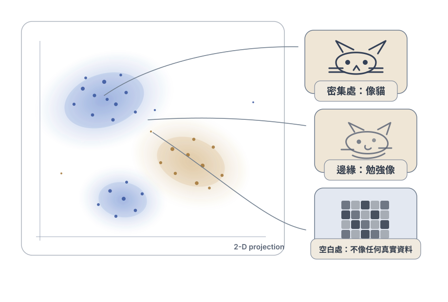

import Quiz from '../../components/Quiz.astro';

# 導論：把資料、分布、粒子串成一張圖

> 「From Noise to Data」系列的起點。這一篇不講任何方法，只做一件事：把之後每篇都會用到的三個詞——data、distribution、particle——接成同一張圖。看懂這張圖，後面每一篇都會有地方可以掛。

你打開一個生成模型，輸入一句話，幾秒後出現一張你從沒看過、卻意外合理的圖。它沒有從哪裡「抄」，卻又真的像那一類資料。這是怎麼「無中生有」的？要回答這個問題，得先把三個聽起來不太相干的詞接起來。先別急著看公式——這一篇只想讓你把畫面建立起來。

## 先換個角度：你手上其實只有一堆資料

一張圖、一段聲音、一個分子，攤平之後都只是**一長串數字**。一張 28×28 的灰階圖就是 784 個數字；一張彩色照片是「寬 × 高 × 3」個數字。先記住這件事：手上的每一筆 data，都能寫成一長串數字。

## 把資料放進一個空間

把那一長串數字的每一個，當成一根座標軸上的值，這筆資料就成了一組座標——也就是一個 **Euclidean space**（我們日常熟悉、有「遠近」和「距離」概念的那種空間）$\mathbb{R}^n$ 裡的**一個點**，其中 $n$ 就是數字的個數。

這個空間的「距離」是有意義的：兩張很像的貓照片會落在附近，貓和卡車則離得很遠。既然每一筆資料都是空間裡的一個點，我們之後乾脆把它當成一顆可以**移動**的點——一顆 **particle**。一整張圖＝一顆 particle（一個高維點），一群圖＝一團 particle 雲。用 2D 來畫只是為了看得見，真實維度高得多。

## 看不見的那一層：哪裡密、哪裡稀

把一大堆真實資料的點都丟進這個空間，它們不會均勻散開，而是**擠成幾團**。「像貓」的地方點很密，「不像貓」的地方幾乎沒有點。這個「哪裡密、哪裡稀」的規律，就是那個你看不見、卻真實存在的 **distribution**，記成 $p_{\text{data}}$。

**圖：哪裡密、哪裡稀。** 點擠成幾團（modes）的地方密度高，對應到「像真實資料」的樣本（清楚的貓）；團與團之間幾乎沒有點的空白處，對應到「不像任何真實資料」的東西（一團雜訊）。這張圖是**示意圖**，貓與雜訊都是手繪示意，不是模型實際輸出。

> 一句話：data 是你看得到的幾顆點，distribution 是這些點背後那一整團雲的**密度**——哪裡濃、哪裡淡。

生成模型真正想學的，不是把那幾顆點背起來，而是學會這團雲哪裡濃、哪裡淡——這樣它才能在「濃」的地方，產生**新的、沒看過、但合理**的點。（想分清「density」和「機率」？可以看 [機率密度是什麼](/personal_website/zh/notes/math-density-vs-probability)。）

## 把三個詞接成一句話

data（你有的點）、空間裡的 particle（把點當成會動的東西）、distribution（整團點的密度）——接起來就是整個系列的核心圖像：

> **生成 = 拿一團「容易做出來的點」，把它們慢慢搬動，直到整團的密度和 data 一樣。** 搬動 particle，就是在改變 distribution 的形狀。

那團「容易做出來的點」，慣例上用一團 **Gaussian noise**——你可以先把它當成「一團毫無結構、好製造的圓形點雲」。（為什麼起點偏偏挑 Gaussian？先當它是個方便的選擇就好；真正的理由牽涉到比較深的數學，留到願意深入時再談。）

下面的 demo 就是這張圖在動：拖時間 $t$，看一團圓形點雲被搬成不同的目標形狀。**但要提醒一件事**：這裡的目標形狀（月牙、螺旋那種）是我們**特意挑來、方便你看的**——真實資料活在好幾萬維的空間裡，分布的形狀根本沒辦法這樣畫出來，也不會長得這麼乾淨。這個 2D 例子唯一的目的，是讓「搬動一團點、改變整團密度」這件事**看得見**。

<iframe loading="lazy" src="/personal_website/notes/research_areas/noise-to-data/noise-to-data.html" class="demo-frame" title="Noise to Data 互動 demo" style="height: 760px; width: 100%; border: none;"></iframe>

## 同一件事，兩副鏡頭

之後你會看到兩種描述「怎麼搬」的講法，先知道有這兩副鏡頭就好：

- **搬運**：盯著 particle 在空間裡怎麼移動（這條系列主要用這一副）。
- **加噪 / 減噪**：先把乾淨資料弄髒成 noise，再學怎麼一步步修回來。

它們不是兩件事，是同一個過程的兩種看法——之後會交替使用。

## 先消化一下

<Quiz
  q="為什麼可以把一張圖說成是「高維空間裡的一個點」？"
  options={[
    { text: "因為圖片檔案夠小，塞得進座標系。", explain: "跟檔案大小無關。重點是『把數值當座標』這個視角，不是容量。" },
    { text: "因為同一類的圖長得都差不多，可以擠成一點。", explain: "不是。每張圖是各自一個點；它們是分開的點，只是會聚成一團。" },
    { text: "因為一張圖就是一長串像素數字，把這串數字當座標，它就對應到 ℝⁿ 裡的一個位置。", correct: true, explain: "正解。n = 像素數（×通道）。這個『樣本 = 空間中一點』的視角，是後面 particle、搬運、向量場全部的地基。" },
  ]}
/>

<Quiz
  q="生成模型從一團 noise 出發，它「無中生有」的資訊，其實來自哪裡？"
  options={[
    { text: "來自那團 noise——裡面其實偷偷藏了答案。", explain: "沒有。單一 noise 樣本不對應某張特定資料；它只提供隨機性與起點。" },
    { text: "來自模型學到的『怎麼搬』——noise 只負責隨機性與起點，結構是被搬出來的。", correct: true, explain: "正解。noise 像黏土，模型像那雙手；同一個模型每次抽不同 noise，就生出不同但合理的樣本。" },
    { text: "來自把訓練圖片直接存起來，再吐回去。", explain: "那是 memorization / 過擬合，不是學分布。好的模型要能產生沒看過的新點。" },
  ]}
/>

## 這條路會怎麼走

帶著這張圖，系列接下來會：先把「搬」的兩個視角講清楚（盯著一顆 particle 走，vs 在每個位置擺一支箭頭的向量場），再看「整條路」怎麼設計（probability path），然後看模型在每一步到底學什麼訊號（denoising、score、velocity），最後收成一句話——**這些訊號其實是同一件事的三種語言**。

- 想要更深、更數學的版本？每個觀念在 [Diffusion & Flow Models 課程](/personal_website/zh/notes/dfc-principles-course-map) 都有完整推導。
- 覺得缺一點數學工具（distribution、gradient、ODE…）？可以先去 [Math Intuitions](/personal_website/zh/notes/math-randomness-and-distribution) 補直覺，再回來。

## 下一步

下一篇 [生成模型其實在學什麼？](/personal_website/zh/notes/n2d-what-models-learn) 把上面「學的是分布、不是背樣本」這件事講清楚，並給你一組讀任何生成模型論文都能用的三個問題。
