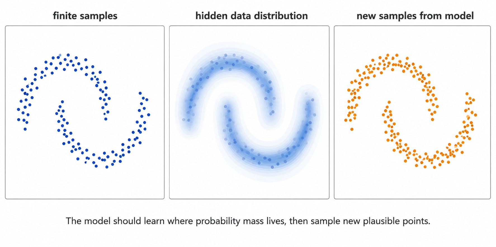

import Quiz from '../../components/Quiz.astro';

# 生成模型其實在學什麼？

> 承接 [導論](/personal_website/zh/notes/n2d-overview)。導論說生成模型學的是「分布」而不是背樣本；這一篇把這句話講精確——分布到底指什麼、它和判別式模型差在哪，以及讀任何生成論文都能用的三個問題。

你打開一個生成模型，輸入一句話，幾秒後螢幕上出現一張你從沒見過、卻意外合理的圖。它不是從你的資料庫裡撈出來的，但又確實「像」那類資料。這時很自然會冒出一個問題——它到底是從哪裡「知道」該長這樣的？

## 「學分布」到底是什麼意思？

導論已經給了畫面：data 是空間裡一團點，模型要學的是這團點的**密度**——哪裡濃、哪裡淡。但「學分布」這個說法，第一次認真看時還是很容易和「把訓練圖背起來再吐出來」混在一起。如果模型只是背圖，後面 diffusion、score、flow matching 的數學都會顯得莫名其妙；它們真正想回答的是——**能不能學到足夠的結構，自己產生新的、合理的樣本？**

## 先記這一句

> 生成模型在學「什麼樣的東西看起來像真實資料」，然後讓你能源源不絕地產生新的、合理的樣本。

不是複製訓練集，而是學會資料出現的規律：哪些區域常見、哪些罕見、哪些變化仍算同一種資料、哪些已經不像了。

## 用 two moons 看見它

想像平面上有一堆資料點，散布成兩個交錯的月牙形（two moons）。

一個**分類**模型問的是：給我一個點，它屬於哪個月牙？它在學一條把兩類分開的邊界。一個**生成**模型問的是完全不同的問題：我能不能自己造出新的點，讓它們也自然地落在這兩個月牙的形狀上？要做到這件事，模型必須掌握「點該出現在哪裡、以什麼密度出現」——也就是整個分布的結構，而不只是一條邊界。

**圖 1：樣本不是分布本身。** 左邊是有限訓練樣本；中間是我們真正想學、卻看不見的連續資料分布；右邊是模型產生的新樣本。好的生成模型不只是抽回原本的藍點，而是能在同一個高機率結構裡，產生新的合理點。

所以判別式與生成式的差異，不是「一個簡單、一個會畫圖」，而是它們問的問題不同：判別式直接學決策邊界；生成式關心資料本身的分布 $p(x)$，若有文字或類別等條件，則學條件分布 $p(x \mid c)$。重點不在「有沒有標籤」，而在模型是否要描述並取樣資料本身的分布。

## 把問題寫成數學

假設真實資料來自一個我們不知道、但能取樣的分布：

$$
x \sim p_{\text{data}}(x), \qquad x \in \mathbb{R}^n.
$$

我們手上只有有限樣本 $\{x^{(1)}, \dots, x^{(N)}\}$，看不到完整的 $p_{\text{data}}$。生成模型的任務，是建立一個由參數 $\theta$ 控制的模型分布 $p_\theta$，使它逼近真實分布，並且——這點同樣關鍵——能從中**有效率地取樣**：

$$
p_\theta(x) \approx p_{\text{data}}(x), \qquad x \sim p_\theta(x).
$$

這裡其實藏了兩個不同要求：**逼近分布**（捕捉哪裡機率高、哪裡低）與**能取樣**（提供一個實際程序產生新的 $x$）。不同生成模型家族的差別，很大一部分就在於它們怎麼平衡「明確描述密度」與「方便產生樣本」。

## 幾個容易想歪的地方

最關鍵的誤解，先用一題擋下來：

<Quiz
  q="一個生成模型如果能產生跟訓練圖片幾乎一樣的樣本，這代表它學得好嗎？"
  options={[
    { text: "代表學得好——越像訓練資料越好。", explain: "太像訓練資料反而可能是記憶或過擬合。樣本品質只是其中一個面向，還要看覆蓋率、多樣性等。" },
    { text: "只要單張樣本漂亮，就足以說明分布學對了。", explain: "不夠。模型可能漏掉某些模式（mode dropping），或在某些區域過度集中；單張漂亮不代表整個分布對。" },
    { text: "不一定。我們要的是學到分布結構、能產生「沒看過但合理」的新樣本；逐字複製反而是失敗模式。", correct: true, explain: "對。把機率質量全壓在那 N 個訓練點上，等於什麼都沒學到（還可能是 memorization 風險）。好的模型要能覆蓋整個高機率結構。" },
  ]}
/>

<Quiz
  q="判別式模型和生成式模型，最根本的差別在哪裡？"
  options={[
    { text: "差在生成式比較難訓練、比較吃算力。", explain: "訓練難度是工程現象，不是定義上的差別。" },
    { text: "差在它們問的問題不同：判別式學 p(y|x)（一條決策邊界），生成式學資料本身的分布 p(x)（或條件分布 p(x|c)）並能從中取樣。", correct: true, explain: "正解。分水嶺是『要不要描述並取樣資料的分布』，不在於有沒有標籤、誰比較難。" },
    { text: "差在生成式一定要用神經網路，判別式不用。", explain: "兩者都可以用或不用神經網路；關鍵是學的對象不同。" },
  ]}
/>

順帶幾個小提醒：「生成」**不等於「圖片生成」**——同一套分布與取樣語言，也用在音訊、分子構型、蛋白質結構、機器人軌跡上。把焦點放在「分布」而非「圖片」，你才看得出這些領域共享同一個核心問題。

## 這怎麼接到論文？

讀一篇新的生成模型論文時，先問三件事就好：

1. **表示**：它怎麼表示或間接描述 $p_\theta$？
2. **訓練**：它怎麼讓 $p_\theta$ 逼近 $p_{\text{data}}$？
3. **取樣**：它怎麼從簡單起點產生新樣本？

VAE、GAN、normalizing flow、diffusion、score-based models、flow matching——表面上是不同方法，骨子裡都在用各自的方式回答這三個問題。你不需要現在就記住每個家族的細節；帶著這三個問題讀下去，差異自然會浮現。

## 這篇先不談什麼

這篇不比較各家方法的優劣，也不推導 diffusion 或 flow matching 的訓練目標。我們先立好第一個觀念：**生成模型的對象是分布，取樣是它的核心任務。** 後面的 score、velocity、probability path，都是為了讓這件事更可學、可算、可實作。

## 下一步

我們已經把目標立好了：學一個分布、並從中取樣。但「取樣」這件事具體是怎麼發生的？下一篇 [跟著一顆粒子走](/personal_website/zh/notes/n2d-samples-as-particles) 把每個樣本看成空間裡一顆會移動的點，讓「生成」變成一個看得見的動態畫面——這也是整個系列共用的心像。

（你可能會問：那為什麼起點偏偏挑一團 Gaussian noise？這個問題的完整答案牽涉比較深的數學，收在 [Diffusion & Flow Models 課程](/personal_website/zh/notes/dfc-principles-course-map)。）

## 參考文獻

1. Kingma, D. P., Welling, M. *Auto-Encoding Variational Bayes.* 2013.
2. Goodfellow, I., et al. *Generative Adversarial Nets.* NeurIPS 2014.
3. Rezende, D. J., Mohamed, S. *Variational Inference with Normalizing Flows.* 2015.
4. Ho, J., Jain, A., Abbeel, P. *Denoising Diffusion Probabilistic Models.* NeurIPS 2020.
5. Song, Y., et al. *Score-Based Generative Modeling through Stochastic Differential Equations.* ICLR 2021.
6. Lipman, Y., et al. *Flow Matching for Generative Modeling.* ICLR 2023.