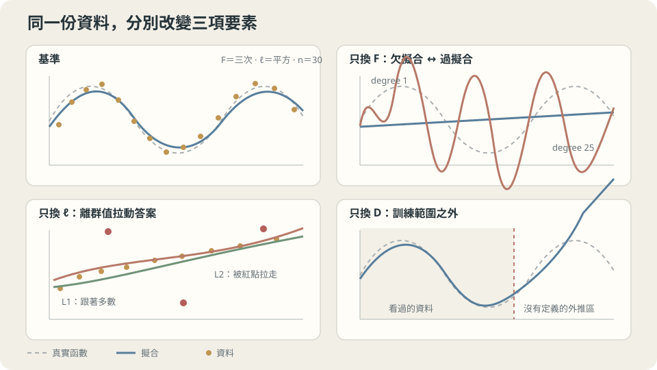

import Objectives from '../../../components/Objectives.astro';
import Ask from '../../../components/Ask.astro';
import Prereq from '../../../components/Prereq.astro';
import Question from '../../../components/Question.astro';
import Answer from '../../../components/Answer.astro';
import QuizBlock from '../../../components/QuizBlock.astro';
import Option from '../../../components/Option.astro';
import Explanation from '../../../components/Explanation.astro';
import VizPlan from '../../../components/VizPlan.astro';
import Remark from '../../../components/Remark.astro';
import Bridge from '../../../components/Bridge.astro';
import UsedBy from '../../../components/UsedBy.astro';
import Ref from '../../../components/Ref.astro';

# 房仲怎麼估價：從例子學規則

<Objectives>
- **把「從例子學規則」拆成三個可以獨立更換的零件——假設空間、損失、資料。** 說出更換每一個會改變什麼。
- **寫出經驗風險最小化（ERM）的式子，說出它與「真正想最小的東西」差在哪裡。** 把總誤差拆成 approximation、estimation、不可約三塊。
- **對「訓練誤差越低越好」這個直覺，判斷它在什麼條件下成立、什麼時候變成陷阱。** 在系列共用的 toy 上把陷阱跑出來。
</Objectives>

<Prereq items={frontmatter.prereqs} />

## 房仲為什麼能估價

一位資深房仲看過幾百間房子的成交價。你帶他去一間他沒看過的房子，他站三分鐘，說「大概 2,850 萬」。三週後成交 2,910 萬。

他做了什麼？他不是在背——這一間他沒看過。他也說不出一條公式（「每坪加多少、每老一年扣多少」），問他就是「感覺」。但他的感覺顯然帶著資訊：換一個沒看過房子的人來，誤差會大得多。

**你要把他的本領寫成程式。你必須先指定哪些東西？以及，「估得準」到底是什麼意思——準到什麼程度算成功？**

多數人的第一版答案是「拿歷史成交資料 fit 一個函數」。這句話不錯，但它把三個**可以分別更換**的決定壓成了一句話。代價在後面才出現：模型表現不好時，你不知道該加資料、換模型、還是換損失，因為你從來沒把它們分開過。

這一篇會把三個零件拆出來，寫出「學習」在對什麼求極值，並在共用 toy 上示範一件事：**經驗風險（訓練誤差）可以一路壓到接近零，而同一個模型在新資料上的誤差同時爆掉八千倍。**

> **「訓練誤差低」從來不是結論。**

<Ask>
從例子學規則，你必須先指定哪些東西？<br />
而「估得準」到底是哪一個數字小——<br />
它和你能算的那個數字是同一個嗎？
</Ask>

<Question id="Q1">
把上面那兩個問題翻成數學。你要指定哪三樣東西？「學」這個動作是在對什麼東西求極值？

<Answer>
最常被寫下來的答案是「最小化 $\sum_i (f(x_i)-y_i)^2$」。式子對，但它同時暗藏了三個決定，而且把「能算的」當成了「想要的」。

**要指定的三樣：**

1. **假設空間** $\mathcal F$：你允許的規則長什麼樣。只准直線？可以彎幾次？可以是深度網路？這是「候選答案的集合」。
2. **損失** $\ell(\hat y,y)$：單筆估錯要扣多少分。差 10 萬與差 100 萬之間的比例由你宣告，不是天生的（下一篇整篇在講這件事）。
3. **資料** $D=\{(x_i,y_i)\}_{i=1}^n$：他看過什麼。標準假設是這 $n$ 筆從某個聯合分佈 $p(x,y)$ 獨立同分佈抽出。

**「學」= 求極值。** 在 $\mathcal F$ 裡挑出讓資料上的平均損失最小的那個 $f$：

$$
\hat f=\arg\min_{f\in\mathcal F}\ \frac1n\sum_{i=1}^n \ell(f(x_i),y_i).
$$

**「估得準」不是這個數字。** 你想要的是**下一間**房子估得準——對還沒抽到的 $(X,Y)$ 取期望：$R(f)=\mathbb E[\ell(f(X),Y)]$。你能算的是資料上的平均，你想小的是期望。這兩個數字不同，整個系列的判斷力都建立在「它們差多少、什麼時候差很多」上面。
</Answer>
</Question>

## 三個設定，各自控制不同的東西

把三要素看成三項可以分開調整的選擇：

- **假設空間**是「你允許他考慮哪些答案」。允許得太少（只准直線），再多資料也估不準——彎的東西用直線描不出來。允許得太多（任意曲線），他可以完美穿過看過的每一點，卻對沒看過的點胡說。
- **損失**是「你怎麼替他扣分」。扣分方式一換，同一份資料的最佳答案就換一個位置——<Ref to="math-mse-conditional-expectation" mode="title"/> 那一篇已經把這件事釘死：平方誤差選條件平均，絕對誤差選中位數。
- **資料**是「他看過什麼」。看得少、或看的和考的不是同一種房子，前兩個設定調得再好也沒用。

這三個設定解釋了為什麼「模型不夠好」不是一個診斷。它至少有三種病因，處方完全不同，而且**互相不能替代**：資料太少不會因為換更大的模型而好轉。



**圖說：** 假設空間、損失與資料各自壞掉時，會留下不同的形狀；「模型不夠好」還不是診斷。

## 能算的那個數字，和想小的那個數字

固定損失 $\ell$ 與資料分佈 $p$。一個規則 $f$ 的**母體風險**（真正想小的）與**經驗風險**（能算的）分別是

$$
R(f)=\mathbb E_{(X,Y)\sim p}\big[\ell(f(X),Y)\big],
\qquad
\widehat R_n(f)=\frac1n\sum_{i=1}^n \ell(f(x_i),y_i).
$$

**ERM** 就是 $\hat f=\arg\min_{f\in\mathcal F}\widehat R_n(f)$。把最終成績拆開，令 $f^\star$ 是**所有**函數裡風險最小的那個（貝氏最佳），$f^\dagger=\arg\min_{f\in\mathcal F}R(f)$ 是假設空間內最好的：

$$
\underbrace{R(\hat f)-R(f^\star)}_{\text{可以怪你的部分}}
=\underbrace{\big[R(\hat f)-R(f^\dagger)\big]}_{\text{estimation error：資料有限}}
+\underbrace{\big[R(f^\dagger)-R(f^\star)\big]}_{\text{approximation error：空間不夠大}},
$$

再加上誰都消不掉的 $R(f^\star)$（不可約誤差）。三塊各對一個設定：**空間太小 → approximation 大；空間太大、資料太少 → estimation 大；噪聲本身 → 不可約。** 把 $\mathcal F$ 放大會壓低第二項、抬高第一項——這個對衝就是下一個 class 的主題。

平方損失下 $f^\star$ 是誰？<Ref to="math-mse-conditional-expectation"/> 的三行證明給了答案：$f^\star(x)=\mathbb E[Y\mid X=x]$，而剩下的 $R(f^\star)=\mathbb E[\mathrm{Var}(Y\mid X)]$ 就是不可約誤差。這個句子之後會反覆出現。

> **在平方損失下，「學習」有一個非常具體的目標：把條件平均這張表估出來。**

<Remark label="注意" summary="為什麼不直接把假設空間設成「所有函數」">
把 $\mathcal F$ 設成所有函數，ERM 有一個完美解：對看過的 $x_i$ 回答 $y_i$，其他地方隨便。它的經驗風險是 $0$，母體風險則和亂猜差不多。這不是理論上的怪例——下面的實作會看到 $d=n-1$ 的多項式正好是這種東西。

所以 $\mathcal F$ 的**限制性**不是缺點，是它唯一有用的地方：限制讓「在資料上表現好」這件事開始對「在新資料上表現好」有意義。統計學習理論用 VC 維、Rademacher 複雜度等量把這個直覺變成不等式（$R(\hat f)\le\widehat R_n(\hat f)+$ 某個隨 $\mathcal F$ 變大、隨 $n$ 變大而變小的項）。這一系列不走那條路，改用可以在自己資料上量出來的診斷工具，但腦中的圖是同一張。
</Remark>

## 房仲的三個零件各是什麼

**假設空間。** 他心裡不是「任意函數」，而是一個相當受限的家族：找幾間可比較的成交案例，再對坪數、樓層、屋齡、面向做加減。這個家族小到讓他幾百筆資料就夠用——**限制正是他能學會的原因**，不是他的極限。

**損失。** 他被市場用什麼方式扣分？如果客戶對「低估」（房子賤賣了）的痛苦遠大於「高估」（多等兩週），那他該報的就不是條件平均，而是一個偏高的分位數。他往往憑經驗做對了這件事卻說不出理由；下一篇會把它寫成式子。

**資料。** 他只看過某一區、某一段時間的房子。「新房子與看過的房子同分佈」這個假設，在換城市、換年份、換房型時就破了——那時前兩個設定調得再好都沒用。這是 <Ref to="ml-empirical-risk" mode="title"/> 的主題。

**這一切依賴什麼假設。** 一，$(x_i,y_i)$ 獨立同分佈，而且測試時面對的是同一個 $p$。二，$y$ 裡的隨機成分不可預測（否則它其實是你漏掉的特徵）。三，損失真的代表你在意的東西——不是因為它好微分。三個假設在真實專案裡都會壞，而且壞法各自有徵狀，這是接下來八篇的內容。

## 系列共用的 toy

這個系列所有實作都用同一組資料，這樣過擬合、資料切分、學習率、架構差異全部在**同一張圖**上被看見。存成 `ml_toy.py`：

```python
import numpy as np
NOISE = 0.15

def toy_1d(n=30, noise=NOISE, seed=0):        # 主 toy：一維回歸
    rng = np.random.default_rng(seed)
    x = np.sort(rng.uniform(0, 1, n))
    return x, np.sin(2*np.pi*x) + noise*rng.standard_normal(n)

def truth(m=400):                              # 密集網格上的真值，用來近似母體風險
    x = np.linspace(0, 1, m)
    return x, np.sin(2*np.pi*x)

def toy_2d(n=200, noise=0.20, seed=0):         # 副 toy：兩個交纏的月牙，二元分類
    rng = np.random.default_rng(seed)
    t = rng.uniform(0, np.pi, n//2)
    X = np.r_[np.c_[np.cos(t), np.sin(t)], np.c_[1-np.cos(t), 0.4-np.sin(t)]]
    X = X + noise*rng.standard_normal((n, 2))
    return X, np.r_[np.zeros(n//2), np.ones(n//2)].astype(int)
```

真實函數是 $\sin(2\pi x)$，噪聲是標準差 $0.15$ 的 Gaussian——所以**不可約誤差正好是 $0.15^2=0.0225$**，任何模型的母體風險都不可能低於它。這個已知的下界之後會一直當作參考線。

現在做 ERM：假設空間是「次數 $\le d$ 的多項式」，損失是平方，資料是那 30 個點。

```python
import numpy as np
from numpy.polynomial import Polynomial          # 比 np.polyfit 穩定：內部把 x 縮放到 [-1,1]
from ml_toy import toy_1d, truth, NOISE

x, y = toy_1d()                                   # n = 30
xs, ys = truth()
for d in (1, 3, 9, 25):
    f = Polynomial.fit(x, y, d)                   # ERM：這個空間裡經驗風險最小的那個
    print(f"degree {d:2d}  經驗風險 {((f(x)-y)**2).mean():.4f}"
          f"   母體風險 ≈ {((f(xs)-ys)**2).mean() + NOISE**2:.4f}")
```

```
degree  1  經驗風險 0.2118   母體風險 ≈ 0.2679
degree  3  經驗風險 0.0178   母體風險 ≈ 0.0312
degree  9  經驗風險 0.0122   母體風險 ≈ 0.0285
degree 25  經驗風險 0.0016   母體風險 ≈ 8032.3199
```

讀這四行：**經驗風險單調下降，母體風險先降後爆。** $d=1$ 是 approximation error 主導（直線描不出正弦，兩個風險都大且接近）；$d=3$ 到 $9$ 已經逼近不可約誤差 $0.0225$，多出來的一點是 estimation error；$d=25$ 的經驗風險只有 $0.0016$——**比噪聲的變異數還小，這本身就是警訊**，它已經在擬合噪聲——而母體風險是 $8032$。

把空間放大到和資料一樣大，退化得更徹底：

```python
f = Polynomial.fit(x, y, len(x)-1)                # d = n-1 = 29：剛好能穿過每一個點
print(f"degree 29  經驗風險 {((f(x)-y)**2).mean():.2e}"
      f"   母體風險 ≈ {((f(xs)-ys)**2).mean()+NOISE**2:.2e}")
# degree 29  經驗風險 4.28e-04   母體風險 ≈ 1.52e+09
```

這是**刻意違反**「$\mathcal F$ 要有限制」的結果：經驗風險小到 $10^{-4}$，母體風險 $1.5\times10^9$。同一個 `print` 裡的兩個數字差了十三個數量級，而只有左邊那個是你在訓練時看得到的。房仲版本的翻譯是：**一個把每筆成交價背下來、對沒看過的房子就開始亂編的人，在「回答考古題」這個指標上是滿分。**

## 調整三項要素，看兩條風險怎麼分開

<iframe loading="lazy" src="/personal_website/notes/research_areas/machine-learning-foundations/l0-learning-as-fitting/l0-0-2.html" class="demo-frame" title="調整三項要素，看兩條風險怎麼分開：互動 demo" style="height: 827px; width: 100%; border: none;"></iframe>

**互動 demo：拉「樣本數 n」看兩條曲線分開多少，拉「模型複雜度」看它們往相反方向走。**

## 檢查理解

<QuizBlock id="ml-l0-0-a">
一個團隊的模型在訓練集上 MSE 是 $0.001$、在驗證集上是 $0.9$。他們決定「換更大的模型」。這個決定：
<Option>合理，更大的模型表達力更強，驗證誤差會下降。</Option>
<Option correct>方向反了。這是 estimation error 主導的徵狀（空間相對於資料太大），更大的模型會讓它更嚴重；該做的是縮小 $\mathcal F$、加資料，或加限制。</Option>
<Option>看不出來，要先換損失函數才知道。</Option>
<Explanation>
訓練誤差極低而泛化誤差極高，正是「在資料上表現好」已經和「在新資料上表現好」脫鉤的樣子——$\mathcal F$ 太大、$n$ 太小。approximation error 大的徵狀長得完全不同：**兩個誤差都大而且接近**（像上面的 $d=1$）。這兩種徵狀對應相反的處方，混淆它們是實務上最貴的錯誤之一。
</Explanation>
</QuizBlock>

<QuizBlock id="ml-l0-0-b">
在 toy 上把噪聲標準差設成 $0$（$y$ 就是 $\sin(2\pi x)$，沒有隨機成分），然後用 $d=25$ 擬合 30 個點。會發生什麼？
<Option>不會過擬合了——沒有噪聲就沒有東西可以過擬合。</Option>
<Option correct>仍然可能過擬合：$30$ 個點無法決定一個 25 次多項式在點與點之間怎麼走，模型在區間內部與邊緣仍會震盪。不可約誤差變成 $0$，但 estimation error 不會。</Option>
<Option>經驗風險與母體風險會相等。</Option>
<Explanation>
過擬合常被解釋成「學到了噪聲」，這只是它最常見的來源，不是定義。真正的來源是**資料沒有把 $\mathcal F$ 裡的候選者區分開**：有很多個 $f$ 在這 30 個點上一樣好，ERM 沒有理由挑到對的那個。噪聲讓這件事更嚴重，但拿掉噪聲不會讓它消失。互動 demo 的第二個觀察點就是給這題用的。
</Explanation>
</QuizBlock>

<QuizBlock id="ml-l0-0-c">
「經驗風險 $0.0016$ 比噪聲變異數 $0.0225$ 還小」為什麼是警訊？
<Option>因為程式一定有 bug。</Option>
<Option>因為 MSE 不可能小於變異數。</Option>
<Option correct>因為在訓練點上做得比不可約誤差還好，只能靠把噪聲本身也擬合進去。任何**新的**點都沒有這個好處，所以母體風險必然高於 $0.0225$——而且通常高很多。</Option>
<Explanation>
不可約誤差 $\mathbb E[\mathrm{Var}(Y\mid X)]$ 是**母體**風險的下界，不是經驗風險的下界：模型看得到訓練點的 $y_i$，把那一筆的噪聲也記下來就能壓低訓練誤差。所以「訓練誤差 < 噪聲水準」是一個可以在自己專案裡直接用的紅燈——前提是你對噪聲水準有一個量級上的估計。
</Explanation>
</QuizBlock>

<UsedBy slug={frontmatter.slug} />

<Bridge to="ml-loss-declaration">
三個零件裡，最常被當成「預設值」而從不檢查的是**損失**。多數人直接寫 MSE，然後才發現模型學到的東西不是自己要的。接著把損失當成一個要主動宣告的決定：差 1 度與差 10 度的相對嚴重程度一旦寫下，最佳答案落在哪裡就被決定了——均值、中位數、還是某個分位數。
</Bridge>

## 參考文獻

1. Hastie, T., Tibshirani, R., Friedman, J. [*The Elements of Statistical Learning*](https://hastie.su.domains/ElemStatLearn/), 2nd ed. Springer 2009, Ch. 2, 7.1–7.3.（監督式學習的框架、風險分解、模型複雜度與誤差的關係。）
2. Shalev-Shwartz, S., Ben-David, S. [*Understanding Machine Learning: From Theory to Algorithms*](https://www.cs.huji.ac.il/~shais/UnderstandingMachineLearning/) Cambridge University Press 2014, Ch. 2–5.（ERM 的形式化、為什麼需要限制假設空間、approximation–estimation 分解。）
3. Vapnik, V. *The Nature of Statistical Learning Theory*, 2nd ed. Springer 2000.（把「限制假設空間才能學習」變成定量陳述的原始路線。）
