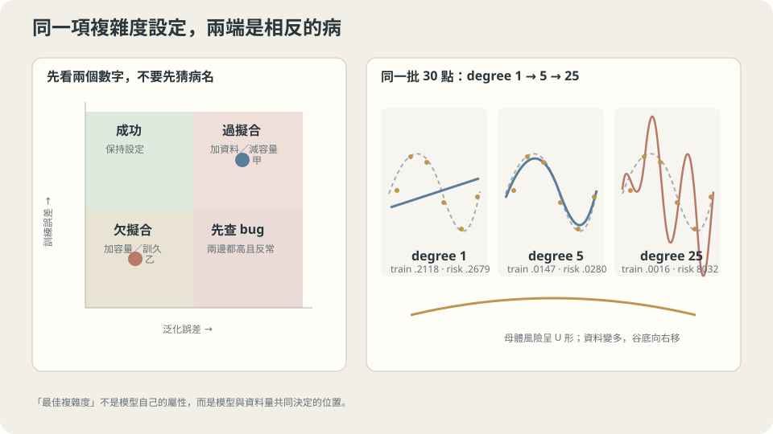

import Objectives from '../../../components/Objectives.astro';
import Ask from '../../../components/Ask.astro';
import Prereq from '../../../components/Prereq.astro';
import Question from '../../../components/Question.astro';
import Answer from '../../../components/Answer.astro';
import QuizBlock from '../../../components/QuizBlock.astro';
import Option from '../../../components/Option.astro';
import Explanation from '../../../components/Explanation.astro';
import VizPlan from '../../../components/VizPlan.astro';
import Remark from '../../../components/Remark.astro';
import Bridge from '../../../components/Bridge.astro';
import UsedBy from '../../../components/UsedBy.astro';
import Ref from '../../../components/Ref.astro';

# 背考古題的學生：過擬合與欠擬合

<Objectives>
- **用訓練誤差與泛化誤差兩個軸把模型的狀態分成四格。** 說出哪一格不會發生、以及另外三格各自的處方。
- **說出「模型太複雜」不是一個絕對判斷。** 用同一份 toy 在兩種資料量下把這句話證明出來。
- **判斷一個停在正值不動的訓練誤差是不是問題。** 說出要拿什麼數字來比。
</Objectives>

<Prereq items={frontmatter.prereqs} />

## 兩個都考不好的學生

期中考結束，兩個學生都考 40 分。

**甲**把過去五年的考古題全部背下來，每一題的答案、每一個數字都記得。模擬考（考古題原題）滿分。正式考換了數字，他不會。

**乙**只讀了課本的前半，讀得很認真。模擬考也只有 45 分，正式考 40 分。

同樣的成績，但**病因相反**。甲的問題是他學到的東西不是「規則」而是「這幾份考卷」；再給他十份考古題背，他還是不會新題。乙的問題是他沒學夠；再給他十份考古題，他真的會進步。

**如果你只看正式考的分數，你分不出他們。** 你需要第二個數字——模擬考的分數。甲是 100/40，乙是 45/40。

訓練誤差（模擬考）與泛化誤差（正式考）的**組合**才構成診斷。

> **診斷要兩個數字，不是一個。**

這一篇要把四種組合列完、指出哪一種不會發生、並在共用 toy 上把兩種病都做出來。

<Ask>
兩個學生都考 40 分，<br />
你怎麼知道誰在背答案、誰只是沒讀完？<br />
「模型太複雜」這句話要拿什麼來判斷？
</Ask>

<Question id="Q1">
把「背」與「學到規則」翻成數學。兩個誤差構成四種組合，把它們列出來——哪一格對應甲、哪一格對應乙、哪一格是成功、哪一格幾乎不可能？各自的處方是什麼？

<Answer>
**兩個數字**（沿用 <Ref to="ml-empirical-risk" mode="title"/>）：訓練誤差 $\widehat R_n(\hat f)$ 與母體風險 $R(\hat f)$。「背」是 $\widehat R_n$ 很小而 $R$ 很大；「沒學夠」是兩個都大。

| | $R$ 小 | $R$ 大 |
|---|---|---|
| $\widehat R_n$ 小 | **成功** | **過擬合**（甲）：縮小 $\mathcal F$、加資料、加正則化 |
| $\widehat R_n$ 大 | **幾乎不可能** | **欠擬合**（乙）：放大 $\mathcal F$、加特徵、訓久一點 |

左下角「訓練誤差大但泛化誤差小」為什麼幾乎不可能？因為訓練集本身就是從同一個分佈抽的——在它上面做得差，卻在整體上做得好，需要運氣好到訓練集剛好是最難的那一批。**看到這一格，先懷疑程式**：資料切錯邊、測試集比訓練集容易、訓練時開了 dropout 而評估時沒關、或者訓練誤差算的是還在跑的移動平均。

**兩個處方彼此相反**，這是為什麼診斷不能跳過：對甲用乙的處方（加大模型）會讓他更會背；對乙用甲的處方（加正則化）會讓他讀得更少。
</Answer>
</Question>

## 一個設定，兩種失敗

把「假設空間有多大」做成一個可以連續調整的設定——多項式的次數、樹的深度、網路的寬度、正則化強度的倒數。往兩端轉，會遇到兩種相反的失敗：

- **轉太小（欠擬合）**：$\mathcal F$ 裡沒有一個函數接近真相。這時兩個誤差都大**而且互相接近**——模型在訓練集上就已經做不好，沒有「偷背」的空間。這對應 L0 的 approximation error。
- **轉太大（過擬合）**：$\mathcal F$ 裡有太多函數在這 $n$ 個點上一樣好，而資料沒有辦法把它們分開。訓練誤差可以壓到接近零，母體風險卻在上升。這對應 estimation error。

中間某處有一個最佳點。**但這個點不是模型的性質，是「模型與資料量」這一對的性質**——設定的最佳位置隨 $n$ 移動。這是本篇最重要的一句話，因為它決定了你聽到「這個模型太複雜」時該問的下一個問題：**相對於多少資料？**



**圖說：** 同一個容量設定的兩端是欠擬合與過擬合；最佳位置同時取決於模型與資料量。

## U 形是怎麼來的，以及它為什麼會移動

固定資料量 $n$，讓假設空間沿著一條巢狀的鏈成長 $\mathcal F_1\subset\mathcal F_2\subset\dots$（次數 $\le d$ 的多項式正是這樣一條鏈）。兩條曲線的方向是可以先驗證明的：

- **訓練誤差對 $d$ 單調不增。** 因為 $\mathcal F_d\subset\mathcal F_{d+1}$，在更大的集合裡取 $\min$ 不可能更大。**這條曲線永遠往下，所以它自己不含任何關於泛化的資訊。**
- **母體風險 = approximation + estimation**。前者隨 $d$ 單調不增（空間變大，最好的候選只會更好），後者隨 $d$ 增加（可挑的候選變多，挑選帶來的樂觀變大）。一減一增，得到 U 形。

U 形的谷底在兩者的邊際變化相抵之處。把 $n$ 加大，estimation 那一項整體壓低（<Ref to="ml-empirical-risk"/> 的界裡它以 $\sqrt{\log|\mathcal F|/n}$ 的形式出現），**於是谷底往右移、而且整條 U 變平**。

順帶一提，這條 U 只描述「容量還沒超過資料量」的那一段。把容量繼續往上推到遠遠超過 $n$，測試誤差會先在插值點附近衝高、然後**再次下降**——這個現象叫 **double descent**（參考文獻 2），也是現代大模型所處的位置。本篇的 $d\le25$、$n=30$ 還在古典的那一段。

平方損失下這條 U 有一個絕對的地板：<Ref to="math-mse-conditional-expectation" mode="title"/> 說最好的可能是 $f^\star=\mathbb E[Y\mid X]$，而 $R(f^\star)=\mathbb E[\mathrm{Var}(Y\mid X)]$ 是不可約誤差。共用 toy 裡它正好是 $0.15^2=0.0225$。**這個數字是讀懂訓練曲線的參考線**——下一節會用到。

<Remark label="注意" summary="「訓練誤差降不下去」什麼時候不是問題">
一個常見的焦慮：訓練 loss 掉到某個正值就不動了，是不是模型不夠好、是不是該加層？

要回答，得先問：**那個正值和不可約誤差比起來如何？** 如果你的目標裡有一個不可預測的成分（標籤噪聲、感測器誤差、本質隨機的結果），那麼**任何**模型的損失都不可能低於 $\mathbb E[\mathrm{Var}(Y\mid X)]$。停在那個水準是**成功**，不是失敗；繼續把它往下壓，只能靠記住訓練集裡那一筆的噪聲——也就是過擬合。

所以診斷需要一個對不可約誤差的估計。取得方式：同一個輸入重複量測看散佈多大、人類專家在同一份資料上的一致性、或者（像這個 toy 一樣）你自己造資料時就知道答案。**沒有這個參考線，「loss 停在 0.3」既不能說好也不能說壞。** 這個判斷在任何有噪聲的回歸任務上都會反覆用到。
</Remark>

## 兩個學生的處方，與一個容易搞錯的方向

**甲（過擬合）。** 處方有三類，都在做同一件事——**讓資料相對於假設空間變多**：縮小 $\mathcal F$（降次數、減層、剪枝）、加資料（或資料增強）、加限制（正則化、提早停止，見 <Ref to="ml-regularization" mode="title"/>）。

**乙（欠擬合）。** 處方是相反方向：放大 $\mathcal F$、加更有資訊的特徵、訓練更久或更好（有時「欠擬合」其實是最佳化沒收斂——<Ref to="ml-gradient-descent" mode="title"/> 裡 $\eta=0.01$ 跑 2000 步的結果就是一個假的欠擬合）。

**最常見的誤判**是把「最佳化沒跑完」讀成「模型不夠大」。兩者的訓練誤差都高，但一個加大模型會更慢、更難訓，另一個才真的需要容量。分辨方法很直接：**先確認在一小批資料上能不能過擬合。** 拿 50 筆資料訓到訓練誤差接近零——做得到，表示容量與最佳化都沒問題，真正的問題在資料或正則化；做不到，問題在最佳化或架構。這是一個五分鐘的實驗，卻能擋掉很多天的猜測。

**這一切依賴什麼。** 一，用來當「泛化誤差」的那個數字必須來自沒被拿去挑選過的資料——這正是下一篇的主題。二，訓練與評估同分佈；否則你看到的是偏移，不是過擬合（<Ref to="ml-empirical-risk"/> 已經處理過這個鑑別診斷）。三，「複雜度」沿著一條巢狀的鏈成長；換架構、換演算法時兩個模型不可比，U 形的圖像不適用。

## 把 U 形跑出來，再把它攤平

共用 toy，$n=30$，多項式次數從 $0$ 掃到 $25$：

```python
import numpy as np, warnings; warnings.filterwarnings("ignore")
from numpy.polynomial import Polynomial
from ml_toy import toy_1d, truth, NOISE

xs, ys = truth()
risk = lambda f: ((f(xs) - ys)**2).mean() + NOISE**2      # 母體風險（近似）
x, y = toy_1d()                                            # n = 30
for d in (0, 1, 2, 3, 5, 7, 9, 12, 15, 20, 25):
    f = Polynomial.fit(x, y, d)
    print(f"  degree {d:2d}   訓練 {((f(x) - y)**2).mean():8.4f}   母體風險 {risk(f):12.4f}")
```

```
  degree  0   訓練   0.3897   母體風險       0.5575
  degree  1   訓練   0.2118   母體風險       0.2679
  degree  2   訓練   0.2117   母體風險       0.2668
  degree  3   訓練   0.0178   母體風險       0.0312
  degree  5   訓練   0.0147   母體風險       0.0280
  degree  7   訓練   0.0134   母體風險       0.0296
  degree  9   訓練   0.0122   母體風險       0.0285
  degree 12   訓練   0.0114   母體風險       0.0314
  degree 15   訓練   0.0104   母體風險       0.0334
  degree 20   訓練   0.0043   母體風險       0.0659
  degree 25   訓練   0.0016   母體風險    8032.3199
```

**左欄單調下降，右欄是 U 形**，谷底在 $d=5$（$0.0280$，距離不可約誤差 $0.0225$ 只差一點點）。$d\le2$ 是乙：兩欄都大而且接近（$0.2118$ 對 $0.2679$），這是欠擬合的簽名——**兩個數字的比值接近 1**。$d\ge20$ 是甲：訓練誤差 $0.0043$ 已經低於噪聲水準 $0.0225$，母體風險開始跳，到 $d=25$ 完全失控。

注意 $d=1$ 到 $d=2$ 幾乎沒有進步（$0.2118\to0.2117$）。這也有意義：$\sin(2\pi x)$ 在 $[0,1]$ 上大致對稱，二次項幫不上忙，要到三次才抓得到形狀。**「加容量沒有用」有時是加錯了方向的容量。**

**同一個設定，換一個資料量。** 把 $n$ 從 30 加到 300，其他完全不動：

```python
x3, y3 = toy_1d(n=300, seed=1)
for d in (1, 3, 9, 15, 20, 25):
    f = Polynomial.fit(x3, y3, d)
    print(f"  degree {d:2d}   訓練 {((f(x3) - y3)**2).mean():8.4f}   母體風險 {risk(f):10.4f}")
```

```
  degree  1   訓練   0.2106   母體風險     0.2207
  degree  3   訓練   0.0266   母體風險     0.0277
  degree  9   訓練   0.0198   母體風險     0.0242
  degree 15   訓練   0.0197   母體風險     0.0243
  degree 20   訓練   0.0196   母體風險     0.0244
  degree 25   訓練   0.0194   母體風險     0.0283
```

**U 形不見了。** $d=25$ 在 $n=30$ 時是 $8032$，在 $n=300$ 時是 $0.0283$——同一個模型、同一個設定位置，從災難變成幾乎最佳。而且從 $d=9$ 到 $d=20$，母體風險穩定停在 $0.024$ 附近，緊貼不可約誤差 $0.0225$：**多出來的容量沒有造成傷害。**

這推翻了一個非常普遍的說法：「25 次多項式太複雜了。」同一句話的正確版本是「25 次多項式相對於 30 筆資料太複雜」。

> **複雜度沒有絕對的刻度，它只相對於資料量存在。**

這也是為什麼現代的大模型能 work：不是因為誰推翻了統計學，而是因為 $n$ 大了很多個數量級。

**刻意違反：把噪聲關掉。** 若把 `NOISE` 設為 $0$，不可約誤差變成 $0$，但 $n=30$、$d=25$ **仍然**會過擬合——30 個點無法決定一個 25 次多項式在點與點之間怎麼走。這再次說明：過擬合的來源是「資料無法區分空間裡的候選者」，噪聲只是最常見的加劇因子，不是定義。

## 調整設定，看 U 形怎麼隨資料量移動

<iframe loading="lazy" src="/personal_website/notes/research_areas/machine-learning-foundations/l1-generalization/l1-0-2.html" class="demo-frame" title="調整設定，看 U 形怎麼隨資料量移動：互動 demo" style="height: 823px; width: 100%; border: none;"></iframe>

**互動 demo：拉資料量，U 形的谷底往右移——「最佳複雜度」不是模型的性質，是資料量的函數。**

## 檢查理解

<QuizBlock id="ml-l1-0-a">
一個模型訓練誤差 $0.21$、驗證誤差 $0.22$，而你知道這個任務的標籤噪聲水準大約是 $0.02$。最合適的下一步是：
<Option correct>當作欠擬合處理：兩個誤差接近且都遠高於噪聲水準，表示 $\mathcal F$ 裡沒有夠好的候選（或最佳化沒收斂）。先做「小資料過擬合測試」分辨是容量問題還是最佳化問題。</Option>
<Option>當作過擬合處理：加正則化與 dropout。</Option>
<Option>資料不夠，先去蒐集更多資料。</Option>
<Explanation>
欠擬合的簽名是**兩個誤差接近且都高**——模型在訓練集上就已經做不好，沒有偷背。加正則化會讓它更差；加資料也幫不上忙（$d=1$ 那一列在 $n=30$ 與 $n=300$ 下幾乎一樣：$0.2679$ 與 $0.2207$）。這一格唯一有效的方向是放大容量或修好最佳化，而「小資料過擬合測試」是分辨兩者最快的方法。
</Explanation>
</QuizBlock>

<QuizBlock id="ml-l1-0-b">
同事說「我們的 25 次多項式太複雜了，一定會過擬合」。根據本篇的兩張表，最準確的回應是：
<Option>同意，25 次一定過擬合。</Option>
<Option correct>不完整。$d=25$ 在 $n=30$ 時母體風險是 $8032$，在 $n=300$ 時是 $0.0283$（幾乎最佳）。複雜度沒有絕對刻度，該問的是「相對於多少資料」；而且該用留出資料去量，不是用直覺去判。</Option>
<Option>不同意，越複雜的模型永遠越好。</Option>
<Explanation>
這題在練習把「模型複雜度」這個常見的名詞從絕對量改成相對量。實務上的形式是：同一個架構在 1 萬筆與 1 億筆資料上是兩個完全不同的問題，該調的設定、該擔心的病都不一樣。順帶一提，$n=300$ 那張表裡 $d=9$ 到 $20$ 全部停在 $0.024$，示範了「多餘容量在資料充足時可以是無害的」——現代深度學習大量依賴這個區域。
</Explanation>
</QuizBlock>

<QuizBlock id="ml-l1-0-c">
在 $n=30$ 那張表裡，$d=20$ 的訓練誤差是 $0.0043$，而不可約誤差是 $0.0225$。這個比較說明：
<Option>模型表現優異，超越了理論下界。</Option>
<Option correct>模型正在擬合訓練點上的噪聲。不可約誤差是**母體**風險的下界，不是訓練誤差的下界——模型看得到訓練點的 $y_i$，記住那一筆的噪聲就能把訓練誤差壓到下界之下。這是一個可以直接使用的紅燈。</Option>
<Option>不可約誤差的估計值一定算錯了。</Option>
<Explanation>
「訓練誤差低於噪聲水準」是實務上少數不需要留出集就能看出的過擬合徵狀，前提是你對噪聲水準有量級上的估計。它的另一面同樣有用：訓練誤差**卡在**噪聲水準附近不動，是成功的樣子，不是需要修的問題——這個判斷在任何標籤有噪聲的任務上都會反覆用到。
</Explanation>
</QuizBlock>

<UsedBy slug={frontmatter.slug} />

<Bridge to="ml-bias-variance">
但「過擬合」目前還是一個定性的說法。接著把母體風險真正拆開成三塊可以分別測量的量：**bias²、variance、不可約誤差**。拆完之後，U 形的兩側各自對應哪一塊、加資料為什麼只壓得到其中一塊、以及為什麼「十個房仲各看不同的一百間房」是理解 variance 最好的圖像，都會變得具體。
</Bridge>

## 參考文獻

1. Hastie, T., Tibshirani, R., Friedman, J. [*The Elements of Statistical Learning*](https://hastie.su.domains/ElemStatLearn/), 2nd ed. Springer 2009, Ch. 7.（訓練誤差為何樂觀、模型複雜度與測試誤差的 U 形、樂觀量的估計。）
2. Belkin, M. et al. [*Reconciling modern machine-learning practice and the classical bias–variance trade-off.*](https://doi.org/10.1073/pnas.1903070116) PNAS 2019.（把容量繼續往上推會發生什麼：double descent，以及古典 U 形適用的範圍。）
3. Ng, A. [*Machine Learning Yearning*](https://info.deeplearning.ai/machine-learning-yearning-book) 2018, Ch. 20–27.（把兩個誤差的組合當成日常診斷流程的實務版本，含「小資料過擬合測試」。）
