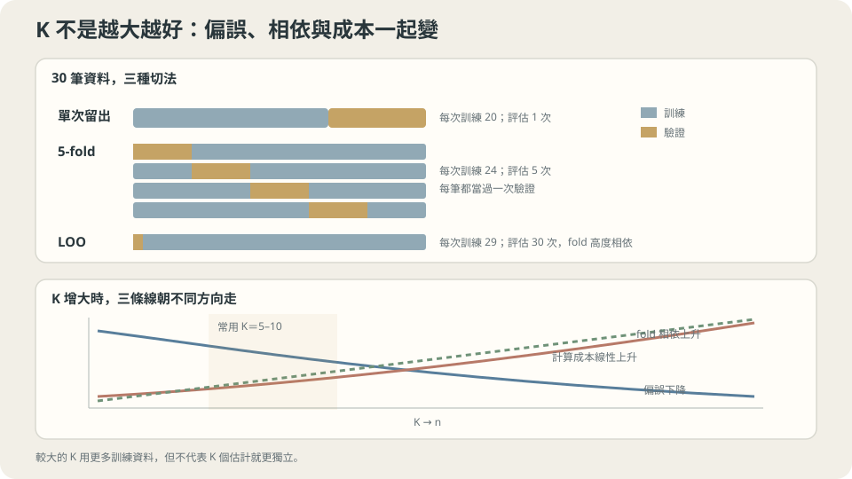

import Objectives from '../../../components/Objectives.astro';
import Ask from '../../../components/Ask.astro';
import Prereq from '../../../components/Prereq.astro';
import Question from '../../../components/Question.astro';
import Answer from '../../../components/Answer.astro';
import QuizBlock from '../../../components/QuizBlock.astro';
import Option from '../../../components/Option.astro';
import Explanation from '../../../components/Explanation.astro';
import VizPlan from '../../../components/VizPlan.astro';
import Remark from '../../../components/Remark.astro';
import Bridge from '../../../components/Bridge.astro';
import UsedBy from '../../../components/UsedBy.astro';
import Ref from '../../../components/Ref.astro';

# 只有三十筆資料：交叉驗證

<Objectives>
- **說出交叉驗證在估什麼、為什麼它比單次留出穩。** 在共用 toy 上量出穩多少。
- **說出 $K$ 這個設定的兩端各自付出什麼代價。** 解釋 fold 之間的相依為什麼讓「除以 $K$」的直覺失效。
- **判斷什麼樣的資料不能隨機切 fold。** 在一條沒有任何訊號的序列上把隨機切分的假象做出來。
</Objectives>

<Prereq items={frontmatter.prereqs} />

## 三十筆資料，怎麼切都不對

上一篇的規則很清楚：要估泛化誤差，就得留一部分資料不看。

現在把它用在共用 toy 上：只有 30 筆。留 10 筆當驗證集，訓練就只剩 20 筆——**模型變差了**，而你估的是這個變差版本的表現，不是你最後要交出去的那個。更麻煩的是，那 10 筆驗證分數本身抖得厲害：換一個切法，選出來的模型就換一個。

這是小資料的兩難：**留太多，模型變差；留太少，估計不準。**

我們能不能讓每筆資料都輪流提供一次未見資料的評估，而不是只靠某一小組？把 30 筆分成 5 組，每次留一組、用另外 24 筆訓練，再平均五個分數，便是 **5-fold cross-validation**。這增加了計算量，也改變了評估所對應的訓練規模；不是沒有其他代價。

這一篇要回答三個問題：它穩多少（實測十三倍）、$K$ 該設多少、以及**什麼時候它會說謊**（實測：一條純隨機漫步能拿到 $0.0095$ 的 MSE，而正確的評估是 $0.1392$）。

<Ask>
只有 30 筆資料：切一份出來評估太浪費，<br />
不切又沒有東西可以評估。<br />
有沒有辦法讓每一筆都當過一次測試、也當過訓練？
</Ask>

<Question id="Q1">
把交叉驗證翻成數學：$K$-fold 的估計量在估什麼——是「我最後那個模型的風險」嗎？它比單次留出穩，穩在哪個機制？「平均 $K$ 個數字所以變異數除以 $K$」這個直覺哪裡錯了？

<Answer>
**它在估什麼。** 令 $\mathcal A$ 是演算法（假設空間＋損失＋最佳化＋超參數），$D$ 有 $n$ 筆。$K$-fold 的估計量是

$$
\mathrm{CV}_K=\frac1K\sum_{k=1}^K \widehat R_{D_k}\big(\mathcal A(D\setminus D_k)\big).
$$

每一項都是「用 $n(1-1/K)$ 筆訓練出來的模型」在沒看過的 $n/K$ 筆上的誤差。所以 $\mathrm{CV}_K$ 估的是**演算法在樣本數 $n(1-1/K)$ 下的期望風險**，不是你最後用全部 $n$ 筆訓出來那一個模型的風險。兩者不同，而且 $\mathrm{CV}_K$ 略微悲觀（訓練資料少了一點）——$K$ 越大，這個悲觀越小。

CV 讓每筆資料都貢獻一次評估，減少對某一次切分的依賴。但每折評估的是不同模型，不能當成 $n$ 個對同一模型的獨立 loss，也不保證一定比所有 holdout 設計穩。

**除以 $K$ 為什麼不能直接用？** Fold scores 共用訓練資料，不是獨立樣本。一般公式是 $\mathrm{Var}(\frac1K\sum_k Z_k)=K^{-2}\sum_{k,l}\mathrm{Cov}(Z_k,Z_l)$。若為了理解，另外假設每折變異數都為 $\sigma^2$、每對相關係數都為 $\rho$，才得到

$$
\mathrm{Var}\Big(\frac1K\sum_k Z_k\Big)=\frac{\sigma^2}{K}+\frac{K-1}{K}\,\rho\,\sigma^2
$$

不能只從訓練集重疊比例算出 $\rho$。Bengio 與 Grandvalet [2] 證明，單靠一次 $K$-fold 結果，不存在適用所有資料分布的 unbiased variance estimator。

> **$\mathrm{CV}_K$ 的標準誤不能用那 $K$ 個數字的標準差除以 $\sqrt K$ 算，那會嚴重低估。**

</Answer>
</Question>

## 一個資源分配問題

把資料看成一筆預算，$K$ 是分配比例的設定：

- **$K$ 小（例如 2）**：每次訓練只用一半資料，模型明顯比最終模型差 → **估計偏悲觀**。但 $K$ 個模型之間重疊少 → 相依低。計算便宜。
- **$K$ 大（例如 $K=n$，LOO）**：每次訓練用 $n-1$ 筆，幾乎就是最終模型 → **偏誤最小**。但任兩個訓練集只差一筆，$K$ 個誤差幾乎完全相關 → 相依高。計算貴 $n$ 倍。

所以 $K$ 是在「偏誤（訓練資料少了多少）」與「相依（估計彼此多像）」之間權衡，加上計算成本。$K=5$ 或 $10$ 是常見的折衷，理由是經驗而非定理：訓練資料只少 $10$–$20\%$，而重疊還沒到 LOO 那麼極端。

還有兩個實務變體可以記住：

- **分層抽樣（stratified）**：分類任務中讓每一折的類別比例與整體一致。類別不平衡時這不是精緻化，是必需——否則某一折可能一個少數類樣本都沒有。
- **重複交叉驗證**：把整個 $K$-fold 用不同的隨機分組重跑幾次再平均。它壓的是「分組方式」帶來的變異，代價是線性的計算量。



**圖說：** K 同時控制每次少用多少訓練資料、fold 之間多相似，以及總計算成本。

## CV 在估什麼、抖多少、以及它不能估什麼

**估計目標。** 記 $\mu(m)=\mathbb E_{D\sim p^m}\big[R(\mathcal A(D))\big]$：演算法用 $m$ 筆資料訓練後的期望風險。那麼

$$
\mathbb E\big[\mathrm{CV}_K\big]=\mu\big(n-n/K\big).
$$

**這是一個關於演算法的量，不是關於某個模型的量。** 你想要的是 $R(\mathcal A(D))$——你手上這一份資料訓出來的那個模型的風險。CV 估的是它的期望值（而且是在稍小的樣本數下）。當你只是要**比較兩個演算法**時，這個區別無關緊要；當你要**回報一個數字**時，它很重要。

**變異數。** 如上，$K$ 個項的相關係數 $\rho>0$ 讓

$$
\mathrm{Var}(\mathrm{CV}_K)=\frac1{K^2}\left(\sum_k\mathrm{Var}(Z_k)+2\sum_{k<l}\mathrm{Cov}(Z_k,Z_l)\right).
$$

因此折間標準差可描述這次評估的散佈，卻不能直接除以 $\sqrt K$ 當可靠 standard error。比較方法時可以使用相同 folds 的 paired differences；重複切分仍共用同一份資料，只量到切分變動，不能自動當成獨立重抽資料的 confidence interval。

**它不能估什麼。** CV 的每一折都假設「訓練折與驗證折獨立同分佈」。這個假設在三種情況下直接錯：樣本之間有相依（時間、空間、同一個個體的多筆）、資料被增強或去重不完全、以及切分之前做過任何用到全部資料的前處理（<Ref to="ml-data-splits" mode="title"/> 的洩漏）。

<Remark label="補充" summary="留一法為什麼不是「最好的 CV」">
LOO 的偏誤最小（訓練用 $n-1$ 筆），所以直覺上它應該是最準的。但它有兩個代價。

**變異數不一定小。** LOO 的訓練集高度重疊，但這件事本身不能決定誤差的相關係數；還取決於模型穩定性與資料。下一節的 LOO 標準差是 $0.0190$，5-fold 是 $0.0304$，這是該例子的結果，不是從折數就能算出的比例。

**不穩定的演算法會讓 LOO 崩壞。** 對「換一筆資料就換一個模型」的演算法（決策樹、$k=1$ 的最近鄰、高次多項式），LOO 的每一折都在評估一個不同的模型，平均起來未必代表任何東西。

實務結論：$K=5$ 或 $10$ 幾乎總是夠好，而且便宜 $3$–$6$ 倍。LOO 值得用的場合是資料極少（$n<50$）且模型穩定，或者模型有 LOO 的解析捷徑（線性模型的 hat matrix 讓 LOO 幾乎免費）。
</Remark>

## 什麼時候不能隨機切

**規則：fold 的邊界要沿著「相依的邊界」畫。**

- **時間序列**：訓練折必須全部早於驗證折。標準做法是**前向鏈**（forward chaining）：用前 $20\%$ 訓練、預測接下來的 $20\%$；用前 $40\%$ 訓練、預測接下來的 $20\%$；以此類推。它同時模擬了真實部署。
- **群組結構**：同一位病人、同一個使用者、同一份原始文件的所有列整組落在同一折（`GroupKFold` 的用途）。
- **空間資料**：鄰近的地點高度相關，隨機切等於用鄰居預測鄰居；要用區塊切分。

**這一切依賴什麼。** 一，除了上述相依之外，樣本是 iid。二，你的整條流程（含前處理）在**每一折內部**重跑——把標準化或特徵選擇放在 CV 迴圈外面，就是上一篇那個 $81\%$ 的錯誤。三，$K$ 折的訓練規模與最終訓練規模相差不大，否則 CV 的悲觀偏誤不能忽略。

## 穩多少，以及什麼時候說謊

**第一段：三種切法的穩定度。** 共用 toy（$n=30$），用三種方式從 degree $1$–$12$ 裡選一個，重複 200 次不同的資料：

```
                 選中 degree 的標準差 | 選出模型的真實風險(中位數) | 對 d=5 的估計標準差
單次留出 (10/30)          2.21        |          0.0311           |       0.4069
5-fold                    1.55        |          0.0302           |       0.0304
LOO (30-fold)             1.70        |          0.0306           |       0.0190
```

最右欄是重點：**對同一個模型（$d=5$）的誤差估計，單次留出的標準差是 $0.4069$，5-fold 是 $0.0304$——穩了十三倍。** 而真實風險大約是 $0.027$，也就是說單次留出的估計值本身的抖動比它要估的量還大十五倍。**用這樣一個數字去比較兩個模型，等於擲骰子。**

中間那欄說明這個穩定度確實買到了東西，但買到的比想像中少：選出模型的真實風險從 $0.0311$ 改善到 $0.0302$（約 $3\%$）。原因是這個 toy 的 U 形谷底很平（$d=3$ 到 $9$ 的母體風險都在 $0.028$–$0.031$），選錯 degree 的代價本來就不大；在谷底陡峭的問題上，兩者才會同時改善。

> **交叉驗證主要買到的是「你對自己的估計有多少信心」，不是「模型好多少」。**

最左欄則印證了 Details 裡的說法：LOO（$1.70$）並沒有比 5-fold（$1.55$）更穩定地選出同一個 degree，儘管它折數多了六倍。折與折之間的高度相依讓多出來的折幾乎沒有帶來新資訊。

**第二段：切分是否符合用途？** 下面是 $y_i=0.97y_{i-1}+\varepsilon_i$ 的 AR(1) 序列，不是 pure random walk；過去位置確實有預測資訊。問題是部署要預測未來，隨機 CV 卻可能用前後兩側的鄰居做 interpolation，回答了另一個問題。

```python
import numpy as np
n = 200; idx = np.arange(n)
r = np.random.default_rng(0)
y = np.zeros(n)
for i in range(1, n):
    y[i] = 0.97*y[i-1] + 0.1*r.standard_normal()     # 高度自相關，沒有可學的訊號

def predict(tr, te):                                  # 用時間上最近的 5 個鄰居平均
    return np.array([y[tr[np.argsort(np.abs(tr - i))[:5]]].mean() for i in te])

folds = np.array_split(r.permutation(n), 5)           # A) 隨機 5-fold
rand = np.mean([((predict(np.setdiff1d(idx, f), f) - y[f])**2).mean() for f in folds])

fwd = np.mean([((predict(idx[:k*40], idx[k*40:(k+1)*40])                # B) 前向鏈
                 - y[k*40:(k+1)*40])**2).mean() for k in range(1, 5)])
print(f"隨機 5-fold  MSE {rand:.4f}      前向鏈 MSE {fwd:.4f}")
```

200 次重複的平均：

```
隨機 5-fold 交叉驗證 MSE   0.0095
前向鏈（只用過去）  MSE   0.1392
（對照：前向鏈下「用訓練期平均去猜」的 MSE  0.1559）
```

這次 repeated experiment 裡，隨機切分的 interpolation MSE 遠低於 forward prediction。不是序列完全沒有訊號，而是兩種評估可使用的資訊與預測 horizon 不同。上面的程式只跑一份序列；表中重複平均還需要外層重新抽樣。

隨機切分時，驗證位置的前後鄰居都有可能留在訓練集；對高度自相關序列，這讓鄰居平均容易做好 interpolation。但這裡的部署任務是預測未來，只能使用過去，因此評估應採前向切分。若任務本來就是補上中間缺值，合適的切法可能不同。

這個錯誤在真實專案裡的樣子：股價預測、需求預測、感測器異常偵測、使用者流失預測——只要資料有時間戳而評估用了隨機切分，你看到的分數就與部署後的表現無關。**一個可以馬上做的檢查：把評估換成前向鏈，看分數掉多少。掉很多，表示原本的分數大部分來自時間洩漏。**

## 切法、K 值與相依：三個設定

<iframe loading="lazy" src="/personal_website/notes/research_areas/machine-learning-foundations/l1-generalization/l1-3-2.html" class="demo-frame" title="切法、K 值與相依：三個設定：互動 demo" style="height: 833px; width: 100%; border: none;"></iframe>

**互動 demo：拉 K 看估計的抖動變小；把 fold 的邊界放到相關的資料中間，CV 就開始說謊。**

## 檢查理解

<QuizBlock id="ml-l1-3-a">
一位同事回報「5-fold CV 準確率 $0.86\pm0.02$，其中 $\pm$ 是五折的標準差除以 $\sqrt5$」。最準確的評論是：
<Option>正確的標準誤算法。</Option>
<Option correct>不能把這五個分數當獨立樣本；需要處理 fold dependence，不能直接用這個公式宣稱可靠區間。</Option>
<Option>應該改用 LOO，這樣標準誤才正確。</Option>
<Explanation>
計算平均估計的變異數時，除了各折變異數，還有折與折之間的 covariance。改成 LOO 並沒有自動消除這些項；要比較兩個模型，還應分析同一切分上的配對差值。
</Explanation>
</QuizBlock>

<QuizBlock id="ml-l1-3-b">
在第一段實驗裡，5-fold 對 $d=5$ 的估計標準差是 $0.0304$，而該模型的真實風險約 $0.027$。這說明：
<Option>5-fold 的估計不可靠，應該放棄交叉驗證。</Option>
<Option correct>這次估計仍有很大的不確定性；不能只拿單一 CV 分數判定 10% 改善。應比較配對差值、重複切分，並交代資料量的限制。</Option>
<Option>應該改用單次留出，因為它更簡單。</Option>
<Explanation>
CV 在這個例子裡降低了估計散佈，但沒有讓它變成零。模型 A、B 若使用相同切分，差值可能比各自分數穩定；因此還要看配對比較，不能從單一模型的標準差直接排除所有小幅改善。
</Explanation>
</QuizBlock>

<QuizBlock id="ml-l1-3-c">
一份客戶流失資料，每位客戶有 12 個月、每月一列。團隊做隨機 5-fold CV，得到 AUC（ROC 曲線下面積，$0.5$ 是亂猜、$1$ 是完美）$0.91$；上線後只有 $0.68$。最可能的原因與修法是：
<Option>模型過擬合，應該加正則化。</Option>
<Option correct>同一位客戶的多列被切到不同折，模型在驗證折看到的是它訓練過的同一位客戶（而且往往是相鄰月份）。修法是以客戶為單位切折（GroupKFold），若還要預測未來，再加上時間上的前向鏈。</Option>
<Option>上線資料的分佈變了，應該重新蒐集。</Option>
<Explanation>
這是本篇兩種相依（群組與時間）同時出現的典型場景，而且它的徵狀正是「離線分數漂亮、上線落差巨大」。第一個選項的錯誤在於：加正則化不會改變評估方式，離線分數會繼續說謊。第三個選項有可能同時成立，但在排除切分錯誤之前不該先跳到那裡——切分是免費就能檢查的，重新蒐集資料很貴。
</Explanation>
</QuizBlock>

<UsedBy slug={frontmatter.slug} />

<Bridge to="ml-learning-curves">
切分符合用途後，分數才有清楚的解讀對象。接下來還要問：多一些資料、增加容量或多訓幾輪，會改善多少？下一篇把這些改動畫成 learning curves，讓我們用對照實驗選下一步，而不是只看一個分數猜原因。
</Bridge>

## 參考文獻

1. Hastie, T., Tibshirani, R., Friedman, J. [*The Elements of Statistical Learning*](https://hastie.su.domains/ElemStatLearn/), 2nd ed. Springer 2009, Ch. 7.10.（$K$-fold 在估什麼、$K$ 的偏誤–變異數權衡、以及正確與錯誤的 CV 流程。）
2. Bengio, Y., Grandvalet, Y. [*No Unbiased Estimator of the Variance of K-Fold Cross-Validation.*](https://www.jmlr.org/papers/v5/grandvalet04a.html) JMLR 2004.（為什麼折間相依讓 CV 的標準誤無法無偏估計，以及這對模型比較的意義。）
3. Bergmeir, C., Benítez, J. M. [*On the use of cross-validation for time series predictor evaluation.*](https://doi.org/10.1016/j.ins.2011.12.028) Information Sciences 2012.（時間序列上哪些 CV 變體可用、前向鏈的性質與例外。）
