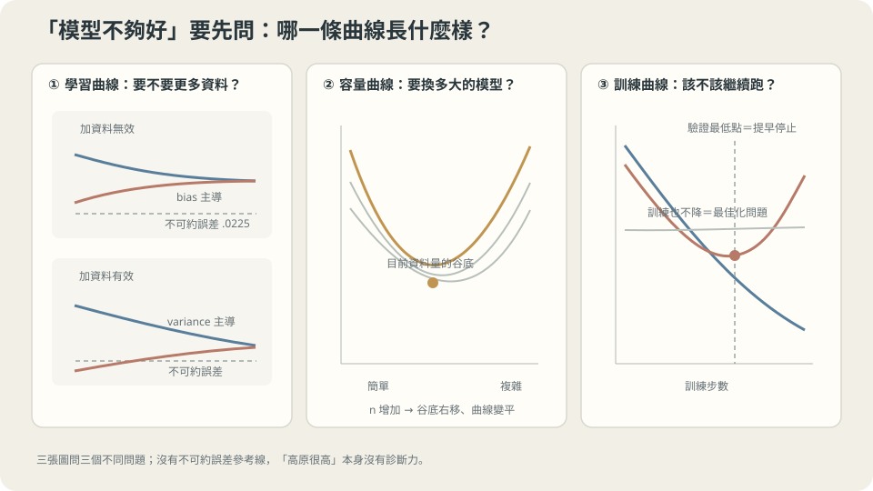

import Objectives from '../../../components/Objectives.astro';
import Ask from '../../../components/Ask.astro';
import Prereq from '../../../components/Prereq.astro';
import Question from '../../../components/Question.astro';
import Answer from '../../../components/Answer.astro';
import QuizBlock from '../../../components/QuizBlock.astro';
import Option from '../../../components/Option.astro';
import Explanation from '../../../components/Explanation.astro';
import VizPlan from '../../../components/VizPlan.astro';
import Remark from '../../../components/Remark.astro';
import Bridge from '../../../components/Bridge.astro';
import UsedBy from '../../../components/UsedBy.astro';
import Ref from '../../../components/Ref.astro';

# 該收資料、換模型，還是多訓幾輪：學習曲線

<Objectives>
- **畫出三種診斷曲線（誤差對資料量、對容量、對訓練步數）。** 說出每一種形狀對應哪一個處方。
- **從「兩條線收斂到哪個高度」判斷加資料是否有效。** 不必真的先花成本收資料。
- **說出讀曲線的前提：驗證集要多大才讀得出來。** 量出它不夠大時區間有多寬。
</Objectives>

<Prereq items={frontmatter.prereqs} />

## 三個提案，只有一筆預算

模型上線前的最後一次會議。目前的表現不夠好，三個人各有提案：

- **A**：「資料太少，再標一萬筆。」——三個月，六位數的標註費。
- **B**：「模型太小，換一個大十倍的。」——兩週實作，訓練成本上升五倍。
- **C**：「訓練不夠久，多跑幾輪。」——便宜，但如果沒用就是白等。

三個提案都合理，都要花錢，而且**如果診斷錯了，錢就是白花的**：資料不足的問題不會因為換大模型而好轉（<Ref to="ml-bias-variance" mode="title"/> 已經證明加資料只壓 variance），容量不足的問題也不會因為加資料而好轉。

**你要在花錢之前就知道哪一個會有效。**

方法在你手上的資料裡：把手上的資料**只用一部分**去訓練，畫出「誤差如何隨可用資料量變化」的曲線，看它往哪裡走。同樣的手法對容量與訓練步數也適用。三條曲線，三個處方。

這一篇是 L1 的收束：把前四篇的概念（訓練／泛化誤差、bias–variance、切分、交叉驗證）變成一張可以在會議上畫出來的圖。

<Ask>
模型不夠好：該去收更多資料、換更大的模型，還是多訓幾輪？<br />
三件事都要花錢，<br />
能不能在花之前就知道哪一個有效？
</Ask>

<Question id="Q1">
把三個提案翻成三條曲線：橫軸各是什麼、要畫哪兩條線？「加資料會不會有用」這個問題，在圖上是看哪一個特徵？

<Answer>
**三條曲線，每條都畫兩線**（訓練誤差與驗證誤差，後者用留出集或 <Ref to="ml-cross-validation" mode="title"/> 估）：

| 曲線 | 橫軸 | 對應的提案 |
|---|---|---|
| 學習曲線 | 訓練資料量 $n$（用手上資料的子集） | A：加資料 |
| 容量曲線 | 模型大小 / 複雜度 | B：換模型 |
| 訓練曲線 | 訓練步數 | C：訓久一點 |

**「加資料會不會有用」看的是學習曲線上的兩個特徵：**

1. **兩條線之間的間距。** 間距大 = variance 主導 = 加資料會把間距壓小 → **有用**。
2. **兩條線收斂到的高度。** 若它們已經幾乎重合，就看那個共同高度離「不可約誤差」多遠。差很多 = bias 主導 = 再多資料也停在那裡 → **沒用，該換模型**。

這正是不必先花三個月就能回答 A 的方法——用 $n/8$、$n/4$、$n/2$、$n$ 的子集各訓一次，看趨勢。

> **加資料值不值得，看的是那兩條線會合在多高的地方。**

</Answer>
</Question>

## 三種形狀，三張處方

**學習曲線（誤差對資料量）的兩種典型形狀：**

- **高原很高、兩線早早重合** → 欠擬合 / bias 主導。加資料無效。處方：放大容量、加更有資訊的特徵、或檢查最佳化是否收斂。
- **兩線間距大、驗證線仍在下降** → variance 主導。處方：加資料（曲線的斜率直接告訴你加多少大概能換到多少）、或縮小容量、加正則化。

**容量曲線**是 <Ref to="ml-overfitting-underfitting" mode="title"/> 的 U 形：左側欠擬合、右側過擬合、谷底是當前資料量下的最佳。它回答 B，而且要注意谷底會隨 $n$ 移動——所以 A 與 B 的答案彼此相關。

**訓練曲線**（誤差對步數）有三種讀法：兩線都還在降 → 訓久一點（C 有效）；訓練線降而驗證線開始上升 → 該提早停止；訓練線卡住不降 → 這不是泛化問題而是**最佳化**問題，回去看學習率（<Ref to="ml-gradient-descent" mode="title"/>）。

一個貫穿三張圖的參考線：**不可約誤差**。沒有它，你不知道「高原很高」的「高」是相對於什麼。共用 toy 裡它是 $0.0225$；真實專案裡用重複量測的散佈或人類專家的一致性來估。



**圖說：** 學習、容量與訓練曲線回答三種不同的診斷問題；不可約誤差提供必要的比較基準。

## 曲線的形狀從哪裡來

用 <Ref to="ml-bias-variance" mode="title"/> 的分解看學習曲線。固定演算法，資料量 $n$：

$$
\mathbb E\big[R(\hat f_n)\big]=\underbrace{\sigma^2}_{\text{不可約}}+\underbrace{\mathrm{bias}^2(\mathcal F)}_{\text{與 }n\text{ 無關}}+\underbrace{\mathrm{var}(n)}_{\approx\ \sigma^2p/n}.
$$

**第二項不含 $n$**——這一行就是「加資料壓不動 bias」的全部理由。於是驗證誤差隨 $n$ 下降，但**下降到 $\sigma^2+\mathrm{bias}^2$ 就停住**。那個高原的高度只由假設空間決定。

訓練誤差的方向相反：$n$ 很小時模型幾乎能穿過每一點（訓練誤差接近 $0$），$n$ 變大就越來越難，訓練誤差**上升**。兩條線於是從兩側夾向同一個高原，**間距就是 estimation error（variance）**。

$$
\text{驗證線}\ \searrow\ \sigma^2+\mathrm{bias}^2\ \nwarrow\ \text{訓練線}
$$

**這給了一個不用花錢的預測法**：畫出 $n/8,n/4,n/2,n$ 四個點，看兩條線夾向的高度。若那個高度已經接近不可約誤差，加資料的天花板很低；若還很高，你就知道要換的是模型而不是資料量。（把驗證線外推得更遠、預測「再加十倍資料能到多少」，在很多任務上遵循冪律，這是 scaling law 研究的起點——參考文獻 2。但外推有風險，見下面的 Details。）

<Remark label="注意" summary="外推學習曲線的兩個陷阱">
**陷阱一：冪律只在中段成立。** 實務上 $\log(\text{誤差})$ 對 $\log n$ 常常近似直線，於是很容易用兩三個點外推十倍。但這條直線在兩端都會失效：$n$ 很小時模型還在「什麼都學不到」的區域，$n$ 很大時會撞上 $\sigma^2+\mathrm{bias}^2$ 的地板而彎平。**外推超過一個數量級以上要非常小心**，而且至少要有四到五個點才看得出是不是真的直線。

**陷阱二：加的資料不是同一種資料。** 曲線是用「現有資料的子集」畫的，所以它預測的是「更多**同分佈**的資料」的效果。真實的「再標一萬筆」往往來自不同時間、不同標註員、不同來源——那是另一個分佈，曲線不適用（<Ref to="ml-empirical-risk" mode="title"/> 的第二段落差）。

一個折衷的做法：畫曲線時同時記錄「若把最新一批資料當驗證集」的表現。如果子集曲線很樂觀而最新批次的表現持平，那你面對的是偏移，不是資料量。
</Remark>

## 把三個提案排出優先順序

**便宜的先做。** C（多訓幾輪）與「檢查最佳化」幾乎不花什麼成本，先排除。做法：看訓練誤差是否還在降、以及是否已經低於不可約誤差水準。

**接著做小資料過擬合測試。** 拿 $100$ 筆資料訓到訓練誤差接近零。做不到 → 問題在容量或最佳化，A（加資料）一定沒用，直接排除三個月的提案。

**再畫學習曲線。** 用 $n/8$ 到 $n$ 的子集。兩線間距大且驗證線還在降 → A 有效，而且斜率告訴你大概能換到多少。兩線已重合在高高原 → B。

**這一切依賴什麼。** 一，驗證集夠大，否則曲線的抖動比訊號大（本節最後會量）。二，每個子集都重跑完整流程（含超參數選擇）——只用大資料調好的超參數去跑小子集，畫出來的曲線會低估小資料的表現，讓「加資料」看起來比實際更有效。三，子集是隨機抽的且與整體同分佈。

## 三條曲線的實測

**曲線一：誤差對資料量。** 兩個模型——$d=2$（容量不足）與 $d=12$（容量充裕），每個 $n$ 重複 60 次取中位數：

```
    n |    d=2 訓練    d=2 風險 |   d=12 訓練   d=12 風險
   10 |    0.1393    0.2904 |       —          —
   20 |    0.1720    0.2493 |    0.0071     3.7113
   40 |    0.2007    0.2409 |    0.0138     0.0458
   80 |    0.2125    0.2275 |    0.0181     0.0282
  160 |    0.2129    0.2246 |    0.0205     0.0247
  320 |    0.2162    0.2227 |    0.0214     0.0235
  640 |    0.2182    0.2213 |    0.0219     0.0229
```

**兩個模型的曲線形狀完全不同，處方也相反。**

$d=2$：訓練誤差**上升**（$0.139\to0.218$）、風險下降（$0.290\to0.221$），兩條線在 $n=160$ 左右就幾乎貼在一起，高原是 $0.22$。而不可約誤差是 $0.0225$——**高原比地板高了十倍。** 從 $n=160$ 到 $640$ 資料量翻了四倍，風險只從 $0.2246$ 改善到 $0.2213$（$1.5\%$）。**結論：對這個模型，A 提案是白花錢。** 而且這個結論在 $n=160$ 時就看得出來，不需要真的去蒐集 $640$ 筆。

$d=12$：$n=20$ 時兩線間距是天文數字（$0.0071$ 對 $3.71$，模型比資料點還多的區域）；到 $n=640$ 兩線收斂到 $0.0219$ 與 $0.0229$，**高原幾乎就是不可約誤差 $0.0225$**。**結論：A 提案有效，而且已經接近兌現完畢**——再加資料的天花板只剩 $0.0004$。

把兩欄並排讀還有一個推論：**在 $n=40$ 的時候該選 $d=12$ 嗎？** $d=2$ 是 $0.2409$、$d=12$ 是 $0.0458$，選 $d=12$。但在 $n=20$ 時 $d=12$ 是 $3.71$，該選 $d=2$。**最佳模型隨資料量改變**——這是容量曲線的谷底會移動的另一種說法。

**曲線二：誤差對訓練步數。** $n=150$（$30$ 訓練 / $120$ 驗證）、$d=29$ 的模型，用固定學習率的全批次梯度下降：

```
     步數        訓練        驗證      真實風險
      100    0.0713    0.1167     0.1317
     1000    0.0516    0.0905     0.1015
    10000    0.0302    0.0476     0.0502
   100000    0.0196    0.0290     0.0290
  1000000    0.0147    0.0324     0.0318
  5000000    0.0130    0.0434     0.0458

驗證最低點：第 179270 步，驗證 0.0284，真實風險 0.0277
```

**訓練誤差單調下降，驗證誤差先降後升。** 最低點在約 $18$ 萬步；繼續訓到 $500$ 萬步，訓練誤差又降了 $12\%$ 而真實風險惡化了 $65\%$（$0.0277\to0.0458$）。

關鍵是：**這裡的模型沒有換、資料沒有變、正則化沒有調——只有「訓練多久」這一個設定，就走完了從欠擬合到過擬合的全程。**

> **「訓練時間」本身就是一個容量設定。**

這也就是提早停止（early stopping）的全部內容：在驗證曲線的最低點停下來。它是最便宜的正則化，代價只是要維護一份驗證集。

也請注意真實風險那一欄與驗證那一欄幾乎重合（$0.0290/0.0290$、$0.0324/0.0318$）——這正是「一份夠大、沒被拿去做其他決定的驗證集」該有的樣子（$120$ 筆，只用來讀曲線）。

**刻意違反：把驗證集縮小。** 固定一個模型（真實風險 $0.0258$），用不同大小的驗證集去估它，各重複 2000 次：

```
驗證集  15 筆：估計值 0.0257 ± 0.0092   (95% 區間寬度 ≈ 0.0368，相對於真值 143%)
驗證集  60 筆：估計值 0.0260 ± 0.0046   (95% 區間寬度 ≈ 0.0185，相對於真值  72%)
驗證集 240 筆：估計值 0.0259 ± 0.0023   (95% 區間寬度 ≈ 0.0094，相對於真值  36%)
```

三個估計都**無偏**（$0.0257$、$0.0260$、$0.0259$ 對真值 $0.0258$）——沒有人在說謊。但 15 筆驗證集的 $95\%$ 區間寬度是被估量的 $143\%$：**你畫出來的那條曲線，上下抖動的幅度比它要顯示的趨勢還大。** 在這樣一條曲線上判斷「驗證誤差開始上升了」或「加資料還有沒有用」，讀到的是噪聲。

而且注意這只是**單一點**的抖動；一條曲線有十幾個點，每個點都在自己抖，人眼很容易在噪聲裡看出並不存在的轉折。實務規則：**要用曲線做決定，先確認相鄰兩點的差距大於誤差棒**。做不到就先擴大驗證集（或改用 <Ref to="ml-cross-validation" mode="title"/>），不要先改模型。

## 三條曲線並排，附誤差棒

<iframe loading="lazy" src="/personal_website/notes/research_areas/machine-learning-foundations/l1-generalization/l1-4-2.html" class="demo-frame" title="三條曲線並排，附誤差棒：互動 demo" style="height: 921px; width: 100%; border: none;"></iframe>

**互動 demo：三條曲線問的是三個不同的問題，所以該做的下一件事也不一樣。**

## 檢查理解

<QuizBlock id="ml-l1-4-a">
一條學習曲線：訓練誤差 $0.19$、驗證誤差 $0.20$，兩者從 $n=200$ 之後就幾乎不再變化；已知任務的不可約誤差約 $0.02$。下列哪個提案最不可能有效？
<Option correct>再標一萬筆資料。</Option>
<Option>換一個容量更大的模型。</Option>
<Option>加入新的特徵。</Option>
<Explanation>
兩線重合且停在遠高於不可約誤差的高原，是 bias 主導的簽名。$\mathrm{bias}^2$ 那一項不含 $n$，所以加資料只能把已經很小的間距再壓小一點，天花板是 $0.19$ 附近。另外兩個選項都在動假設空間，那才是唯一能降低高原高度的設定。順帶一提，還有第四個可能：最佳化沒收斂——這種「假的欠擬合」該先用小資料過擬合測試排除，因為它最便宜。
</Explanation>
</QuizBlock>

<QuizBlock id="ml-l1-4-b">
在訓練曲線的實測裡，第 $5\,000\,000$ 步的訓練誤差（$0.0130$）比第 $100\,000$ 步（$0.0196$）更低，但真實風險更差（$0.0458$ 對 $0.0290$）。這說明：
<Option>梯度下降發散了。</Option>
<Option correct>「訓練時間」本身就是一個容量設定：訓練越久，模型越能把訓練點上的噪聲也擬合進去。所以提早停止是一種正則化，而且不需要改模型或改損失。</Option>
<Option>學習率設得太小。</Option>
<Explanation>
這是本篇最反直覺的一點：模型、資料、損失、學習率全部沒動，只有步數在變，卻走完了欠擬合到過擬合的全程。它也解釋了為什麼「訓練到收斂」不是一個目標——收斂到的是訓練誤差的最小點，不是風險的最小點。實務上提早停止常與其他正則化搭配使用；它的成本只是要維護一份不參與其他決定的驗證集。
</Explanation>
</QuizBlock>

<QuizBlock id="ml-l1-4-c">
在 $n=20$ 時 $d=12$ 的風險是 $3.71$，在 $n=640$ 時是 $0.0229$；$d=2$ 則從 $0.2493$ 到 $0.2213$。一位同事總結：「所以我們該用 $d=12$。」最完整的回應是：
<Option>同意，$d=12$ 在大資料下明顯較好。</Option>
<Option correct>要看你在哪一段。$n\le20$ 時 $d=2$ 好得多，$n\ge40$ 之後 $d=12$ 好得多——最佳容量隨資料量移動，所以「該用哪個模型」與「該收多少資料」是同一個決定的兩面，不能分開回答。</Option>
<Option>不同意，$d=2$ 的曲線比較穩定所以比較安全。</Option>
<Explanation>
把 A 與 B 兩個提案當成獨立選項，是這場會議最容易犯的錯。學習曲線與容量曲線其實是同一張二維曲面的兩個切面：谷底的位置由 $(n,\text{容量})$ 這一對決定。實務上的作法是：先畫學習曲線判斷資料的天花板，再在**預期的資料量**下重新選容量——而不是在目前的資料量下選定模型後就不再回頭。
</Explanation>
</QuizBlock>

<UsedBy slug={frontmatter.slug} />

<Bridge to="ml-minibatch-noise">
接下來的問題換一個層次。到目前為止，每一次梯度都用上了全部資料——在 30 筆的 toy 上很合理，在一千萬筆上不可能。接下來的單元 從這裡開始：只看一個 batch 就算梯度，誤差有多大、它怎麼影響能用的學習率、以及為什麼這個「缺陷」在實務上常常是有益的。
</Bridge>

## 參考文獻

1. Ng, A. [*Machine Learning Yearning*](https://info.deeplearning.ai/machine-learning-yearning-book) 2018, Ch. 20–32.（把學習曲線當成專案決策工具的實務版本，含各種形狀對應的處方。）
2. Hestness, J. et al. [*Deep Learning Scaling is Predictable, Empirically.*](https://arxiv.org/abs/1712.00409) arXiv 2017.（誤差對資料量的冪律在多個領域的實測，以及它在兩端如何失效。）
3. Prechelt, L. [*Early Stopping — But When?*](https://doi.org/10.1007/3-540-49430-8_3) Neural Networks: Tricks of the Trade, Springer 1998.（提早停止的判準比較：什麼時候該停、驗證曲線的噪聲怎麼處理。）
