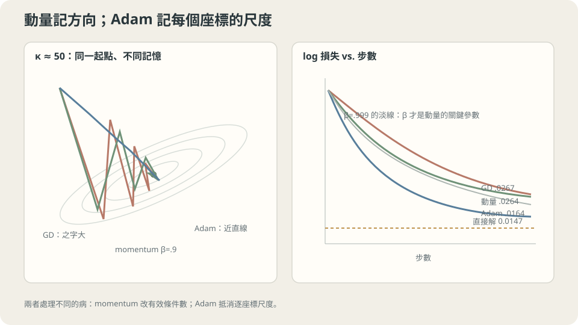

import Objectives from '../../../components/Objectives.astro';
import Ask from '../../../components/Ask.astro';
import Prereq from '../../../components/Prereq.astro';
import Question from '../../../components/Question.astro';
import Answer from '../../../components/Answer.astro';
import QuizBlock from '../../../components/QuizBlock.astro';
import Option from '../../../components/Option.astro';
import Explanation from '../../../components/Explanation.astro';
import VizPlan from '../../../components/VizPlan.astro';
import Remark from '../../../components/Remark.astro';
import Details from '../../../components/Details.astro';
import Bridge from '../../../components/Bridge.astro';
import UsedBy from '../../../components/UsedBy.astro';
import Ref from '../../../components/Ref.astro';

# 一個 η 不夠用：動量與 Adam 各買到什麼

<Objectives>
- **動量買的是「有效條件數」，而它的效果由 $\beta$ 決定，不是由「有加動量」決定。** 說出要吃到 $\sqrt\kappa$ 的加速需要 $\beta\approx1-2/\sqrt\kappa$，並在 toy 上量出 $\beta=0.9$ 與 $\beta=0.999$ 差多少。
- **Adam 買的是「逐座標的尺度」，代價是它換掉了你在最小化的那個幾何。** 寫出它的更新式，說出為什麼它對 $\eta$ 不敏感（實測 30 倍的 $\eta$ 給同一個結果）。
- **判斷一個病該用哪一個設定。** 對「換一個特徵單位就毀掉訓練」這個老問題，算出動量與 Adam 各能救多少，並說出為什麼標準化仍然不可省。
</Objectives>

<Prereq items={frontmatter.prereqs} />

## 一個純量背了三個工作

到目前為止，$\eta$ 已經被要求同時做三件事：

- <Ref to="ml-gradient-descent" mode="title"/>：它**不能超過 $2/\lambda_{\max}$**，跨過去是 $10^{122}$。
- 同一篇：走完全程需要的步數由**條件數** $\kappa=\lambda_{\max}/\lambda_{\min}$ 決定；那個 toy 上 $\kappa=1.6\times10^7$，所以在門檻上跑兩萬步仍然到不了直接解。
- <Ref to="ml-minibatch-noise" mode="title"/>：它決定**噪聲地板**的高度（$\propto\eta/B$）。

三件事的方向彼此衝突：第一件要 $\eta$ 小，第二件要 $\eta$ 大，第三件又要 $\eta$ 小。而它們的根源不同——第一件是最陡方向的曲率，第二件是最平方向的曲率，第三件是抽樣的抖動。

**一個純量沒辦法同時服務三個不同的需求。** 出路是給最佳化器**更多狀態**：除了當前位置，再記一點別的東西。

<Ask>
走下山時，如果地面很陡就小步、很平就大步——<br />
這件事能自動化嗎？<br />
自動化之後，我還需要自己標準化特徵嗎？
</Ask>

<Question id="Q1">
把「陡就小步、平就大步」翻成數學：最理想的更新是什麼？它為什麼在實務上算不出來？動量與 Adam 各是那個理想的哪一種便宜近似？

<Answer>
**理想的更新是牛頓步。** 把 $L$ 在 $\theta$ 附近展開到二階（<Ref to="math-taylor" mode="title"/>），最小化那個二次近似，得到

$$
\theta_{k+1}=\theta_k-\big[\nabla^2L(\theta_k)\big]^{-1}\nabla L(\theta_k).
$$

這一步的意思正是「陡的方向小步、平的方向大步」：Hessian 的逆把每個方向除掉它自己的曲率。在二次問題上它**一步到位**，而且完全不需要調 $\eta$。

**它算不出來的理由有兩個。** 參數有 $P$ 個時，Hessian 是 $P\times P$——$P=10^9$ 時它存不下，更別說求逆。而且非凸的地方 Hessian 可能不是正定的，那個「最小化」會把你送到鞍點甚至往上走。

**兩種便宜的近似，取的方向不同。**

- **動量**不去估 Hessian，改成**把過去的梯度累積起來**。在細長的碗裡，來回擺盪的分量會互相抵消，而沿著溝底的一致分量會累加——等效於在最平的方向上放大步伐。它是一個純量方法（所有座標共用同一個 $\eta$、同一個 $\beta$），買到的是**有效條件數**。
- **Adam** 反過來：它不管方向之間的耦合，只**估每個座標自己的梯度尺度**（用平方梯度的 EMA），再把該座標的步伐除掉它。等效於用一個**對角**矩陣近似 Hessian，買到的是**逐座標的尺度**。

兩者不是同一件事的兩個版本，而是拆了不同的東西：動量處理「方向之間的曲率差」，Adam 處理「座標之間的尺度差」。本篇會在同一個問題上量出它們各買到多少。
</Answer>
</Question>

## 兩種鬆綁：記住方向，或記住尺度

**動量的圖像是一顆有重量的球。** 純 GD 是一個沒有慣性的質點：每一步只看當下的坡度。加上動量之後，球會保留上一步的速度：

$$
v_{k+1}=\beta v_k+\nabla L(\theta_k),\qquad \theta_{k+1}=\theta_k-\eta\,v_{k+1}.
$$

在一個又長又窄的溝裡，橫向的坡度左右交替，累積起來互相抵消；沿著溝底的坡度方向一致，累積起來越滾越快。**球在該慢的方向被抵消，在該快的方向被放大**——這正是我們想要的「陡就小步、平就大步」，而且完全不需要知道 Hessian。

$v$ 是梯度的一個幾何加權和：$v_k=\sum_{j}\beta^{\,j}\nabla L(\theta_{k-j})$，權重以 $\beta$ 衰減。這和 <Ref to="math-ema" mode="title"/> 的移動平均是同一個物件，所以它的「記憶長度」大約是 $1/(1-\beta)$ 步：$\beta=0.9$ 記十步，$\beta=0.999$ 記一千步。**這個數字就是動量能買到的加速上限**，下一節會把它和 $\sqrt\kappa$ 對起來。

**Adam 的圖像是每個座標自己的一把尺。** 它同時維護梯度的一階與二階 EMA，再用後者當分母：

$$
m_k=\beta_1m_{k-1}+(1-\beta_1)g_k,\quad
s_k=\beta_2s_{k-1}+(1-\beta_2)g_k^2,\quad
\theta_{k+1}=\theta_k-\eta\,\frac{\hat m_k}{\sqrt{\hat s_k}+\epsilon}
$$

（$\hat m,\hat s$ 是除掉初期偏差的版本，見下面的 `<Remark>`）。關鍵在那個分母是**逐座標**的：如果某個座標的梯度一直是 $10^{6}$、另一個一直是 $10^{-6}$，兩者除完之後步伐都是 $\eta$ 的量級。

**這給了 Adam 一個很好用的性質，也給了它一個很容易被誤解的性質。** 好用的是：把某個座標的梯度乘上一個常數，Adam 的軌跡不變——所以「特徵尺度不一致」這個 <Ref to="ml-gradient-descent" mode="title"/> 的老病，它免疫。誤解的是：**每一步移動的距離大約就是 $\eta$，與梯度多大無關**。這意味著如果正確答案要求某個座標移動 $10^{-10}$、另一個座標移動 $1$，一個共用的 $\eta$ 仍然辦不到。本篇最後會把這件事跑出來。



**圖說：** 動量抑制狹谷中的來回震盪；Adam 先除掉座標尺度，因此兩者處理的是不同問題。

## 動量的加速由 β 決定，Adam 的步長由 η 決定

**動量。** 在二次問題上，帶動量的迭代對每個特徵值 $\lambda$ 的分量是一個二階遞迴，它的收縮率由 $\beta$ 與 $\eta\lambda$ 共同決定。最佳的一組是

$$
\beta^\star=\left(\frac{\sqrt\kappa-1}{\sqrt\kappa+1}\right)^2,
\qquad
\text{每步收縮率}=\frac{\sqrt\kappa-1}{\sqrt\kappa+1},
$$

對照 GD 的 $\frac{\kappa-1}{\kappa+1}$。**$\kappa$ 換成 $\sqrt\kappa$**——這就是動量的全部收益，而且它是理論上單靠一階資訊能拿到的最好結果。

但要注意 $\beta^\star$ 這個式子：$\kappa$ 越大，$\beta^\star$ 越靠近 1。本篇 toy 的 $\kappa=1.6\times10^7$、$\sqrt\kappa\approx3995$，代進去得 $\beta^\star\approx0.999$。

> **$\beta=0.9$ 的動量只買到大約 $1/(1-\beta)=10$ 倍；要吃到 $\sqrt\kappa$，$\beta$ 必須跟著 $\kappa$ 一起長。**

這條式子解釋了一個很常見的失望：「我加了動量，可是沒什麼差」——因為 $\beta$ 被當成一個不用調的預設值，而它其實是這個方法**唯一**的設定。

**Adam。** 因為分母是梯度自己的尺度，$\eta$ 的單位變成「參數空間裡每一步走多遠」，不再和損失的尺度綁在一起。後果是 $\eta$ 好調得多——下一節會看到 $\eta$ 掃過 30 倍給同一個結果。代價寫在下面的 `<Remark>` 裡。

<Remark label="補充" summary="Adam 的兩個細節：偏差修正與 ε">
**偏差修正。** $m_0=s_0=0$，所以前幾步的 $m_k$ 與 $s_k$ 都被那個零拉小。第 $k$ 步時 $m_k$ 的權重總和是 $1-\beta_1^k$，所以除掉它：$\hat m_k=m_k/(1-\beta_1^k)$，$\hat s_k=s_k/(1-\beta_2^k)$。$\beta_2=0.999$ 時 $1-\beta_2^k$ 在 $k=100$ 還只有 $0.095$——**不修正的話前一千步的步伐會被系統性地放大十倍**，這是實作上最常見的 bug 之一。

**$\epsilon$ 不只是防除以零。** 它同時是一個「地板」：梯度小到遠低於 $\epsilon$ 的座標，步伐會回到與梯度成正比（也就是退化成 GD）。$\epsilon$ 設得太大，Adam 的逐座標尺度就失效；設得太小，一個長期梯度接近零的座標會被放大到不穩。本篇最後那個實驗把 $\epsilon$ 從 $10^{-8}$ 調到 $10^{-12}$ 也救不回來——那不是 $\epsilon$ 的問題。
</Remark>

<Details summary="Adam 的收斂性、AdamW，以及「Adam 泛化較差」這個說法">
Adam 的原始論文給的收斂證明後來被指出有誤（Reddi et al., ICLR 2018 的 AMSGrad 一文給了一個 $\beta_2$ 下 Adam 不收斂的反例），修法是對 $s_k$ 取歷史最大值。實務上這個修正很少被採用，因為它在多數任務上沒有可觀察的差別——這是一個「理論反例存在但實務影響小」的例子，知道它存在即可，不必為它改預設值。

**AdamW** 改的是另一件事。原本的實作把 weight decay 當成一個加在梯度上的項 $g\leftarrow g+\lambda\theta$，於是它也會被那個 $\sqrt{\hat s}$ 分母除掉——梯度大的座標，衰減被除得比較小，衰減強度變成隱含地依賴梯度尺度。AdamW 把衰減直接寫在更新上（$\theta\leftarrow\theta-\eta\hat m/(\sqrt{\hat s}+\epsilon)-\eta\lambda\theta$），讓它回到「與梯度尺度無關」。這件事與 <Ref to="ml-regularization" mode="title"/> 的內容接在一起。

至於「Adam 泛化比 SGD 差」：這個說法在影像分類上有不少支持的實驗，在語言模型上則幾乎相反（那裡 Adam 家族是唯一實用的選擇）。目前沒有一個乾淨的機制解釋，而且大多數比較都沒有把 $\eta$ 與 weight decay 同時調到各自的最佳。**這一篇不下這個結論**，只記錄：換最佳化器會改變你走到哪個解，那件事本身要用留出資料量，不能用直覺判。
</Details>

## 哪個病用哪個設定

把三個「$\eta$ 背的工作」對回三個設定：

| 症狀 | 根源 | 該動的設定 |
| --- | --- | --- |
| 訓練幾百步後突然 NaN | $\eta$ 越過 $2/\lambda_{\max}$ | 降 $\eta$、加 warmup |
| 穩定但慢到走不完 | 條件數大 | 動量（$\beta$ 要跟著 $\kappa$ 調）、標準化、Adam |
| 座標之間的梯度差好幾個數量級 | 特徵／參數尺度不一致 | Adam、標準化、正規化層 |
| 曲線已經平了但停在高處 | 噪聲地板 | 降 $\eta$、加 $B$、學習率衰減 |

**這一切依賴什麼。** 一，上面動量的 $\sqrt\kappa$ 是**二次問題**的結果；真實網路的 Hessian 會隨訓練變動，$\beta^\star$ 也跟著動，所以實務上 $\beta$ 是掃出來的而不是算出來的。二，Adam 的尺度免疫是對**梯度**的尺度，不是對參數該有的量級——這是下一節那個實驗的重點。三，這裡全部用全批次梯度量；加了 minibatch 噪聲之後，動量還多一個副作用：它同時平滑掉噪聲（記憶長度 $1/(1-\beta)$ 步的平均），所以 $\beta$ 也在偷偷改變 <Ref to="ml-minibatch-noise" mode="title"/> 的地板高度。

## 在同一個問題上量三個方法

用 <Ref to="ml-gradient-descent" mode="title"/> 的同一組設定：共用 toy $n=30$、五次多項式特徵（不標準化），$\lambda_{\max}=1.803$、$\kappa=1.6\times10^7$、直接解的訓練 MSE $=0.01466$。每個方法都跑兩萬步，各自用它能穩定的最大 $\eta$。

```python
import numpy as np
from ml_toy import toy_1d

x, y = toy_1d(n=30, seed=0)
V = np.vander(x, 6, increasing=True); n = len(x)

def final(kind, eta, mom=0.9, T=20000):
    w = np.zeros(6); v = np.zeros(6); s = np.zeros(6)
    for t in range(1, T+1):
        g = (V.T @ (V@w - y))/n
        if kind == "gd":       w -= eta*g
        elif kind == "mom":    v = mom*v + g; w -= eta*v
        elif kind == "adam":
            v = 0.9*v + 0.1*g;  s = 0.999*s + 0.001*g*g
            w -= eta*(v/(1-0.9**t))/(np.sqrt(s/(1-0.999**t)) + 1e-8)
    return ((V@w - y)**2).mean()
```

```
直接解 0.01466；兩萬步之後的訓練 MSE
  GD        η=0.3   0.03213      momentum β=0.9    η=0.11  0.02638
  GD        η=0.7   0.02891      momentum β=0.99   η=0.11  0.01668
  GD        η=1.05  0.02666      momentum β=0.999  η=0.11  0.01596
  GD        η=1.15  發散         momentum β=0.9999 η=0.002 0.02393

  Adam η=0.003  0.01647     Adam η=0.01  0.01638
  Adam η=0.03   0.01638     Adam η=0.1   0.01646
```

**三個結論，三個不同的性質。**

**動量的設定是 $\beta$，不是「有沒有加」。** $\beta=0.9$ 給 $0.02638$，而 GD 在門檻上是 $0.02666$——差 $1\%$，實務上看不出來。把 $\beta$ 推到 $0.99$ 才掉到 $0.01668$，$0.999$ 是 $0.01596$。而理論算出來的 $\beta^\star=0.998999$ 正好落在後兩者之間，$0.9999$ 又太大（$0.02393$，過衝）。**理論值直接命中實測的最佳位置。**

**Adam 幾乎不用調。** $\eta$ 從 $0.003$ 到 $0.1$（30 倍）給的結果都在 $0.01638$–$0.01647$，而且全部優於任何 $\beta$ 的動量。原因是那個逐座標的分母把 $x^0$ 到 $x^5$ 六個欄位的尺度差先除掉了——它處理的正是這個問題真正的病。

**最好的動量與 Adam 差不多。** $0.01596$ 對 $0.01638$。所以在這個問題上兩條路都通，差別是 Adam 用預設值就到，動量要找對 $\beta$。

**刻意違反：把 $x$ 換成「民國年」。** 這是 <Ref to="ml-gradient-descent" mode="title"/> 那個實驗——同一份資料，只把 $x\in[0,1]$ 換成 $t=100+10x$，於是 $\lambda_{\max}$ 從 $1.803$ 變成 $1.75\times10^{20}$。GD 的門檻掉到 $1.14\times10^{-20}$。Adam 對梯度尺度免疫，它應該沒事吧？

```
這組特徵的直接解 MSE = 0.01867
直接解的各座標量級：2.0e-03  8.5e-02  2.2e+00  6.4e-02  6.1e-04  1.9e-06

  GD       η=1e-24   兩萬步後  0.36383
  momentum η=1e-24   兩萬步後  0.36377
  Adam     η=0.1     二十萬步後  21547
  Adam     η=1e-3    二十萬步後  7.6e+07
  Adam     η=1e-6    二十萬步後  169.56
  Adam     η=1e-9    二十萬步後  0.21414
  Adam     η=1e-12   二十萬步後  0.21416

  每欄標準化之後：Adam η=0.01，兩萬步後 0.01466（＝直接解）
```

**沒有一個 $\eta$ 讓 Adam 走到 $0.0187$。** 最好的是 $\eta=10^{-9}$ 的 $0.214$——比 GD 的 $0.364$ 好，但距離直接解還有一個數量級。而每欄標準化之後，Adam 用預設的 $\eta=0.01$ 兩萬步就走到 $0.01466$，**正好是直接解**。

原因在第二行那個量級表：正確答案要求 $w_2\approx2.2$ 而 $w_5\approx1.9\times10^{-6}$，差六個數量級。Adam 每一步在每個座標上都移動大約 $\eta$，所以 $\eta$ 要小到能刻出 $10^{-6}$，$w_2$ 就得走兩百萬步；$\eta$ 大到能快速刻出 $2.2$，$w_5$ 就一步跨過去然後開始震盪。

> **Adam 對「每個座標的梯度尺度」免疫，對「每個座標該有的參數量級」不免疫。**

所以那條很常聽到的建議——「用 Adam 就不用管特徵標準化了」——只對了一半。**標準化不可省**，因為它改的是參數該有的量級（<Ref to="ml-gradient-descent" mode="title"/> 說它在改碗的形狀），而最佳化器改的只是走路的方式。

## 三個方法、三個設定，在同一個碗上

<iframe loading="lazy" src="/personal_website/notes/research_areas/machine-learning-foundations/l2-optimization-in-practice/l2-1-2.html" class="demo-frame" title="三個方法、三個設定，在同一個碗上：互動 demo" style="height: 1132px; width: 100%; border: none;"></iframe>

**互動 demo：三種模式：正常、損失乘一千、民國年。動量買有效條件數，Adam 買逐座標的尺度。**

## 檢查理解

<QuizBlock id="ml-l2-1-a">
一個團隊在一個條件數很大的問題上「加了動量（$\beta=0.9$）」但幾乎沒有改善，結論是「動量對我們的問題沒用」。最準確的評論是：
<Option>正確，動量只在凸問題上有用。</Option>
<Option correct>結論下得太早：$\beta$ 是這個方法唯一的設定，而它要跟著條件數長（$\beta^\star\approx1-2/\sqrt\kappa$）。實測 $\beta=0.9$ 幾乎等於 GD（$0.02638$ 對 $0.02666$），$\beta=0.999$ 才掉到 $0.01596$。</Option>
<Option>應該直接換 Adam，動量已經被取代了。</Option>
<Explanation>
$\beta=0.9$ 的記憶長度是十步，所以它最多把有效條件數改善十倍——在 $\kappa=1.6\times10^7$ 面前是零。這題的一般教訓是：**一個方法「沒用」與「它的設定沒調」在實驗上長得一樣**，而區分兩者只需要掃一遍那個設定。第三個選項也不對：本篇實測最好的動量（$0.01596$）比 Adam（$0.01638$）略低。
</Explanation>
</QuizBlock>

<QuizBlock id="ml-l2-1-b">
關於「用 Adam 就不需要標準化特徵」，根據本篇的實測，正確的說法是：
<Option>對，Adam 的逐座標分母已經把尺度問題解決了。</Option>
<Option correct>只對一半。Adam 對「每個座標的梯度尺度」免疫，但每一步在每個座標上都移動大約 $\eta$；當正確答案要求不同座標的量級差六個數量級時，任何單一 $\eta$ 都辦不到——實測沒有一個 $\eta$ 讓 Adam 接近直接解，標準化之後用預設值就到了。</Option>
<Option>錯，Adam 在任何尺度下都比 GD 差。</Option>
<Explanation>
分清「梯度的尺度」與「參數該有的量級」是這一篇最實用的一點。前者被 $\sqrt{\hat s}$ 除掉了，後者沒有——Adam 的步長是 $\eta$ 而不是 $\eta\times$ 梯度。實務上這件事的樣子是：模型的某一組參數（例如某個很少被觸發的 embedding）需要非常小的值，而 Adam 會讓它以 $\eta$ 的步伐震盪。第三個選項與實測矛盾：同一個問題上 Adam $0.214$、GD $0.364$。
</Explanation>
</QuizBlock>

<QuizBlock id="ml-l2-1-c">
Adam 的偏差修正（$\hat m=m/(1-\beta_1^k)$、$\hat s=s/(1-\beta_2^k)$）如果被漏掉，最直接的後果是：
<Option>訓練完全不會動。</Option>
<Option correct>前期的步伐被系統性放大。$\beta_2=0.999$ 時 $1-\beta_2^k$ 在 $k=100$ 只有 $0.095$，$\sqrt{\hat s}$ 的分母被低估約三倍，於是前幾百步的實際步長遠大於設定的 $\eta$——常常表現成「一開始就爆掉」。</Option>
<Option>只影響最後收斂到的位置，不影響前期。</Option>
<Explanation>
$m_0=s_0=0$ 這個初始化讓兩個 EMA 在前期都被零拉小，而它們一個在分子、一個在分母的平方根裡，所以淨效果是分母被低估得比分子多。這也是 warmup 常常「剛好」能掩蓋這個 bug 的原因——兩者都在壓低前期的實際步長，於是 bug 變得更難發現。
</Explanation>
</QuizBlock>

<QuizBlock id="ml-l2-1-d">
下列哪一句**不對**？
<Option>牛頓步在二次問題上一步到位且不需要調 $\eta$，但 Hessian 在大模型上存不下。</Option>
<Option>動量能拿到的最好收縮率是 $(\sqrt\kappa-1)/(\sqrt\kappa+1)$，把 GD 的 $\kappa$ 換成 $\sqrt\kappa$。</Option>
<Option correct>Adam 用平方梯度的 EMA 當分母，等於在估 Hessian 的對角，所以它是牛頓法的一個一致估計。</Option>
<Explanation>
第三句把兩件事混了。$\mathbb E[g^2]$ 估的是**梯度二階矩**，不是 Hessian 的對角；在最小點附近它趨近梯度的變異數而不是曲率。兩者在某些情況下數量級接近（這是 Adam 有效的直覺來源之一），但它不是牛頓法的一致估計——真正估 Hessian 對角的方法（例如用 Hutchinson 估計）是另一類演算法。前兩句都對：牛頓步的障礙是 $P\times P$ 的儲存與求逆，動量的 $\sqrt\kappa$ 是一階方法的最佳率。
</Explanation>
</QuizBlock>

<UsedBy slug={frontmatter.slug} />

<Bridge to="ml-moving-targets-ema">
兩個方法都靠**同一個機制**：把過去的量做移動平均。接著把這個機制推到一個更棘手的情況——**目標本身也在動**。當訓練的標籤是模型自己產生的（自我一致性、自我蒸餾、任何 bootstrapping），移動平均與 stop-gradient 就從「加速技巧」變成「會不會塌掉」的關鍵，而它們各自負責的事情常常被搞混。
</Bridge>

## 參考文獻

1. Polyak, B. T. [*Some methods of speeding up the convergence of iteration methods.*](https://doi.org/10.1016/0041-5553(64)90137-5) USSR Computational Mathematics and Mathematical Physics 1964.（heavy-ball 動量的原始論文與 $\sqrt\kappa$ 收縮率。）
2. Kingma, D., Ba, J. [*Adam: A Method for Stochastic Optimization.*](https://arxiv.org/abs/1412.6980) ICLR 2015.（更新式、偏差修正、$\epsilon$ 的角色與預設值的來源。）
3. Goh, G. [*Why Momentum Really Works.*](https://doi.org/10.23915/distill.00006) Distill 2017.（動量在二次問題上的逐特徵值分析與可調的視覺化，本篇 $\beta^\star$ 的推導在這裡有完整版本。）
