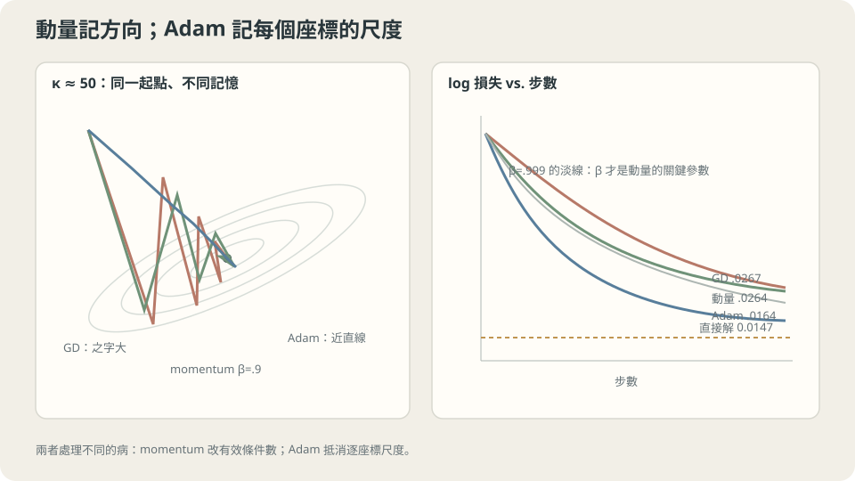

import Objectives from '../../../components/Objectives.astro';
import Ask from '../../../components/Ask.astro';
import Prereq from '../../../components/Prereq.astro';
import Question from '../../../components/Question.astro';
import Answer from '../../../components/Answer.astro';
import QuizBlock from '../../../components/QuizBlock.astro';
import Option from '../../../components/Option.astro';
import Explanation from '../../../components/Explanation.astro';
import VizPlan from '../../../components/VizPlan.astro';
import Remark from '../../../components/Remark.astro';
import Details from '../../../components/Details.astro';
import Bridge from '../../../components/Bridge.astro';
import UsedBy from '../../../components/UsedBy.astro';
import Ref from '../../../components/Ref.astro';

# 一個 η 不夠用：動量與 Adam 各買到什麼

<Objectives>
- **說出動量如何保留過去的更新方向。** 在正定二次問題上，用 $\eta,\beta$ 的共同設定比較收縮率，再說明一般網路的限制。
- **寫出 Adam 如何逐座標調整更新。** 分清梯度二階矩與 Hessian，並說明它仍然需要選擇學習率、也不保證對特徵縮放不變。
- **判斷一個病該用哪一個設定。** 對「換一個特徵單位就毀掉訓練」這個老問題，算出動量與 Adam 各能救多少，並說出為什麼標準化仍然不可省。
</Objectives>

<Prereq items={frontmatter.prereqs} />

## 一個純量背了三個工作

到目前為止，$\eta$ 已經被要求同時做三件事：

- <Ref to="ml-gradient-descent" mode="title"/>：在正定二次問題上，穩定步長要小於 $2/\lambda_{\max}$。
- 同一篇：走完全程需要的步數由**條件數** $\kappa=\lambda_{\max}/\lambda_{\min}$ 決定；那個 toy 上 $\kappa=1.6\times10^7$，所以在門檻上跑兩萬步仍然到不了直接解。
- <Ref to="ml-minibatch-noise" mode="title"/>：它決定**噪聲地板**的高度（$\propto\eta/B$）。

三件事的方向彼此衝突：第一件要 $\eta$ 小，第二件要 $\eta$ 大，第三件又要 $\eta$ 小。而它們的根源不同——第一件是最陡方向的曲率，第二件是最平方向的曲率，第三件是抽樣的抖動。

回想細長山谷：橫向方向常左右交替，沿谷底卻比較一致。如果每次只看最新梯度，就會把這兩種變化混在一起。**能不能記住過去的方向，或記住各座標的梯度尺度，再決定這一步？** 動量與 Adam 從這兩個想法出發。

<Ask>
走下山時，如果地面很陡就小步、很平就大步——<br />
這件事能自動化嗎？<br />
自動化之後，我還需要自己標準化特徵嗎？
</Ask>

<Question id="Q1">
把「陡就小步、平就大步」翻成數學：最理想的更新是什麼？它為什麼在實務上算不出來？動量與 Adam 各是那個理想的哪一種便宜近似？

<Answer>
**理想的更新是牛頓步。** 把 $L$ 在 $\theta$ 附近展開到二階（<Ref to="math-taylor" mode="title"/>），最小化那個二次近似，得到

$$
\theta_{k+1}=\theta_k-\big[\nabla^2L(\theta_k)\big]^{-1}\nabla L(\theta_k).
$$

這一步的意思正是「陡的方向小步、平的方向大步」：Hessian 的逆把每個方向除掉它自己的曲率。在二次問題上它**一步到位**，而且完全不需要調 $\eta$。

**它算不出來的理由有兩個。** 參數有 $P$ 個時，Hessian 是 $P\times P$——$P=10^9$ 時它存不下，更別說求逆。而且非凸的地方 Hessian 可能不是正定的，那個「最小化」會把你送到鞍點甚至往上走。

**兩種便宜的近似，取的方向不同。**

- **動量**不去估 Hessian，改成**把過去的梯度累積起來**。在細長的碗裡，來回擺盪的分量會互相抵消，而沿著溝底的一致分量會累加——等效於在最平的方向上放大步伐。它是一個純量方法（所有座標共用同一個 $\eta$、同一個 $\beta$），買到的是**有效條件數**。
- **Adam** 維護逐座標的梯度平均與平方梯度平均，再用後者調整步長。它是 adaptive diagonal scaling，但平方梯度不是 Hessian 的對角估計，不能直接當成 Newton approximation。

兩者不是同一件事的兩個版本，而是拆了不同的東西：動量處理「方向之間的曲率差」，Adam 處理「座標之間的尺度差」。本篇會在同一個問題上量出它們各買到多少。
</Answer>
</Question>

## 兩種鬆綁：記住方向，或記住尺度

**動量的圖像是一顆有重量的球。** 純 GD 是一個沒有慣性的質點：每一步只看當下的坡度。加上動量之後，球會保留上一步的速度：

$$
v_{k+1}=\beta v_k+\nabla L(\theta_k),\qquad \theta_{k+1}=\theta_k-\eta\,v_{k+1}.
$$

在一個又長又窄的溝裡，橫向的坡度左右交替，累積起來互相抵消；沿著溝底的坡度方向一致，累積起來越滾越快。**球在該慢的方向被抵消，在該快的方向被放大**——這正是我們想要的「陡就小步、平就大步」，而且完全不需要知道 Hessian。

若 $v_0=0$，展開遞迴就得到 $v_{k+1}=\sum_{j=0}^{k}\beta^j\nabla L(\theta_{k-j})$：越久以前的梯度，權重越小。它和 <Ref to="math-ema" mode="title"/> 有相同的指數衰減，記憶尺度約為 $1/(1-\beta)$ 步；但這個數字不是加速上限，收縮率還取決於 $\eta$ 與目標的曲率。

**Adam 的圖像是每個座標自己的一把尺。** 它同時維護梯度的一階與二階 EMA，再用後者當分母：

$$
m_k=\beta_1m_{k-1}+(1-\beta_1)g_k,\quad
s_k=\beta_2s_{k-1}+(1-\beta_2)g_k^2,\quad
\theta_{k+1}=\theta_k-\eta\,\frac{\hat m_k}{\sqrt{\hat s_k}+\epsilon}
$$

（$\hat m,\hat s$ 是除掉初期偏差的版本，見下面的 `<Remark>`）。關鍵在那個分母是**逐座標**的：如果某個座標的梯度一直是 $10^{6}$、另一個一直是 $10^{-6}$，兩者除完之後步伐都是 $\eta$ 的量級。

若把某座標的整段梯度都乘上同一個正數 $c$，分子會乘上 $c$，平方根分母也會乘上 $c$；忽略 $\epsilon$ 時，這兩者會抵消。但改變特徵單位，也會改變參數與後續梯度，不能直接套用這個抵消。**Adam 調整的是梯度尺度，不保證所有重參數化都有相同的訓練軌跡。**



**圖說：** 動量抑制狹谷中的來回震盪；Adam 先除掉座標尺度，因此兩者處理的是不同問題。

## 動量的加速由 β 決定，Adam 的步長由 η 決定

**動量。** 在二次問題上，帶動量的迭代對每個特徵值 $\lambda$ 的分量是一個二階遞迴，它的收縮率由 $\beta$ 與 $\eta\lambda$ 共同決定。最佳的一組是

$$
\beta^\star=\left(\frac{\sqrt\kappa-1}{\sqrt\kappa+1}\right)^2,
\qquad\eta^\star=\frac4{(\sqrt{\lambda_{\max}}+\sqrt{\lambda_{\min}})^2},
\qquad
\text{每步收縮率}=\frac{\sqrt\kappa-1}{\sqrt\kappa+1},
$$

對照同一個正定二次問題上 GD 的最佳收縮率 $\frac{\kappa-1}{\kappa+1}$，動量把其中的 $\kappa$ 換成了 $\sqrt\kappa$。這是這組假設與設定下的加速，不是任意神經網路的保證。

但要注意 $\beta^\star$ 這個式子：$\kappa$ 越大，$\beta^\star$ 越靠近 1。本篇 toy 的 $\kappa=1.6\times10^7$、$\sqrt\kappa\approx3995$，代進去得 $\beta^\star\approx0.999$。

> **正定二次問題的最佳 heavy-ball 設定需要同時選 $\eta$ 與 $\beta$；不能只調 $\beta$ 就套用最佳收縮率。**

從公式展開，$\beta^\star=1-4/\sqrt\kappa+O(1/\kappa)$。記憶尺度 $1/(1-\beta)$ 只描述梯度累積多久，不是所有問題的加速上限。Polyak [1] 的這個結果有明確的二次目標假設。

**Adam。** 更新量是 $\eta$ 乘上平均梯度與 RMS 梯度的比值。若梯度長期同方向、大小也穩定，這個比值接近 $\pm1$，步伐才會接近 $\eta$；方向改變時則不一定如此。Kingma 與 Ba [2] 的這個設計常方便實作，但 $\eta$ 仍需依任務調整。

<Remark label="補充" summary="Adam 的兩個細節：偏差修正與 ε">
**偏差修正。** 從 $m_0=s_0=0$ 開始，兩個 EMA 的權重總和分別是 $1-\beta_1^k$ 與 $1-\beta_2^k$，所以要除掉它們。忽略 $\epsilon$，未修正的更新相對於修正版，會多出因子
$$
\frac{1-\beta_1^k}{\sqrt{1-\beta_2^k}}.
$$
例如 $\beta_1=0.9,\beta_2=0.999$，第一步約是 $3.16$ 倍，第 $100$ 步約是 $3.24$ 倍。這個倍率隨步數與兩個 $\beta$ 改變，不能只看平方梯度分母，也不能概括成前一千步都放大十倍。

**$\epsilon$ 不只是防除以零。** 它同時是一個「地板」：梯度小到遠低於 $\epsilon$ 的座標，步伐會回到與梯度成正比（也就是退化成 GD）。$\epsilon$ 設得太大，Adam 的逐座標尺度就失效；設得太小，一個長期梯度接近零的座標會被放大到不穩。本篇最後那個實驗把 $\epsilon$ 從 $10^{-8}$ 調到 $10^{-12}$ 也救不回來——那不是 $\epsilon$ 的問題。
</Remark>

<Details summary="Adam 的收斂性、AdamW，以及「Adam 泛化較差」這個說法">
Reddi、Kale 與 Kumar [4] 給出 Adam 在特定凸問題上不收斂的反例，並提出保留平方梯度長期資訊的 AMSGrad。這說明 Adam 不能只靠更新式就得到普遍收斂保證；是否改用其他方法，仍要依問題的假設與實驗比較。

**AdamW** 改的是另一件事。原本的實作把 weight decay 當成一個加在梯度上的項 $g\leftarrow g+\lambda\theta$，於是它也會被那個 $\sqrt{\hat s}$ 分母除掉——梯度大的座標，衰減被除得比較小，衰減強度變成隱含地依賴梯度尺度。AdamW 把衰減直接寫在更新上（$\theta\leftarrow\theta-\eta\hat m/(\sqrt{\hat s}+\epsilon)-\eta\lambda\theta$），讓它回到「與梯度尺度無關」。這件事與 <Ref to="ml-regularization" mode="title"/> 的內容接在一起。

「Adam 或 SGD 哪個泛化較好」不能只由這些更新式判斷。比較時要分別調整學習率與正則化，固定計算預算，再用留出資料量測；換 optimizer 會改變走到的解，但不自動決定它的測試表現。
</Details>

## 哪個病用哪個設定

把三個「$\eta$ 背的工作」對回三個設定：

| 症狀 | 根源 | 該動的設定 |
| --- | --- | --- |
| 訓練突然 NaN | 可能是步長、數值溢位或資料問題 | 檢查梯度、輸入與算子，再比較較小步長 |
| 穩定但慢到走不完 | 條件數大 | 動量（$\beta$ 要跟著 $\kappa$ 調）、標準化、Adam |
| 座標之間的梯度差好幾個數量級 | 特徵／參數尺度不一致 | Adam、標準化、正規化層 |
| 曲線已經平了但停在高處 | 噪聲地板 | 降 $\eta$、加 $B$、學習率衰減 |

**這一切依賴什麼。** 一，上面動量的 $\sqrt\kappa$ 是**二次問題**的結果；真實網路的 Hessian 會隨訓練變動，$\beta^\star$ 也跟著動，所以實務上 $\beta$ 是掃出來的而不是算出來的。二，Adam 的尺度免疫是對**梯度**的尺度，不是對參數該有的量級——這是下一節那個實驗的重點。三，這裡全部用全批次梯度量；加了 minibatch 噪聲之後，動量還多一個副作用：它同時平滑掉噪聲（記憶長度 $1/(1-\beta)$ 步的平均），所以 $\beta$ 也在偷偷改變 <Ref to="ml-minibatch-noise" mode="title"/> 的地板高度。

## 在同一個問題上量三個方法

用 <Ref to="ml-gradient-descent" mode="title"/> 的同一組設定：共用 toy $n=30$、五次多項式特徵（不標準化），$\lambda_{\max}=1.803$、$\kappa=1.6\times10^7$、直接解的訓練 MSE $=0.01466$。每個方法都跑兩萬步，各自用它能穩定的最大 $\eta$。

```python
import numpy as np
from ml_toy import toy_1d

x, y = toy_1d(n=30, seed=0)
V = np.vander(x, 6, increasing=True); n = len(x)

def final(kind, eta, mom=0.9, T=20000):
    w = np.zeros(6); v = np.zeros(6); s = np.zeros(6)
    for t in range(1, T+1):
        g = (V.T @ (V@w - y))/n
        if kind == "gd":       w -= eta*g
        elif kind == "mom":    v = mom*v + g; w -= eta*v
        elif kind == "adam":
            v = 0.9*v + 0.1*g;  s = 0.999*s + 0.001*g*g
            w -= eta*(v/(1-0.9**t))/(np.sqrt(s/(1-0.999**t)) + 1e-8)
    return ((V@w - y)**2).mean()
```

```
直接解 0.01466；兩萬步之後的訓練 MSE
  GD        η=0.3   0.03213      momentum β=0.9    η=0.11  0.02638
  GD        η=0.7   0.02891      momentum β=0.99   η=0.11  0.01668
  GD        η=1.05  0.02666      momentum β=0.999  η=0.11  0.01596
  GD        η=1.15  發散         momentum β=0.9999 η=0.002 0.02393

  Adam η=0.003  0.01647     Adam η=0.01  0.01638
  Adam η=0.03   0.01638     Adam η=0.1   0.01646
```

**三個結論，三個不同的性質。**

這組實驗中，$\beta=0.999$ 比 $0.9$ 的結果低，也接近二次理論的 $\beta^\star$。但表格沒有同時採用理論的 $\eta^\star$，各列的步長也不同，所以不能把它當成最佳收縮率的直接驗證；它提醒我們共同調整 $\eta$ 與 $\beta$。

這次 Adam 在幾個 $\eta$ 下的終點很接近，但不能據此說 Adam 不必調參；最佳動量的 $0.01596$ 也比這幾個 Adam 結果略低。比較要把步長、動量、訓練預算與 validation 都放進來。

**最好的動量與 Adam 差不多。** $0.01596$ 對 $0.01638$。所以在這個問題上兩條路都通，差別是 Adam 用預設值就到，動量要找對 $\beta$。

**刻意違反：把 $x$ 換成「民國年」。** 這是 <Ref to="ml-gradient-descent" mode="title"/> 那個實驗——同一份資料，只把 $x\in[0,1]$ 換成 $t=100+10x$，於是 $\lambda_{\max}$ 從 $1.803$ 變成 $1.75\times10^{20}$。GD 的門檻掉到 $1.14\times10^{-20}$。Adam 對梯度尺度免疫，它應該沒事吧？

```
這組特徵的直接解 MSE = 0.01867
直接解的各座標量級：2.0e-03  8.5e-02  2.2e+00  6.4e-02  6.1e-04  1.9e-06

  GD       η=1e-24   兩萬步後  0.36383
  momentum η=1e-24   兩萬步後  0.36377
  Adam     η=0.1     二十萬步後  21547
  Adam     η=1e-3    二十萬步後  7.6e+07
  Adam     η=1e-6    二十萬步後  169.56
  Adam     η=1e-9    二十萬步後  0.21414
  Adam     η=1e-12   二十萬步後  0.21416

  每欄標準化之後：Adam η=0.01，兩萬步後 0.01466（＝直接解）
```

**沒有一個 $\eta$ 讓 Adam 走到 $0.0187$。** 最好的是 $\eta=10^{-9}$ 的 $0.214$——比 GD 的 $0.364$ 好，但距離直接解還有一個數量級。而每欄標準化之後，Adam 用預設的 $\eta=0.01$ 兩萬步就走到 $0.01466$，**正好是直接解**。

參數量級相差很大，是值得檢查的線索；但 Adam 的實際步伐還取決於 $\hat m/\sqrt{\hat s}$，不能僅用參數量級算出必需步數。這次標準化的對照確實改善了結果，說明 optimizer 沒有自動處理所有尺度問題。

> **梯度縮放的抵消，不等於特徵縮放或重參數化不變。**

因此不能因為使用 Adam 就跳過尺度檢查。標準化改變了表示與最佳化幾何，是否採用及如何採用，仍要配合資料與任務比較。

## 三個方法、三個設定，在同一個碗上

<iframe loading="lazy" src="/personal_website/notes/research_areas/machine-learning-foundations/l2-optimization-in-practice/l2-1-2.html" class="demo-frame" title="三個方法、三個設定，在同一個碗上：互動 demo" style="height: 1132px; width: 100%; border: none;"></iframe>

**互動 demo：三種模式：正常、損失乘一千、民國年。動量買有效條件數，Adam 買逐座標的尺度。**

## 檢查理解

<QuizBlock id="ml-l2-1-a">
一個團隊在一個條件數很大的問題上「加了動量（$\beta=0.9$）」但幾乎沒有改善，結論是「動量對我們的問題沒用」。最準確的評論是：
<Option>正確，動量只在凸問題上有用。</Option>
<Option correct>結論太早；需要共同比較 $\eta$ 與 $\beta$，不能把一次預設設定的結果當成整個方法的結論。</Option>
<Option>應該直接換 Adam，動量已經被取代了。</Option>
<Explanation>
記憶尺度只描述梯度保留多久，不能直接換成條件數改善倍率。二次問題的收縮率由 $\eta,\beta$ 共同決定；一次設定沒有改善，只能說這次設定沒有改善，不能排除整個方法。這個例子也沒有顯示 Adam 必定優於動量。
</Explanation>
</QuizBlock>

<QuizBlock id="ml-l2-1-b">
關於「用 Adam 就不需要標準化特徵」，根據本篇的實測，正確的說法是：
<Option>對，Adam 的逐座標分母已經把尺度問題解決了。</Option>
<Option correct>Adam 不保證對特徵縮放或參數重參數化不變。這次標準化有幫助，仍應用對照實驗確認，而不是認為 optimizer 已處理所有尺度問題。</Option>
<Option>錯，Adam 在任何尺度下都比 GD 差。</Option>
<Explanation>
忽略 $\epsilon$ 時，整段梯度乘上同一正數會在分子與分母抵消；特徵縮放卻不是單純做這件事。因此不保證訓練軌跡不變，也不保證每次更新恰好是 $\eta$。
</Explanation>
</QuizBlock>

<QuizBlock id="ml-l2-1-c">
Adam 的偏差修正（$\hat m=m/(1-\beta_1^k)$、$\hat s=s/(1-\beta_2^k)$）如果被漏掉，最直接的後果是：
<Option>訓練完全不會動。</Option>
<Option correct>忽略 $\epsilon$ 時，更新多出 $(1-\beta_1^k)/\sqrt{1-\beta_2^k}$ 的倍率；它取決於步數與兩個衰減係數，不是固定十倍。</Option>
<Option>只影響最後收斂到的位置，不影響前期。</Option>
<Explanation>
把 $m_k=(1-\beta_1^k)\hat m_k$ 與 $s_k=(1-\beta_2^k)\hat s_k$ 代入更新式，就能看見這個倍率。兩個初始化偏差都要考慮，不能只用分母估計整步的改變。
</Explanation>
</QuizBlock>

<QuizBlock id="ml-l2-1-d">
下列哪一句**不對**？
<Option>在正定二次問題上，精確牛頓步一步到達最小點；大模型的完整 Hessian 則很昂貴。</Option>
<Option>在正定二次問題上，適當共選 $\eta,\beta$ 的 heavy-ball 收縮率是 $(\sqrt\kappa-1)/(\sqrt\kappa+1)$。</Option>
<Option correct>Adam 用平方梯度的 EMA 當分母，等於在估 Hessian 的對角，所以它是牛頓法的一個一致估計。</Option>
<Explanation>
第三句把梯度二階矩與曲率混在一起；即使平均梯度為零，隨機梯度的二階矩仍可能非零。前兩句則明確限定了正定二次問題，不能直接延伸成任意非凸網路的保證。
</Explanation>
</QuizBlock>

<UsedBy slug={frontmatter.slug} />

<Bridge to="ml-moving-targets-ema">
我們已經把記憶用在梯度上。但若連訓練目標也是模型產生的，更新時該不該讓梯度流入目標？目標又該更新多快？下一篇把 EMA 與 stop-gradient 的作用分開，檢查它們能改善什麼、又沒有保證什麼。
</Bridge>

## 參考文獻

1. Polyak, B. T. [*Some methods of speeding up the convergence of iteration methods.*](https://doi.org/10.1016/0041-5553(64)90137-5) USSR Computational Mathematics and Mathematical Physics 1964.（heavy-ball 動量的原始論文與 $\sqrt\kappa$ 收縮率。）
2. Kingma, D., Ba, J. [*Adam: A Method for Stochastic Optimization.*](https://arxiv.org/abs/1412.6980) ICLR 2015.（更新式、偏差修正、$\epsilon$ 的角色與預設值的來源。）
3. Goh, G. [*Why Momentum Really Works.*](https://doi.org/10.23915/distill.00006) Distill 2017.（動量在二次問題上的逐特徵值分析與可調的視覺化，本篇 $\beta^\star$ 的推導在這裡有完整版本。）
4. Reddi, S. J., Kale, S., Kumar, S. [*On the Convergence of Adam and Beyond.*](https://arxiv.org/abs/1904.09237) ICLR 2018.（Adam 的收斂反例與 AMSGrad。）
