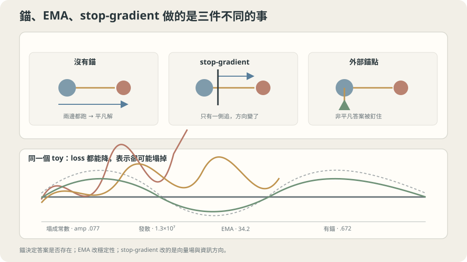

import Objectives from '../../../components/Objectives.astro';
import Ask from '../../../components/Ask.astro';
import Prereq from '../../../components/Prereq.astro';
import Question from '../../../components/Question.astro';
import Answer from '../../../components/Answer.astro';
import QuizBlock from '../../../components/QuizBlock.astro';
import Option from '../../../components/Option.astro';
import Explanation from '../../../components/Explanation.astro';
import VizPlan from '../../../components/VizPlan.astro';
import Remark from '../../../components/Remark.astro';
import Bridge from '../../../components/Bridge.astro';
import UsedBy from '../../../components/UsedBy.astro';
import Ref from '../../../components/Ref.astro';

# 追一隻自己也在跑的狗：目標由自己產生的時候

<Objectives>
- **目標由自己產生時，「損失變小」不再等於「學到東西」。** 寫出自我一致性損失的平凡解，並在 toy 上量出模型塌成常數的樣子（振幅 $0.077$，真值是 $2.00$）。
- **分清三種操作改了什麼。** stop-gradient 改反向傳播，EMA 改目標的更新速度，外部標籤改損失所要求的答案；說明為什麼不能只靠其中一項保證不塌陷。
- **分清平均目標與平均最終權重。** 前者處理移動的標籤，後者可能減少 SGD 權重的抖動；固定係數 EMA 不等於 Polyak–Juditsky 的漸近平均定理。
</Objectives>

<Prereq items={frontmatter.prereqs} />

## 目標自己也在動

前幾篇的 $y_i$ 都寫在資料裡：模型改了，答案不會跟著改。但如果沒有足夠標籤，我們能不能參考模型自己對另一張相似圖片的預測？就像練習時請同學互相核對答案：兩個人越來越一致，不一定代表兩個人越來越對。

但有一大類做法不是這樣：

- **自我蒸餾／mean teacher**：用模型自己（或它的一個平均版本）對未標註資料的預測當標籤。
- **自我一致性**：要求模型在兩個「應該給同樣答案」的輸入上一致（同一張圖的兩種裁切、同一段話的兩種寫法、相鄰的兩個時刻）。
- **任何 bootstrapping**：目標的一部分是模型自己現在的輸出。

這些做法有一個共同的形狀：**損失裡出現了兩次同一個模型**。而這立刻帶來一個危險——

$$
\mathcal L(\theta)=\mathbb E\big[\lVert f_\theta(x)-f_\theta(x')\rVert^2\big]
$$

這個損失有一個完美的解：**讓 $f$ 變成常數**。任何常數函數都讓它等於零，而且是全域最小。追一隻自己也在跑的狗，最省力的結局是兩個都停下來。

<Ask>
目標由模型自己產生的時候，<br />
要靠什麼防止它塌成一個常數？<br />
stop-gradient 與 EMA 各在防哪一件事？
</Ask>

<Question id="Q1">
把「自己產生目標」翻成數學：平凡解為什麼是全域最小？stop-gradient 把哪一項從梯度裡拿掉了？拿掉之後那個更新式還是某個函數的梯度嗎？

<Answer>
**平凡解。** 若 $f_\theta\equiv c$，那麼對任何 $x,x'$ 都有 $f_\theta(x)-f_\theta(x')=0$，所以 $\mathcal L=0$。損失非負，所以那是全域最小。而且不是唯一的——**每一個**常數都是全域最小，這一整個平坦的谷底就是問題所在。

**stop-gradient 拿掉哪一項。** 先用純量輸出看清楚，記 $r=f_\theta(x)-f_\theta(x')$。完整的梯度有兩項：

$$
\nabla_\theta\mathcal L=2\,\mathbb E\big[r\,\nabla_\theta f_\theta(x)\big]-2\,\mathbb E\big[r\,\nabla_\theta f_\theta(x')\big].
$$

第一項是「把預測往目標拉」，第二項是「把目標往預測拉」。stop-gradient 把 $f_\theta(x')$ 當成常數，也就是**只保留第一項**：

$$
g_{\text{sg}}=2\,\mathbb E\big[r\,\nabla_\theta f_\theta(x)\big].
$$

**原來的下降保證還在嗎？** 完整梯度在損失夠光滑、步長夠小時會降低 $\mathcal L$；拿掉第二項後，$g_{\text{sg}}$ 未必還是這個損失的梯度，因此不能直接沿用同一個保證。特定對稱情況下它仍可能是某個函數的梯度，但這不是一般保證。

也要分清兩件事：stop-gradient 沒有改變 forward 計算出的損失值，卻改變了訓練怎麼走。**常數仍能得到零損失，不等於訓練一定會走到常數；反過來，改了更新也不保證一定避開它。**
</Answer>
</Question>

## 三個部件，三件不同的工作

**錨（anchor）**：這裡指少量真標籤或固定教師給的目標。若標籤不是常數，常數預測便不能同時把這些標籤的誤差降到零；但加入標籤後的整體最小值仍取決於模型容量與各項權重，不能只因「有錨」就保證學對。

**EMA**：把目標網路的權重換成移動平均 $\theta^-_{k+1}=\tau\theta^-_k+(1-\tau)\theta_k$（<Ref to="math-ema" mode="title"/>）。$\tau$ 越接近 1，目標越不會跟著單次更新大幅改變。這可能讓追逐較平穩，但不能保證整個系統穩定，也沒有提供答案正確的依據。

**stop-gradient**：這次更新只修正預測那一支，不透過目標那一支反向傳播。它可能是避免塌陷的重要部件，但效果要和 predictor、正規化等結構一起分析；單獨這個操作沒有普遍保證。



**圖說：** stop-gradient 改更新方向，EMA 放慢目標，外部標籤限制答案。圖中的例子不代表所有自監督方法都必須有外部標籤。

## 零損失的答案，和訓練會走到的答案

把上一節的三件事寫成一個可以檢查的判準。

**非平凡解存不存在，是損失的性質，不是最佳化器的性質。** 若 $\mathcal L$ 的全域最小集合包含常數函數，那麼任何**忠實地**最小化 $\mathcal L$ 的演算法都可能走到那裡去。stop-gradient 不改 $\mathcal L$——它改的是你用什麼向量場去走。所以：

> **要改變最小值集合，得改損失或允許的解；要改變訓練會走到哪裡，也可以改更新方式。兩個問題不能混在一起。**

**線性例子可以直接檢查。** 更新若寫成 $\theta_{k+1}=(I-\eta A)\theta_k+\eta b$，誤差在特徵方向上乘的是 $1-\eta\lambda$。要收縮，需要 $|1-\eta\lambda|<1$。半梯度的 $A$ 未必對稱，複數特徵值可以造成轉向；負實部則讓相應方向不穩定。即使 $A$ 對稱、特徵值為正，步長太大仍會發散，所以不能只用「有沒有 stop-gradient」判斷穩定性。

**EMA 加入另一個更新速度。** 目標改用 $\theta^-$ 後，我們要一起分析 $(\theta,\theta^-)$。目標短時間內變動較小，可能減少來回追逐；但整個系統的特徵值、步長與損失構造仍會決定它是否收斂。

<Remark label="注意" summary="「BYOL 沒有負樣本也不會塌」是怎麼回事">
Grill 等人的 BYOL [3] 使用 online／target networks 與移動平均目標；Chen 與 He 的 SimSiam [4] 則不需要 momentum encoder，並在實驗中發現 stop-gradient 是避免塌陷的重要部件。不能把兩者都說成「EMA 防止塌陷」。

它們還有 predictor 等不對稱結構。即使常數表示仍能使一致性損失很小，實際更新也可能避開塌陷解。**本篇簡單的多項式實驗只說明單一部件沒有普遍保證，不能拿來否定這些方法的整體機制。**
</Remark>

## 什麼時候該用，怎麼設

**先問答案受什麼限制。** 半監督學習有真標籤，蒸餾有固定教師；沒有標籤的表示學習，則要檢查資料增強、predictor、正規化或其他約束如何一起避免無資訊的表示。只看到損失下降，還不能回答這個問題。

**$\tau$ 怎麼設。** 記憶長度大約 $1/(1-\tau)$ 步，所以 $\tau$ 要對照「目標要多久才跟上一次真正的變化」。實務上 $\tau=0.99$ 到 $0.9999$；訓練初期模型變化快，常見做法是讓 $\tau$ 從小值開始慢慢升到接近 1。

**監控什麼。** 純一致性損失下降不夠，還要看輸出變異數、特徵的秩，以及下游任務表現。散佈縮小是塌陷的警訊，但不必單調縮小；散佈夠大也不等於表示已經有用。

下面用線性參數化的多項式分開觀察這些操作。真實網路還可能只塌掉部分特徵維度；模型產生的高信心偽標籤也可能有用，但它不是獨立的正確答案，不能用來循環證明模型已經學對。

## 在同一個例子裡分開比較

**第一段：平凡解、發散、與錨。** 共用 toy 的網格上取相鄰的一對 $(x,x+0.02)$，損失是「兩點的預測要一致」。模型是五次多項式（振幅上限足夠）。錨是三個真標籤點 $x\in\{0.05,0.5,0.95\}$，權重 $3.0$。真值 $\sin(2\pi x)$ 在 $[0,1]$ 上的振幅是 $2.00$：

```python
import numpy as np
from ml_toy import truth
xs, ys = truth(); D = 5
mx = np.abs(np.vander(np.linspace(0,1,60), D+1, increasing=True)).max(0)
B  = lambda X: np.vander(X, D+1, increasing=True)/mx
xa = np.array([0.05, 0.5, 0.95]); ya = np.sin(2*np.pi*xa)          # 三個錨
xp = np.linspace(0, 1, 200); xq = np.clip(xp + 0.02, 0, 1)         # 相鄰的一對
Ap, Aq, Aa, As = B(xp), B(xq), B(xa), B(xs)

def train(stopgrad, anchor, tau, eta, T=20000, seed=0):
    rng = np.random.default_rng(seed)
    w = rng.standard_normal(D+1)*0.5; wt = w.copy()
    for k in range(T):
        ref = wt if tau is not None else w
        r = Ap@w - Aq@ref
        g = (Ap.T@r)/len(xp) if stopgrad else (Ap.T@r - Aq.T@r)/len(xp)   # 半梯度 vs 完整梯度
        if anchor: g = g + 3.0*(Aa.T@(Aa@w - ya))/len(xa)
        w -= eta*g
        if tau is not None: wt = tau*wt + (1-tau)*w
        if not np.isfinite(w).all(): return None
    f = As@w
    return f.max() - f.min(), ((f - ys)**2).mean()
```

```
真值的振幅 2.00；「誤差」是與真值的均方差（η=0.02，兩萬步）
  不 stop-grad、沒有 anchor        振幅       0.077   誤差       0.5374
  stop-grad、沒有 anchor           振幅 13017377.180   誤差 1.13e+14
  stop-grad + EMA(0.99)、沒有 anchor 振幅     34.187   誤差     569.6434
  不 stop-grad + anchor            振幅       0.676   誤差       0.3160
  stop-grad + anchor               振幅       0.671   誤差       0.3136
  stop-grad + EMA + anchor         振幅       0.672   誤差       0.3141
```

**四件事，一件一件讀。**

**第一列是平凡解。** 完整梯度忠實地最小化那個損失，於是它找到了全域最小——振幅 $0.077$，模型幾乎是一條水平線。真值的振幅是 $2.00$。**損失確實掉到接近零，而學到的東西是零。**

**第二列是發散，不是塌陷。** 這個半梯度、這個步長與單向配對讓振幅變得很大。要確認原因，應檢查更新矩陣的特徵值；不能只因為沒有使用完整梯度，就斷定一定發散。

**第三列是 EMA 的真正作用。** 振幅從 $1.3\times10^7$ 降到 $34.2$——**六個數量級的改善，但仍然是錯的**（真值 $2.00$）。EMA 把發散放慢了，沒有把它變對。

**後三列加入真標籤後較接近真值，但仍偏平。** 這個實驗的結果相近，不代表不同更新永遠會得到同一個終點。尤其程式把兩項各自取平均，再給標籤項權重 $3$；不是「200 對比 3 點」就等於一致性權重大 200／3 倍。

還要注意：$\sin(2\pi x)$ 在相鄰位置並不完全相等，我們要求的一致性本身就有偏差，而且三個標籤沒有涵蓋波峰與波谷。要改善振幅，應比較一致性權重、標籤位置與訓練是否收斂，而不只是增加 $\tau$。

**第二段：平均最後要使用的權重。** 若固定步長 SGD 在最小點附近持續抖動，最後一次更新未必最具代表性。我們可以照常訓練，另外記錄權重的 EMA，再比較兩者在留出資料上的表現：

```python
wema = 0.99*wema + 0.01*w        # 每一步更新一次；最後拿 wema 去評估
```

```
（正交化特徵、真實風險；直接解 0.02744，不可約誤差 0.0225）
   η     B    最後一步的權重    EMA(0.99) 的權重
  0.05   1       0.02908           0.02854
  0.05   8       0.02831           0.02739
  0.15   1       0.03940           0.02934
  0.15   8       0.02893           0.02752
```

表中 $\eta=0.15$、$B=1$ 那一列，超出直接解的風險從 $0.01196$ 降到 $0.00190$，減少約 $84\%$。這是這次實驗的改善，不是所有模型或每個 seed 都有的比例。

Polyak 與 Juditsky [1] 證明的是特定條件下的**累積平均**與漸近變異數，不是固定係數 EMA 的通用保證。兩者都在平均權重，但使用的權重與成立條件不同；本篇 EMA 的效果應由實驗另外檢查。

## 錨、EMA、stop-gradient：三個開關，四個結局

<iframe loading="lazy" src="/personal_website/notes/research_areas/machine-learning-foundations/l2-optimization-in-practice/l2-2-2.html" class="demo-frame" title="錨、EMA、stop-gradient：三個開關，四個結局：互動 demo" style="height: 898px; width: 100%; border: none;"></iframe>

**互動 demo：損失一路掉，表示的東西卻塌成常數——要監看的是表示的振幅，不是損失。**

## 檢查理解

<QuizBlock id="ml-l2-2-a">
一個自監督訓練的損失從 $0.8$ 平滑地降到 $0.002$，看起來非常順利。要判斷它是不是在學東西，最該看的是：
<Option>驗證集上的損失。</Option>
<Option correct>除了損失，也看輸出變異數、特徵秩與下游表現。常數解可以同時讓訓练與驗證的一致性損失很低。</Option>
<Option>訓練速度是否穩定。</Option>
<Explanation>
這是本篇最實用的一條。第一個選項之所以不夠，是因為平凡解在**任何**資料上都讓一致性損失趨零——留出集救不了你，因為那個損失本身就不指向你要的東西。實務上的做法是在訓練迴圈裡記錄特徵的奇異值或每個維度的變異數，看它們有沒有單調萎縮。
</Explanation>
</QuizBlock>

<QuizBlock id="ml-l2-2-b">
根據本篇的實測，關於 stop-gradient 正確的說法是：
<Option>它讓平凡解不再是全域最小，所以能防止塌陷。</Option>
<Option correct>它不改 forward 的損失值，但拿掉目標支的反向傳播；不能直接沿用原損失的下降保證。</Option>
<Option>它只改目標更新速度，不改反向傳播。</Option>
<Explanation>
第一項把「最小值還在不在」與「更新會走到哪裡」混在一起。第三項描述的是 EMA，不是 stop-gradient。若每步複製權重並把目標當常數，則 $\tau=0$ 可以重現本篇沒有 EMA 的半梯度更新。
</Explanation>
</QuizBlock>

<QuizBlock id="ml-l2-2-c">
在有錨的三列裡，振幅都只有 $0.672$（真值 $2.00$）。最合理的處方是：
<Option>把 $\tau$ 調大。</Option>
<Option correct>比較一致性權重、標籤的位置與覆蓋範圍，並檢查收斂。兩項各自取平均，不能只用樣本數比例推斷誰主導損失。</Option>
<Option>換一個容量更大的模型。</Option>
<Explanation>
相鄰位置的真值並不完全相同，所以一致性要求會把函數壓平；三個標籤又沒有涵蓋波峰與波谷。這些因素都值得做對照實驗，不能只靠一個振幅數字確定唯一原因。
</Explanation>
</QuizBlock>

<QuizBlock id="ml-l2-2-d">
下列哪一句**不對**？
<Option>權重的 EMA 可以在完全不改訓練的情況下降低最終模型的風險，實測拿掉了 $84\%$ 的噪聲地板。</Option>
<Option>目標網路的 EMA 與最終模型的 EMA 用同一條公式，但在解決兩個不同的問題。</Option>
<Option correct>只要目標網路用了足夠大的 $\tau$，自我一致性訓練就不會塌陷。</Option>
<Explanation>
本篇第三列加入 EMA 後仍遠離真值，足以否定第三句的普遍保證。前兩句描述的是可能的用途；第一句的 $84\%$ 只代表表中的一次實驗，不是理論常數。
</Explanation>
</QuizBlock>

<UsedBy slug={frontmatter.slug} />

<Bridge to="ml-regularization">
更新走得穩，還不等於有限資料下學到的答案會泛化。能不能限制模型不要把訓練資料裡的細節全學進去？下一篇比較限制參數、提早停止與 dropout，再用線性模型看清楚它們相似與不同的地方。
</Bridge>

## 參考文獻

1. Polyak, B. T., Juditsky, A. [*Acceleration of Stochastic Approximation by Averaging.*](https://doi.org/10.1137/0330046) SIAM Journal on Control and Optimization 1992.（特定條件下累積平均的漸近理論；不等於固定係數 EMA 的保證。）
2. Tarvainen, A., Valpola, H. [*Mean teachers are better role models.*](https://arxiv.org/abs/1703.01780) NeurIPS 2017.（EMA 目標網路在半監督學習裡的標準做法，以及 $\tau$ 的實務範圍。）
3. Grill, J.-B. et al. [*Bootstrap Your Own Latent.*](https://arxiv.org/abs/2006.07733) NeurIPS 2020.（online／target networks 與移動平均目標。）
4. Chen, X., He, K. [*Exploring Simple Siamese Representation Learning.*](https://arxiv.org/abs/2011.10566) CVPR 2021.（沒有 momentum encoder 的 SimSiam，以及 stop-gradient 的實驗分析。）
