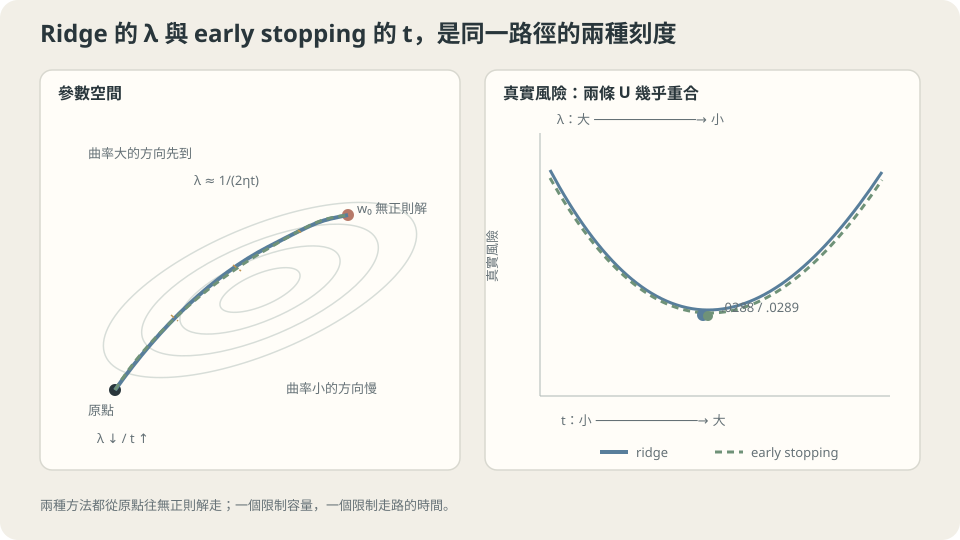

import Objectives from '../../../components/Objectives.astro';
import Ask from '../../../components/Ask.astro';
import Prereq from '../../../components/Prereq.astro';
import Question from '../../../components/Question.astro';
import Answer from '../../../components/Answer.astro';
import QuizBlock from '../../../components/QuizBlock.astro';
import Option from '../../../components/Option.astro';
import Explanation from '../../../components/Explanation.astro';
import VizPlan from '../../../components/VizPlan.astro';
import Remark from '../../../components/Remark.astro';
import Details from '../../../components/Details.astro';
import Bridge from '../../../components/Bridge.astro';
import UsedBy from '../../../components/UsedBy.astro';
import Ref from '../../../components/Ref.astro';

# 限制筆記頁數，或考前一天停止補習：正則化與提早停止

<Objectives>
- **說出三種做法限制了什麼。** ridge 懲罰參數大小，提早停止限制更新次數，dropout 改變訓練時使用的單元；效果仍要由驗證資料比較。
- **推導 ridge 與提早停止的相似處。** 固定線性模型、零初始化與平方損失，逐方向比較兩個縮放因子，得到尺度關係 $\lambda\approx1/(\eta t)$，而非完全等價。
- **分清診斷與保證。** 正則化太強可能造成欠擬合，但訓練／驗證誤差接近不能單獨證明任何正則化都無效。
</Objectives>

<Prereq items={frontmatter.prereqs} />

## 兩種不讓學生死背的方法

<Ref to="ml-overfitting-underfitting" mode="title"/> 裡那個把考古題全背下來的學生，有兩種完全不同的干預方式。

**限制筆記頁數。** 考試允許帶一張 A4 的手寫筆記。一張紙塞不下五年的題目與答案，所以他被迫寫下**規則**而不是**答案**。限制的是「他能記住多少」。

**考前一天就停止補習。** 課照上、筆記照抄，但在他開始逐題背答案之前就把時間切斷。限制的是「他有多少時間去記」。

一個限制能寫下多少，另一個限制練多久；它們都可能避免死背，也都可能連重要規則一起限制掉。**這些做法究竟限制了哪些答案？** 我們先用線性模型把這件事算出來，再看什麼時候對新資料有幫助。

<Ask>
限制容量與限制時間，<br />
為什麼會有同樣的效果？<br />
它們的失效方式也一樣嗎？
</Ask>

<Question id="Q1">
把「限制筆記頁數」翻成數學：加一項懲罰之後，最小化的東西變成什麼？那一項是怎麼影響解的——它把解往哪裡拉？以及，為什麼「懲罰參數的大小」會讓函數變平滑？

<Answer>
**寫下來。** 原本的目標是經驗風險 $\widehat R_n(f_w)$；加上一項對參數大小的懲罰：

$$
\frac{1}{2n}\lVert Vw-y\rVert^2+\frac{\lambda}{2}\lVert w\rVert^2 .
$$

$\lambda$ 決定我們願意用多少訓練誤差換取較小的參數。兩項都放 $1/2$ 是為了讓梯度公式簡單；$\lambda=0$ 回到最小平方，這裡若所有座標都被懲罰，$\lambda\to\infty$ 會把參數壓向零。

**它把解往哪裡拉。** 平方損失下有 closed form。令 $V$ 是設計矩陣，$H=\frac1nV^\top V$，最小點滿足

$$
(H+\lambda I)\,w=\frac1nV^\top y
\quad\Longrightarrow\quad
w_\lambda=(H+\lambda I)^{-1}\tfrac1nV^\top y .
$$

把它投影到 $H$ 的特徵向量上（$H$ 的特徵值 $\mu_j$），第 $j$ 個分量是

$$
w_\lambda^{(j)}=\frac{\mu_j}{\mu_j+\lambda}\cdot w_{0}^{(j)},
$$

也就是把無正則化的解逐方向乘上一個介於 $0$ 與 $1$ 的縮放。**關鍵在那個縮放依賴 $\mu_j$**：曲率大的方向（$\mu_j\gg\lambda$）幾乎不動，曲率小的方向（$\mu_j\ll\lambda$）幾乎被砍掉。

**參數小，為什麼可能限制振盪？** 固定特徵 $f_w(x)=w^\top\phi(x)$ 時，$|f_w'(x)|\leq\lVert w\rVert\lVert\phi'(x)\rVert$。參數範數因此能限制這組特徵下的變化；但換一種特徵尺度，限制就不同。小曲率代表訓練誤差對某個方向不敏感，不代表那裡所有參數都同樣好；只有零曲率才可能完全無法區分。

這也已經預告了本篇的第二個結果：梯度下降從 $w=0$ 出發，也是**先把曲率大的方向學好、曲率小的方向要很久才動**（<Ref to="ml-gradient-descent" mode="title"/> 的每步收縮率是 $1-\eta\mu_j$）。兩件事在同一組方向上做同一種取捨——難怪它們的效果會一樣。
</Answer>
</Question>

## 三種做法，同一個座標

把三種常見的正則化放在「它限制了什麼」這一欄上：

- **weight decay（$L_2$／ridge）**：限制參數的**大小**。逐方向的縮放 $\mu_j/(\mu_j+\lambda)$，資料約束強的方向留著、弱的方向砍掉。
- **提早停止**：限制**訓練時間**。梯度下降 $t$ 步之後，第 $j$ 個方向被學到的比例是 $1-(1-\eta\mu_j)^t$——同樣是強的先學好、弱的還沒動。
- **dropout**：訓練時隨機把一部分單元設成零，限制模型**依賴任何單一路徑**的程度。在線性模型上它可以被算成一個與輸入尺度相關的 $L_2$ 懲罰；在深層網路上它的效果更接近「同時訓練指數多個共享權重的子網路再平均」。

在簡單線性例子中，這些限制常用偏差換取較低的變異數；但這不是任意深層網路上的單調定理。要判斷值不值得，仍須比較驗證表現，也要排除資料、最佳化與模型容量的問題。



**圖說：** ridge 與 early stopping 都從原點朝無正則化解前進，並優先學會曲率大的方向。

## 提早停止與 ridge，限制的是哪些方向？

把兩者都投影到 $H$ 的特徵向量上，逐方向比較「學到了多少比例」。

**Ridge**（上面 Q1 算過）：

$$
\text{比例}_j^{\text{ridge}}=\frac{\mu_j}{\mu_j+\lambda}.
$$

**梯度下降 $t$ 步**（從 $w=0$ 出發，二次損失）：每一步誤差乘上 $1-\eta\mu_j$，所以

$$
\text{比例}_j^{\text{GD}}=1-(1-\eta\mu_j)^t\approx1-e^{-\eta\mu_j t}.
$$

假設 $0<\eta\leq1/\mu_{\max}$，這些比例會由零逐漸增加。當 $\eta\mu_j$ 小時，可用指數近似：兩個轉折尺度分別是 $\mu_j\approx\lambda$ 與 $\mu_j\approx1/(\eta t)$。把尺度對起來，就得到

$$
\boxed{\ \lambda\approx\frac{1}{\eta t}\ }
$$

> **提早停止也在篩選特徵方向，但它的縮放因子與 ridge 不同；$1/(\eta t)$ 是相似尺度，不是讓所有方向完全相等的參數。**

這也說明停止步數要和學習率一起看：同樣 1000 步，不同 $\eta$ 學到的比例不同。若使用 schedule，就要比較各步縮放因子的乘積；不能直接套一個固定的 $\eta t$。明確正則化與提早停止可以同時使用，是否還有改善要另外驗證。

<Details summary="兩個比例函數的差別在哪裡，以及它對「谷底很平」的意義">
$\frac{\mu}{\mu+\lambda}$ 與 $1-e^{-\eta\mu t}$ 不完全相同：前者在 $\mu\ll\lambda$ 時像 $\mu/\lambda$（線性趨零），後者像 $\eta\mu t$（也線性趨零，斜率不同）；在 $\mu\gg$ 轉折點時前者趨近 $1$ 的速度是 $1-\lambda/\mu$，後者是指數的 $1-e^{-\eta\mu t}$，**後者收得快得多**。

實務上的意思是：提早停止在「已經學好的方向」上比 ridge 更接近無正則化解，在「還沒學到的方向」上兩者行為類似。所以兩條 U 形曲線的**谷底高度**幾乎一樣（本篇實測 $0.0288$ 對 $0.0289$），但曲線的形狀不完全重合——本篇最後那張配對表在 $t$ 小的時候差得比較多（$0.1312$ 對 $0.1131$），$t$ 大之後對到小數第三位。

這個例子的最佳風險接近，只是實驗觀察，不保證其他資料的兩個最佳解也接近。調整時應看驗證曲線的敏感程度，而不是預先假設谷底一定很平。
</Details>

<Remark label="注意" summary="weight decay 在 Adam 上不是同一件事">
上面的等價是在**梯度下降**上推的。用 Adam 時，如果把 weight decay 實作成「加在梯度上的一項」$g\leftarrow g+\lambda w$，那一項也會被 Adam 的 $\sqrt{\hat s}$ 分母除掉——於是梯度大的座標，實際受到的衰減比較小。**衰減強度變成隱含地依賴梯度尺度**，而那不是任何人想要的。

AdamW 的修法是把衰減直接寫在更新上，不經過那個分母：

$$
w\leftarrow w-\eta\,\frac{\hat m}{\sqrt{\hat s}+\epsilon}-\eta\lambda w .
$$

這也是為什麼同一個 $\lambda$ 在 SGD 與 Adam 之間不能直接搬——兩者的有效衰減強度差一個與梯度尺度有關的因子。細節見 <Ref to="ml-optimizers" mode="title"/> 的 `<Details>`。
</Remark>

## 什麼時候該加，什麼時候是純虧

**先問誤差的來源。** 訓練誤差低、驗證誤差高時，限制模型值得一試；兩者都高時，先檢查容量、資料與最佳化。這些是線索，不是只靠兩個數字就能確定的 bias–variance 分解。

**怎麼比較？** 固定資料切分與其他設定，先比較少量強度。提早停止雖可能省訓練時間，選停止時刻仍在使用驗證集；最後表現需要獨立測試集。幾種做法可以混用，但最佳強度沒有必然的大小關係。

**這一切依賴什麼。** 一，上面的 closed form 與等價是**平方損失＋線性模型**的結果；非線性模型上只剩「同一個方向」這個定性結論。二，$\lVert w\rVert^2$ 對所有座標一視同仁，所以它**依賴特徵的尺度**——沒有標準化過的特徵，同一個 $\lambda$ 對不同座標的實際強度差好幾個數量級（又一次回到 <Ref to="ml-gradient-descent" mode="title"/> 的那件事）。三，bias 項通常不該被衰減（它不控制平滑度，只控制平移）。

## 把兩條路徑量出來

共用 toy（$n=30$）、**二十次**多項式。下列特徵使用各欄最大絕對值縮放，不是零均值、單位變異數的標準化。高次單項式的 normal equations 仍可能非常病態；表中的數字是實驗紀錄，不應當成精確最小值的證明。

**第一段：ridge 的 $\lambda$ 掃描。**

```python
import numpy as np
from ml_toy import toy_1d, truth, NOISE

xs, ys = truth(); x, y = toy_1d(n=30, seed=0); n = len(x); D = 20
mx = np.abs(np.vander(np.linspace(0,1,80), D+1, increasing=True)).max(0)
B = lambda X: np.vander(X, D+1, increasing=True)/mx
A, As = B(x), B(xs)
risk = lambda w: ((As@w - ys)**2).mean() + NOISE**2

for lam in (0, 1e-8, 1e-6, 1e-4, 1e-3, 1e-2, 1e-1, 1, 10):
    w = np.linalg.solve(A.T@A + lam*n*np.eye(D+1), A.T@y)
    print(f"  λ={lam:<8} 訓練 {((A@w-y)**2).mean():.4f}   真實風險 {risk(w):.4f}")
```

```
  λ=0        訓練 0.0106   真實風險 0.0321
  λ=1e-08    訓練 0.0129   真實風險 0.0288
  λ=1e-06    訓練 0.0134   真實風險 0.0292
  λ=0.0001   訓練 0.0208   真實風險 0.0406
  λ=0.001    訓練 0.0578   真實風險 0.0831
  λ=0.01     訓練 0.1246   真實風險 0.1709
  λ=0.1      訓練 0.1898   真實風險 0.2902
  λ=1        訓練 0.3139   真實風險 0.4439
  λ=10       訓練 0.3929   真實風險 0.5001
```

這次掃描的最佳值在 $\lambda=10^{-8}$ 附近；太大的 $\lambda$ 會把重要方向一起壓掉。若比較的是同一個問題的精確 ridge 最小解，隨 $\lambda$ 增大，參數範數不增、訓練誤差不減；「不減」允許相等，不代表每一格都嚴格變大。數值病態時還要先確認求解器的誤差。

**第二段：提早停止，同一個模型、$\lambda=0$。**

```python
w = np.zeros(D+1); eta = 1.8/np.linalg.eigvalsh(A.T@A/n)[-1]
for t in range(1, 1000001):
    w -= eta*(A.T@(A@w - y))/n
```

```
  第      30 步   訓練 0.1397   真實風險 0.1896
  第     100 步   訓練 0.1265   真實風險 0.1617
  第     300 步   訓練 0.1008   真實風險 0.1312
  第   1,000 步   訓練 0.0546   真實風險 0.0787
  第   3,000 步   訓練 0.0294   真實風險 0.0526
  第  10,000 步   訓練 0.0194   真實風險 0.0404
  第 100,000 步   訓練 0.0137   真實風險 0.0301
  第 1,000,000 步 訓練 0.0134   真實風險 0.0289
```

**最好的風險是 $0.0289$**——對照 ridge 的 $0.0288$。**兩個完全不同的干預，最佳風險差在小數第四位。**

**第三段：比較相近尺度。** 下面保留原實驗使用 $\lambda=1/(2\eta t)$ 的紀錄（$\eta=0.7634$）。它比上面推導的尺度小一倍，只是另一組對照，不是精確對應；兩個方法的比例函數本來也不相同。

```
  t=    300  提早停止 0.1312   ridge λ=2.18e-03 → 0.1131
  t=  3,000  提早停止 0.0526   ridge λ=2.18e-04 → 0.0493
  t= 30,000  提早停止 0.0319   ridge λ=2.18e-05 → 0.0323
  t=300,000  提早停止 0.0293   ridge λ=2.18e-06 → 0.0294
```

**後兩列對到小數第三位**（$0.0319$／$0.0323$，$0.0293$／$0.0294$）。前兩列差得比較多（$0.1312$／$0.1131$），原因寫在上面的 `<Details>` 裡：兩個比例函數在「已經學好的方向」上收斂速度不同，$t$ 小的時候那個差別還沒被抹平。

> **相近的風險不等於相同的參數路徑。它們都會限制弱特徵方向，但篩選的方式不同。**

**刻意違反：對一個欠擬合的模型加 weight decay。**

```
  degree  2: λ=0  0.2668   λ=1e-06 0.2668   λ=0.001 0.2673   λ=0.1  0.3456
  degree 20: λ=0  0.0320   λ=1e-06 0.0292   λ=0.001 0.0831   λ=0.1  0.2902
```

degree 2 在**這些測試過的強度**沒有改善；這不能證明所有正的 $\lambda$ 都無效。degree 20 的對照則顯示，小幅限制在這次資料上可能改善風險。

原因是 <Ref to="ml-bias-variance" mode="title"/> 的三項分解：degree 2 的 variance 只有 $0.0022$，而 bias² 是 $0.2004$。正則化能壓的是那 $0.0022$，代價是抬高那已經很大的 $0.2004$——**要壓的東西幾乎不存在，要付的代價卻照付。**

這就是實務上最貴的一種誤診：模型表現不好 → 加正則化 → 更差 → 加更多。**加正則化之前先做 <Ref to="ml-learning-curves" mode="title"/> 的兩條曲線**，看間距還有沒有東西可以壓。

## 兩個刻度，一條路徑

<iframe loading="lazy" src="/personal_website/notes/research_areas/machine-learning-foundations/l2-optimization-in-practice/l2-3-2.html" class="demo-frame" title="兩個刻度，一條路徑：互動 demo" style="height: 880px; width: 100%; border: none;"></iframe>

**互動 demo：比較 ridge 與提早停止的縮放。兩者尺度約在 λ ≈ 1/(ηt) 附近相接，但不會逐方向完全相同。**

## 檢查理解

<QuizBlock id="ml-l2-3-a">
一個團隊的模型訓練誤差 $0.19$、驗證誤差 $0.20$（任務的不可約誤差約 $0.02$）。他們決定「加強 weight decay」。根據本篇的實測，最可能的結果是：
<Option>驗證誤差下降，因為正則化總是有幫助。</Option>
<Option correct>先檢查容量、資料與最佳化，再用驗證實驗比較正則化強度；兩個高而接近的誤差不能單獨確定原因。</Option>
<Option>沒有變化，因為 weight decay 只影響訓練誤差。</Option>
<Explanation>
正則化不是所有誤差的共同處方。若主要問題是模型無法表示答案，加強限制可能更差；若是最佳化不穩或其他因素，效果又可能不同，所以要用對照確認。
</Explanation>
</QuizBlock>

<QuizBlock id="ml-l2-3-b">
兩個團隊在同一個問題上得到幾乎相同的驗證分數：A 用了 weight decay $\lambda=10^{-8}$ 且訓練到收斂，B 完全不用 weight decay 但在第三十萬步停下。最合理的解讀是：
<Option>巧合，兩個做法沒有關係。</Option>
<Option correct>兩者可能限制了相近的弱特徵方向，但相同驗證分數不證明參數或預測相同；也不能用一個 $\lambda$ 完全重現所有方向的梯度下降縮放。</Option>
<Option>B 的做法比較好，因為它省了訓練時間。</Option>
<Explanation>
比較 $\mu/(\mu+\lambda)$ 與 $1-(1-\eta\mu)^t$ 就能看見相似與差異。訓練到哪一步與正則化強度應一起驗證，不能把「分數相近」當作方法等價的證明。
</Explanation>
</QuizBlock>

<QuizBlock id="ml-l2-3-c">
在 ridge 的逐方向縮放 $\mu_j/(\mu_j+\lambda)$ 裡，$\lambda$ 主要影響的是：
<Option>所有方向被等比例縮小。</Option>
<Option correct>只有曲率小的方向（$\mu_j\ll\lambda$）被大幅砍掉，曲率大的方向幾乎不動。而曲率小的方向正是「資料沒怎麼約束」的方向——所以 $\lambda$ 在那些方向上替你挑了一個保守的答案。</Option>
<Option>bias 項（截距）被縮小得最多。</Option>
<Explanation>
「等比例縮小」是對 $\lambda$ 最常見的誤解，而它會讓人以為 ridge 只是把整個函數壓平。真正發生的是**逐方向的篩選**，這也解釋了為什麼它和提早停止等價——梯度下降也是強的方向先學好。第三個選項則指出一個實作細節：截距通常**不該**被衰減（它不控制平滑度），多數函式庫預設把它排除在懲罰之外。
</Explanation>
</QuizBlock>

<QuizBlock id="ml-l2-3-d">
下列哪一句**不對**？
<Option>同一個問題若每次求到精確 ridge 最小解，增大 $\lambda$ 時，訓練誤差不會下降，但可以維持相同。</Option>
<Option>同一個 $\lambda$ 在 SGD 與 Adam 上的有效衰減強度不同，這是 AdamW 存在的理由。</Option>
<Option correct>只要 $\lambda$ 選得夠小，weight decay 對任何模型都至少不會有害。</Option>
<Explanation>
沒有一個正的強度能保證對所有模型都無害。第一句的不減性依賴精確求解，且允許相等；訓練誤差沒有明顯變大，不能單獨判定實作錯誤。
</Explanation>
</QuizBlock>

<UsedBy slug={frontmatter.slug} />

<Bridge to="ml-loss-landscape">
二次模型讓我們看清楚步長與縮放，但一般神經網路的損失不一定是單一碗，也不一定有唯一最小點。同一個訓練方法，從不同初始化出發會怎麼走？下一篇回到這個尚未處理的問題。
</Bridge>

## 參考文獻

1. Hoerl, A. E., Kennard, R. W. [*Ridge Regression: Biased Estimation for Nonorthogonal Problems.*](https://doi.org/10.1080/00401706.1970.10488634) Technometrics 1970.（ridge 的原始論文與逐方向縮放 $\mu/(\mu+\lambda)$ 的來源。）
2. Yao, Y., Rosasco, L., Caponnetto, A. [*On Early Stopping in Gradient Descent Learning.*](https://doi.org/10.1007/s00365-006-0663-2) Constructive Approximation 2007.（提早停止作為隱含正則化的嚴格版本，含收斂率與 $\lambda\leftrightarrow1/(\eta t)$ 的對應。）
3. Srivastava, N. et al. [*Dropout: A Simple Way to Prevent Neural Networks from Overfitting.*](https://jmlr.org/papers/v15/srivastava14a.html) JMLR 2014.（dropout 的原始論文；線性模型上與 $L_2$ 的關係、以及「訓練指數多個子網路」的解讀都在這裡。）
