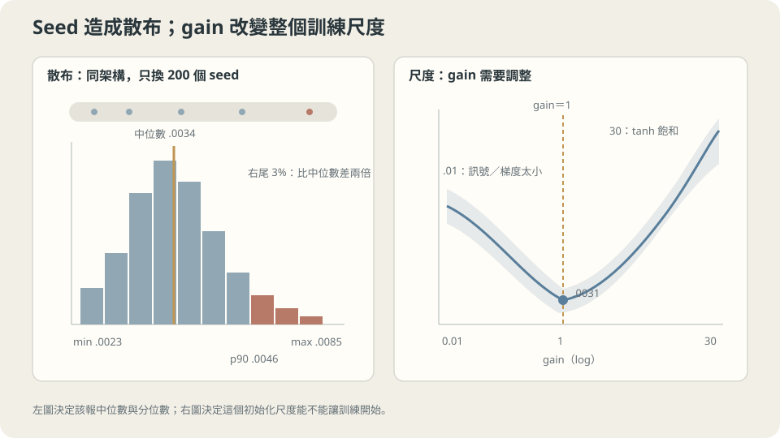

import Objectives from '../../../components/Objectives.astro';
import Ask from '../../../components/Ask.astro';
import Prereq from '../../../components/Prereq.astro';
import Question from '../../../components/Question.astro';
import Answer from '../../../components/Answer.astro';
import QuizBlock from '../../../components/QuizBlock.astro';
import Option from '../../../components/Option.astro';
import Explanation from '../../../components/Explanation.astro';
import VizPlan from '../../../components/VizPlan.astro';
import Remark from '../../../components/Remark.astro';
import Bridge from '../../../components/Bridge.astro';
import UsedBy from '../../../components/UsedBy.astro';
import Ref from '../../../components/Ref.astro';

# 同一張地圖從不同地方出發：損失曲面與初始化

<Objectives>
- **量出非凸帶來的實際散佈，而不是只說「有很多局部極小」。** 用 200 個隨機起點的最終損失分布說出散佈有多大、以及該報什麼統計量。
- **說出初始化的尺度是一個要調的設定，並用一條掃描把最佳位置找出來。** 解釋兩端各自壞在哪裡（訊號太小、飽和）。
- **判斷「深就會梯度消失」這個說法在什麼條件下成立。** 用第一層／最後一層的梯度比值實測，並說出未縮放的殘差把問題換成了什麼。
</Objectives>

<Prereq items={frontmatter.prereqs} />

## 同一張地圖，兩個登山口

前幾篇用二次損失算清楚了步長、momentum 與逐方向縮放。但那些公式不能原封不動套到一般網路上：若損失像一張有許多山谷的地圖，同樣沿下坡走，換個登山口會不會走到不同地方？

線性模型的平方損失是凸的；設計矩陣滿秩時才有唯一最小點。非線性網路則一般不保證凸，所以初始化可能影響走到的解，也會影響一開始的訊號與梯度。

這在實務上表現成一件每個人都遇過的事：**同一份程式、只換 random seed，跑出來的分數不一樣。**

問題是這件事有多嚴重。常見的說法是「高維空間裡到處都是局部極小」，聽起來像是每次都在賭運氣。這一篇要把它量出來——結果比那個說法溫和得多，而真正該花時間調的是另一個東西。

<Ask>
同一個架構、同一份資料，只換隨機起點，<br />
會下到同一個谷底嗎？<br />
如果不會，那我該調的是哪個設定？
</Ask>

<Question id="Q1">
把「同一張地圖、不同登山口」翻成數學：非凸到底讓哪一個保證失效了？初始化在這件事裡扮演什麼角色——它只是「隨機起點」，還是一個要調的超參數？

<Answer>
**失效的是「局部訊息足以判斷全域」這個保證。** 凸函數有一個很強的性質：$\nabla L(\theta)=0$ 就是全域最小。梯度是**局部**的量（<Ref to="math-gradient" mode="title"/>），而凸性讓這個局部的量帶著全域的資訊。非凸之後這個橋斷了——$\nabla L=0$ 只告訴你「這裡是平的」，它可能是局部極小、鞍點、或一片平原。

在光滑、步長夠小且梯度非零時，Taylor 的局部下降論證仍成立；但局部下降不保證走到全域最小，也不保證有限時間內收斂。同一個方法還要考慮起點、步長與停止時間。

**初始化不只是「隨機起點」，它至少決定三件事。**

1. **落在哪個盆地。** 這是上面說的那件事，它給了 seed 之間的散佈。
2. **一開始的梯度有多大。** 權重的尺度直接決定前向訊號的尺度，而前向訊號的尺度又決定反向梯度的尺度。太小 → 幾乎沒有梯度可走；太大 → 落在飽和區（$\tanh$ 的導數趨近零）或直接越過穩定門檻。
3. **每一層拿到的梯度比例。** 反向傳播會逐層乘上 Jacobian。尺度、激發函數與深度共同決定這個乘積是否變小或變大；不能把原因只歸給其中一項。

所以 gain（初始化的標準差乘數）是一個和學習率同等地位的超參數，而不是一個實作細節。
</Answer>
</Question>

## 兩件要分開的事：散佈與尺度

**散佈**是「同一個設定跑很多次會差多少」。它決定你該怎麼**報告**結果（<Ref to="ml-seeds-and-reporting" mode="title"/> 會處理報告的部分），以及「A 比 B 好 $2\%$」這句話有沒有意義。

**尺度**是「初始化的權重該多大」。它決定訓練**能不能開始**。這是一個可以先驗算出來的東西，而經典的答案是讓每一層的前向訊號變異數大致守恆：權重取標準差 $\propto 1/\sqrt{\text{fan-in}}$（Glorot／He 初始化，參考文獻 1、2）。本篇用的 gain 就是在那個基準上再乘一個倍數，$\text{gain}=1$ 表示照基準。

兩件事的診斷方式不同：散佈要**跑很多個 seed 看分布**；尺度要**在初始化時量前向與反向的統計量**，不必訓練。



**圖說：** seed 散布決定該報哪些統計量；初始化尺度則決定訊號與梯度能否進入可訓練區間。

## 深度會不會讓梯度消失

先把「梯度消失」寫成一個可以量的東西。深層網路裡第一層的梯度是一串因子的乘積（鏈式法則）：

$$
\nabla_{h_0}L=J_1^\top J_2^\top\cdots J_D^\top\nabla_{h_D}L,
\qquad J_\ell=\operatorname{diag}(\sigma'(z_\ell))W_\ell.
$$

這裡 $h_\ell=\sigma(W_\ell h_{\ell-1}+b_\ell)$，$J_\ell$ 描述這一層如何改變輸入；參數梯度還會乘上對應層的輸入。如果每層在梯度方向上的放大比例都大約是 $c$，乘積就可能像 $c^D$：

- $c<1$：指數衰減 → **梯度消失**，深層的前段學不動。
- $c>1$：指數放大 → **梯度爆炸**。
- $c\approx1$：比較有機會維持量級，但矩陣的方向與奇異值仍重要。

**關鍵是 $c$ 由什麼決定。** 它是「權重的尺度」乘上「激發函數導數的典型值」——**兩個都由初始化的 gain 控制**。$1/\sqrt{\text{fan-in}}$ 這個選擇的整個目的就是把 $c$ 調到 $1$ 附近。

> **深度讓逐層相乘的效應累積；初始化是在調整每一層的因子，不是消除深度的影響。**

固定 gain 掃深度，是檢查這件事的一種方法。但除了第一層／最後一層的比值，也要量兩者的絕對範數：兩邊一起變小時，比值仍可能不變。

<Remark label="注意" summary="殘差連接把問題換成了另一個">
殘差連接 $h_{\ell+1}=h_\ell+\sigma(W_\ell h_\ell)$ 讓局部 Jacobian 多出 identity：$I+J_{F_\ell}$。這提供直接傳遞的分支，但總梯度仍由所有分支共同決定；若 $J_{F_\ell}$ 抵消 identity，梯度仍可能縮小，不能把殘差當成不消失的保證。

但那條通路也不會**縮小**：每一層都把訊號加上一份自己的輸出，所以前向與反向的量級都隨深度**成長**。本篇最後量到的比值是 $0.23\to0.52\to1.36\to13.0\to328$（深度 $2$ 到 $32$）——從「平的」變成「指數爆炸」。

修法是把那一份縮小：$h_{\ell+1}=h_\ell+\alpha\,\sigma(W_\ell h_\ell)$ 取 $\alpha=1/\sqrt{D}$ 或 $\alpha$ 可學（初始化為 $0$），或者在每個 block 裡放一個正規化層把量級拉回來。**這就是為什麼殘差幾乎總是和正規化層一起出現**——它們修的是相反方向的兩個病。<Ref to="ml-unet" mode="title"/> 會回到這件事。
</Remark>

## 兩個設定各怎麼調

**尺度先調，而且不用訓練就能調。** 做法：初始化之後跑一個 batch 的前向，看每一層輸出的標準差。理想是各層大致相同（不隨深度衰減或放大）；同時反向一次，看第一層與最後一層的梯度大小比。這兩個數字五分鐘就量得到，而它們決定訓練能不能開始。

**散佈用來決定報告方式，不是用來挑 seed。** 跑 5–10 個 seed，報**中位數與範圍**。挑最好的那個 seed 來報告，就是 <Ref to="ml-data-splits" mode="title"/> 講的選擇偏差再來一次——只是這次選的是隨機性而不是超參數。

**這一切依賴什麼。** 一，本篇的網路很小（兩層 32 單元）。散佈的大小隨規模改變，而且方向不是單調的：更大的網路在很多任務上散佈**更小**（過參數化讓不同盆地的品質趨近），但更深的網路對初始化更敏感。二，本篇量的是**訓練**損失的散佈；泛化的散佈是另一個量，通常更大。三，用 Adam 訓練會壓掉一部分初始化的影響（它的逐座標尺度會自我調整），所以同一組實驗用 SGD 跑，尺度那條曲線會更陡。

## 把散佈與尺度量出來

模型是一個 $1\to32\to32\to1$ 的 $\tanh$ 網路，Adam $\eta=0.01$ 跑 4000 步，資料是共用 toy 的 30 個點。

**第一段：200 個隨機起點。**

```python
import numpy as np, mlp                      # mlp.py：三十行的 numpy MLP，見本節末
from ml_toy import toy_1d
x, y = toy_1d(n=30, seed=0); X = x[:,None]

fin = []
for s in range(200):
    P = mlp.init([1,32,32,1], gain=1.0, rng=np.random.default_rng(s))
    P, L = mlp.adam_train(P, X, y, T=4000, eta=0.01)
    fin.append(L)
fin = np.array(fin)
print(f"最小 {fin.min():.4f}  中位數 {np.median(fin):.4f}  第90百分位 {np.percentile(fin,90):.4f}  最大 {fin.max():.4f}")
print(f"比中位數差兩倍以上的比例：{(fin > 2*np.median(fin)).mean()*100:.1f}%")
```

```
最小 0.0023  中位數 0.0034  第90百分位 0.0046  最大 0.0085
比中位數差兩倍以上的比例：3.0%
```

**散佈存在，但它不是「每次都在賭運氣」。** 中位數 $0.0034$、第 90 百分位 $0.0046$——九成的 seed 落在中位數的 $1.35$ 倍以內。最大值 $0.0085$ 是中位數的 $2.5$ 倍，而落在那個尾巴裡的只有 $3\%$。

這提醒我們不要只報一個 seed；但第 90 百分位相對中位數的比例，不是統計顯著性的門檻。比較兩種方法時，要直接看它們的多次結果與配對差異。

這些是訓練 4000 步後的損失，不一定是局部極小值。損失數字散在一段範圍，也不能證明參數空間中的低損失區域連通；要談地形還需要另外的分析。

**第二段：初始化尺度的掃描。** 同一個架構，只改 gain（每個 gain 跑 12 個 seed 取中位數）：

```
  gain=0.01   最終訓練 MSE 中位數 0.0064   最差 0.0135
  gain=0.1    最終訓練 MSE 中位數 0.0057   最差 0.0059
  gain=1      最終訓練 MSE 中位數 0.0031   最差 0.0061
  gain=3      最終訓練 MSE 中位數 0.0066   最差 0.0089
  gain=10     最終訓練 MSE 中位數 0.0108   最差 0.0133
  gain=30     最終訓練 MSE 中位數 0.0156   最差 0.0523
```

**又是一個 U 形，谷底正好在 gain$=1$**（也就是 $1/\sqrt{\text{fan-in}}$ 那個基準）。兩端壞得方式不同：gain$=0.01$ 時權重太小，前向訊號幾乎是零、反向梯度也幾乎是零，4000 步還沒走到（$0.0064$，而且最差的那個 seed 是 $0.0135$）；gain$=30$ 時大部分單元一開始就落在 $\tanh$ 的飽和區（導數趨近零），$0.0156$，而且最差的那個 seed 是 $0.0523$——**尺度太大時 seed 之間的散佈也跟著變大**。

注意這個掃描的範圍：從谷底往兩邊各差 $30$ 倍，損失只變差 $2$ 到 $5$ 倍。**它比學習率溫和**（<Ref to="ml-gradient-descent" mode="title"/> 的 $\eta$ 跨過門檻是 $10^{122}$），但它是一個實實在在的設定，而且因為它在訓練開始前就決定，**調錯了不會給你任何錯誤訊息**。

**第三段：深度與梯度的比值。** 量初始化時 $\lVert\partial L/\partial W_1\rVert$ 與 $\lVert\partial L/\partial W_{\text{last}}\rVert$ 的比（8 個 seed 的中位數）：

```
（tanh，每層 32 單元，無殘差）
 depth     gain=0.5       gain=1       gain=2
     2     1.61e-01     1.64e-01     1.90e-01
     8     1.75e-01     2.26e-01     4.41e-01
    16     1.87e-01     2.28e-01     7.99e-01
    32     1.86e-01     2.19e-01     7.63e+00
```

gain$=0.5$ 與 $1$ 的梯度比值在這個實驗中沒有明顯下降。但只看比例還不能排除兩端一起變小，應把各層的絕對梯度與更新量一起畫出來。

而 gain$=2$ 那一欄從 $0.19$ 爬到 $7.63$——**同一個深度、只把初始化放大兩倍，就從「平的」變成「放大 40 倍」**。第三個結論因此是：

> **這組結果顯示 gain 很重要；它不是「深度無關」的證明。**

**刻意違反：加上未縮放的殘差連接。**

```
（同上，加 h_{ℓ+1} = h_ℓ + tanh(W_ℓ h_ℓ)）
 depth      無殘差       有殘差
     2    1.64e-01    2.26e-01
     4    1.93e-01    5.20e-01
     8    2.26e-01    1.36e+00
    16    2.28e-01    1.30e+01
    32    2.19e-01    3.28e+02
```

**殘差把「平的」變成「指數爆炸」**：深度 32 時比值是 $328$，而無殘差是 $0.22$。原因寫在上面的 `<Remark>` 裡——每一層都把訊號加上一份自己的輸出，所以量級隨深度累積。

這個未縮放的殘差例子提醒我們檢查量級，不代表所有殘差一定爆炸。縮放、零初始化的殘差分支與正規化都是可能的做法；要由具體架構決定，而不是宣稱殘差與正規化必須成對出現。

<Remark label="補充" summary="本篇用的三十行 numpy MLP">
為了讓上面的實驗可以逐行檢查（而不是呼叫一個框架），`mlp.py` 只做三件事：`init(sizes, gain, rng)` 用 $\text{gain}/\sqrt{\text{fan-in}}$ 初始化每一層；`grads(P, X, y, skip)` 手寫前向與反向（$\tanh$ 的導數是 $1-\tanh^2$，殘差那一支在反向時多加一個恆等項）；`adam_train(P, X, y, T, eta)` 是 <Ref to="ml-optimizers" mode="title"/> 那個更新式，含偏差修正。

刻意沒有做的事：沒有 minibatch（全批次，30 筆資料不需要）、沒有正規化層、沒有 weight decay。這樣一來每一個實驗只有**一個**變數在動——這是能把 gain 的效果和其他東西分開的原因，也是為什麼這裡的數字比在一個完整框架上跑出來的乾淨。
</Remark>

## 換 seed、換 gain、換深度

<iframe loading="lazy" src="/personal_website/notes/research_areas/machine-learning-foundations/l2-optimization-in-practice/l2-4-2.html" class="demo-frame" title="換 seed、換 gain、換深度：互動 demo" style="height: 937px; width: 100%; border: none;"></iframe>

**互動 demo：散佈與尺度是兩件事：seed 的散佈量的是前者，梯度比量的是後者。**

## 檢查理解

<QuizBlock id="ml-l2-4-a">
一個團隊比較兩個架構，各跑一次：A 得到訓練 MSE $0.0032$、B 得到 $0.0041$，結論是「A 比較好」。根據本篇的散佈實測，最合理的評論是：
<Option>結論成立，$0.0032$ 明顯低於 $0.0041$。</Option>
<Option correct>這只證明這兩次執行的訓練誤差不同。要比較架構的典型表現，需要多個 seed，且要另外比較留出資料上的表現。</Option>
<Option>應該改用更多訓練步數，這樣散佈就會消失。</Option>
<Explanation>
有限步結果的差異可能來自初始化、收斂速度或訓練隨機性，不能只歸給不同盆地。多跑一些步有時會縮小差異，但沒有必然消除的保證。
</Explanation>
</QuizBlock>

<QuizBlock id="ml-l2-4-b">
一個 32 層的網路訓練不動，前幾層的權重幾乎不變。同事說「深層網路本來就會梯度消失，要加殘差」。根據本篇的實測，更準確的診斷順序是：
<Option>直接加殘差，這是標準做法。</Option>
<Option correct>先量各層梯度的絕對範數與比例、激發值及實際更新量，再檢查初始化、步長與架構；比例不變也可能是兩端一起變小。</Option>
<Option>把學習率調大，讓前幾層動得快一點。</Option>
<Explanation>
這題在練習「先量再改」。那個比值是五分鐘就量得到的數字，而它直接分辨「真的消失」與「其他原因」（學習率、資料、激發函數選擇）。第三個選項會踩到 <Ref to="ml-gradient-descent" mode="title"/> 的門檻：調大 $\eta$ 對梯度已經很小的前幾層幫助有限，卻可能讓後幾層越過穩定門檻。
</Explanation>
</QuizBlock>

<QuizBlock id="ml-l2-4-c">
在 gain 的掃描裡，gain$=30$ 的中位數是 $0.0156$ 而最差的 seed 是 $0.0523$；gain$=0.1$ 的中位數是 $0.0057$ 而最差是 $0.0059$。這個對比說明：
<Option>gain 越小越安全，應該一律往小的設。</Option>
<Option correct>初始化的尺度同時影響中位數與散佈：太大時不只平均變差，seed 之間的差距也被放大（最差／中位數從 $1.04$ 變成 $3.4$）。太小則是中位數變差但很一致——它穩定地學不動。</Option>
<Option>兩者一樣糟，因為中位數都比 gain$=1$ 差。</Option>
<Explanation>
把「中位數」與「散佈」分開看，兩端的病就分得開：太小是**一致地慢**（所有 seed 都被同一個瓶頸卡住），太大是**不穩定**（有些 seed 剛好避開飽和區、有些沒有）。實務上後者更危險，因為它偶爾會給你一個看起來還行的結果，讓你以為設定沒問題。第一個選項的錯在忽略了 gain$=0.01$ 的中位數（$0.0064$）也比 gain$=1$ 差一倍。
</Explanation>
</QuizBlock>

<QuizBlock id="ml-l2-4-d">
下列哪一句**不對**？
<Option>非凸下，梯度為零不保證全域最小；光滑、非零梯度與足夠小步長仍能給局部下降。</Option>
<Option>殘差加入恆等通路，但整個 Jacobian 的量級仍要檢查。</Option>
<Option correct>本篇的 200 次實驗顯示最終損失落在幾個離散的值上，對應幾個不同的局部極小。</Option>
<Explanation>
200 個有限步的結果不能確定極小值的個數，也不能確定低損失區域是否連通。前兩句是在分清局部下降與全域保證，以及恆等分支與整個 Jacobian 的差別。
</Explanation>
</QuizBlock>

<UsedBy slug={frontmatter.slug} />

<Bridge to="ml-mlp">
現在已經有好幾個要選的設定：步長、batch size、正則化與初始化。要怎麼比較它們，而不只是碰巧找到一次好結果？L3 先整理實驗方法；L4 再回來問模型架構本身提供了什麼假設。
</Bridge>

## 參考文獻

1. Glorot, X., Bengio, Y. [*Understanding the difficulty of training deep feedforward neural networks.*](https://proceedings.mlr.press/v9/glorot10a.html) AISTATS 2010.（把「讓每層訊號變異數守恆」寫成初始化條件，$1/\sqrt{\text{fan-in}}$ 的來源。）
2. He, K. et al. [*Delving Deep into Rectifiers.*](https://arxiv.org/abs/1502.01852) ICCV 2015.（ReLU 下的對應版本，以及深度與初始化尺度如何一起決定訓練成不成立。）
3. Li, H. et al. [*Visualizing the Loss Landscape of Neural Nets.*](https://arxiv.org/abs/1712.09913) NeurIPS 2018.（損失曲面的視覺化方法，以及殘差與寬度如何改變曲面的樣子。）
