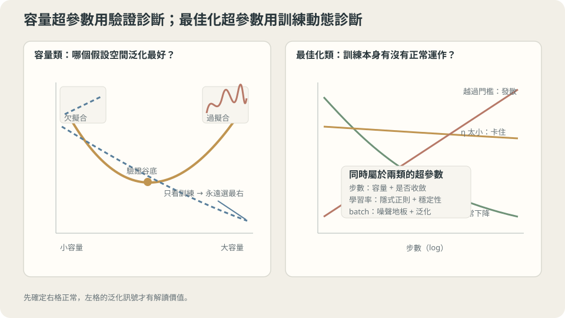

import Objectives from '../../../components/Objectives.astro';
import Ask from '../../../components/Ask.astro';
import Prereq from '../../../components/Prereq.astro';
import Question from '../../../components/Question.astro';
import Answer from '../../../components/Answer.astro';
import QuizBlock from '../../../components/QuizBlock.astro';
import Option from '../../../components/Option.astro';
import Explanation from '../../../components/Explanation.astro';
import VizPlan from '../../../components/VizPlan.astro';
import Remark from '../../../components/Remark.astro';
import Bridge from '../../../components/Bridge.astro';
import UsedBy from '../../../components/UsedBy.astro';
import Ref from '../../../components/Ref.astro';

# 火力與時間是食譜的一部分，還是煮的時候決定的？

<Objectives>
- **寫出參數與超參數的分界，並說出那條界線是由「誰決定它」而不是「它重不重要」畫的。** 把前面三個 class 出現過的超參數按這條界線分類。
- **說出為什麼超參數不能用訓練集選，並量出代價。** 用 200 次重複的實測比較「用訓練誤差挑」與「用驗證集挑」的真實風險。
- **判斷「最佳化超參數應該可以用訓練誤差選」這個說法。** 說出它在哪些超參數上成立、在哪些超參數上是陷阱。
</Objectives>

<Prereq items={frontmatter.prereqs} />

## 食譜上的與鍋子前的

一份食譜會寫「牛肉 300 克、醬油兩大匙」。它不會寫「第 7 分 32 秒時把火轉到 62% 並把鍋鏟往左移三公分」。

前者是**事先決定**、寫在紙上、每次照做的；後者是**站在鍋子前**、看著現場調整出來的。

訓練一個模型也有這兩層。網路的每一個權重是站在鍋子前調出來的——最佳化器看著資料，一步一步把它們挪到位。而「用幾層」「學習率多少」「訓多久」則是事先寫下來的：**最佳化器不會去動它們，因為它們定義了那個最佳化問題本身。**

這條界線看起來只是一個命名慣例，但它有一個立刻的後果。<Ref to="ml-data-splits" mode="title"/> 已經說過：**每一次用某份資料做決定，那份資料對未來的決定就少一分誠實度。** 訓練集已經被用來決定權重了。如果再用它決定「用幾層」，就是同一份資料被用了兩次。

<Ask>
哪些東西是事先寫在紙上的，哪些是現場調出來的？<br />
既然兩者都在「讓損失變小」，<br />
為什麼只有後者可以看訓練集？
</Ask>

<Question id="Q1">
把「參數」與「超參數」的分界寫清楚：判準是什麼？把前面三個 class 出現過的超參數分類——哪些控制假設空間的大小、哪些控制最佳化的行為？以及，為什麼「用訓練誤差選超參數」一定會選到某一端？

<Answer>
**判準是「誰決定它」，不是「它重不重要」。**

$$
\hat\theta(\lambda)=\arg\min_{\theta}\ \widehat R_n\big(f_\theta;\lambda\big).
$$

**$\theta$ 是那個 $\arg\min$ 裡面的東西**（最佳化器動它）；**$\lambda$ 是寫在式子外面、定義了那個 $\arg\min$ 長什麼樣的東西**（你動它）。學習率不在式子裡，但它決定 $\arg\min$ 實際上怎麼被求解，所以也在外面。

**分成兩類，因為它們壞掉的方式不同。**

| | 控制假設空間（容量） | 控制最佳化 |
| --- | --- | --- |
| 例子 | 多項式次數、層數、寬度、$L_2$ 的 $\lambda$、dropout 率 | 學習率 $\eta$、batch size、動量 $\beta$、初始化的 gain、訓練步數 |
| 調錯的徵狀 | U 形的兩端：欠擬合或過擬合 | 發散、卡住、或走不完（<Ref to="ml-gradient-descent" mode="title"/> 的三種） |
| 診斷工具 | <Ref to="ml-learning-curves" mode="title"/> 的兩條曲線 | 損失曲線的形狀、$\lambda_{\max}$ 與條件數 |

**為什麼用訓練誤差選一定選到某一端。** <Ref to="ml-overfitting-underfitting" mode="title"/> 證過一件事：沿著一條巢狀的假設空間鏈，**訓練誤差對容量單調不增**——在更大的集合裡取 $\min$ 不可能更大。所以「挑訓練誤差最小的那個容量」的答案永遠是**鏈的最上端**，與資料無關、與任務無關。

那不是一個「有偏的選擇」，而是**一個根本沒有在選的選擇**：它把一個要用資料回答的問題，變成了一個答案早就寫好的問題。下一節把這件事量出來——200 次重複裡，它選到上限的比例是 $100\%$。
</Answer>
</Question>

## 兩類超參數，兩種調法

分成兩類之後，調的順序就清楚了：**先讓它能訓，再讓它訓得對。**

**最佳化那一類先調**，因為它們壞掉時會掩蓋其他所有訊號。一個 $\eta$ 越過穩定門檻的模型，你從它的驗證分數上讀不出任何關於容量的資訊——它根本沒開始學。判斷方式在 <Ref to="ml-gradient-descent" mode="title"/> 與 <Ref to="ml-loss-landscape" mode="title"/> 都給過：看損失曲線有沒有在降、梯度的量級對不對、小資料能不能過擬合。

**容量那一類後調**，而且要用 <Ref to="ml-learning-curves" mode="title"/> 的兩條曲線判斷方向：間距大就往下調（或加資料），兩線重合在高原就往上調。

還有一類超參數**同時屬於兩邊**，而它們是最容易出事的：

- **訓練步數**：既是最佳化的預算，也是隱含的正則化強度（<Ref to="ml-regularization" mode="title"/> 量過：$\lambda\approx1/(2\eta t)$）。
- **學習率**：既決定能不能收斂，也透過上面那條式子決定隱含的正則化強度。
- **batch size**：既決定每步的成本，也決定噪聲地板（<Ref to="ml-minibatch-noise" mode="title"/> 的 $\eta/B$）。

**這三個不能用「它是最佳化超參數，所以看訓練誤差沒關係」來處理**，本篇最後會回到這件事。



**圖說：** 容量超參數要看泛化曲線，最佳化超參數要看訓練動態；先確認最佳化正常，容量訊號才可信。

## 訓練誤差選出來的不是選擇

把 Q1 的論證量出來。每次抽 120 筆資料，切 60 訓練 / 30 驗證 / 30 測試，候選是 degree $1$ 到 $15$，用兩種方式各挑一個，再看它們**真實**的風險。重複 200 次：

```python
fits = [Polynomial.fit(x[tr], y[tr], d) for d in DEG]
te = [((f(x[tr]) - y[tr])**2).mean() for f in fits]   # 用訓練集挑
ve = [((f(x[va]) - y[va])**2).mean() for f in fits]   # 用驗證集挑
```

```
  用訓練集選：選中的 degree 眾數 15（200 次裡 200 次）  選到上限的比例 100%  真實風險中位數 0.0530
  用驗證集選：選中的 degree 眾數  5（200 次裡  58 次）  選到上限的比例   3%  真實風險中位數 0.0262
```

**用訓練集挑，200 次裡有 200 次挑到 degree 15。** 不是「常常挑到太大的」，是**每一次**都挑到候選清單的最後一個。如果把清單延長到 degree 30，它就會每一次都挑 30。

**代價是真實風險的兩倍**（$0.0530$ 對 $0.0262$）。而且注意驗證集那一列的眾數是 5——正是 <Ref to="ml-bias-variance" mode="title"/> 那張分解表裡 bias² 剛好降到 $0.0000$、variance 還很小的位置。**驗證集真的在做選擇，訓練集只是在複讀「越大越好」。**

> **用訓練誤差選容量，答案在看到資料之前就已經寫好了。**

<Remark label="補充" summary="那為什麼權重可以用訓練誤差決定？">
同一份資料，決定權重可以、決定容量不行——這個不對稱要分清楚。

差別在**候選的數量與它們的自由度**。給定容量之後，權重是在一個**受限**的空間裡被挑的，而那個限制正是讓「訓練誤差低」對「真實風險低」有意義的東西（<Ref to="ml-learning-from-examples" mode="title"/> 的 Details 講過：把 $\mathcal F$ 設成所有函數，ERM 就退化成內插）。容量這個超參數做的事，是**選擇那個限制本身**——它在比較「限制強一點」與「限制鬆一點」，而訓練誤差對後者永遠比較友善。

換句話說：訓練誤差可以在一個固定的假設空間裡挑一個好的 $f$，但它沒有能力比較兩個**大小不同**的假設空間，因為它完全沒有計入「大空間比較容易在這些點上好看」這件事。統計學上補這個洞的方法是加一個隨複雜度成長的懲罰（AIC、BIC、MDL 都是這個形狀），而實務上更直接的方法就是留一份資料。
</Remark>

## 那「最佳化超參數」呢？

上面的論證是針對容量的。一個很自然的反問是：**學習率、訓練步數這些不影響假設空間，用訓練誤差選應該沒關係吧？**

這個說法對其中一部分成立，對另一部分是陷阱。

**成立的部分**：純粹的最佳化選擇——例如「同樣的模型與步數，哪個 $\eta$ 讓訓練損失降得最低」——確實可以用訓練損失判斷，因為那個問題問的就是「誰把這個 $\arg\min$ 求得比較好」。<Ref to="ml-optimizers" mode="title"/> 的那張表（GD $0.02666$、動量 $0.01596$、Adam $0.01638$，直接解 $0.01466$）就是這樣讀的：它比較的是**求解的效率**，而參照點是那個已知的直接解。

**陷阱的部分**：只要那個超參數同時是隱含的正則化，用訓練誤差選就會再次退化成「選某一端」。

**訓練步數是最清楚的例子。** <Ref to="ml-learning-curves" mode="title"/> 量過同一個模型跑到五百萬步：

```
     步數        訓練        驗證      真實風險
      100    0.0713    0.1167     0.1317
    10000    0.0302    0.0476     0.0502
   100000    0.0196    0.0290     0.0290
  1000000    0.0147    0.0324     0.0318
  5000000    0.0130    0.0434     0.0458
```

**訓練誤差單調下降（$0.0713\to0.0130$），真實風險在十八萬步左右觸底之後回升到 $0.0458$。** 用訓練誤差選「訓多久」，答案永遠是「訓到底」——又是一個在看到資料之前就寫好的答案，而且它讓真實風險差了 $65\%$。

同樣的邏輯套在 $\eta$ 上：<Ref to="ml-regularization" mode="title"/> 的 $\lambda\approx1/(2\eta t)$ 說 $\eta$ 也在決定隱含的正則化強度，所以「用固定步數下的訓練損失選 $\eta$」同樣偏向「隱含正則化最弱」的那一端。

> **一個超參數只要同時影響「求解的效率」與「求到哪一個解」，它就不能用訓練誤差選。**

實用的判準只有一個問題：**把這個超參數往一個方向推到極端，訓練誤差會不會單調變好？** 會，就不能用訓練誤差選它。

**這一切依賴什麼。** 一，驗證集本身要乾淨（<Ref to="ml-data-splits" mode="title"/> 的三條規則），而且每一個候選的整條流程都要在切分之後重跑。二，上面的實驗是在一條**巢狀**的候選鏈上做的；比較兩個彼此不包含的架構時「單調」不成立，但「訓練誤差對大空間比較友善」的偏差仍然在。三，$n=120$ 的驗證集只有 30 筆，所以那個中位數 $0.0262$ 本身有不小的抖動（<Ref to="ml-cross-validation" mode="title"/> 量過那個抖動有多大）。

## 一份可以照著走的順序

把 L2 與 L3 的東西合起來，一個實際的調參順序是：

1. **先讓它能訓。** 固定一組合理的容量，掃 $\eta$ 找到會炸的值再退三到十倍；確認損失真的在降；做小資料過擬合測試。這一步用**訓練**損失判斷，因為問的就是求解效率。
2. **再定容量。** 用驗證集（或 <Ref to="ml-cross-validation" mode="title"/>）掃容量與正則化強度。這一步**一定**用留出資料。
3. **回頭微調最佳化。** 容量換了之後，$\lambda_{\max}$ 與條件數都變了，第 1 步的結論要重驗一次。
4. **只在最後看一次測試集**，而且要先寫下你預期會看到多少。

第 3 步常常被跳過，但它是「兩類超參數互相耦合」的直接後果——這也是為什麼超參數搜尋不是「一個一個獨立地調」，而是下一篇要處理的**在一個空間裡搜尋**。

## 兩類超參數、兩種選法

<iframe loading="lazy" src="/personal_website/notes/research_areas/machine-learning-foundations/l3-experimental-method/l3-0-2.html" class="demo-frame" title="兩類超參數、兩種選法：互動 demo" style="height: 853px; width: 100%; border: none;"></iframe>

**互動 demo：用訓練誤差挑超參數，100% 挑到複雜度上限；換成驗證集，眾數落在真正的最佳附近。**

## 檢查理解

<QuizBlock id="ml-l3-0-a">
一個團隊用訓練損失比較了三種 batch size（32／128／512），發現 32 的訓練損失最低，於是決定用 32。這個判斷：
<Option>合理，batch size 是最佳化超參數。</Option>
<Option correct>不可靠。batch size 同時決定噪聲地板（$\propto\eta/B$），也就是它同時是一個隱含的正則化超參數；而且在固定步數下小 batch 走的步數相同但每步更新更多次雜訊，訓練損失的比較沒有計入這一層。該用留出資料比較。</Option>
<Option>不合理，因為 batch size 根本不影響結果。</Option>
<Explanation>
判準就是那一句：**把它推到極端，訓練誤差會不會單調變好？** batch size 會（透過噪聲地板與有效步數），所以它落在「兩邊都管」的那一類。順帶一提這題還有一個實務層面：比較 batch size 時如果不同時調 $\eta$，比的其實是 $\eta/B$ 這個組合而不是 $B$ 本身（<Ref to="ml-minibatch-noise" mode="title"/>）。
</Explanation>
</QuizBlock>

<QuizBlock id="ml-l3-0-b">
實測裡「用訓練集選 degree，200 次有 200 次選到上限 15」。若把候選清單延長到 degree 30，最可能的結果是：
<Option>會開始選到中間的值，因為太大的次數訓練誤差也會變差。</Option>
<Option correct>每一次都選到 30。訓練誤差沿著巢狀的候選鏈單調不增，所以「訓練誤差最小」的答案永遠是鏈的最上端——這個答案由清單的形狀決定，不由資料決定。</Option>
<Option>結果會變得不穩定，有時選 15 有時選 30。</Option>
<Explanation>
這題想釘住的是「它根本沒有在選」這個性質。單調性是一個代數事實（在更大的集合裡取 $\min$ 不可能更大），不是一個統計傾向，所以它沒有例外、也不會因為資料抖動而變。這也解釋了為什麼這個錯誤在實務上很難用「多跑幾次」發現——它每次都給同一個答案，看起來非常穩定。
</Explanation>
</QuizBlock>

<QuizBlock id="ml-l3-0-c">
下列哪一個超參數**最不適合**用訓練損失來選？
<Option>在固定的模型與步數下，比較兩個最佳化器誰把訓練損失降得更低。</Option>
<Option correct>訓練步數。</Option>
<Option>初始化的 gain（在固定步數下比較哪個 gain 讓訓練損失最低）。</Option>
<Explanation>
訓練步數是本篇最乾淨的反例：訓練誤差對它單調下降，而真實風險有谷底（$0.0290$ 在十八萬步，$0.0458$ 在五百萬步）。第一個選項是本篇說「成立」的那一類——它問的就是求解效率。第三個選項介於中間：gain 主要影響最佳化（<Ref to="ml-loss-landscape" mode="title"/> 的 U 形是對訓練損失的），但它也會透過「走到哪個盆地」影響泛化，所以用訓練損失做粗篩可以、做最終決定要用留出資料。
</Explanation>
</QuizBlock>

<QuizBlock id="ml-l3-0-d">
下列哪一句**不對**？
<Option>參數與超參數的分界是「誰決定它」，不是「它重不重要」。</Option>
<Option>調參順序應該先確認能訓（最佳化），再定容量，然後回頭重驗最佳化——因為容量換了之後 $\lambda_{\max}$ 與條件數都變了。</Option>
<Option correct>只要驗證集夠大，用訓練誤差選超參數造成的偏差就會消失。</Option>
<Explanation>
第三句把兩件事混了：驗證集的大小影響的是**用驗證集選**時的抖動（<Ref to="ml-data-splits" mode="title"/> 的 $\sqrt{\log m/n_{\text{val}}}$），而「用訓練誤差選」的問題根本不是抖動——它是一個確定性的、與資料無關的答案。這兩種錯誤要用不同的方式修：前者加大驗證集或用交叉驗證，後者只能換一份資料來選。
</Explanation>
</QuizBlock>

<UsedBy slug={frontmatter.slug} />

<Bridge to="ml-hyperparameter-search">
知道要用驗證集之後，下一個問題是**怎麼搜**。超參數常常有五個、十個，每個都試十格就是天文數字。接著處理這件事，並回答一個很反直覺的問題：同樣的一百次評估，排成整齊的格子點與隨便亂丟一百個點，哪一個找得比較好？答案取決於一件你事先不知道、但可以估計的事。
</Bridge>

## 參考文獻

1. Bergstra, J., Bengio, Y. [*Random Search for Hyper-Parameter Optimization.*](https://jmlr.org/papers/v13/bergstra12a.html) JMLR 2012.（超參數的分類與搜尋；下一篇的主題，但它對「哪些超參數重要」的實證分析在這裡就用得上。）
2. Hastie, T., Tibshirani, R., Friedman, J. [*The Elements of Statistical Learning*](https://hastie.su.domains/ElemStatLearn/), 2nd ed. Springer 2009, Ch. 7.2, 7.10.（訓練誤差為何對複雜度單調、以及用懲罰項或留出資料補洞的兩條路線。）
3. Dodge, J. et al. [*Show Your Work: Improved Reporting of Experimental Results.*](https://aclanthology.org/D19-1224/) EMNLP 2019.（把「調了多少」當成結果的一部分報告；本篇第 4 步與下兩篇的動機。）
