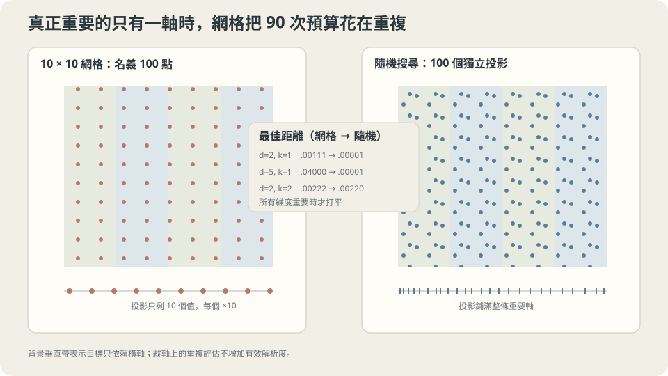

import Objectives from '../../../components/Objectives.astro';
import Ask from '../../../components/Ask.astro';
import Prereq from '../../../components/Prereq.astro';
import Question from '../../../components/Question.astro';
import Answer from '../../../components/Answer.astro';
import QuizBlock from '../../../components/QuizBlock.astro';
import Option from '../../../components/Option.astro';
import Explanation from '../../../components/Explanation.astro';
import VizPlan from '../../../components/VizPlan.astro';
import Remark from '../../../components/Remark.astro';
import Bridge from '../../../components/Bridge.astro';
import UsedBy from '../../../components/UsedBy.astro';
import Ref from '../../../components/Ref.astro';

# 同樣試一百次：排成格子，還是隨便丟？

<Objectives>
- **說出格子搜尋在多維度下浪費掉什麼。** 用「每個維度實際試過幾個不同的值」這個量解釋它，並在模擬上量出差距隨維度怎麼長。
- **說出投影論證的條件與限制。** 低有效維度讓網格有重複位置；所有維度都重要時，這個理由消失，但不代表兩個方法必定打平。
- **判斷什麼時候該換更聰明的方法。** 說出 Bayesian optimization 與 Hyperband 各自在買什麼，以及它們的前提。
</Objectives>

<Prereq items={frontmatter.prereqs} />

## 兩個超參數，一百次評估

假設模型有兩個超參數，每個都可以取 $0$ 到 $1$ 之間的任何值，而你的計算預算只允許一百次評估。

像試烤箱的溫度與時間，我們可以每個設定取十個值，兩兩組合試一百次；也可以隨機抽一百組。前者覆蓋的是選出的網格，不是整個連續區間。**若成敗主要取決於溫度，時間其實差不多呢？**

但如果**其中一個超參數其實根本不影響驗證分數**呢？那麼格子搜尋實際上只試過重要那個超參數的**十個**不同值（每個值重複了十次，只是另一個不重要的超參數在變）；隨機搜尋則試過**一百個**不同值。

**同樣的一百次，一個用在十個位置上，一個用在一百個位置上。**

<Ask>
兩個超參數各試十格，還是隨機抽一百組？<br />
如果我事先不知道哪個超參數重要，<br />
哪一種比較不會浪費？
</Ask>

<Question id="Q1">
把兩種搜尋翻成數學：固定預算 $B$、維度 $d$，各自在每個維度上試過幾個不同的值？如果只有 $k$ 個維度真的影響結果，兩者實際上是在幾維的空間裡搜尋？

<Answer>
**格子搜尋。** 每個維度取 $m$ 格，總點數 $m^d=B$，所以

$$
m=B^{1/d}.
$$

$B=100$ 時，$d=1$ 可取 100 格、$d=2$ 可取 10 格；若要嚴格不超出預算，$d=3$ 最多取 4 格、$d=5$ 最多取 2 格。整數格數需要取 $\lfloor B^{1/d}\rfloor$，不能四捨五入後仍宣稱總數恰好是 $B$。

**隨機搜尋。** 若各座標來自連續分布，$B$ 次抽樣在每個座標上幾乎必然給出 $B$ 個不同值；類別型或離散超參數則可能重複。

**現在假設只有 $k$ 個維度真的影響結果。** 把所有點投影到那 $k$ 個維度上：

- 格子的 $B$ 個點塌成 $m^k=B^{k/d}$ 個**不同的**位置，其餘 $B-B^{k/d}$ 次評估是重複的。
- 隨機的 $B$ 個點仍然是 $B$ 個不同的位置（機率 1）。

當 $B=m^d$ 時，重複投影的比例是 $1-B^{k/d-1}$。這裡把目標視為沒有評估噪聲；有噪聲時，重複測量也能提供估計變異數的資訊。

我們不必先知道哪些座標重要，就能讓隨機樣本在各座標上探索新值。不過 $k=d$ 只表示網格沒有這種重複投影；勝負還取決於目標形狀、最佳點位置與抽樣分布，不能從點數推出兩者必定相同。
</Answer>
</Question>

## 投影下去就看得出來

把兩種搜尋的點畫在二維平面上，再把它們投影到橫軸（假設只有橫軸重要）：

- **格子**的十行點投影下去完全重疊成十個位置。九十次評估對「找出橫軸的最佳值」沒有提供任何新資訊——它們只是在同一個橫座標上重複量了十次。
- **隨機**的一百個點投影下去是一百個不同的位置，鋪滿整條軸。

這張圖是 Bergstra 與 Bengio（參考文獻 1）那篇論文的核心，也是它為什麼改變了實務：**它不需要更聰明的演算法，只需要不要把預算花在你自己造出來的重複上。**

一個常見的反駁是「那我把格子設得不對齊不就好了」——沒錯，而把格子隨機擾動到極致，就是隨機搜尋。



**圖說：** 目標只依賴一個維度時，網格的大量評估投影到相同座標；所有維度都重要時，這個重複投影的原因不再成立。

## 差距有多大，以及它什麼時候消失

把上面的算式驗證一次。目標刻意設成只依賴前 $k$ 個維度：

$$
f(h)=\sum_{j=1}^{k}\big(h_j-0.3\big)^2 ,
$$

最小值是 $0$（越小越好）。下表保留原模擬：random search 抽 100 點，網格則將 $100^{1/d}$ 四捨五入成整數 $m$。因此網格的實際次數分別為 100、100、125、243、100、81，**並非每列都使用相同預算**；表格適合看解析度，不能直接當成嚴格的同成本排名。

```
維度 d   有效維度 k        格子         隨機   格子每維幾格
     1          1     0.00001     0.00001           100
     2          1     0.00111     0.00001            10
     3          1     0.00250     0.00001             5
     5          1     0.04000     0.00001             3
     2          2     0.00222     0.00220            10
     4          2     0.08000     0.00230             3
```

**四件事，一件一件讀。**

**$d=k=1$ 這次結果接近**（顯示到第五位都是 $0.00001$）。一維沒有重複投影到不重要座標的浪費，但網格與隨機點的間距仍不同；這個對照不保證所有一維目標都打平。

**只有一維重要時，差距隨 $d$ 爆開**：$0.00111$（$d=2$）$\to0.00250$（$d=3$）$\to0.04000$（$d=5$），而隨機那一欄**完全不動**（$0.00001$）。五維時是**四千倍**。原因就在最右欄：格子每維只剩 3 格，而重要那一維的最佳值 $0.3$ 落在 $0.0/0.5/1.0$ 之間，最近的一格差 $0.2$，平方是 $0.04$——**表格裡那個 $0.04000$ 不是抖動，是格子解析度直接算出來的。**

**$d=k=2$ 這次也很接近**（$0.00222$ 對 $0.00220$）。這表示重複投影的理由消失，不表示兩個搜尋方法有普遍相同的效率：

> **低有效維度能解釋 random search 的一個優勢，但不是所有勝負的唯一原因。**

**最後一列是最接近真實情況的**（$d=4$、$k=2$）：$0.08000$ 對 $0.00230$，三十五倍。真實的超參數空間大多長這樣——十幾個超參數，其中兩三個真的決定成敗。

<Remark label="補充" summary="log 尺度比線性尺度更常是對的">
上面的模擬用的是線性的 $[0,1]$，但真實的超參數多半該用 **log 尺度**抽：學習率、weight decay、$\epsilon$ 這些跨好幾個數量級的量，「$10^{-4}$ 到 $10^{-3}$」和「$10^{-1}$ 到 $1$」在實務上是同樣大的一步，而在線性尺度上後者大了一千倍。

判準很簡單：**這個超參數的「差一倍」和「差一個固定的量」哪一個比較有意義？** 前者就用 log（學習率、$\lambda$、batch size），後者用線性（dropout 率、動量的 $\beta$——不過 $\beta$ 常常改抽 $1-\beta$ 的 log，因為 <Ref to="ml-optimizers" mode="title"/> 說它的記憶長度是 $1/(1-\beta)$）。

抽錯尺度的後果和格子解析度不足是同一種：你的一百個點裡有九十九個擠在一個沒有用的區域。
</Remark>

## 比隨機更聰明的兩個方向

隨機搜尋把「不浪費」做到了，但它有一個明顯的缺點：**它不從前面的結果學習**。第一百次評估和第一次一樣盲目。

兩個方向各補一塊：

**Bayesian optimization**：用已經試過的點擬一個「目標函數長什麼樣」的機率模型（常用 Gaussian process 或樹模型），再用它挑下一個點——挑「預期會好」與「還沒探索過」之間權衡最佳的位置。它買到的是**樣本效率**，代價是多一層自己的超參數（核函數、取樣準則），以及在高維、有類別型超參數、或評估很吵的時候容易失靈。

**Hyperband / successive halving**：換一個方向——不減少試的點數，而是**減少每個點的成本**。先用很小的預算（少量 epoch 或少量資料）跑很多組超參數，把明顯爛的砍掉，再把預算加倍給活下來的。它買到的是**在同樣的總計算量下試更多組**，前提是「小預算下的排名和大預算下的排名相關」——這個前提在多數任務上大致成立，但對「要訓很久才分得出勝負」的超參數會失效。

實務上的順序是：**先隨機、後聰明**。隨機搜尋的三十到五十次評估會告訴你哪幾個超參數真的重要、大致的範圍在哪，而那正是 Bayesian optimization 需要的起點——直接讓它在一個十幾維、範圍全開的空間裡冷啟動，通常比隨機還慢。

## 一個可以照著做的流程

1. **列出所有超參數，各自標好尺度**（log 或線性）與一個寬鬆的範圍。寧可範圍設寬——範圍設錯會讓最佳值落在邊界外，而那是隨機搜尋救不了的。
2. **隨機抽三十到五十組，全部跑完。**
3. **找影響的線索**：畫各超參數與驗證分數的散點圖。沒有單一座標的趨勢，不代表不重要；兩個設定可能只有搭配起來才有影響，還要檢查交互作用。
4. **在重要的那幾個超參數上收窄範圍**，再抽一輪，或換 Bayesian optimization。
5. **誠實記錄你總共試了幾組**——那個數字是下一篇要用的 $m$。

**這一切依賴什麼。** 一，每一組超參數的評估要用同一份驗證資料、同一個流程（否則比較的不是超參數）。二，評估本身有抖動（<Ref to="ml-cross-validation" mode="title"/> 量過，小資料時抖動可能和被估的量同數量級），所以「最好的那一組」有一部分是運氣——這正是下一篇的主題。三，上面的模擬用的是無噪聲的目標；評估有噪聲時，隨機搜尋的優勢仍在，但「最好的那一組真的最好嗎」會變成一個獨立的問題。

## 把第 3 步跑出來

第 3 步要單獨示範，因為它是整個流程裡唯一會**產生知識**的一步——其他步驟都只是在找一個超參數。

做法：把隨機搜尋的每一組超參數畫成一個點，橫軸是某一個超參數的值、縱軸是它的驗證分數。重複 $d$ 次，每個超參數一張圖。

- **重要的超參數**：散點有明顯的趨勢或明顯的谷底。
- **不重要的超參數**：散點是一片均勻的雲——縱軸的變化完全來自其他超參數。

在本篇的模擬設定（$d=4$、$k=2$）上，前兩張圖會看到清楚的 U 形，後兩張是均勻的雲。而一旦你看出 $k=2$，下一輪就可以把範圍收在那兩個超參數上——**$B^{k/d}$ 那個懲罰項消失了，因為你把 $d$ 降成了 $k$。**

這也解釋了為什麼「格子搜尋」在只剩兩個超參數時又變回一個合理的選擇。

> **格子搜尋的問題從來不是格子，是維度。**

## 同樣的預算，兩種撒點方式

<iframe loading="lazy" src="/personal_website/notes/research_areas/machine-learning-foundations/l3-experimental-method/l3-1-2.html" class="demo-frame" title="同樣的預算，兩種撒點方式：互動 demo" style="height: 1097px; width: 100%; border: none;"></iframe>

**互動 demo：把名目維度拉到 5，格子搜尋在每個軸上的不同值從 B 塌到 B^(1/5)，隨機那一欄完全不動。**

## 檢查理解

<QuizBlock id="ml-l3-1-a">
一個團隊有 6 個超參數，預算是 64 次評估，打算用格子搜尋。每個維度他們能分到幾格，以及最合理的建議是：
<Option>每維 10 格；建議照做，格子比較有系統。</Option>
<Option correct>每維只有 $64^{1/6}=2$ 格——也就是每個超參數只試了兩個值，幾乎等於沒搜。建議改隨機搜尋（每個維度都會試到 64 個不同的值），並用散點圖先找出哪幾個超參數真的重要。</Option>
<Option>每維 64 格，因為每個維度都獨立地被掃過。</Option>
<Explanation>
$m=B^{1/d}$ 這條式子在維度稍微多一點時就很殘酷：6 個超參數、64 次評估，每維 2 格。實務上這表示你的「系統性搜尋」其實只檢驗了每個超參數的兩個端點。第三個選項是對格子搜尋最常見的誤解——格子的總點數是 $m^d$，不是 $m\times d$。
</Explanation>
</QuizBlock>

<QuizBlock id="ml-l3-1-b">
在模擬裡 $d=k=2$（兩個維度都重要）時，格子 $0.00222$、隨機 $0.00220$，幾乎相同。這一列說明：
<Option>模擬有問題，隨機搜尋應該永遠比較好。</Option>
<Option correct>這個目標與網格位置剛好給出相近結果。所有維度都重要時，重複投影的理由消失，但其他目標不一定也打平。</Option>
<Option>說明在低維度時應該一律用格子。</Option>
<Explanation>
把一個方法的優勢綁回它的**前提**，是這一系列一直在練的事。這一列的實務價值是：如果你已經透過散點圖把超參數收窄到兩三個真的重要的，那麼在那個小空間裡用格子（甚至手動掃）完全合理——**問題從來不是格子，是維度**。
</Explanation>
</QuizBlock>

<QuizBlock id="ml-l3-1-c">
關於 Hyperband（先用小預算跑很多組、砍掉爛的、再把預算加倍給活下來的），它的關鍵前提是：
<Option>目標函數是平滑的。</Option>
<Option correct>小預算下的排名和大預算下的排名相關。若某些超參數要訓很久才顯出優勢（例如需要較長的 warmup、或學習率較小但最終更好），它們會在第一輪就被砍掉。</Option>
<Option>超參數之間彼此獨立。</Option>
<Explanation>
每一個「更聰明」的搜尋方法都在用一個額外的假設換效率，而知道那個假設是什麼，才知道它什麼時候會騙你。Hyperband 換的是「早期排名可信」；Bayesian optimization 換的是「目標函數可以用一個平滑的機率模型描述」（所以第一個選項其實是 BO 的前提，不是 Hyperband 的）。實務上常見的折衷是把最小預算設得夠大，讓那些慢熱的超參數至少過得了第一輪。
</Explanation>
</QuizBlock>

<QuizBlock id="ml-l3-1-d">
下列哪一句**不對**？
<Option>學習率這類跨數量級的超參數該用 log 尺度抽，否則點會擠在一個沒用的區域。</Option>
<Option>隨機搜尋的一個實用性質是：你不需要事先知道哪些維度重要，就能拿到它的好處。</Option>
<Option correct>隨機搜尋比格子搜尋更容易找到全域最佳，因為它不會被格子的規律困住。</Option>
<Explanation>
有限預算下，任何一種方法都不保證找到連續空間中的全域最佳。投影數量解釋了低有效維度下的一種浪費；下一步還要檢查範圍、尺度、噪聲與交互作用。
</Explanation>
</QuizBlock>

<UsedBy slug={frontmatter.slug} />

<Bridge to="ml-nested-validation">
但整個流程有一個還沒被檢查的環節：**搜完之後，那個「最好的一組」的分數可以拿來報告嗎？** 直覺上它是你誠實地在驗證集上量出來的。接著會用一個刻意設計的實驗回答：讓所有候選的真實品質**完全相同**，然後看那個勝出者的分數會漂多遠。
</Bridge>

## 參考文獻

1. Bergstra, J., Bengio, Y. [*Random Search for Hyper-Parameter Optimization.*](https://jmlr.org/papers/v13/bergstra12a.html) JMLR 2012.（本篇投影論證與「低有效維度」的原始來源，含真實任務上的實證。）
2. Li, L. et al. [*Hyperband.*](https://jmlr.org/papers/v18/16-558.html) JMLR 2018.（successive halving 的預算配置與理論保證，以及它的前提。）
3. Snoek, J., Larochelle, H., Adams, R. [*Practical Bayesian Optimization of Machine Learning Algorithms.*](https://arxiv.org/abs/1206.2944) NeurIPS 2012.（GP-based BO 的標準做法與它自己的超參數。）
