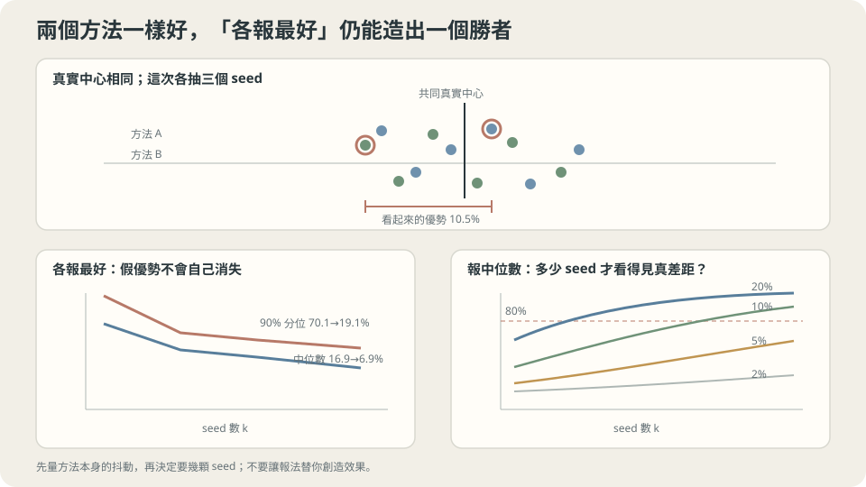

import Objectives from '../../../components/Objectives.astro';
import Ask from '../../../components/Ask.astro';
import Prereq from '../../../components/Prereq.astro';
import Question from '../../../components/Question.astro';
import Answer from '../../../components/Answer.astro';
import QuizBlock from '../../../components/QuizBlock.astro';
import Option from '../../../components/Option.astro';
import Explanation from '../../../components/Explanation.astro';
import VizPlan from '../../../components/VizPlan.astro';
import Remark from '../../../components/Remark.astro';
import Bridge from '../../../components/Bridge.astro';
import UsedBy from '../../../components/UsedBy.astro';
import Ref from '../../../components/Ref.astro';

# 同一個實驗跑三次結果都不同，該報哪一個？

<Objectives>
- **量出「取最好的那一次」能無中生有多大的差距。** 用兩個完全相同的方法各跑 $k$ 次的模擬，說出 $k=3$ 時那個假差距有多大。
- **算出要幾個種子才分得出一個給定大小的真實差距。** 讀出那張表，並用它在做實驗之前判斷這個比較值不值得做。
- **說出該報什麼。** 中位數與範圍、種子數、以及 <Ref to="ml-nested-validation" mode="title"/> 的那個 $m$——並說出為什麼配對比較比各自獨立比更省種子。
</Objectives>

<Prereq items={frontmatter.prereqs} />

## 三次結果都不一樣

你把同一份程式跑了三次，只換了 random seed。測試準確率是 $0.831$、$0.847$、$0.822$。

**該報哪一個？**

「報最好的 $0.847$」聽起來有點心虛但很常見——畢竟那確實是你跑出來的。「報平均 $0.833$」比較誠實。「三個都報」看起來很囉唆。

而真正的問題還在後面：你的同事用 baseline 跑了三次，得到 $0.818$、$0.835$、$0.809$，報了 $0.835$。**你比他好 $1.2$ 個百分點。這代表什麼？**

看那六個數字就知道：兩組的範圍幾乎完全重疊。$1.2$ 個百分點的「優勢」小於任何一組自己的散佈。

這一篇要把這件事變成兩張可以直接使用的表：**取最好的那一次能無中生有多大的差距**，以及**要幾個種子才分得出一個真實的差距**。

<Ask>
同一個實驗跑三次結果都不同，該報哪一個？<br />
如果兩個方法其實一樣好，<br />
「各跑三次、各報最好」會讓贏家看起來好多少？
</Ask>

<Question id="Q1">
把「該報哪一個」翻成統計問題：你在估的是什麼？「取最好的 $k$ 次」與「取中位數」各是那個量的什麼估計？以及，為什麼兩個方法**各自**跑 $k$ 次再比最好的，會系統性地製造差距？

<Answer>
**在估什麼。** 一次實驗的結果 $X$ 是一個隨機變數，隨機性來自初始化、minibatch 順序、資料增強的抽樣、以及非確定性的 GPU 運算。你真正想知道的是這個方法的**典型表現**——也就是 $X$ 的分布的一個中心位置（平均或中位數）。

**兩種報法估的不是同一個東西。**

- **中位數**（或平均）是那個中心位置的無偏（或接近無偏）估計。$k$ 個樣本的中位數，其抖動隨 $k$ 以 $1/\sqrt k$ 縮小（<Ref to="math-gaussian" mode="title"/>：獨立樣本的平均，變異數除以 $k$）。
- **最好的那一次**估的是**分布的極值**，不是中心。而且它隨 $k$ **系統性地往好的方向漂**：$k$ 越大，$\max$ 越大。它不是「比較樂觀的中心估計」，它根本不是中心的估計。

**為什麼各自取最好會製造差距。** 這是 <Ref to="ml-nested-validation" mode="title"/> 的 winner's curse 再來一次，只是換了一個隨機性的來源。兩個方法都做「$k$ 個樣本取極值」，兩個極值各自往上漂了差不多的量；但**兩者的漂移是獨立的**，所以它們的**差**是一個均值為零、但散佈被放大的隨機量。

於是「贏家」一定存在——只要有兩個數字，其中一個就比較大。問題不是「誰贏」，而是**贏多少才算有意義**。而那個門檻由那個差的散佈決定，下一節把它量出來。
</Answer>
</Question>

## 先量抖動本身

任何關於「差多少才有意義」的判斷，都要先知道單一次實驗的抖動有多大。

沿用 <Ref to="ml-loss-landscape" mode="title"/> 那組設定（$1\to32\to32\to1$ 的 $\tanh$ 網路、Adam $\eta=0.01$、4000 步、共用 toy），200 個 seed 的最終訓練 MSE：

```
中位數 0.0034   標準差 0.0010   範圍 [0.0023, 0.0085]
```

**標準差是中位數的 $29\%$。** 這個比例是後面每一個判斷的基礎——它告訴你「一次實驗」這個量測工具的解析度有多粗。

真實任務上這個比例差異很大：影像分類的準確率可能只有 $0.3\%$ 的抖動，強化學習可能超過 $50\%$。**所以這個數字要在自己的專案上量一次**，它比任何通用的建議都有用，而且只要跑五到十個 seed 就估得出來。



**圖說：** 只報每個方法最好的 seed 會憑空造出優勢；seed 數也決定能辨識多小的真實差距。

## 第一張表：取最好的能無中生有多少

模擬：兩個方法的結果**都**從那 200 個 seed 的分布裡抽，也就是它們真實品質完全相同。各抽 $k$ 個，各取自己最好的那一個，看「贏家」比「輸家」好多少（相對值）。重複兩萬次：

```
  k=  1  「贏家」比「輸家」好的幅度  中位數 16.9%   90 百分位 70.1%
  k=  3  「贏家」比「輸家」好的幅度  中位數 10.5%   90 百分位 26.8%
  k=  5  「贏家」比「輸家」好的幅度  中位數  8.9%   90 百分位 23.3%
  k= 10  「贏家」比「輸家」好的幅度  中位數  6.9%   90 百分位 19.1%
```

**$k=3$ 那一列是最該記住的：兩個一模一樣的方法，各跑三次、各報最好的那一次，贏家平均看起來好 $10.5\%$，而且十次裡有一次好超過 $26.8\%$。**

> **「我們的方法比 baseline 好 10%」在三個種子加上取最好的報法下，正是純噪聲會產生的東西。**

還有一個容易被誤讀的地方：**這個假差距隨 $k$ 變小，但降得很慢**（$16.9\to10.5\to8.9\to6.9$）。跑十次再取最好，仍然會無中生有 $6.9\%$。原因是「取最好」本身就是在估極值——增加 $k$ 只會讓極值更極端，**它不會收斂到任何東西**。

**所以問題不在種子數，在報法。** 換成中位數之後，$k$ 增加就真的在買精度（$1/\sqrt k$），這是下一張表的前提。

<Remark label="注意" summary="隨機性的來源不只有 seed，而且有些不在你的控制裡">
上面模擬的隨機性來自初始化與訓練過程。真實實驗還有幾層：

- **資料切分的隨機**：換一個 train/val 切法，結果會變（<Ref to="ml-cross-validation" mode="title"/> 量過單次留出的估計標準差是 $0.4069$ 而 5-fold 是 $0.0304$）。這一層常常比 seed 更大，卻更少被重複。
- **資料增強、dropout、shuffle 的抽樣**：通常和 seed 綁在一起。
- **非確定性的硬體運算**：GPU 上的浮點加法順序不固定，所以**同一個 seed 也可能給不同的結果**。這一層無法用固定 seed 消除，只能用確定性模式（通常更慢）或接受它。

實務上的建議是：**重複的時候把能重抽的都重抽**（seed 與資料切分一起換），因為你要估的是「這整套流程的表現」，不是「在這個特定切分上的表現」。只固定切分而換 seed，會系統性地低估抖動。
</Remark>

## 第二張表：要幾個種子

換成誠實的報法（每個方法跑 $k$ 次，比較**中位數**），並且做**配對比較**（兩個方法用同一組 seed 與同一組資料切分）。問：一個真實存在的差距 $\delta$，要幾個種子才能在 $80\%$ 的把握下正確分辨？

```
  真實差距   2%  →  k=100 仍只有 77%
  真實差距   5%  →  k≈20（正確判斷 83%）
  真實差距  10%  →  k≈5 （正確判斷 84%）
  真實差距  20%  →  k≈1 （正確判斷 83%）
```

**這張表可以在做實驗之前就用。** 流程是：先跑五個 seed 估出抖動（上面那個 $29\%$），再問「我這個改動預期會帶來多大的改善」，然後查表看需要幾個種子。

- 預期改善 $20\%$：一次就看得出來，不必多跑。
- 預期改善 $5\%$：需要約 20 個種子。如果一次訓練要八小時，那是一個要排程的決定。
- 預期改善 $2\%$：**在這個抖動水準下量不出來**——100 個種子仍然只有 $77\%$ 的把握。

最後一列說的是另一件事。它不是說「$2\%$ 的改善不重要」，而是說**在這個實驗設定下，你沒有能力偵測它**。這時的選項是：降低抖動（加大驗證集、用交叉驗證、把訓練變得更穩定），或者接受你無法用這個實驗回答這個問題。

> **在花掉算力之前，先問自己這個實驗有沒有能力回答我要問的問題。**

**配對比較為什麼省種子。** 如果兩個方法各自用不同的 seed，你比的是兩個獨立的隨機量，差的變異數是兩者相加。用**同一組** seed 與同一組切分，兩邊共同的隨機成分（這次的切分剛好比較難、這個初始化剛好比較好）會在相減時抵消掉，剩下的只有「方法造成的差」。實務上這常常把所需的種子數減半以上，而成本是零——只要記得把 seed 也當成一個要對齊的東西。

## 該報什麼

把前面兩張表合成一組可以直接照做的規則：

1. **報中位數與範圍（或四分位距），加上種子數。** 「$0.833$（5 seeds，範圍 $0.822$–$0.847$）」比「$0.847$」誠實，而且資訊量更大——讀者可以自己判斷一個差距有沒有意義。
2. **做配對比較**：兩個方法共用同一組 seed 與同一組資料切分，報**差值**的分布而不是兩個分布。
3. **報 $m$**：你總共比較過幾組設定（<Ref to="ml-nested-validation" mode="title"/> 的那個數字）。它和種子數是兩件不同的事，而且兩個都影響該怎麼讀你的數字。
4. **不要用「取最好的」當成績**，除非你明確說明那是最好的一次、並同時報中位數。
5. **測試集只讀一次**，而且是在所有種子都跑完、決定都做完之後。

**這一切依賴什麼。** 一，上面兩張表的數字是在**這個** toy 的抖動水準（標準差是中位數的 $29\%$）下算的；換一個任務要重新量。二，第二張表假設配對比較與中位數；用平均或不配對，需要的種子數更多。三，「$80\%$ 的把握」是一個選擇——要更高的把握，種子數還要往上加。

## 把那個 $29\%$ 量成自己的數字

上面每一個結論都掛在同一個量上：**單次實驗的相對抖動**。所以最有價值的一步不是記住這兩張表，而是把那個數字量成自己的。

做法只要五到十次重複：

```python
res = [run_everything(seed=s) for s in range(8)]     # seed 與資料切分一起換
med = np.median(res); spread = np.std(res)
print(f"中位數 {med:.4f}   標準差 {spread:.4f}   相對抖動 {spread/med*100:.0f}%")
```

拿到那個百分比之後，兩張表都可以重算——它們的形狀不變，只有刻度會隨那個比例縮放。而這八次重複本身就有回報：它讓你**看得出來自己的量測工具有多粗**，而那決定了接下來每一個「A 比 B 好」的判斷該不該相信。

**這個推論可以直接寫成**：如果相對抖動是 $29\%$，那麼任何小於 $10\%$ 的改善都需要十幾二十次重複才讀得出來。**而這表示「多跑幾次」常常比「再想一個新點子」更能推進專案**——因為在沒有足夠重複的情況下，你根本不知道上一個點子有沒有效。

## 兩張表，一個抖動設定

<iframe loading="lazy" src="/personal_website/notes/research_areas/machine-learning-foundations/l3-experimental-method/l3-3-2.html" class="demo-frame" title="兩張表，一個抖動設定：互動 demo" style="height: 923px; width: 100%; border: none;"></iframe>

**互動 demo：兩個一模一樣的方法各跑 k 次各報最好，k=3 的假優勢中位數就有 7%。**

## 檢查理解

<QuizBlock id="ml-l3-3-a">
一篇報告寫「我們的方法達到 $0.847$，優於 baseline 的 $0.835$」，兩者各跑了三次並各報最好的一次。根據本篇的模擬（相對抖動 $29\%$），最合適的評論是：
<Option>$1.4\%$ 的改善雖小但真實，因為兩者用同樣的流程比較。</Option>
<Option correct>這個差距完全在噪聲範圍內。兩個**一模一樣**的方法各跑三次、各報最好，中位數就會產生 $10.5\%$ 的假差距——$1.4\%$ 遠小於那個。要下結論需要報中位數與範圍，並且用更多種子。</Option>
<Option>應該改用更大的模型來拉開差距。</Option>
<Explanation>
關鍵在於把「看起來的差距」和「這個報法本身會產生的差距」比較。後者在 $k=3$ 且取最好時是 $10.5\%$，所以任何小於它的宣稱都讀不出來。順帶一提第一個選項提到「同樣的流程」——那確實有幫助（配對比較），但只有在**用同一組 seed** 時才生效，而各自取最好把配對的好處也丟掉了。
</Explanation>
</QuizBlock>

<QuizBlock id="ml-l3-3-b">
在第一張表裡，假優勢從 $k=1$ 的 $16.9\%$ 只降到 $k=10$ 的 $6.9\%$。為什麼增加種子數對它幫助這麼小？
<Option>因為 10 個種子還是太少，$k=100$ 就會趨近零。</Option>
<Option correct>因為「取最好的那一次」估的是分布的**極值**而不是中心，而極值不會隨樣本數收斂——$k$ 越大兩邊的極值都越極端。要讓差距隨 $k$ 收斂，必須換成中位數或平均這種中心估計。</Option>
<Option>因為兩個方法的真實品質其實有微小差距。</Option>
<Explanation>
這題想釘住的是「$k$ 買到什麼取決於你用它算什麼」。同樣的 $k$ 個樣本，算中位數時抖動以 $1/\sqrt k$ 縮小，算最大值時則往極端漂。第一個選項的錯在於方向：$k=100$ 時兩邊的極值都更極端，那個差的**中位數**會繼續慢慢降，但它降的是分布的形狀效應，不是收斂到零。
</Explanation>
</QuizBlock>

<QuizBlock id="ml-l3-3-c">
一個團隊的相對抖動是 $29\%$，他們想驗證一個預期帶來 $2\%$ 改善的想法。根據第二張表，最合理的決定是：
<Option>跑 100 個種子，這樣就能確認。</Option>
<Option correct>先想辦法降低抖動（加大驗證集、改用交叉驗證、把訓練變穩定），或接受這個實驗設定沒有能力回答這個問題。$2\%$ 在這個抖動下即使 100 個種子也只有 $77\%$ 的把握，而那個成本幾乎一定不划算。</Option>
<Option>直接跑三個種子，如果有改善就採用。</Option>
<Explanation>
把「這個實驗有沒有能力回答我的問題」放在跑之前，是這一篇最實用的習慣。第一個選項的問題是成本：100 次訓練換 $77\%$ 的把握，通常遠不如花同樣的算力把抖動降下來（例如把單次留出換成 5-fold，<Ref to="ml-cross-validation" mode="title"/> 量過那讓估計標準差降了十三倍）。第三個選項則是本篇整篇在反對的做法。
</Explanation>
</QuizBlock>

<QuizBlock id="ml-l3-3-d">
下列哪一句**不對**？
<Option>配對比較（兩個方法共用同一組 seed 與資料切分）可以消掉共同的隨機成分，通常讓所需的種子數減半以上。</Option>
<Option>重複實驗時應該把資料切分也一起重抽，因為那一層的抖動常常比 seed 更大。</Option>
<Option correct>只要固定 random seed，同一份程式在同一台機器上就一定會給出完全相同的結果。</Option>
<Explanation>
第三句在 GPU 上通常不成立：浮點加法不滿足結合律，而許多平行歸約的順序是不確定的，所以同一個 seed 也可能給出略微不同的結果。多數框架提供「確定性模式」可以關掉這個來源，代價是速度。知道這一層存在很重要——否則你會在追一個根本不存在的 bug，或者以為自己的實驗比實際更可重現。
</Explanation>
</QuizBlock>

<UsedBy slug={frontmatter.slug} />

<Bridge to="ml-mlp">
前四個 class 談的都是**流程**：定義要最小化的量、確認它真的被降下來、誠實地比較不同的設定。它們對「模型長什麼樣」幾乎沒有意見——所有的實驗都用一個多項式或一個小 MLP 就跑完了。

接下來的單元 換一個角度：**把什麼結構寫進模型裡**。每一個架構都是一個關於資料長什麼樣的宣告——平移過去還是同一件事、遠處的東西可以先不看、這一組輸入沒有順序——而那些宣告如果對得上資料，同樣的參數量就能學得更好。起點是最沒有宣告的那一個：一個夠寬的 MLP 可以逼近任何連續函數，而這件事為什麼幾乎沒有實務意義。
</Bridge>

## 參考文獻

1. Dodge, J. et al. [*Show Your Work: Improved Reporting of Experimental Results.*](https://aclanthology.org/D19-1224/) EMNLP 2019.（把「調了多少、跑了幾次」當成結果的一部分報告，並給出一個隨預算變化的表現曲線。）
2. Bouthillier, X. et al. [*Accounting for Variance in Machine Learning Benchmarks.*](https://proceedings.mlsys.org/paper_files/paper/2021/hash/cfecdb276f634854f3ef915e2e980c31-Abstract.html) MLSys 2021.（系統性地拆開各層隨機性的貢獻，並指出只換 seed 會低估抖動。）
3. Henderson, P. et al. [*Deep Reinforcement Learning that Matters.*](https://arxiv.org/abs/1709.06560) AAAI 2018.（在抖動特別大的領域裡，把「取最好的幾次」造成的假結論量出來。）
